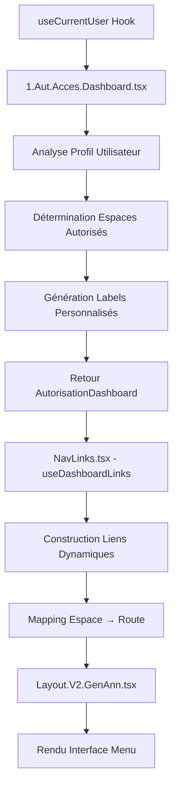

# Gestion du Menu Gauche - LeadGenAI AdBuilder
## Documentation Stratégique Complète

---

## 📋 RÉSUMÉ EXÉCUTIF

### Vue d'Ensemble
Le système de navigation gauche de LeadGenAI AdBuilder repose sur une **architecture bicéphale** avec séparation claire des responsabilités :
- **Hook d'autorisation** : détermine les droits d'accès selon le profil utilisateur
- **Gestionnaire de navigation** : transforme ces droits en interface concrète

### Structure Générale
Le menu gauche comprend **2 sections principales** :
1. **"Vos Assistants IA"** - Section métier (génération annonces, outils marketing)
2. **"Dashboard"** - Section tableau de bord (espaces utilisateur selon droits)

---

## 🏗️ ARCHITECTURE TECHNIQUE MODERNE

### 📁 Fichiers Clés et Responsabilités

#### 1. Hook d'Autorisation : `1.Aut.Acces.Dashboard.tsx`
**Rôle** : Logique pure d'autorisation selon profil utilisateur

**Responsabilités** :
- Analyse du profil utilisateur (`roleSysteme`, `utilisateurTypeCompte`)
- Détermination des espaces autorisés selon la hiérarchie
- Génération des labels personnalisés pour chaque espace
- Retour d'un objet `AutorisationDashboard` standardisé

**Types et Interface** :
```typescript
export type EspaceAutoriseType = 
  | "ADMIN-PRESENCA" 
  | "RESEAU-ESPACE" 
  | "CLIENT-ESPACE" 
  | "COLLABORATEUR-ESPACE";

export interface AutorisationDashboard {
  espacesAutorises: EspaceAutoriseType[];
  labelsEspaces: { espace: EspaceAutoriseType; label: string }[];
  isAutorised: boolean;
}
```

#### 2. Gestionnaire Navigation : `NavLinks.tsx`
**Rôle** : Transformation des autorisations en navigation concrète

**Responsabilités** :
- Configuration des liens métier ("Vos Assistants IA")
- Consommation du hook d'autorisation
- Construction dynamique des liens Dashboard
- Mapping espace → route → état actif
- Gestion état d'expansion et progression des étapes

---

## 🔐 SYSTÈME D'AUTORISATION HIÉRARCHIQUE

### 🎯 Matrice des Droits d'Accès

#### 1. Admin PRESENCA (Droits Complets)
```typescript
if (user.roleSysteme === "admin_presenca") {
  return {
    espacesAutorises: ["ADMIN-PRESENCA", "RESEAU-ESPACE", "CLIENT-ESPACE", "COLLABORATEUR-ESPACE"],
    labelsEspaces: [
      { espace: "ADMIN-PRESENCA", label: "Mon Espace Admin" },
      { espace: "RESEAU-ESPACE", label: "Espace Réseau" },
      { espace: "CLIENT-ESPACE", label: "Espace Client" },
      { espace: "COLLABORATEUR-ESPACE", label: "Espace Collaborateur" }
    ],
    isAutorised: true
  };
}
```
**Résultat Interface** : 4 liens Dashboard visibles

#### 2. Réseau / Direction Réseau
```typescript
if (["reseau", "reseau_direction"].includes(user.utilisateurTypeCompte)) {
  return {
    espacesAutorises: ["RESEAU-ESPACE"],
    labelsEspaces: [{ espace: "RESEAU-ESPACE", label: "Mon Espace Réseau" }]
  };
}
```
**Résultat Interface** : 1 lien "Mon Espace Réseau"

#### 3. Responsables Agences
```typescript
if (["reseau_agence", "reseau_agence_responsable", "agence_independante", "agence_independante_responsable"].includes(user.utilisateurTypeCompte)) {
  return {
    espacesAutorises: ["CLIENT-ESPACE"],
    labelsEspaces: [{ espace: "CLIENT-ESPACE", label: "Mon Espace Client" }]
  };
}
```
**Résultat Interface** : 1 lien "Mon Espace Client"

#### 4. Collaborateurs
```typescript
if (["reseau_agence_collaborateur", "agence_independante_collaborateur"].includes(user.utilisateurTypeCompte)) {
  return {
    espacesAutorises: ["COLLABORATEUR-ESPACE"],
    labelsEspaces: [{ espace: "COLLABORATEUR-ESPACE", label: "Mon Espace Collaborateur" }]
  };
}
```
**Résultat Interface** : 1 lien "Mon Espace Collaborateur"

### 🔄 Mapping Espace → Route
```typescript
switch (espace) {
  case "ADMIN-PRESENCA": routePath = "/admin-presenca"; break;
  case "RESEAU-ESPACE": routePath = "/espace-reseau"; break;
  case "CLIENT-ESPACE": routePath = "/espace-client"; break;
  case "COLLABORATEUR-ESPACE": routePath = "/espace-collaborateur"; break;
}
```

---

## 🎯 SECTION "VOS ASSISTANTS IA"

### 📋 Configuration Actuelle
```typescript
export const navLinks: NavLink[] = [
  { to: "/accueil-leadgenai", label: "Accueil", isActive: false },
  { 
    to: "/etape1", 
    label: "Bien à vendre ou à louer", 
    expanded: false,
    subLinks: [
      { to: "/etape1", label: "Éléments clés" },
      { to: "/etape2", label: "Infos de description" },
      { to: "/etape3", label: "Infos Financières" },
      { to: "/etape4", label: "Autres détails" },
      { to: "/etape6communication", label: "Annonces et Outils Marketing" }
    ]
  },
  { to: "/zone-chalandise", label: "Zone de Chalandise à analyser" },
  { to: "/newsletter-builder", label: "Newsletter à lancer" },
  // Éléments en développement (to: "#")
  { to: "#", label: "Landing Page à créer" },
  { to: "#", label: "Bases de données à constituer" },
  { to: "#", label: "Prospects à relancer" },
  { to: "#", label: "Contenus à rédiger" },
  { to: "#", label: "Publicités à diffuser" }
];
```

### 🔐 Système de Déblocage Progressif
**Logique** : Étapes débloquées séquentiellement selon validation
**Stockage** : `localStorage.stepProgress`
**Contrôle** : Fonction `isStepUnlocked()`

---

## 🎨 SYSTÈME GRAPHIQUE

### 📁 Fichiers Design
**CSS Principal** : `src/components/navigation-site-leadgenaiadbuilder/1.GraphismeMenuGauche/Graphisme.css`

### 🎨 Palette de Couleurs
- **Fond sidebar** : `#F1F0FC` (gris-mauve clair)
- **Header logo** : `#5E50A6` (violet)  
- **Lien actif** : `#4A2B87` (violet foncé)
- **Texte normal** : `#000000` (noir)
- **Hover** : `rgba(94, 80, 166, 0.1)` (violet transparent)

### 📱 Responsive Design
- **Mobile** : menu hamburger avec overlay
- **Breakpoint** : 767px
- **Largeur mobile** : 70% de l'écran

---

## 🔄 FLUX DE DONNÉES



---

## 📈 ÉVOLUTIONS ET SÉCURISATION FUTURE

### 🛡️ Protection des Routes (À Venir)
**Référence** : `ToDoList.SecurisationdesRoutes`

**Objectif** : Compléter l'autorisation menu par une sécurisation route
- **Actuellement** : Menu adapté selon droits utilisateur
- **Futur** : Protection côté route + redirection sécurisée
- **Principe** : Double vérification (menu + route) pour sécurité renforcée

### 🚀 Fonctionnalités en Développement
**Éléments placeholder à activer** :
- Landing Page à créer
- Bases de données à constituer  
- Prospects à relancer
- Contenus à rédiger
- Publicités à diffuser

---

## ✅ AVANTAGES DE L'ARCHITECTURE ACTUELLE

### 🎯 Séparation des Responsabilités
- **Hook autorisation** : logique métier pure, réutilisable
- **NavLinks** : logique interface, spécialisée navigation
- **Maintenance facilitée** : modifications isolées par fonction

### 🔧 Extensibilité
- **Nouveaux espaces** : ajout simple dans le hook
- **Nouvelles routes** : mapping automatique
- **Personnalisation labels** : configuration centralisée

### 🛡️ Robustesse
- **Gestion erreurs** : fallback sécurisé (pas d'autorisation)
- **États de chargement** : interface progressive
- **Types TypeScript** : prévention erreurs compilation

---

## 🎯 CONCLUSION

Le système de gestion du menu gauche présente une **architecture moderne et évolutive** :

### ✅ Points Forts
- **Séparation claire** : Hook autorisation + Gestionnaire navigation
- **Système hiérarchique** : 4 niveaux d'accès bien définis
- **Interface adaptative** : Menu dynamique selon profil
- **Code maintenable** : Types stricts + responsabilités isolées

### 🚀 Perspectives
- **Sécurisation routes** : Protection double niveau (menu + route)
- **Fonctionnalités futures** : 5 éléments en développement
- **Évolutions possibles** : Nouveaux espaces, personnalisation avancée

Le système est **prêt pour l'extension** et constitue une base solide pour les développements futurs de l'application.

---

**Date Dernière MàJ** : 10/09/2025  
**Fichiers Concernés** : `1.Aut.Acces.Dashboard.tsx`, `NavLinks.tsx`, `Layout.V2.GenAnn.tsx`  
**Status** : Architecture stabilisée ✅
