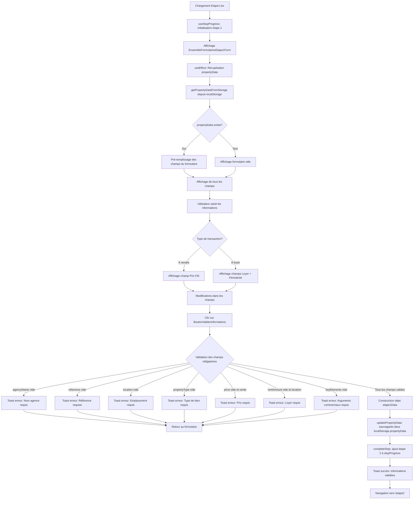

# 📋 **DOCUMENTATION EXHAUSTIVE - ÉTAPE 1 : ÉLÉMENTS CLÉS**

## **🎯 MISSION DU DOCUMENT**
- Cette documentation constitue la Bible complète de l'**Étape 1** du processus de génération d'annonces en mode **localStorage**.
- Elle recense **TOUS** les fichiers, fonctions, composants, champs de formulaire, validations, contraintes, interactions, et flux de données utilisés dans cette étape.
- Objectif : fournir une base d'audit exhaustive avant la migration vers Supabase.

---
## **📑 SOMMAIRE CLIQUABLE - ÉTAPE 1**

### **Structure du document**
- [🎯 MISSION DU DOCUMENT](#-mission-du-document)
- [📂 I. ARCHITECTURE GLOBALE DE L'ÉTAPE 1](#-i-architecture-globale-de-ltape-1)
- [📁 II. FICHIERS UTILISÉS (Liste exhaustive)](#-ii-fichiers-utilisés-liste-exhaustive)
- [III. STRUCTURE DES DONNÉES DANS `localStorage`](#iii-structure-des-données-dans-localstorage)
- [IV. LOGIQUE DE VALIDATION DES CHAMPS](#iv-logique-de-validation-des-champs)
- [V. CONTRAINTES ET RÈGLES MÉTIER](#v-contraintes-et-règles-métier)
- [VI. NAVIGATION ET RETOUR EN ARRIÈRE](#vi-navigation-et-retour-en-arrière)
- [VII. UTILISATION DES DONNÉES PAR OPENAI](#vii-utilisation-des-données-par-openai)
- [VIII. PROCESSUS COMPLET ÉTAPE PAR ÉTAPE](#viii-processus-complet-étape-par-étape)
- [IX. ÉLÉMENTS CACHÉS / CONDITIONNELS](#ix-éléments-cachés--conditionnels)
- [X. TIMER DE SESSION (DÉSACTIVÉ MAIS PRÉSENT)](#x-timer-de-session-désactivé-mais-présent)
- [XI. RÉCAPITULATIF DES CLÉS `localStorage`](#xi-récapitulatif-des-clés-localstorage)
- [XII. DONNEES DE L'ETAPE 1 À PRENDRE EN CONSIDÉRATION](#xii-donnees-de-letape-1-à-prendre-en-considération)

---

---
## **📂 I. ARCHITECTURE GLOBALE DE L'ÉTAPE 1**

### **Vue d'ensemble**
- L'Étape 1 (route `/etape1`) permet à l'utilisateur de saisir les **éléments clés** d'un bien immobilier commercial.
- Ces données sont **stockées dans le localStorage** sous la clé `"propertyData"` au format JSON. E
- lles servent de base pour les étapes suivantes (2, 3, 4) et pour la génération d'annonces par OpenAI à l'Étape 5.

### **Flux de données simplifié**
```
Utilisateur saisit le formulaire
         ↓
EnsembleFormulairesEtape1Form (gestion state local)
         ↓
handleValidation() - Validation des champs
         ↓
updatePropertyData() - Stockage dans localStorage clé "propertyData"
         ↓
completeStep(1) - Déverrouillage Étape 2 dans localStorage clé "stepProgress"
         ↓
navigate("/etape2") - Navigation vers Étape 2
```
---

---

## 📝 Détails du flux

### 🔄 Phases principales

1. **Initialisation** (A→C)
   - Chargement de `Etape1.tsx`
   - Initialisation `useStepProgress(1)`
   - Affichage du composant formulaire

2. **Chargement des données** (D→I)
   - `useEffect` récupère `propertyData` via `getPropertyDataFromStorage()`
   - Si données existantes → pré-remplissage
   - Si aucune donnée → formulaire vide

3. **Saisie utilisateur** (J→N)
   - Affichage conditionnel selon `saleType`
   - Vente: champ "Prix FAI"
   - Location: champs "Loyer HT/HC" + "Périodicité"

4. **Validation** (O→R)
   - **7 validations** obligatoires
   - Toasts d'erreur spécifiques pour chaque champ manquant
   - Retour au formulaire si erreur

5. **Sauvegarde et navigation** (S→W)
   - Construction de l'objet `etape1Data`
   - `updatePropertyData()` → sauvegarde dans `localStorage.propertyData`
   - `completeStep(1)` → ajout étape 2 dans `stepProgress`
   - Toast de succès
   - Navigation vers `/etape2`

---

## **📁 II. FICHIERS UTILISÉS (Liste exhaustive)**

### **1. Fichiers de page principale**

#### **`src/1.etapes-generation-annonces/etape1/Etape1.tsx`**
**Rôle** : Composant page principale de l'Étape 1.
- **Responsabilités** :
  - Affiche le layout global avec `LayoutV2GenAnn`
  - Affiche le hero header avec `StructureHeroPetit`
  - Intègre le formulaire via `EnsembleFormulairesEtape1Form` (avec référence `ref`)
  - Affiche la colonne latérale avec `DirectivesMenuOnglet` et `EtapeFAQ`
  - Gère la visibilité pour forcer le rechargement des données

- **Imports clés** :
  ```typescript
  import LayoutV2GenAnn from "@/components/atemplate.v2.generation-annonces/Layout.V2.GenAnn";
  import StructureHeroPetit from "@/0.structure-type-page/structure5HeroPetit/StructureHeroPetit";
  import DirectivesMenuOnglet from "@/components/atemplate.v2.generation-annonces/DirectivesMenuOnglet";
  import { EtapeFAQ } from "@/components/1-Sources-Generation-Annonces/help/EtapeFAQ";
  import { useStepProgress } from "@/components/1-Sources-Generation-Annonces/utils/useStepProgress";
  import EnsembleFormulairesEtape1Form from "@/components/1-Sources-Generation-Annonces/form-etape1/EnsembleFormulairesEtape1Form";
  ```

- **Hooks utilisés** :
  - `useStepProgress(1)` : Gère la progression et le déblocage des étapes
  - `useRef` : Référence au formulaire pour appel de `handleValidation()`

- **Données configurées** :
  - `headerTitle` : "Bienvenue sur votre Générateur d'Annonces et d'Outils SEO"
  - `headerSubtitle` : "Notre générateur a été conçu pour vous permettre de structurer et optimiser vos annonces en toute simplicité."
  - `headerText` : Contient instructions HTML (avec ``)
  - `card1CentreTitre` : "Éléments Clés"

- **Fonction de validation** :
  ```typescript
  const handleValidation = () => {
    if (formulaireRef.current) {
      const isValid = formulaireRef.current.handleValidation();
      if (isValid) {
        completeStep(1);
        navigate("/etape2");
      }
    }
  };
  ```

---

### **2. Composant formulaire principal**

#### **`src/components/1-Sources-Generation-Annonces/form-etape1/EnsembleFormulairesEtape1Form.tsx`**
**Rôle** : Composant formulaire contenant TOUS les champs de saisie de l'Étape 1.

- **Structure** :
  - `forwardRef` pour exposer la méthode `handleValidation()` au parent via `useImperativeHandle`
  - Gère **10 states locaux** (un par champ de formulaire)
  - Charge les données depuis `localStorage` au montage (`useEffect`)
  - Valide et sauvegarde les données via `updatePropertyData()`

- **États locaux (States)** :
  ```typescript
  const [agencyName, setAgencyName] = useState("");           // Nom de l'Agence
  const [reference, setReference] = useState("");             // Référence du bien
  const [exclusivite, setExclusivite] = useState("Non");      // Exclusivité (Oui/Non)
  const [location, setLocation] = useState("");               // Emplacement
  const [propertyType, setPropertyType] = useState("");       // Type de bien
  const [saleType, setSaleType] = useState("à vendre");       // Type de transaction (à vendre/à louer)
  const [price, setPrice] = useState("");                     // Prix FAI
  const [rentAmount, setRentAmount] = useState("");           // Loyer HT/HC
  const [rentPeriodicity, setRentPeriodicity] = useState("Mensuel"); // Périodicité loyer
  const [keyElements, setKeyElements] = useState("");         // Arguments commerciaux
  ```

- **Options de sélection** :
  ```typescript
  const exclusiviteOptions = [
    { id: "Oui", label: "Oui" },
    { id: "Non", label: "Non" }
  ];

  const saleTypeOptions = [
    { id: "à vendre", label: "À vendre" },
    { id: "à louer", label: "À louer" }
  ];

  const rentPeriodicityOptions = [
    { id: "Mensuel", label: "Mensuel" },
    { id: "Trimestriel", label: "Trimestriel" },
    { id: "Annuel", label: "Annuel" }
  ];
  ```

- **Chargement des données (`useEffect`)** :
  ```typescript
  useEffect(() => {
    const loadData = () => {
      const propertyData = getPropertyDataFromStorage(); // Lecture localStorage
      if (Object.keys(propertyData).length > 0) {
        setAgencyName(propertyData.agencyName || "");
        setReference(propertyData.reference || "");
        setExclusivite(propertyData.exclusivite || "Non");
        setLocation(propertyData.location || "");
        setPropertyType(propertyData.propertyType || "");
        setSaleType(propertyData.saleType || "à vendre");
        setPrice(propertyData.price || "");
        setRentAmount(propertyData.rentAmount || "");
        setRentPeriodicity(propertyData.rentPeriodicity || "Mensuel");
        setKeyElements(propertyData.keyElements || "");
      }
    };
    loadData();

    // Rechargement au retour focus
    window.addEventListener('focus', loadData);
    return () => window.removeEventListener('focus', loadData);
  }, []);
  ```

- **Validation des champs (`handleValidation`)** :
  ```typescript
  const handleValidation = () => {
    // 1. Vérification champ obligatoire "agencyName"
    if (!agencyName.trim()) {
      toast({
        title: "Erreur de validation",
        description: "Veuillez saisir le nom de votre agence.",
        variant: "destructive"
      });
      return false;
    }

    // 2. Vérification "reference"
    if (!reference.trim()) {
      toast({ description: "Veuillez saisir une référence pour le bien." });
      return false;
    }

    // 3. Vérification "location"
    if (!location.trim()) {
      toast({ description: "Veuillez saisir l'emplacement du bien." });
      return false;
    }

    // 4. Vérification "propertyType"
    if (!propertyType.trim()) {
      toast({ description: "Veuillez saisir le type de bien." });
      return false;
    }

    // 5. Vérification conditionnelle "price" (si vente)
    if (saleType === "à vendre" && !price.trim()) {
      toast({ description: "Veuillez saisir le prix du bien." });
      return false;
    }

    // 6. Vérification conditionnelle "rentAmount" (si location)
    if (saleType === "à louer" && !rentAmount.trim()) {
      toast({ description: "Veuillez saisir le montant du loyer." });
      return false;
    }

    // 7. Vérification "keyElements"
    if (!keyElements.trim()) {
      toast({ description: "Veuillez saisir au moins un argument commercial." });
      return false;
    }

    // 8. Sauvegarde dans localStorage
    const etape1Data = {
      agencyName, reference, exclusivite, location, propertyType,
      saleType, price, rentAmount, rentPeriodicity, keyElements
    };
    updatePropertyData(etape1Data); // Stockage clé "propertyData"

    toast({
      title: "Informations validées",
      description: "Vos informations ont été enregistrées avec succès.",
    });

    return true;
  };
  ```

- **Soumission formulaire** :
  ```typescript
  const handleFormSubmit = () => {
    if (handleValidation()) {
      completeStep(1); // Débloque étape 2 (localStorage "stepProgress")
      navigate("/etape2");
    }
  };
  ```

- **Contenu d'aide (SgaHelpBox)** :
  - Titre : "Arguments commerciaux"
  - Contenu : Instructions détaillées sur les arguments commerciaux (points forts, conditions locatives, rareté...)

---

### **3. Composants de champs de formulaire**

#### **`src/components/1-Sources-Generation-Annonces/form-components/TextFieldForm.tsx`**
**Rôle** : Champ texte simple avec capitalisation automatique de la première lettre.

- **Props** :
  ```typescript
  interface TextFieldFormProps {
    id: string;
    title: string;
    placeholder?: string;
    value: string;
    onChange: (e: React.ChangeEvent) => void;
    className?: string;
    required?: boolean;
  }
  ```

- **Logique de capitalisation** :
  ```typescript
  const handleInputChange = (e: React.ChangeEvent) => {
    const newText = e.target.value;
    if (newText.length > 0) {
      e.target.value = newText.charAt(0).toUpperCase() + newText.slice(1);
    }
    onChange(e);
  };
  ```

- **Styles** :
  - Label : `text-[14px] text-black font-bold`
  - Input : `h-[42px] rounded-md bg-[#ffffff] border border-[#B8C8DC] text-[14px]`
  - Focus : `focus:ring-2 focus:ring-[#5E50A6]`

- **Champs utilisant TextFieldForm** :
  1. `agencyName` (id: "agencyName", titre: "Nom de l'Agence", placeholder: "Votre agence immobilière", required: true)
  2. `reference` (id: "reference", titre: "Référence", placeholder: "Référence du bien", required: true)
  3. `location` (id: "location", titre: "Emplacement", placeholder: "Ville, Arrondissement, Département...", required: true)
  4. `propertyType` (id: "propertyType", titre: "Type de bien", placeholder: "Restaurant, Commerce, Local Commercial...", required: true)

---

#### **`src/components/1-Sources-Generation-Annonces/form-components/MonetaryFieldForm.tsx`**
**Rôle** : Champ monétaire avec formatage automatique (espaces milliers + symbole €).

- **Props** :
  ```typescript
  interface MonetaryFieldFormProps {
    id: string;
    title: string;
    placeholder?: string;
    value: string;
    onChange: (e: React.ChangeEvent) => void;
    currency?: string; // Par défaut "€"
    className?: string;
    required?: boolean;
  }
  ```

- **Logique de formatage** :
  ```typescript
  const handleChange = (e: React.ChangeEvent) => {
    const inputValue = e.target.value;
    const valueWithoutCurrency = inputValue.replace(/€/g, '');

    // Autoriser valeur vide
    if (valueWithoutCurrency.trim() === '') {
      onChange({ ...e, target: { ...e.target, value: '' } });
      return;
    }

    // Supprimer caractères non-numériques
    const cleanValue = valueWithoutCurrency.replace(/[^\d\s]/g, '');
    const numericOnly = cleanValue.replace(/\s/g, '');

    // Formatage avec espaces (milliers)
    const formattedValue = numericOnly.replace(/\B(?=(\d{3})+(?!\d))/g, ' ');
    const finalValue = formattedValue ? `${formattedValue}€` : "";

    onChange({ ...e, target: { ...e.target, value: finalValue } });
  };
  ```

- **Comportement au focus** :
  ```typescript
  const handleFocus = (e: React.FocusEvent) => {
    e.target.select(); // Sélection totale au focus
  };
  ```

- **Champs utilisant MonetaryFieldForm** :
  1. `price` (id: "price", titre: "Prix FAI", placeholder: "450 000€", currency: "€", required: true, **visible uniquement si** `saleType === "à vendre"`)
  2. `rentAmount` (id: "rentAmount", titre: "Loyer HT/HC", placeholder: "1 200€", currency: "€", required: true, **visible uniquement si** `saleType === "à louer"`)

---

#### **`src/components/1-Sources-Generation-Annonces/form-components/SelectionButtonRond.tsx`**
**Rôle** : Boutons radio stylisés (points ronds).

- **Props** :
  ```typescript
  interface SelectionButtonRondProps {
    id: string;
    options: { id: string; label: string }[];
    selectedOption: string;
    onChange: (option: string) => void;
    className?: string;
    label?: string;
    required?: boolean;
  }
  ```

- **Rendu** :
  - Conteneur : `inline-flex bg-[#ffff] rounded-md border border-[#B8C8DC]`
  - Chaque option : Cercle externe (`border-2 border-[#5E50A6]`) + Cercle interne plein si sélectionné (`bg-[#5E50A6]`)

- **Champs utilisant SelectionButtonRond** :
  1. `exclusivite` (id: "exclusivite", label: "Exclusivité", options: ["Oui", "Non"], selectedOption: "Non" par défaut, required: true)
  2. `saleType` (id: "saleType", label: "Type de transaction", options: ["à vendre", "à louer"], selectedOption: "à vendre" par défaut, required: true)
  3. `rentPeriodicity` (id: "rentPeriodicity", label: "Périodicité du loyer", options: ["Mensuel", "Trimestriel", "Annuel"], selectedOption: "Mensuel" par défaut, required: true, **visible uniquement si** `saleType === "à louer"`)

---

#### **`src/components/1-Sources-Generation-Annonces/form-components/FormulaireSaisie.tsx`**
**Rôle** : Zone de texte multiligne (textarea) avec formatage automatique :
- Ajout automatique de puces (`• `) en début de ligne
- Capitalisation de la première lettre après la puce
- Ajustement dynamique de la hauteur

- **Props** :
  ```typescript
  interface FormulaireSaisieProps {
    id: string;
    title: string;
    value: string;
    onChange: (e: React.ChangeEvent) => void;
    placeholder?: string;
    className?: string;
    minRows?: number; // Nombre min de lignes
    readOnly?: boolean;
    required?: boolean;
  }
  ```

- **Logique de formatage** :
  ```typescript
  const handleInputChange = (e: React.ChangeEvent) => {
    let text = e.target.value;
    const lines = text.split('\n');

    const formattedLines = lines.map((line, index) => {
      // Ignorer ligne vide
      if (!line.trim()) return line;

      // Ajouter puce si absente
      if (!line.startsWith('• ')) {
        line = '• ' + line.replace(/^[•\s]+/, '');
      }

      // Capitaliser après la puce
      if (line.length > 2) {
        line = '• ' + line.charAt(2).toUpperCase() + line.slice(3);
      }

      return line;
    });

    const formattedText = formattedLines.join('\n');
    e.target.value = formattedText;
    onChange(e);
    adjustHeight(e.target);
  };
  ```

- **Champs utilisant FormulaireSaisie** :
  1. `keyElements` (id: "keyElements", titre: "Arguments commerciaux", placeholder: "Listez 5 arguments commerciaux forts en votre possession...", minRows: 8, required: true)

---

#### **`src/components/1-Sources-Generation-Annonces/form-components/BoutonValiderInformations.tsx`**
**Rôle** : Bouton de validation du formulaire.

- **Props** :
  ```typescript
  interface BoutonValiderInformationsProps {
    onClick?: () => void;
    disabled?: boolean;
    width?: string; // Défaut: "auto"
    height?: string; // Défaut: "70px"
    className?: string;
  }
  ```

- **Apparence** :
  - Texte : "Valider mes informations"
  - Icône : `` (Lucide)
  - Gradient : `from-[#4C1D96] to-[#6C28D8]`
  - Hover : `from-[#244BD8] to-[#7B24CF]` + `scale-105`

---

### **4. Composants d'aide et support**

#### **`src/components/1-Sources-Generation-Annonces/help/SgaHelpBox.tsx`**
**Rôle** : Boîte d'aide avec icône, titre et contenu.

- **Props** :
  ```typescript
  interface SgaHelpBoxProps {
    title: string;
    content: React.ReactNode;
    icon?: React.ReactNode; // Défaut: 
    className?: string;
  }
  ```

- **Utilisation dans Étape 1** :
  - Affichée **sous le bouton "Valider mes informations"**
  - Titre : "Arguments commerciaux"
  - Icône : ``
  - Contenu : Instructions détaillées (voir ligne 206-220 de `EnsembleFormulairesEtape1Form.tsx`)

---

#### **`src/components/1-Sources-Generation-Annonces/help/EtapeFAQ.tsx`**
**Rôle** : FAQ spécifique à chaque étape.

- **Props** :
  ```typescript
  interface EtapeFAQProps {
    etape: "etape1" | "etape2" | "etape3" | "etape4";
  }
  ```

- **Contenu pour `etape="etape1"`** :
  - Titre : "Quelles informations intégrer ?"
  - Icône : ``
  - Contenu :
    - Type de bien, Emplacement (SEO), Prix FAI, Loyer
    - Message : "Plus vous fournissez d'informations précises, plus l'IA pourra générer une annonce originale..."

---

### **5. Utilitaires de gestion d'état et stockage**

#### **`src/services/openai.ts`**
**Rôle** : Service centralisé pour :
1. Gérer le stockage/récupération des données de formulaire (localStorage)
2. Communiquer avec OpenAI API (utilisé en Étape 5)

- **Interface des données** :
  ```typescript
  export interface PropertyData {
    // Étape 1
    agencyName?: string;
    reference?: string;
    exclusivite?: string;
    location?: string;
    propertyType?: string;
    saleType?: string;
    price?: string;
    rentAmount?: string;
    rentPeriodicity?: string;
    keyElements?: string;

    // Étape 2
    propertyDescription?: string;

    // Étape 3
    financials?: string;

    // Étape 4
    details?: string;
    hasNoDetails?: boolean;
  }
  ```

- **Fonction `getPropertyDataFromStorage()`** :
  ```typescript
  export const getPropertyDataFromStorage = (): PropertyData => {
    try {
      const data = localStorage.getItem("propertyData");
      return data ? JSON.parse(data) : {};
    } catch (error) {
      console.error("Error parsing property data from storage:", error);
      return {};
    }
  };
  ```
  - **Clé localStorage** : `"propertyData"`
  - **Format** : JSON stringifié

- **Fonction `updatePropertyData()`** :
  ```typescript
  export const updatePropertyData = (newData: Partial): PropertyData => {
    try {
      const existingData = getPropertyDataFromStorage();
      const updatedData = { ...existingData, ...newData }; // Merge
      localStorage.setItem("propertyData", JSON.stringify(updatedData));
      return updatedData;
    } catch (error) {
      console.error("Error updating property data in storage:", error);
      return newData as PropertyData;
    }
  };
  ```
  - **Comportement** : Merge avec données existantes (ne remplace pas tout)

- **Fonction `clearPropertyData()`** :
  ```typescript
  export const clearPropertyData = (): void => {
    localStorage.removeItem("propertyData");
  };
  ```

---

#### **`src/components/1-Sources-Generation-Annonces/utils/useStepProgress.ts`**
**Rôle** : Hook pour gérer la progression des étapes (déblocage séquentiel).

- **Clé localStorage** : `"stepProgress"`
- **Format** : Tableau JSON d'entiers (ex: `[1, 2, 3]` = Étapes 1, 2, 3 disponibles)

- **État** :
  ```typescript
  const [availableSteps, setAvailableSteps] = useState([1]);
  const [hasCompletedStep4, setHasCompletedStep4] = useState(false);
  ```

- **Chargement au montage** :
  ```typescript
  useEffect(() => {
    const savedProgress = localStorage.getItem('stepProgress');
    if (savedProgress) {
      const progress = JSON.parse(savedProgress);
      setAvailableSteps(progress);
      if (progress.includes(5)) setHasCompletedStep4(true);
    }
  }, []);
  ```

- **Fonction `completeStep(step: number)`** :
  ```typescript
  const completeStep = (step: number) => {
    const nextStep = step + 1;
    const newAvailableSteps = [...new Set([...availableSteps, nextStep])];
    setAvailableSteps(newAvailableSteps);
    localStorage.setItem('stepProgress', JSON.stringify(newAvailableSteps));

    if (step === 4) setHasCompletedStep4(true);
  };
  ```
  - **Exemple** : `completeStep(1)` → Ajoute `2` dans `stepProgress`

- **Fonction `getDisabledSteps()`** :
  ```typescript
  const getDisabledSteps = () => {
    const allSteps = [1, 2, 3, 4, 5];
    return allSteps.filter(step => !availableSteps.includes(step));
  };
  ```

- **Fonction `handleConfirmNewProject()`** :
  ```typescript
  const handleConfirmNewProject = () => {
    localStorage.clear(); // Supprime TOUT
    toast({ title: "Projet réinitialisé" });
    navigate('/etape1');
    window.location.reload(); // Force rechargement
  };
  ```

---

#### **`src/components/1-Sources-Generation-Annonces/utils/useBoutonGenerationNewProjet.tsx`**
**Rôle** : Hook pour gérer le bouton "Générer un nouveau projet".

- **Fonction exposée** :
  ```typescript
  const handleConfirmNewProject = () => {
    localStorage.clear(); // Supprime propertyData, stepProgress, etc.
    toast({ title: "Projet réinitialisé", description: "Toutes les données ont été effacées." });
    navigate('/etape1');
    window.location.reload();
  };
  ```

- **Utilisation** :
  - Dans `DirectivesMenuOnglet.tsx` (colonne latérale)
  - Affiche une `AlertDialog` de confirmation avant d'exécuter `handleConfirmNewProject()`

---

### **6. Composants de navigation et layout**

#### **`src/components/atemplate.v2.generation-annonces/DirectivesMenuOnglet.tsx`**
**Rôle** : Menu latéral avec navigation entre étapes + boutons d'action.

- **Props** :
  ```typescript
  interface DirectivesMenuOngletProps {
    activeStep?: number; // Étape actuelle
    disabledSteps?: number[]; // Étapes désactivées
  }
  ```

- **Hooks utilisés** :
  ```typescript
  const { hasCompletedStep4, goToEtape5, isStepAvailable } = useStepProgress(activeStep);
  const { handleConfirmNewProject } = useBoutonGenerationNewProjet();
  ```

- **Structure visuelle** :
  1. **Grille 2x2 de cartes colorées** (navigation vers étapes 1-4) :
     - Carte verte (Étape 1) : Icône ``, Texte "Éléments Clés"
     - Carte bleue (Étape 2) : Icône ``, Texte "Infos de Description"
     - Carte violette (Étape 3) : Icône ``, Texte "Infos Financières"
     - Carte orange (Étape 4) : Icône ``, Texte "Autres Détails"
     - **Opacité réduite si étape désactivée** : `opacity-50 cursor-not-allowed`

  2. **Bouton "Valider mon projet"** (composant `BoutonValiderProjet`) :
     - **Visible uniquement si** `hasCompletedStep4 === true` ET `activeStep !== 5`
     - Action : `goToEtape5()` → Navigation vers `/etape5`

  3. **Bouton "Générer un nouveau projet"** (composant `BoutonNouveauProjet`) :
     - Icône ``
     - Affiche `AlertDialog` de confirmation
     - Action confirmée : `handleConfirmNewProject()` (supprime tout localStorage)

---

#### **`src/components/atemplate.v2.generation-annonces/Layout.V2.GenAnn.tsx`**
**Rôle** : Layout global de l'application (sidebar gauche + contenu principal).

- **Structure** :
  - Sidebar gauche :
    - Logo (image)
    - Menu de navigation (généré par `useNavLinks()`)
    - Menu Dashboard (généré par `useDashboardLinks()`)
  - Contenu principal : `{children}` (le contenu de la page Étape 1)

- **Props** :
  ```typescript
  interface LayoutV2GenAnnProps {
    children: React.ReactNode;
    logoSrc?: string;
    navTitle?: string;
    navLinks?: NavLink[];
  }
  ```

---

#### **`src/0.structure-type-page/structure5HeroPetit/StructureHeroPetit.tsx`**
**Rôle** : Section hero en haut de page (titre, sous-titre, description, image).

- **Props** :
  ```typescript
  interface StructureHeroPetitProps {
    title: string;
    subtitle: string;
    description: string;
    imageSrc?: string;
    className?: string;
    buttonText?: string;
    buttonLink?: string;
    onButtonClick?: () => void;
    allowHTML?: boolean; // Permet d'insérer du HTML (ex: )
  }
  ```

- **Apparence** :
  - Fond : `bg-realestate-purple-dark`
  - Titre H1 : `text-[32px] font-bold text-[#ffffff]`
  - Sous-titre H2 : `text-[20px] text-[#F1940F] font-bold`
  - Description : `text-white text-[15px]`
  - Image : Affichée à droite (cachée sur mobile)

---

### **7. Composants de boutons d'action**

#### **`src/components/1-Sources-Restitution-Utilisateur/0.Etape6Communication/BoutonNouveauProjet.tsx`**
**Rôle** : Bouton "Générer un nouveau projet".

- **Apparence** :
  - Gradient : `from-[#470135] to-[#860265]`
  - Texte : `text-[#FD62F7]` - "Générer un nouveau projet" (3 lignes)
  - Icône : `` (en bas à droite)
  - Hover : `scale-105`

---

#### **`src/components/1-Sources-Generation-Annonces/form-components/BoutonValiderProjet.tsx`**
**Rôle** : Bouton "Revenir à l'Étape Génération des Annonces" (vers Étape 5).

- **Apparence** :
  - Gradient : `from-[#0B2B6C] to-[#0E3A96]`
  - Texte : "Revenir à l'Etape Génération des Annonces" (3 lignes)
  - Icône : `` (en bas à droite)

---

## **III. STRUCTURE DES DONNÉES DANS `localStorage`**

### **Clé `"propertyData"` (données du formulaire)**

#### **Format JSON** :
```json
{
  "agencyName": "Presenca Immobilier",
  "reference": "REF-12345",
  "exclusivite": "Oui",
  "location": "Paris 15e",
  "propertyType": "Restaurant",
  "saleType": "à vendre",
  "price": "450 000€",
  "rentAmount": "",
  "rentPeriodicity": "Mensuel",
  "keyElements": "• Emplacement premium\n• Fort potentiel\n• Clientèle fidèle"
}
```

#### **Champs Étape 1** :
| **Nom du champ** | **Type** | **Valeur par défaut** | **Obligatoire** | **Condition d'affichage** |
|---|---|---|---|---|
| `agencyName` | `string` | `""` | ✅ Oui | Toujours |
| `reference` | `string` | `""` | ✅ Oui | Toujours |
| `exclusivite` | `string` | `"Non"` | ✅ Oui | Toujours |
| `location` | `string` | `""` | ✅ Oui | Toujours |
| `propertyType` | `string` | `""` | ✅ Oui | Toujours |
| `saleType` | `string` | `"à vendre"` | ✅ Oui | Toujours |
| `price` | `string` | `""` | ⚠️ Oui (si vente) | Visible si `saleType === "à vendre"` |
| `rentAmount` | `string` | `""` | ⚠️ Oui (si location) | Visible si `saleType === "à louer"` |
| `rentPeriodicity` | `string` | `"Mensuel"` | ✅ Oui | Visible si `saleType === "à louer"` |
| `keyElements` | `string` | `""` | ✅ Oui | Toujours |

---

### **Clé `"stepProgress"` (progression des étapes)**

#### **Format JSON** :
```json
[1, 2, 3]
```
- **Signification** : Étapes 1, 2, 3 sont disponibles
- **Mis à jour par** : `completeStep(stepNumber)` dans `useStepProgress`
- **Exemple** :
  - Initial : `[1]` (seule Étape 1 accessible)
  - Après validation Étape 1 : `[1, 2]`
  - Après validation Étape 2 : `[1, 2, 3]`
  - Après validation Étape 4 : `[1, 2, 3, 4, 5]`

---

## **IV. LOGIQUE DE VALIDATION DES CHAMPS**

### **Règles de validation (Étape 1)**

#### **1. Champs obligatoires TOUJOURS** :
| **Champ** | **Règle** | **Message d'erreur** |
|---|---|---|
| `agencyName` | Non vide après trim | "Veuillez saisir le nom de votre agence." |
| `reference` | Non vide après trim | "Veuillez saisir une référence pour le bien." |
| `location` | Non vide après trim | "Veuillez saisir l'emplacement du bien." |
| `propertyType` | Non vide après trim | "Veuillez saisir le type de bien." |
| `keyElements` | Non vide après trim | "Veuillez saisir au moins un argument commercial." |

#### **2. Champs obligatoires CONDITIONNELS** :
| **Champ** | **Condition** | **Règle** | **Message d'erreur** |
|---|---|---|---|
| `price` | `saleType === "à vendre"` | Non vide après trim | "Veuillez saisir le prix du bien." |
| `rentAmount` | `saleType === "à louer"` | Non vide après trim | "Veuillez saisir le montant du loyer." |

#### **3. Champs NON obligatoires** :
| **Champ** | **Remarque** |
|---|---|
| `exclusivite` | Valeur par défaut `"Non"` |
| `rentPeriodicity` | Valeur par défaut `"Mensuel"` (utilisé uniquement si location) |

---

### **Ordre de validation** (séquentiel) :
```
1. agencyName → Erreur si vide
2. reference → Erreur si vide
3. location → Erreur si vide
4. propertyType → Erreur si vide
5. SI saleType === "à vendre" → price → Erreur si vide
6. SI saleType === "à louer" → rentAmount → Erreur si vide
7. keyElements → Erreur si vide
8. SI toutes validations OK → Sauvegarde dans localStorage + Success toast
```

---

## **V. CONTRAINTES ET RÈGLES MÉTIER**

### **Contraintes des champs**

#### **1. `agencyName` (Nom de l'Agence)** :
- Type : Texte libre
- Capitalisation automatique de la première lettre
- Utilisé par OpenAI dans le prompt `[nom de l'agence immobilière]`
- **Exemple** : "Presenca Immobilier"

#### **2. `reference` (Référence du bien)** :
- Type : Texte libre
- Capitalisation automatique de la première lettre
- Utilisé par OpenAI dans le prompt `[référence du bien]`
- **Exemple** : "REF-12345", "LOC-456"

#### **3. `exclusivite` (Exclusivité)** :
- Type : Boutons radio (`"Oui"` ou `"Non"`)
- Valeur par défaut : `"Non"`
- Utilisé par OpenAI :
  - Si `"Oui"` → Mention "Exclusivité" dans titre et accroche
  - Si `"Non"` → Pas de mention
- Placeholder OpenAI : `[Oui]` (remplacé par `"Oui"` ou `"Non"`)

#### **4. `location` (Emplacement)** :
- Type : Texte libre
- Capitalisation automatique de la première lettre
- **Rôle SEO** : Repris dans balise titre, méta-description, URL
- Utilisé par OpenAI dans le prompt `[localisation du bien]`
- **Exemples** : "Paris 15e", "Lyon 3e Arrondissement", "Bordeaux Centre"

#### **5. `propertyType` (Type de bien)** :
- Type : Texte libre
- Capitalisation automatique de la première lettre
- Utilisé par OpenAI dans le prompt `[type de bien commercial: restaurant, bar, boutique, etc.]`
- **Exemples** : "Restaurant", "Bar", "Boutique", "Local commercial", "Bureau"

#### **6. `saleType` (Type de transaction)** :
- Type : Boutons radio (`"à vendre"` ou `"à louer"`)
- Valeur par défaut : `"à vendre"`
- **Impact visuel** :
  - Si `"à vendre"` → Affiche champ `price`
  - Si `"à louer"` → Affiche champs `rentAmount` + `rentPeriodicity`
- Utilisé par OpenAI dans le prompt `[à vendre ou à louer]`

#### **7. `price` (Prix FAI)** :
- Type : Champ monétaire
- Formatage automatique : Espaces milliers + symbole `€`
- **Exemples** : `"450 000€"`, `"1 200 000€"`
- Utilisé par OpenAI dans le prompt `[montant]` (si vente)
- **Contrainte** : Obligatoire UNIQUEMENT si `saleType === "à vendre"`

#### **8. `rentAmount` (Loyer HT/HC)** :
- Type : Champ monétaire
- Formatage automatique : Espaces milliers + symbole `€`
- **Exemples** : `"1 200€"`, `"5 000€"`
- Utilisé par OpenAI dans le prompt `[montant]` (si location)
- **Contrainte** : Obligatoire UNIQUEMENT si `saleType === "à louer"`

#### **9. `rentPeriodicity` (Périodicité du loyer)** :
- Type : Boutons radio (`"Mensuel"`, `"Trimestriel"`, `"Annuel"`)
- Valeur par défaut : `"Mensuel"`
- Utilisé par OpenAI dans le prompt `[mensuel, trimestriel, ou annuel]`
- **Contrainte** : Visible UNIQUEMENT si `saleType === "à louer"`

#### **10. `keyElements` (Arguments commerciaux)** :
- Type : Textarea multiligne avec formatage automatique
- **Formatage** :
  - Ajout automatique de puces `• ` en début de ligne
  - Capitalisation automatique après la puce
- Utilisé par OpenAI dans le prompt `[points forts et arguments commerciaux]`
- **Rôle stratégique** : Alimente les titres, accroches, CTA, et outils SEO
- **Exemples** :
  ```
  • Emplacement premium en centre-ville
  • Fort potentiel de développement
  • Clientèle fidèle et dynamique
  • Conditions locatives attractives
  • Équipements professionnels haut de gamme
  ```

---

### **Contraintes du bouton "Générer un nouveau projet"**

#### **Comportement** :
1. Affiche une `AlertDialog` de confirmation :
   - Titre : "Êtes-vous sûr de vouloir générer un nouveau projet ?"
   - Description : "Attention. Cette action supprimera toutes les données saisies du projet en cours. Cette action est irréversible."
   - Boutons : "Annuler" | "Générer un nouveau projet"

2. Si confirmation :
   - Exécute `localStorage.clear()` → **Supprime TOUTES les clés** :
     - `"propertyData"` (toutes les données Étapes 1-4)
     - `"stepProgress"` (progression)
     - `"session_start_time"` (timer désactivé mais présent)
     - Toutes les clés de génération OpenAI (ex: `"generation_website_ad"`, `"generation_summary_sheet"`, etc.)
   - Affiche un toast de succès
   - Redirige vers `/etape1`
   - Exécute `window.location.reload()` pour forcer le rechargement complet

#### **Emplacements du bouton** :
1. Dans `DirectivesMenuOnglet.tsx` (colonne latérale, visible sur toutes les étapes 1-5)
2. Dans `Etape6Communication` (page de diffusion)

---

## **VI. NAVIGATION ET RETOUR EN ARRIÈRE**

### **Navigation séquentielle**

#### **Déblocage des étapes** :
- **Initial** : Seule Étape 1 accessible (`stepProgress = [1]`)
- **Après validation Étape 1** : Étapes 1 et 2 accessibles (`stepProgress = [1, 2]`)
- **Après validation Étape 2** : Étapes 1, 2, 3 accessibles (`stepProgress = [1, 2, 3]`)
- **Etc.**

#### **Fonction `isStepAvailable(step: number)`** (dans `useStepProgress`) :
```typescript
isStepAvailable: (step: number) => {
  // Étape 1 toujours accessible
  if (step === 1) return true;

  // Étape précédente accessible si dans availableSteps
  if (step < currentStep) return availableSteps.includes(step);

  // Étape actuelle ou disponible
  return step === currentStep || availableSteps.includes(step);
}
```

---

### **Retour en arrière (correction)**

#### **Méthode 1 : Navigation via DirectivesMenuOnglet** :
- Cliquer sur une carte colorée (Étape 1-4) **si elle est disponible**
- Fonction `allerVersEtape(etape: number)` :
  ```typescript
  const allerVersEtape = (etape: number) => {
    if (!isStepAvailable(etape)) return;
    navigate(`/etape${etape}`);
  };
  ```

#### **Méthode 2 : Navigation via menu gauche** (sidebar) :
- Cliquer sur un lien du menu de navigation généré par `useNavLinks()`

#### **Méthode 3 : Retour arrière navigateur** :
- Le hook `useEffect` dans `EnsembleFormulairesEtape1Form` recharge les données au retour focus :
  ```typescript
  window.addEventListener('focus', loadData);
  ```

---

### **Chargement des données au retour** :
- **Déclenchement** :
  1. Montage du composant (`useEffect([])`)
  2. Retour focus sur la fenêtre (`window.addEventListener('focus', loadData)`)
  3. Retour visibilité page (`document.visibilityState === 'visible'`)

- **Fonction `loadData()`** :
  ```typescript
  const loadData = () => {
    const propertyData = getPropertyDataFromStorage();
    if (Object.keys(propertyData).length > 0) {
      // Remplissage de tous les states avec les valeurs stockées
      setAgencyName(propertyData.agencyName || "");
      setReference(propertyData.reference || "");
      // ...
    }
  };
  ```

---

## **VII. UTILISATION DES DONNÉES PAR OPENAI**

### **Prompts OpenAI (Étape 5)**

#### **Fichier de prompt : `src/services/openai/1.GenerateurAnnoncesOutilsSeo/7.PromptsOpenAi/1.PromptAnnonceSiteInternet.ts`**

**Placeholders remplacés** :
| **Placeholder dans le prompt** | **Valeur de remplacement** | **Source** |
|---|---|---|
| `[nom de l'agence immobilière]` | `data.agencyName` | `propertyData.agencyName` |
| `[type de bien commercial: restaurant, bar, boutique, etc.]` | `data.propertyType` | `propertyData.propertyType` |
| `[à vendre ou à louer]` | `data.saleType` | `propertyData.saleType` |
| `[localisation du bien]` | `data.location` | `propertyData.location` |
| `[points forts et arguments commerciaux]` | `data.keyElements` | `propertyData.keyElements` |
| `[montant]` | `data.price OU data.rentAmount` | `propertyData.price` ou `propertyData.rentAmount` |
| `[mensuel, trimestriel, ou annuel]` | `data.rentPeriodicity` | `propertyData.rentPeriodicity` |
| `[Oui]` | `"Oui"` OU `"Non"` | `propertyData.exclusivite === "Oui" ? "Oui" : "Non"` |
| `[référence du bien]` | `data.reference` | `propertyData.reference` |
| `[description détaillée du bien]` | `data.propertyDescription` | `propertyData.propertyDescription` (Étape 2) |
| `[détails financiers du bien]` | `data.financials` | `propertyData.financials` (Étape 3) |
| `[informations complémentaires]` | `data.details` | `propertyData.details` (Étape 4) |

---

### **Génération OpenAI (méthode `generateWebsiteAd`)**

**Code dans `src/services/openai.ts` (lignes 160-203)** :
```typescript
async generateWebsiteAd(data: PropertyData, model: string = "gpt-4o"): Promise<{
  titre: string;
  accroche: string;
  descriptif: string;
  cta: string;
}> {
  const userPrompt = promptAnnonceSiteInternet
    .replace(/\[nom de l'agence immobilière\]/g, data.agencyName || "")
    .replace(/\[type de bien commercial: restaurant, bar, boutique, etc.\]/g, data.propertyType || "")
    .replace(/\[à vendre ou à louer\]/g, data.saleType || "")
    .replace(/\[localisation du bien\]/g, data.location || "")
    .replace(/\[points forts et arguments commerciaux\]/g, data.keyElements || "")
    .replace(/\[montant\]/g, data.price || data.rentAmount || "")
    .replace(/\[mensuel, trimestriel, ou annuel\]/g, data.rentPeriodicity || "")
    .replace(/\[Oui\]/g, data.exclusivite === "Oui" ? "Oui" : "Non")
    .replace(/\[référence du bien\]/g, data.reference || "")
    .replace(/\[description détaillée du bien\]/g, data.propertyDescription || "")
    .replace(/\[détails financiers du bien\]/g, data.financials || "")
    .replace(/\[informations complémentaires\]/g, data.details || "");

  const response = await this.generateResponse(userPrompt, model);

  return JSON.parse(response); // Retour attendu : { titre, accroche, descriptif, cta }
}
```

---

### **Structure attendue du titre généré** (selon prompt) :

**Si vente** :
```
[Type de bien] à Vendre | [Emplacement] | [Atout 1] | [Atout 2] | [Atout 3] | [Prix FAI]
```
**Exemple** :
```
Restaurant à Vendre | Paris 15e | Emplacement Premium | Clientèle Fidèle | Fort Potentiel | 450.000€
```

**Si location** :
```
[Type de bien] à Louer | [Emplacement] | [Atout 1] | [Atout 2] | [Atout 3] | [Loyer HT/HC + Périodicité]
```
**Exemple** :
```
Bar à Louer | Lyon 3e | Terrasse Spacieuse | Licence IV | Équipement Complet | 1.500€HT/HC par mois
```

---

## **VIII. PROCESSUS COMPLET ÉTAPE PAR ÉTAPE**

### **Scénario nominal : Validation Étape 1**

```
┌─────────────────────────────────────────────────────────────────┐
│ 1. UTILISATEUR ACCÈDE À /etape1                                 │
└─────────────────────────────────────────────────────────────────┘
                             ↓
┌─────────────────────────────────────────────────────────────────┐
│ 2. MONTAGE DU COMPOSANT Etape1.tsx                              │
│    - Création référence formulaire (useRef)                     │
│    - Appel useStepProgress(1) → Chargement stepProgress         │
└─────────────────────────────────────────────────────────────────┘
                             ↓
┌─────────────────────────────────────────────────────────────────┐
│ 3. MONTAGE DU COMPOSANT EnsembleFormulairesEtape1Form           │
│    - Initialisation 10 states (vides ou valeurs par défaut)     │
│    - useEffect: loadData()                                      │
│      → getPropertyDataFromStorage() lit localStorage            │
│      → Si données existantes, remplissage des states            │
└─────────────────────────────────────────────────────────────────┘
                             ↓
┌─────────────────────────────────────────────────────────────────┐
│ 4. AFFICHAGE DU FORMULAIRE                                      │
│    - Champs TextFieldForm (4 champs)                            │
│    - Champs MonetaryFieldForm (1 ou 2 selon saleType)           │
│    - Champs SelectionButtonRond (2 ou 3 selon saleType)         │
│    - Champ FormulaireSaisie (keyElements)                       │
│    - Bouton BoutonValiderInformations                           │
│    - SgaHelpBox "Arguments commerciaux"                         │
└─────────────────────────────────────────────────────────────────┘
                             ↓
┌─────────────────────────────────────────────────────────────────┐
│ 5. UTILISATEUR SAISIT LES CHAMPS                                │
│    - Capitalisation automatique (TextFieldForm)                 │
│    - Formatage monétaire (MonetaryFieldForm)                    │
│    - Formatage puces (FormulaireSaisie)                         │
│    - Changement saleType → Affichage conditionnel prix/loyer    │
└─────────────────────────────────────────────────────────────────┘
                             ↓
┌─────────────────────────────────────────────────────────────────┐
│ 6. UTILISATEUR CLIQUE SUR "Valider mes informations"           │
│    - Déclenchement handleFormSubmit()                           │
│      → Appel handleValidation()                                 │
└─────────────────────────────────────────────────────────────────┘
                             ↓
┌─────────────────────────────────────────────────────────────────┐
│ 7. VALIDATION SÉQUENTIELLE (handleValidation)                   │
│    ┌─────────────────────────────────────────────────────────┐ │
│    │ ✓ agencyName vide ? → Toast erreur → STOP              │ │
│    │ ✓ reference vide ? → Toast erreur → STOP               │ │
│    │ ✓ location vide ? → Toast erreur → STOP                │ │
│    │ ✓ propertyType vide ? → Toast erreur → STOP            │ │
│    │ ✓ SI saleType === "à vendre" → price vide ? → STOP     │ │
│    │ ✓ SI saleType === "à louer" → rentAmount vide ? → STOP │ │
│    │ ✓ keyElements vide ? → Toast erreur → STOP             │ │
│    └─────────────────────────────────────────────────────────┘ │
│    Si TOUTES les validations OK → Suite                         │
└─────────────────────────────────────────────────────────────────┘
                             ↓
┌─────────────────────────────────────────────────────────────────┐
│ 8. SAUVEGARDE DANS localStorage                                 │
│    - Création objet etape1Data { agencyName, reference, ... }  │
│    - Appel updatePropertyData(etape1Data)                       │
│      → getPropertyDataFromStorage() (lecture existant)          │
│      → Merge { ...existingData, ...etape1Data }                 │
│      → localStorage.setItem("propertyData", JSON.stringify)     │
│    - Toast succès "Informations validées"                       │
└─────────────────────────────────────────────────────────────────┘
                             ↓
┌─────────────────────────────────────────────────────────────────┐
│ 9. DÉBLOCAGE ÉTAPE 2                                            │
│    - Appel completeStep(1) (useStepProgress)                    │
│      → Ajout de 2 dans availableSteps                           │
│      → localStorage.setItem("stepProgress", [1, 2])             │
└─────────────────────────────────────────────────────────────────┘
                             ↓
┌─────────────────────────────────────────────────────────────────┐
│ 10. NAVIGATION VERS ÉTAPE 2                                     │
│     - navigate("/etape2")                                       │
└─────────────────────────────────────────────────────────────────┘
```

---

### **Scénario alternatif : Retour arrière pour correction**

```
┌─────────────────────────────────────────────────────────────────┐
│ 1. UTILISATEUR SUR ÉTAPE 3 (ou autre)                           │
└─────────────────────────────────────────────────────────────────┘
                             ↓
┌─────────────────────────────────────────────────────────────────┐
│ 2. UTILISATEUR CLIQUE SUR CARTE VERTE (Étape 1)                 │
│    - DirectivesMenuOnglet → allerVersEtape(1)                   │
│    - Vérification isStepAvailable(1) → true                     │
│    - navigate("/etape1")                                        │
└─────────────────────────────────────────────────────────────────┘
                             ↓
┌─────────────────────────────────────────────────────────────────┐
│ 3. MONTAGE EnsembleFormulairesEtape1Form                        │
│    - useEffect: loadData()                                      │
│    - Chargement données depuis localStorage "propertyData"      │
│    - Pré-remplissage de TOUS les champs avec valeurs existantes│
└─────────────────────────────────────────────────────────────────┘
                             ↓
┌─────────────────────────────────────────────────────────────────┐
│ 4. UTILISATEUR MODIFIE UN CHAMP (ex: agencyName)                │
│    - onChange déclenché → setAgencyName(newValue)               │
│    - État local mis à jour (MAIS PAS ENCORE localStorage)       │
└─────────────────────────────────────────────────────────────────┘
                             ↓
┌─────────────────────────────────────────────────────────────────┐
│ 5. UTILISATEUR CLIQUE "Valider mes informations"               │
│    - handleValidation() → Validation OK                         │
│    - updatePropertyData({ ...nouvelles valeurs })               │
│      → MERGE avec existant → Écrase anciennes valeurs           │
│    - completeStep(1) → Pas de changement (déjà dans [1,2,3...]) │
│    - navigate("/etape2")                                        │
└─────────────────────────────────────────────────────────────────┘
```

---

### **Scénario : Nouveau projet (suppression de tout)**

```
┌─────────────────────────────────────────────────────────────────┐
│ 1. UTILISATEUR CLIQUE SUR "Générer un nouveau projet"          │
│    - DirectivesMenuOnglet → handleTrashButtonClick()            │
│    - Ouverture AlertDialog                                      │
└─────────────────────────────────────────────────────────────────┘
                             ↓
┌─────────────────────────────────────────────────────────────────┐
│ 2. UTILISATEUR CONFIRME                                         │
│    - handleConfirmNewProject() (useBoutonGenerationNewProjet)   │
└─────────────────────────────────────────────────────────────────┘
                             ↓
┌─────────────────────────────────────────────────────────────────┐
│ 3. SUPPRESSION TOTALE localStorage                              │
│    - localStorage.clear()                                       │
│      → Suppression "propertyData"                               │
│      → Suppression "stepProgress"                               │
│      → Suppression "session_start_time"                         │
│      → Suppression toutes clés de génération OpenAI             │
└─────────────────────────────────────────────────────────────────┘
                             ↓
┌─────────────────────────────────────────────────────────────────┐
│ 4. AFFICHAGE TOAST                                              │
│    - Toast { title: "Projet réinitialisé", description: ... }  │
└─────────────────────────────────────────────────────────────────┘
                             ↓
┌─────────────────────────────────────────────────────────────────┐
│ 5. NAVIGATION + RECHARGEMENT                                    │
│    - navigate('/etape1')                                        │
│    - window.location.reload() → Force rechargement complet      │
└─────────────────────────────────────────────────────────────────┘
                             ↓
┌─────────────────────────────────────────────────────────────────┐
│ 6. PAGE ÉTAPE 1 VIERGE                                          │
│    - Tous les champs vides                                      │
│    - stepProgress = [1] (seule Étape 1 accessible)              │
└─────────────────────────────────────────────────────────────────┘
```

---

## **IX. ÉLÉMENTS CACHÉS / CONDITIONNELS**

### **Champs affichés conditionnellement**

#### **1. Champ `price` (Prix FAI)** :
- **Condition d'affichage** : `saleType === "à vendre"`
- **Code** :
  ```tsx
  {saleType === "à vendre" && (
     setPrice(e.target.value)}
      required={true}
    />
  )}
  ```

#### **2. Champs `rentAmount` + `rentPeriodicity`** :
- **Condition d'affichage** : `saleType === "à louer"`
- **Code** :
  ```tsx
  {saleType === "à louer" && (
    <>
       setRentAmount(e.target.value)}
        required={true}
      />

  )}
  ```

---

### **Bouton "Valider mon projet" (DirectivesMenuOnglet)**

- **Condition d'affichage** : `hasCompletedStep4 === true` ET `activeStep !== 5`
- **Code** :
  ```tsx
  {hasCompletedStep4 && activeStep !== 5 && (

  )}
  ```
- **Explication** :
  - Visible UNIQUEMENT si l'utilisateur a complété l'Étape 4
  - Caché sur l'Étape 5 (car déjà sur la page de génération)

---

## **X. TIMER DE SESSION (DÉSACTIVÉ MAIS PRÉSENT)**

### **Code dans `src/components/1-Sources-Generation-Annonces/utils/useSgaForm.ts`**

#### **État actuel** :
- Le code de timer est **commenté** (lignes 14-53)
- Mais la **clé localStorage** `"session_start_time"` est **toujours créée** (lignes 7-12)

#### **Fonctionnement (si réactivé)** :
1. Au premier accès, crée `session_start_time` dans localStorage
2. Vérifie toutes les 30 secondes le temps écoulé
3. À 9 minutes : Toast d'avertissement
4. À 10 minutes :
   - Supprime toutes les données (localStorage.clear)
   - Toast "Session expirée"
   - Redirige vers `/etape1`

#### **Clé localStorage** :
- Nom : `"session_start_time"`
- Format : Timestamp en millisecondes (ex: `1704067200000`)

---

## **XI. RÉCAPITULATIF DES CLÉS `localStorage`**

| **Clé** | **Format** | **Créée par** | **Contenu** | **Utilisée par** |
|---|---|---|---|---|
| `"propertyData"` | JSON Object | `updatePropertyData()` | Données formulaire Étapes 1-4 | Tous composants de saisie + OpenAI |
| `"stepProgress"` | JSON Array | `completeStep()` | Liste des étapes disponibles | `useStepProgress`, `DirectivesMenuOnglet` |
| `"session_start_time"` | String (timestamp) | `useSgaForm` | Heure début session | Timer (désactivé) |
| `"generation_website_ad"` | JSON Object | Étape 5 (OpenAI) | Annonce site internet générée | Étape 6 Communication |
| `"generation_summary_sheet"` | JSON Object | Étape 5 (OpenAI) | Fiche de synthèse générée | Étape 6 Communication |
| `"generation_newsletter"` | JSON Object | Étape 5 (OpenAI) | Newsletter générée | Étape 6 Communication |
| `"generation_seo_tools"` | JSON Object | Étape 5 (OpenAI) | Outils SEO générés | Étape 6 Communication |
| `"generation_sms_ad"` | JSON Object | Étape 5 (OpenAI) | Annonce SMS générée | Étape 6 Communication |
| `"generation_google_business_ad"` | JSON Object | Étape 5 (OpenAI) | Annonce Google Business générée | Étape 6 Communication |
| `"generation_social_media_ad"` | JSON Object | Étape 5 (OpenAI) | Annonce réseaux sociaux générée | Étape 6 Communication |
| `"key-modifs-creer-landing-page-annonce"` | JSON Object | Étape 6 (modifications utilisateur) | Modifications annonce landing page | Hook de récupération Étape 6 |
| `"key-modifs-creer-landing-page-synthese"` | JSON Object | Étape 6 (modifications utilisateur) | Modifications fiche synthèse | Hook de récupération Étape 6 |

---

## **XII. DONNEES DE L'ETAPE 1 À PRENDRE EN CONSIDÉRATION**

#### **1. Champs `propertyData` :
| **Champs localStorage** | **** | **** |
|---|---|---|
| `agencyName` | |  |
| `reference` | |  |
| `exclusivite` | |  |
| `location` | |  |
| `propertyType`| |  |
| `saleType` | |  |
| `price` | |  |
| `rentAmount` | |  |
| `rentPeriodicity`| |  |
| `keyElements`| |  |
| `propertyDescription` | |  |
| `financials` | |  |
| `details` | |  |
| `hasNoDetails` | |  |

---

#### **2. Clés `generation_*`
| **Clés localStorage** | **** | **** |
|---|---|---|
| `generation_website_ad` |  |  |
| `generation_summary_sheet` |  |  |
| `generation_newsletter` |  |  |
| `generation_seo_tools` |  |  |
| `generation_sms_ad` |  |  |
| `generation_google_business_ad` |  |  |
| `generation_social_media_ad` |  |  |

---

#### **3. Fonctions**

| **Fonctions** | **** | **** |
|---|---|---|
| `getPropertyDataFromStorage()` |  |  |
| `updatePropertyData()` |  |  |
| `completeStep()` |  |  |
| `Génération OpenAI` |  |  |

---


