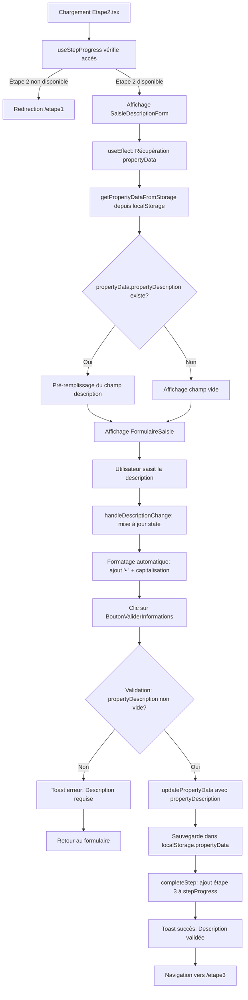

# 📋 **DOCUMENTATION EXHAUSTIVE - ÉTAPE 2 : DESCRIPTION DU BIEN**

## **🎯 MISSION DU DOCUMENT**
- Cette documentation constitue la Bible complète de l'**Étape 2** du processus de génération d'annonces en mode **localStorage**.
- Elle recense **TOUS** les fichiers, fonctions, composants, champs de formulaire, validations, contraintes, interactions, et flux de données utilisés dans cette étape.
- Objectif : fournir une base d'audit exhaustive avant la migration vers Supabase.

---
## **📑 SOMMAIRE CLIQUABLE - ÉTAPE 2**

### **Structure du document**
- [🎯 MISSION DU DOCUMENT](#-mission-du-document)
- [📂 I. ARCHITECTURE GLOBALE DE L'ÉTAPE 2](#-i-architecture-globale-de-ltape-2)
- [📁 II. FICHIERS UTILISÉS (Liste exhaustive)](#-ii-fichiers-utilisés-liste-exhaustive)
- [III. STRUCTURE DES DONNÉES DANS `localStorage`](#iii-structure-des-données-dans-localstorage)
- [IV. LOGIQUE DE VALIDATION DES CHAMPS](#iv-logique-de-validation-des-champs)
- [V. CONTRAINTES ET RÈGLES MÉTIER](#v-contraintes-et-règles-métier)
- [VI. NAVIGATION ET RETOUR EN ARRIÈRE](#vi-navigation-et-retour-en-arrière)
- [VII. UTILISATION DES DONNÉES PAR OPENAI](#vii-utilisation-des-données-par-openai)
- [VIII. PROCESSUS COMPLET ÉTAPE PAR ÉTAPE](#viii-processus-complet-étape-par-étape)
- [IX. ÉLÉMENTS CACHÉS / CONDITIONNELS](#ix-éléments-cachés--conditionnels)
- [X. TIMER DE SESSION (DÉSACTIVÉ MAIS PRÉSENT)](#x-timer-de-session-désactivé-mais-présent)
- [XI. RÉCAPITULATIF DES CLÉS `localStorage`](#xi-récapitulatif-des-clés-localstorage)
- [XII. DONNEES DE L'ETAPE 2 À PRENDRE EN CONSIDÉRATION](#xii-donnees-de-letape-2-à-prendre-en-considération)

---

---
## **📂 I. ARCHITECTURE GLOBALE DE L'ÉTAPE 2**

### **Vue d'ensemble**
- L'Étape 2 (route `/etape2`) permet à l'utilisateur de saisir une **description détaillée** du bien immobilier commercial.
- Cette description est **essentielle** car elle alimente les 4 prompts OpenAI de génération d'annonces (Site Internet, Fiche de Synthèse, Newsletter, Outils SEO).
- Les données sont **stockées dans le localStorage** sous la clé `"propertyData"` au format JSON, dans le champ `propertyDescription`.
- Cette étape suit l'Étape 1 (éléments clés) et précède l'Étape 3 (informations financières).

### **Flux de données simplifié**
```
Utilisateur saisit la description détaillée
         ↓
SaisieDescriptionForm (gestion state local)
         ↓
handleValidation() - Validation du champ
         ↓
updatePropertyData() - Stockage dans localStorage clé "propertyData"
         ↓
completeStep(2) - Déverrouillage Étape 3 dans localStorage clé "stepProgress"
         ↓
navigate("/etape3") - Navigation vers Étape 3
```
---

---

## 📝 Détails du flux

### 🔄 Phases principales

1. **Initialisation et vérification d'accès** (A→D)
   - Chargement de `Etape2.tsx`
   - `useStepProgress(2)` vérifie si l'étape 2 est accessible
   - Si étape 1 non complétée → redirection vers `/etape1`
   - Si étape 2 accessible → affichage du formulaire

2. **Chargement des données** (E→J)
   - `useEffect` récupère `propertyData` via `getPropertyDataFromStorage()`
   - Si `propertyData.propertyDescription` existe → pré-remplissage du champ
   - Si aucune donnée → champ vide
   - Affichage du composant `FormulaireSaisie`

3. **Saisie utilisateur avec formatage** (K→M)
   - L'utilisateur saisit sa description
   - `handleDescriptionChange` met à jour le state
   - `FormulaireSaisie` formate automatiquement :
     - Ajout de `• ` en début de chaque ligne
     - Capitalisation de la première lettre après la puce
     - Ajustement dynamique de la hauteur du textarea

4. **Validation** (N→Q)
   - Clic sur `BoutonValiderInformations`
   - **1 validation** obligatoire : `propertyDescription` non vide
   - Si vide → toast d'erreur et retour au formulaire

5. **Sauvegarde et navigation** (R→V)
   - `updatePropertyData({ propertyDescription })` → sauvegarde dans `localStorage.propertyData`
   - `completeStep(2)` → ajout étape 3 dans `stepProgress`
   - Toast de succès
   - Navigation vers `/etape3`

---

## **📁 II. FICHIERS UTILISÉS (Liste exhaustive)**

### **1. Fichiers de page principale**

#### **`src/1.etapes-generation-annonces/etape2/Etape2.tsx`**
**Rôle** : Composant page principale de l'Étape 2.
- **Responsabilités** :
  - Affiche le layout global avec `LayoutV2GenAnn`
  - Affiche le hero header avec `StructureHeroPetit`
  - Intègre le formulaire via `SaisieDescriptionForm`
  - Affiche la colonne latérale avec `DirectivesMenuOnglet` et `EtapeFAQ`
  - Vérifie l'accès à l'étape via `useStepProgress(2)`

- **Imports clés** :
  ```typescript
  import LayoutV2GenAnn from "@/components/atemplate.v2.generation-annonces/Layout.V2.GenAnn";
  import StructureHeroPetit from "@/0.structure-type-page/structure5HeroPetit/StructureHeroPetit";
  import DirectivesMenuOnglet from "@/components/atemplate.v2.generation-annonces/DirectivesMenuOnglet";
  import { EtapeFAQ } from "@/components/1-Sources-Generation-Annonces/help/EtapeFAQ";
  import { useStepProgress } from "@/components/1-Sources-Generation-Annonces/utils/useStepProgress";
  import SaisieDescriptionForm from "@/components/1-Sources-Generation-Annonces/form-etape2/SaisieDescriptionForm";
  import ImageRobotHeaderMauve from "@/components/widgets/quote/1.ImageRobotHeaderMauve";
  import Structure5ContainerVide from "@/0.structure-type-page/structure5HeroPetit/Structure5ContainerVide";
  ```

- **Hooks utilisés** :
  - `useStepProgress(2)` : Gère la progression et le déblocage des étapes
  - `useNavigate()` : Navigation entre les étapes

- **Vérification d'accès** :
  ```typescript
  React.useEffect(() => {
    if (!isStepAvailable(2)) {
      navigate("/etape1");
    }
  }, [isStepAvailable, navigate]);
  ```

- **Données configurées** :
  - `headerTitle` : "Informations de description"
  - `headerSubtitle` : "Cette étape va permettre à l'IA de structurer une annonce parfaite en détaillant avec précision les caractéristiques de votre bien."
  - `headerText` : "Il n'est pas nécessaire de rédiger des phrases. Il suffit de lister les éléments à votre disposition, sans se soucier de la mise en forme. L'IA se charge de les organiser, les hiérarchiser et de rédiger une description fluide, cohérente et percutante."
  - `card1CentreTitre` : "Informations de description"

---

### **2. Composant formulaire principal**

#### **`src/components/1-Sources-Generation-Annonces/form-etape2/SaisieDescriptionForm.tsx`**
**Rôle** : Composant formulaire contenant le champ de saisie de la description du bien.

- **Structure** :
  - Composant fonctionnel React
  - Gère **1 state local** : `propertyDescription`
  - Charge les données depuis `localStorage` au montage (`useEffect`)
  - Valide et sauvegarde les données via `updatePropertyData()`

- **États locaux (States)** :
  ```typescript
  const [propertyDescription, setPropertyDescription] = useState(""); // Description détaillée
  ```

- **Hooks utilisés** :
  ```typescript
  const { toast } = useToast();
  const navigate = useNavigate();
  const { completeStep, hasCompletedStep4, goToEtape5 } = useStepProgress(2);
  ```

- **Chargement des données (`useEffect`)** :
  ```typescript
  useEffect(() => {
    const propertyData = getPropertyDataFromStorage(); // Lecture localStorage

    if (propertyData.propertyDescription) {
      console.log("Description récupérée de propertyData:", propertyData.propertyDescription);
      setPropertyDescription(propertyData.propertyDescription);
    }
  }, []);
  ```

- **Gestion du changement** :
  ```typescript
  const handleDescriptionChange = (e: React.ChangeEvent) => {
    setPropertyDescription(e.target.value);
  };
  ```

- **Validation des champs (`handleValidation`)** :
  ```typescript
  const handleValidation = () => {
    // Vérification champ obligatoire "propertyDescription"
    if (!propertyDescription.trim()) {
      toast({
        title: "Erreur de validation",
        description: "Veuillez saisir une description du bien avant de continuer.",
        duration: 3000,
        variant: "destructive"
      });
      return;
    }

    // Sauvegarde dans localStorage
    updatePropertyData({ propertyDescription });

    toast({
      title: "Informations validées",
      description: "Votre description du bien a été enregistrée avec succès.",
      duration: 3000,
    });

    console.log("Description du bien validée et centralisée");

    // Déblocage étape 3 et navigation
    completeStep(2);
    navigate("/etape3");
  };
  ```

- **Retour à l'Étape 5 (si complétée)** :
  ```typescript
  const handleBackToEtape5 = () => {
    if (propertyDescription.trim()) {
      updatePropertyData({ propertyDescription });

      toast({
        title: "Modifications sauvegardées",
        description: "Vos modifications ont été enregistrées avant de retourner à l'étape finale.",
        duration: 3000,
      });
    }

    goToEtape5();
  };
  ```

- **Contenu d'aide (SgaHelpBox)** :
  - **Titre** : "Description du bien"
  - **Icône** : `Lightbulb` (ampoule jaune)
  - **Contenu** : 
    - Rappel que ces données alimentent l'IA pour rédiger l'annonce
    - Liste des informations essentielles :
      - Emplacement, zone de chalandise
      - Superficie, répartition des espaces
      - Activité actuelle, clientèle, fréquentation
      - Intérieur (décor, ambiance, équipements)
    - Avertissement : "L'IA ne peut pas inventer ce qu'elle ne connaît pas"
    - Encouragement : "Plus votre description est complète, plus elle sera mise en valeur avec efficacité"

---

### **3. Composants de champs de formulaire**

#### **`src/components/1-Sources-Generation-Annonces/form-components/FormulaireSaisie.tsx`**
**Rôle** : Zone de texte multiligne (textarea) avec formatage automatique :
- Ajout automatique de puces (`• `) en début de ligne
- Capitalisation de la première lettre après la puce
- Ajustement dynamique de la hauteur

- **Props** :
  ```typescript
  interface FormulaireSaisieProps {
    id: string;                    // "propertyDescription"
    title: string;                 // "Description détaillée"
    value: string;                 // Valeur du champ
    onChange: (e: React.ChangeEvent) => void;
    placeholder?: string;          // "Listez le maximum d'informations..."
    className?: string;
    minRows?: number;              // Nombre min de lignes (défaut: 10, utilisé: 8)
    readOnly?: boolean;
    required?: boolean;
  }
  ```

- **Logique de formatage (`handleInputChange`)** :
  ```typescript
  const handleInputChange = (e: React.ChangeEvent) => {
    const newText = e.target.value;

    const formattedText = newText.split('\n').map(line => {
      // Ligne vide → pas de modification
      if (line === '') return '';

      let formattedLine = line;

      // Si la ligne ne commence pas par un caractère spécial (•, ■, ., -, etc.)
      if (!formattedLine.trimStart().startsWith('•') && 
          !formattedLine.trimStart().startsWith('■') && 
          !formattedLine.trimStart().startsWith('▪') && 
          !formattedLine.trimStart().startsWith('▫') && 
          !formattedLine.trimStart().startsWith('.') && 
          !formattedLine.trimStart().startsWith('-')) {

        // Ajouter '• ' en préservant les espaces de début
        const leadingSpaces = formattedLine.length - formattedLine.trimStart().length;
        const spacesPrefix = formattedLine.substring(0, leadingSpaces);
        formattedLine = spacesPrefix + '• ' + formattedLine.trimStart();
      }

      // Si la ligne commence par '• ', capitaliser la première lettre après
      const trimmedLine = formattedLine.trimStart();
      if (trimmedLine.startsWith('• ')) {
        const leadingSpaces = formattedLine.length - trimmedLine.length;
        const spacesPrefix = formattedLine.substring(0, leadingSpaces);

        const afterPrefix = trimmedLine.substring(2);
        if (afterPrefix.length > 0) {
          formattedLine = spacesPrefix + '• ' + afterPrefix.charAt(0).toUpperCase() + afterPrefix.slice(1);
        }
      }

      return formattedLine;
    }).join('\n');

    // Déclencher onChange avec le texte formaté
    onChange({ ...e, target: { ...e.target, value: formattedText } });
  };
  ```

- **Ajustement automatique de la hauteur** :
  ```typescript
  const adjustHeight = () => {
    const textarea = textareaRef.current;
    if (textarea) {
      textarea.style.height = "auto";

      const lineHeight = parseInt(getComputedStyle(textarea).lineHeight) || 20;
      const minHeight = lineHeight * minRows;

      const newHeight = Math.max(textarea.scrollHeight, minHeight);
      textarea.style.height = `${newHeight}px`;
    }
  };

  useEffect(() => {
    adjustHeight();
  }, [value]);
  ```

- **Styles** :
  - Label : `text-[14px] text-black font-bold`
  - Textarea : `rounded-md bg-[#ffffff] border border-[#B8C8DC] text-[14px] text-[#515151]`
  - Focus : `focus:ring-2 focus:ring-[#5E50A6]`
  - Hauteur min : `min-h-[200px]` + dynamique selon `minRows`

- **Champ utilisant FormulaireSaisie** :
  - `propertyDescription` (id: "propertyDescription", titre: "Description détaillée", placeholder: "Listez le maximum d'informations de description en votre possession...", minRows: 8, required: true)

---

#### **`src/components/1-Sources-Generation-Annonces/form-components/BoutonValiderInformations.tsx`**
**Rôle** : Bouton de validation "Valider mes informations" avec icône.

- **Props** :
  ```typescript
  interface BoutonValiderInformationsProps {
    onClick: () => void;
    className?: string;
  }
  ```

- **Styles** :
  - Couleur : `bg-[#5E50A6]` (violet) + `hover:bg-[#6B5DB8]`
  - Texte : `text-white text-[14px] font-bold`
  - Icône : `Check` (Lucide React) en blanc

- **Utilisation dans l'Étape 2** :
  ```typescript

  ```

---

### **4. Composants d'aide et layout**

#### **`src/components/1-Sources-Generation-Annonces/help/SgaHelpBox.tsx`**
**Rôle** : Carte d'aide avec icône, titre et contenu détaillé.

- **Props** :
  ```typescript
  interface SgaHelpBoxProps {
    title: string;           // "Description du bien"
    content: React.ReactNode; // Contenu HTML avec instructions
    icon?: React.ReactNode;   // Icône Lightbulb
    className?: string;
  }
  ```

- **Styles** :
  - Fond : `bg-[#F7F5FA]` (gris-mauve très clair)
  - Bordure : `border border-[#E5E7EB]`
  - Titre : `text-[14px] font-bold text-black`
  - Texte : `text-[12px] text-black`

---

#### **`src/components/1-Sources-Generation-Annonces/help/EtapeFAQ.tsx`**
**Rôle** : Accordéon FAQ avec questions/réponses spécifiques à l'étape.

- **Props** :
  ```typescript
  interface EtapeFAQProps {
    etape: "etape1" | "etape2" | "etape3" | "etape4" | "etape5";
  }
  ```

- **Questions pour l'Étape 2** (`etape="etape2"`) :
  1. "Quelles informations intégrer ?"
  2. "Puis-je modifier mes informations plus tard ?"
  3. "Comment optimiser ma description ?"

---

#### **`src/components/atemplate.v2.generation-annonces/DirectivesMenuOnglet.tsx`**
**Rôle** : Menu de navigation entre les étapes avec indicateur de progression.

- **Props** :
  ```typescript
  interface DirectivesMenuOngletProps {
    activeStep: number;      // 2 pour l'Étape 2
    disabledSteps: number[]; // Étapes non encore débloquées
  }
  ```

- **Fonctionnalités** :
  - Affiche les 5 étapes avec icônes
  - Indique l'étape active (fond violet)
  - Désactive les étapes non accessibles
  - Permet navigation vers étapes débloquées

---

### **5. Utilitaires et services**

#### **`src/components/1-Sources-Generation-Annonces/utils/useStepProgress.ts`**
**Rôle** : Hook personnalisé pour gérer la progression des étapes.

- **Retour du hook** :
  ```typescript
  {
    availableSteps: number[],        // [1, 2, 3] si étapes 1-3 complétées
    disabledSteps: number[],         // [4, 5] si étapes 4-5 non complétées
    completeStep: (step: number) => void, // Débloque l'étape suivante
    hasCompletedStep4: boolean,      // true si étape 4 complétée
    goToEtape5: () => void,          // Navigation vers étape 5
    handleConfirmNewProject: () => void, // Reset complet
    isStepAvailable: (step: number) => boolean // Vérifie accès à une étape
  }
  ```

- **Stockage localStorage** :
  ```typescript
  // Clé: "stepProgress"
  // Valeur: { availableSteps: [1, 2, 3] }
  ```

- **Logique `completeStep(2)` pour l'Étape 2** :
  ```typescript
  const completeStep = (step: number) => {
    const nextStep = step + 1;
    if (!availableSteps.includes(nextStep) && nextStep <= 5) {
      const newAvailableSteps = [...availableSteps, nextStep];
      setAvailableSteps(newAvailableSteps);
      localStorage.setItem("stepProgress", JSON.stringify({
        availableSteps: newAvailableSteps
      }));

      if (step === 4) {
        setHasCompletedStep4(true);
      }
    }
  };
  ```

- **Logique `isStepAvailable(2)` pour vérifier l'accès** :
  ```typescript
  const isStepAvailable = (step: number) => {
    return availableSteps.includes(step) || step <= currentStep;
  };
  ```

---

#### **`src/services/openai.ts`**
**Rôle** : Service de génération d'annonces avec OpenAI.

- **Interface `PropertyData`** :
  ```typescript
  export interface PropertyData {
    // Étape 1
    agencyName?: string;
    reference?: string;
    exclusivite?: string;
    location?: string;
    propertyType?: string;
    saleType?: string;
    price?: string;
    rentAmount?: string;
    rentPeriodicity?: string;
    keyElements?: string;

    // Étape 2 - Description
    propertyDescription?: string; // ← CHAMP DE L'ÉTAPE 2

    // Étape 3 - Financials
    financials?: string;

    // Étape 4 - Details
    details?: string;
    hasNoDetails?: boolean;
  }
  ```

- **Fonction `updatePropertyData`** :
  ```typescript
  export const updatePropertyData = (data: Partial) => {
    const existingData = getPropertyDataFromStorage();
    const updatedData = { ...existingData, ...data };
    localStorage.setItem("propertyData", JSON.stringify(updatedData));
  };
  ```

- **Fonction `getPropertyDataFromStorage`** :
  ```typescript
  export const getPropertyDataFromStorage = (): PropertyData => {
    const data = localStorage.getItem("propertyData");
    return data ? JSON.parse(data) : {};
  };
  ```

- **Fonction `clearPropertyData`** :
  ```typescript
  export const clearPropertyData = () => {
    localStorage.removeItem("propertyData");
  };
  ```

- **Utilisation de `propertyDescription` dans les prompts OpenAI** :
  - **Annonce Site Internet** (ligne 181) :
    ```typescript
    .replace(/\[description détaillée du bien\]/g, data.propertyDescription || "")
    ```
  - **Fiche de Synthèse** (ligne 230) :
    ```typescript
    .replace(/\[description détaillée du bien\]/g, data.propertyDescription || "")
    ```
  - **Newsletter** (ligne 275) :
    ```typescript
    .replace(/\[description détaillée du bien\]/g, data.propertyDescription || "")
    ```
  - **Outils SEO** (ligne 317) :
    ```typescript
    .replace(/\[description détaillée du bien\]/g, data.propertyDescription || "")
    ```

---

#### **`src/services/openai/1.GenerateurAnnoncesOutilsSeo/0.APIAutresFonctionsLeadGenAI/`**
**Rôle** : Services OpenAI pour les autres fonctions (SMS, Google Business, Réseaux Sociaux).

- **Fichiers concernés** :
  1. `1.API-AnnonceSMS.ts` (ligne 155)
  2. `2.API-AnnonceGoogleBusinessProfile.ts` (ligne 157)
  3. `3.API-AnnonceReseauxSociaux.ts` (ligne 158)

- **Utilisation de `propertyDescription`** :
  - Tous ces fichiers intègrent `propertyDescription` dans leurs prompts OpenAI
  - Format identique : `.replace(/\[description détaillée du bien\]/g, data.propertyDescription || "")`

---

### **6. Fichiers de navigation**

#### **`src/components/navigation-site-leadgenaiadbuilder/NavLinks.tsx`**
**Rôle** : Définit les liens de navigation du générateur d'annonces.

- **Lien Étape 2** :
  ```typescript
  {
    to: "/etape2",
    label: "Étape 2",
    icon: FileText
  }
  ```

---

## **III. STRUCTURE DES DONNÉES DANS `localStorage`**

### **1. Clé principale : `"propertyData"`**

**Format** : JSON stringifié
**Structure complète** (après Étape 2) :
```json
{
  "agencyName": "Mon Agence Immobilière",
  "reference": "LOC-2024-001",
  "exclusivite": "Oui",
  "location": "Lyon 6ème",
  "propertyType": "Restaurant",
  "saleType": "à louer",
  "price": "",
  "rentAmount": "3 500€",
  "rentPeriodicity": "Mensuel",
  "keyElements": "• Emplacement stratégique\n• Forte affluence\n• Licence IV",
  "propertyDescription": "• Restaurant de 120m² entièrement équipé\n• Situé dans le quartier des Brotteaux\n• Terrasse de 40 couverts\n• Cuisine professionnelle aux normes\n• Clientèle d'affaires établie"
}
```

**Champ spécifique à l'Étape 2** :
- `propertyDescription` (string) : Description détaillée du bien, formatée avec puces `• `

---

### **2. Clé de progression : `"stepProgress"`**

**Format** : JSON stringifié
**Structure** :
```json
{
  "availableSteps": [1, 2, 3]
}
```

**Évolution après validation de l'Étape 2** :
```json
{
  "availableSteps": [1, 2, 3]  // Étape 3 ajoutée par completeStep(2)
}
```

---

### **3. Clés de génération OpenAI : `"generation_*"`**

**Créées à l'Étape 5** (après validation de toutes les étapes) :
- `"generation_website_ad"` : Annonce Site Internet
- `"generation_summary_sheet"` : Fiche de Synthèse
- `"generation_newsletter"` : Annonce Newsletter
- `"generation_seo_tools"` : Outils SEO

**Format** : JSON stringifié avec structure spécifique à chaque type d'annonce.

**Contenu de `propertyDescription` dans ces clés** :
- Intégré dans les prompts OpenAI pour générer les contenus
- Utilisé pour rédiger les descriptions, lister les points forts, etc.

---

## **IV. LOGIQUE DE VALIDATION DES CHAMPS**

### **1. Validation unique de l'Étape 2**

**Champ obligatoire** : `propertyDescription`

**Règle de validation** :
```typescript
if (!propertyDescription.trim()) {
  toast({
    title: "Erreur de validation",
    description: "Veuillez saisir une description du bien avant de continuer.",
    duration: 3000,
    variant: "destructive"
  });
  return;
}
```

**Type de validation** :
- Vérification que le champ n'est pas vide (après suppression des espaces)
- Pas de validation de longueur minimale ou maximale
- Pas de validation de format spécifique

---

### **2. Comportement de validation**

**Déclenchement** :
- Clic sur le bouton "Valider mes informations"
- Appel à `handleValidation()`

**En cas d'échec** :
- Affichage d'un toast d'erreur (variant: "destructive", couleur rouge)
- Pas de navigation
- Focus reste sur le formulaire

**En cas de succès** :
- Sauvegarde dans `localStorage.propertyData`
- Affichage d'un toast de succès (couleur verte)
- Déblocage de l'Étape 3 via `completeStep(2)`
- Navigation automatique vers `/etape3`

---

### **3. Pas de validation en temps réel**

- **Aucune validation pendant la saisie**
- **Aucun message d'erreur inline**
- Validation uniquement au moment de la soumission

---

## **V. CONTRAINTES ET RÈGLES MÉTIER**

### **1. Contraintes d'accès**

**Prérequis pour accéder à l'Étape 2** :
- L'Étape 1 doit être complétée
- `stepProgress.availableSteps` doit contenir `2`
- Vérification via `useStepProgress(2)` et `isStepAvailable(2)`

**Redirection automatique** :
```typescript
React.useEffect(() => {
  if (!isStepAvailable(2)) {
    navigate("/etape1"); // Redirection vers Étape 1 si non accessible
  }
}, [isStepAvailable, navigate]);
```

---

### **2. Contraintes de saisie**

**Formatage automatique** :
- Chaque nouvelle ligne reçoit automatiquement une puce `• `
- La première lettre après la puce est capitalisée
- Préservation des espaces en début de ligne

**Caractères spéciaux détectés** (pas de puce ajoutée) :
- `•` (puce ronde)
- `■` (carré plein)
- `▪` (petit carré)
- `▫` (petit carré vide)
- `.` (point)
- `-` (tiret)

**Hauteur du textarea** :
- Minimum : 8 lignes (configuré via `minRows={8}`)
- Ajustement automatique selon le contenu
- Pas de limite maximale de hauteur

---

### **3. Contraintes de navigation**

**Navigation autorisée** :
- Retour à l'Étape 1 : toujours possible (via menu de navigation)
- Avance vers l'Étape 3 : uniquement après validation de l'Étape 2

**Sauvegarde automatique** :
- Aucune sauvegarde automatique pendant la saisie
- Sauvegarde uniquement sur clic "Valider mes informations"
- Si l'utilisateur quitte sans valider, les données sont perdues

---

### **4. Contraintes de données**

**Champ unique** :
- 1 seul champ de formulaire : `propertyDescription`
- Type : textarea multiligne
- Valeur : string avec formatage préservé (retours à la ligne, puces)

**Persistance** :
- Stockage dans `localStorage.propertyData.propertyDescription`
- Rechargement automatique au retour sur l'Étape 2
- Pas de limite de taille (limitation du localStorage navigateur : ~5-10 MB)

---

## **VI. NAVIGATION ET RETOUR EN ARRIÈRE**

### **1. Navigation vers l'Étape 2**

**Depuis l'Étape 1** :
- Après validation de l'Étape 1
- Clic sur "Valider mes informations" → `completeStep(1)` → `navigate("/etape2")`

**Depuis le menu de navigation** :
- Clic sur "Étape 2" dans `DirectivesMenuOnglet`
- Possible uniquement si `isStepAvailable(2)` retourne `true`

**Depuis l'Étape 3, 4 ou 5** :
- Retour possible via menu de navigation
- Pas de perte de données (rechargement depuis `localStorage`)

---

### **2. Navigation depuis l'Étape 2**

**Vers l'Étape 3** :
- Après validation de l'Étape 2
- Clic sur "Valider mes informations" → `completeStep(2)` → `navigate("/etape3")`

**Vers l'Étape 1** :
- Clic sur "Étape 1" dans le menu de navigation
- Toujours possible (pas de restriction)

**Vers l'Étape 5** (si déjà complétée) :
- Fonction `handleBackToEtape5()` disponible (mais non utilisée dans l'UI actuelle)
- Sauvegarde automatique avant navigation

---

### **3. Retour en arrière et modification**

**Modification de la description** :
- Retour à l'Étape 2 via menu de navigation
- Rechargement automatique de `propertyDescription` depuis `localStorage`
- Modification possible
- Re-validation via "Valider mes informations"

**Impact sur les étapes suivantes** :
- Modification de l'Étape 2 n'invalide pas les étapes 3, 4, 5
- Les étapes suivantes restent accessibles
- **Attention** : Si l'Étape 5 est déjà complétée, les annonces générées ne sont PAS régénérées automatiquement

**Régénération des annonces** :
- Pour prendre en compte les modifications de l'Étape 2
- L'utilisateur doit retourner à l'Étape 5
- Cliquer sur "Générer mes annonces" à nouveau

---

### **4. Cas particulier : Nouveau projet**

**Reset complet** :
- Fonction `handleConfirmNewProject()` disponible dans `useStepProgress`
- Supprime toutes les clés `localStorage` :
  - `propertyData`
  - `stepProgress`
  - `generation_*`
  - `session_start_time`
- Redirection vers `/etape1`
- Rechargement de la page (`window.location.reload()`)

---

## **VII. UTILISATION DES DONNÉES PAR OPENAI**

### **1. Champ utilisé dans les prompts**

**Champ de l'Étape 2** : `propertyDescription`

**Utilisation dans 7 prompts OpenAI** :
1. Annonce Site Internet (`src/services/openai.ts`, ligne 181)
2. Fiche de Synthèse (`src/services/openai.ts`, ligne 230)
3. Newsletter (`src/services/openai.ts`, ligne 275)
4. Outils SEO (`src/services/openai.ts`, ligne 317)
5. Annonce SMS (`src/services/openai/1.GenerateurAnnoncesOutilsSeo/0.APIAutresFonctionsLeadGenAI/1.API-AnnonceSMS.ts`, ligne 155)
6. Annonce Google Business Profile (`src/services/openai/1.GenerateurAnnoncesOutilsSeo/0.APIAutresFonctionsLeadGenAI/2.API-AnnonceGoogleBusinessProfile.ts`, ligne 157)
7. Annonce Réseaux Sociaux (`src/services/openai/1.GenerateurAnnoncesOutilsSeo/0.APIAutresFonctionsLeadGenAI/3.API-AnnonceReseauxSociaux.ts`, ligne 158)

---

### **2. Format d'intégration dans les prompts**

**Remplacement de placeholder** :
```typescript
.replace(/\[description détaillée du bien\]/g, data.propertyDescription || "")
```

**Valeur par défaut** :
- Si `propertyDescription` est vide ou `undefined` → chaîne vide `""`
- L'IA OpenAI génère alors l'annonce sans description détaillée

---

### **3. Exemple de prompt pour Annonce Site Internet**

**Template de prompt** :
```
Vous êtes un expert en rédaction d'annonces immobilières commerciales.

Rédigez une annonce pour un bien avec les caractéristiques suivantes :
- Type de bien : [type de bien]
- Emplacement : [emplacement]
- Prix/Loyer : [prix ou loyer]
- Arguments commerciaux : [arguments commerciaux]
- Description détaillée : [description détaillée du bien]

L'annonce doit être fluide, percutante et valorisante.
```

**Après remplacement** (exemple) :
```
Vous êtes un expert en rédaction d'annonces immobilières commerciales.

Rédigez une annonce pour un bien avec les caractéristiques suivantes :
- Type de bien : Restaurant
- Emplacement : Lyon 6ème
- Prix/Loyer : 3 500€ Mensuel
- Arguments commerciaux : • Emplacement stratégique
• Forte affluence
• Licence IV
- Description détaillée : • Restaurant de 120m² entièrement équipé
• Situé dans le quartier des Brotteaux
• Terrasse de 40 couverts
• Cuisine professionnelle aux normes
• Clientèle d'affaires établie

L'annonce doit être fluide, percutante et valorisante.
```

---

### **4. Impact de `propertyDescription` sur la qualité des annonces**

**Description vide ou minimale** :
- Annonce générée très générique
- Manque de détails concrets
- Moins percutante et valorisante

**Description détaillée** :
- Annonce riche en informations
- Mise en valeur des spécificités du bien
- Plus convaincante pour les prospects

**Recommandation** :
- Encourager les utilisateurs à remplir le maximum d'informations
- Utiliser les puces pour structurer
- Inclure : emplacement, superficie, équipements, clientèle, ambiance, etc.

---

## **VIII. PROCESSUS COMPLET ÉTAPE PAR ÉTAPE**

### **Étape par étape : Parcours utilisateur complet**

#### **1. Arrivée sur l'Étape 2**

**Conditions** :
- L'utilisateur a validé l'Étape 1
- `stepProgress.availableSteps` contient `[1, 2]`
- Navigation vers `/etape2`

**Chargement de la page** :
```typescript
// 1. Vérification d'accès
useEffect(() => {
  if (!isStepAvailable(2)) {
    navigate("/etape1"); // Redirection si pas accessible
  }
}, [isStepAvailable, navigate]);

// 2. Récupération des données
useEffect(() => {
  const propertyData = getPropertyDataFromStorage();
  if (propertyData.propertyDescription) {
    setPropertyDescription(propertyData.propertyDescription);
  }
}, []);
```

**Affichage** :
- Hero header avec titre, sous-titre et image robot mauve
- Formulaire avec champ `propertyDescription` (vide ou pré-rempli)
- Bouton "Valider mes informations"
- Carte d'aide "Description du bien"
- Menu de navigation latéral (Étape 2 active)
- FAQ Étape 2

---

#### **2. Saisie de la description**

**Action utilisateur** :
- Clic dans le textarea `propertyDescription`
- Saisie de texte libre

**Formatage automatique** :
- Chaque nouvelle ligne reçoit `• ` en préfixe
- Première lettre après `• ` capitalisée
- Hauteur du textarea ajustée dynamiquement

**Exemple de saisie** :
```
• Restaurant de 120m² entièrement équipé
• Situé dans le quartier des Brotteaux
• Terrasse de 40 couverts
• Cuisine professionnelle aux normes
• Clientèle d'affaires établie
```

---

#### **3. Validation de la description**

**Action utilisateur** :
- Clic sur "Valider mes informations"

**Processus de validation** :
```typescript
const handleValidation = () => {
  // 1. Vérification champ non vide
  if (!propertyDescription.trim()) {
    toast({ description: "Veuillez saisir une description du bien avant de continuer." });
    return;
  }

  // 2. Sauvegarde dans localStorage
  updatePropertyData({ propertyDescription });

  // 3. Toast succès
  toast({ description: "Votre description du bien a été enregistrée avec succès." });

  // 4. Déblocage Étape 3
  completeStep(2);

  // 5. Navigation
  navigate("/etape3");
};
```

---

#### **4. Après validation**

**Stockage localStorage** :
```json
// Clé: "propertyData"
{
  "agencyName": "Mon Agence",
  "reference": "LOC-001",
  "propertyDescription": "• Restaurant de 120m²...\n• Situé dans...",
  // ... autres champs
}

// Clé: "stepProgress"
{
  "availableSteps": [1, 2, 3] // Étape 3 débloquée
}
```

**Navigation automatique** :
- Redirection vers `/etape3`
- Chargement de l'Étape 3 (Informations financières)

---

#### **5. Retour en arrière (modification)**

**Action utilisateur** :
- Clic sur "Étape 2" dans le menu de navigation

**Processus** :
```typescript
// 1. Navigation vers /etape2
navigate("/etape2");

// 2. Rechargement des données
useEffect(() => {
  const propertyData = getPropertyDataFromStorage();
  if (propertyData.propertyDescription) {
    setPropertyDescription(propertyData.propertyDescription);
  }
}, []);
```

**Affichage** :
- Champ `propertyDescription` pré-rempli avec les données sauvegardées
- Modification possible
- Re-validation possible

---

## **IX. ÉLÉMENTS CACHÉS / CONDITIONNELS**

### **1. Aucun élément conditionnel dans l'Étape 2**

**Contrairement à l'Étape 1** :
- L'Étape 1 affiche conditionnellement `price` (si vente) ou `rentAmount` + `rentPeriodicity` (si location)
- **L'Étape 2 n'a aucun champ conditionnel**
- Le champ `propertyDescription` est toujours affiché, quel que soit le type de transaction

---

### **2. Affichage conditionnel du menu de navigation**

**Étapes désactivées** :
- `DirectivesMenuOnglet` reçoit `disabledSteps` depuis `useStepProgress`
- Les étapes non encore débloquées sont grisées et non cliquables

**Pour l'Étape 2** :
- Si `stepProgress.availableSteps = [1, 2]` → Étapes 3, 4, 5 désactivées
- Si `stepProgress.availableSteps = [1, 2, 3, 4, 5]` → Toutes les étapes activées

---

### **3. Affichage conditionnel de la carte "Retour Étape 5"**

**Fonction `handleBackToEtape5()`** :
- Présente dans le code de `SaisieDescriptionForm`
- **Non utilisée dans l'interface actuelle**
- Pourrait être utilisée pour afficher un bouton "Retour à l'Étape 5" si `hasCompletedStep4 === true`

---

## **X. TIMER DE SESSION (DÉSACTIVÉ MAIS PRÉSENT)**

### **1. Clé localStorage : `"session_start_time"`**

**Créée dans** : `src/components/1-Sources-Generation-Annonces/utils/useSgaForm.ts`

**Valeur** : Timestamp de début de session (format ISO)

**Utilisation actuelle** : Aucune dans l'Étape 2

---

### **2. Fonction de reset**

**Dans `useSgaForm.ts`** :
```typescript
localStorage.removeItem("session_start_time");
localStorage.removeItem("propertyDescription");
localStorage.removeItem("financials");
```

**Suppression de `propertyDescription` lors du reset** :
- Cette clé individuelle n'est plus utilisée
- La description est stockée dans `propertyData.propertyDescription`
- **Incohérence potentielle dans le code**

---

## **XI. RÉCAPITULATIF DES CLÉS `localStorage`**

### **1. Clés utilisées par l'Étape 2**

| Clé | Type | Contenu | Créée par | Modifiée par | Supprimée par |
|-----|------|---------|-----------|--------------|---------------|
| `propertyData` | JSON | Objet contenant tous les champs des étapes 1-4, dont `propertyDescription` | Étape 1 | Étapes 1-4 | Reset projet |
| `stepProgress` | JSON | `{ availableSteps: [1, 2, 3] }` | Étape 1 | Toutes les étapes | Reset projet |

---

### **2. Clés créées par d'autres étapes (contexte)**

| Clé | Type | Contenu | Créée par | Utilisée par |
|-----|------|---------|-----------|--------------|
| `generation_website_ad` | JSON | Annonce Site Internet générée | Étape 5 | Page de restitution |
| `generation_summary_sheet` | JSON | Fiche de Synthèse générée | Étape 5 | Page de restitution |
| `generation_newsletter` | JSON | Annonce Newsletter générée | Étape 5 | Page de restitution |
| `generation_seo_tools` | JSON | Outils SEO générés | Étape 5 | Page de restitution |
| `generation_sms_ad` | JSON | Annonce SMS générée | Fonction SMS | Page de restitution |
| `generation_google_business_ad` | JSON | Annonce Google Business générée | Fonction GBP | Page de restitution |
| `generation_social_media_ad` | JSON | Annonce Réseaux Sociaux générée | Fonction RS | Page de restitution |
| `session_start_time` | String | Timestamp ISO | `useSgaForm` | Aucune (désactivé) |

---

### **3. Structure détaillée de `propertyData` après Étape 2**

```json
{
  "agencyName": "Mon Agence Immobilière",
  "reference": "LOC-2024-001",
  "exclusivite": "Oui",
  "location": "Lyon 6ème",
  "propertyType": "Restaurant",
  "saleType": "à louer",
  "price": "",
  "rentAmount": "3 500€",
  "rentPeriodicity": "Mensuel",
  "keyElements": "• Emplacement stratégique\n• Forte affluence\n• Licence IV",
  "propertyDescription": "• Restaurant de 120m² entièrement équipé\n• Situé dans le quartier des Brotteaux\n• Terrasse de 40 couverts\n• Cuisine professionnelle aux normes\n• Clientèle d'affaires établie"
}
```

---

## **XII. DONNEES DE L'ETAPE 2 À PRENDRE EN CONSIDÉRATION**

### **1. Champs `propertyData`**

| Champs localStorage | Type | Obligatoire | Valeur par défaut | Commentaire |
|---------------------|------|-------------|-------------------|-------------|
| `propertyDescription` | string | Oui | `""` | Description détaillée du bien, formatée avec puces `• ` |

---

### **2. Clés `generation_*`**

| Clés localStorage | Type | Créée par | Utilise `propertyDescription` |
|-------------------|------|-----------|-------------------------------|
| `generation_website_ad` | JSON | Étape 5 | Oui |
| `generation_summary_sheet` | JSON | Étape 5 | Oui |
| `generation_newsletter` | JSON | Étape 5 | Oui |
| `generation_seo_tools` | JSON | Étape 5 | Oui |
| `generation_sms_ad` | JSON | Fonction SMS | Oui |
| `generation_google_business_ad` | JSON | Fonction GBP | Oui |
| `generation_social_media_ad` | JSON | Fonction RS | Oui |

---

### **3. Fonctions**

| Fonctions | Fichier | Rôle |
|-----------|---------|------|
| `getPropertyDataFromStorage()` | `src/services/openai.ts` | Récupère `propertyData` depuis `localStorage` |
| `updatePropertyData()` | `src/services/openai.ts` | Met à jour `propertyData` dans `localStorage` |
| `completeStep(2)` | `src/components/1-Sources-Generation-Annonces/utils/useStepProgress.ts` | Débloque l'Étape 3 en ajoutant `3` à `stepProgress.availableSteps` |
| `handleValidation()` | `src/components/1-Sources-Generation-Annonces/form-etape2/SaisieDescriptionForm.tsx` | Valide `propertyDescription`, sauvegarde, et navigue vers Étape 3 |
| `handleDescriptionChange()` | `src/components/1-Sources-Generation-Annonces/form-etape2/SaisieDescriptionForm.tsx` | Met à jour le state `propertyDescription` |
| `handleInputChange()` | `src/components/1-Sources-Generation-Annonces/form-components/FormulaireSaisie.tsx` | Formate le texte avec puces `• ` et capitalisation |
| `adjustHeight()` | `src/components/1-Sources-Generation-Annonces/form-components/FormulaireSaisie.tsx` | Ajuste dynamiquement la hauteur du textarea |

---

### **4. Rappel des dépendances entre les étapes**

| Étape | Prérequis | Données créées | Données utilisées | Étape suivante débloquée |
|-------|-----------|----------------|-------------------|--------------------------|
| Étape 1 | Aucun | `agencyName`, `reference`, `exclusivite`, `location`, `propertyType`, `saleType`, `price`, `rentAmount`, `rentPeriodicity`, `keyElements` | - | Étape 2 |
| **Étape 2** | **Étape 1 complétée** | **`propertyDescription`** | **Toutes les données de l'Étape 1** | **Étape 3** |
| Étape 3 | Étape 2 complétée | `financials` | Toutes les données des Étapes 1-2 | Étape 4 |
| Étape 4 | Étape 3 complétée | `details`, `hasNoDetails` | Toutes les données des Étapes 1-3 | Étape 5 |
| Étape 5 | Étape 4 complétée | Clés `generation_*` (annonces générées) | **Toutes les données des Étapes 1-4, dont `propertyDescription`** | - |

---

