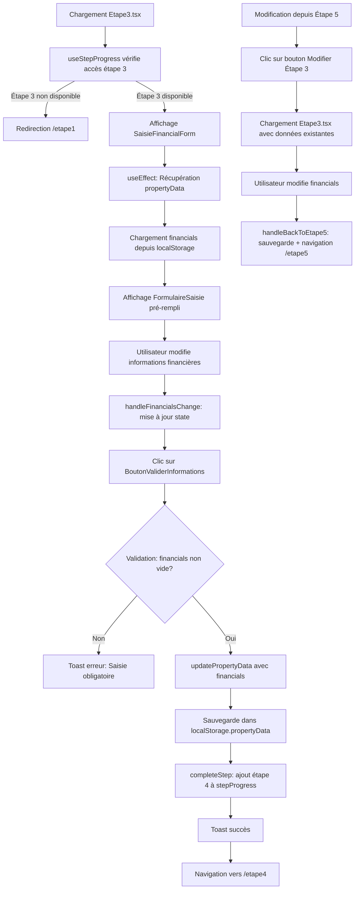

# 📋 DOCUMENTATION COMPLÈTE - **ÉTAPE 3 : INFORMATIONS FINANCIÈRES**

---

## 🎯 MISSION DU DOCUMENT

Ce document décrit l'intégralité du fonctionnement de l'**Étape 3** de l'application **LeadGenAI Ad Builder**, étape dédiée à la **saisie des informations financières du bien immobilier commercial**.

Il détaille :
- Les fichiers utilisés (composants, hooks, services)
- La structure des données stockées dans `localStorage`
- La logique de validation
- Les contraintes métier
- Le flux de navigation
- L'utilisation des données saisies par les fonctions OpenAI

---

## 📚 SOMMAIRE CLIQUABLE

1. [I. ARCHITECTURE GLOBALE - ÉTAPE 3](#i-architecture-globale---étape-3)
2. [II. FICHIERS UTILISÉS (Liste exhaustive)](#ii-fichiers-utilisés-liste-exhaustive)
3. [III. STRUCTURE DES DONNÉES DANS localStorage](#iii-structure-des-données-dans-localstorage)
4. [IV. LOGIQUE DE VALIDATION DES CHAMPS](#iv-logique-de-validation-des-champs)
5. [V. CONTRAINTES ET RÈGLES MÉTIER](#v-contraintes-et-règles-métier)
6. [VI. NAVIGATION ET RETOUR EN ARRIÈRE](#vi-navigation-et-retour-en-arrière)
7. [VII. UTILISATION DES DONNÉES PAR OPENAI](#vii-utilisation-des-données-par-openai)
8. [VIII. PROCESSUS COMPLET ÉTAPE PAR ÉTAPE](#viii-processus-complet-étape-par-étape)
9. [IX. ÉLÉMENTS CACHÉS / CONDITIONNELS](#ix-éléments-cachés--conditionnels)
10. [X. TIMER DE SESSION (DÉSACTIVÉ MAIS PRÉSENT)](#x-timer-de-session-désactivé-mais-présent)
11. [XI. RÉCAPITULATIF DES CLÉS localStorage](#xi-récapitulatif-des-clés-localstorage)
12. [XII. DONNÉES DE L'ÉTAPE 3 À PRENDRE EN CONSIDÉRATION](#xii-données-de-létape-3-à-prendre-en-considération)

---

## I. ARCHITECTURE GLOBALE - ÉTAPE 3

### Vue d'ensemble

L'**Étape 3** permet à l'utilisateur de **saisir les informations financières** du bien immobilier commercial (conditions locatives, données financières, potentiel de développement). Ces informations complètent celles saisies aux Étapes 1 et 2.

**Composants principaux :**
- **Page :** `Etape3.tsx` (structure de la page avec header, contenu central, et sidebar)
- **Formulaire de saisie :** `SaisieFinancialForm.tsx` (gestion du champ `financials`, validation, sauvegarde)
- **Composant d'entrée :** `FormulaireSaisie.tsx` (textarea avec formatage automatique et hauteur dynamique)
- **Hook de progression :** `useStepProgress.ts` (contrôle d'accès, sauvegarde progression)
- **Service OpenAI :** `openai.ts` et services annexes (utilisation de `financials` dans tous les prompts)

### Flux de données simplifié

```
Utilisateur arrive sur /etape3
  ↓
useStepProgress vérifie l'accès (étapes 1 et 2 complétées)
  ↓ (Si non autorisé → redirection /etape1)
  ↓ (Si autorisé)
SaisieFinancialForm charge les données existantes depuis localStorage.propertyData
  ↓
Affichage du formulaire (pré-rempli si `financials` existe déjà)
  ↓
Utilisateur modifie le champ "Informations financières"
  ↓
Validation au clic sur "Valider mes informations"
  ↓
Sauvegarde dans localStorage.propertyData.financials
  ↓
Mise à jour de localStorage.stepProgress (ajout étape 4)
  ↓
Navigation vers /etape4
```

### Schéma complet Mermaid



### Détail du flux

1. **Chargement initial :**
   - `Etape3.tsx` se monte
   - `useStepProgress(3)` vérifie si l'étape 3 est disponible (étapes 1 et 2 complétées)
   - Si non disponible → redirection automatique vers `/etape1`
   - Si disponible → affichage du composant `SaisieFinancialForm`

2. **Récupération des données :**
   - `useEffect` dans `SaisieFinancialForm` appelle `getPropertyDataFromStorage()`
   - Si `propertyData.financials` existe → pré-rempli dans le state `financials`
   - Sinon → champ vide

3. **Saisie utilisateur :**
   - L'utilisateur tape dans le `FormulaireSaisie`
   - Formatage automatique : ajout de `• ` en début de ligne, capitalisation première lettre
   - Hauteur du textarea s'ajuste dynamiquement selon le contenu
   - `handleFinancialsChange` met à jour le state `financials`

4. **Validation :**
   - Clic sur `BoutonValiderInformations`
   - `handleValidation()` vérifie que `financials.trim()` n'est pas vide
   - Si vide → Toast erreur "Veuillez saisir des informations financières avant de continuer"
   - Si valide → `updatePropertyData({ financials })` sauvegarde dans `localStorage.propertyData`
   - `completeStep(3)` ajoute l'étape 4 aux étapes disponibles dans `localStorage.stepProgress`
   - Toast succès "Vos informations financières ont été enregistrées avec succès"
   - `navigate("/etape4")` → redirection vers Étape 4

5. **Modification depuis Étape 5 :**
   - Si l'utilisateur clique sur "Modifier Étape 3" depuis l'Étape 5
   - `handleBackToEtape5()` sauvegarde les modifications via `updatePropertyData({ financials })`
   - Toast "Modifications sauvegardées"
   - `goToEtape5()` → retour à l'Étape 5

---

## II. FICHIERS UTILISÉS (Liste exhaustive)

### 1. **`src/1.etapes-generation-annonces/etape3/Etape3.tsx`**
**Rôle :** Page principale de l'Étape 3  
**Responsabilités :**
- Structure de la page (header, contenu principal, sidebar)
- Intégration de `SaisieFinancialForm` dans la zone centrale
- Affichage du menu de navigation `DirectivesMenuOnglet`
- Affichage de la FAQ `EtapeFAQ` et de la carte d'aide
- Vérification de l'accès à l'étape 3 via `useStepProgress`

**Éléments clés :**
```tsx
const { disabledSteps, completeStep, isStepAvailable } = useStepProgress(3);

React.useEffect(() => {
  if (!isStepAvailable(3)) {
    navigate("/etape1");
  }
}, [isStepAvailable, navigate]);
```

---

### 2. **`src/components/1-Sources-Generation-Annonces/form-etape3/SaisieFinancialForm.tsx`**
**Rôle :** Composant formulaire de saisie des informations financières  
**Responsabilités :**
- Gestion du state `financials` (informations financières)
- Chargement des données existantes depuis `localStorage.propertyData`
- Validation : vérification que `financials` n'est pas vide
- Sauvegarde via `updatePropertyData({ financials })`
- Navigation vers `/etape4` après validation
- Gestion du retour vers `/etape5` (modification)

**Éléments clés :**
```tsx
const [financials, setFinancials] = useState("");
const { completeStep, hasCompletedStep4, goToEtape5 } = useStepProgress(3);

const handleValidation = () => {
  if (!financials.trim()) {
    toast({ title: "Erreur de validation", description: "Veuillez saisir des informations financières avant de continuer.", variant: "destructive" });
    return;
  }
  updatePropertyData({ financials });
  toast({ title: "Informations validées", description: "Vos informations financières ont été enregistrées avec succès." });
  completeStep(3);
  navigate("/etape4");
};

useEffect(() => {
  const propertyData = getPropertyDataFromStorage();
  if (propertyData.financials) {
    setFinancials(propertyData.financials);
  }
}, []);
```

**Contenu d'aide (`helpContent`) :**
- Explique l'objectif de l'étape : lister les informations financières (conditions locatives, performances financières, potentiel de développement)
- Rappelle que les données seront structurées et rédigées dans l'Annonce Site Internet, listées dans la Fiche de Synthèse, et présentées en points forts dans la Newsletter
- Liste les informations essentielles : loyer, bail, chiffre d'affaires, bénéfices, indicateurs de rentabilité, potentiel de développement, etc.

---

### 3. **`src/components/1-Sources-Generation-Annonces/forms/SgaFinancialsForm.tsx`**
**Rôle :** Wrapper de compatibilité  
**Responsabilités :**
- Simple wrapper autour de `SaisieFinancialForm`
- Maintient la compatibilité avec le code existant qui pourrait importer `SgaFinancialsForm`

**Contenu :**
```tsx
export const SgaFinancialsForm: React.FC = () => {
  return ;
};
```

---

### 4. **`src/components/1-Sources-Generation-Annonces/form-components/FormulaireSaisie.tsx`**
**Rôle :** Composant textarea générique avec formatage automatique  
**Responsabilités :**
- Affichage d'un champ textarea avec label
- **Formatage automatique :** ajout de `• ` en début de ligne si elle ne commence pas déjà par un caractère spécial (•, ■, ▪, ▫, ., -)
- **Capitalisation :** met en majuscule la première lettre après `• `
- **Hauteur dynamique :** ajuste la hauteur du textarea selon le contenu (minimum : `minRows` lignes)
- Préservation des espaces en début de ligne

**Éléments clés :**
```tsx
const handleInputChange = (e: React.ChangeEvent) => {
  const newText = e.target.value;
  const formattedText = newText.split('\n').map(line => {
    if (line === '') return '';
    let formattedLine = line;
    if (!formattedLine.trimStart().startsWith('•') && /* autres caractères */) {
      const leadingSpaces = formattedLine.length - formattedLine.trimStart().length;
      const spacesPrefix = formattedLine.substring(0, leadingSpaces);
      formattedLine = spacesPrefix + '• ' + formattedLine.trimStart();
    }
    // Capitalisation première lettre après '• '
    // ...
    return formattedLine;
  }).join('\n');
  onChange({ ...e, target: { ...e.target, value: formattedText } });
};

const adjustHeight = () => {
  const textarea = textareaRef.current;
  if (textarea) {
    textarea.style.height = "auto";
    const lineHeight = parseInt(getComputedStyle(textarea).lineHeight) || 20;
    const minHeight = lineHeight * minRows;
    const newHeight = Math.max(textarea.scrollHeight, minHeight);
    textarea.style.height = `${newHeight}px`;
  }
};
```

---

### 5. **`src/components/1-Sources-Generation-Annonces/form-components/BoutonValiderInformations.tsx`**
**Rôle :** Bouton de validation avec design gradient  
**Responsabilités :**
- Affichage d'un bouton "Valider mes informations" avec icône `ArrowRight`
- Gestion du clic via prop `onClick`
- Design : gradient violet `from-[#4C1D96] to-[#6C28D8]`, effet hover, animation scale

---

### 6. **`src/components/1-Sources-Generation-Annonces/help/SgaHelpBox.tsx`**
**Rôle :** Composant d'affichage d'aide contextuelle  
**Responsabilités :**
- Affiche une carte d'aide avec titre, contenu, et icône
- Utilisé dans `SaisieFinancialForm` pour afficher les conseils de saisie
- Design : fond `bg-[#F7F5FA]`, bordure grise, icône `Calculator` (ambre)

---

### 7. **`src/components/1-Sources-Generation-Annonces/help/EtapeFAQ.tsx`**
**Rôle :** FAQ spécifique à chaque étape  
**Responsabilités :**
- Affiche une carte FAQ selon l'étape (prop `etape`)
- Pour `etape="etape3"` :
  - **Titre :** "Quelles informations intégrer ?"
  - **Icône :** `Calculator` (ambre)
  - **Contenu :** Liste des informations à intégrer (conditions locatives, données financières, potentiel de développement)

---

### 8. **`src/components/atemplate.v2.generation-annonces/DirectivesMenuOnglet.tsx`**
**Rôle :** Menu de navigation entre les étapes (cartes colorées)  
**Responsabilités :**
- Affichage de 4 cartes cliquables : Étape 1 (vert), Étape 2 (bleu), Étape 3 (violet), Étape 4 (orange)
- **Carte Étape 3 :**
  - Icône : `Calculator`
  - Titre : "Infos Financières"
  - Couleur : `template-v2-generation-annonces-purple`
  - Cliquable si `isStepAvailable(3)` retourne `true`
  - `onClick={() => allerVersEtape(3)}` → navigation vers `/etape3`
- Affichage conditionnel du bouton "Valider mon projet" si `hasCompletedStep4`
- Bouton "Générer un nouveau projet" avec dialogue de confirmation

---

### 9. **`src/components/1-Sources-Generation-Annonces/utils/useStepProgress.ts`**
**Rôle :** Hook de gestion de la progression entre les étapes  
**Responsabilités :**
- Chargement de `localStorage.stepProgress` au montage
- Fonction `completeStep(step)` : ajoute l'étape suivante aux étapes disponibles
- Fonction `isStepAvailable(step)` : vérifie si une étape est accessible
- Fonction `goToEtape5()` : navigation vers `/etape5`
- Fonction `handleConfirmNewProject()` : réinitialise tout le `localStorage` et redirige vers `/etape1`
- Persistance dans `localStorage.stepProgress` (JSON stringifié)

**Éléments clés :**
```tsx
const completeStep = (step: number) => {
  const newAvailableSteps = [...availableSteps];
  if (!newAvailableSteps.includes(step + 1)) {
    newAvailableSteps.push(step + 1);
  }
  setAvailableSteps(newAvailableSteps);
  localStorage.setItem("stepProgress", JSON.stringify(newAvailableSteps));
  if (step === 4) {
    setHasCompletedStep4(true);
  }
};
```

---

### 10. **`src/services/openai.ts`**
**Rôle :** Service principal de communication avec l'API OpenAI  
**Responsabilités :**
- Définit l'interface `PropertyData` avec le champ `financials?: string`
- Méthodes de génération :
  - `generateWebsiteAd()` : Annonce Site Internet
  - `generateSummarySheetAd()` : Fiche de Synthèse
  - `generateNewsletterAd()` : Annonce Newsletter
  - `generateSEOTools()` : Outils SEO
- Remplacement des placeholders dans les prompts OpenAI :
  - `[détails financiers du bien]` → remplacé par `data.financials || ""`
- Fonctions utilitaires :
  - `getPropertyDataFromStorage()` : récupère `propertyData` depuis `localStorage`
  - `updatePropertyData(newData)` : met à jour `propertyData` dans `localStorage`
  - `clearPropertyData()` : supprime `propertyData` du `localStorage`

**Éléments clés :**
```tsx
export interface PropertyData {
  // Étape 1 - Éléments clés
  agencyName?: string;
  reference?: string;
  exclusivite?: string;
  location?: string;
  propertyType?: string;
  saleType?: string;
  price?: string;
  rentAmount?: string;
  rentPeriodicity?: string;
  keyElements?: string;

  // Étape 2 - Description
  propertyDescription?: string;

  // Étape 3 - Financials
  financials?: string;

  // Étape 4 - Autres détails
  details?: string;
  hasNoDetails?: boolean;
}

// Exemple d'utilisation dans generateWebsiteAd
const userPrompt = promptAnnonceSiteInternet
  .replace(/\[détails financiers du bien\]/g, data.financials || "")
  // ... autres remplacements
```

---

### 11. **Services OpenAI annexes (SMS, Google, Réseaux Sociaux)**

**Fichiers :**
- `src/services/openai/1.GenerateurAnnoncesOutilsSeo/0.APIAutresFonctionsLeadGenAI/1.API-AnnonceSMS.ts`
- `src/services/openai/1.GenerateurAnnoncesOutilsSeo/0.APIAutresFonctionsLeadGenAI/2.API-AnnonceGoogleBusinessProfile.ts`
- `src/services/openai/1.GenerateurAnnoncesOutilsSeo/0.APIAutresFonctionsLeadGenAI/3.API-AnnonceReseauxSociaux.ts`

**Rôle :** Services de génération d'annonces SMS, Google Business Profile, et Réseaux Sociaux  
**Responsabilités :**
- Définissent leur propre interface `PropertyData` incluant `financials?: string`
- Méthodes de génération similaires au service principal (`generateSMSAd()`, `generateGoogleProfileAd()`, `generateReseauxSociauxAd()`)
- Remplacement du placeholder `[détails financiers du bien]` par `data.financials || ""`

**Exemple (API-AnnonceSMS.ts) :**
```tsx
const userPrompt = promptAnnonceSMS
  .replace(/\[détails financiers du bien\]/g, data.financials || "")
  // ... autres remplacements
```

---

### 12. **`src/components/navigation-site-leadgenaiadbuilder/NavLinks.tsx`**
**Rôle :** Configuration des liens de navigation globale  
**Responsabilités :**
- Exporte `navLinks` et `navTitle` utilisés dans `LayoutV2GenAnn`
- Définit les liens de navigation du site (non spécifique à l'Étape 3)

---

## III. STRUCTURE DES DONNÉES DANS localStorage

### 1. **`localStorage.propertyData`** (JSON stringifié)

**Structure complète :**
```json
{
  "agencyName": "Nom de l'agence",
  "reference": "REF-12345",
  "exclusivite": "Oui",
  "location": "Paris 11ème",
  "propertyType": "Restaurant",
  "saleType": "à vendre",
  "price": "350000",
  "rentAmount": "",
  "rentPeriodicity": "",
  "keyElements": "• Emplacement stratégique\n• Terrasse 50 places\n• Cuisine équipée",
  "propertyDescription": "• Restaurant situé dans un quartier vivant\n• Surface totale de 120 m²\n• Terrasse extérieure de 50 places\n...",
  "financials": "• Loyer mensuel : 3500€ HT/HC\n• Bail 3-6-9 renouvelable\n• Chiffre d'affaires annuel : 450 000€\n• EBE : 120 000€\n...",
  "details": "• Ouvert du lundi au samedi\n• Fermeture annuelle en août\n...",
  "hasNoDetails": false
}
```

**Champ spécifique à l'Étape 3 :**
- **`financials`** (string) : Informations financières du bien (conditions locatives, données financières, potentiel de développement)
  - Exemple : `"• Loyer mensuel : 3500€ HT/HC\n• Bail 3-6-9 renouvelable\n• CA annuel : 450 000€\n• EBE : 120 000€\n• Potentiel d'extension : +30 m² au 1er étage"`

**Champs des étapes précédentes utilisés :**
- **Étape 1 :** `agencyName`, `reference`, `exclusivite`, `location`, `propertyType`, `saleType`, `price`, `rentAmount`, `rentPeriodicity`, `keyElements`
- **Étape 2 :** `propertyDescription`

---

### 2. **`localStorage.stepProgress`** (JSON stringifié)

**Structure :**
```json
[1, 2, 3, 4]
```

**Rôle :**
- Tableau des numéros d'étapes disponibles pour l'utilisateur
- Au chargement de l'Étape 3, ce tableau contient au minimum `[1, 2, 3]`
- Après validation de l'Étape 3 → `completeStep(3)` ajoute `4` : `[1, 2, 3, 4]`

---

### 3. **`localStorage.generation_*`** (clés de stockage des annonces générées)

**Clés concernées :**
- `generation_website_ad` : Annonce Site Internet (utilise `financials`)
- `generation_summary_sheet` : Fiche de Synthèse (utilise `financials`)
- `generation_newsletter` : Annonce Newsletter (utilise `financials`)
- `generation_seo_tools` : Outils SEO (utilise `financials`)
- `generation_sms_ad` : Annonce SMS (utilise `financials`)
- `generation_googleprofile_ad` : Annonce Google Business Profile (utilise `financials`)
- `generation_reseauxsociaux_ad` : Annonce Réseaux Sociaux (utilise `financials`)

**Rôle :**
- Ces clés sont créées à l'**Étape 5** lors de la génération des annonces par OpenAI
- Toutes utilisent le champ `financials` saisi à l'Étape 3 pour enrichir le contenu généré

---

### 4. **`localStorage.session_start_time`** (timestamp)

**Structure :**
```
"1704067200000"
```

**Rôle :**
- Stocke la date de début de session (timestamp en millisecondes)
- **Actuellement désactivé** : aucun timer de session n'est actif dans l'Étape 3
- Historiquement utilisé pour gérer une expiration de session (fonctionnalité non implémentée)

---

## IV. LOGIQUE DE VALIDATION DES CHAMPS

### Validation unique : Champ `financials` obligatoire

**Règle :**
- Le champ `financials` **ne peut pas être vide** lors de la validation

**Implémentation (`SaisieFinancialForm.tsx`) :**
```tsx
const handleValidation = () => {
  if (!financials.trim()) {
    toast({
      title: "Erreur de validation",
      description: "Veuillez saisir des informations financières avant de continuer.",
      duration: 3000,
      variant: "destructive"
    });
    return;
  }

  updatePropertyData({ financials });
  toast({
    title: "Informations validées",
    description: "Vos informations financières ont été enregistrées avec succès.",
    duration: 3000,
  });
  completeStep(3);
  navigate("/etape4");
};
```

**Messages d'erreur :**
| Condition | Message |
|-----------|---------|
| `financials` vide ou contient uniquement des espaces | "Veuillez saisir des informations financières avant de continuer." |

**Message de succès :**
| Condition | Message |
|-----------|---------|
| `financials` valide | "Vos informations financières ont été enregistrées avec succès." |

---

## V. CONTRAINTES ET RÈGLES MÉTIER

### 1. **Contraintes d'accès**
- L'utilisateur **ne peut accéder à l'Étape 3** que si les Étapes 1 et 2 ont été complétées
- Vérification via `isStepAvailable(3)` dans `useStepProgress`
- Si accès non autorisé → redirection automatique vers `/etape1`

### 2. **Contraintes de saisie**
- **Formatage automatique :**
  - Chaque ligne non vide reçoit automatiquement `• ` en début (sauf si elle commence déjà par `•`, `■`, `▪`, `▫`, `.`, `-`)
  - La première lettre après `• ` est automatiquement capitalisée
  - Les espaces en début de ligne sont préservés
- **Hauteur du textarea :**
  - Minimum : 8 lignes (`minRows={8}`)
  - Maximum : ajustement dynamique selon le contenu (scrollHeight)

### 3. **Contraintes de navigation**
- **Après validation :**
  - Sauvegarde de `financials` dans `localStorage.propertyData`
  - Ajout de l'Étape 4 à `localStorage.stepProgress`
  - Navigation obligatoire vers `/etape4`
- **Modification depuis Étape 5 :**
  - `handleBackToEtape5()` sauvegarde les modifications et retourne à `/etape5`
  - Toast "Modifications sauvegardées"

### 4. **Contraintes de persistance**
- Toutes les données saisies sont **immédiatement sauvegardées** dans `localStorage` via `updatePropertyData()`
- Les données persistent **entre les sessions** (pas d'expiration automatique)
- Les données sont **effacées uniquement** si :
  - L'utilisateur clique sur "Générer un nouveau projet" (confirmation requise)
  - L'utilisateur efface manuellement le `localStorage` via les outils de développement

### 5. **Contraintes OpenAI**
- Le champ `financials` est utilisé dans **7 prompts OpenAI différents** :
  - Annonce Site Internet
  - Fiche de Synthèse
  - Annonce Newsletter
  - Outils SEO
  - Annonce SMS
  - Annonce Google Business Profile
  - Annonce Réseaux Sociaux
- Le placeholder `[détails financiers du bien]` est remplacé par `data.financials || ""`
- Si `financials` est vide ou non saisi, le placeholder est remplacé par une chaîne vide

---

## VI. NAVIGATION ET RETOUR EN ARRIÈRE

### 1. **Arrivée sur l'Étape 3**

**Scénario 1 : Navigation classique depuis l'Étape 2**
- L'utilisateur termine l'Étape 2 (saisie de `propertyDescription`)
- Validation → `navigate("/etape3")`
- `useStepProgress(3)` vérifie l'accès
- Si autorisé → affichage du formulaire
- Chargement de `financials` depuis `localStorage` (si déjà saisi)

**Scénario 2 : Navigation directe depuis le menu `DirectivesMenuOnglet`**
- L'utilisateur clique sur la carte "Infos Financières" (violet, icône `Calculator`)
- `allerVersEtape(3)` vérifie `isStepAvailable(3)`
- Si disponible → `navigate("/etape3")`
- Chargement de `financials` depuis `localStorage`

**Scénario 3 : Modification depuis l'Étape 5**
- L'utilisateur clique sur le bouton "Modifier" de l'Étape 3 (dans l'interface de l'Étape 5)
- `navigate("/etape3")`
- Chargement de `financials` depuis `localStorage`
- Après modification → `handleBackToEtape5()` → retour à `/etape5`

---

### 2. **Départ de l'Étape 3**

**Scénario 1 : Validation normale**
- Utilisateur clique sur "Valider mes informations"
- `handleValidation()` vérifie `financials.trim()` non vide
- Si valide :
  - `updatePropertyData({ financials })` → sauvegarde dans `localStorage.propertyData`
  - `completeStep(3)` → ajout de l'Étape 4 à `stepProgress`
  - Toast succès
  - `navigate("/etape4")` → redirection vers Étape 4

**Scénario 2 : Modification depuis Étape 5 (bouton "Modifier")**
- L'utilisateur a modifié `financials`
- Clic sur le bouton de retour ou lien vers Étape 5
- `handleBackToEtape5()` :
  - Si `financials.trim()` non vide → `updatePropertyData({ financials })`
  - Toast "Modifications sauvegardées"
  - `goToEtape5()` → `navigate("/etape5")`

**Scénario 3 : Navigation via menu `DirectivesMenuOnglet`**
- L'utilisateur clique sur une autre carte du menu (Étape 1, 2, ou 4)
- Vérification `isStepAvailable(etape)`
- Si disponible → `navigate("/etape{etape}")`
- **⚠️ Attention :** Les données saisies non validées (modification en cours) ne sont **pas automatiquement sauvegardées** dans ce scénario
- **Recommandation :** Valider avant de naviguer ou implémenter une sauvegarde automatique

---

### 3. **Comportement en cas de données manquantes**

**Cas 1 : `financials` vide lors de la validation**
- Toast erreur : "Veuillez saisir des informations financières avant de continuer."
- Pas de navigation
- Pas de sauvegarde
- L'utilisateur reste sur l'Étape 3

**Cas 2 : `propertyData` inexistant dans `localStorage`**
- `getPropertyDataFromStorage()` retourne `{}`
- Le champ `financials` reste vide
- L'utilisateur peut saisir de nouvelles informations

---

## VII. UTILISATION DES DONNÉES PAR OPENAI

### Champ utilisé par OpenAI : `financials`

**Description :**
- Contient les informations financières du bien immobilier commercial
- Exemples : conditions locatives (loyer, bail), données financières (CA, EBE), potentiel de développement

**Prompts OpenAI utilisant `financials` :**

| Service | Méthode | Placeholder | Remplacement |
|---------|---------|-------------|--------------|
| `openai.ts` | `generateWebsiteAd()` | `[détails financiers du bien]` | `data.financials \|\| ""` |
| `openai.ts` | `generateSummarySheetAd()` | `[détails financiers du bien]` | `data.financials \|\| ""` |
| `openai.ts` | `generateNewsletterAd()` | `[détails financiers du bien]` | `data.financials \|\| ""` |
| `openai.ts` | `generateSEOTools()` | `[détails financiers du bien]` | `data.financials \|\| ""` |
| `1.API-AnnonceSMS.ts` | `generateSMSAd()` | `[détails financiers du bien]` | `data.financials \|\| ""` |
| `2.API-AnnonceGoogleBusinessProfile.ts` | `generateGoogleProfileAd()` | `[détails financiers du bien]` | `data.financials \|\| ""` |
| `3.API-AnnonceReseauxSociaux.ts` | `generateReseauxSociauxAd()` | `[détails financiers du bien]` | `data.financials \|\| ""` |

**Total : 7 prompts OpenAI utilisent `financials`**

---

### Exemple d'utilisation dans `generateWebsiteAd()` :

```tsx
async generateWebsiteAd(data: PropertyData, model: string = "gpt-4o"): Promise<{...}> {
  const userPrompt = promptAnnonceSiteInternet
    .replace(/\[nom de l'agence immobilière\]/g, data.agencyName || "")
    .replace(/\[type de bien commercial: restaurant, bar, boutique, etc.\]/g, data.propertyType || "")
    .replace(/\[à vendre ou à louer\]/g, data.saleType || "")
    .replace(/\[localisation du bien\]/g, data.location || "")
    .replace(/\[points forts et arguments commerciaux\]/g, data.keyElements || "")
    .replace(/\[montant\]/g, data.price || data.rentAmount || "")
    .replace(/\[mensuel, trimestriel, ou annuel\]/g, data.rentPeriodicity || "")
    .replace(/\[Oui\]/g, data.exclusivite === "Oui" ? "Oui" : "Non")
    .replace(/\[référence du bien\]/g, data.reference || "")
    .replace(/\[description détaillée du bien\]/g, data.propertyDescription || "")
    .replace(/\[détails financiers du bien\]/g, data.financials || "") // ← Utilisation de financials
    .replace(/\[informations complémentaires\]/g, data.details || "");

  const response = await this.generateResponse(userPrompt, model);
  return JSON.parse(response);
}
```

---

### Importance de la saisie complète

**Impact si `financials` est vide :**
- Le placeholder `[détails financiers du bien]` est remplacé par `""`
- OpenAI ne dispose **d'aucune information financière** pour enrichir l'annonce
- Les sections "Données financières" de la Fiche de Synthèse seront **vides ou génériques**
- Les points forts de la Newsletter ne pourront **pas valoriser les aspects financiers**
- Les outils SEO ne pourront **pas optimiser sur des mots-clés financiers**

**Recommandation :**
- Saisir le **maximum d'informations financières** disponibles (loyer, bail, CA, EBE, potentiel, etc.)
- Plus la saisie est complète, plus les annonces générées seront **précises et percutantes**

---

## VIII. PROCESSUS COMPLET ÉTAPE PAR ÉTAPE

### 1. **Arrivée sur l'Étape 3**

**Étape 1.1 : Vérification d'accès**
- Composant `Etape3.tsx` se monte
- `useStepProgress(3)` initialise et charge `localStorage.stepProgress`
- `useEffect` appelle `isStepAvailable(3)`
- Si `false` (Étapes 1 ou 2 non complétées) → `navigate("/etape1")`
- Si `true` → affichage du composant `SaisieFinancialForm`

**Étape 1.2 : Chargement des données**
- `SaisieFinancialForm` se monte
- `useEffect` appelle `getPropertyDataFromStorage()`
- Si `propertyData.financials` existe → `setFinancials(propertyData.financials)` (pré-remplissage)
- Sinon → `financials` reste vide (`""`)

**Étape 1.3 : Affichage du formulaire**
- `FormulaireSaisie` affiche le textarea avec :
  - **Label :** "Informations financières"
  - **Placeholder :** "Listez le maximum d'informations financières de votre bien en votre possession..."
  - **Valeur :** `financials` (vide ou pré-rempli)
  - **Hauteur :** Minimum 8 lignes, ajustement dynamique
- `BoutonValiderInformations` affiché en dessous
- `SgaHelpBox` affiché avec conseils de saisie (icône `Calculator`)

---

### 2. **Saisie utilisateur**

**Étape 2.1 : Modification du champ**
- Utilisateur tape dans le textarea
- `FormulaireSaisie` applique le formatage automatique via `handleInputChange` :
  - Ajout de `• ` en début de ligne (sauf si ligne vide ou commence par `•`, `■`, etc.)
  - Capitalisation première lettre après `• `
  - Préservation des espaces en début de ligne
- `onChange` appelé → `handleFinancialsChange` → `setFinancials(formattedText)`

**Étape 2.2 : Ajustement hauteur**
- `onInput` déclenche `adjustHeight()`
- Calcul de la nouvelle hauteur selon `scrollHeight`
- Hauteur minimale : `minRows * lineHeight` (8 * 20px = 160px)
- Hauteur maximale : `scrollHeight` du textarea
- Application via `textarea.style.height = "${newHeight}px"`

---

### 3. **Validation**

**Étape 3.1 : Clic sur "Valider mes informations"**
- `onClick` du `BoutonValiderInformations` appelle `handleValidation()`

**Étape 3.2 : Vérification des données**
- `if (!financials.trim())` → champ vide ou uniquement espaces
  - Toast erreur : "Veuillez saisir des informations financières avant de continuer." (variant `destructive`)
  - `return` → arrêt du processus, pas de navigation

**Étape 3.3 : Sauvegarde**
- `updatePropertyData({ financials })` :
  - Récupère `propertyData` existant depuis `localStorage`
  - Fusionne avec `{ financials }`
  - Sauvegarde dans `localStorage.propertyData` (JSON stringifié)
  - Retourne `updatedData`

**Étape 3.4 : Mise à jour de la progression**
- `completeStep(3)` :
  - Charge `stepProgress` actuel (ex: `[1, 2, 3]`)
  - Ajoute l'Étape 4 si non présente : `[1, 2, 3, 4]`
  - Sauvegarde dans `localStorage.stepProgress`
  - Si étape 4 complétée → `setHasCompletedStep4(true)` (non applicable ici)

**Étape 3.5 : Feedback utilisateur**
- Toast succès : "Vos informations financières ont été enregistrées avec succès." (durée 3000ms)
- `console.log("Informations financières validées et centralisées")`

**Étape 3.6 : Navigation**
- `navigate("/etape4")` → redirection vers Étape 4

---

### 4. **Modification depuis Étape 5**

**Étape 4.1 : Accès depuis Étape 5**
- Utilisateur clique sur "Modifier Étape 3" (bouton dans l'interface de l'Étape 5)
- `navigate("/etape3")`
- `SaisieFinancialForm` se monte avec les données existantes (pré-remplissage)

**Étape 4.2 : Modification**
- Utilisateur modifie le champ `financials`
- Formatage automatique appliqué (même logique qu'en saisie classique)
- `handleFinancialsChange` met à jour `financials` dans le state

**Étape 4.3 : Retour à l'Étape 5**
- Utilisateur clique sur un bouton de retour ou lien "Retour à l'Étape 5"
- `handleBackToEtape5()` :
  - `if (financials.trim())` → sauvegarde via `updatePropertyData({ financials })`
  - Toast : "Modifications sauvegardées" (durée 3000ms)
  - `goToEtape5()` → `navigate("/etape5")`

---

### 5. **Génération des annonces (Étape 5)**

**Étape 5.1 : Récupération des données**
- L'Étape 5 charge `propertyData` depuis `localStorage`
- Toutes les données saisies (Étapes 1 à 4) sont disponibles :
  - `agencyName`, `reference`, `exclusivite`, `location`, `propertyType`, `saleType`, `price`, `rentAmount`, `rentPeriodicity`, `keyElements`
  - `propertyDescription`
  - `financials` ← **Données de l'Étape 3**
  - `details`, `hasNoDetails`

**Étape 5.2 : Appel des services OpenAI**
- Pour chaque annonce à générer :
  - Création d'une instance `OpenAIService` (avec clé API)
  - Appel de la méthode correspondante (ex: `generateWebsiteAd(propertyData)`)
  - Remplacement des placeholders dans le prompt (dont `[détails financiers du bien]` → `propertyData.financials`)
  - Envoi du prompt à OpenAI (ChatCompletion)
  - Parsing de la réponse JSON
  - Sauvegarde dans `localStorage.generation_*`

**Étape 5.3 : Affichage des résultats**
- Les annonces générées sont affichées dans l'interface de l'Étape 5
- Utilisateur peut consulter, modifier, ou télécharger les annonces

---

## IX. ÉLÉMENTS CACHÉS / CONDITIONNELS

### 1. **Pas d'éléments conditionnels dans le formulaire**

**Contrairement à l'Étape 1 :**
- L'Étape 1 affiche conditionnellement "Prix FAI" (si `saleType === "à vendre"`) ou "Loyer" (si `saleType === "à louer"`)
- L'Étape 3 **n'a aucun champ conditionnel**
- Le champ `financials` est **toujours affiché**, quel que soit le `saleType` ou d'autres données saisies

**Raison :**
- Les informations financières sont pertinentes **autant pour une vente que pour une location**
- Vente : valoriser le prix, le potentiel de rentabilité, les bénéfices
- Location : valoriser le loyer, le bail, les conditions locatives

---

### 2. **Bouton "Valider mon projet" (dans `DirectivesMenuOnglet`)**

**Affichage conditionnel :**
```tsx
{hasCompletedStep4 && activeStep !== 5 && (

)}
```

**Conditions :**
- `hasCompletedStep4 === true` : l'utilisateur a terminé l'Étape 4
- `activeStep !== 5` : l'utilisateur n'est **pas** sur l'Étape 5
- Si les deux conditions sont remplies → affichage du bouton "Valider mon projet"
- Clic → `goToEtape5()` → navigation vers `/etape5`

**Pour l'Étape 3 :**
- Si l'utilisateur a complété l'Étape 4 **avant** de revenir à l'Étape 3 (modification)
- Le bouton "Valider mon projet" s'affiche dans le menu `DirectivesMenuOnglet`
- Permet de retourner directement à l'Étape 5 sans passer par l'Étape 4

---

### 3. **Cartes du menu `DirectivesMenuOnglet` (disponibilité)**

**Affichage conditionnel de l'opacité et du curseur :**
```tsx
 allerVersEtape(3)}
>
```

**Conditions :**
- Si `isStepAvailable(3) === true` :
  - Classe : `cursor-pointer`
  - Opacité : 100% (normale)
  - Clic autorisé → navigation vers `/etape3`
- Si `isStepAvailable(3) === false` :
  - Classe : `opacity-50 cursor-not-allowed`
  - Opacité : 50% (grisée)
  - Clic interdit → `allerVersEtape(3)` retourne sans action

**Pour l'Étape 3 :**
- La carte "Infos Financières" (violet, icône `Calculator`) est **disponible** si :
  - `stepProgress` contient au minimum `[1, 2, 3]`
  - C'est-à-dire si les Étapes 1 et 2 ont été complétées

---

## X. TIMER DE SESSION (DÉSACTIVÉ MAIS PRÉSENT)

### 1. **Clé `localStorage.session_start_time`**

**Valeur :**
- Timestamp en millisecondes (ex: `"1704067200000"`)
- Représente la date de début de session

**Origine :**
- Défini dans les anciennes versions de l'application (logique de timer de session)
- **Actuellement désactivé** : aucun code actif ne vérifie ou utilise cette clé dans l'Étape 3

---

### 2. **Incohérence avec la fonction `clearPropertyData()`**

**Fonction `clearPropertyData()` dans `openai.ts` :**
```tsx
export const clearPropertyData = (): void => {
  localStorage.removeItem("propertyData");
};
```

**Problème :**
- Cette fonction **supprime uniquement** `propertyData`
- Elle **ne supprime pas** :
  - `stepProgress`
  - `generation_*`
  - `session_start_time`
  - Autres clés éventuelles

**Comportement attendu (reset complet) :**
- La fonction `handleConfirmNewProject()` dans `useStepProgress.ts` effectue un reset complet :
```tsx
const handleConfirmNewProject = () => {
  localStorage.clear(); // ← Supprime TOUTES les clés
  toast({ title: "Projet réinitialisé", description: "Toutes les données ont été effacées. Vous pouvez commencer un nouveau projet." });
  navigate('/etape1');
  window.location.reload();
};
```

**Recommandation :**
- Si un timer de session est réactivé à l'avenir, synchroniser la suppression de `session_start_time` avec `clearPropertyData()`
- Ou utiliser `localStorage.clear()` pour tous les resets

---

### 3. **Impact sur l'Étape 3**

**Actuellement :**
- L'Étape 3 **n'est pas affectée** par `session_start_time`
- Aucune vérification d'expiration de session
- Les données persistent **indéfiniment** dans `localStorage` (sauf suppression manuelle ou reset complet)

**Si timer réactivé à l'avenir :**
- Vérifier la validité de la session au chargement de l'Étape 3
- Si session expirée → redirection vers `/etape1` + suppression des données
- Synchroniser la gestion de `session_start_time` avec `propertyData` et `stepProgress`

---

## XI. RÉCAPITULATIF DES CLÉS localStorage

### Clés utilisées par l'Étape 3 :

| Clé localStorage | Type | Créée par | Utilisée par | Description |
|------------------|------|-----------|--------------|-------------|
| `propertyData` | JSON Object | Étape 1 | Toutes les étapes | Contient toutes les données saisies (dont `financials`) |
| `stepProgress` | JSON Array | Étape 1 | Toutes les étapes | Tableau des étapes disponibles (ex: `[1, 2, 3, 4]`) |
| `session_start_time` | String (timestamp) | Historique | Aucune (désactivé) | Timestamp de début de session (non utilisé) |
| `generation_website_ad` | JSON Object | Étape 5 | Étape 5 | Annonce Site Internet générée (utilise `financials`) |
| `generation_summary_sheet` | JSON Object | Étape 5 | Étape 5 | Fiche de Synthèse générée (utilise `financials`) |
| `generation_newsletter` | JSON Object | Étape 5 | Étape 5 | Annonce Newsletter générée (utilise `financials`) |
| `generation_seo_tools` | JSON Object | Étape 5 | Étape 5 | Outils SEO générés (utilise `financials`) |
| `generation_sms_ad` | JSON Object | Étape 5 | Étape 5 | Annonce SMS générée (utilise `financials`) |
| `generation_googleprofile_ad` | JSON Object | Étape 5 | Étape 5 | Annonce Google Business Profile générée (utilise `financials`) |
| `generation_reseauxsociaux_ad` | JSON Object | Étape 5 | Étape 5 | Annonce Réseaux Sociaux générée (utilise `financials`) |

---

### Clés modifiées par l'Étape 3 :

| Clé | Action | Moment | Valeur ajoutée/modifiée |
|-----|--------|--------|-------------------------|
| `propertyData` | Mise à jour | Validation (clic "Valider mes informations") | Ajout/modification de `{ financials: "..." }` |
| `stepProgress` | Mise à jour | Validation (ajout Étape 4) | Ajout de `4` dans le tableau (ex: `[1, 2, 3]` → `[1, 2, 3, 4]`) |

---

## XII. DONNÉES DE L'ÉTAPE 3 À PRENDRE EN CONSIDÉRATION

### 1. **Champs `propertyData`**

| Champs localStorage | Créé/Modifié par Étape 3 | Utilisé par OpenAI | Description |
|---------------------|--------------------------|--------------------| ------------|
| `agencyName` | ❌ Non (Étape 1) | ✅ Oui (7 prompts) | Nom de l'agence immobilière |
| `reference` | ❌ Non (Étape 1) | ✅ Oui (7 prompts) | Référence du bien |
| `exclusivite` | ❌ Non (Étape 1) | ✅ Oui (7 prompts) | Exclusivité ("Oui" ou "Non") |
| `location` | ❌ Non (Étape 1) | ✅ Oui (7 prompts) | Emplacement du bien |
| `propertyType` | ❌ Non (Étape 1) | ✅ Oui (7 prompts) | Type de bien (restaurant, bar, boutique, etc.) |
| `saleType` | ❌ Non (Étape 1) | ✅ Oui (7 prompts) | "à vendre" ou "à louer" |
| `price` | ❌ Non (Étape 1) | ✅ Oui (7 prompts) | Prix FAI (si vente) |
| `rentAmount` | ❌ Non (Étape 1) | ✅ Oui (7 prompts) | Loyer HT/HC (si location) |
| `rentPeriodicity` | ❌ Non (Étape 1) | ✅ Oui (7 prompts) | Périodicité du loyer (mensuel, trimestriel, annuel) |
| `keyElements` | ❌ Non (Étape 1) | ✅ Oui (7 prompts) | Points forts et arguments commerciaux |
| `propertyDescription` | ❌ Non (Étape 2) | ✅ Oui (7 prompts) | Description détaillée du bien |
| **`financials`** | **✅ Oui (Étape 3)** | **✅ Oui (7 prompts)** | **Informations financières du bien** |
| `details` | ❌ Non (Étape 4) | ✅ Oui (4 prompts) | Autres détails (horaires, fermetures, etc.) |
| `hasNoDetails` | ❌ Non (Étape 4) | ❌ Non | Booléen indiquant l'absence de détails |

**Champ spécifique de l'Étape 3 :**
- **`financials`** : Informations financières du bien (conditions locatives, données financières, potentiel de développement)

---

### 2. **Clés `generation_*`**

| Clés localStorage | Utilise `financials` | Créée à l'Étape | Description |
|-------------------|----------------------|-----------------|-------------|
| `generation_website_ad` | ✅ Oui | Étape 5 | Annonce Site Internet (titre, accroche, descriptif, CTA) |
| `generation_summary_sheet` | ✅ Oui | Étape 5 | Fiche de Synthèse (titre, référence et prix, détails clés, données financières, infos complémentaires) |
| `generation_newsletter` | ✅ Oui | Étape 5 | Annonce Newsletter (titre, accroche, points forts, CTA, prix et référence) |
| `generation_seo_tools` | ✅ Oui | Étape 5 | Outils SEO (balise titre, meta description, URL longue traîne) |
| `generation_sms_ad` | ✅ Oui | Étape 5 | Annonce SMS (titre, accroche, points forts, CTA) |
| `generation_googleprofile_ad` | ✅ Oui | Étape 5 | Annonce Google Business Profile (titre, accroche, points forts, CTA) |
| `generation_reseauxsociaux_ad` | ✅ Oui | Étape 5 | Annonce Réseaux Sociaux (titre, accroche, points forts, CTA) |

**Total : 7 annonces générées utilisent `financials`**

---

### 3. **Fonctions**

| Fonctions | Fichier | Description | Utilise/Modifie `financials` |
|-----------|---------|-------------|------------------------------|
| `getPropertyDataFromStorage()` | `openai.ts` | Récupère `propertyData` depuis `localStorage` | ✅ Récupère `financials` |
| `updatePropertyData(newData)` | `openai.ts` | Met à jour `propertyData` dans `localStorage` | ✅ Modifie `financials` |
| `clearPropertyData()` | `openai.ts` | Supprime `propertyData` du `localStorage` | ✅ Supprime `financials` |
| `completeStep(step)` | `useStepProgress.ts` | Ajoute l'étape suivante à `stepProgress` | ❌ Non (gère la progression) |
| `handleValidation()` | `SaisieFinancialForm.tsx` | Valide et sauvegarde `financials`, navigation vers Étape 4 | ✅ Valide et sauvegarde `financials` |
| `handleFinancialsChange(e)` | `SaisieFinancialForm.tsx` | Met à jour le state `financials` lors de la saisie | ✅ Met à jour state `financials` |
| `handleBackToEtape5()` | `SaisieFinancialForm.tsx` | Sauvegarde `financials` et retourne à l'Étape 5 | ✅ Sauvegarde `financials` |
| `handleInputChange(e)` | `FormulaireSaisie.tsx` | Formatage automatique (ajout `• `, capitalisation) | ✅ Formate `financials` |
| `adjustHeight()` | `FormulaireSaisie.tsx` | Ajuste la hauteur du textarea selon le contenu | ❌ Non (gère l'UI) |
| `generateWebsiteAd(data)` | `openai.ts` | Génère l'annonce Site Internet via OpenAI | ✅ Utilise `data.financials` |
| `generateSummarySheetAd(data)` | `openai.ts` | Génère la Fiche de Synthèse via OpenAI | ✅ Utilise `data.financials` |
| `generateNewsletterAd(data)` | `openai.ts` | Génère l'annonce Newsletter via OpenAI | ✅ Utilise `data.financials` |
| `generateSEOTools(data)` | `openai.ts` | Génère les Outils SEO via OpenAI | ✅ Utilise `data.financials` |
| `generateSMSAd(data)` | `1.API-AnnonceSMS.ts` | Génère l'annonce SMS via OpenAI | ✅ Utilise `data.financials` |
| `generateGoogleProfileAd(data)` | `2.API-AnnonceGoogleBusinessProfile.ts` | Génère l'annonce Google Business Profile via OpenAI | ✅ Utilise `data.financials` |
| `generateReseauxSociauxAd(data)` | `3.API-AnnonceReseauxSociaux.ts` | Génère l'annonce Réseaux Sociaux via OpenAI | ✅ Utilise `data.financials` |

---

### 4. **Rappel des dépendances entre les étapes**

| Étape | Champ(s) principal(aux) | Dépend de l'étape | Utilisé par l'étape | Utilisé par OpenAI |
|-------|-------------------------|-------------------|---------------------|-------------------|
| **Étape 1** | `agencyName`, `reference`, `exclusivite`, `location`, `propertyType`, `saleType`, `price`, `rentAmount`, `rentPeriodicity`, `keyElements` | Aucune (première étape) | Étapes 2, 3, 4, 5 | ✅ Oui (7 prompts) |
| **Étape 2** | `propertyDescription` | Étape 1 | Étapes 3, 4, 5 | ✅ Oui (7 prompts) |
| **Étape 3** | **`financials`** | **Étapes 1, 2** | **Étapes 4, 5** | **✅ Oui (7 prompts)** |
| **Étape 4** | `details`, `hasNoDetails` | Étapes 1, 2, 3 | Étape 5 | ✅ Oui (4 prompts : Site Internet, Fiche de Synthèse, Newsletter, SMS) |
| **Étape 5** | Génération des annonces | Étapes 1, 2, 3, 4 | Aucune (dernière étape) | ✅ Oui (utilise tous les champs) |

---

**Flux de dépendance simplifié :**
```
Étape 1 (Éléments clés)
  ↓
Étape 2 (Description)
  ↓
Étape 3 (Informations financières) ← VOUS ÊTES ICI
  ↓
Étape 4 (Autres détails)
  ↓
Étape 5 (Génération des annonces OpenAI)
```

---


Voilà ! Vous avez maintenant le **contenu complet** de la documentation pour l'**Étape 3 : Informations Financières**, suivant exactement la même structure et méthodologie que les Étapes 1 et 2. 

Vous pouvez **copier ce contenu directement** dans votre fichier `public/4. ReadMe EtapesAnnonces/01.Etape1à5/03.Etape3.md` 📋
