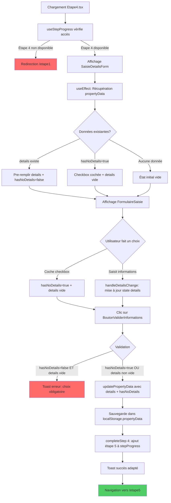

# 📄 Documentation complète - Étape 4 : Informations Complémentaires


## MISSION DU DOCUMENT

Ce document décrit le fonctionnement complet de l'**Étape 4** du processus de génération d'annonces immobilières dans LeadGenAI AdBuilder.

**Objectif de l'Étape 4** : Permettre aux utilisateurs de saisir des **informations complémentaires optionnelles** sur le bien (horaires d'ouverture, périodes de fermeture, autres détails d'exploitation) qui seront **uniquement utilisées dans l'Annonce Fiche de Synthèse**.

Cette étape est **optionnelle** mais l'utilisateur doit **obligatoirement faire un choix** :
- Soit cocher "Je n'ai pas d'informations complémentaires à fournir"
- Soit saisir des informations dans le champ texte

---

## SOMMAIRE CLIQUABLE

- [I. ARCHITECTURE GLOBALE - ÉTAPE 4](#i-architecture-globale---étape-4)
- [II. FICHIERS UTILISÉS (Liste exhaustive)](#ii-fichiers-utilisés-liste-exhaustive)
- [III. STRUCTURE DES DONNÉES DANS localStorage](#iii-structure-des-données-dans-localstorage)
- [IV. LOGIQUE DE VALIDATION DES CHAMPS](#iv-logique-de-validation-des-champs)
- [V. CONTRAINTES ET RÈGLES MÉTIER](#v-contraintes-et-règles-métier)
- [VI. NAVIGATION ET RETOUR EN ARRIÈRE](#vi-navigation-et-retour-en-arrière)
- [VII. UTILISATION DES DONNÉES PAR OPENAI](#vii-utilisation-des-données-par-openai)
- [VIII. PROCESSUS COMPLET ÉTAPE PAR ÉTAPE](#viii-processus-complet-étape-par-étape)
- [IX. ÉLÉMENTS CACHÉS / CONDITIONNELS](#ix-éléments-cachés--conditionnels)
- [X. TIMER DE SESSION (DÉSACTIVÉ MAIS PRÉSENT)](#x-timer-de-session-désactivé-mais-présent)
- [XI. RÉCAPITULATIF DES CLÉS localStorage](#xi-récapitulatif-des-clés-localstorage)
- [XII. DONNÉES DE L'ÉTAPE 4 À PRENDRE EN CONSIDÉRATION](#xii-données-de-létape-4-à-prendre-en-considération)

---

## I. ARCHITECTURE GLOBALE - ÉTAPE 4

### Vue d'ensemble

L'Étape 4 permet de collecter des **informations complémentaires optionnelles** sur le bien commercial :
- Horaires d'ouverture
- Périodes de fermeture
- Autres détails d'exploitation

**Particularités de l'Étape 4** :
- Étape **optionnelle** mais choix **obligatoire**
- Checkbox "Je n'ai pas d'informations complémentaires" disponible
- Les données sont **uniquement utilisées dans la Fiche de Synthèse** (pas dans les autres annonces)
- Utilisation du composant `FormulaireSaisie` avec formatage automatique (puces, capitalisation, hauteur dynamique)

### Flux de données simplifiées

```
Étape 3 (validée) 
    ↓
Arrivée sur Étape 4 
    ↓
Chargement des données depuis localStorage.propertyData
    ↓
Affichage du formulaire (pré-rempli ou vide)
    ↓
Utilisateur coche checkbox OU saisit informations
    ↓
Validation (choix obligatoire)
    ↓
Sauvegarde dans localStorage.propertyData.details (ou hasNoDetails)
    ↓
completeStep(4) → ajout étape 5 à stepProgress
    ↓
Navigation vers /etape5
```

### Schéma complet mermaid



### Détail du flux

1. **Chargement initial** : `Etape4.tsx` charge, `useStepProgress(4)` vérifie l'accès
2. **Vérification accès** : Si étape 4 non disponible → redirection `/etape1`
3. **Affichage formulaire** : `SaisieDetailsForm` s'affiche avec :
   - Checkbox "Je n'ai pas d'informations complémentaires"
   - `FormulaireSaisie` pour saisie libre
   - `BoutonValiderInformations` pour validation
4. **Chargement données** : `useEffect` récupère `propertyData` depuis `localStorage` et pré-remplit si disponible
5. **Interaction utilisateur** :
   - Option A : Coche checkbox → `hasNoDetails=true` + `details` vidé
   - Option B : Saisit informations → `details` mis à jour + `hasNoDetails=false` (auto)
6. **Validation** :
   - Si `!hasNoDetails` ET `details` vide → **Erreur** : choix obligatoire
   - Sinon → Sauvegarde via `updatePropertyData({ details, hasNoDetails })`
7. **Progression** : `completeStep(4)` ajoute l'étape 5 à `stepProgress` dans `localStorage`
8. **Navigation** : Redirection vers `/etape5`

---

## II. FICHIERS UTILISÉS (Liste exhaustive)

### 1. `src/1.etapes-generation-annonces/etape4/Etape4.tsx`
**Rôle** : Page principale de l'Étape 4

**Responsabilités** :
- Structure de la page avec layout `LayoutV2GenAnn`
- Hero section avec titre et description
- Intégration du formulaire `SaisieDetailsForm`
- Menu latéral avec `DirectivesMenuOnglet` et `EtapeFAQ`

**Code clé** :
```tsx
const { disabledSteps, completeStep, isStepAvailable } = useStepProgress(4);

React.useEffect(() => {
  if (!isStepAvailable(4)) {
    navigate("/etape1");
  }
}, [isStepAvailable, navigate]);
```

---

### 2. `src/components/1-Sources-Generation-Annonces/form-etape4/SaisieDetailsForm.tsx`
**Rôle** : Composant principal du formulaire de l'Étape 4

**États gérés** :
```tsx
const [details, setDetails] = useState("");
const [hasNoDetails, setHasNoDetails] = useState(false);
```

**Fonctions clés** :

**a) `handleDetailsChange`** : Mise à jour du champ `details`
```tsx
const handleDetailsChange = (e: React.ChangeEvent) => {
  setDetails(e.target.value);
  if (e.target.value.trim() !== "") {
    setHasNoDetails(false);
  }
};
```

**b) `handleHasNoDetailsChange`** : Gestion de la checkbox
```tsx
const handleHasNoDetailsChange = (value: boolean) => {
  setHasNoDetails(value);
  if (value === true) {
    setDetails("");
  }
};
```

**c) `handleValidation`** : Validation du formulaire
```tsx
const handleValidation = () => {
  if (!hasNoDetails && details.trim() === "") {
    toast({
      title: "Attention",
      description: "Cette étape est optionnelle, mais vous devez indiquer votre choix. Soit cocher la case 'Je n'ai pas d'informations complémentaires à fournir', soit saisir des informations.",
      duration: 5000,
    });
    return;
  }

  updatePropertyData({ 
    details: details,
    hasNoDetails: hasNoDetails
  });

  toast({
    title: "Informations validées",
    description: hasNoDetails 
      ? "Vous avez indiqué ne pas avoir d'informations complémentaires." 
      : "Vos informations complémentaires ont été enregistrées avec succès.",
    duration: 3000,
  });

  completeStep(4);
  navigate('/etape5');
};
```

**d) `handleBackToEtape5`** : Retour vers Étape 5 (modification)
```tsx
const handleBackToEtape5 = () => {
  if (!hasNoDetails && details.trim()) {
    updatePropertyData({ details });
    toast({
      title: "Modifications sauvegardées",
      description: "Vos modifications ont été enregistrées avant de retourner à l'étape finale.",
      duration: 3000,
    });
  } else if (hasNoDetails) {
    updatePropertyData({ 
      details: "",
      hasNoDetails: true
    });
  }
  goToEtape5();
};
```

**e) `useEffect` - Chargement des données** :
```tsx
useEffect(() => {
  const propertyData = getPropertyDataFromStorage();

  if (propertyData.details) {
    setDetails(propertyData.details);
    setHasNoDetails(false);
  } else if (propertyData.hasNoDetails) {
    setHasNoDetails(true);
    setDetails("");
  } else {
    setHasNoDetails(false);
    setDetails("");
  }
}, []);
```

---

### 3. `src/components/1-Sources-Generation-Annonces/form-components/FormulaireSaisie.tsx`
**Rôle** : Textarea avancé avec formatage automatique

**Fonctionnalités** :
- Ajout automatique de puces (`•`) en début de ligne
- Capitalisation automatique après la puce
- Hauteur dynamique selon le contenu
- Support `readOnly` quand checkbox cochée

**Code clé** :
```tsx
const handleInputChange = (e: React.ChangeEvent) => {
  const formattedText = newText.split('\n').map(line => {
    // Ajout automatique de '• ' si ligne non vide et sans préfixe
    if (!line.trimStart().startsWith('•') && 
        !line.trimStart().startsWith('■') && 
        !line.trimStart().startsWith('.') && 
        line.trim() !== '') {
      formattedLine = spacesPrefix + '• ' + line.trimStart();
    }
    // Capitalisation de la première lettre après '• '
    if (trimmedLine.startsWith('• ')) {
      formattedLine = spacesPrefix + '• ' + afterPrefix.charAt(0).toUpperCase() + afterPrefix.slice(1);
    }
    return formattedLine;
  }).join('\n');

  onChange(newEvent);
};
```

---

### 4. `src/components/1-Sources-Generation-Annonces/form-components/BoutonValiderInformations.tsx`
**Rôle** : Bouton de validation stylisé

**Props** :
```tsx
interface BoutonValiderInformationsProps {
  onClick?: () => void;
  disabled?: boolean;
  width?: string;
  height?: string;
  className?: string;
}
```

---

### 5. `src/components/1-Sources-Generation-Annonces/help/SgaHelpBox.tsx`
**Rôle** : Boîte d'aide contextuelle

**Props** :
```tsx
interface SgaHelpBoxProps {
  title: string;
  content: React.ReactNode;
  icon?: React.ReactNode;
  className?: string;
}
```

**Contenu d'aide Étape 4** (dans `SaisieDetailsForm.tsx`) :
```tsx
const helpContent = (
  <>
    Cette étape est optionnelle.
Vous pouvez néanmoins l'utiliser pour lister toutes les informations complémentaires en votre possession sur le bien.
Les données saisies ici seront uniquement utilisées dans la Fiche de Synthèse, pour apporter des précisions utiles sur les conditions d'exploitation du bien.
Propositions d'informations à inclure : 
. Listées et organisées dans votre Fiche de Synthèse.

      Horaires d'ouverture
      Périodes de fermeture
      Autres données utiles d'exploitation

    Plus vous fournissez d'informations précises, plus l'IA pourra générer une annonce originale, sur-mesure et percutante..

);
```

---

### 6. `src/components/1-Sources-Generation-Annonces/help/EtapeFAQ.tsx`
**Rôle** : FAQ contextuelle selon l'étape

**Contenu FAQ Étape 4** :
```tsx
case "etape4":
  titre = "Quelles informations intégrer ?";
  icon = ;
  contenu = (
    <>
      . Horaires d'ouverture : jours et heures d'exploitation
      . Périodes de fermeture : congés annuels, jours de fermeture réguliers
      . Autres informations utiles : conditions particulières d'exploitation, mentions réglementaires, remarques diverses...

        Plus vous fournissez d'informations précises, plus l'IA pourra générer une annonce originale, sur-mesure et percutante.

  );
```

---

### 7. `src/components/atemplate.v2.generation-annonces/DirectivesMenuOnglet.tsx`
**Rôle** : Menu de navigation entre étapes

**Props reçues depuis Étape 4** :
```tsx

```

---

### 8. `src/components/1-Sources-Generation-Annonces/utils/useStepProgress.ts`
**Rôle** : Hook de gestion de la progression

**Fonctions utilisées dans Étape 4** :
- `completeStep(4)` : Marque l'étape 4 comme complétée et débloque l'étape 5
- `isStepAvailable(4)` : Vérifie si l'étape 4 est accessible
- `goToEtape5()` : Navigation vers l'étape 5 (utilisé pour retour arrière)
- `disabledSteps` : Liste des étapes désactivées pour le menu

---

### 9. `src/services/openai.ts`
**Rôle** : Service de génération d'annonces via OpenAI

**Interface PropertyData** (extrait) :
```tsx
export interface PropertyData {
  // ... (autres champs des étapes 1, 2, 3)

  // Étape 4 - Autres détails
  details?: string;
  hasNoDetails?: boolean;
}
```

**Utilisation de `details` dans les prompts OpenAI** :

**a) `generateSummarySheetAd`** (Fiche de Synthèse) :
```tsx
const userPrompt = promptAnnonceFichedeSynthese
  // ... (autres remplacements)
  .replace(/\[informations complémentaires\]/g, data.details || "");
```

**Important** : Le champ `details` est **UNIQUEMENT** utilisé dans la **Fiche de Synthèse**, pas dans les autres annonces (Site Internet, Newsletter, Outils SEO, SMS, Google Business Profile, Réseaux Sociaux).

---

### 10. `src/services/openai/1.GenerateurAnnoncesOutilsSeo/7.PromptsOpenAi/2.PromptAnnonceFichedeSynthese.ts`
**Rôle** : Prompt OpenAI pour la Fiche de Synthèse

**Utilisation de `[informations complémentaires]`** :
```
Prise en compte des informations
...
. Autres détails: [informations complémentaires]

STRUCTURE DE L'ANNONCE FICHE DE SYNTHESE
...
Troisième sous-partie
Autres Détails 
. Présente les informations complémentaires uniquement si le champ "Autres détails" est renseigné. 
. Si une information est absente, n'invente rien, passe à la suivante.
Si aucune donnée "Autres Détails" n'est transmise, supprime cette section dans son intégralité, y compris le titre. 
. Ne rédige jamais la rubrique "Autres Détails" si les informations sont absentes.
```

---

### 11. `src/components/navigation-site-leadgenaiadbuilder/NavLinks.tsx`
**Rôle** : Configuration de la navigation globale

**Lien vers Étape 4** :
```tsx
export const navLinks: NavigationLink[] = [
  // ...
  {
    label: "4. Infos Complémentaires",
    path: "/etape4",
  },
  // ...
];
```

---

### 12. `src/components/atemplate.v2.generation-annonces/Layout.V2.GenAnn.tsx`
**Rôle** : Layout global des pages de génération d'annonces

**Utilisé par** : `Etape4.tsx`

---

## III. STRUCTURE DES DONNÉES DANS localStorage

### Clés principales utilisées par l'Étape 4

#### 1. `propertyData` (Objet JSON)

**Champs ajoutés/modifiés par l'Étape 4** :

| Champ | Type | Description | Valeur par défaut |
|-------|------|-------------|-------------------|
| `details` | `string` | Informations complémentaires sur le bien (horaires, fermeture, etc.) | `""` |
| `hasNoDetails` | `boolean` | Indique si l'utilisateur n'a pas d'informations complémentaires | `false` |

**Exemple de `propertyData` après Étape 4** :
```json
{
  "agencyName": "Cabinet Presenca",
  "reference": "REF-2025-001",
  "exclusivite": "Oui",
  "location": "Paris 16ème",
  "propertyType": "Restaurant",
  "saleType": "à vendre",
  "price": "350000",
  "keyElements": "Terrasse, Emplacement premium, Clientèle établie",
  "propertyDescription": "• Restaurant situé dans un quartier animé\n• Terrasse de 40m²\n• Cuisine entièrement équipée",
  "financials": "• CA annuel: 450 000 €\n• EBE: 18%\n• Bail 3/6/9 renouvelable",
  "details": "• Ouvert du mardi au dimanche\n• Fermeture annuelle en août\n• Licence IV",
  "hasNoDetails": false
}
```

**Exemple si checkbox cochée** :
```json
{
  // ... (autres champs)
  "details": "",
  "hasNoDetails": true
}
```

---

#### 2. `stepProgress` (Array JSON)

**Rôle** : Suivi de la progression de l'utilisateur

**Modification par l'Étape 4** :
- Avant validation : `[1, 2, 3, 4]`
- Après validation (`completeStep(4)`) : `[1, 2, 3, 4, 5]`

**Code** :
```tsx
const completeStep = (step: number) => {
  const nextStep = step + 1;
  const newAvailableSteps = [...new Set([...availableSteps, nextStep])];
  setAvailableSteps(newAvailableSteps);
  localStorage.setItem('stepProgress', JSON.stringify(newAvailableSteps));
};
```

---

#### 3. `generation_*` (Clés de génération)

**Non modifiées par l'Étape 4** - Générées ultérieurement à l'Étape 5 :
- `generation_website_ad`
- `generation_summary_sheet` (utilise `details`)
- `generation_newsletter`
- `generation_seo_tools`
- `generation_sms_ad`
- `generation_google_business_ad`
- `generation_social_media_ad`

---

## IV. LOGIQUE DE VALIDATION DES CHAMPS

### Règle de validation unique

**Validation obligatoire de choix** :

| Condition | Résultat |
|-----------|----------|
| `hasNoDetails === false` ET `details.trim() === ""` | ❌ **Erreur** : "Cette étape est optionnelle, mais vous devez indiquer votre choix. Soit cocher la case 'Je n'ai pas d'informations complémentaires à fournir', soit saisir des informations." |
| `hasNoDetails === true` | ✅ **Valide** : Sauvegarde avec `details=""` et `hasNoDetails=true` |
| `details.trim() !== ""` | ✅ **Valide** : Sauvegarde avec `details` et `hasNoDetails=false` |

**Code de validation** :
```tsx
const handleValidation = () => {
  if (!hasNoDetails && details.trim() === "") {
    toast({
      title: "Attention",
      description: "Cette étape est optionnelle, mais vous devez indiquer votre choix. Soit cocher la case 'Je n'ai pas d'informations complémentaires à fournir', soit saisir des informations.",
      duration: 5000,
    });
    return;
  }

  // Validation réussie
  updatePropertyData({ 
    details: details,
    hasNoDetails: hasNoDetails
  });

  // Toast adapté selon le choix
  toast({
    title: "Informations validées",
    description: hasNoDetails 
      ? "Vous avez indiqué ne pas avoir d'informations complémentaires." 
      : "Vos informations complémentaires ont été enregistrées avec succès.",
    duration: 3000,
  });

  completeStep(4);
  navigate('/etape5');
};
```

---

## V. CONTRAINTES ET RÈGLES MÉTIER

### 1. Règles d'accès

| Règle | Description |
|-------|-------------|
| **Progression séquentielle** | L'utilisateur doit avoir validé l'Étape 3 pour accéder à l'Étape 4 |
| **Vérification au chargement** | `useStepProgress(4)` vérifie si `stepProgress` contient `4` |
| **Redirection automatique** | Si étape 4 non disponible → redirection `/etape1` |

**Code** :
```tsx
React.useEffect(() => {
  if (!isStepAvailable(4)) {
    navigate("/etape1");
  }
}, [isStepAvailable, navigate]);
```

---

### 2. Règles de saisie

| Règle | Description |
|-------|-------------|
| **Formatage automatique** | `FormulaireSaisie` ajoute automatiquement des puces (`•`) en début de ligne |
| **Capitalisation** | Première lettre après la puce automatiquement en majuscule |
| **Hauteur dynamique** | Le textarea s'ajuste automatiquement à la hauteur du contenu |
| **ReadOnly conditionnel** | Si `hasNoDetails=true`, le textarea devient `readOnly` |

---

### 3. Règles de navigation

| Scénario | Comportement |
|----------|--------------|
| **Validation réussie** | Navigation vers `/etape5` + ajout de l'étape 5 à `stepProgress` |
| **Retour arrière depuis Étape 5** | Fonction `handleBackToEtape5()` sauvegarde les modifications avant retour |
| **Menu latéral** | Seules les étapes débloquées sont cliquables (`disabledSteps`) |

---

### 4. Règles de persistance des données

| Action | Effet sur `localStorage` |
|--------|--------------------------|
| **Validation** | Sauvegarde `details` et `hasNoDetails` dans `propertyData` |
| **Modification depuis Étape 5** | Sauvegarde automatique avant retour via `handleBackToEtape5()` |
| **Nouveau projet** | `clearPropertyData()` efface toutes les données, y compris `details` |

---

## VI. NAVIGATION ET RETOUR EN ARRIÈRE

### 1. Arrivée sur l'Étape 4

**Depuis Étape 3** :
- Validation de l'Étape 3 → `completeStep(3)` ajoute `4` à `stepProgress`
- Navigation vers `/etape4`
- `useStepProgress(4)` autorise l'accès
- `useEffect` charge les données existantes (si modification)

**Code de chargement** :
```tsx
useEffect(() => {
  const propertyData = getPropertyDataFromStorage();

  if (propertyData.details) {
    setDetails(propertyData.details);
    setHasNoDetails(false);
  } else if (propertyData.hasNoDetails) {
    setHasNoDetails(true);
    setDetails("");
  } else {
    setHasNoDetails(false);
    setDetails("");
  }
}, []);
```

---

### 2. Navigation vers Étape 5

**Après validation** :
```tsx
completeStep(4);  // Ajoute 5 à stepProgress
navigate('/etape5');
```

---

### 3. Retour arrière depuis Étape 5

**Scénario** : L'utilisateur clique sur "Modifier" pour l'Étape 4 depuis l'Étape 5

**Comportement** :
- Fonction `handleBackToEtape5()` appelée
- Si `details` contient des données → Sauvegarde via `updatePropertyData({ details })`
- Si `hasNoDetails=true` → Sauvegarde via `updatePropertyData({ details: "", hasNoDetails: true })`
- Navigation vers `/etape5` via `goToEtape5()`

**Code** :
```tsx
const handleBackToEtape5 = () => {
  if (!hasNoDetails && details.trim()) {
    updatePropertyData({ details });
    toast({
      title: "Modifications sauvegardées",
      description: "Vos modifications ont été enregistrées avant de retourner à l'étape finale.",
      duration: 3000,
    });
  } else if (hasNoDetails) {
    updatePropertyData({ 
      details: "",
      hasNoDetails: true
    });
  }
  goToEtape5();
};
```

---

### 4. Modification du menu latéral

**Comportement** :
- `DirectivesMenuOnglet` reçoit `activeStep={4}` et `disabledSteps`
- Les étapes non débloquées sont grisées et non cliquables
- L'utilisateur peut revenir aux étapes précédentes (1, 2, 3) si déjà validées

---

## VII. UTILISATION DES DONNÉES PAR OPENAI

### 🚨 IMPORTANT : Usage limité à la Fiche de Synthèse

Le champ `details` (informations complémentaires) est **UNIQUEMENT** utilisé dans la génération de l'**Annonce Fiche de Synthèse**.

**Il n'est PAS utilisé dans** :
- ❌ Annonce Site Internet
- ❌ Annonce Newsletter
- ❌ Outils SEO
- ❌ Annonce SMS
- ❌ Annonce Google Business Profile
- ❌ Annonce Réseaux Sociaux

---

### 1. Génération Fiche de Synthèse (`generateSummarySheetAd`)

**Fichier** : `src/services/openai.ts` (lignes 209-248)

**Remplacement du placeholder** :
```tsx
const userPrompt = promptAnnonceFichedeSynthese
  // ... (autres remplacements)
  .replace(/\[informations complémentaires\]/g, data.details || "");
```

**Prompt** : `2.PromptAnnonceFichedeSynthese.ts`

**Section concernée dans le prompt** :
```
Prise en compte des informations
...
. Autres détails: [informations complémentaires]

STRUCTURE DE L'ANNONCE FICHE DE SYNTHESE
...
Troisième sous-partie
Autres Détails 
. Présente les informations complémentaires uniquement si le champ "Autres détails" est renseigné. 
. Si une information est absente, n'invente rien, passe à la suivante.
Si aucune donnée "Autres Détails" n'est transmise, supprime cette section dans son intégralité, y compris le titre. 
. Ne rédige jamais la rubrique "Autres Détails" si les informations sont absentes.
```

**Réponse JSON attendue** :
```json
{
  "titre": "...",
  "referenceEtPrix": "...",
  "detailsCles": "...",
  "donneesFinancieres": "...",
  "informationsComplementaires": "..."  // ← Contient les données de 'details'
}
```

---

### 2. Comportement si `hasNoDetails=true`

**Cas** : L'utilisateur a coché "Je n'ai pas d'informations complémentaires"

**Données envoyées à OpenAI** :
```tsx
data.details = ""  // Chaîne vide
```

**Comportement du prompt** :
- Le placeholder `[informations complémentaires]` est remplacé par `""`
- Le prompt indique : "Si aucune donnée 'Autres Détails' n'est transmise, supprime cette section dans son intégralité"
- La section `Autres Détails` n'apparaît pas dans l'annonce générée
- Le champ `informationsComplementaires` du JSON retourné sera vide ou absent

---

## VIII. PROCESSUS COMPLET ÉTAPE PAR ÉTAPE

### 📍 Phase 1 : Arrivée sur l'Étape 4

**Étape 3.1** : L'utilisateur valide l'Étape 3  
→ `completeStep(3)` ajoute `4` à `stepProgress`  
→ Navigation vers `/etape4`

**Étape 3.2** : Chargement de `Etape4.tsx`  
→ `useStepProgress(4)` vérifie l'accès  
→ Si `stepProgress` ne contient pas `4` → Redirection `/etape1`

**Étape 3.3** : Affichage du formulaire  
→ Composant `SaisieDetailsForm` s'affiche  
→ Menu latéral avec `DirectivesMenuOnglet` et `EtapeFAQ`

---

### 📍 Phase 2 : Chargement des données

**Étape 2.1** : Exécution du `useEffect`  
→ Appel `getPropertyDataFromStorage()`  
→ Récupération de `propertyData` depuis `localStorage`

**Étape 2.2** : Pré-remplissage selon les données

**Cas A** : `propertyData.details` existe  
→ `setDetails(propertyData.details)`  
→ `setHasNoDetails(false)`  
→ Affichage du texte dans `FormulaireSaisie`

**Cas B** : `propertyData.hasNoDetails === true`  
→ `setHasNoDetails(true)`  
→ `setDetails("")`  
→ Checkbox cochée + textarea vide et `readOnly`

**Cas C** : Aucune donnée  
→ `setHasNoDetails(false)`  
→ `setDetails("")`  
→ État initial vide

---

### 📍 Phase 3 : Saisie des informations

**Option A : Utilisateur coche la checkbox**

**Étape A.1** : Clic sur checkbox  
→ `handleHasNoDetailsChange(true)` appelé

**Étape A.2** : Mise à jour des états  
→ `setHasNoDetails(true)`  
→ `setDetails("")` (vidage du champ)

**Étape A.3** : UI mis à jour  
→ Checkbox cochée  
→ Textarea vidé et devient `readOnly`

---

**Option B : Utilisateur saisit des informations**

**Étape B.1** : Saisie dans le textarea  
→ `handleDetailsChange()` appelé à chaque modification

**Étape B.2** : Mise à jour de l'état  
→ `setDetails(e.target.value)`  
→ Si `value.trim() !== ""` → `setHasNoDetails(false)` (auto)

**Étape B.3** : Formatage automatique  
→ `FormulaireSaisie` ajoute des puces (`•`)  
→ Capitalisation de la première lettre  
→ Ajustement dynamique de la hauteur du textarea

**Exemple** :
```
Utilisateur tape : "ouvert du lundi au vendredi"
Résultat affiché : "• Ouvert du lundi au vendredi"
```

---

### 📍 Phase 4 : Validation

**Étape 4.1** : Clic sur "Valider mes informations"  
→ `handleValidation()` appelé

**Étape 4.2** : Vérification du choix obligatoire

**Cas invalide** : `!hasNoDetails` ET `details.trim() === ""`  
→ Toast d'erreur affiché :
```
Titre: "Attention"
Description: "Cette étape est optionnelle, mais vous devez indiquer votre choix. 
              Soit cocher la case 'Je n'ai pas d'informations complémentaires à fournir', 
              soit saisir des informations."
```
→ Arrêt du processus (`return`)

**Cas valide** : `hasNoDetails=true` OU `details.trim() !== ""`  
→ Passage à l'étape suivante

---

**Étape 4.3** : Sauvegarde des données  
→ Appel `updatePropertyData({ details, hasNoDetails })`  
→ Fusion avec `propertyData` existant  
→ Sauvegarde dans `localStorage.propertyData`

**Exemple de données sauvegardées** :
```json
{
  "details": "• Ouvert du mardi au dimanche\n• Fermeture annuelle en août\n• Licence IV",
  "hasNoDetails": false
}
```

**Ou si checkbox cochée** :
```json
{
  "details": "",
  "hasNoDetails": true
}
```

---

**Étape 4.4** : Toast de succès adapté

**Si `hasNoDetails=true`** :
```
Titre: "Informations validées"
Description: "Vous avez indiqué ne pas avoir d'informations complémentaires."
```

**Si `details` renseigné** :
```
Titre: "Informations validées"
Description: "Vos informations complémentaires ont été enregistrées avec succès."
```

---

**Étape 4.5** : Progression  
→ `completeStep(4)` appelé  
→ Ajout de `5` à `stepProgress` dans `localStorage`  
→ `stepProgress` devient : `[1, 2, 3, 4, 5]`

---

**Étape 4.6** : Navigation  
→ `navigate('/etape5')`  
→ Redirection vers l'Étape 5 (page finale de génération)

---

### 📍 Phase 5 : Modification depuis l'Étape 5

**Scénario** : L'utilisateur veut modifier les informations complémentaires après avoir atteint l'Étape 5

**Étape 5.1** : Clic sur "Modifier" pour l'Étape 4  
→ Navigation vers `/etape4`  
→ `useStepProgress(4)` autorise l'accès (étape déjà débloquée)

**Étape 5.2** : Chargement des données  
→ `useEffect` charge `propertyData.details` et `propertyData.hasNoDetails`  
→ Pré-remplissage du formulaire avec les données existantes

**Étape 5.3** : Modification par l'utilisateur  
→ L'utilisateur modifie le texte ou change le statut de la checkbox

**Étape 5.4** : Retour vers l'Étape 5  
→ L'utilisateur clique sur un bouton "Retour" (si implémenté)  
→ `handleBackToEtape5()` appelé

**Étape 5.5** : Sauvegarde conditionnelle  
→ Si `details.trim()` non vide → `updatePropertyData({ details })`  
→ Si `hasNoDetails=true` → `updatePropertyData({ details: "", hasNoDetails: true })`  
→ Toast : "Modifications sauvegardées"

**Étape 5.6** : Navigation  
→ `goToEtape5()` appelé  
→ Redirection vers `/etape5`

---

## IX. ÉLÉMENTS CACHÉS / CONDITIONNELS

### 1. Textarea `readOnly`

**Condition** : `hasNoDetails === true`

**Comportement** :
- Le composant `FormulaireSaisie` reçoit la prop `readOnly={hasNoDetails}`
- Si `hasNoDetails=true` → textarea devient non éditable
- L'utilisateur doit décocher la checkbox pour pouvoir saisir du texte

**Code** :
```tsx

```

---

### 2. Section "Autres Détails" dans l'Annonce Fiche de Synthèse

**Condition** : `details` non vide

**Comportement dans le prompt OpenAI** :
```
Si aucune donnée "Autres Détails" n'est transmise, 
supprime cette section dans son intégralité, y compris le titre.
```

**Résultat** :
- Si `details=""` (ou `hasNoDetails=true`) → Pas de section "Autres Détails" dans l'annonce générée
- Si `details` renseigné → Section "Autres Détails" avec les informations formatées en puces

---

### 3. Bouton "Valider mes informations"

**Toujours visible** - Aucune condition de masquage

**Comportement** :
- Déclenche `handleValidation()` qui vérifie le choix obligatoire
- Affiche un toast d'erreur si aucun choix n'est fait

---

### 4. Menu latéral (`DirectivesMenuOnglet`)

**Étapes désactivées** : Déterminées par `disabledSteps` (provenant de `useStepProgress`)

**Comportement** :
- Les étapes non débloquées sont grisées et non cliquables
- L'utilisateur peut naviguer librement vers les étapes déjà validées (1, 2, 3)
- L'étape 5 n'est accessible qu'après validation de l'étape 4

---

### 5. Toast de succès adapté

**Condition** : Message différent selon `hasNoDetails`

**Si `hasNoDetails=true`** :
```tsx
toast({
  title: "Informations validées",
  description: "Vous avez indiqué ne pas avoir d'informations complémentaires.",
  duration: 3000,
});
```

**Si `details` renseigné** :
```tsx
toast({
  title: "Informations validées",
  description: "Vos informations complémentaires ont été enregistrées avec succès.",
  duration: 3000,
});
```

---

## X. TIMER DE SESSION (DÉSACTIVÉ MAIS PRÉSENT)

### État actuel

**Comportement observé** :
- Une clé `session_start_time` peut exister dans `localStorage` (créée dans d'anciennes versions)
- **Aucune logique active** dans l'Étape 4 pour gérer ce timer
- **Non utilisé** dans les composants actuels de l'Étape 4

---

### Incohérence potentielle dans `clearPropertyData()`

**Fichier** : `src/services/openai.ts` (ligne 360-362)

**Code actuel** :
```tsx
export const clearPropertyData = (): void => {
  localStorage.removeItem("propertyData");
};
```

**Comportement** :
- Supprime **uniquement** `propertyData`
- **Ne supprime pas** `session_start_time`, `stepProgress`, ni les clés `generation_*`

**Risque** :
- Incohérence : `propertyData` effacé mais `details` pourrait rester dans une ancienne version du cache
- Recommandation : Utiliser `localStorage.clear()` pour un reset complet (déjà implémenté dans `useStepProgress.handleConfirmNewProject()`)

---

### Clé `session_start_time`

**Valeur** : Timestamp de début de session (si implémenté)

**Exemple** : `1736928000000` (timestamp en millisecondes)

**Usage prévu** : Timer de session pour limiter la durée d'un projet (non actif dans le code actuel)

---

## XI. RÉCAPITULATIF DES CLÉS localStorage

### Clés utilisées par l'Étape 4

| Clé | Type | Lecture | Écriture | Description |
|-----|------|---------|----------|-------------|
| `propertyData` | Objet JSON | ✅ | ✅ | Données du bien (ajout de `details` et `hasNoDetails`) |
| `stepProgress` | Array JSON | ✅ | ✅ | Progression des étapes (ajout de `5` après validation) |

---

### Clés créées/modifiées par l'Étape 4

| Clé | Action | Valeur | Moment |
|-----|--------|--------|--------|
| `propertyData.details` | Création/Modification | Texte saisi par l'utilisateur | Validation |
| `propertyData.hasNoDetails` | Création/Modification | `true` ou `false` | Validation |
| `stepProgress` | Modification | Ajout de `5` | `completeStep(4)` |

---

### Clés non modifiées par l'Étape 4

**Clés `generation_*`** : Créées ultérieurement à l'Étape 5
- `generation_website_ad`
- `generation_summary_sheet`
- `generation_newsletter`
- `generation_seo_tools`
- `generation_sms_ad`
- `generation_google_business_ad`
- `generation_social_media_ad`

**Autres clés** :
- `session_start_time` (si présente, non utilisée par l'Étape 4)

---

## XII. DONNÉES DE L'ÉTAPE 4 À PRENDRE EN CONSIDÉRATION

### 1. Champs `propertyData`

| Champs `localStorage.propertyData` | Type | Obligatoire | Validation | Usage OpenAI |
|------------------------------------|------|-------------|------------|--------------|
| `details` | `string` | ❌ | Choix obligatoire (checkbox OU texte) | Fiche de Synthèse uniquement |
| `hasNoDetails` | `boolean` | ❌ | Automatique selon choix | Non envoyé à OpenAI (info métier) |

**Détail des champs** :

**`details`** :
- **Description** : Informations complémentaires sur le bien (horaires d'ouverture, périodes de fermeture, autres détails d'exploitation)
- **Format** : Texte libre avec formatage automatique (puces `•` et capitalisation)
- **Exemple** :
  ```
  • Ouvert du mardi au dimanche de 12h à 14h30 et de 19h à 23h
  • Fermeture annuelle en août
  • Licence IV
  • Terrasse autorisée jusqu'à 22h
  ```
- **Usage OpenAI** : Remplace `[informations complémentaires]` dans le prompt `2.PromptAnnonceFichedeSynthese.ts`

**`hasNoDetails`** :
- **Description** : Booléen indiquant si l'utilisateur a coché "Je n'ai pas d'informations complémentaires"
- **Valeurs possibles** :
  - `true` : Pas d'informations complémentaires → `details=""` (section "Autres Détails" absente de l'annonce)
  - `false` : Informations complémentaires fournies → `details` contient du texte
- **Usage métier** : Contrôle le `readOnly` du textarea et la logique de validation

---

### 2. Clés `generation_*` (créées à l'Étape 5)

| Clés `localStorage` | Utilise `details` ? | Utilise `hasNoDetails` ? | Description |
|---------------------|---------------------|--------------------------|-------------|
| `generation_website_ad` | ❌ | ❌ | Annonce Site Internet (n'utilise pas `details`) |
| `generation_summary_sheet` | ✅ | ❌ | **Fiche de Synthèse** (utilise `details` dans section "Autres Détails") |
| `generation_newsletter` | ❌ | ❌ | Annonce Newsletter (n'utilise pas `details`) |
| `generation_seo_tools` | ❌ | ❌ | Outils SEO (n'utilise pas `details`) |
| `generation_sms_ad` | ❌ | ❌ | Annonce SMS (n'utilise pas `details`) |
| `generation_google_business_ad` | ❌ | ❌ | Annonce Google Business Profile (n'utilise pas `details`) |
| `generation_social_media_ad` | ❌ | ❌ | Annonce Réseaux Sociaux (n'utilise pas `details`) |

**🚨 IMPORTANT** : Le champ `details` est **UNIQUEMENT** utilisé dans la **Fiche de Synthèse** (`generation_summary_sheet`).

---

### 3. Fonctions

| Fonction | Fichier | Description | Paramètres | Retour |
|----------|---------|-------------|------------|--------|
| `getPropertyDataFromStorage()` | `openai.ts` | Récupère `propertyData` depuis `localStorage` | Aucun | `PropertyData` |
| `updatePropertyData()` | `openai.ts` | Met à jour `propertyData` dans `localStorage` | `newData: Partial` | `PropertyData` |
| `completeStep()` | `useStepProgress.ts` | Marque une étape comme complétée et débloque la suivante | `step: number` | `void` |
| `handleValidation()` | `SaisieDetailsForm.tsx` | Valide le formulaire et navigue vers l'Étape 5 | Aucun | `void` |
| `handleDetailsChange()` | `SaisieDetailsForm.tsx` | Met à jour l'état `details` | `e: React.ChangeEvent` | `void` |
| `handleHasNoDetailsChange()` | `SaisieDetailsForm.tsx` | Met à jour l'état `hasNoDetails` et vide `details` si cochée | `value: boolean` | `void` |
| `handleBackToEtape5()` | `SaisieDetailsForm.tsx` | Sauvegarde les modifications et retourne à l'Étape 5 | Aucun | `void` |
| `handleInputChange()` | `FormulaireSaisie.tsx` | Formate automatiquement le texte (puces + capitalisation) | `e: React.ChangeEvent` | `void` |
| `adjustHeight()` | `FormulaireSaisie.tsx` | Ajuste dynamiquement la hauteur du textarea | Aucun | `void` |

---

### 4. Rappel des dépendances entre les étapes

| Étape source | Étape cible | Dépendance | Description |
|--------------|-------------|------------|-------------|
| **Étape 3** | **Étape 4** | ✅ Obligatoire | L'Étape 4 nécessite la validation de l'Étape 3 (`stepProgress` doit contenir `4`) |
| **Étape 4** | **Étape 5** | ✅ Obligatoire | L'Étape 5 nécessite la validation de l'Étape 4 (`completeStep(4)` ajoute `5` à `stepProgress`) |
| **Étape 4** | **OpenAI Fiche de Synthèse** | ⚠️ Optionnel | `details` utilisé dans `generateSummarySheetAd()` (section "Autres Détails") |
| **Étape 4** | **Autres annonces OpenAI** | ❌ Non utilisé | `details` **n'est pas** utilisé dans les autres annonces (Site Internet, Newsletter, SEO, SMS, Google, Réseaux Sociaux) |

**Schéma de dépendances** :
```
Étape 1 (agencyName, reference, location, propertyType, price/rent, keyElements)
    ↓
Étape 2 (propertyDescription)
    ↓
Étape 3 (financials)
    ↓
Étape 4 (details, hasNoDetails)  ← **Vous êtes ici**
    ↓
Étape 5 (Génération des 7 annonces OpenAI)
    ↓
    → Fiche de Synthèse (utilise details)
    → Annonce Site Internet (n'utilise pas details)
    → Newsletter (n'utilise pas details)
    → Outils SEO (n'utilise pas details)
    → SMS (n'utilise pas details)
    → Google Business Profile (n'utilise pas details)
    → Réseaux Sociaux (n'utilise pas details)
```

---

## 📌 POINTS CLÉS À RETENIR

1. **Étape optionnelle mais choix obligatoire** : L'utilisateur doit soit cocher la checkbox, soit saisir des informations.

2. **Usage limité** : Le champ `details` est **UNIQUEMENT** utilisé dans la **Fiche de Synthèse**, pas dans les autres annonces.

3. **Formatage automatique** : `FormulaireSaisie` ajoute des puces (`•`) et capitalise automatiquement.

4. **Double état** : `details` (texte) ET `hasNoDetails` (booléen) sont sauvegardés ensemble.

5. **Navigation conditionnelle** : L'Étape 5 n'est débloquée qu'après validation de l'Étape 4.

6. **Modification possible** : L'utilisateur peut revenir sur l'Étape 4 depuis l'Étape 5 pour modifier les informations.

7. **Reset complet** : `handleConfirmNewProject()` (dans `useStepProgress`) utilise `localStorage.clear()` pour effacer toutes les données.

---
