# 📋 DOCUMENTATION COMPLÈTE - ÉTAPE 5

## 🎯 MISSION DU DOCUMENT

Cette documentation décrit **l'Étape 5** du processus de génération d'annonces immobilières commerciales. Contrairement aux étapes précédentes, **l'Étape 5 ne collecte AUCUNE nouvelle donnée utilisateur**. Son rôle est d'**orchestrer la génération automatique** de toutes les annonces et outils SEO via OpenAI en utilisant les données collectées lors des étapes 1 à 4.

---

## 📑 SOMMAIRE CLIQUABLE

1. [ARCHITECTURE GLOBALE - ÉTAPE 5](#i-architecture-globale---étape-5)
2. [FICHIERS UTILISÉS (Liste exhaustive)](#ii-fichiers-utilisés-liste-exhaustive)
3. [STRUCTURE DES DONNÉES DANS localStorage](#iii-structure-des-données-dans-localstorage)
4. [LOGIQUE DE VALIDATION DES CHAMPS](#iv-logique-de-validation-des-champs)
5. [CONTRAINTES ET RÈGLES MÉTIER](#v-contraintes-et-règles-métier)
6. [NAVIGATION ET RETOUR EN ARRIÈRE](#vi-navigation-et-retour-en-arrière)
7. [UTILISATION DES DONNÉES PAR OPENAI](#vii-utilisation-des-données-par-openai)
8. [PROCESSUS COMPLET ÉTAPE PAR ÉTAPE](#viii-processus-complet-étape-par-étape)
9. [ÉLÉMENTS CACHÉS / CONDITIONNELS](#ix-éléments-cachés--conditionnels)
10. [TIMER DE SESSION (DÉSACTIVÉ MAIS PRÉSENT)](#x-timer-de-session-désactivé-mais-présent)
11. [RÉCAPITULATIF DES CLÉS localStorage](#xi-récapitulatif-des-clés-localstorage)
12. [DONNÉES DE L'ÉTAPE 5 À PRENDRE EN CONSIDÉRATION](#xii-données-de-létape-5-à-prendre-en-considération)

---

## I. ARCHITECTURE GLOBALE - ÉTAPE 5

### Vue d'ensemble

L'**Étape 5** est le **point culminant** du processus de génération. Elle :
- ✅ **Récupère** toutes les données des étapes 1-4 depuis `localStorage.propertyData`
- ✅ **Lance** 7 appels séquentiels à l'API OpenAI pour générer les annonces
- ✅ **Stocke** les résultats dans `localStorage` (clés `generation_*`)
- ✅ **Affiche** une page d'animation pendant la génération
- ✅ **Redirige** vers l'étape 6 (Communication) une fois terminé

### Flux de données simplifiées

```
localStorage.propertyData (Étapes 1-4)
         ↓
    Étape 5
         ↓
   OpenAI API (7 appels)
         ↓
localStorage.generation_* (7 clés)
         ↓
  Page Animation
         ↓
Étape 6 Communication
```

### Schéma complet Mermaid

```mermaid
graph TD
    A[Chargement Etape5.tsx] --> B[useStepProgress vérifie accès]
    B -->|Étape 5 non disponible| C[Redirection /etape1]
    B -->|Étape 5 disponible| D[Affichage page Étape 5]
    D --> E[useEffect: Vérification timer session]
    E --> F{Clé OpenAI disponible?}
    F -->|Non| G[useOpenAI Context - Clé par défaut]
    F -->|Oui| H[Clé récupérée depuis OpenAIContext]
    H --> I[Affichage Interface Étape 5]
    I --> J[Utilisateur clique 'Générer mes Annonces']
    J --> K{isGenerating?}
    K -->|Oui| L[Fonction bloquée]
    K -->|Non| M[setIsGenerating true]
    M --> N[resetSessionTimer]
    N --> O[getPropertyDataFromStorage]
    O --> P{OpenAI API Key valide?}
    P -->|Non| Q[Toast erreur + Return]
    P -->|Oui| R[Initialisation generation_status dans localStorage]
    R --> S[completeStep 5]
    S --> T[Navigation vers /etape5/animation]
    T --> U[Création services OpenAI]
    U --> V[Appel 1: generateWebsiteAd]
    V --> W[Sauvegarde generation_website_ad + updateGenerationStatus 14%]
    W --> X[Appel 2: generateSummarySheetAd]
    X --> Y[Sauvegarde generation_summary_sheet + updateGenerationStatus 28%]
    Y --> Z[Appel 3: generateNewsletterAd]
    Z --> AA[Sauvegarde generation_newsletter + updateGenerationStatus 42%]
    AA --> AB[Appel 4: generateSEOTools]
    AB --> AC[Sauvegarde generation_seo_tools + updateGenerationStatus 56%]
    AC --> AD[Appel 5: generateSMSAd]
    AD --> AE[Sauvegarde generation_sms_ad + updateGenerationStatus 70%]
    AE --> AF[Appel 6: generateGoogleBusinessProfileAd]
    AF --> AG[Sauvegarde generation_googleprofile_ad + updateGenerationStatus 85%]
    AG --> AH[Appel 7: generateReseauxSociauxAd]
    AH --> AI[Sauvegarde generation_reseauxsociaux_ad + updateGenerationStatus 100%]
    AI --> AJ[updateGenerationStatus completed: true]
    AJ --> AK[setTimeout 1 seconde]
    AK --> AL[Navigation vers /etape6communication]

    style A fill:#E5DEFF
    style D fill:#9b87f5
    style I fill:#D6BCFA
    style J fill:#F1940F
    style T fill:#4A2B87,color:#fff
    style AL fill:#0EA5E9,color:#fff
```

### Détail du flux

1. **Chargement initial** : `Etape5.tsx` s'affiche
2. **Vérification d'accès** : `useStepProgress(5)` vérifie que l'étape 5 est disponible
3. **Récupération clé OpenAI** : Via le contexte `OpenAIContext`
4. **Clic utilisateur** : Sur le bouton "Générer mes Annonces"
5. **Validation clé** : Si pas de clé → erreur
6. **Initialisation status** : Création de `generation_status` dans `localStorage`
7. **Navigation animation** : Redirection vers `/etape5/animation`
8. **7 appels OpenAI séquentiels** : Chaque appel met à jour le statut de progression
9. **Sauvegarde résultats** : Dans les clés `generation_*`
10. **Redirection finale** : Vers `/etape6communication`

---

## II. FICHIERS UTILISÉS (Liste exhaustive)

### 📄 1. **src/1.etapes-generation-annonces/etape5/Etape5.tsx**
**Rôle** : Page principale de l'Étape 5 - Orchestrateur de la génération OpenAI  
**Fonctions clés** :
- `handleValidateAndFinish()` : Lance la génération OpenAI
- `updateGenerationStatus()` : Met à jour la progression dans `localStorage`

**Code clé** :
```typescript
const handleValidateAndFinish = async () => {
  setIsGenerating(true);
  resetSessionTimer();
  const propertyData = getPropertyDataFromStorage();

  // Initialisation du statut
  localStorage.setItem('generation_status', JSON.stringify({
    startTime: new Date().getTime(),
    websiteAd: false,
    summarySheet: false,
    newsletter: false,
    seoTools: false,
    smsAd: false,
    googleBusinessProfile: false,
    reseauxSociaux: false,
    completed: false,
    progress: 0
  }));

  completeStep(5);
  navigate("/etape5/animation");

  // 7 appels séquentiels OpenAI...
};
```

---

### 📄 2. **src/1.etapes-generation-annonces/etape5/SafeEtape5.tsx**
**Rôle** : Version alternative (désactivée) de l'Étape 5  
**Différence** : Gestion du timer de session plus visible dans l'UI

---

### 📄 3. **src/1.etapes-generation-annonces/etape5/Animation.tsx**
**Rôle** : Page d'animation affichée pendant la génération OpenAI  
**Fonctions clés** :
- `checkGenerationStatus()` : Surveille `generation_status` toutes les 500ms
- Redirection automatique vers `/etape6communication` quand `completed: true`

**Code clé** :
```typescript
useEffect(() => {
  const checkGenerationStatus = () => {
    const status: GenerationStatus = JSON.parse(localStorage.getItem('generation_status'));
    setProgressValue(status.progress);

    if (status.completed) {
      setTimeout(() => navigate("/etape6communication"), 1500);
    }
  };

  const intervalId = setInterval(checkGenerationStatus, 500);
  return () => clearInterval(intervalId);
}, [navigate]);
```

---

### 📄 4. **src/components/1-Sources-Generation-Annonces/form-components/BoutonEtape5LancerOpenAI.tsx**
**Rôle** : Bouton principal de lancement de la génération  
**Props** :
- `onClick` : Fonction `handleValidateAndFinish`
- `disabled` : État `isGenerating`
- `isGenerating` : Affiche animation de pulse

**Code clé** :
```typescript

  {isGenerating ? "Génération en cours..." : "Générer mes Annonces"}

```

---

### 📄 5. **src/services/openai.ts**
**Rôle** : Service principal OpenAI - Contient les 4 méthodes de génération principales  
**Fonctions** :
- `generateWebsiteAd()` : Annonce Site Internet
- `generateSummarySheetAd()` : Fiche de Synthèse
- `generateNewsletterAd()` : Annonce Newsletter
- `generateSEOTools()` : Outils SEO

**Utilisation des données** : TOUTES les données de `propertyData` (étapes 1-4)

---

### 📄 6. **src/services/openai/.../1.API-AnnonceSMS.ts**
**Rôle** : Service pour générer l'annonce SMS  
**Fonction** : `generateSMSAd()`  
**Retour** : `{ "restitution-annonce-sms": string }`

---

### 📄 7. **src/services/openai/.../2.API-AnnonceGoogleBusinessProfile.ts**
**Rôle** : Service pour générer l'annonce Google Business Profile  
**Fonction** : `generateGoogleBusinessProfileAd()`  
**Retour** :
```typescript
{
  TitreAnnonceGoogle: string;
  AccrocheDescriptiveAnnonceGoogle: string;
  PointsFortsAnnonceGoogle: string;
  CtaAnnonceGoogle: string;
}
```

---

### 📄 8. **src/services/openai/.../3.API-AnnonceReseauxSociaux.ts**
**Rôle** : Service pour générer l'annonce Réseaux Sociaux  
**Fonction** : `generateReseauxSociauxAd()`  
**Retour** :
```typescript
{
  TitreAnnonceReseaux: string;
  AccrocheImpactanteAnnonceReseaux: string;
  AtoutsAnnonceReseaux: string;
  CtaAnnonceReseaux: string;
}
```

---

### 📄 9. **src/contexts/OpenAIContext.tsx**
**Rôle** : Contexte React pour gérer les clés API OpenAI  
**État** :
- `apiKey` : Clé OpenAI principale (valeur par défaut hard-codée)
- `assistantId` : ID de l'assistant OpenAI

**Code clé** :
```typescript
const DEFAULT_API_KEY = "sk-proj-...";
const { apiKey } = useOpenAI(); // Utilisé dans Etape5.tsx
```

---

### 📄 10. **src/components/1-Sources-Generation-Annonces/utils/useStepProgress.ts**
**Rôle** : Hook pour gérer la progression entre étapes  
**Fonctions utilisées dans Étape 5** :
- `isStepAvailable(5)` : Vérifie l'accès à l'étape 5
- `completeStep(5)` : Marque l'étape 5 comme terminée
- `handleConfirmNewProject()` : Réinitialise tout le projet

---

### 📄 11. **src/components/atemplate.v2.generation-annonces/DirectivesMenuOnglet.tsx**
**Rôle** : Menu de navigation latéral avec onglets des étapes 1-4  
**Props** :
- `activeStep={5}` : Indique l'étape actuelle
- `disabledSteps` : Étapes non accessibles

---

### 📄 12. **src/0.structure-type-page/structure5HeroPetit/StructureHeroPetit.tsx**
**Rôle** : Composant header avec titre, sous-titre et image robot  
**Props** :
- `title` : "Félicitations ! Vos Annonces et Outils sont prêts..."
- `subtitle` : "Tous les éléments nécessaires..."
- `imageSrc` : Image du robot IA

---

## III. STRUCTURE DES DONNÉES DANS localStorage

### 1. **localStorage.propertyData** (Lecture seule à l'Étape 5)

**Source** : Données collectées lors des Étapes 1 à 4  
**Utilisation** : Récupérées via `getPropertyDataFromStorage()` puis envoyées à OpenAI

| Champ | Étape d'origine | Utilisation OpenAI |
|-------|-----------------|-------------------|
| `agencyName` | Étape 1 | ✅ Toutes les annonces |
| `reference` | Étape 1 | ✅ Toutes les annonces |
| `exclusivite` | Étape 1 | ✅ Toutes les annonces |
| `location` | Étape 1 | ✅ Toutes les annonces |
| `propertyType` | Étape 1 | ✅ Toutes les annonces |
| `saleType` | Étape 1 | ✅ Toutes les annonces |
| `price` | Étape 1 | ✅ Toutes les annonces |
| `rentAmount` | Étape 1 | ✅ Toutes les annonces |
| `rentPeriodicity` | Étape 1 | ✅ Toutes les annonces |
| `keyElements` | Étape 1 | ✅ Toutes les annonces |
| `propertyDescription` | Étape 2 | ✅ Toutes les annonces |
| `financials` | Étape 3 | ✅ Toutes les annonces |
| `details` | Étape 4 | ✅ Fiche de Synthèse uniquement |
| `hasNoDetails` | Étape 4 | ✅ Logique conditionnelle |

---

### 2. **localStorage.stepProgress** (Mise à jour)

**Avant Étape 5** : `[1, 2, 3, 4, 5]`  
**Après `completeStep(5)`** : `[1, 2, 3, 4, 5, 6]` → Débloque l'accès à l'étape 6

---

### 3. **localStorage.generation_status** (Créé par l'Étape 5)

**Structure** :
```typescript
interface GenerationStatus {
  startTime: number;           // Timestamp de début
  websiteAd: boolean;          // Étape 1/7 terminée
  summarySheet: boolean;       // Étape 2/7 terminée
  newsletter: boolean;         // Étape 3/7 terminée
  seoTools: boolean;           // Étape 4/7 terminée
  smsAd: boolean;              // Étape 5/7 terminée
  googleBusinessProfile: boolean; // Étape 6/7 terminée
  reseauxSociaux: boolean;     // Étape 7/7 terminée
  completed: boolean;          // Toutes les étapes terminées
  progress: number;            // % de progression (0-100)
}
```

**Utilisation** : Surveillé par `Animation.tsx` pour afficher la progression

---

### 4. **localStorage.generation_website_ad** (Créé par l'Étape 5)

**Contenu** : Résultat JSON de `generateWebsiteAd()`
```json
{
  "titre": "...",
  "accroche": "...",
  "descriptif": "...",
  "cta": "..."
}
```

---

### 5. **localStorage.generation_summary_sheet** (Créé par l'Étape 5)

**Contenu** : Résultat JSON de `generateSummarySheetAd()`
```json
{
  "titre": "...",
  "referenceEtPrix": "...",
  "detailsCles": "...",
  "donneesFinancieres": "...",
  "informationsComplementaires": "..."
}
```

---

### 6. **localStorage.generation_newsletter** (Créé par l'Étape 5)

**Contenu** : Résultat JSON de `generateNewsletterAd()`
```json
{
  "titre": "...",
  "accroche": "...",
  "pointsForts": "...",
  "callToAction": "...",
  "prixEtReference": "..."
}
```

---

### 7. **localStorage.generation_seo_tools** (Créé par l'Étape 5)

**Contenu** : Résultat JSON de `generateSEOTools()`
```json
{
  "baliseTitre": "...",
  "baliseMetaDescription": "...",
  "urlLongueTraine": "..."
}
```

---

### 8. **localStorage.generation_sms_ad** (Créé par l'Étape 5)

**Contenu** : Résultat JSON de `generateSMSAd()`
```json
{
  "restitution-annonce-sms": "..."
}
```

---

### 9. **localStorage.generation_googleprofile_ad** (Créé par l'Étape 5)

**Contenu** : Résultat JSON de `generateGoogleBusinessProfileAd()`
```json
{
  "TitreAnnonceGoogle": "...",
  "AccrocheDescriptiveAnnonceGoogle": "...",
  "PointsFortsAnnonceGoogle": "...",
  "CtaAnnonceGoogle": "..."
}
```

---

### 10. **localStorage.generation_reseauxsociaux_ad** (Créé par l'Étape 5)

**Contenu** : Résultat JSON de `generateReseauxSociauxAd()`
```json
{
  "TitreAnnonceReseaux": "...",
  "AccrocheImpactanteAnnonceReseaux": "...",
  "AtoutsAnnonceReseaux": "...",
  "CtaAnnonceReseaux": "..."
}
```

---

### 11. **localStorage.session_start_time** (Lecture seule)

**Rôle** : Timer de session (désactivé mais présent dans `SafeEtape5.tsx`)  
**Utilisation** : Calcule le temps restant avant expiration de la session

---

## IV. LOGIQUE DE VALIDATION DES CHAMPS

### ⚠️ **AUCUNE VALIDATION DE CHAMPS À L'ÉTAPE 5**

L'Étape 5 **ne collecte AUCUNE donnée utilisateur**. Elle se contente de :
1. ✅ Vérifier la présence d'une clé OpenAI (`openAIApiKey`)
2. ✅ Vérifier que `propertyData` existe dans le `localStorage`

### Validation unique : Clé OpenAI

```typescript
if (!openAIApiKey) {
  toast({
    title: "Erreur de configuration",
    description: "Clé API OpenAI manquante...",
    duration: 5000
  });
  setIsGenerating(false);
  return;
}
```

**Si la clé est absente** : Toast d'erreur + arrêt du processus  
**Si la clé est présente** : Lancement de la génération

---

## V. CONTRAINTES ET RÈGLES MÉTIER

### 1. **Contrainte d'accès**
- L'utilisateur **DOIT** avoir complété les étapes 1 à 4
- Vérification via `isStepAvailable(5)` :
  ```typescript
  if (!isStepAvailable(5)) {
    navigate("/etape1"); // Redirection si accès non autorisé
  }
  ```

---

### 2. **Contrainte de clé OpenAI**
- Une clé OpenAI **DOIT** être configurée
- Par défaut : clé hard-codée dans `OpenAIContext.tsx`
- Possibilité de personnalisation via stockage dans `localStorage`

---

### 3. **Contrainte de séquentialité**
- Les 7 appels OpenAI sont **séquentiels** (un après l'autre)
- Chaque appel attend le résultat du précédent avant de continuer
- **Raison** : Mise à jour progressive du statut de génération

---

### 4. **Contrainte de navigation**
- Redirection **automatique** vers `/etape5/animation` dès le clic sur "Générer"
- Redirection **automatique** vers `/etape6communication` une fois la génération terminée
- **Aucune intervention manuelle** requise

---

### 5. **Contrainte de gestion d'erreur**
- Chaque appel OpenAI est entouré d'un `try-catch`
- En cas d'erreur : Log dans la console + **poursuite** du processus
- **Pas d'interruption** si un appel échoue

```typescript
try {
  const websiteAdResult = await openAIService.generateWebsiteAd(propertyData);
  localStorage.setItem('generation_website_ad', JSON.stringify(websiteAdResult));
  updateGenerationStatus('websiteAd', true, 14);
} catch (error) {
  console.error("Erreur lors de la génération de l'annonce site internet:", error);
  // Continue vers l'appel suivant
}
```

---

### 6. **Contrainte de progression**
- Le statut de progression est mis à jour à **7 paliers** :
  - 14% → Annonce Site Internet
  - 28% → Fiche de Synthèse
  - 42% → Annonce Newsletter
  - 56% → Outils SEO
  - 70% → Annonce SMS
  - 85% → Annonce Google Business Profile
  - 100% → Annonce Réseaux Sociaux

---

## VI. NAVIGATION ET RETOUR EN ARRIÈRE

### 1. **Arrivée sur l'Étape 5**

**Depuis l'Étape 4** :
- Clic sur "Valider et passer à l'étape suivante" dans Étape 4
- `navigate("/etape5")` → Affichage de `Etape5.tsx`

**Depuis l'Étape 6 (retour arrière)** :
- Clic sur l'onglet "Étape 5" dans `DirectivesMenuOnglet`
- `navigate("/etape5")` → Affichage de `Etape5.tsx`

---

### 2. **Navigation au sein de l'Étape 5**

**Clic sur "Générer mes Annonces"** :
1. Lancement de `handleValidateAndFinish()`
2. Redirection immédiate vers `/etape5/animation`
3. Page d'animation affichée **pendant** les appels OpenAI
4. Redirection automatique vers `/etape6communication` une fois terminé

---

### 3. **Modification des données (retour arrière)**

**Depuis l'Étape 5** :
- Clic sur un onglet du `DirectivesMenuOnglet` (Étapes 1-4)
- Modification des données dans l'étape concernée
- Retour sur l'Étape 5 via le menu
- **Relance de la génération** nécessaire pour mettre à jour les annonces

**Comportement** :
- Les anciennes annonces (`generation_*`) restent dans le `localStorage`
- **Écrasement** lors de la prochaine génération

---

### 4. **Création d'un nouveau projet**

**Depuis l'Étape 5** :
- Clic sur "Générer un nouveau projet" (bouton poubelle dans `SafeEtape5.tsx`)
- Appel de `handleConfirmNewProject()`
- **Suppression totale** : `localStorage.clear()`
- Redirection vers `/etape1` + `window.location.reload()`

---

## VII. UTILISATION DES DONNÉES PAR OPENAI

### 🚀 **7 Appels OpenAI séquentiels**

L'Étape 5 orchestre **7 générations** distinctes en utilisant les données de `propertyData` :

---

### 1. **generateWebsiteAd** → Annonce Site Internet

**Service** : `openai.ts` → `OpenAIService.generateWebsiteAd()`  
**Données utilisées** :
- ✅ Toutes les données de l'étape 1 (`agencyName`, `reference`, `exclusivite`, `location`, `propertyType`, `saleType`, `price`, `rentAmount`, `rentPeriodicity`, `keyElements`)
- ✅ `propertyDescription` (Étape 2)
- ✅ `financials` (Étape 3)
- ✅ `details` (Étape 4)

**Retour** :
```json
{
  "titre": "...",
  "accroche": "...",
  "descriptif": "...",
  "cta": "..."
}
```

**Stockage** : `localStorage.generation_website_ad`

---

### 2. **generateSummarySheetAd** → Fiche de Synthèse

**Service** : `openai.ts` → `OpenAIService.generateSummarySheetAd()`  
**Données utilisées** :
- ✅ Toutes les données de l'étape 1
- ✅ `propertyDescription` (Étape 2)
- ✅ `financials` (Étape 3)
- ✅ **`details` (Étape 4)** ← SEULE UTILISATION DU CHAMP `details`

**Retour** :
```json
{
  "titre": "...",
  "referenceEtPrix": "...",
  "detailsCles": "...",
  "donneesFinancieres": "...",
  "informationsComplementaires": "..."
}
```

**Stockage** : `localStorage.generation_summary_sheet`

---

### 3. **generateNewsletterAd** → Annonce Newsletter

**Service** : `openai.ts` → `OpenAIService.generateNewsletterAd()`  
**Données utilisées** :
- ✅ Toutes les données de l'étape 1
- ✅ `propertyDescription` (Étape 2)
- ✅ `financials` (Étape 3)

**Retour** :
```json
{
  "titre": "...",
  "accroche": "...",
  "pointsForts": "...",
  "callToAction": "...",
  "prixEtReference": "..."
}
```

**Stockage** : `localStorage.generation_newsletter`

---

### 4. **generateSEOTools** → Outils SEO

**Service** : `openai.ts` → `OpenAIService.generateSEOTools()`  
**Données utilisées** :
- ✅ Toutes les données de l'étape 1
- ✅ `propertyDescription` (Étape 2)
- ✅ `financials` (Étape 3)

**Retour** :
```json
{
  "baliseTitre": "...",
  "baliseMetaDescription": "...",
  "urlLongueTraine": "..."
}
```

**Stockage** : `localStorage.generation_seo_tools`

---

### 5. **generateSMSAd** → Annonce SMS

**Service** : `1.API-AnnonceSMS.ts` → `OpenAISMSService.generateSMSAd()`  
**Données utilisées** :
- ✅ Toutes les données de l'étape 1
- ✅ `propertyDescription` (Étape 2)
- ✅ `financials` (Étape 3)

**Retour** :
```json
{
  "restitution-annonce-sms": "..."
}
```

**Stockage** : `localStorage.generation_sms_ad`

---

### 6. **generateGoogleBusinessProfileAd** → Annonce Google Business Profile

**Service** : `2.API-AnnonceGoogleBusinessProfile.ts` → `OpenAIGoogleBusinessProfileService.generateGoogleBusinessProfileAd()`  
**Données utilisées** :
- ✅ Toutes les données de l'étape 1
- ✅ `propertyDescription` (Étape 2)
- ✅ `financials` (Étape 3)

**Retour** :
```json
{
  "TitreAnnonceGoogle": "...",
  "AccrocheDescriptiveAnnonceGoogle": "...",
  "PointsFortsAnnonceGoogle": "...",
  "CtaAnnonceGoogle": "..."
}
```

**Stockage** : `localStorage.generation_googleprofile_ad`

---

### 7. **generateReseauxSociauxAd** → Annonce Réseaux Sociaux

**Service** : `3.API-AnnonceReseauxSociaux.ts` → `OpenAIReseauxSociauxService.generateReseauxSociauxAd()`  
**Données utilisées** :
- ✅ Toutes les données de l'étape 1
- ✅ `propertyDescription` (Étape 2)
- ✅ `financials` (Étape 3)

**Retour** :
```json
{
  "TitreAnnonceReseaux": "...",
  "AccrocheImpactanteAnnonceReseaux": "...",
  "AtoutsAnnonceReseaux": "...",
  "CtaAnnonceReseaux": "..."
}
```

**Stockage** : `localStorage.generation_reseauxsociaux_ad`

---

## VIII. PROCESSUS COMPLET ÉTAPE PAR ÉTAPE

### 🎬 **Scénario utilisateur standard**

#### **1. Arrivée sur l'Étape 5**
- L'utilisateur a complété les étapes 1 à 4
- Navigation via clic "Valider et passer à l'étape suivante" dans Étape 4
- Affichage de `Etape5.tsx`

---

#### **2. Vérification d'accès**
- `useStepProgress(5)` vérifie que `stepProgress` contient `[1, 2, 3, 4, 5]`
- Si l'étape 5 n'est pas disponible → Redirection `/etape1`
- Si OK → Affichage de la page

---

#### **3. Affichage de l'interface**
- **Header** : "Félicitations ! Vos Annonces et Outils sont prêts à être générés"
- **Image** : Robot IA mauve
- **Texte** : "Si tout est en ordre, lancez notre IA..."
- **Bouton** : "Générer mes Annonces" (`BoutonEtape5LancerOpenAI`)
- **Menu latéral** : `DirectivesMenuOnglet` avec onglets des étapes 1-4

---

#### **4. Modification optionnelle**
- L'utilisateur peut cliquer sur un onglet du menu (Étapes 1-4)
- Modification des données
- Retour sur l'Étape 5 via le menu
- **Les données modifiées seront prises en compte** lors de la prochaine génération

---

#### **5. Lancement de la génération**
- Clic sur "Générer mes Annonces"
- Appel de `handleValidateAndFinish()`
- `setIsGenerating(true)` → Désactive le bouton
- `resetSessionTimer()` → Réinitialise le timer de session
- `getPropertyDataFromStorage()` → Récupère toutes les données

---

#### **6. Validation de la clé OpenAI**
- Vérification de `openAIApiKey` depuis `OpenAIContext`
- Si absente → Toast d'erreur + `return`
- Si présente → Suite du processus

---

#### **7. Initialisation du statut de génération**
```typescript
localStorage.setItem('generation_status', JSON.stringify({
  startTime: new Date().getTime(),
  websiteAd: false,
  summarySheet: false,
  newsletter: false,
  seoTools: false,
  smsAd: false,
  googleBusinessProfile: false,
  reseauxSociaux: false,
  completed: false,
  progress: 0
}));
```

---

#### **8. Marquage de l'étape 5 comme complétée**
- `completeStep(5)` → Ajoute `6` à `stepProgress`
- `stepProgress` devient `[1, 2, 3, 4, 5, 6]`

---

#### **9. Redirection vers la page d'animation**
- `navigate("/etape5/animation")`
- Affichage de `Animation.tsx` avec robot animé
- Barre de progression circulaire affichée

---

#### **10. Création des services OpenAI**
```typescript
const openAIService = createOpenAIService(openAIApiKey);
const openAISMSService = createOpenAISMSService(openAIApiKey);
const openAIGoogleBusinessProfileService = createOpenAIGoogleBusinessProfileService(openAIApiKey);
const openAIReseauxSociauxService = createOpenAIReseauxSociauxService(openAIApiKey);
```

---

#### **11. Appel 1/7 : Annonce Site Internet**
```typescript
const websiteAdResult = await openAIService.generateWebsiteAd(propertyData);
localStorage.setItem('generation_website_ad', JSON.stringify(websiteAdResult));
updateGenerationStatus('websiteAd', true, 14);
```
**Progression** : 14%

---

#### **12. Appel 2/7 : Fiche de Synthèse**
```typescript
const summarySheetResult = await openAIService.generateSummarySheetAd(propertyData);
localStorage.setItem('generation_summary_sheet', JSON.stringify(summarySheetResult));
updateGenerationStatus('summarySheet', true, 28);
```
**Progression** : 28%

---

#### **13. Appel 3/7 : Annonce Newsletter**
```typescript
const newsletterResult = await openAIService.generateNewsletterAd(propertyData);
localStorage.setItem('generation_newsletter', JSON.stringify(newsletterResult));
updateGenerationStatus('newsletter', true, 42);
```
**Progression** : 42%

---

#### **14. Appel 4/7 : Outils SEO**
```typescript
const seoToolsResult = await openAIService.generateSEOTools(propertyData);
localStorage.setItem('generation_seo_tools', JSON.stringify(seoToolsResult));
updateGenerationStatus('seoTools', true, 56);
```
**Progression** : 56%

---

#### **15. Appel 5/7 : Annonce SMS**
```typescript
const smsAdResult = await openAISMSService.generateSMSAd(propertyData);
localStorage.setItem('generation_sms_ad', JSON.stringify(smsAdResult));
updateGenerationStatus('smsAd', true, 70);
```
**Progression** : 70%

---

#### **16. Appel 6/7 : Annonce Google Business Profile**
```typescript
const googleBusinessProfileResult = await openAIGoogleBusinessProfileService.generateGoogleBusinessProfileAd(propertyData);
localStorage.setItem('generation_googleprofile_ad', JSON.stringify(googleBusinessProfileResult));
updateGenerationStatus('googleBusinessProfile', true, 85);
```
**Progression** : 85%

---

#### **17. Appel 7/7 : Annonce Réseaux Sociaux**
```typescript
const reseauxSociauxResult = await openAIReseauxSociauxService.generateReseauxSociauxAd(propertyData);
localStorage.setItem('generation_reseauxsociaux_ad', JSON.stringify(reseauxSociauxResult));
updateGenerationStatus('reseauxSociaux', true, 100);
```
**Progression** : 100%

---

#### **18. Finalisation du statut**
```typescript
updateGenerationStatus('completed', true, 100);
```
**`generation_status.completed`** passe à `true`

---

#### **19. Redirection automatique vers Étape 6**
```typescript
setTimeout(() => {
  navigate("/etape6communication");
}, 1000);
```
**Délai de 1 seconde** pour laisser l'utilisateur voir la progression à 100%

---

#### **20. Page Animation détecte la fin**
- `Animation.tsx` surveille `generation_status` toutes les 500ms
- Détecte `completed: true`
- Lance une redirection vers `/etape6communication` après 1,5 seconde
- **Résultat** : Transition fluide vers l'Étape 6

---

## IX. ÉLÉMENTS CACHÉS / CONDITIONNELS

### 1. **Bouton désactivé pendant la génération**

**Condition** : `isGenerating === true`  
**Comportement** :
```typescript

  {isGenerating ? "Génération en cours..." : "Générer mes Annonces"}

```

- **Texte du bouton** change : "Générer mes Annonces" → "Génération en cours..."
- **Animation pulse** sur l'icône `Sparkles`
- **Bouton grisé** et non cliquable

---

### 2. **Timer de session (SafeEtape5.tsx uniquement)**

**Condition** : `session_start_time` existe dans `localStorage`  
**Affichage** :
```typescript
{timeLeft !== null && (

    {showWarning ? (
      Attention ! Session expire bientôt
    ) : (
      Session active : {Math.floor(timeLeft)} min restantes
    )}

)}
```

**Note** : Présent dans `SafeEtape5.tsx` mais **désactivé** dans `Etape5.tsx` principal

---

### 3. **Alerte de session expirante (SafeEtape5.tsx uniquement)**

**Condition** : `showWarning === true` (temps restant < 1 minute)  
**Affichage** :
```typescript
{showWarning && (

      Attention ! Votre session expirera dans moins d'une minute.

      Lancez la génération maintenant pour conserver vos données.

)}
```

---

### 4. **Toast d'erreur si clé OpenAI manquante**

**Condition** : `!openAIApiKey`  
**Affichage** :
```typescript
toast({
  title: "Erreur de configuration",
  description: "Clé API OpenAI manquante. Veuillez configurer votre clé API dans les paramètres.",
  duration: 5000
});
```

---

### 5. **Page d'animation conditionnelle**

**Condition** : `generation_status` existe dans `localStorage`  
**Comportement** :
- Si absent → Redirection vers `/etape5`
- Si présent → Affichage de `Animation.tsx` avec progression

---

## X. TIMER DE SESSION (DÉSACTIVÉ MAIS PRÉSENT)

### 1. **Clé localStorage concernée**
- **Clé** : `session_start_time`
- **Type** : `number` (timestamp en millisecondes)
- **Valeur** : `new Date().getTime()` au démarrage de l'Étape 1

---

### 2. **Logique dans SafeEtape5.tsx**

```typescript
useEffect(() => {
  const checkTimeRemaining = () => {
    const startTimeStr = localStorage.getItem("session_start_time");
    if (!startTimeStr) return;

    const startTime = parseInt(startTimeStr);
    const currentTime = new Date().getTime();
    const elapsedMilliseconds = currentTime - startTime;
    const remainingMilliseconds = Math.max(0, 10 * 60 * 1000 - elapsedMilliseconds);
    const remainingMinutes = Math.floor(remainingMilliseconds / (1000 * 60));
    const remainingSeconds = Math.floor((remainingMilliseconds % (1000 * 60)) / 1000);

    setTimeLeft(remainingMinutes + remainingSeconds / 60);

    // À 9 minutes, affiche l'avertissement
    if (elapsedMilliseconds >= 9 * 60 * 1000 && elapsedMilliseconds < 10 * 60 * 1000) {
      setShowWarning(true);
    }
  };

  const intervalId = setInterval(checkTimeRemaining, 1000);
  checkTimeRemaining();

  return () => clearInterval(intervalId);
}, []);
```

---

### 3. **Réinitialisation du timer**

**Quand** : Au clic sur "Générer mes Annonces"  
**Comment** :
```typescript
resetSessionTimer(); // Fonction de useSgaForm()
```

**Effet** : `session_start_time` est mis à jour avec le timestamp actuel

---

### 4. **Incohérence avec clearPropertyData()**

**Problème identifié** :
- `clearPropertyData()` supprime **uniquement** `propertyData`
- **Ne supprime PAS** `session_start_time`
- **Résultat** : En cas de réinitialisation, le timer peut afficher une valeur incorrecte

**Solution recommandée** :
```typescript
export const clearPropertyData = (): void => {
  localStorage.removeItem("propertyData");
  localStorage.removeItem("session_start_time"); // Ajouter cette ligne
};
```

---

## XI. RÉCAPITULATIF DES CLÉS localStorage

### **Clés utilisées (Lecture seule) :**

| Clé | Type | Créée par | Utilisée pour |
|-----|------|-----------|--------------|
| `propertyData` | `PropertyData` | Étapes 1-4 | Source de données pour OpenAI |
| `stepProgress` | `number[]` | `useStepProgress` | Vérification d'accès à l'étape 5 |
| `session_start_time` | `number` | Étape 1 | Timer de session (désactivé) |

---

### **Clés modifiées :**

| Clé | Type | Modification | Effet |
|-----|------|--------------|-------|
| `stepProgress` | `number[]` | `completeStep(5)` → Ajout de `6` | Débloque l'accès à l'étape 6 |

---

### **Clés créées par l'Étape 5 :**

| Clé | Type | Contenu | Progression |
|-----|------|---------|-------------|
| `generation_status` | `GenerationStatus` | Statut de génération | Toutes les étapes |
| `generation_website_ad` | `JSON` | Annonce Site Internet | 14% |
| `generation_summary_sheet` | `JSON` | Fiche de Synthèse | 28% |
| `generation_newsletter` | `JSON` | Annonce Newsletter | 42% |
| `generation_seo_tools` | `JSON` | Outils SEO | 56% |
| `generation_sms_ad` | `JSON` | Annonce SMS | 70% |
| `generation_googleprofile_ad` | `JSON` | Annonce Google Business Profile | 85% |
| `generation_reseauxsociaux_ad` | `JSON` | Annonce Réseaux Sociaux | 100% |

---

## XII. DONNÉES DE L'ÉTAPE 5 À PRENDRE EN CONSIDÉRATION

### 1. **Champs `propertyData` (LECTURE SEULE)**

| Champ localStorage | Étape d'origine | Utilisé par OpenAI | Commentaire |
|-------------------|-----------------|-------------------|-------------|
| `agencyName` | Étape 1 | ✅ Toutes les annonces | Nom de l'agence |
| `reference` | Étape 1 | ✅ Toutes les annonces | Référence du bien |
| `exclusivite` | Étape 1 | ✅ Toutes les annonces | "Oui" ou "Non" |
| `location` | Étape 1 | ✅ Toutes les annonces | Localisation du bien |
| `propertyType` | Étape 1 | ✅ Toutes les annonces | Type de bien (restaurant, bar...) |
| `saleType` | Étape 1 | ✅ Toutes les annonces | "à vendre" ou "à louer" |
| `price` | Étape 1 | ✅ Toutes les annonces | Prix FAI (si vente) |
| `rentAmount` | Étape 1 | ✅ Toutes les annonces | Loyer (si location) |
| `rentPeriodicity` | Étape 1 | ✅ Toutes les annonces | mensuel, trimestriel, annuel |
| `keyElements` | Étape 1 | ✅ Toutes les annonces | Points forts commerciaux |
| `propertyDescription` | Étape 2 | ✅ Toutes les annonces | Description détaillée |
| `financials` | Étape 3 | ✅ Toutes les annonces | Détails financiers |
| `details` | Étape 4 | ✅ **Fiche de Synthèse uniquement** | Informations complémentaires |
| `hasNoDetails` | Étape 4 | ✅ Logique conditionnelle | Booléen (true/false) |

---

### 2. **Clés `generation_*` (CRÉÉES PAR L'ÉTAPE 5)**

| Clé localStorage | Données utilisées | Service OpenAI | Progression |
|-----------------|-------------------|----------------|-------------|
| `generation_website_ad` | **Toutes** (Étapes 1-4) | `generateWebsiteAd()` | 14% |
| `generation_summary_sheet` | **Toutes** (Étapes 1-4) | `generateSummarySheetAd()` | 28% |
| `generation_newsletter` | Étapes 1-3 | `generateNewsletterAd()` | 42% |
| `generation_seo_tools` | Étapes 1-3 | `generateSEOTools()` | 56% |
| `generation_sms_ad` | Étapes 1-3 | `generateSMSAd()` | 70% |
| `generation_googleprofile_ad` | Étapes 1-3 | `generateGoogleBusinessProfileAd()` | 85% |
| `generation_reseauxsociaux_ad` | Étapes 1-3 | `generateReseauxSociauxAd()` | 100% |

---

### 3. **Fonctions (ÉTAPE 5)**

| Fonction | Fichier | Rôle | Paramètres |
|----------|---------|------|------------|
| `handleValidateAndFinish()` | `Etape5.tsx` | Orchestre la génération OpenAI | Aucun |
| `updateGenerationStatus()` | `Etape5.tsx` | Met à jour `generation_status` | `key`, `value`, `progress` |
| `getPropertyDataFromStorage()` | `openai.ts` | Récupère `propertyData` | Aucun |
| `createOpenAIService()` | `openai.ts` | Crée instance `OpenAIService` | `apiKey` |
| `createOpenAISMSService()` | `1.API-AnnonceSMS.ts` | Crée instance `OpenAISMSService` | `apiKey` |
| `createOpenAIGoogleBusinessProfileService()` | `2.API-AnnonceGoogleBusinessProfile.ts` | Crée instance `OpenAIGoogleBusinessProfileService` | `apiKey` |
| `createOpenAIReseauxSociauxService()` | `3.API-AnnonceReseauxSociaux.ts` | Crée instance `OpenAIReseauxSociauxService` | `apiKey` |
| `generateWebsiteAd()` | `openai.ts` | Génère annonce Site Internet | `propertyData`, `model` |
| `generateSummarySheetAd()` | `openai.ts` | Génère Fiche de Synthèse | `propertyData`, `model` |
| `generateNewsletterAd()` | `openai.ts` | Génère annonce Newsletter | `propertyData`, `model` |
| `generateSEOTools()` | `openai.ts` | Génère Outils SEO | `propertyData`, `model` |
| `generateSMSAd()` | `1.API-AnnonceSMS.ts` | Génère annonce SMS | `propertyData`, `model` |
| `generateGoogleBusinessProfileAd()` | `2.API-AnnonceGoogleBusinessProfile.ts` | Génère annonce Google Business Profile | `propertyData`, `model` |
| `generateReseauxSociauxAd()` | `3.API-AnnonceReseauxSociaux.ts` | Génère annonce Réseaux Sociaux | `propertyData`, `model` |
| `completeStep()` | `useStepProgress.ts` | Marque l'étape 5 comme terminée | `5` |
| `resetSessionTimer()` | `useSgaForm.ts` | Réinitialise le timer de session | Aucun |
| `checkGenerationStatus()` | `Animation.tsx` | Surveille la progression | Aucun |

---

### 4. **Dépendances entre les Étapes**

| Étape | Dépend de | Débloque | Données transmises |
|-------|-----------|----------|-------------------|
| **Étape 5** | Étapes 1-4 complètes | Étape 6 | **Toutes les données** de `propertyData` |
| **Étape 5** | Clé OpenAI configurée | - | `openAIApiKey` depuis `OpenAIContext` |
| **Page Animation** | `generation_status` existe | - | Surveillance du statut |
| **Étape 6** | `generation_*` clés créées | - | Résultats OpenAI |

---

## 🎯 **POINTS CLÉS À RETENIR**

1. ✅ **L'Étape 5 ne collecte AUCUNE donnée** → Elle orchestre uniquement la génération
2. ✅ **7 appels OpenAI séquentiels** → Chaque appel met à jour la progression
3. ✅ **Navigation automatique** → `/etape5` → `/etape5/animation` → `/etape6communication`
4. ✅ **Gestion d'erreurs robuste** → Les échecs n'interrompent pas le processus
5. ✅ **Toutes les données sont utilisées** → Sauf `details` (Fiche de Synthèse uniquement)
6. ✅ **Timer de session désactivé** → Présent dans `SafeEtape5.tsx` uniquement
7. ✅ **Modification possible** → Retour arrière vers étapes 1-4 via le menu

---

