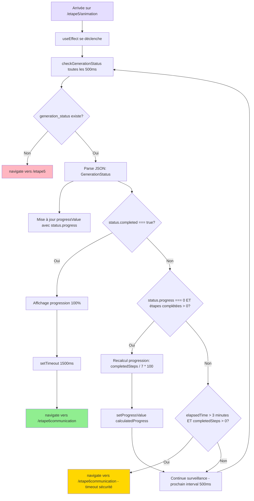

# 📘 DOCUMENTATION COMPLÈTE - ÉTAPE 5 ANIMATION

## 🎯 MISSION DU DOCUMENT

- Ce document fournit une analyse exhaustive de l'**Étape 5 Animation** (`/etape5/animation`) de l'application LeadGenAI AdBuilder.
- Cette étape affiche une animation de progression pendant que les 7 générations OpenAI s'exécutent en arrière-plan, puis redirige automatiquement vers l'Étape 6 Communication une fois terminée.

---

## 📑 SOMMAIRE CLIQUABLE

1. [ARCHITECTURE GLOBALE - ÉTAPE 5 ANIMATION](#i-architecture-globale---étape-5-animation)
2. [FICHIERS UTILISÉS](#ii-fichiers-utilisés-liste-exhaustive)
3. [STRUCTURE DES DONNÉES DANS localStorage](#iii-structure-des-données-dans-localstorage)
4. [LOGIQUE DE VALIDATION DES CHAMPS](#iv-logique-de-validation-des-champs)
5. [CONTRAINTES ET RÈGLES MÉTIER](#v-contraintes-et-règles-métier)
6. [NAVIGATION ET RETOUR EN ARRIÈRE](#vi-navigation-et-retour-en-arrière)
7. [UTILISATION DES DONNÉES PAR OPENAI](#vii-utilisation-des-données-par-openai)
8. [PROCESSUS COMPLET ÉTAPE PAR ÉTAPE](#viii-processus-complet-étape-par-étape)
9. [ÉLÉMENTS CACHÉS / CONDITIONNELS](#ix-éléments-cachés--conditionnels)
10. [TIMER DE SESSION](#x-timer-de-session-désactivé-mais-présent)
11. [RÉCAPITULATIF DES CLÉS localStorage](#xi-récapitulatif-des-clés-localstorage)
12. [DONNÉES DE L'ÉTAPE À PRENDRE EN CONSIDÉRATION](#xii-donnees-de-letape-à-prendre-en-considération)

---

## I. ARCHITECTURE GLOBALE - ÉTAPE 5 ANIMATION

### Vue d'ensemble

L'**Étape 5 Animation** (`/etape5/animation`) est une **page de transition visuelle** qui :
- **Surveille en temps réel** le statut de la génération OpenAI via `localStorage.getItem('generation_status')`
- **Affiche une animation de robot IA** avec progression circulaire
- **Met à jour la progression** toutes les 500ms (de 0% à 100%)
- **Redirige automatiquement** vers `/etape6communication` lorsque `generation_status.completed === true`
- **Gère les cas d'erreur** : redirection vers `/etape5` si pas de génération en cours

**Particularité** : Cette page **ne collecte aucune donnée utilisateur** et **ne lance aucune génération OpenAI**. Elle **observe** uniquement le processus déclenché depuis `/etape5`.

---

### Flux de données simplifiées

```
Étape 5 (/etape5) 
  → Lance les 7 générations OpenAI séquentielles
  → Crée et met à jour generation_status dans localStorage
  → Navigate vers /etape5/animation

Étape 5 Animation (/etape5/animation)
  → useEffect : setInterval toutes les 500ms
  → Lit generation_status depuis localStorage
  → Affiche progression (progress: 14%, 28%, 42%, 57%, 71%, 85%, 100%)
  → Si completed === true : setTimeout 1500ms puis navigate('/etape6communication')
  → Si pas de generation_status : navigate('/etape5')
```

---

### Schéma complet mermaid



---

### Détail du flux

1. **Montage du composant** (`useEffect` avec `[]`)
   - Appel immédiat de `checkGenerationStatus()`
   - Démarrage d'un `setInterval` de 500ms pour surveillance continue

2. **Fonction `checkGenerationStatus()`** - Vérifications séquentielles :

   **a) Vérification existence `generation_status`**
   ```typescript
   const statusStr = localStorage.getItem('generation_status');
   if (!statusStr) {
     navigate("/etape5"); // Pas de génération en cours
     return;
   }
   ```

   **b) Parse et mise à jour progression**
   ```typescript
   const status: GenerationStatus = JSON.parse(statusStr);
   setProgressValue(status.progress); // 14%, 28%, 42%, 57%, 71%, 85%, 100%
   ```

   **c) Détection fin de génération**
   ```typescript
   if (status.completed) {
     setTimeout(() => {
       navigate("/etape6communication");
     }, 1500); // Délai pour voir 100%
     return;
   }
   ```

   **d) Recalcul alternatif si besoin**
   ```typescript
   let completedSteps = 0;
   if (status.websiteAd) completedSteps++;
   if (status.summarySheet) completedSteps++;
   if (status.newsletter) completedSteps++;
   if (status.seoTools) completedSteps++;
   if (status.smsAd) completedSteps++;
   if (status.googleBusinessProfile) completedSteps++;
   if (status.reseauxSociaux) completedSteps++;

   if (status.progress === 0 && completedSteps > 0) {
     const calculatedProgress = Math.min(Math.floor((completedSteps / 7) * 100), 100);
     setProgressValue(calculatedProgress);
   }
   ```

   **e) Timeout de sécurité (3 minutes)**
   ```typescript
   const currentTime = new Date().getTime();
   const elapsedTime = currentTime - status.startTime;
   if (elapsedTime > 3 * 60 * 1000 && completedSteps > 0) {
     navigate("/etape6communication");
   }
   ```

3. **Nettoyage**
   ```typescript
   return () => {
     clearInterval(intervalId); // Arrêt de la surveillance
   };
   ```

---

## II. FICHIERS UTILISÉS (Liste exhaustive)

### 1. **`src/1.etapes-generation-annonces/etape5/Animation.tsx`**
   - **Rôle** : Composant principal de la page d'animation
   - **Responsabilités** :
     - Surveillance du `generation_status` toutes les 500ms
     - Affichage de l'animation du robot IA
     - Gestion de la progression circulaire
     - Navigation automatique vers `/etape6communication`
   - **Code clé** :
     ```typescript
     interface GenerationStatus {
       startTime: number;
       websiteAd: boolean;
       summarySheet: boolean;
       newsletter: boolean;
       seoTools: boolean;
       smsAd: boolean;
       googleBusinessProfile: boolean;
       reseauxSociaux: boolean;
       completed: boolean;
       progress: number;
     }

     const [progressValue, setProgressValue] = useState(10);

     useEffect(() => {
       const checkGenerationStatus = () => {
         const statusStr = localStorage.getItem('generation_status');
         // ... logique de surveillance
       };

       checkGenerationStatus();
       const intervalId = setInterval(checkGenerationStatus, 500);

       return () => clearInterval(intervalId);
     }, [navigate]);
     ```

---

### 2. **`src/components/ui/circular-progress.tsx`**
   - **Rôle** : Composant de barre de progression circulaire (SVG)
   - **Props** :
     - `value` : Valeur actuelle (0-100)
     - `size` : Taille en pixels (défaut: 40)
     - `thickness` : Épaisseur du cercle (défaut: 4)
     - `color` : Couleur de progression (défaut: "currentColor")
   - **Utilisation dans Animation** :
     ```typescript

     Progression : {progressValue}%
     ```

---

### 3. **`src/components/atemplate.v2.generation-annonces/Layout.V2.GenAnn.tsx`**
   - **Rôle** : Layout principal avec sidebar et navigation
   - **Utilisation** :
     ```typescript

       {/* Contenu animation */}

     ```

---

### 4. **`src/components/navigation-site-leadgenaiadbuilder/NavLinks.tsx`**
   - **Rôle** : Fournit la configuration de navigation
   - **Exports utilisés** :
     - `navLinks` : Liens du menu principal
     - `navTitle` : "Vos Assistants IA"

---

### 5. **`src/App.css`** - Animations CSS
   - **Rôle** : Définit les animations pour le robot IA
   - **Animations utilisées** :
     ```css
     @keyframes float {
       0%, 100% { transform: translateY(0); }
       50% { transform: translateY(-10px); }
     }
     .animate-float {
       animation: float 4s ease-in-out infinite;
     }

     @keyframes particle1 {
       0%, 100% { transform: translate(0, 0); opacity: 0.7; }
       50% { transform: translate(15px, -15px); opacity: 0.3; }
     }
     .animate-particle1 { animation: particle1 5s ease-in-out infinite; }

     @keyframes particle2 {
       0%, 100% { transform: translate(0, 0); opacity: 0.7; }
       50% { transform: translate(-10px, 10px); opacity: 0.4; }
     }
     .animate-particle2 { animation: particle2 7s ease-in-out infinite; }

     @keyframes particle3 {
       0%, 100% { transform: translate(0, 0); opacity: 0.5; }
       50% { transform: translate(12px, 5px); opacity: 0.2; }
     }
     .animate-particle3 { animation: particle3 6s ease-in-out infinite; }
     ```

---

### 6. **`src/index.css`**
   - **Rôle** : Animation de flottement alternative (6s)
   - **Code** :
     ```css
     @keyframes float {
       0% { transform: translateY(0px); }
       50% { transform: translateY(-10px); }
       100% { transform: translateY(0px); }
     }
     .animate-float {
       animation: float 6s ease-in-out infinite;
     }
     ```

---

### 7. **`tailwind.config.ts`**
   - **Rôle** : Configuration Tailwind (pas d'animations eye-blink/wave définies ici)
   - **Animations définies** : accordion-down, accordion-up, fade-in
   - **Note** : Les animations `animate-eye-blink`, `animate-wave` utilisées dans Animation.tsx **ne sont pas définies** - ce sont des classes CSS attendues mais absentes du code actuel

---

## III. STRUCTURE DES DONNÉES DANS localStorage

### Clé principale : `generation_status`

**Structure** :
```typescript
interface GenerationStatus {
  startTime: number;           // timestamp début génération (ex: 1678901234567)
  websiteAd: boolean;          // true si annonce site web terminée
  summarySheet: boolean;       // true si fiche synthèse terminée
  newsletter: boolean;         // true si newsletter terminée
  seoTools: boolean;           // true si outils SEO terminés
  smsAd: boolean;              // true si annonce SMS terminée
  googleBusinessProfile: boolean; // true si profil Google terminé
  reseauxSociaux: boolean;     // true si annonces réseaux sociaux terminées
  completed: boolean;          // true si TOUTES les 7 générations terminées
  progress: number;            // 0, 14, 28, 42, 57, 71, 85, 100
}
```

**Exemple de valeurs pendant génération** :
```json
{
  "startTime": 1678901234567,
  "websiteAd": true,
  "summarySheet": true,
  "newsletter": false,
  "seoTools": false,
  "smsAd": false,
  "googleBusinessProfile": false,
  "reseauxSociaux": false,
  "completed": false,
  "progress": 28
}
```

**Exemple de valeurs après génération complète** :
```json
{
  "startTime": 1678901234567,
  "websiteAd": true,
  "summarySheet": true,
  "newsletter": true,
  "seoTools": true,
  "smsAd": true,
  "googleBusinessProfile": true,
  "reseauxSociaux": true,
  "completed": true,
  "progress": 100
}
```

---

### Clés utilisées en lecture (créées par Étape 5) :

| Clé localStorage | Type | Créée par | Lue par Animation |
|------------------|------|-----------|-------------------|
| `generation_status` | `GenerationStatus` | `/etape5` (Etape5.tsx) | ✅ Oui - surveillance continue |
| `propertyData` | `PropertyData` | Étapes 1-4 | ❌ Non - pas utilisée directement |
| `generation_website_ad` | JSON | `/etape5` | ❌ Non - utilisée par `/etape6communication` |
| `generation_summary_sheet` | JSON | `/etape5` | ❌ Non |
| `generation_newsletter` | JSON | `/etape5` | ❌ Non |
| `generation_seo_tools` | JSON | `/etape5` | ❌ Non |
| `generation_sms_ad` | JSON | `/etape5` | ❌ Non |
| `generation_googleprofile_ad` | JSON | `/etape5` | ❌ Non |
| `generation_reseauxsociaux_ad` | JSON | `/etape5` | ❌ Non |

---

## IV. LOGIQUE DE VALIDATION DES CHAMPS

### Aucune validation de champs

**Raison** : La page Animation **ne collecte aucune donnée utilisateur**. Elle :
- **Affiche** uniquement une animation
- **Lit** le statut depuis `localStorage`
- **Redirige** automatiquement

### Validations système (non-utilisateur) :

| Validation | Condition | Action |
|------------|-----------|--------|
| **Existence `generation_status`** | `localStorage.getItem('generation_status') === null` | Redirection vers `/etape5` |
| **Génération complétée** | `status.completed === true` | Redirection vers `/etape6communication` après 1,5s |
| **Timeout de sécurité** | `elapsedTime > 3 minutes` ET `completedSteps > 0` | Redirection vers `/etape6communication` |
| **Recalcul progression** | `status.progress === 0` ET `completedSteps > 0` | Recalcul et affichage progression corrigée |

---

## V. CONTRAINTES ET RÈGLES MÉTIER

### 1. Contraintes d'accès
- **Accès uniquement depuis `/etape5`** après lancement des générations
- Si `generation_status` absent → redirection `/etape5`

### 2. Contraintes de progression
- **Surveillance en temps réel** : interval de 500ms (non modifiable)
- **7 étapes de génération** : websiteAd, summarySheet, newsletter, seoTools, smsAd, googleBusinessProfile, reseauxSociaux
- **Progression linéaire** : +14,28% par étape (100% / 7)

### 3. Contraintes temporelles
- **Délai avant redirection** : 1500ms après `completed === true` (pour voir 100%)
- **Timeout de sécurité** : 3 minutes maximum
  - Si génération dépasse 3 minutes ET au moins 1 étape complétée
  - → Redirection automatique vers `/etape6communication`

### 4. Contraintes d'affichage
- **Animation robot IA** : flottement, particules, cercle d'énergie pulsant
- **Animations manquantes** : `animate-eye-blink` et `animate-wave` référencées mais non définies dans les CSS
- **Progression circulaire** : taille 80px, épaisseur 8px, couleur #D6BCFA

### 5. Contraintes de navigation
- **Pas de navigation manuelle** : l'utilisateur ne peut pas quitter la page (sauf boutons nav sidebar)
- **Redirection automatique** uniquement quand `completed === true`

---

## VI. NAVIGATION ET RETOUR EN ARRIÈRE

### Navigation VERS l'Étape 5 Animation

| Provenance | Déclencheur | Conditions |
|------------|-------------|------------|
| **`/etape5`** | `navigate("/etape5/animation")` après `handleValidateAndFinish()` | Lancement des 7 générations OpenAI réussi |

---

### Navigation DEPUIS l'Étape 5 Animation

| Destination | Déclencheur | Conditions |
|-------------|-------------|------------|
| **`/etape5`** | `navigate("/etape5")` | `generation_status` absent du localStorage |
| **`/etape6communication`** | `navigate("/etape6communication")` | `status.completed === true` après 1500ms |
| **`/etape6communication`** | `navigate("/etape6communication")` | Timeout 3 minutes ET `completedSteps > 0` |

---

### Comportement en cas de modification depuis Étape 6

**Scénario** : Utilisateur clique "Modifier" depuis `/etape6communication` → retour `/etape1`, `/etape2`, `/etape3` ou `/etape4` → modifie données → valide

**Conséquence** :
1. `propertyData` mis à jour dans localStorage
2. Retour `/etape5` → clic "Lancer la génération"
3. **Nouvelle génération** avec données mises à jour
4. **Passage par `/etape5/animation`** à nouveau
5. Mise à jour des `generation_*` dans localStorage

**Important** : Les anciennes générations sont écrasées par les nouvelles.

---

### Pas de retour en arrière depuis Animation

**Comportement actuel** :
- Aucun bouton "Retour" ou "Annuler"
- L'utilisateur **doit attendre** la fin de la génération
- Seule possibilité : utiliser le menu de navigation gauche (mais cela ne stoppe pas les générations OpenAI en cours)

---

## VII. UTILISATION DES DONNÉES PAR OPENAI

### ⚠️ Pas d'appels OpenAI directs depuis Animation

La page **Animation.tsx** :
- **NE LANCE AUCUNE** génération OpenAI
- **NE LIT AUCUNE** donnée de `propertyData`
- **OBSERVE UNIQUEMENT** le statut créé par `/etape5`

### Données OpenAI créées par `/etape5` (observées par Animation)

Les 7 générations sont lancées depuis `/etape5` (fichier `Etape5.tsx`) et mettent à jour `generation_status` :

| Génération | Clé localStorage | Champ observé dans `generation_status` | Progression ajoutée |
|------------|------------------|----------------------------------------|---------------------|
| **1. Annonce Site Web** | `generation_website_ad` | `websiteAd: true` | +14% → 14% |
| **2. Fiche de Synthèse** | `generation_summary_sheet` | `summarySheet: true` | +14% → 28% |
| **3. Newsletter** | `generation_newsletter` | `newsletter: true` | +14% → 42% |
| **4. Outils SEO** | `generation_seo_tools` | `seoTools: true` | +15% → 57% |
| **5. Annonce SMS** | `generation_sms_ad` | `smsAd: true` | +14% → 71% |
| **6. Profil Google Business** | `generation_googleprofile_ad` | `googleBusinessProfile: true` | +14% → 85% |
| **7. Annonces Réseaux Sociaux** | `generation_reseauxsociaux_ad` | `reseauxSociaux: true` | +15% → 100% |

**Animation** se contente de :
```typescript
setProgressValue(status.progress); // 14, 28, 42, 57, 71, 85, 100
```

---

## VIII. PROCESSUS COMPLET ÉTAPE PAR ÉTAPE

### 1. **Arrivée sur `/etape5/animation`**
   - Utilisateur vient de `/etape5` après avoir cliqué "Lancer la génération"
   - `generation_status` existe dans localStorage avec `completed: false`

---

### 2. **Montage du composant**
   ```typescript
   useEffect(() => {
     const checkGenerationStatus = () => { /* ... */ };

     checkGenerationStatus(); // Appel immédiat
     const intervalId = setInterval(checkGenerationStatus, 500); // Surveillance

     return () => clearInterval(intervalId); // Nettoyage
   }, [navigate]);
   ```

---

### 3. **Surveillance toutes les 500ms**
   - Lecture `localStorage.getItem('generation_status')`
   - Parse JSON → objet `GenerationStatus`
   - Mise à jour `setProgressValue(status.progress)`

---

### 4. **Affichage de l'animation**

   **a) Cadre mauve principal** (`bg-[#4A2B87]`)

   **b) Partie gauche - Robot animé** :
   - Cercle d'énergie pulsant (gradient mauve, `animate-pulse`)
   - Image robot (`/lovable-uploads/da9a9af1-75eb-429e-b769-c2ce8901f9aa.png`)
   - Animation flottement (`animate-float` - 6s)
   - ⚠️ Yeux clignotants (`animate-eye-blink`) - **CSS manquant**
   - ⚠️ Main qui bouge (`animate-wave`) - **CSS manquant**
   - Particules flottantes (`animate-particle1`, `animate-particle2`, `animate-particle3`)

   **c) Partie droite - Texte** :
   ```
   Votre Assistant IA prépare vos Annonces et vos Supports de Prospection et de Communication

   Il trie, il classe, il organise, il structure.
   Il relit les directives pour bien les appliquer.
   Il rédige, il vérifie la syntaxe et l'orthographe.
   Il relit, il corrige, il améliore... encore et encore.

   Bon, il prend un peu de temps, c'est un perfectionniste.
   Mais pensez au temps que vous, vous allez gagner.
   ```

   **d) Progression circulaire** :
   ```typescript

   Progression : {progressValue}%
   ```

---

### 5. **Évolution de la progression**

| Temps | Étape complétée | `progress` | `progressValue` affiché |
|-------|-----------------|------------|-------------------------|
| T+0s | Aucune | 0% | 10% (valeur initiale) |
| T+10s | websiteAd | 14% | 14% |
| T+20s | summarySheet | 28% | 28% |
| T+30s | newsletter | 42% | 42% |
| T+40s | seoTools | 57% | 57% |
| T+50s | smsAd | 71% | 71% |
| T+60s | googleBusinessProfile | 85% | 85% |
| T+70s | reseauxSociaux | 100% | 100% |

---

### 6. **Détection fin de génération**
   ```typescript
   if (status.completed) {
     setTimeout(() => {
       navigate("/etape6communication");
     }, 1500); // L'utilisateur voit 100% pendant 1,5s
     return;
   }
   ```

---

### 7. **Redirection automatique**
   - Navigation vers `/etape6communication`
   - `clearInterval` se déclenche (nettoyage)
   - L'utilisateur voit ses annonces et outils générés

---

### 8. **Cas d'erreur - Pas de `generation_status`**
   ```typescript
   if (!statusStr) {
     navigate("/etape5");
     return;
   }
   ```

---

### 9. **Cas de timeout (3 minutes)**
   ```typescript
   const currentTime = new Date().getTime();
   const elapsedTime = currentTime - status.startTime;
   if (elapsedTime > 3 * 60 * 1000 && completedSteps > 0) {
     navigate("/etape6communication");
   }
   ```

---

## IX. ÉLÉMENTS CACHÉS / CONDITIONNELS

### 1. Navigation conditionnelle

| Condition | Redirection |
|-----------|-------------|
| `!generation_status` | `/etape5` |
| `status.completed === true` | `/etape6communication` après 1500ms |
| `elapsedTime > 3 min` ET `completedSteps > 0` | `/etape6communication` |

---

### 2. Recalcul de progression conditionnel

```typescript
if (!status.completed) {
  let completedSteps = 0;
  if (status.websiteAd) completedSteps++;
  if (status.summarySheet) completedSteps++;
  if (status.newsletter) completedSteps++;
  if (status.seoTools) completedSteps++;
  if (status.smsAd) completedSteps++;
  if (status.googleBusinessProfile) completedSteps++;
  if (status.reseauxSociaux) completedSteps++;

  if (status.progress === 0 && completedSteps > 0) {
    const calculatedProgress = Math.min(Math.floor((completedSteps / 7) * 100), 100);
    setProgressValue(calculatedProgress);
  }
}
```

**Raison** : En cas de désynchronisation entre `status.progress` et les booléens `websiteAd`, `summarySheet`, etc.

---

### 3. Animations CSS conditionnelles (problème détecté)

| Classe CSS | Définie dans | Utilisée dans Animation.tsx | Statut |
|------------|--------------|----------------------------|--------|
| `animate-pulse` | Tailwind (natif) | ✅ Oui | ✅ Fonctionne |
| `animate-float` | `App.css` & `index.css` | ✅ Oui | ✅ Fonctionne |
| `animate-eye-blink` | ❌ Aucun fichier | ✅ Oui (lignes 118-119) | ❌ **Non définie** |
| `animate-wave` | ❌ Aucun fichier | ✅ Oui (ligne 124) | ❌ **Non définie** |
| `animate-particle1` | `App.css` | ✅ Oui | ✅ Fonctionne |
| `animate-particle2` | `App.css` | ✅ Oui | ✅ Fonctionne |
| `animate-particle3` | `App.css` | ✅ Oui | ✅ Fonctionne |
| `animation-delay-500` | ❌ Aucun fichier | ✅ Oui (ligne 119) | ❌ **Non définie** |

**Impact** : Les yeux du robot et le mouvement de main ne s'animent pas (CSS manquant).

---

## X. TIMER DE SESSION (DÉSACTIVÉ MAIS PRÉSENT)

### Clé : `session_start_time`

**Statut** : Non créée par Animation.tsx, mais **vérifiée par le timeout de sécurité** via `generation_status.startTime`.

### Utilisation dans Animation

```typescript
const currentTime = new Date().getTime();
const elapsedTime = currentTime - status.startTime; // timestamp de début génération

if (elapsedTime > 3 * 60 * 1000 && completedSteps > 0) {
  navigate("/etape6communication"); // Timeout après 3 minutes
}
```

**Différence avec `session_start_time`** :
- `session_start_time` = durée totale session utilisateur (créée à Étape 1, jamais supprimée)
- `generation_status.startTime` = timestamp début génération OpenAI (créée à Étape 5, supprimée après génération)

---

## XI. RÉCAPITULATIF DES CLÉS localStorage

### Clés LUES par Animation

| Clé | Type | Créée par | Modifiée par Animation | Supprimée par |
|-----|------|-----------|------------------------|---------------|
| `generation_status` | `GenerationStatus` | `/etape5` | ❌ Non (lecture seule) | `/etape5` après redirection |

---

### Clés NON UTILISÉES par Animation (mais existantes)

| Clé | Type | Créée par | Utilisée par |
|-----|------|-----------|--------------|
| `propertyData` | `PropertyData` | Étapes 1-4 | `/etape5` (génération OpenAI) |
| `stepProgress` | `number[]` | `useStepProgress` | Navigation conditionnelle |
| `generation_website_ad` | JSON | `/etape5` | `/etape6communication` |
| `generation_summary_sheet` | JSON | `/etape5` | `/etape6communication` |
| `generation_newsletter` | JSON | `/etape5` | `/etape6communication` |
| `generation_seo_tools` | JSON | `/etape5` | `/etape6communication` |
| `generation_sms_ad` | JSON | `/etape5` | `/etape6communication` |
| `generation_googleprofile_ad` | JSON | `/etape5` | `/etape6communication` |
| `generation_reseauxsociaux_ad` | JSON | `/etape5` | `/etape6communication` |
| `session_start_time` | timestamp | Étape 1 | Aucune (timer désactivé) |

---

## XII. DONNEES DE L'ETAPE À PRENDRE EN CONSIDÉRATION

### 📊 Tableau 1 : Champs `generation_status` (lecture seule)

| Champ | Type | Valeur initiale | Valeur finale | Description |
|-------|------|-----------------|---------------|-------------|
| `startTime` | `number` | `Date.now()` | Inchangé | Timestamp début génération (ex: 1678901234567) |
| `websiteAd` | `boolean` | `false` | `true` | Annonce Site Web générée |
| `summarySheet` | `boolean` | `false` | `true` | Fiche de Synthèse générée |
| `newsletter` | `boolean` | `false` | `true` | Newsletter générée |
| `seoTools` | `boolean` | `false` | `true` | Outils SEO générés |
| `smsAd` | `boolean` | `false` | `true` | Annonce SMS générée |
| `googleBusinessProfile` | `boolean` | `false` | `true` | Profil Google Business généré |
| `reseauxSociaux` | `boolean` | `false` | `true` | Annonces Réseaux Sociaux générées |
| `completed` | `boolean` | `false` | `true` | TOUTES les générations terminées |
| `progress` | `number` | `0` | `100` | Progression en % (0, 14, 28, 42, 57, 71, 85, 100) |

---

### 📊 Tableau 2 : Clés localStorage observées

| Clé localStorage | Créée par | Observée par Animation | Utilisée pour |
|------------------|-----------|------------------------|---------------|
| `generation_status` | `/etape5` (`Etape5.tsx`) | ✅ Oui (toutes les 500ms) | Affichage progression + navigation automatique |

---

### 📊 Tableau 3 : Fonctions principales

| Fonction | Fichier | Rôle | Appels |
|----------|---------|------|--------|
| `checkGenerationStatus()` | `Animation.tsx` | Surveille `generation_status`, met à jour `progressValue`, gère redirections | Appelée toutes les 500ms via `setInterval` |
| `setProgressValue()` | `Animation.tsx` | State setter pour la progression affichée | Appelée par `checkGenerationStatus()` |
| `navigate()` | React Router | Redirection vers `/etape5` ou `/etape6communication` | 3 cas : pas de statut, génération terminée, timeout |
| `CircularProgress` | `circular-progress.tsx` | Affiche progression circulaire SVG | Rendu avec `value={progressValue}` |

---

### 📊 Tableau 4 : Rappel des dépendances entre étapes

| Étape | Crée/Modifie | Animation Lit | Animation Modifie | Étape suivante |
|-------|--------------|---------------|-------------------|----------------|
| **Étape 1** | `propertyData` (agencyName, reference, location...) | ❌ Non | ❌ Non | Étape 2 |
| **Étape 2** | `propertyData.propertyDescription` | ❌ Non | ❌ Non | Étape 3 |
| **Étape 3** | `propertyData.financials` | ❌ Non | ❌ Non | Étape 4 |
| **Étape 4** | `propertyData.details` / `hasNoDetails` | ❌ Non | ❌ Non | Étape 5 |
| **Étape 5** | `generation_status`, `generation_*` (7 clés) | ✅ **Oui** (`generation_status`) | ❌ Non (lecture seule) | **Étape 5 Animation** |
| **Étape 5 Animation** | ❌ Rien | ✅ `generation_status` | ❌ Non | **Étape 6 Communication** (auto) |
| **Étape 6 Communication** | ❌ Rien | `generation_*` (7 clés) | ❌ Non | Fin du parcours |

---

### 🔄 Synthèse des flux de données

```
Étape 1-4 : Collecte propertyData
    ↓
Étape 5 : Lance 7 générations OpenAI
    ↓
    Crée generation_status (avec progress: 0%)
    Crée generation_website_ad, generation_summary_sheet, etc.
    Met à jour generation_status.progress (14%, 28%, 42%...)
    Met à jour generation_status.completed = true à la fin
    ↓
    navigate("/etape5/animation")
    ↓
Étape 5 Animation : Surveille generation_status toutes les 500ms
    ↓
    Affiche progressValue (14%, 28%, 42%, 57%, 71%, 85%, 100%)
    ↓
    Détecte completed === true
    ↓
    setTimeout 1500ms puis navigate("/etape6communication")
    ↓
Étape 6 Communication : Affiche les 7 générations
```

---

### ⚠️ Points d'attention

1. **Animations CSS manquantes** :
   - `animate-eye-blink` : yeux clignotants non animés
   - `animate-wave` : main qui bouge non animée
   - `animation-delay-500` : délai non appliqué

2. **Timeout de sécurité** :
   - Si génération > 3 minutes → redirection automatique
   - Mais les générations OpenAI continuent en arrière-plan

3. **Pas d'annulation possible** :
   - Utilisateur doit attendre la fin
   - Pas de bouton "Annuler" ou "Retour"

4. **Surveillance intensive** :
   - Interval de 500ms = 120 lectures/minute de localStorage
   - Peut impacter performances sur appareils lents

---


**Points clés identifiés** :
- ✅ Surveillance en temps réel du `generation_status` toutes les 500ms
- ✅ Affichage d'une animation de robot IA avec progression circulaire
- ✅ Redirection automatique vers `/etape6communication` à la fin
- ⚠️ 2 animations CSS manquantes (`animate-eye-blink`, `animate-wave`)
- ⚠️ Timeout de sécurité à 3 minutes

