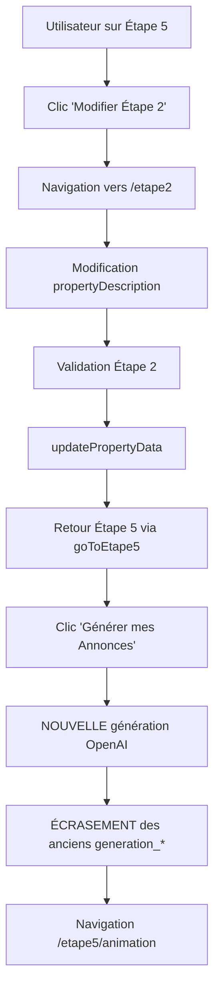
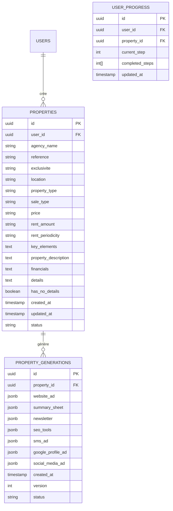

# 📊 **BILAN STRATÉGIQUE - ÉTAPES 1 À 5 ANIMATION**
## Guide de préparation pour la migration localStorage → Supabase

---

## 🎯 **MISSION DU DOCUMENT**

Ce document fournit une **vue d'ensemble stratégique** des 5 étapes du processus de génération d'annonces (Étapes 1-4 + Étape 5 + Étape 5 Animation) pour préparer la **migration de `localStorage` vers Supabase**.

**Objectif** :
- Identifier **toutes les données critiques** à migrer
- Comprendre les **dépendances entre étapes**
- Lister les **intégrations externes** (OpenAI)
- Anticiper les **points de vigilance** pour ne rien oublier
- Servir de **référence absolue** avant de commencer la migration

**Public** : Développeurs et Product Owners qui travailleront sur la migration dans quelques jours/semaines

---

## 📑 **SOMMAIRE**

1. [Vue d'ensemble du processus](#i-vue-densemble-du-processus)
2. [Cartographie complète des données localStorage](#ii-cartographie-complète-des-données-localstorage)
3. [Dépendances et flux entre étapes](#iii-dépendances-et-flux-entre-étapes)
4. [Intégrations externes et APIs](#iv-intégrations-externes-et-apis)
5. [Points critiques pour la migration](#v-points-critiques-pour-la-migration)
6. [Architecture cible Supabase recommandée](#vi-architecture-cible-supabase-recommandée)
7. [Checklist pré-migration](#vii-checklist-pré-migration)

---

## I. VUE D'ENSEMBLE DU PROCESSUS

### Schéma global des 5 étapes

```mermaid
graph LR
    A[Étape 1Éléments Clés10 champs] --> B[Étape 2Description1 champ]
    B --> C[Étape 3Financials1 champ]
    C --> D[Étape 4Détails2 champs]
    D --> E[Étape 5Génération OpenAI7 appels API]
    E --> F[AnimationSurveillanceRedirection auto]
    F --> G[Étape 6Communication]

    style A fill:#D4F1D4
    style B fill:#B3D9FF
    style C fill:#D6BCFA
    style D fill:#FFD7A3
    style E fill:#FF9999
    style F fill:#FFE6CC
```



### Résumé par étape

| Étape | Route | Collecte données ? | Nb champs | Appels OpenAI | Clés localStorage créées |
|-------|-------|-------------------|-----------|---------------|-------------------------|
| **Étape 1** | `/etape1` | ✅ Oui | 10 | ❌ Non | `propertyData` (init), `stepProgress` |
| **Étape 2** | `/etape2` | ✅ Oui | 1 | ❌ Non | `propertyData` (update) |
| **Étape 3** | `/etape3` | ✅ Oui | 1 | ❌ Non | `propertyData` (update) |
| **Étape 4** | `/etape4` | ✅ Oui | 2 | ❌ Non | `propertyData` (update) |
| **Étape 5** | `/etape5` | ❌ Non | 0 | ✅ Oui (7) | `generation_status`, `generation_*` (7 clés) |
| **Animation** | `/etape5/animation` | ❌ Non | 0 | ❌ Non | Aucune (lecture seule) |

---

## II. CARTOGRAPHIE COMPLÈTE DES DONNÉES localStorage

### A. Clé `propertyData` - Données utilisateur (Étapes 1-4)

**Structure complète** :
```typescript
interface PropertyData {
  // ========== ÉTAPE 1 : Éléments Clés ==========
  agencyName: string;           // Nom de l'agence
  reference: string;            // Référence du bien
  exclusivite: "Oui" | "Non";   // Exclusivité
  location: string;             // Emplacement
  propertyType: string;         // Type de bien
  saleType: "à vendre" | "à louer"; // Type de transaction
  price: string;                // Prix FAI (si vente)
  rentAmount: string;           // Loyer HT/HC (si location)
  rentPeriodicity: "Mensuel" | "Trimestriel" | "Annuel"; // Périodicité (si location)
  keyElements: string;          // Arguments commerciaux (textarea formatée)

  // ========== ÉTAPE 2 : Description ==========
  propertyDescription: string;  // Description détaillée (textarea formatée)

  // ========== ÉTAPE 3 : Informations financières ==========
  financials: string;           // Informations financières (textarea formatée)

  // ========== ÉTAPE 4 : Autres détails ==========
  details: string;              // Informations complémentaires (textarea formatée)
  hasNoDetails: boolean;        // Checkbox "Pas d'infos complémentaires"
}
```

**Taille moyenne estimée** : 2-5 KB par bien

---

### B. Clé `stepProgress` - Gestion de la progression

**Structure** :
```typescript
type StepProgress = number[]; // Ex: [1, 2, 3, 4, 5, 6]
```

**Rôle** :
- Contrôle l'accès aux étapes (déblocage progressif)
- Persistance de la progression utilisateur
- Permet navigation "aller-retour" entre étapes

**Valeurs possibles** :
- Étape 1 complétée → `[1, 2]`
- Étape 2 complétée → `[1, 2, 3]`
- Étape 3 complétée → `[1, 2, 3, 4]`
- Étape 4 complétée → `[1, 2, 3, 4, 5]`
- Étape 5 complétée → `[1, 2, 3, 4, 5, 6]`

---

### C. Clés `generation_*` - Résultats OpenAI (Étape 5)

| Clé localStorage | Structure JSON | Taille estimée | Utilisée par |
|------------------|---------------|----------------|--------------|
| `generation_website_ad` | `{ titre, accroche, descriptif, cta }` | ~1-2 KB | Étape 6 Communication |
| `generation_summary_sheet` | `{ titre, referenceEtPrix, detailsCles, donneesFinancieres, informationsComplementaires }` | ~1-3 KB | Étape 6 Communication |
| `generation_newsletter` | `{ titre, accroche, pointsForts, callToAction, prixEtReference }` | ~1-2 KB | Étape 6 Communication |
| `generation_seo_tools` | `{ baliseTitre, baliseMetaDescription, urlLongueTraine }` | ~0.5-1 KB | Étape 6 Communication |
| `generation_sms_ad` | `{ "restitution-annonce-sms" }` | ~0.3-0.5 KB | Étape 6 Communication |
| `generation_googleprofile_ad` | `{ TitreAnnonceGoogle, AccrocheDescriptiveAnnonceGoogle, PointsFortsAnnonceGoogle, CtaAnnonceGoogle }` | ~1-2 KB | Étape 6 Communication |
| `generation_reseauxsociaux_ad` | `{ TitreAnnonceReseaux, AccrocheImpactanteAnnonceReseaux, AtoutsAnnonceReseaux, CtaAnnonceReseaux }` | ~1-2 KB | Étape 6 Communication |

**Total stockage générations** : ~7-13 KB par bien

---

### D. Clé `generation_status` - Statut de génération

**Structure** :
```typescript
interface GenerationStatus {
  startTime: number;                // Timestamp début (ex: 1678901234567)
  websiteAd: boolean;               // Étape 1/7 terminée
  summarySheet: boolean;            // Étape 2/7 terminée
  newsletter: boolean;              // Étape 3/7 terminée
  seoTools: boolean;                // Étape 4/7 terminée
  smsAd: boolean;                   // Étape 5/7 terminée
  googleBusinessProfile: boolean;   // Étape 6/7 terminée
  reseauxSociaux: boolean;          // Étape 7/7 terminée
  completed: boolean;               // Toutes terminées
  progress: number;                 // 0-100 (14, 28, 42, 57, 71, 85, 100)
}
```

**Rôle** :
- Surveillance temps réel de la génération OpenAI
- Affichage progression dans `/etape5/animation`
- Timeout de sécurité (3 minutes)

---

### E. Clé `session_start_time` - Timer session (désactivé)

**Structure** : `number` (timestamp)

**⚠️ Incohérence identifiée** :
- Présente dans le code mais **partiellement désactivée**
- `clearPropertyData()` ne supprime PAS `session_start_time` → risque de données orphelines
- À clarifier avant migration

---

## III. DÉPENDANCES ET FLUX ENTRE ÉTAPES

### A. Matrice de dépendances

| Étape cible | Dépend de | Données requises | Peut modifier |
|-------------|-----------|------------------|---------------|
| **Étape 2** | Étape 1 | `propertyData` complet Étape 1 | Données Étape 1 (via "Modifier Étape 1") |
| **Étape 3** | Étapes 1-2 | `propertyData` complet Étapes 1-2 | Données Étapes 1-2 |
| **Étape 4** | Étapes 1-3 | `propertyData` complet Étapes 1-3 | Données Étapes 1-3 |
| **Étape 5** | Étapes 1-4 | `propertyData` complet Étapes 1-4 | Données Étapes 1-4 (via boutons "Modifier") |
| **Animation** | Étape 5 | `generation_status` | ❌ Aucune (lecture seule) |

### B. Cascade de modifications

**Scénario utilisateur** : Modification d'une donnée d'une étape précédente depuis l'Étape 5



**⚠️ Point critique** : **Aucun historique** des anciennes générations → toutes les données `generation_*` sont écrasées.

---

## IV. INTÉGRATIONS EXTERNES ET APIS

### A. OpenAI API - 7 appels séquentiels

| Appel | Service | Prompt utilisé | Données `propertyData` utilisées | Résultat stocké |
|-------|---------|----------------|----------------------------------|-----------------|
| **1** | `generateWebsiteAd()` | `promptAnnonceSiteInternet` | ✅ **TOUTES** (sauf `details`) | `generation_website_ad` |
| **2** | `generateSummarySheetAd()` | `promptAnnonceFichedeSynthese` | ✅ **TOUTES** (y compris `details`) | `generation_summary_sheet` |
| **3** | `generateNewsletterAd()` | `promptAnnonceNewsletter` | ✅ **TOUTES** (sauf `details`) | `generation_newsletter` |
| **4** | `generateSEOTools()` | `promptOutilsSEO` | ✅ **TOUTES** (sauf `details`) | `generation_seo_tools` |
| **5** | `generateSMSAd()` | `promptAnnonceSMS` | ✅ **TOUTES** (sauf `details`) | `generation_sms_ad` |
| **6** | `generateGoogleProfileAd()` | `promptAnnonceGoogleBusinessProfile` | ✅ **TOUTES** (sauf `details`) | `generation_googleprofile_ad` |
| **7** | `generateReseauxSociauxAd()` | `promptAnnonceReseauxSociaux` | ✅ **TOUTES** (sauf `details`) | `generation_reseauxsociaux_ad` |

**Particularité champ `details`** :
- ✅ Utilisé **UNIQUEMENT** dans `generateSummarySheetAd()` (Fiche de Synthèse)
- ❌ **Ignoré** par les 6 autres générations

---

### B. Clé API OpenAI

**Source actuelle** :
```typescript
// src/contexts/OpenAIContext.tsx
const DEFAULT_API_KEY = "sk-proj-..."; // Hard-codée
```

**⚠️ Points d'attention** :
- Clé actuellement **hard-codée** dans le code frontend
- **Risque de sécurité** : clé exposée côté client
- **Migration recommandée** : Clé API stockée dans Supabase (`Secrets` ou table `user_settings`) + Edge Function pour appels OpenAI

---

## V. POINTS CRITIQUES POUR LA MIGRATION

### A. Gestion du multi-utilisateur

**Problème actuel** :
- `localStorage` = stockage **local** au navigateur
- Données **non synchronisées** entre appareils
- Perte des données si changement de navigateur/appareil

**Solution Supabase** :
- Table `properties` avec `user_id` (relation `auth.users`)
- Table `property_generations` pour stocker les résultats OpenAI
- RLS (Row Level Security) pour sécuriser l'accès aux données

---

### B. Historique des générations

**Problème actuel** :
- Chaque nouvelle génération **écrase** la précédente
- Pas d'historique des versions
- Impossible de comparer ou revenir en arrière

**Solution Supabase recommandée** :
- Table `property_generations` avec `version` ou `created_at`
- Conservation de toutes les générations
- UI pour comparer/restaurer versions précédentes

---

### C. Session timer et données orphelines

**Problème identifié** :
- `session_start_time` créée mais jamais nettoyée
- `clearPropertyData()` ne supprime pas cette clé
- Risque d'incohérences après reset projet

**Solution** :
- Supprimer complètement le système de timer (actuellement désactivé)
- OU implémenter correctement le nettoyage dans `clearPropertyData()`

---

### D. Validation et intégrité des données

**Validations actuelles (côté client uniquement)** :

| Étape | Champs obligatoires | Validation conditionnelle |
|-------|---------------------|--------------------------|
| **1** | `agencyName`, `reference`, `location`, `propertyType`, `keyElements` | `price` (si vente) OU `rentAmount` (si location) |
| **2** | `propertyDescription` | Aucune |
| **3** | `financials` | Aucune |
| **4** | Choix obligatoire | `details` OU `hasNoDetails` (exclusif) |
| **5** | ❌ Aucune | Clé OpenAI requise |

**⚠️ Risque** : Aucune validation côté serveur → données potentiellement incohérentes dans Supabase

**Solution recommandée** :
- Contraintes `NOT NULL` sur les champs obligatoires
- Check constraints pour validations conditionnelles
- Validation Zod côté Edge Functions

---

### E. Formatage automatique des textarea

**Fonctionnalité actuelle** :
- Composant `FormulaireSaisie.tsx` ajoute automatiquement `• ` en début de ligne
- Capitalise la première lettre après la puce
- Ajuste la hauteur dynamiquement

**⚠️ Point critique** :
- Formatage appliqué **côté client** avant sauvegarde
- Données stockées avec formatage **déjà appliqué**
- Lors de la migration → **conserver le formatage** ou **le retirer** ?

**Recommandation** :
- **Option A** : Stocker le texte brut + formatter à l'affichage (plus flexible)
- **Option B** : Conserver le formatage (compatibilité avec OpenAI prompts actuels)

---

## VI. ARCHITECTURE CIBLE SUPABASE RECOMMANDÉE

### A. Structure des tables proposées



### B. Scénario de migration des données

**Étape 1 : Récupération localStorage → JSON**
```typescript
const localData = {
  propertyData: JSON.parse(localStorage.getItem('propertyData')),
  stepProgress: JSON.parse(localStorage.getItem('stepProgress')),
  generations: {
    websiteAd: JSON.parse(localStorage.getItem('generation_website_ad')),
    summarySheet: JSON.parse(localStorage.getItem('generation_summary_sheet')),
    // ... (5 autres)
  }
};
```

**Étape 2 : Insertion Supabase**
```typescript
// 1. Insert property
const { data: property } = await supabase
  .from('properties')
  .insert({
    user_id: auth.user.id,
    agency_name: localData.propertyData.agencyName,
    reference: localData.propertyData.reference,
    // ... (tous les champs)
  })
  .select()
  .single();

// 2. Insert generation
if (localData.generations.websiteAd) {
  await supabase
    .from('property_generations')
    .insert({
      property_id: property.id,
      website_ad: localData.generations.websiteAd,
      summary_sheet: localData.generations.summarySheet,
      // ... (tous les champs)
      version: 1,
      status: 'completed'
    });
}

// 3. Insert progress
await supabase
  .from('user_progress')
  .insert({
    user_id: auth.user.id,
    property_id: property.id,
    current_step: Math.max(...localData.stepProgress),
    completed_steps: localData.stepProgress
  });
```

---

## VII. CHECKLIST PRÉ-MIGRATION

### Phase 1 : Audit complet ✅ (FAIT)

- [x] Documenter toutes les étapes (1-4, 5, 5animation)
- [x] Identifier tous les champs `propertyData`
- [x] Mapper les clés `localStorage` utilisées
- [x] Tracer les appels OpenAI et leurs dépendances
- [x] Repérer les incohérences (ex: `session_start_time`)

### Phase 2 : Conception Supabase

- [ ] Définir le schéma de tables (properties, property_generations, user_progress)
- [ ] Définir les contraintes et validations SQL
- [ ] Concevoir les RLS policies (sécurité multi-tenant)
- [ ] Planifier les indexes (performance)
- [ ] Décider du stockage des clés OpenAI (Secrets ou table user_settings)

### Phase 3 : Migration backend

- [ ] Créer les tables Supabase
- [ ] Créer les Edge Functions pour :
  - Sauvegarde incrémentale des étapes 1-4
  - Lancement sécurisé des générations OpenAI
  - Récupération de l'historique des générations
- [ ] Implémenter la logique de gestion de versions (générations multiples)
- [ ] Créer les RLS policies
- [ ] Tester les Edge Functions

### Phase 4 : Migration frontend

- [ ] Remplacer `getPropertyDataFromStorage()` par appels Supabase
- [ ] Remplacer `updatePropertyData()` par `upsert` Supabase
- [ ] Adapter `useStepProgress` pour lire/écrire dans `user_progress` table
- [ ] Refactoriser Étape 5 pour appeler Edge Function (au lieu d'OpenAI direct)
- [ ] Adapter page Animation pour surveiller Supabase Realtime (au lieu de `localStorage`)
- [ ] Implémenter la gestion d'erreurs réseau (offline, timeout, etc.)

### Phase 5 : Migration des données utilisateurs existants

- [ ] Script de migration `localStorage` → Supabase (optionnel si reset accepté)
- [ ] Communication utilisateurs sur le reset des données
- [ ] Assistance migration manuelle si demandée

### Phase 6 : Tests et validation

- [ ] Tests E2E du parcours complet (Étapes 1-5)
- [ ] Tests de modification avec retour arrière
- [ ] Tests multi-utilisateur / multi-session
- [ ] Tests de performance (génération OpenAI via Edge Function)
- [ ] Tests de sécurité (RLS, injection SQL, etc.)

---

## 📌 **POINTS CLÉS À RETENIR**

### Données critiques à ne pas perdre

1. ✅ **`propertyData`** (14 champs) → Table `properties`
2. ✅ **`generation_*`** (7 clés) → Table `property_generations`
3. ✅ **`stepProgress`** → Table `user_progress`
4. ❌ **`session_start_time`** → À supprimer (fonctionnalité désactivée)
5. ❌ **`generation_status`** → Volatile, à recréer à chaque génération

### Fonctionnalités à préserver

- ✅ Progression par étapes avec déblocage séquentiel
- ✅ Modification rétroactive avec sauvegarde
- ✅ Formatage automatique des textarea (décision à prendre)
- ✅ Génération OpenAI séquentielle (7 appels)
- ✅ Animation de progression temps réel

### Améliorations possibles post-migration

- 🚀 Historique des générations (versions multiples)
- 🚀 Synchronisation multi-appareils
- 🚀 Sauvegarde automatique (draft)
- 🚀 Collaboration (partage de biens entre utilisateurs)
- 🚀 Export PDF/Email des générations
- 🚀 Analytics (temps passé par étape, taux de complétion, etc.)

---


