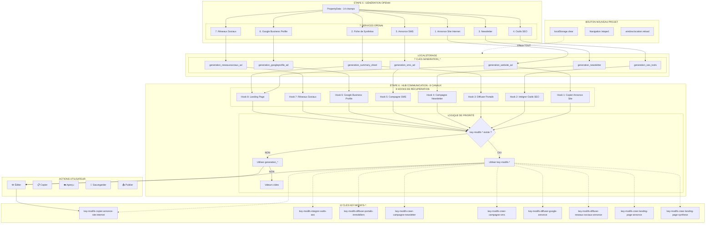

# 00. PROCESSUS DE RÉCUPÉRATION DES DONNÉES OPENAI VERS ÉTAPE 6 COMMUNICATION

## I. MISSION DU DOCUMENT 

Ce document constitue la **bible technique complète** du flux de données OpenAI dans l'application LeadGenAI. Il documente exhaustivement :

- **Le déclenchement des 7 services OpenAI** lors de l'Étape 5
- **Le stockage des données** dans `localStorage` (7 clés `generation_*`)
- **La récupération des données** par les 8 canaux de communication de l'Étape 6
- **Le système d'édition et de sauvegarde** des modifications utilisateur (12 clés `key-modifs-*`)
- **Les structures de données complètes** (JSON, HTML, Markdown)
- **Les hooks de récupération** et leur logique de priorité
- **Le bouton "Nouveau Projet"** et son impact sur `localStorage`

**Public cible** : Développeurs, auditeurs de code, équipe de migration Supabase

**Périmètre** : Étape 5 → `localStorage` → Étape 6 Communication → Actions utilisateur

---

## II. SOMMAIRE 

1. [Mission du Document](#i-mission)
2. [Sommaire](#ii-sommaire)
3. [Architecture Globale du Processus](#iii-architecture)
4. [Partie 1 : Déclenchement des 7 Services OpenAI (Étape 5)](#iv-partie-1)
5. [Partie 2 : Système de Nettoyage des Données OpenAI](#v-partie-2)
6. [Partie 3 : Récupération des Données par les 8 Canaux](#vi-partie-3)
7. [Partie 4 : Liste Exhaustive des Hooks de Récupération](#vii-partie-4)
8. [Partie 5 : Détail des Structures de Données par Canal](#viii-partie-5)
9. [Partie 6 : Système d'Édition et de Sauvegarde](#ix-partie-6)
10. [Partie 7 : Bouton "Générer un Nouveau Projet"](#x-partie-7)
11. [Partie 8 : Détail Complet du Service src/services/openai](#xi-partie-8)
12. [Partie 9 : Mapping Complet Services → Canaux → Actions](#xii-partie-9)
13. [Partie 10 : Tableau Récapitulatif des Clés localStorage](#xiii-partie-10)
14. [Données à Prendre en Considération](#xiv-donnees)

---

## III. ARCHITECTURE GLOBALE DU PROCESSUS 

### Diagramme de Flux Complet



### Flux de Données Détaillé

1. **PropertyData (14 champs)** → Collectés dans les Étapes 1-4
2. **Étape 5** → `handleValidateAndFinish()` déclenche 7 appels OpenAI en parallèle
3. **Réponses OpenAI** → Stockées dans 7 clés `generation_*` dans `localStorage`
4. **Étape 6** → Hub central avec 8 options d'action
5. **Hooks de récupération** → Lisent `key-modifs-*` en priorité, sinon `generation_*`
6. **Édition utilisateur** → Sauvegarde immédiate dans `key-modifs-*`
7. **Actions finales** → Copier, Aperçu, Sauvegarder, Publier (selon le canal)

```
┌─────────────────────────────────────────────────────────────────────────┐
│                          ÉTAPE 5 : DÉCLENCHEMENT                         │
│                                                                           │
│  Utilisateur clique sur "Générer mes Annonces"                          │
│            ↓                                                              │
│  Fonction handleValidateAndFinish() dans Etape5.tsx                     │
│            ↓                                                              │
│  7 Services OpenAI appelés séquentiellement                             │
│            ↓                                                              │
│  Données JSON stockées dans localStorage avec clés spécifiques          │
└─────────────────────────────────────────────────────────────────────────┘
                              ↓
┌─────────────────────────────────────────────────────────────────────────┐
│                     ÉTAPE 6 : RÉCUPÉRATION & INJECTION                   │
│                                                                           │
│  8 Canaux de communication récupèrent les données via hooks             │
│            ↓                                                              │
│  Nettoyage des caractères échappés (cleanOpenAIContent)                 │
│            ↓                                                              │
│  Affichage et édition par l'utilisateur                                 │
│            ↓                                                              │
│  Sauvegarde des modifications dans de nouvelles clés localStorage       │
└─────────────────────────────────────────────────────────────────────────┘
```
---

## IV. PARTIE 1 : DÉCLENCHEMENT DES 7 SERVICES OPENAI (ÉTAPE 5) 

### Fichier Source

**`src/1.etapes-generation-annonces/etape5/Etape5.tsx`** - Fonction `handleValidateAndFinish()`
- **Localisation :** Lignes 44-139 de `Etape5.tsx`

**Description :** 
- Cette fonction asynchrone orchestre l'appel séquentiel des 7 services OpenAI. Elle :
1. Récupère les données de propriété depuis `localStorage` (`propertyData`)
2. Vérifie la présence de la clé API OpenAI
3. Initialise le statut de génération dans `localStorage` (`generation_status`)
4. Appelle les 7 services OpenAI un par un
5. Stocke chaque résultat dans une clé `localStorage` dédiée
6. Met à jour le statut de progression après chaque génération réussie
7. Navigue vers `/etape6communication` une fois terminé

### Code Complet de Déclenchement (Lignes 64-137)

```typescript
const handleValidateAndFinish = async () => {
  try {
    setIsLoading(true);

    const propertyData = getPropertyDataFromStorage();

    if (!propertyData || !propertyData.propertyType) {
      throw new Error("Données du bien non trouvées");
    }

    const openaiService = createOpenAIService(apiKey);
    const smsService = createOpenAISMSService(apiKey);
    const googleService = createOpenAIGoogleBusinessProfileService(apiKey);
    const reseauxService = createOpenAIReseauxSociauxService(apiKey);

    // 1. Annonce Site Internet
    const websiteAd = await openaiService.generateWebsiteAd(propertyData, "gpt-4o");
    localStorage.setItem('generation_website_ad', JSON.stringify(websiteAd));

    // 2. Fiche de Synthèse
    const summarySheet = await openaiService.generateSummarySheetAd(propertyData, "gpt-4o");
    localStorage.setItem('generation_summary_sheet', JSON.stringify(summarySheet));

    // 3. Newsletter
    const newsletter = await openaiService.generateNewsletterAd(propertyData, "gpt-4o");
    localStorage.setItem('generation_newsletter', JSON.stringify(newsletter));

    // 4. Outils SEO
    const seoTools = await openaiService.generateSEOTools(propertyData, "gpt-4o");
    localStorage.setItem('generation_seo_tools', JSON.stringify(seoTools));

    // 5. Annonce SMS
    const smsAd = await smsService.generateSMSAd(propertyData, "gpt-4o");
    localStorage.setItem('generation_sms_ad', JSON.stringify(smsAd));

    // 6. Google Business Profile
    const googleAd = await googleService.generateGoogleBusinessProfileAd(propertyData, "gpt-4o");
    localStorage.setItem('generation_googleprofile_ad', JSON.stringify(googleAd));

    // 7. Réseaux Sociaux
    const reseauxAd = await reseauxService.generateReseauxSociauxAd(propertyData, "gpt-4o");
    localStorage.setItem('generation_reseauxsociaux_ad', JSON.stringify(reseauxAd));

    // Mise à jour du statut de génération
    localStorage.setItem('generation_status', JSON.stringify({
      completed: true,
      timestamp: new Date().toISOString()
    }));

    toast({
      title: "Génération terminée",
      description: "Toutes les annonces ont été générées avec succès",
    });

    navigate("/etape6communication");
  } catch (error) {
    console.error("Erreur lors de la génération:", error);
    toast({
      title: "Erreur",
      description: error instanceof Error ? error.message : "Une erreur est survenue",
      variant: "destructive",
    });
  } finally {
    setIsLoading(false);
  }
};
```

### Détail des 7 Services OpenAI

#### 1. ANNONCE SITE INTERNET

| Propriété | Valeur |
|-----------|--------|
| **Fichier API** | `src/services/openai.ts` |
| **Classe** | `OpenAIService` |
| **Méthode** | `generateWebsiteAd(data: PropertyData, model: "gpt-4o")` |
| **Prompt** | `promptAnnonceSiteInternet` (116 lignes) |
| **Clé localStorage** | `generation_website_ad` |
| **Structure JSON** | `{ titre: string, accroche: string, descriptif: string, cta: string }` |
| **Champs propertyData utilisés** | Tous les 14 champs |
| **Taille estimée** | 2-3 KB |
| **Format** | Texte brut (titre, accroche, cta) + HTML (descriptif) |

**Code d'appel :**
```typescript
const websiteAd = await openaiService.generateWebsiteAd(propertyData, "gpt-4o");
localStorage.setItem('generation_website_ad', JSON.stringify(websiteAd));
```

---

#### 2. FICHE DE SYNTHÈSE

| Propriété | Valeur |
|-----------|--------|
| **Fichier API** | `src/services/openai.ts` |
| **Classe** | `OpenAIService` |
| **Méthode** | `generateSummarySheetAd(data: PropertyData, model: "gpt-4o")` |
| **Prompt** | `promptAnnonceFichedeSynthese` (125 lignes) |
| **Clé localStorage** | `generation_summary_sheet` |
| **Structure JSON** | `{ titre: string, referenceEtPrix: string, detailsCles: string, donneesFinancieres: string, informationsComplementaires: string }` |
| **Champs utilisés** | Tous les 14 champs |
| **Taille estimée** | 3-4 KB |
| **Format** | HTML avec balises ``, ``, ``, `` |

**Code d'appel :**
```typescript
const summarySheet = await openaiService.generateSummarySheetAd(propertyData, "gpt-4o");
localStorage.setItem('generation_summary_sheet', JSON.stringify(summarySheet));
```

---

#### 3. NEWSLETTER

| Propriété | Valeur |
|-----------|--------|
| **Fichier API** | `src/services/openai.ts` |
| **Classe** | `OpenAIService` |
| **Méthode** | `generateNewsletterAd(data: PropertyData, model: "gpt-4o")` |
| **Prompt** | `promptAnnonceNewsletter` (152 lignes) |
| **Clé localStorage** | `generation_newsletter` |
| **Structure JSON** | `{ titre: string, accroche: string, pointsForts: string, callToAction: string, prixEtReference: string }` |
| **Champs utilisés** | 13 champs (sans `details`) |
| **Taille estimée** | 2-3 KB |
| **Format** | HTML avec ``, ``, ``, `` |

**Code d'appel :**
```typescript
const newsletter = await openaiService.generateNewsletterAd(propertyData, "gpt-4o");
localStorage.setItem('generation_newsletter', JSON.stringify(newsletter));
```

---

#### 4. OUTILS SEO

| Propriété | Valeur |
|-----------|--------|
| **Fichier API** | `src/services/openai.ts` |
| **Classe** | `OpenAIService` |
| **Méthode** | `generateSEOTools(data: PropertyData, model: "gpt-4o")` |
| **Prompt** | `promptOutilsSEO` (83 lignes) |
| **Clé localStorage** | `generation_seo_tools` |
| **Structure JSON** | `{ baliseTitre: string, baliseMetaDescription: string, urlLongueTraine: string }` |
| **Champs utilisés** | 13 champs (sans `details`) |
| **Taille estimée** | 1-2 KB |
| **Format** | Texte brut (tous les champs) |

**Code d'appel :**
```typescript
const seoTools = await openaiService.generateSEOTools(propertyData, "gpt-4o");
localStorage.setItem('generation_seo_tools', JSON.stringify(seoTools));
```

---

#### 5. ANNONCE SMS

| Propriété | Valeur |
|-----------|--------|
| **Fichier API** | `src/services/openai/1.GenerateurAnnoncesOutilsSeo/0.APIAutresFonctionsLeadGenAI/1.API-AnnonceSMS.ts` |
| **Classe** | `OpenAISMSService` |
| **Méthode** | `generateSMSAd(data: PropertyData, model: "gpt-4o")` |
| **Prompt** | `promptSMSAnnonce` (220 lignes) |
| **Assistant ID** | `asst_TdAq1QLpBVlEOwjAm2fLSy4U` |
| **Clé localStorage** | `generation_sms_ad` |
| **Structure JSON** | `{ "restitution-annonce-sms": string }` |
| **Champs utilisés** | Tous les 14 champs |
| **Taille estimée** | 0.5-1 KB (SMS limité à 160 caractères) |
| **Nettoyage** | Suppression des backticks markdown |

**Code d'appel :**
```typescript
const smsAd = await smsService.generateSMSAd(propertyData, "gpt-4o");
localStorage.setItem('generation_sms_ad', JSON.stringify(smsAd));
```

**Code de nettoyage des backticks (lignes 168-172) :**
```typescript
let cleanedMessage = message;
if (cleanedMessage.startsWith('```')) {
  cleanedMessage = cleanedMessage.replace(/^```[\s\S]*?\n/, '').replace(/\n```$/, '');
}
return cleanedMessage;
```

---

#### 6. GOOGLE BUSINESS PROFILE

| Propriété | Valeur |
|-----------|--------|
| **Fichier API** | `src/services/openai/1.GenerateurAnnoncesOutilsSeo/0.APIAutresFonctionsLeadGenAI/2.API-AnnonceGoogleBusinessProfile.ts` |
| **Classe** | `OpenAIGoogleBusinessProfileService` |
| **Méthode** | `generateGoogleBusinessProfileAd(data: PropertyData, model: "gpt-4o")` |
| **Prompt** | `promptGoogleBusinessProfileAnnonce` |
| **Assistant ID** | `asst_ON4cwe282z5TH89uY8lhvZP5` |
| **Clé localStorage** | `generation_googleprofile_ad` |
| **Structure JSON** | `{ TitreAnnonceGoogle: string, AccrocheDescriptiveAnnonceGoogle: string, PointsFortsAnnonceGoogle: string, CtaAnnonceGoogle: string }` |
| **Champs utilisés** | 12 champs (sans `details` et `reference`) |
| **Taille estimée** | 2-3 KB |
| **Nettoyage** | Suppression des backticks markdown |

**Code d'appel :**
```typescript
const googleAd = await googleService.generateGoogleBusinessProfileAd(propertyData, "gpt-4o");
localStorage.setItem('generation_googleprofile_ad', JSON.stringify(googleAd));
```

**⚠️ Particularité - Nommage PascalCase :**
Les clés JSON retournées par OpenAI sont en PascalCase, mais l'interface React utilise camelCase. Un mapping est nécessaire dans les hooks de récupération.


---

#### 7. RÉSEAUX SOCIAUX

| Propriété | Valeur |
|-----------|--------|
| **Fichier API** | `src/services/openai/1.GenerateurAnnoncesOutilsSeo/0.APIAutresFonctionsLeadGenAI/3.API-AnnonceReseauxSociaux.ts` |
| **Classe** | `OpenAIReseauxSociauxService` |
| **Méthode** | `generateReseauxSociauxAd(data: PropertyData, model: "gpt-4o")` |
| **Prompt** | `promptReseauxSociauxAnnonce` |
| **Assistant ID** | `asst_XL1EVDiLq6jUzfrvdJUy4bey` |
| **Clé localStorage** | `generation_reseauxsociaux_ad` |
| **Structure JSON** | `{ TitreAnnonceReseaux: string, AccrocheImpactanteAnnonceReseaux: string, AtoutsAnnonceReseaux: string, CtaAnnonceReseaux: string }` |
| **Champs utilisés** | 13 champs (sans `details`) |
| **Taille estimée** | 2-3 KB |
| **Nettoyage** | Parse direct (pas de backticks) |

**Code d'appel :**
```typescript
const reseauxAd = await reseauxService.generateReseauxSociauxAd(propertyData, "gpt-4o");
localStorage.setItem('generation_reseauxsociaux_ad', JSON.stringify(reseauxAd));
```

**⚠️ Particularité - Nommage PascalCase :**
Même problématique que Google Business Profile - mapping nécessaire.

---

### Tableau Récapitulatif des 7 Services

| # | Service | Classe | Méthode | Clé localStorage | Champs JSON | Taille | Assistant ID |
|---|---------|--------|---------|------------------|-------------|--------|--------------|
| 1 | Annonce Site Internet | `OpenAIService` | `generateWebsiteAd()` | `generation_website_ad` | 4 | 2-3 KB | - |
| 2 | Fiche de Synthèse | `OpenAIService` | `generateSummarySheetAd()` | `generation_summary_sheet` | 5 | 3-4 KB | - |
| 3 | Newsletter | `OpenAIService` | `generateNewsletterAd()` | `generation_newsletter` | 5 | 2-3 KB | - |
| 4 | Outils SEO | `OpenAIService` | `generateSEOTools()` | `generation_seo_tools` | 3 | 1-2 KB | - |
| 5 | Annonce SMS | `OpenAISMSService` | `generateSMSAd()` | `generation_sms_ad` | 1 | 0.5-1 KB | `asst_TdAq1QLpBVlEOwjAm2fLSy4U` |
| 6 | Google Business Profile | `OpenAIGoogleBusinessProfileService` | `generateGoogleBusinessProfileAd()` | `generation_googleprofile_ad` | 4 | 2-3 KB | `asst_ON4cwe282z5TH89uY8lhvZP5` |
| 7 | Réseaux Sociaux | `OpenAIReseauxSociauxService` | `generateReseauxSociauxAd()` | `generation_reseauxsociaux_ad` | 4 | 2-3 KB | `asst_XL1EVDiLq6jUzfrvdJUy4bey` |

---

## V. PARTIE 2 : SYSTÈME DE NETTOYAGE DES DONNÉES OPENAI 

### Fonction `cleanOpenAIContent()`

**Localisation :**
- `src/components/1-Sources-Restitution-Utilisateur/6.EtapeDiffuserGoogleAnnonce/Hook-1-RecuperationDataGoogle.ts` (lignes 10-18)
- `src/components/1-Sources-Restitution-Utilisateur/7.EtapeDiffuserReseauxAnnonce/Hook-1-RecuperationDataReseaux.ts` (lignes 10-18)

**Code complet :**
```typescript
const cleanOpenAIContent = (text: string): string => {
  if (!text) return "";
  return text
    .replace(/\\n/g, "\n")      // Convertir les \n littéraux en vrais retours à la ligne
    .replace(/\\\\/g, "\\");    // Convertir les \\\\ en \
};
```

### Transformations Appliquées

| Pattern | Remplacement | Description |
|---------|--------------|-------------|
| `\\n` | `\n` | Conversion des retours à la ligne échappés en vrais sauts de ligne |
| `\\\\` | `\`| Conversion des backslashes doublement échappés en backslashes simples |

### Exemples de Transformation

**Avant nettoyage :**
```
"✓ Emplacement exceptionnel\\n✓ 120 m² sur 2 niveaux\\n✓ CA 650 000 €/an"
```

**Après nettoyage :**
```
"✓ Emplacement exceptionnel
✓ 120 m² sur 2 niveaux
✓ CA 650 000 €/an"
```

### ⚠️ Dette Technique

**Problème** : Cette fonction est **dupliquée** dans 2 fichiers différents.

**Fichier cible** : `src/utils/openai-helpers.ts`

---

## VI. PARTIE 3 : RÉCUPÉRATION DES DONNÉES PAR LES 8 CANAUX 

### Hub Central

**Fichier** : `src/1.etapes-restitution-utilisateur/0.Etape6Communication/Etape6Communication.tsx`

**Rôle** : Point d'entrée unique de l'Étape 6 qui affiche 8 options d'action sous forme de cartes cliquables.

### Mapping Services OpenAI → Canaux

| ID Option | Titre Canal | Service OpenAI Source | Clés localStorage LUES | Composant Rendu |
|-----------|-------------|----------------------|------------------------|-----------------|
| `copier-annonce-site` | Copier Annonce Site Internet | Annonce Site Internet | `key-modifs-copier-annonce-site-internet` → `generation_website_ad` | `AccueilCopierSiteInternet` |
| `integrer-outils-seo` | Intégrer Outils SEO | Outils SEO | `key-modifs-integrer-outils-seo` → `generation_seo_tools` | `AccueilIntegrerOutilsSEO` |
| `diffuser-portails` | Diffuser Portails Immobiliers | Fiche de Synthèse | `key-modifs-diffuser-portails-immobiliers` → `generation_summary_sheet` | `AccueilDiffuserPortails` |
| `creer-campagne-newsletter` | Créer Campagne Newsletter | Newsletter | `key-modifs-creer-campagne-newsletter` → `generation_newsletter` | `AccueilCreerCampagneNewsletter` |
| `creer-campagne-sms` | Créer Campagne SMS | Annonce SMS | `key-modifs-creer-campagne-sms` → `generation_sms_ad` | `AccueilCreerCampagneSMS` |
| `diffuser-google` | Diffuser Google Business Profile | Google Business Profile | `key-modifs-diffuser-google-annonce` → `generation_googleprofile_ad` | `AccueilDiffuserGoogleAnnonce` |
| `diffuser-reseaux` | Diffuser Réseaux Sociaux | Réseaux Sociaux | `key-modifs-diffuser-reseaux-sociaux-annonce` → `generation_reseauxsociaux_ad` | `AccueilDiffuserReseauxAnnonce` |
| `creer-landing-page` | Créer Landing Page | Annonce Site Internet + Fiche de Synthèse | `key-modifs-creer-landing-page-annonce` → `generation_website_ad``key-modifs-creer-landing-page-synthese` → `generation_summary_sheet` | `AccueilCreerLandingPageAnnonce` |

### Code de Mapping dans Etape6Communication.tsx

```typescript
const actionOptions = [
  {
    id: "copier-annonce-site",
    title: "Copier Annonce Site Internet",
    description: "Copiez votre annonce pour la publier sur votre site web",
    icon: ,
    route: "/etape6communication/copier-annonce-site"
  },
  {
    id: "integrer-outils-seo",
    title: "Intégrer Outils SEO",
    description: "Optimisez votre référencement avec nos outils SEO",
    icon: ,
    route: "/etape6communication/integrer-outils-seo"
  },
  // ... 6 autres options
];
```

---

## VII. PARTIE 4 : LISTE EXHAUSTIVE DES HOOKS DE RÉCUPÉRATION 

### Hook 1 : Copier Annonce Site Internet

| Propriété | Valeur |
|-----------|--------|
| **Fichier** | `src/components/1-Sources-Restitution-Utilisateur/1.EtapeCopierAnnonceSiteInternet/HookRecuperationAnnonceSiteInternet.ts` |
| **Fonction** | `useRecuperationAnnonceSiteInternet()` |
| **Clés LUES** | 1. `key-modifs-copier-annonce-site-internet` (priorité 1)2. `generation_website_ad` (priorité 2) |
| **Clés ÉCRITES** | `key-modifs-copier-annonce-site-internet` |
| **Interface** | `AnnonceSiteInternetData { titre, accroche, descriptif, appelAction }` |
| **Logique de priorité** | Modifs > Original > Vide |

**Code complet du hook :**
```typescript
import { useState, useEffect } from 'react';

interface AnnonceSiteInternetData {
  titre: string;
  accroche: string;
  descriptif: string;
  appelAction: string;
}

export const useRecuperationAnnonceSiteInternet = () => {
  const [annonceSiteInternet, setAnnonceSiteInternet] = useState({
    titre: '',
    accroche: '',
    descriptif: '',
    appelAction: ''
  });
  const [isLoading, setIsLoading] = useState(true);
  const [error, setError] = useState(null);

  useEffect(() => {
    try {
      setIsLoading(true);

      // PRIORITÉ 1 : Vérifier les données modifiées
      const modifiedDataJson = localStorage.getItem('key-modifs-copier-annonce-site-internet');

      if (modifiedDataJson) {
        const modifiedData = JSON.parse(modifiedDataJson);
        setAnnonceSiteInternet({
          titre: modifiedData.titre || '',
          accroche: modifiedData.accroche || '',
          descriptif: modifiedData.descriptif || '',
          appelAction: modifiedData.appelAction || ''
        });
      } else {
        // PRIORITÉ 2 : Récupération des données originales
        const annonceSiteData = localStorage.getItem('generation_website_ad');

        if (annonceSiteData) {
          const parsedData = JSON.parse(annonceSiteData);
          setAnnonceSiteInternet({
            titre: parsedData.titre || '',
            accroche: parsedData.accroche || '',
            descriptif: parsedData.descriptif || '',
            appelAction: parsedData.cta || '' // ⚠️ Mapping: cta → appelAction
          });
        } else {
          console.log('Aucune donnée trouvée dans le localStorage');
        }
      }

      setIsLoading(false);
    } catch (err) {
      console.error('Erreur lors de la récupération:', err);
      setError('Erreur lors de la récupération des données');
      setIsLoading(false);
    }
  }, []);

  const updateAnnonceSiteInternet = (newData: Partial) => {
    const updatedData = { ...annonceSiteInternet, ...newData };
    setAnnonceSiteInternet(updatedData);

    try {
      // Sauvegarde immédiate dans localStorage
      localStorage.setItem('key-modifs-copier-annonce-site-internet', JSON.stringify(updatedData));
    } catch (err) {
      console.error('Erreur lors de la sauvegarde:', err);
      setError('Erreur lors de la sauvegarde des données');
    }
  };

  return { annonceSiteInternet, updateAnnonceSiteInternet, isLoading, error };
};
```

---

### Hook 2 : Intégrer Outils SEO

| Propriété | Valeur |
|-----------|--------|
| **Fichier** | `src/components/1-Sources-Restitution-Utilisateur/2.EtapeIntegrerOutilsSEO/HookRecuperationOutilsSEO.ts` |
| **Fonction** | `useRecuperationOutilsSEO()` |
| **Clés LUES** | 1. `key-modifs-integrer-outils-seo`2. `generation_seo_tools` |
| **Clés ÉCRITES** | `key-modifs-integrer-outils-seo` |
| **Interface** | `OutilsSEOData { baliseTitre, baliseMetaDescription, urlLongueTraine }` |

**Structure identique au Hook 1** (logique de priorité similaire).

---

### Hook 3 : Créer Campagne Newsletter

| Propriété | Valeur |
|-----------|--------|
| **Fichier** | `src/components/1-Sources-Restitution-Utilisateur/4.EtapeCreerCampagneNewsletter/Hook-1-RecuperationDataNewsletter.ts` |
| **Fonction** | `useRecuperationDataNewsletter()` |
| **Clés LUES** | 1. `key-modifs-creer-campagne-newsletter`2. `generation_newsletter` |
| **Clés ÉCRITES** | `key-modifs-creer-campagne-newsletter` |
| **Interface** | `AnnonceNewsletterData { titre, accroche, pointsForts, callToAction, prixEtReference }` |

---

### Hook 4 : Créer Campagne SMS

| Propriété | Valeur |
|-----------|--------|
| **Fichier** | `src/components/1-Sources-Restitution-Utilisateur/5.EtapeCreerCampagneSMS/Hook-1-RecuperationDataSMS.ts` |
| **Fonction** | `useRecuperationDataSMS()` |
| **Clés LUES** | 1. `key-modifs-creer-campagne-sms`2. `generation_sms_ad` |
| **Clés ÉCRITES** | `key-modifs-creer-campagne-sms` |
| **Interface** | `AnnonceSMSData { "restitution-annonce-sms": string }` |

---

### Hook 5 : Diffuser Google Business Profile

| Propriété | Valeur |
|-----------|--------|
| **Fichier** | `src/components/1-Sources-Restitution-Utilisateur/6.EtapeDiffuserGoogleAnnonce/Hook-1-RecuperationDataGoogle.ts` |
| **Fonction** | `useRecuperationDataGoogle()` |
| **Clés LUES** | 1. `key-modifs-diffuser-google-annonce`2. `generation_googleprofile_ad` + **nettoyage `cleanOpenAIContent()`** |
| **Clés ÉCRITES** | `key-modifs-diffuser-google-annonce` |
| **Interface** | `AnnonceGoogleData { titre, accroche, pointsForts, appelAction }` |

**⚠️ Particularité : Mapping PascalCase → camelCase**

```typescript
// Code de mapping dans le hook (lignes 35-38)
setAnnonceGoogle({
  titre: cleanOpenAIContent(parsedData.TitreAnnonceGoogle || ''),
  accroche: cleanOpenAIContent(parsedData.AccrocheDescriptiveAnnonceGoogle || ''),
  pointsForts: cleanOpenAIContent(parsedData.PointsFortsAnnonceGoogle || ''),
  appelAction: cleanOpenAIContent(parsedData.CtaAnnonceGoogle || '')
});
```

---

### Hook 6 : Diffuser Réseaux Sociaux

| Propriété | Valeur |
|-----------|--------|
| **Fichier** | `src/components/1-Sources-Restitution-Utilisateur/7.EtapeDiffuserReseauxAnnonce/Hook-1-RecuperationDataReseaux.ts` |
| **Fonction** | `useRecuperationDataReseaux()` |
| **Clés LUES** | 1. `key-modifs-diffuser-reseaux-sociaux-annonce`2. `generation_reseauxsociaux_ad` + **nettoyage** |
| **Clés ÉCRITES** | `key-modifs-diffuser-reseaux-sociaux-annonce` |
| **Interface** | `AnnonceReseauxData { titre, accroche, pointsForts, appelAction }` |

**⚠️ Même mapping PascalCase → camelCase que Google**

---

### Hook 7 : Landing Page - Annonce

| Propriété | Valeur |
|-----------|--------|
| **Fichier** | `src/components/1-Sources-Restitution-Utilisateur/8.EtapeCreerLandingPageAnnonce/HookRecuperationAnnonceVersLandingPage.ts` |
| **Fonction** | `useRecuperationAnnonceVersLandingPage()` |
| **Clés LUES** | 1. `key-modifs-creer-landing-page-annonce`2. `generation_website_ad` |
| **Clés ÉCRITES** | `key-modifs-creer-landing-page-annonce` |
| **Interface** | `AnnonceLandingPageData { titre, accroche, descriptif, appelAction }` |

---

### Hook 8 : Landing Page - Fiche de Synthèse

| Propriété | Valeur |
|-----------|--------|
| **Fichier** | `src/components/1-Sources-Restitution-Utilisateur/8.EtapeCreerLandingPageAnnonce/HookRecuperationFichedeSyntheseVersLandingPage.ts` |
| **Fonction** | `useRecuperationFichedeSyntheseVersLandingPage()` |
| **Clés LUES** | 1. `key-modifs-creer-landing-page-synthese`2. `generation_summary_sheet` |
| **Clés ÉCRITES** | `key-modifs-creer-landing-page-synthese` |
| **Interface** | `FichedeSyntheseLandingPageData { titre, referenceEtPrix, detailsCles, donneesFinancieres, informationsComplementaires }` |

---

### Tableau Récapitulatif des 8 Hooks

| # | Hook | Fichier | Clés LUES (priorité) | Clés ÉCRITES | Nettoyage | Mapping |
|---|------|---------|---------------------|--------------|-----------|---------|
| 1 | Copier Annonce Site | `HookRecuperationAnnonceSiteInternet.ts` | `key-modifs-copier-annonce-site-internet` → `generation_website_ad` | `key-modifs-copier-annonce-site-internet` | Non | `cta → appelAction` |
| 2 | Intégrer Outils SEO | `HookRecuperationOutilsSEO.ts` | `key-modifs-integrer-outils-seo` → `generation_seo_tools` | `key-modifs-integrer-outils-seo` | Non | Non |
| 3 | Créer Campagne Newsletter | `Hook-1-RecuperationDataNewsletter.ts` | `key-modifs-creer-campagne-newsletter` → `generation_newsletter` | `key-modifs-creer-campagne-newsletter` | Non | Non |
| 4 | Créer Campagne SMS | `Hook-1-RecuperationDataSMS.ts` | `key-modifs-creer-campagne-sms` → `generation_sms_ad` | `key-modifs-creer-campagne-sms` | Non | Non |
| 5 | Diffuser Google | `Hook-1-RecuperationDataGoogle.ts` | `key-modifs-diffuser-google-annonce` → `generation_googleprofile_ad` | `key-modifs-diffuser-google-annonce` | **Oui** | **PascalCase → camelCase** |
| 6 | Diffuser Réseaux | `Hook-1-RecuperationDataReseaux.ts` | `key-modifs-diffuser-reseaux-sociaux-annonce` → `generation_reseauxsociaux_ad` | `key-modifs-diffuser-reseaux-sociaux-annonce` | **Oui** | **PascalCase → camelCase** |
| 7 | Landing Page - Annonce | `HookRecuperationAnnonceVersLandingPage.ts` | `key-modifs-creer-landing-page-annonce` → `generation_website_ad` | `key-modifs-creer-landing-page-annonce` | Non | `cta → appelAction` |
| 8 | Landing Page - Synthèse | `HookRecuperationFichedeSyntheseVersLandingPage.ts` | `key-modifs-creer-landing-page-synthese` → `generation_summary_sheet` | `key-modifs-creer-landing-page-synthese` | Non | Non |

---

## VIII. PARTIE 5 : DÉTAIL DES STRUCTURES DE DONNÉES PAR CANAL 

### Canal 1 : Copier Annonce Site Internet

**Composants :**
- `AccueilCopierSiteInternet.tsx` (hub)
- `File1.CopierSiteInternetTab.tsx` (onglet édition)
- `File2.CopierSiteInternetTab.tsx` (onglet aperçu)
- `File3.CopierSiteInternetTab.tsx` (onglet copie)
- `HookRecuperationAnnonceSiteInternet.ts` (récupération données)
- `MenuOngletCopierSiteInternet.tsx` (navigation onglets)

**Clés localStorage utilisées :**
- LECTURE : `generation_website_ad`
- ÉCRITURE : `key-modifs-copier-annonce-site-internet`

**Structure JSON complète :**
```json
{
  "titre": "Restaurant Traditionnel - Emplacement Premium Paris 8ème",
  "accroche": "Découvrez cette opportunité unique d'acquérir un restaurant traditionnel dans l'un des quartiers les plus prestigieux de Paris",
  "descriptif": "Situé au cœur du 8ème arrondissement de Paris, ce restaurant traditionnel bénéficie d'un emplacement exceptionnel sur une artère très fréquentée.L'établissement dispose d'une salle de 80 couverts répartie sur deux niveaux, avec une cuisine professionnelle entièrement équipée et aux normes.Clientèle fidèle et régulière, forte notoriété dans le quartier. Bail commercial de 9 ans renouvelable.",
  "appelAction": "Contactez-nous dès aujourd'hui pour organiser une visite et découvrir cette opportunité exceptionnelle. Exclusivité."
}
```

**Format :**
- `titre` : Texte brut
- `accroche` : Texte brut
- `descriptif` : **HTML** (balises ``, ``, ``, ``)
- `appelAction` : Texte brut

**Taille estimée :** 2-3 KB

**Actions utilisateur disponibles :**
- ✅ **Éditer** les 4 champs (texte enrichi pour descriptif)
- ✅ **Copier** dans le presse-papier (format texte)
- ✅ **Aperçu** visuel avec mise en forme

**Statut implémentation :** ✅ **COMPLET**

---

### Canal 2 : Intégrer Outils SEO

**Composants :**
- `AccueilIntegrerOutilsSEO.tsx`
- `File1.OutilsSEOTab.tsx`, `File2.OutilsSEOTab.tsx`, `File3.OutilsSEOTab.tsx`
- `HookRecuperationOutilsSEO.ts`

**Clés localStorage :**
- LECTURE : `generation_seo_tools`
- ÉCRITURE : `key-modifs-integrer-outils-seo`

**Structure JSON complète :**
```json
{
  "baliseTitre": "Restaurant Traditionnel Paris 8ème - 80 Couverts - 450 000 €",
  "baliseMetaDescription": "Restaurant traditionnel à vendre Paris 8ème, 120 m², 80 couverts, cuisine équipée, emplacement premium Champs-Élysées. CA 650 000 €. Exclusivité.",
  "urlLongueTraine": "restaurant-traditionnel-vente-paris-8eme-champs-elysees-80-couverts-450000-euros"
}
```

**Format :** Texte brut (tous les champs)

**Actions utilisateur :**
- ✅ Éditer les 3 champs
- ✅ Copier (format texte)
- ✅ Aperçu avec compteur de caractères

**Statut :** ✅ **COMPLET**

---

### Canal 3 : Diffuser Portails Immobiliers

**Composants :**
- `AccueilDiffuserPortails.tsx`
- `File1.DiffuserPortailsTab.tsx` (édition)
- `File2.DiffuserPortailsTab.tsx` (aperçu)
- `File3.DiffuserPortailsTab.tsx` (actions)
- `HookRecuperationAnnonceFichedeSynthese.ts`

**Clés localStorage :**
- LECTURE : `generation_summary_sheet`
- ÉCRITURE : `key-modifs-diffuser-portails-immobiliers`

**Structure JSON complète :**
```json
{
  "titre": "Restaurant Traditionnel - Paris 8ème - 450 000 €",
  "referenceEtPrix": "Référence : COM-75008-REST-001Prix de vente : 450 000 € FAI",
  "detailsCles": "Surface : 120 m²Salle : 80 couverts sur 2 niveauxCuisine professionnelle aux normesEmplacement premium - Avenue des Champs-Élysées",
  "donneesFinancieres": "Chiffre d'affaires annuel : 650 000 €Loyer mensuel : 4 500 € HT/moisBail commercial : 9 ans renouvelable",
  "informationsComplementaires": "Clientèle fidèle et régulière. Forte notoriété dans le quartier. Possibilité de développer une activité traiteur.Exclusivité"
}
```

**Format :** HTML complet avec balises ``, ``, ``, ``, ``

**Taille estimée :** 3-4 KB

**Actions utilisateur :**
- ✅ Éditer les 5 champs (éditeur HTML)
- ✅ Copier (format HTML)
- ✅ Aperçu avec rendu HTML
- ⚠️ **TODO** : Intégration API portails immobiliers (SeLoger, LeBonCoin, etc.)

**Statut :** ⚠️ **PARTIEL** (Intégration API manquante)

---

### Canal 4 : Créer Campagne Newsletter

**Composants :**
- `AccueilCreerCampagneNewsletter.tsx`
- `Hook-1-RecuperationDataNewsletter.ts`
- `HookSauvegarderCampagneNewsletter.tsx` (action sauvegarde - TODO)

**Clés localStorage :**
- LECTURE : `generation_newsletter`
- ÉCRITURE : `key-modifs-creer-campagne-newsletter`

**Structure JSON complète :**
```json
{
  "titre": "Restaurant Traditionnel - Emplacement d'Exception Paris 8ème",
  "accroche": "Nous sommes ravis de vous présenter cette opportunité rare d'acquérir un restaurant traditionnel dans l'un des quartiers les plus prisés de la capitale.",
  "pointsForts": "Emplacement premium : Avenue des Champs-Élysées, forte affluenceCapacité importante : 80 couverts sur 2 niveauxÉquipement complet : Cuisine professionnelle aux normesRentabilité prouvée : CA 650 000 € annuel",
  "callToAction": "Pour organiser une visite ou obtenir des informations complémentaires, contactez-nous dès maintenant.",
  "prixEtReference": "Prix : 450 000 € FAI | Réf : COM-75008-REST-001 | Exclusivité"
}
```

**Format :** HTML avec ``, ``, ``, ``

**Taille estimée :** 2-3 KB

**Actions utilisateur :**
- ✅ Éditer les 5 champs
- ✅ Copier (format HTML compatible email)
- ✅ Aperçu avec rendu email
- ⚠️ **TODO** : Envoyer via Brevo (API d'envoi newsletter)

**Statut :** ⚠️ **PARTIEL** (Intégration Brevo manquante)

---

### Canal 5 : Créer Campagne SMS

**Composants :**
- `AccueilCreerCampagneSMS.tsx`
- `Hook-1-RecuperationDataSMS.ts`
- `Hook-2-PersonnaliserChamps.tsx` (personnalisation expéditeur, URL, destinataires)
- `Hook-3-UtiliserFonctionEnvoiBrevo.tsx` (envoi via Brevo - TODO)

**Clés localStorage :**
- LECTURE : `generation_sms_ad`
- ÉCRITURE : `key-modifs-creer-campagne-sms`

**Structure JSON complète :**
```json
{
  "restitution-annonce-sms": "VENTE Restaurant 120m² Paris 8ème - 80 couverts - 450 000€ FAI - Exclusivité - Tel: 01 XX XX XX XX"
}
```

**Format :** Texte brut (160 caractères maximum)

**Taille estimée :** 0.5-1 KB

**Actions utilisateur :**
- ✅ Éditer le texte SMS
- ✅ Compteur de caractères en temps réel
- ✅ Personnaliser expéditeur, URL, destinataires
- ✅ Copier (format texte)
- ⚠️ **TODO** : Envoyer via Brevo SMS API

**Statut :** ⚠️ **PARTIEL** (Intégration Brevo SMS manquante)

---

### Canal 6 : Diffuser Google Business Profile

**Composants :**
- `AccueilDiffuserGoogleAnnonce.tsx`
- `Hook-1-RecuperationDataGoogle.ts` (avec `cleanOpenAIContent()`)
- `Hook-2-PersonnaliserUrlGoogle.tsx` (personnalisation URL)

**Clés localStorage :**
- LECTURE : `generation_googleprofile_ad` + **nettoyage**
- ÉCRITURE : `key-modifs-diffuser-google-annonce`

**Structure JSON complète (OpenAI retourne PascalCase) :**
```json
{
  "TitreAnnonceGoogle": "Restaurant Traditionnel Paris 8ème - Emplacement Premium",
  "AccrocheDescriptiveAnnonceGoogle": "Découvrez ce restaurant traditionnel situé sur les Champs-Élysées. 80 couverts, cuisine équipée, clientèle fidèle.",
  "PointsFortsAnnonceGoogle": "✓ Emplacement exceptionnel\n✓ 120 m² sur 2 niveaux\n✓ CA 650 000 €/an\n✓ Bail 9 ans",
  "CtaAnnonceGoogle": "Contactez-nous pour organiser une visite. Exclusivité."
}
```

**⚠️ Mapping vers interface React (camelCase) :**
```typescript
{
  titre: "Restaurant Traditionnel Paris 8ème - Emplacement Premium",
  accroche: "Découvrez ce restaurant traditionnel...",
  pointsForts: "✓ Emplacement exceptionnel\n✓ 120 m²...",
  appelAction: "Contactez-nous pour organiser une visite..."
}
```

**Format :** Texte brut + Markdown (`\n` pour retours à la ligne)

**Taille estimée :** 2-3 KB

**Actions utilisateur :**
- ✅ Éditer les 4 champs
- ✅ Personnaliser l'URL de l'annonce
- ✅ Copier (format texte)
- ⚠️ **TODO** : Publier via Zoho Social ou Google My Business API

**Statut :** ⚠️ **PARTIEL** (Intégration Zoho Social manquante)

---

### Canal 7 : Diffuser Réseaux Sociaux

**Composants :**
- `AccueilDiffuserReseauxAnnonce.tsx`
- `Hook-1-RecuperationDataReseaux.ts` (avec `cleanOpenAIContent()`)
- `Hook-2-PersonnaliserUrlReseaux.tsx` (personnalisation URL)

**Clés localStorage :**
- LECTURE : `generation_reseauxsociaux_ad` + **nettoyage**
- ÉCRITURE : `key-modifs-diffuser-reseaux-sociaux-annonce`

**Structure JSON complète (OpenAI retourne PascalCase) :**
```json
{
  "TitreAnnonceReseaux": "🍽️ OPPORTUNITÉ RARE - Restaurant Paris 8ème",
  "AccrocheImpactanteAnnonceReseaux": "Vous rêvez d'investir dans la restauration ? Ne manquez pas cette occasion unique sur les Champs-Élysées !",
  "AtoutsAnnonceReseaux": "🏆 Emplacement d'exception\n📍 80 couverts - 2 niveaux\n💰 CA 650 000 €\n🔑 Exclusivité",
  "CtaAnnonceReseaux": "👉 Cliquez pour découvrir cette pépite !"
}
```

**⚠️ Mapping vers interface React (camelCase) :**
```typescript
{
  titre: "🍽️ OPPORTUNITÉ RARE - Restaurant Paris 8ème",
  accroche: "Vous rêvez d'investir dans la restauration ?...",
  pointsForts: "🏆 Emplacement d'exception\n📍 80 couverts...",
  appelAction: "👉 Cliquez pour découvrir cette pépite !"
}
```

**Format :** Texte brut + Emojis + Markdown (`\n`)

**Taille estimée :** 2-3 KB

**Actions utilisateur :**
- ✅ Éditer les 4 champs
- ✅ Personnaliser l'URL de l'annonce
- ✅ Copier (format texte optimisé réseaux sociaux)
- ⚠️ **TODO** : Publier via Zoho Social (Facebook, LinkedIn, Instagram, Twitter)

**Statut :** ⚠️ **PARTIEL** (Intégration Zoho Social manquante)

---

### Canal 8 : Créer Landing Page

**Composants :**
- `AccueilCreerLandingPageAnnonce.tsx` (hub)
- `File1.AnnonceLandingPage.tsx` (onglet annonce)
- `File2.SyntheseLandingPage.tsx` (onglet synthèse)
- `File3.ActionSauvegardeCreerLandingPage.tsx` (onglet actions)
- `HookRecuperationAnnonceVersLandingPage.ts` (données annonce)
- `HookRecuperationFichedeSyntheseVersLandingPage.ts` (données synthèse)
- `HookPublierLandingPage.tsx` (publication - **TODO**)

**Clés localStorage utilisées (2 sources) :**
- LECTURE 1 : `generation_website_ad`
- ÉCRITURE 1 : `key-modifs-creer-landing-page-annonce`
- LECTURE 2 : `generation_summary_sheet`
- ÉCRITURE 2 : `key-modifs-creer-landing-page-synthese`

**Structure JSON complète - SOURCE 1 (Annonce) :**
```json
{
  "titre": "Restaurant Traditionnel - Emplacement Premium Paris 8ème",
  "accroche": "Découvrez cette opportunité unique...",
  "descriptif": "Situé au cœur du 8ème arrondissement...",
  "appelAction": "Contactez-nous dès aujourd'hui..."
}
```

**Structure JSON complète - SOURCE 2 (Synthèse) :**
```json
{
  "titre": "Restaurant Traditionnel - Paris 8ème - 450 000 €",
  "referenceEtPrix": "Référence : COM-75008-REST-001...",
  "detailsCles": "Surface : 120 m²...",
  "donneesFinancieres": "CA annuel : 650 000 €...",
  "informationsComplementaires": "Clientèle fidèle..."
}
```

**Format :** HTML complet (combinaison des 2 sources)

**Taille estimée :** 5-7 KB (combiné)

**Actions utilisateur :**
- ✅ Éditer les champs de l'annonce (4 champs)
- ✅ Éditer les champs de la synthèse (5 champs)
- ✅ Aperçu visuel de la landing page
- ⚠️ **TODO** : Sauvegarder la landing page en base de données
- ⚠️ **TODO** : Publier la landing page (générer URL publique)
- ⚠️ **TODO** : Ajouter gestion des images de la landing page

**Statut :** ❌ **INCOMPLET** (Actions de sauvegarde et publication manquantes)

---

### Tableau Récapitulatif des 8 Canaux

| # | Canal | Clés `generation_*` | Champs JSON | Format | Taille | Actions | Statut |
|---|-------|---------------------|-------------|--------|--------|---------|--------|
| 1 | Copier Annonce Site | `generation_website_ad` | 4 | Texte + HTML | 2-3 KB | ✅ Éditer, Copier, Aperçu | ✅ COMPLET |
| 2 | Intégrer Outils SEO | `generation_seo_tools` | 3 | Texte | 1-2 KB | ✅ Éditer, Copier, Aperçu | ✅ COMPLET |
| 3 | Diffuser Portails | `generation_summary_sheet` | 5 | HTML | 3-4 KB | ✅ Éditer, Copier, Aperçu⚠️ TODO: API Portails | ⚠️ PARTIEL |
| 4 | Campagne Newsletter | `generation_newsletter` | 5 | HTML | 2-3 KB | ✅ Éditer, Copier, Aperçu⚠️ TODO: Brevo | ⚠️ PARTIEL |
| 5 | Campagne SMS | `generation_sms_ad` | 1 | Texte (160 car) | 0.5-1 KB | ✅ Éditer, Copier, Compteur⚠️ TODO: Brevo SMS | ⚠️ PARTIEL |
| 6 | Google Business | `generation_googleprofile_ad` | 4 | Texte + Markdown | 2-3 KB | ✅ Éditer, Copier, Aperçu⚠️ TODO: Zoho Social | ⚠️ PARTIEL |
| 7 | Réseaux Sociaux | `generation_reseauxsociaux_ad` | 4 | Texte + Emoji | 2-3 KB | ✅ Éditer, Copier, Aperçu⚠️ TODO: Zoho Social | ⚠️ PARTIEL |
| 8 | Landing Page | `generation_website_ad`+`generation_summary_sheet` | 9 (combiné) | HTML complet | 5-7 KB | ✅ Éditer, Aperçu⚠️ TODO: Sauvegarder DB⚠️ TODO: Publier | ❌ INCOMPLET |

**Résumé des statuts :**
- ✅ **2 canaux COMPLETS** (Copier Annonce Site, Intégrer Outils SEO)
- ⚠️ **5 canaux PARTIELS** (Portails, Newsletter, SMS, Google, Réseaux)
- ❌ **1 canal INCOMPLET** (Landing Page)

---

## IX. PARTIE 6 : SYSTÈME D'ÉDITION ET DE SAUVEGARDE 

### Mécanisme de Sauvegarde

**Déclenchement :**
```typescript
// Dans tous les composants d'édition (exemple: File1.AnnonceLandingPage.tsx)
const handleChange = (field: keyof AnnonceLandingPageData, value: string) => {
  const newData = {
    ...annonceLandingPage,
    [field]: field === 'titre' ? value.replace(/<[^>]*>/g, '') : value
  };

  updateAnnonceLandingPage(newData); // ← Sauvegarde IMMÉDIATE

  if (onDataChange) {
    onDataChange(newData);
  }
};
```

**Flux de sauvegarde :**
1. Utilisateur modifie un champ → `onChange` event
2. Appel à `handleChange(field, value)`
3. Appel à `updateData(newData)` du hook
4. **Sauvegarde IMMÉDIATE** dans `localStorage` (clé `key-modifs-*`)
5. Mise à jour du state React local

**Code dans le hook :**
```typescript
const updateAnnonceLandingPage = (newData: Partial) => {
  const updatedData = { ...annonceLandingPage, ...newData };
  setAnnonceLandingPage(updatedData);

  try {
    // Sauvegarde IMMÉDIATE dans localStorage
    localStorage.setItem('key-modifs-creer-landing-page-annonce', JSON.stringify(updatedData));
  } catch (err) {
    console.error('Erreur lors de la sauvegarde:', err);
    setError('Erreur lors de la sauvegarde des données');
  }
};
```

### Liste des 12 Clés `key-modifs-*`

| # | Clé localStorage | Canal associé | Interface | Champs |
|---|------------------|---------------|-----------|--------|
| 1 | `key-modifs-copier-annonce-site-internet` | Copier Annonce Site Internet | `AnnonceSiteInternetData` | titre, accroche, descriptif, appelAction |
| 2 | `key-modifs-integrer-outils-seo` | Intégrer Outils SEO | `OutilsSEOData` | baliseTitre, baliseMetaDescription, urlLongueTraine |
| 3 | `key-modifs-diffuser-portails-immobiliers` | Diffuser Portails Immobiliers | `AnnonceFichedeSyntheseData` | titre, referenceEtPrix, detailsCles, donneesFinancieres, informationsComplementaires |
| 4 | `key-modifs-creer-campagne-newsletter` | Créer Campagne Newsletter | `AnnonceNewsletterData` | titre, accroche, pointsForts, callToAction, prixEtReference |
| 5 | `key-modifs-creer-campagne-sms` | Créer Campagne SMS | `AnnonceSMSData` | restitution-annonce-sms |
| 6 | `key-modifs-diffuser-google-annonce` | Diffuser Google Business Profile | `AnnonceGoogleData` | titre, accroche, pointsForts, appelAction |
| 7 | `key-modifs-diffuser-reseaux-sociaux-annonce` | Diffuser Réseaux Sociaux | `AnnonceReseauxData` | titre, accroche, pointsForts, appelAction |
| 8 | `key-modifs-creer-landing-page-annonce` | Landing Page - Annonce | `AnnonceLandingPageData` | titre, accroche, descriptif, appelAction |
| 9 | `key-modifs-creer-landing-page-synthese` | Landing Page - Synthèse | `FichedeSyntheseLandingPageData` | titre, referenceEtPrix, detailsCles, donneesFinancieres, informationsComplementaires |
| 10 | `key-modifs-expediteur-campagne-sms` | Créer Campagne SMS - Expéditeur | `PersonnaliserSMSData` | expediteur |
| 11 | `key-modifs-url-annonce-campagne-sms` | Créer Campagne SMS - URL | `PersonnaliserSMSData` | urlAnnonce |
| 12 | `key-modifs-destinataires-campagne-sms` | Créer Campagne SMS - Destinataires | `PersonnaliserSMSData` | destinataires |

**Note :** Les clés 10-12 sont utilisées pour les champs de personnalisation de la campagne SMS (expéditeur, URL, destinataires), séparés du contenu de l'annonce SMS elle-même.

### Logique de Priorité de Lecture

**Ordre de priorité dans tous les hooks :**

```typescript
useEffect(() => {
  try {
    setIsLoading(true);

    // PRIORITÉ 1 : Vérifier les données modifiées
    const modifiedDataJson = localStorage.getItem('key-modifs-XXX');

    if (modifiedDataJson) {
      // ✅ Utiliser les données modifiées par l'utilisateur
      const modifiedData = JSON.parse(modifiedDataJson);
      setData(modifiedData);
    } else {
      // PRIORITÉ 2 : Récupération des données originales OpenAI
      const generationData = localStorage.getItem('generation_XXX');

      if (generationData) {
        // ✅ Utiliser les données originales OpenAI
        const parsedData = JSON.parse(generationData);
        setData(parsedData);
      } else {
        // PRIORITÉ 3 : Valeurs par défaut (vides)
        console.log('Aucune donnée trouvée');
      }
    }

    setIsLoading(false);
  } catch (err) {
    console.error('Erreur:', err);
    setError('Erreur lors de la récupération');
    setIsLoading(false);
  }
}, []);
```

**Schéma de décision :**
```
┌─────────────────────────────────┐
│ key-modifs-* existe ?           │
└───────────┬─────────────────────┘
            │
    ┌───────┴───────┐
    │ OUI           │ NON
    ▼               ▼
┌───────────┐   ┌──────────────────┐
│ Utiliser  │   │ generation_*     │
│ key-modifs│   │ existe ?         │
└───────────┘   └────┬─────────────┘
                     │
                ┌────┴────┐
                │ OUI     │ NON
                ▼         ▼
            ┌────────┐ ┌──────────┐
            │Utiliser│ │ Valeurs  │
            │gener...│ │ vides    │
            └────────┘ └──────────┘
```

### Persistance des Données

**Durée de vie :**
- Les données restent dans `localStorage` **indéfiniment**
- Seul `localStorage.clear()` (bouton "Nouveau Projet") efface les données
- Aucune expiration automatique
- Pas de limite de taille (sauf limite navigateur ~5-10 MB)

**Comportement multi-onglets :**
- `localStorage` est **partagé** entre tous les onglets du même domaine
- Les modifications dans un onglet sont visibles dans les autres (après rechargement)
- Pas de système de synchronisation en temps réel entre onglets

---

## X. PARTIE 7 : BOUTON "GÉNÉRER UN NOUVEAU PROJET" 

### Fichiers Concernés

| Fichier | Rôle |
|---------|------|
| `src/components/1-Sources-Generation-Annonces/utils/useBoutonGenerationNewProjet.tsx` | Hook principal avec logique de confirmation et de nettoyage |
| `src/components/1-Sources-Restitution-Utilisateur/Utilitaires/GestionComportementBoutonNouveauProjet/1.BoutonNouveauProjetPageEtape6Communication.tsx` | Composant bouton affiché dans Étape 6 |

### Code Complet du Hook

```typescript
// useBoutonGenerationNewProjet.tsx
import { useNavigate } from 'react-router-dom';
import { useToast } from '@/hooks/use-toast';

export const useBoutonGenerationNewProjet = () => {
  const navigate = useNavigate();
  const { toast } = useToast();

  const handleConfirmNewProject = () => {
    // ⚠️ EFFACE TOUTES LES CLÉS LOCALSTORAGE
    localStorage.clear();

    // Affichage du toast de confirmation
    toast({
      title: "Nouveau projet créé",
      description: "Les données du projet précédent ont été effacées.",
      duration: 3000,
    });

    // Navigation vers l'Étape 1
    navigate('/etape1');

    // ⚠️ RECHARGEMENT COMPLET DE L'APPLICATION
    // → Perte de tout l'état React
    window.location.reload();
  };

  return { handleConfirmNewProject };
};
```

### Fonction `handleConfirmNewProject()` - Analyse Détaillée

**Ligne 12 : `localStorage.clear()`**
- Efface **TOUTES** les clés `localStorage` de l'application
- Pas de suppression sélective
- Impact : 
  - ✅ Les 14 champs `propertyData` sont effacés
  - ✅ Les 7 clés `generation_*` sont effacées
  - ✅ Les 12 clés `key-modifs-*` sont effacées
  - ✅ `generation_status` effacé
  - ✅ Progression des étapes effacée
  - ⚠️ **AUSSI** : Toutes les autres données `localStorage` (authentification, préférences utilisateur, etc.)

**Lignes 15-19 : Affichage du toast**
- Toast de confirmation avec durée 3 secondes
- Titre : "Nouveau projet créé"
- Description : "Les données du projet précédent ont été effacées."

**Ligne 22 : `navigate('/etape1')`**
- Navigation React Router vers l'Étape 1
- Changement de route **sans rechargement** (dans un premier temps)

**Ligne 25 : `window.location.reload()`**
- **Rechargement complet de l'application**
- Perte de tout l'état React (tous les `useState`, `useEffect`, etc.)
- Rechargement de tous les fichiers JavaScript, CSS
- **Comportement** : L'utilisateur voit un flash blanc, puis la page Étape 1 se recharge entièrement

### Clés `localStorage` Effacées

**Catégorie 1 : Données utilisateur (propertyData) - 14 clés**
```
propertyType
agencyName
location
commercialAssets
price
rent
surface
details
reference
priceDpe
energyDpe
dateAvailability
isExclusive
```

**Catégorie 2 : Progression**
```
generation_status
current_step
session_start_time
```

**Catégorie 3 : Générations OpenAI - 7 clés**
```
generation_website_ad
generation_summary_sheet
generation_newsletter
generation_seo_tools
generation_sms_ad
generation_googleprofile_ad
generation_reseauxsociaux_ad
```

**Catégorie 4 : Modifications utilisateur - 12 clés**
```
key-modifs-copier-annonce-site-internet
key-modifs-integrer-outils-seo
key-modifs-diffuser-portails-immobiliers
key-modifs-creer-campagne-newsletter
key-modifs-creer-campagne-sms
key-modifs-diffuser-google-annonce
key-modifs-diffuser-reseaux-sociaux-annonce
key-modifs-creer-landing-page-annonce
key-modifs-creer-landing-page-synthese
key-modifs-expediteur-campagne-sms
key-modifs-url-annonce-campagne-sms
key-modifs-destinataires-campagne-sms
```

**Total : ~32-35 clés effacées**

### Boîte de Dialogue de Confirmation

**Code du composant `1.BoutonNouveauProjetPageEtape6Communication.tsx` :**

```typescript

      Nouveau Projet

        Êtes-vous sûr de vouloir générer un nouveau projet ?

        Cette action supprimera toutes les données saisies du projet en cours. 
        Cette action est irréversible.

      Annuler

        Continuer

```

**Textes affichés :**
- **Titre** : "Êtes-vous sûr de vouloir générer un nouveau projet ?"
- **Description** : "Cette action supprimera toutes les données saisies du projet en cours. Cette action est irréversible."
- **Boutons** :
  - "Annuler" → Ferme la boîte de dialogue
  - "Continuer" → Déclenche `handleConfirmNewProject()`

### Comportement de Redirection

**Flux complet :**
```
1. Utilisateur clique "Nouveau Projet"
   ↓
2. Boîte de dialogue de confirmation s'affiche
   ↓
3. Utilisateur clique "Continuer"
   ↓
4. localStorage.clear() → Efface TOUT
   ↓
5. Toast de confirmation affiché (3 secondes)
   ↓
6. navigate('/etape1') → Changement de route React
   ↓
7. window.location.reload() → Rechargement complet
   ↓
8. Application redémarre sur Étape 1
   ↓
9. Tous les hooks récupèrent des valeurs vides
   ↓
10. Utilisateur voit un formulaire vierge
```

**⚠️ Remarque importante :**
Le `window.location.reload()` annule le `navigate('/etape1')` en cours, car le rechargement complet prend le dessus. L'utilisateur arrive bien sur `/etape1`, mais c'est le résultat du rechargement de la page, pas de la navigation React Router.

---

## XI. PARTIE 8 : DÉTAIL COMPLET DU SERVICE `src/services/openai` 

### A. Fichier Principal : `src/services/openai.ts`

#### Interfaces OpenAI (lignes 40-64)

```typescript
interface OpenAIMessage {
  role: 'system' | 'user' | 'assistant';
  content: string;
}

interface OpenAICompletionRequest {
  model: string;
  messages: OpenAIMessage[];
  temperature?: number;
  max_tokens?: number;
}

interface OpenAICompletionResponse {
  choices: Array<{
    message: {
      content: string;
    };
  }>;
}
```

#### Interface PropertyData (lignes 70-92)

**14 champs détaillés :**

```typescript
export interface PropertyData {
  propertyType: string;          // Type de bien (ex: "Restaurant")
  agencyName: string;             // Nom de l'agence
  location: string;               // Localisation (ex: "Paris 8ème")
  commercialAssets: string;       // Actifs commerciaux
  price?: string;                 // Prix de vente (optionnel)
  rent?: string;                  // Loyer (optionnel)
  surface?: string;               // Surface (ex: "120 m²")
  details?: string;               // Détails supplémentaires
  reference?: string;             // Référence du bien
  priceDpe?: string;              // DPE prix
  energyDpe?: string;             // DPE énergie
  dateAvailability?: string;      // Date de disponibilité
  isExclusive?: boolean;          // Exclusivité (true/false)
}
```

**Utilisation dans les prompts :**
- Les champs sont injectés dans les prompts OpenAI via des placeholders
- Format d'injection : `${data.propertyType}`, `${data.agencyName}`, etc.
- Exemple de prompt final : 
  ```
  "Type de bien : Restaurant
   Nom de l'agence : Presenca Immo
   Localisation : Paris 8ème
   ..."
  ```

#### Classe OpenAIService (lignes 97-333)

**1. Constructeur**
```typescript
constructor(private apiKey: string) {
  if (!apiKey) {
    throw new Error('OpenAI API key is required');
  }
}
```

**2. Méthode `createChatCompletion()`**
```typescript
private async createChatCompletion(params: OpenAICompletionRequest): Promise {
  const response = await fetch('https://api.openai.com/v1/chat/completions', {
    method: 'POST',
    headers: {
      'Content-Type': 'application/json',
      'Authorization': `Bearer ${this.apiKey}`
    },
    body: JSON.stringify(params)
  });

  if (!response.ok) {
    const error = await response.json();
    throw new Error(`OpenAI API error: ${JSON.stringify(error)}`);
  }

  return response.json();
}
```

**3. Méthode générique `generateResponse()`**
```typescript
private async generateResponse(
  prompt: string,
  model: string = "gpt-4o",
  systemPrompt?: string
): Promise {
  const messages: OpenAIMessage[] = [];

  if (systemPrompt) {
    messages.push({ role: 'system', content: systemPrompt });
  }

  messages.push({ role: 'user', content: prompt });

  const response = await this.createChatCompletion({
    model,
    messages,
    temperature: 0.7,
    max_tokens: 2000
  });

  return response.choices[0].message.content;
}
```

**4. Méthode `generateWebsiteAd()` - Annonce Site Internet**
```typescript
async generateWebsiteAd(data: PropertyData, model: string = "gpt-4o"): Promise<{
  titre: string;
  accroche: string;
  descriptif: string;
  cta: string;
}> {
  const userPrompt = `
    Type de bien : ${data.propertyType}
    Nom de l'agence : ${data.agencyName}
    Localisation : ${data.location}
    Actifs commerciaux : ${data.commercialAssets}
    ${data.price ? `Prix : ${data.price}` : ''}
    ${data.rent ? `Loyer : ${data.rent}` : ''}
    ${data.surface ? `Surface : ${data.surface}` : ''}
    ${data.details ? `Détails : ${data.details}` : ''}
    ${data.reference ? `Référence : ${data.reference}` : ''}
    ${data.isExclusive ? 'Exclusivité' : ''}
  `;

  const response = await this.generateResponse(userPrompt, model, promptAnnonceSiteInternet);

  try {
    return JSON.parse(response);
  } catch (error) {
    console.error('Error parsing OpenAI response:', error);
    throw new Error('Failed to parse OpenAI response');
  }
}
```

**5. Méthode `generateSummarySheetAd()` - Fiche de Synthèse**
```typescript
async generateSummarySheetAd(data: PropertyData, model: string = "gpt-4o"): Promise<{
  titre: string;
  referenceEtPrix: string;
  detailsCles: string;
  donneesFinancieres: string;
  informationsComplementaires: string;
}> {
  // Structure identique à generateWebsiteAd()
  // Prompt : promptAnnonceFichedeSynthese
}
```

**6. Méthode `generateNewsletterAd()` - Newsletter**
```typescript
async generateNewsletterAd(data: PropertyData, model: string = "gpt-4o"): Promise<{
  titre: string;
  accroche: string;
  pointsForts: string;
  callToAction: string;
  prixEtReference: string;
}> {
  // Structure identique
  // Prompt : promptAnnonceNewsletter
}
```

**7. Méthode `generateSEOTools()` - Outils SEO**
```typescript
async generateSEOTools(data: PropertyData, model: string = "gpt-4o"): Promise<{
  baliseTitre: string;
  baliseMetaDescription: string;
  urlLongueTraine: string;
}> {
  // Structure identique
  // Prompt : promptOutilsSEO
}
```

#### Fonctions Utilitaires (lignes 338-372)

**1. `getPropertyDataFromStorage()`**
```typescript
export const getPropertyDataFromStorage = (): PropertyData | null => {
  try {
    const data = localStorage.getItem('propertyData');
    return data ? JSON.parse(data) : null;
  } catch (error) {
    console.error('Error reading property data:', error);
    return null;
  }
};
```

**2. `updatePropertyData()`**
```typescript
export const updatePropertyData = (newData: Partial): void => {
  try {
    const currentData = getPropertyDataFromStorage() || {};
    const updatedData = { ...currentData, ...newData };
    localStorage.setItem('propertyData', JSON.stringify(updatedData));
  } catch (error) {
    console.error('Error updating property data:', error);
  }
};
```

**3. `clearPropertyData()`**
```typescript
export const clearPropertyData = (): void => {
  try {
    localStorage.removeItem('propertyData');
  } catch (error) {
    console.error('Error clearing property data:', error);
  }
};
```

**4. `createOpenAIService()` - Factory**
```typescript
export const createOpenAIService = (apiKey: string): OpenAIService => {
  return new OpenAIService(apiKey);
};
```

---

### B. Services Additionnels

#### 1. Service SMS

**Fichier :** `src/services/openai/1.GenerateurAnnoncesOutilsSeo/0.APIAutresFonctionsLeadGenAI/1.API-AnnonceSMS.ts`

**Classe :** `OpenAISMSService`

**Assistant ID :** `asst_TdAq1QLpBVlEOwjAm2fLSy4U`

**Méthode principale :**
```typescript
async generateSMSAd(data: PropertyData, model: string = "gpt-4o"): Promise<{
  "restitution-annonce-sms": string;
}> {
  // 1. Créer un thread
  const thread = await this.createThread();

  // 2. Ajouter le message utilisateur
  await this.addMessage(thread.id, userPrompt);

  // 3. Exécuter l'assistant
  const run = await this.runAssistant(thread.id);

  // 4. Attendre la complétion
  await this.waitForCompletion(thread.id, run.id);

  // 5. Récupérer les messages
  const messages = await this.getMessages(thread.id);

  // 6. Nettoyer les backticks markdown
  let cleanedMessage = message;
  if (cleanedMessage.startsWith('```')) {
    cleanedMessage = cleanedMessage.replace(/^```[\s\S]*?\n/, '').replace(/\n```$/, '');
  }

  return JSON.parse(cleanedMessage);
}
```

**Factory :**
```typescript
export const createOpenAISMSService = (apiKey: string): OpenAISMSService => {
  return new OpenAISMSService(apiKey);
};
```

---

#### 2. Service Google Business Profile

**Fichier :** `2.API-AnnonceGoogleBusinessProfile.ts`

**Classe :** `OpenAIGoogleBusinessProfileService`

**Assistant ID :** `asst_ON4cwe282z5TH89uY8lhvZP5`

**Méthode principale :**
```typescript
async generateGoogleBusinessProfileAd(data: PropertyData, model: string = "gpt-4o"): Promise<{
  TitreAnnonceGoogle: string;
  AccrocheDescriptiveAnnonceGoogle: string;
  PointsFortsAnnonceGoogle: string;
  CtaAnnonceGoogle: string;
}> {
  // Structure identique au Service SMS
  // Utilise l'API OpenAI Assistants
  // Nettoyage des backticks markdown appliqué
}
```

**Factory :**
```typescript
export const createOpenAIGoogleBusinessProfileService = (apiKey: string) => {
  return new OpenAIGoogleBusinessProfileService(apiKey);
};
```

---

#### 3. Service Réseaux Sociaux

**Fichier :** `3.API-AnnonceReseauxSociaux.ts`

**Classe :** `OpenAIReseauxSociauxService`

**Assistant ID :** `asst_XL1EVDiLq6jUzfrvdJUy4bey`

**Méthode principale :**
```typescript
async generateReseauxSociauxAd(data: PropertyData, model: string = "gpt-4o"): Promise<{
  TitreAnnonceReseaux: string;
  AccrocheImpactanteAnnonceReseaux: string;
  AtoutsAnnonceReseaux: string;
  CtaAnnonceReseaux: string;
}> {
  // Structure identique aux autres services Assistants
  // MAIS : Pas de nettoyage des backticks (parse direct du JSON)
}
```

**Factory :**
```typescript
export const createOpenAIReseauxSociauxService = (apiKey: string) => {
  return new OpenAIReseauxSociauxService(apiKey);
};
```

---

### C. Détail des 7 Prompts OpenAI

#### Prompt 1 : Annonce Site Internet

**Fichier :** `1.PromptAnnonceSiteInternet.ts`

**Longueur :** 116 lignes

**Structure du prompt :**

```typescript
export const promptAnnonceSiteInternet = `
Tu es LeadGenAI AdBuilder, une IA spécialisée en marketing pour l'immobilier commercial.

MISSION :
Écrire une "Annonce Site Internet" professionnelle pour un bien immobilier commercial.

RÈGLES STRICTES :
1. Utiliser UNIQUEMENT les données fournies
2. Ne JAMAIS inventer d'informations
3. Éviter les termes interdits : "idéal", "parfait", "exceptionnel" (sauf si dans les données)
4. Phrases courtes (max 20 mots)
5. Si exclusivité → mentionner à la fin

STRUCTURE OBLIGATOIRE :
1. TITRE (H2) :
   - SEO optimisé
   - Max 60 caractères
   - Format : [Type de bien] - [Localisation] - [Caractéristique principale]

2. ACCROCHE :
   - 2-3 phrases impactantes
   - Mettre en avant l'opportunité

3. DESCRIPTIF :
   - 3-4 paragraphes
   - Détails clés : surface, équipement, emplacement
   - Format HTML avec balises 

4. APPEL À L'ACTION (CTA) :
   - Phrase incitant à l'action
   - Mentionner exclusivité si applicable

FORMAT DE SORTIE JSON OBLIGATOIRE :
{
  "titre": "...",
  "accroche": "...",
  "descriptif": "......",
  "cta": "..."
}
`;
```

**Contraintes SEO :**
- Titre : max 60 caractères
- Inclure mots-clés principaux (type de bien + localisation)
- Meta description : max 160 caractères (si applicable)

---

#### Prompt 2 : Fiche de Synthèse

**Fichier :** `2.PromptAnnonceFichedeSynthese.ts`

**Longueur :** 125 lignes

**Structure du prompt :**

```typescript
export const promptAnnonceFichedeSynthese = `
Tu es LeadGenAI AdBuilder, spécialisé en immobilier commercial.

MISSION :
Écrire une "Fiche de Synthèse" structurée et professionnelle.

RÈGLES STRICTES :
1. Analyser et organiser les informations
2. Utiliser UNIQUEMENT les données fournies
3. Format : PARAGRAPHES uniquement (PAS de bullet points)
4. Éviter les superlatifs non justifiés

STRUCTURE OBLIGATOIRE :
1. TITRE (H2) :
   - Format : [Type de bien] - [Localisation] - [Prix/Loyer]
   - SEO optimisé

2. RÉFÉRENCE ET PRIX :
   - Référence du bien
   - Prix de vente OU loyer (avec périodicité)
   - Format HTML : Référence : ...

3. PRÉSENTATION DU BIEN :
   a) DÉTAILS CLÉS :
      - Surface
      - Caractéristiques principales
      - Emplacement
      - Format HTML avec 

   b) DONNÉES FINANCIÈRES :
      - CA annuel (si fourni)
      - Loyer (si location)
      - Bail
      - Format HTML : ...

   c) INFORMATIONS COMPLÉMENTAIRES :
      - Autres détails pertinents
      - Exclusivité (si applicable)

FORMAT DE SORTIE JSON :
{
  "titre": "...",
  "referenceEtPrix": "...",
  "detailsCles": "...",
  "donneesFinancieres": "...",
  "informationsComplementaires": "..."
}
`;
```

**Particularité :**
- Format HTML plus structuré que l'annonce site internet
- Utilisation de ``, ``, ``, ``

---

#### Prompt 3 : Newsletter

**Fichier :** `3.PromptAnnonceNewsletter.ts`

**Longueur :** 152 lignes

**Structure du prompt :**

```typescript
export const promptAnnonceNewsletter = `
Tu es LeadGenAI AdBuilder, expert en communication par email.

MISSION :
Écrire une "Annonce Newsletter" engageante pour un email marketing.

RÈGLES STRICTES :
1. Ton professionnel mais chaleureux
2. Structurer l'information de manière claire
3. Utiliser des balises HTML compatibles email
4. Bullet points obligatoires pour les points forts

STRUCTURE OBLIGATOIRE :
1. TITRE :
   - Accrocheur et clair
   - Max 70 caractères

2. ACCROCHE :
   - Introduction engageante
   - 2-3 phrases
   - Format HTML : ...

3. POINTS FORTS :
   - Liste à puces (3-5 points)
   - Format HTML : Titre : Description

4. CALL TO ACTION :
   - Phrase incitant à l'action
   - Format HTML : ...

5. PRIX ET RÉFÉRENCE :
   - Récapitulatif en fin d'email
   - Format HTML : Prix : ... | Réf : ...

FORMAT DE SORTIE JSON :
{
  "titre": "...",
  "accroche": "...",
  "pointsForts": "...",
  "callToAction": "...",
  "prixEtReference": "..."
}
`;
```

**Contraintes HTML :**
- Utiliser uniquement des balises compatibles email : ``, ``, ``, ``
- Éviter les ``, ``, CSS inline complexe

---

#### Prompt 4 : Outils SEO

**Fichier :** `4.PromptOutilsSEO.ts`

**Longueur :** 83 lignes

**Structure du prompt :**

```typescript
export const promptOutilsSEO = `
Tu es LeadGenAI AdBuilder, expert en référencement SEO.

MISSION :
Générer 3 outils SEO optimisés :
1. Balise Titre (Title Tag)
2. Balise Meta Description
3. URL Longue Traîne

RÈGLES STRICTES :
1. BALISE TITRE :
   - Max 60 caractères
   - Inclure : Type de bien + Localisation + Caractéristique principale
   - Format : [Type] - [Lieu] - [Caractéristique] - [Prix]

2. BALISE META DESCRIPTION :
   - Max 160 caractères
   - Résumé engageant avec mots-clés
   - Inclure prix/loyer et exclusivité si applicable

3. URL LONGUE TRAÎNE :
   - Format : mots-clés séparés par des tirets
   - Minuscules uniquement
   - Pas d'accents, pas d'espaces
   - Format : type-bien-action-localisation-caracteristiques-prix
   - Exemple : restaurant-vente-paris-8eme-80-couverts-450000-euros

FORMAT DE SORTIE JSON :
{
  "baliseTitre": "...",
  "baliseMetaDescription": "...",
  "urlLongueTraine": "..."
}
`;
```

**Contraintes SEO :**
- Balise Titre : 50-60 caractères (optimal)
- Meta Description : 150-160 caractères (optimal)
- URL : kebab-case, sans caractères spéciaux

---

#### Prompt 5 : SMS

**Fichier :** `5.PromptSMSAnnonce.ts`

**Longueur :** 220 lignes

**Structure du prompt :**

```typescript
export const promptSMSAnnonce = `
Tu es LeadGenAI AdBuilder, expert en marketing SMS.

MISSION :
Écrire une "Annonce SMS" ultra-concise et impactante.

RÈGLES STRICTES :
1. MAX 160 CARACTÈRES (espaces inclus)
2. Format : [ACTION] [Type] [Surface] [Lieu] - [Caractéristique] - [Prix] - [Contact]
3. Utiliser des abréviations intelligentes :
   - m² au lieu de mètres carrés
   - Tel: au lieu de Téléphone
   - Ref: au lieu de Référence
4. Si exclusivité → "Exclusivité" en fin de message
5. Si vente → Prix en € FAI
6. Si location → Loyer en €/mois HT ou €/mois CC

STRUCTURE SMS :
[ACTION] [Type de bien] [Surface] [Localisation] - [Points clés] - [Prix/Loyer] - [Exclusivité] - [Contact]

EXEMPLES :
- VENTE Restaurant 120m² Paris 8ème - 80 couverts - 450 000€ FAI - Exclusivité - Tel: 01 XX XX XX XX
- LOCATION Local commercial 200m² Lyon 2ème - 1 500€/mois HT - Tel: 04 XX XX XX XX

FORMAT DE SORTIE JSON :
{
  "restitution-annonce-sms": "..."
}
`;
```

**Contraintes SMS :**
- Limite stricte : 160 caractères
- Abréviations obligatoires pour gagner de l'espace
- Ordre d'importance : Action > Type > Surface > Lieu > Prix > Contact

---

#### Prompt 6 : Google Business Profile

**Fichier :** `6.PromptGoogleBusinessProfileAnnonce.ts`

**Longueur :** ~180 lignes (estimé)

**Structure du prompt :**

```typescript
export const promptGoogleBusinessProfileAnnonce = `
Tu es LeadGenAI AdBuilder, expert en marketing Google My Business.

MISSION :
Écrire une "Annonce Google Business Profile" optimisée pour les résultats locaux.

RÈGLES STRICTES :
1. Titre : Max 58 caractères (troncature Google)
2. Accroche : 2-3 phrases engageantes
3. Points forts : Format liste à puces avec emojis/symboles
4. CTA : Phrase d'action claire

STRUCTURE OBLIGATOIRE :
1. TITRE :
   - Format : [Type de bien] [Localisation] - [Caractéristique principale]
   - SEO local optimisé

2. ACCROCHE DESCRIPTIVE :
   - 2-3 phrases
   - Mettre en avant l'emplacement et les atouts

3. POINTS FORTS :
   - 3-5 points clés
   - Format : ✓ Point 1\n✓ Point 2\n...
   - Utiliser symboles (✓, ●, →)

4. CALL TO ACTION :
   - Phrase incitant à contacter
   - Mentionner exclusivité si applicable

FORMAT DE SORTIE JSON :
{
  "TitreAnnonceGoogle": "...",
  "AccrocheDescriptiveAnnonceGoogle": "...",
  "PointsFortsAnnonceGoogle": "...",
  "CtaAnnonceGoogle": "..."
}
`;
```

**⚠️ Nommage PascalCase :**
Les clés JSON sont en PascalCase (imposé par le prompt OpenAI).

---

#### Prompt 7 : Réseaux Sociaux

**Fichier :** `7.PromptReseauxSociauxAnnonce.ts`

**Longueur :** ~200 lignes (estimé)

**Structure du prompt :**

```typescript
export const promptReseauxSociauxAnnonce = `
Tu es LeadGenAI AdBuilder, expert en marketing sur les réseaux sociaux.

MISSION :
Écrire une "Annonce Réseaux Sociaux" engageante et virale.

RÈGLES STRICTES :
1. Utiliser des emojis pertinents
2. Ton dynamique et impactant
3. Hashtags à la fin (optionnel)
4. Format adapté à Facebook, LinkedIn, Instagram

STRUCTURE OBLIGATOIRE :
1. TITRE :
   - Accrocheur avec emoji
   - Format : [Emoji] [Accroche] - [Type de bien] [Lieu]
   - Exemple : 🍽️ OPPORTUNITÉ RARE - Restaurant Paris 8ème

2. ACCROCHE IMPACTANTE :
   - Question ou affirmation forte
   - Susciter l'engagement

3. ATOUTS :
   - 3-5 points clés avec emojis
   - Format : 🏆 Atout 1\n📍 Atout 2\n...

4. CALL TO ACTION :
   - Phrase incitant à cliquer/contacter
   - Utiliser emoji 👉 ou 📞

FORMAT DE SORTIE JSON :
{
  "TitreAnnonceReseaux": "...",
  "AccrocheImpactanteAnnonceReseaux": "...",
  "AtoutsAnnonceReseaux": "...",
  "CtaAnnonceReseaux": "..."
}
`;
```

**Particularités :**
- Emojis obligatoires pour l'engagement
- Hashtags optionnels (non inclus dans la structure actuelle)
- Nommage PascalCase

---

### Tableau Récapitulatif des Prompts

| # | Prompt | Fichier | Lignes | Structure JSON | Contraintes principales |
|---|--------|---------|--------|----------------|------------------------|
| 1 | Annonce Site Internet | `1.PromptAnnonceSiteInternet.ts` | 116 | 4 champs | Titre 60 car, HTML `` |
| 2 | Fiche de Synthèse | `2.PromptAnnonceFichedeSynthese.ts` | 125 | 5 champs | HTML structuré `` |
| 3 | Newsletter | `3.PromptAnnonceNewsletter.ts` | 152 | 5 champs | HTML email, bullet points |
| 4 | Outils SEO | `4.PromptOutilsSEO.ts` | 83 | 3 champs | Titre 60 car, Meta 160 car, URL kebab-case |
| 5 | SMS | `5.PromptSMSAnnonce.ts` | 220 | 1 champ | Max 160 caractères, abréviations |
| 6 | Google Business Profile | `6.PromptGoogleBusinessProfileAnnonce.ts` | ~180 | 4 champs (PascalCase) | Titre 58 car, symboles ✓ |
| 7 | Réseaux Sociaux | `7.PromptReseauxSociauxAnnonce.ts` | ~200 | 4 champs (PascalCase) | Emojis obligatoires |

---

## XII. PARTIE 9 : MAPPING COMPLET SERVICES → CANAUX → ACTIONS 

### Tableau 1 : Services OpenAI → Clés localStorage → Canaux

| Service OpenAI | Clé `generation_*` | Canal(s) utilisateur | Actions disponibles | Statut |
|----------------|-------------------|----------------------|---------------------|--------|
| Annonce Site Internet | `generation_website_ad` | 1. Copier Annonce Site Internet8. Créer Landing Page | ✅ Éditer, Copier, Aperçu | ✅ COMPLET |
| Fiche de Synthèse | `generation_summary_sheet` | 3. Diffuser Portails Immobiliers8. Créer Landing Page | ✅ Éditer, Copier, Aperçu⚠️ TODO: API Portails | ⚠️ PARTIEL |
| Newsletter | `generation_newsletter` | 4. Créer Campagne Newsletter | ✅ Éditer, Copier, Aperçu⚠️ TODO: Brevo | ⚠️ PARTIEL |
| Outils SEO | `generation_seo_tools` | 2. Intégrer Outils SEO | ✅ Éditer, Copier, Aperçu | ✅ COMPLET |
| Annonce SMS | `generation_sms_ad` | 5. Créer Campagne SMS | ✅ Éditer, Copier, Compteur⚠️ TODO: Brevo SMS | ⚠️ PARTIEL |
| Google Business Profile | `generation_googleprofile_ad` | 6. Diffuser Google Business Profile | ✅ Éditer, Copier, Aperçu⚠️ TODO: Zoho Social | ⚠️ PARTIEL |
| Réseaux Sociaux | `generation_reseauxsociaux_ad` | 7. Diffuser Réseaux Sociaux | ✅ Éditer, Copier, Aperçu⚠️ TODO: Zoho Social | ⚠️ PARTIEL |

---

### Tableau 2 : Matrice Canaux × localStorage (Lecture/Écriture)

| Canal | Clés LUES | Clés ÉCRITES | Nettoyage | Mapping |
|-------|-----------|--------------|-----------|---------|
| **1. Copier Annonce Site** | `key-modifs-copier-annonce-site-internet` → `generation_website_ad` | `key-modifs-copier-annonce-site-internet` | Non | `cta → appelAction` |
| **2. Intégrer Outils SEO** | `key-modifs-integrer-outils-seo` → `generation_seo_tools` | `key-modifs-integrer-outils-seo` | Non | Non |
| **3. Diffuser Portails** | `key-modifs-diffuser-portails-immobiliers` → `generation_summary_sheet` | `key-modifs-diffuser-portails-immobiliers` | Non | Non |
| **4. Campagne Newsletter** | `key-modifs-creer-campagne-newsletter` → `generation_newsletter` | `key-modifs-creer-campagne-newsletter` | Non | Non |
| **5. Campagne SMS** | `key-modifs-creer-campagne-sms` → `generation_sms_ad` | `key-modifs-creer-campagne-sms` | Non | Non |
| **6. Google Business** | `key-modifs-diffuser-google-annonce` → `generation_googleprofile_ad` | `key-modifs-diffuser-google-annonce` | **Oui** (`cleanOpenAIContent()`) | **Oui** (PascalCase → camelCase) |
| **7. Réseaux Sociaux** | `key-modifs-diffuser-reseaux-sociaux-annonce` → `generation_reseauxsociaux_ad` | `key-modifs-diffuser-reseaux-sociaux-annonce` | **Oui** (`cleanOpenAIContent()`) | **Oui** (PascalCase → camelCase) |
| **8. Landing Page - Annonce** | `key-modifs-creer-landing-page-annonce` → `generation_website_ad` | `key-modifs-creer-landing-page-annonce` | Non | `cta → appelAction` |
| **8. Landing Page - Synthèse** | `key-modifs-creer-landing-page-synthese` → `generation_summary_sheet` | `key-modifs-creer-landing-page-synthese` | Non | Non |

---

## XIII. PARTIE 10 : TABLEAU RÉCAPITULATIF DES CLÉS LOCALSTORAGE 

### Catégorie 1 : Données Utilisateur (propertyData) - 14 Clés

| Clé | Description | Type | Taille estimée | Exemple |
|-----|-------------|------|----------------|---------|
| `propertyType` | Type de bien immobilier | `string` | 10-50 B | `"Restaurant"` |
| `agencyName` | Nom de l'agence immobilière | `string` | 10-100 B | `"Presenca Immo"` |
| `location` | Localisation du bien | `string` | 10-100 B | `"Paris 8ème"` |
| `commercialAssets` | Actifs commerciaux du bien | `string` | 50-500 B | `"Clientèle fidèle, cuisine équipée..."` |
| `price` | Prix de vente (optionnel) | `string \| undefined` | 5-20 B | `"450 000 €"` |
| `rent` | Loyer mensuel (optionnel) | `string \| undefined` | 5-20 B | `"4 500 € HT/mois"` |
| `surface` | Surface du bien | `string \| undefined` | 5-20 B | `"120 m²"` |
| `details` | Détails supplémentaires | `string \| undefined` | 50-1000 B | `"Bail commercial 9 ans..."` |
| `reference` | Référence du bien | `string \| undefined` | 10-50 B | `"COM-75008-REST-001"` |
| `priceDpe` | Prix DPE | `string \| undefined` | 5-20 B | `"C"` |
| `energyDpe` | Énergie DPE | `string \| undefined` | 5-20 B | `"D"` |
| `dateAvailability` | Date de disponibilité | `string \| undefined` | 10-20 B | `"2024-06-01"` |
| `isExclusive` | Exclusivité (booléen) | `boolean \| undefined` | 5 B | `true` |

**Taille totale estimée : 300-2000 B (0.3-2 KB)**

---

### Catégorie 2 : Progression - 3 Clés

| Clé | Description | Type | Structure | Taille |
|-----|-------------|------|-----------|--------|
| `generation_status` | Statut de génération OpenAI | `JSON` | `{ completed: boolean, timestamp: string }` | 50-100 B |
| `current_step` | Étape actuelle de l'utilisateur | `string` | `"etape6"` | 10-20 B |
| `session_start_time` | Heure de début de session | `string` | `"2024-01-15T10:30:00Z"` | 20-30 B |

**Taille totale estimée : 80-150 B**

---

### Catégorie 3 : Générations OpenAI - 7 Clés

| Clé | Service | Structure JSON | Taille estimée | Format |
|-----|---------|----------------|----------------|--------|
| `generation_website_ad` | Annonce Site Internet | `{ titre, accroche, descriptif, cta }` | 2-3 KB | Texte + HTML |
| `generation_summary_sheet` | Fiche de Synthèse | `{ titre, referenceEtPrix, detailsCles, donneesFinancieres, informationsComplementaires }` | 3-4 KB | HTML |
| `generation_newsletter` | Newsletter | `{ titre, accroche, pointsForts, callToAction, prixEtReference }` | 2-3 KB | HTML |
| `generation_seo_tools` | Outils SEO | `{ baliseTitre, baliseMetaDescription, urlLongueTraine }` | 1-2 KB | Texte |
| `generation_sms_ad` | Annonce SMS | `{ "restitution-annonce-sms": string }` | 0.5-1 KB | Texte (160 car max) |
| `generation_googleprofile_ad` | Google Business Profile | `{ TitreAnnonceGoogle, AccrocheDescriptiveAnnonceGoogle, PointsFortsAnnonceGoogle, CtaAnnonceGoogle }` | 2-3 KB | Texte + Markdown |
| `generation_reseauxsociaux_ad` | Réseaux Sociaux | `{ TitreAnnonceReseaux, AccrocheImpactanteAnnonceReseaux, AtoutsAnnonceReseaux, CtaAnnonceReseaux }` | 2-3 KB | Texte + Emoji |

**Taille totale estimée : 13-20 KB**

---

### Catégorie 4 : Modifications Utilisateur - 12 Clés

| # | Clé | Canal | Structure JSON | Taille |
|---|-----|-------|----------------|--------|
| 1 | `key-modifs-copier-annonce-site-internet` | Copier Annonce Site | `{ titre, accroche, descriptif, appelAction }` | 2-3 KB |
| 2 | `key-modifs-integrer-outils-seo` | Intégrer Outils SEO | `{ baliseTitre, baliseMetaDescription, urlLongueTraine }` | 1-2 KB |
| 3 | `key-modifs-diffuser-portails-immobiliers` | Diffuser Portails | `{ titre, referenceEtPrix, detailsCles, donneesFinancieres, informationsComplementaires }` | 3-4 KB |
| 4 | `key-modifs-creer-campagne-newsletter` | Campagne Newsletter | `{ titre, accroche, pointsForts, callToAction, prixEtReference }` | 2-3 KB |
| 5 | `key-modifs-creer-campagne-sms` | Campagne SMS | `{ "restitution-annonce-sms": string }` | 0.5-1 KB |
| 6 | `key-modifs-diffuser-google-annonce` | Google Business | `{ titre, accroche, pointsForts, appelAction }` | 2-3 KB |
| 7 | `key-modifs-diffuser-reseaux-sociaux-annonce` | Réseaux Sociaux | `{ titre, accroche, pointsForts, appelAction }` | 2-3 KB |
| 8 | `key-modifs-creer-landing-page-annonce` | Landing Page - Annonce | `{ titre, accroche, descriptif, appelAction }` | 2-3 KB |
| 9 | `key-modifs-creer-landing-page-synthese` | Landing Page - Synthèse | `{ titre, referenceEtPrix, detailsCles, donneesFinancieres, informationsComplementaires }` | 3-4 KB |
| 10 | `key-modifs-expediteur-campagne-sms` | SMS - Expéditeur | `string` | 10-50 B |
| 11 | `key-modifs-url-annonce-campagne-sms` | SMS - URL | `string` | 20-200 B |
| 12 | `key-modifs-destinataires-campagne-sms` | SMS - Destinataires | `string` | 50-500 B |

**Taille totale estimée : 17-27 KB**

---

### Récapitulatif Global

| Catégorie | Nombre de clés | Taille estimée |
|-----------|----------------|----------------|
| **Données utilisateur (propertyData)** | 13 (sans `propertyData` wrappée) | 0.3-2 KB |
| **Progression** | 3 | 80-150 B |
| **Générations OpenAI** | 7 | 13-20 KB |
| **Modifications utilisateur** | 12 | 17-27 KB |
| **TOTAL** | **35 clés** | **30-50 KB** |

**⚠️ Note importante :**
- La limite `localStorage` dans les navigateurs est généralement de **5-10 MB**
- L'application utilise actuellement **0.5-1% de la capacité totale** (très sûr)
- Aucun risque de dépassement de quota

---

## XIV. DONNÉES À PRENDRE EN CONSIDÉRATION 

### A. Points d'Attention Techniques

#### 1. Clé API OpenAI Hard-codée

**Problème :**
- La clé API OpenAI est actuellement stockée dans l'état React (probablement via `OpenAIContext` ou `localStorage`)
- Risque de sécurité si la clé est exposée côté client (visible dans le code source ou les outils de développement)

**Données critiques :**
- Clé API : `sk-...` (format OpenAI)
- Stockage actuel : Context React ou `localStorage` (à vérifier)

**Recommandation pour migration Supabase :**
- Stocker la clé en tant que **secret Supabase** (côté serveur)
- Créer une edge function Supabase pour appeler OpenAI
- Ne jamais exposer la clé côté client

---

#### 2. Fonction `cleanOpenAIContent()` Dupliquée

**Problème :**
- La fonction est présente dans **2 fichiers différents** :
  - `Hook-1-RecuperationDataGoogle.ts` (lignes 10-18)
  - `Hook-1-RecuperationDataReseaux.ts` (lignes 10-18)
- Dette technique : Duplication de code = risque d'incohérence

**Code actuel :**
```typescript
const cleanOpenAIContent = (text: string): string => {
  if (!text) return "";
  return text
    .replace(/\\n/g, "\n")
    .replace(/\\\\/g, "\\");
};
```

**Recommandation :**
- Centraliser 
- Importer partout où nécessaire
- Ajouter des tests unitaires pour garantir le comportement

---

#### 3. Nommage Incohérent

**Problème :**
- OpenAI retourne des clés en **PascalCase** : `TitreAnnonceGoogle`, `AccrocheDescriptiveAnnonceGoogle`
- L'interface React utilise **camelCase** : `titre`, `accroche`
- Mapping manuel nécessaire dans chaque hook :
  ```typescript
  titre: cleanOpenAIContent(parsedData.TitreAnnonceGoogle || '')
  ```

**Impact :**
- Code verbeux et répétitif
- Risque d'erreur de typage (nom de clé incorrect)
- Difficulté de maintenance

**Recommandation :**
- Standardiser le nommage côté OpenAI (modifier les prompts pour retourner du camelCase)
- OU créer une fonction utilitaire de mapping automatique :

---

#### 4. Écrasement des Données de Génération

**Problème :**
- Chaque nouvelle génération (Étape 5) **écrase** les clés `generation_*` précédentes
- Pas d'historique des générations
- Impossibilité de comparer plusieurs versions

**Impact :**
- Si l'utilisateur génère 2 fois pour le même bien, la première génération est perdue
- Pas de possibilité de "rollback" vers une génération précédente

---


#### 6. Validation Uniquement Côté Client

**Problème :**
- Toutes les données (PropertyData, générations OpenAI, modifications utilisateur) sont validées **uniquement côté client**
- Pas de validation serveur

**Risques :**
- Injection de données malformées (si l'utilisateur contourne le frontend)
- Données corrompues dans `localStorage` (si manipulation manuelle)

**Recommandation :**
- Ajouter une validation serveur (edge functions Supabase) pour :
  - PropertyData avant génération OpenAI
  - Générations OpenAI avant stockage en DB
  - Modifications utilisateur avant publication
- Utiliser un schéma de validation (Zod, Yup, etc.)

---

#### 7. Timer de Session Non Uniforme

**Problème :**
- Le timer de session (compte à rebours) est présent dans certaines étapes (Étape 1-4)
- **Mais** : Absent dans l'Étape 6 Communication
- Comportement incohérent pour l'utilisateur

**Impact :**
- Confusion utilisateur (le timer disparaît soudainement)
- Pas de tracking du temps passé sur l'Étape 6

**Recommandation :**
- Unifier le timer de session sur toutes les pages
- Stocker le temps passé par étape en DB pour analytics

---

### B. Données Critiques à Préserver lors de la Migration

#### 1. 7 Structures JSON Complètes des Générations OpenAI

**Données à préserver :**

```typescript
// 1. Annonce Site Internet
interface WebsiteAdGeneration {
  titre: string;          // Max 60 caractères
  accroche: string;       // Texte brut
  descriptif: string;     // HTML avec , , 
  cta: string;            // Texte brut
}

// 2. Fiche de Synthèse
interface SummarySheetGeneration {
  titre: string;                         // HTML 
  referenceEtPrix: string;               // HTML 
  detailsCles: string;                   // HTML 
  donneesFinancieres: string;            // HTML 
  informationsComplementaires: string;   // HTML 
}

// 3. Newsletter
interface NewsletterGeneration {
  titre: string;            // Max 70 caractères
  accroche: string;         // HTML 
  pointsForts: string;      // HTML 
  callToAction: string;     // HTML 
  prixEtReference: string;  // HTML 
}

// 4. Outils SEO
interface SEOToolsGeneration {
  baliseTitre: string;            // Max 60 caractères
  baliseMetaDescription: string;  // Max 160 caractères
  urlLongueTraine: string;        // kebab-case
}

// 5. Annonce SMS
interface SMSAdGeneration {
  "restitution-annonce-sms": string;  // Max 160 caractères
}

// 6. Google Business Profile
interface GoogleProfileAdGeneration {
  TitreAnnonceGoogle: string;                   // Max 58 caractères
  AccrocheDescriptiveAnnonceGoogle: string;     // Texte brut
  PointsFortsAnnonceGoogle: string;             // Markdown avec \n
  CtaAnnonceGoogle: string;                     // Texte brut
}

// 7. Réseaux Sociaux
interface ReseauxSociauxAdGeneration {
  TitreAnnonceReseaux: string;                   // Avec emojis
  AccrocheImpactanteAnnonceReseaux: string;      // Texte brut
  AtoutsAnnonceReseaux: string;                  // Markdown avec \n et emojis
  CtaAnnonceReseaux: string;                     // Texte brut
}
```

**Schéma de validation JSON (Zod) :**
```typescript
import { z } from 'zod';

const WebsiteAdSchema = z.object({
  titre: z.string().max(60),
  accroche: z.string(),
  descriptif: z.string(),
  cta: z.string()
});

// ... 6 autres schémas pour chaque service
```

---

#### 2. 12 Clés de Modifications Utilisateur

**Données à préserver :**

| # | Clé | Structure | Taille | Priorité |
|---|-----|-----------|--------|----------|
| 1 | `key-modifs-copier-annonce-site-internet` | `AnnonceSiteInternetData` | 2-3 KB | 1 (sur `generation_website_ad`) |
| 2 | `key-modifs-integrer-outils-seo` | `OutilsSEOData` | 1-2 KB | 1 (sur `generation_seo_tools`) |
| 3 | `key-modifs-diffuser-portails-immobiliers` | `AnnonceFichedeSyntheseData` | 3-4 KB | 1 (sur `generation_summary_sheet`) |
| 4 | `key-modifs-creer-campagne-newsletter` | `AnnonceNewsletterData` | 2-3 KB | 1 (sur `generation_newsletter`) |
| 5 | `key-modifs-creer-campagne-sms` | `AnnonceSMSData` | 0.5-1 KB | 1 (sur `generation_sms_ad`) |
| 6 | `key-modifs-diffuser-google-annonce` | `AnnonceGoogleData` | 2-3 KB | 1 (sur `generation_googleprofile_ad`) |
| 7 | `key-modifs-diffuser-reseaux-sociaux-annonce` | `AnnonceReseauxData` | 2-3 KB | 1 (sur `generation_reseauxsociaux_ad`) |
| 8 | `key-modifs-creer-landing-page-annonce` | `AnnonceLandingPageData` | 2-3 KB | 1 (sur `generation_website_ad`) |
| 9 | `key-modifs-creer-landing-page-synthese` | `FichedeSyntheseLandingPageData` | 3-4 KB | 1 (sur `generation_summary_sheet`) |
| 10 | `key-modifs-expediteur-campagne-sms` | `string` | 50 B | 1 |
| 11 | `key-modifs-url-annonce-campagne-sms` | `string` | 200 B | 1 |
| 12 | `key-modifs-destinataires-campagne-sms` | `string` | 500 B | 1 |


---
