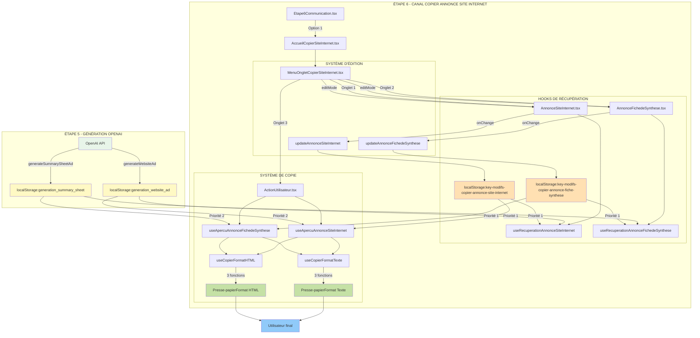

# Audit Technique Exhaustif : Canal "Copier Annonce Site Internet"
**Étape 6 Communication - Option 1**

---

## 01. MISSION DU DOCUMENT 

Ce document constitue la **documentation technique exhaustive** du canal "Copier Annonce Site Internet" dans l'application LeadGenAI. Il détaille tous les aspects techniques, fonctionnels et structurels de cette fonctionnalité permettant de récupérer, éditer et copier les annonces générées par OpenAI (Annonce Site Internet + Fiche de Synthèse) vers le presse-papier.

**Objectifs :**
- Documenter l'architecture complète du canal (composants, hooks, flux de données)
- Lister exhaustivement tous les fichiers utilisés et leurs rôles
- Décrire le processus complet de récupération des données OpenAI
- Expliciter le système d'édition (bouton "Modifier") et de sauvegarde
- Détailler les 6 options de copie (3 Format Texte + 3 Format HTML)
- Identifier les choix stratégiques LeadGenAI (mapping, nettoyage HTML, logique avancée)

**Public cible :**
- Développeurs (maintenance, évolution)
- Auditeurs techniques (compréhension du système)
- Équipe migration Supabase (préservation de la logique métier)

---

## 02. SOMMAIRE CLIQUABLE 

1. [Mission du Document](#mission)
2. [Sommaire Cliquable](#sommaire)
3. [Architecture Globale - Canal "Copier Annonce Site Internet"](#architecture)
   - 3.1. Vue d'ensemble du canal
   - 3.2. Position dans Étape 6 Communication
   - 3.3. Schéma Mermaid complet (flux de données)
4. [Liste Exhaustive des Fichiers Utilisés](#fichiers)
   - 4.1. Fichiers de composition (9 fichiers)
   - 4.2. Hooks de récupération (2 fichiers)
   - 4.3. Hooks d'aperçu (2 fichiers)
   - 4.4. Hooks de copie (2 fichiers)
   - 4.5. Composants graphiques (2 fichiers)
   - 4.6. Arborescence complète avec descriptions
5. [Système d'Onglets (3 Onglets)](#onglets)
   - 5.1. MenuOngletCopierSiteInternet (orchestrateur)
   - 5.2. Onglet 1 : Annonce Site Internet (File1)
   - 5.3. Onglet 2 : Annonce Fiche de Synthèse (File2)
   - 5.4. Onglet 3 : Copier les Annonces (File3)
   - 5.5. Logique de navigation et état
6. [Processus de Récupération des Données OpenAI](#recuperation)
   - 6.1. Sources de données (2 clés localStorage)
   - 6.2. Logique de priorité (modifs > originales)
   - 6.3. Hooks de récupération détaillés
   - 6.4. Mapping des champs OpenAI → Interface
7. [Structure des Données localStorage](#localStorage)
   - 7.1. Clés LUES (2 clés generation_*)
   - 7.2. Clés ÉCRITES (2 clés key-modifs-*)
   - 7.3. Interfaces TypeScript complètes
   - 7.4. Tableaux récapitulatifs
8. [Processus Complet Étape par Étape](#processus)
   - 8.1. Chargement initial (useEffect)
   - 8.2. Affichage en mode lecture seule
   - 8.3. Activation du mode édition
   - 8.4. Modification des champs
   - 8.5. Sauvegarde automatique
   - 8.6. Copie au format Texte/HTML
9. [Système d'Édition - Bouton "Modifier"](#edition)
   - 9.1. Localisation (MenuOngletCopierSiteInternet)
   - 9.2. Comportement toggle (Modifier ↔ Sauvegarder)
   - 9.3. Propagation de l'état editMode
   - 9.4. Affichage conditionnel (ReadOnlyField vs EditableField)
   - 9.5. Nettoyage HTML automatique
   - 9.6. Éditeur WYSIWYG (EditeurWYSIWYG.tsx)
10. [Options de Copie (6 Fonctions)](#copie)
    - 10.1. FORMAT TEXTE (3 fonctions)
    - 10.2. FORMAT HTML (3 fonctions)
    - 10.3. Logique de formatage détaillée
11. [Système d'Aperçu (2 Hooks)](#apercu)
    - 11.1. Hook Aperçu Annonce Site Internet
    - 11.2. Hook Aperçu Annonce Fiche de Synthèse
    - 11.3. Fonction stripHtmlTags() détaillée
    - 11.4. Fonction addTitlesToSections()
12. [Contraintes et Validation](#contraintes)
    - 12.1. Validation des champs (nettoyage HTML)
    - 12.2. Gestion des erreurs (loading, error)
    - 12.3. Toasts de notification
    - 12.4. Sécurité (dangerouslySetInnerHTML)
13. [Composants Graphiques Réutilisables](#composants)
    - 13.1. LabelField
    - 13.2. ReadOnlyField
    - 13.3. EditableField (+ useWysiwyg)
    - 13.4. CopyOption3
    - 13.5. CopyOptionsContainer
    - 13.6. AnnoncePreview
14. [Tableaux Récapitulatifs](#tableaux)
    - 14.1. Tableau des champs (Annonce Site Internet - 4 champs)
    - 14.2. Tableau des champs (Fiche de Synthèse - 5 champs)
    - 14.3. Tableau des hooks (8 hooks au total)
    - 14.4. Tableau des fonctions de copie (6 fonctions)
    - 14.5. Matrice Onglets × Actions × Fichiers
15. [Données à Prendre en Considération](#donnees)
    - 15.1. Choix stratégiques LeadGenAI
    - 15.2. Dépendances critiques (react-quill)
    - 15.3. Fonctions clés à préserver
    - 15.4. Mapping OpenAI → Interface (cta vs appelAction)

---

## 03. ARCHITECTURE GLOBALE - CANAL "COPIER ANNONCE SITE INTERNET" 

### 3.1. Vue d'ensemble du canal

Le canal "Copier Annonce Site Internet" est le **premier canal** de l'Étape 6 Communication. Il permet de :

1. **Récupérer** les données OpenAI de 2 sources (`generation_website_ad` + `generation_summary_sheet`)
2. **Afficher** ces données dans 3 onglets distincts
3. **Éditer** les annonces via un éditeur WYSIWYG (sans barre d'outils)
4. **Copier** les annonces dans le presse-papier en 2 formats (Texte / HTML)

### 3.2. Position dans Étape 6 Communication

```
Étape 6 Communication (Etape6Communication.tsx)
└── Option 1 : Copier annonce site internet
    └── AccueilCopierSiteInternet.tsx (point d'entrée)
        └── MenuOngletCopierSiteInternet.tsx (orchestrateur)
            ├── Onglet 1 : AnnonceSiteInternet.tsx
            ├── Onglet 2 : AnnonceFichedeSynthese.tsx
            └── Onglet 3 : ActionUtilisateur.tsx (6 options de copie)
```

### 3.3. Schéma Mermaid complet (flux de données)



---

## 04. LISTE EXHAUSTIVE DES FICHIERS UTILISÉS 

### 4.1. Fichiers de composition (9 fichiers)

| # | Fichier | Rôle | Lignes |
|---|---------|------|--------|
| 1 | `AccueilCopierSiteInternet.tsx` | Point d'entrée, orchestration des 3 onglets | 73 |
| 2 | `MenuOngletCopierSiteInternet.tsx` | Gestion des onglets + bouton "Modifier" | 174 |
| 3 | `File1.AnnonceSiteInternet.tsx` | Affichage/édition Annonce Site Internet (4 champs) | 136 |
| 4 | `File2.AnnonceFichedeSynthese.tsx` | Affichage/édition Fiche de Synthèse (5 champs) | 154 |
| 5 | `File3.ActionUtilisateur.tsx` | 6 options de copie + 2 aperçus | 97 |
| 6 | `GraphismeInterieurCopierSiteInternet.tsx` | Composants graphiques réutilisables | 250 |
| 7 | `EditeurWYSIWYG.tsx` | Éditeur WYSIWYG (react-quill, sans toolbar) | 90 |
| 8 | `HookRecuperationAnnonceSiteInternet.ts` | Hook de récupération Annonce Site Internet | 76 |
| 9 | `HookRecuperationAnnonceFichedeSynthese.ts` | Hook de récupération Fiche de Synthèse | 81 |

### 4.2. Hooks de récupération (2 fichiers)

| Hook | Fichier | Fonction | Clés localStorage LUES | Clés localStorage ÉCRITES |
|------|---------|----------|------------------------|---------------------------|
| 1 | `HookRecuperationAnnonceSiteInternet.ts` | `useRecuperationAnnonceSiteInternet()` | `key-modifs-copier-annonce-site-internet` (priorité 1)`generation_website_ad` (priorité 2) | `key-modifs-copier-annonce-site-internet` |
| 2 | `HookRecuperationAnnonceFichedeSynthese.ts` | `useRecuperationAnnonceFichedeSynthese()` | `key-modifs-copier-annonce-fiche-synthese` (priorité 1)`generation_summary_sheet` (priorité 2) | `key-modifs-copier-annonce-fiche-synthese` |

### 4.3. Hooks d'aperçu (2 fichiers)

| Hook | Fichier | Fonction | Particularité |
|------|---------|----------|---------------|
| 1 | `HookCopierApercuAnnonceSiteInternet.tsx` | `useApercuAnnonceSiteInternet()` | Fonction `stripHtmlTags()` (transitions h2/p) |
| 2 | `HookCopierApercuAnnonceFichedeSynthese.tsx` | `useApercuAnnonceFichedeSynthese()` | Fonction `addTitlesToSections()` + `stripHtmlTags()` |

### 4.4. Hooks de copie (2 fichiers)

| Hook | Fichier | Fonctions exportées | Formats |
|------|---------|---------------------|---------|
| 1 | `HookCopierFormatTexte.tsx` | `copierAnnonceSiteInternet``copierAnnonceFichedeSynthese``copierLesDeuxAnnonces` | Texte brut (avec `\n\n`) |
| 2 | `HookCopierFormatHTML.tsx` | `copierAnnonceSiteInternetHTML``copierAnnonceFichedeSyntheseHTML``copierLesDeuxAnnoncesHTML` | HTML avec balises ``, ``, ``, ``, `` |

### 4.5. Composants graphiques (2 fichiers)

| Composant | Fichier | Description |
|-----------|---------|-------------|
| 1 | `GraphismeInterieurCopierSiteInternet.tsx` | Bibliothèque de composants réutilisables (LabelField, ReadOnlyField, EditableField, CopyOption3, etc.) |
| 2 | `EditeurWYSIWYG.tsx` | Éditeur WYSIWYG basé sur `react-quill` avec `toolbar: false` (choix stratégique LeadGenAI) |

### 4.6. Arborescence complète avec descriptions

```
src/components/1-Sources-Restitution-Utilisateur/1.EtapeCopierSiteInternet/
├── AccueilCopierSiteInternet.tsx              (Point d'entrée, état editMode global)
├── MenuOngletCopierSiteInternet.tsx           (Orchestrateur onglets + bouton "Modifier")
├── File1.AnnonceSiteInternet.tsx              (Onglet 1 : 4 champs Site Internet)
├── File2.AnnonceFichedeSynthese.tsx           (Onglet 2 : 5 champs Fiche de Synthèse)
├── File3.ActionUtilisateur.tsx                (Onglet 3 : 6 options copie + 2 aperçus)
├── HookRecuperationAnnonceSiteInternet.ts     (Récupération Site Internet : localStorage → state)
├── HookRecuperationAnnonceFichedeSynthese.ts  (Récupération Synthèse : localStorage → state)
├── HookCopierApercuAnnonceSiteInternet.tsx    (Aperçu Site Internet + stripHtmlTags)
├── HookCopierApercuAnnonceFichedeSynthese.tsx (Aperçu Synthèse + addTitlesToSections)
├── HookCopierFormatTexte.tsx                  (3 fonctions copie Format Texte)
├── HookCopierFormatHTML.tsx                   (3 fonctions copie Format HTML + logique H2)
├── GraphismeInterieurCopierSiteInternet.tsx   (Composants UI réutilisables)
└── EditeurWYSIWYG.tsx                         (Éditeur react-quill sans toolbar)
```

---

## 05. SYSTÈME D'ONGLETS (3 ONGLETS) 

### 5.1. MenuOngletCopierSiteInternet (orchestrateur)

**Fichier :** `MenuOngletCopierSiteInternet.tsx` (174 lignes)

**Responsabilités :**
- Gérer les 3 onglets (`tab1`, `tab2`, `tab3`)
- Afficher le bouton "Modifier" / "Sauvegarder"
- Propager l'état `editMode` vers les composants enfants
- Afficher un toast de confirmation lors de la sauvegarde

**Props :**
```typescript
interface MenuOngletCopierSiteInternetProps {
  tabTitles?: string[];                          // Titres des onglets (par défaut: ["Annonce Site Internet", "Annonce Fiche de Synthèse", "Copier les Annonces"])
  tabContent1?: ReactNode;                       // Contenu onglet 1
  tabContent2?: ReactNode;                       // Contenu onglet 2
  tabContent3?: ReactNode;                       // Contenu onglet 3
  enableEditMode?: boolean;                      // Activer le bouton "Modifier" (par défaut: false)
  onTabChange?: (tabValue: string) => void;      // Callback changement d'onglet
  onEditModeChange?: (isEditMode: boolean) => void; // Callback changement mode édition
  className?: string;                            // Classes CSS additionnelles
}
```

**État interne :**
```typescript
const [activeTab, setActiveTab] = useState("tab1");
const [editMode, setEditMode] = useState(false);
```

**Logique du bouton "Modifier" :**
```typescript
// Fichier: MenuOngletCopierSiteInternet.tsx, lignes 60-75
const toggleEditMode = () => {
  const newEditMode = !editMode;
  setEditMode(newEditMode);

  if (!newEditMode) {
    // Si on désactive le mode édition, on affiche un toast
    toast({
      title: "Modifications sauvegardées",
      description: "Les changements ont été enregistrés avec succès."
    });
  }

  if (onEditModeChange) {
    onEditModeChange(newEditMode);
  }
};
```

**Comportement au changement d'onglet :**
```typescript
// Fichier: MenuOngletCopierSiteInternet.tsx, lignes 48-57
const handleTabChange = (value: string) => {
  setActiveTab(value);
  if (editMode) {
    // Si on change d'onglet en mode édition, on désactive le mode édition
    toggleEditMode();
  }
  if (onTabChange) {
    onTabChange(value);
  }
};
```

### 5.2. Onglet 1 : Annonce Site Internet (File1)

**Fichier :** `File1.AnnonceSiteInternet.tsx` (136 lignes)

**Champs affichés (4) :**
1. **Titre** (`titre`)
2. **Accroche** (`accroche`)
3. **Descriptif** (`descriptif`)
4. **Appel à l'action** (`appelAction`)

**Affichage conditionnel :**
```typescript
// Fichier: File1.AnnonceSiteInternet.tsx, lignes 59-73
{editMode ? (
   handleChange("titre", value)}
    rows={1}
    useWysiwyg={true}
  />
) : (

)}
```

**Nettoyage HTML automatique :**
```typescript
// Fichier: File1.AnnonceSiteInternet.tsx, lignes 21-44
const handleChange = (name: string, value: string) => {
  // Pour le champ titre, on supprime les balises HTML
  let cleanedValue = value;
  if (name === "titre") {
    // Supprime les balises  et autres balises HTML
    cleanedValue = value.replace(/<\/?[^>]+(>|$)/g, "");
  }

  if (name === "accroche" || name === "appelAction") {
    // Supprime les balises  et autres balises HTML
    cleanedValue = value.replace(/<\/?[^>]+(>|$)/g, "");
  }

  const updatedData = { [name]: cleanedValue };
  updateAnnonceSiteInternet(updatedData);

  // Notification au composant parent si nécessaire
  if (onDataChange) {
    onDataChange({
      ...annonceSiteInternet,
      ...updatedData
    });
  }
};
```

### 5.3. Onglet 2 : Annonce Fiche de Synthèse (File2)

**Fichier :** `File2.AnnonceFichedeSynthese.tsx` (154 lignes)

**Champs affichés (5) :**
1. **Titre** (`titre`)
2. **Référence & Prix** (`referenceEtPrix`)
3. **Présentation | Détails clés** (`detailsCles`)
4. **Présentation | Données Financières** (`donneesFinancieres`)
5. **Présentation | Informations complémentaires** (`informationsComplementaires`)

**Nettoyage HTML :**
```typescript
// Fichier: File2.AnnonceFichedeSynthese.tsx, lignes 22-40
const handleChange = (name: string, value: string) => {
  // Pour le champ titre, on supprime les balises HTML
  let cleanedValue = value;
  if (name === "titre") {
    // Supprime les balises  et autres balises HTML
    cleanedValue = value.replace(/<\/?[^>]+(>|$)/g, "");
  }

  const updatedData = { [name]: cleanedValue };
  updateAnnonceFichedeSynthese(updatedData);

  // Notification au composant parent si nécessaire
  if (onDataChange) {
    onDataChange({
      ...annonceFichedeSynthese,
      ...updatedData
    });
  }
};
```

### 5.4. Onglet 3 : Copier les Annonces (File3)

**Fichier :** `File3.ActionUtilisateur.tsx` (97 lignes)

**Contenu :**
- **2 colonnes d'options** : Format Texte / Format HTML
- **6 boutons de copie** :
  - Colonne 1 (Texte) : 3 boutons
  - Colonne 2 (HTML) : 3 boutons
- **2 aperçus** :
  - Aperçu Annonce Site Internet
  - Aperçu Fiche de Synthèse

**Hooks utilisés :**
```typescript
// Fichier: File3.ActionUtilisateur.tsx, lignes 15-23
const { annonceSiteInternet: ApercuAnnonceSiteInternet, isLoading: isLoadingSite, error: errorSite } = useApercuAnnonceSiteInternet();
const { annonceFichedeSynthese: ApercuAnnonceFichedeSynthese, isLoading: isLoadingFiche, error: errorFiche } = useApercuAnnonceFichedeSynthese();

// Utiliser le hook pour obtenir les fonctions de copie
const { copierAnnonceSiteInternet, copierAnnonceFichedeSynthese, copierLesDeuxAnnonces } = useCopierFormatTexte();

// Utiliser le hook pour obtenir les fonctions de copie HTML
const { copierAnnonceSiteInternetHTML, copierAnnonceFichedeSyntheseHTML, copierLesDeuxAnnoncesHTML } = useCopierFormatHTML();
```

### 5.5. Logique de navigation et état

**Propagation de l'état `editMode` :**

```
AccueilCopierSiteInternet (état editMode global)
└── MenuOngletCopierSiteInternet (gestion toggle + propagation)
    ├── Onglet 1 : AnnonceSiteInternet (reçoit editMode)
    │   └── Affichage conditionnel : ReadOnlyField vs EditableField
    ├── Onglet 2 : AnnonceFichedeSynthese (reçoit editMode)
    │   └── Affichage conditionnel : ReadOnlyField vs EditableField
    └── Onglet 3 : ActionUtilisateur (pas de mode édition)
        └── Aperçus + Boutons de copie
```

**Changement d'onglet → Désactivation automatique du mode édition :**

- Si l'utilisateur clique sur un autre onglet alors que le mode édition est actif
- Le mode édition est automatiquement désactivé
- Un toast "Modifications sauvegardées" est affiché

---

## 06. PROCESSUS DE RÉCUPÉRATION DES DONNÉES OPENAI 

### 6.1. Sources de données (2 clés localStorage)

| Clé localStorage | Service OpenAI source | Structure JSON | Utilisé par |
|------------------|----------------------|----------------|-------------|
| `generation_website_ad` | `OpenAIService.generateWebsiteAd()` | `{ titre, accroche, descriptif, cta }` | Onglet 1 + Onglet 3 |
| `generation_summary_sheet` | `OpenAIService.generateSummarySheetAd()` | `{ titre, referenceEtPrix, detailsCles, donneesFinancieres, informationsComplementaires }` | Onglet 2 + Onglet 3 |

### 6.2. Logique de priorité (modifs > originales)

**Principe :**
1. Vérifier si `key-modifs-*` existe dans `localStorage`
2. Si OUI → utiliser ces données (modifiées par l'utilisateur)
3. Si NON → utiliser `generation_*` (données originales OpenAI)
4. Si aucune donnée → chaînes vides

**Implémentation dans `useRecuperationAnnonceSiteInternet` :**
```typescript
// Fichier: HookRecuperationAnnonceSiteInternet.ts, lignes 20-60
useEffect(() => {
  try {
    setIsLoading(true);

    // Vérifier d'abord s'il existe des données modifiées
    const modifiedDataJson = localStorage.getItem('key-modifs-copier-annonce-site-internet');

    if (modifiedDataJson) {
      // Utiliser les données modifiées si elles existent
      const modifiedData = JSON.parse(modifiedDataJson);
      setAnnonceSiteInternet({
        titre: modifiedData.titre || '',
        accroche: modifiedData.accroche || '',
        descriptif: modifiedData.descriptif || '',
        appelAction: modifiedData.appelAction || ''
      });
    } else {
      // Sinon, récupération des données originales depuis le localStorage
      const annonceSiteInternetData = localStorage.getItem('generation_website_ad');

      if (annonceSiteInternetData) {
        const parsedData = JSON.parse(annonceSiteInternetData);
        setAnnonceSiteInternet({
          titre: parsedData.titre || '',
          accroche: parsedData.accroche || '',
          descriptif: parsedData.descriptif || '',
          appelAction: parsedData.cta || '' // Note: utilisation de 'cta' au lieu de 'appelAction'
        });
      } else {
        // Fallback si les données ne sont pas trouvées
        console.log('Aucune donnée d\'annonce site internet trouvée dans le localStorage');
      }
    }

    setIsLoading(false);
  } catch (err) {
    console.error('Erreur lors de la récupération des données:', err);
    setError('Erreur lors de la récupération des données');
    setIsLoading(false);
  }
}, []);
```

### 6.3. Hooks de récupération détaillés

**Hook 1 : `useRecuperationAnnonceSiteInternet`**

**Fichier :** `HookRecuperationAnnonceSiteInternet.ts` (76 lignes)

**Interface :**
```typescript
interface AnnonceSiteInternetData {
  titre: string;
  accroche: string;
  descriptif: string;
  appelAction: string;
}
```

**Fonction de mise à jour :**
```typescript
// Fichier: HookRecuperationAnnonceSiteInternet.ts, lignes 62-73
const updateAnnonceSiteInternet = (newData: Partial) => {
  const updatedData = { ...annonceSiteInternet, ...newData };
  setAnnonceSiteInternet(updatedData);

  try {
    // Sauvegarde des modifications dans la nouvelle clé de stockage
    localStorage.setItem('key-modifs-copier-annonce-site-internet', JSON.stringify(updatedData));
  } catch (err) {
    console.error('Erreur lors de la sauvegarde des données:', err);
    setError('Erreur lors de la sauvegarde des données');
  }
};
```

**Retour du hook :**
```typescript
return { annonceSiteInternet, updateAnnonceSiteInternet, isLoading, error };
```

---

**Hook 2 : `useRecuperationAnnonceFichedeSynthese`**

**Fichier :** `HookRecuperationAnnonceFichedeSynthese.ts` (81 lignes)

**Interface :**
```typescript
interface AnnonceFichedeSyntheseData {
  titre: string;
  referenceEtPrix: string;
  detailsCles: string;
  donneesFinancieres: string;
  informationsComplementaires: string;
}
```

**Fonction de mise à jour :**
```typescript
// Fichier: HookRecuperationAnnonceFichedeSynthese.ts, lignes 66-77
const updateAnnonceFichedeSynthese = (newData: Partial) => {
  const updatedData = { ...annonceFichedeSynthese, ...newData };
  setAnnonceFichedeSynthese(updatedData);

  try {
    // Sauvegarde des modifications dans la nouvelle clé de stockage
    localStorage.setItem('key-modifs-copier-annonce-fiche-synthese', JSON.stringify(updatedData));
  } catch (err) {
    console.error('Erreur lors de la sauvegarde des données:', err);
    setError('Erreur lors de la sauvegarde des données');
  }
};
```

### 6.4. Mapping des champs OpenAI → Interface

**Choix stratégique LeadGenAI :**

OpenAI retourne des données avec des noms de champs différents de l'interface React. Ce mapping manuel est **intentionnel** et fait partie de la stratégie LeadGenAI.

**Mapping Annonce Site Internet :**

| Champ OpenAI (`generation_website_ad`) | Champ Interface (`AnnonceSiteInternetData`) | Ligne de code |
|-----------------------------------------|---------------------------------------------|---------------|
| `titre` | `titre` | Ligne 43 |
| `accroche` | `accroche` | Ligne 44 |
| `descriptif` | `descriptif` | Ligne 45 |
| **`cta`** | **`appelAction`** | Ligne 46 ⚠️ **MAPPING MANUEL** |

**Code du mapping :**
```typescript
// Fichier: HookRecuperationAnnonceSiteInternet.ts, ligne 46
appelAction: parsedData.cta || '' // Note: utilisation de 'cta' au lieu de 'appelAction'
```

**Mapping Fiche de Synthèse :**

| Champ OpenAI (`generation_summary_sheet`) | Champ Interface (`AnnonceFichedeSyntheseData`) | Cohérence |
|--------------------------------------------|------------------------------------------------|-----------|
| `titre` | `titre` | ✅ Identique |
| `referenceEtPrix` | `referenceEtPrix` | ✅ Identique |
| `detailsCles` | `detailsCles` | ✅ Identique |
| `donneesFinancieres` | `donneesFinancieres` | ✅ Identique |
| `informationsComplementaires` | `informationsComplementaires` | ✅ Identique |

---

## 07. STRUCTURE DES DONNÉES localStorage 

### 7.1. Clés LUES (2 clés generation_*)

**Clé 1 : `generation_website_ad`**

**Source :** `OpenAIService.generateWebsiteAd(propertyData, "gpt-4o")` (Étape 5)

**Structure JSON :**
```json
{
  "titre": "Restaurant Traditionnel - Emplacement Premium Paris 8ème",
  "accroche": "Découvrez cette opportunité unique d'acquérir un restaurant établi...",
  "descriptif": "Situé au cœur du 8ème arrondissement de Paris, ce restaurant traditionnel offre une expérience culinaire exceptionnelle dans un cadre élégant. L'emplacement bénéficie d'un flux constant de clientèle grâce à sa proximité avec les grands boulevards et les principaux sites touristiques.Caractéristiques du RestaurantLe restaurant dispose d'une capacité d'accueil de 80 couverts répartis sur deux niveaux. La cuisine professionnelle est entièrement équipée avec du matériel haut de gamme récemment rénové. L'établissement bénéficie également d'une terrasse extérieure de 30m² parfaitement aménagée.",
  "cta": "Contactez-nous dès aujourd'hui pour organiser une visite privée et découvrir le potentiel exceptionnel de ce restaurant. Notre équipe est à votre disposition pour répondre à toutes vos questions."
}
```

**Taille estimée :** 2-3 KB

**Format :**
- `titre`, `accroche`, `cta` : Texte brut
- `descriptif` : HTML avec balises ``, ``

---

**Clé 2 : `generation_summary_sheet`**

**Source :** `OpenAIService.generateSummarySheetAd(propertyData, "gpt-4o")` (Étape 5)

**Structure JSON :**
```json
{
  "titre": "Restaurant Traditionnel Paris 8ème - Affaire Exceptionnelle",
  "referenceEtPrix": "Référence : CLER789Prix FAI : 156 989€",
  "detailsCles": "Surface totale : 180m²Capacité d'accueil : 80 couverts2 niveaux + terrasse 30m²Cuisine équipée professionnelleEmplacement premium Paris 8ème",
  "donneesFinancieres": "Chiffre d'affaires annuel : 450 000€EBE : 85 000€Loyer mensuel : 4 500€Bail 3/6/9 en cours",
  "informationsComplementaires": "Licence IVMatériel récent (rénové en 2022)Personnel qualifié en place (7 salariés)Forte notoriété locale"
}
```

**Taille estimée :** 3-4 KB

**Format :**
- `titre` : Texte brut
- Tous les autres champs : HTML avec balises ``, ``, ``, ``

### 7.2. Clés ÉCRITES (2 clés key-modifs-*)

**Clé 1 : `key-modifs-copier-annonce-site-internet`**

**Écrite par :** `updateAnnonceSiteInternet(newData)` (ligne 68 de `HookRecuperationAnnonceSiteInternet.ts`)

**Structure JSON :**
```typescript
interface AnnonceSiteInternetData {
  titre: string;
  accroche: string;
  descriptif: string;
  appelAction: string;
}
```

**Exemple :**
```json
{
  "titre": "Restaurant Traditionnel - Emplacement Premium Paris 8ème (MODIFIÉ)",
  "accroche": "Découvrez cette opportunité unique... (MODIFIÉ)",
  "descriptif": "Situé au cœur du 8ème arrondissement... (MODIFIÉ)",
  "appelAction": "Contactez-nous dès aujourd'hui... (MODIFIÉ)"
}
```

---

**Clé 2 : `key-modifs-copier-annonce-fiche-synthese`**

**Écrite par :** `updateAnnonceFichedeSynthese(newData)` (ligne 72 de `HookRecuperationAnnonceFichedeSynthese.ts`)

**Structure JSON :**
```typescript
interface AnnonceFichedeSyntheseData {
  titre: string;
  referenceEtPrix: string;
  detailsCles: string;
  donneesFinancieres: string;
  informationsComplementaires: string;
}
```

### 7.3. Interfaces TypeScript complètes

**Interface 1 : Annonce Site Internet**
```typescript
// Fichier: HookRecuperationAnnonceSiteInternet.ts, lignes 3-8
interface AnnonceSiteInternetData {
  titre: string;           // Titre de l'annonce
  accroche: string;        // Phrase d'accroche
  descriptif: string;      // Description longue (HTML)
  appelAction: string;     // Call-to-action final
}
```

**Interface 2 : Fiche de Synthèse**
```typescript
// Fichier: HookRecuperationAnnonceFichedeSynthese.ts, lignes 3-9
interface AnnonceFichedeSyntheseData {
  titre: string;                       // Titre de la fiche
  referenceEtPrix: string;             // Référence + Prix (HTML)
  detailsCles: string;                 // Détails clés (HTML, liste à puces)
  donneesFinancieres: string;          // Données financières (HTML, liste à puces)
  informationsComplementaires: string; // Infos complémentaires (HTML, liste à puces)
}
```

### 7.4. Tableaux récapitulatifs

**Tableau : Clés localStorage - Lecture/Écriture**

| Clé localStorage | Type | Source | Utilisée par | Priorité |
|------------------|------|--------|--------------|----------|
| `generation_website_ad` | Lecture | OpenAI Étape 5 | `useRecuperationAnnonceSiteInternet``useApercuAnnonceSiteInternet` | 2 |
| `key-modifs-copier-annonce-site-internet` | Lecture + Écriture | Modifications utilisateur | `useRecuperationAnnonceSiteInternet``useApercuAnnonceSiteInternet` | 1 |
| `generation_summary_sheet` | Lecture | OpenAI Étape 5 | `useRecuperationAnnonceFichedeSynthese``useApercuAnnonceFichedeSynthese` | 2 |
| `key-modifs-copier-annonce-fiche-synthese` | Lecture + Écriture | Modifications utilisateur | `useRecuperationAnnonceFichedeSynthese``useApercuAnnonceFichedeSynthese` | 1 |

---

## 08. PROCESSUS COMPLET ÉTAPE PAR ÉTAPE 

### 8.1. Chargement initial (useEffect)

**Étape 1 :** L'utilisateur accède à Étape 6 → Option 1 "Copier annonce site internet"

**Étape 2 :** `AccueilCopierSiteInternet.tsx` s'affiche

**Étape 3 :** `MenuOngletCopierSiteInternet.tsx` initialise l'onglet actif : `tab1`

**Étape 4 :** `File1.AnnonceSiteInternet.tsx` se monte → appel de `useRecuperationAnnonceSiteInternet()`

**Étape 5 :** Le `useEffect` du hook s'exécute :
```typescript
// Fichier: HookRecuperationAnnonceSiteInternet.ts, lignes 20-60
useEffect(() => {
  try {
    setIsLoading(true);

    // 1. Vérifier clé modifs
    const modifiedDataJson = localStorage.getItem('key-modifs-copier-annonce-site-internet');

    if (modifiedDataJson) {
      // Cas 1: Données modifiées existent → utiliser
      const modifiedData = JSON.parse(modifiedDataJson);
      setAnnonceSiteInternet({ ...modifiedData });
    } else {
      // Cas 2: Pas de modifs → chercher données OpenAI originales
      const annonceSiteInternetData = localStorage.getItem('generation_website_ad');

      if (annonceSiteInternetData) {
        const parsedData = JSON.parse(annonceSiteInternetData);
        setAnnonceSiteInternet({
          titre: parsedData.titre || '',
          accroche: parsedData.accroche || '',
          descriptif: parsedData.descriptif || '',
          appelAction: parsedData.cta || '' // MAPPING cta → appelAction
        });
      } else {
        // Cas 3: Aucune donnée trouvée
        console.log('Aucune donnée trouvée');
      }
    }

    setIsLoading(false);
  } catch (err) {
    console.error('Erreur:', err);
    setError('Erreur lors de la récupération des données');
    setIsLoading(false);
  }
}, []);
```

### 8.2. Affichage en mode lecture seule

**Par défaut, `editMode = false`** (défini dans `AccueilCopierSiteInternet.tsx` ligne 16)

**Affichage des champs :**
- Tous les champs sont affichés avec le composant `ReadOnlyField`
- Le champ `descriptif` utilise `dangerouslySetInnerHTML` pour afficher le HTML
- L'utilisateur peut lire mais **ne peut pas modifier**

**Exemple de rendu :**
```typescript
// Fichier: File1.AnnonceSiteInternet.tsx, lignes 68-72

```

### 8.3. Activation du mode édition

**Étape 1 :** L'utilisateur clique sur le bouton "Modifier" (dans `MenuOngletCopierSiteInternet.tsx`)

**Étape 2 :** La fonction `toggleEditMode()` est appelée :
```typescript
// Fichier: MenuOngletCopierSiteInternet.tsx, lignes 60-75
const toggleEditMode = () => {
  const newEditMode = !editMode;
  setEditMode(newEditMode);

  if (!newEditMode) {
    // Si on désactive le mode édition, on affiche un toast
    toast({
      title: "Modifications sauvegardées",
      description: "Les changements ont été enregistrés avec succès."
    });
  }

  if (onEditModeChange) {
    onEditModeChange(newEditMode);
  }
};
```

**Étape 3 :** L'état `editMode` passe à `true` et est propagé vers `AccueilCopierSiteInternet.tsx`

**Étape 4 :** `AccueilCopierSiteInternet.tsx` propage `editMode={true}` vers `File1.AnnonceSiteInternet.tsx`

**Étape 5 :** Les champs passent de `ReadOnlyField` à `EditableField` :
```typescript
// Fichier: File1.AnnonceSiteInternet.tsx, lignes 59-73
{editMode ? (
   handleChange("titre", value)}
    rows={1}
    useWysiwyg={true}
  />
) : (

)}
```

### 8.4. Modification des champs

**Étape 1 :** L'utilisateur modifie un champ (par exemple le titre)

**Étape 2 :** Le composant `EditableField` (avec `useWysiwyg={true}`) affiche un `EditeurWYSIWYG`

**Étape 3 :** L'`EditeurWYSIWYG` (basé sur `react-quill`) appelle `onChange` à chaque changement

**Étape 4 :** La fonction `handleChange` dans `File1.AnnonceSiteInternet.tsx` est appelée :
```typescript
// Fichier: File1.AnnonceSiteInternet.tsx, lignes 21-44
const handleChange = (name: string, value: string) => {
  // Nettoyage HTML pour titre, accroche, appelAction
  let cleanedValue = value;
  if (name === "titre") {
    cleanedValue = value.replace(/<\/?[^>]+(>|$)/g, "");
  }

  if (name === "accroche" || name === "appelAction") {
    cleanedValue = value.replace(/<\/?[^>]+(>|$)/g, "");
  }

  const updatedData = { [name]: cleanedValue };
  updateAnnonceSiteInternet(updatedData); // ⬅️ Appel au hook

  // Notification au composant parent
  if (onDataChange) {
    onDataChange({
      ...annonceSiteInternet,
      ...updatedData
    });
  }
};
```

### 8.5. Sauvegarde automatique

**Étape 1 :** La fonction `updateAnnonceSiteInternet(updatedData)` du hook est appelée

**Étape 2 :** Le hook met à jour le state React ET sauvegarde dans `localStorage` :
```typescript
// Fichier: HookRecuperationAnnonceSiteInternet.ts, lignes 62-73
const updateAnnonceSiteInternet = (newData: Partial) => {
  const updatedData = { ...annonceSiteInternet, ...newData };
  setAnnonceSiteInternet(updatedData);

  try {
    // Sauvegarde immédiate dans localStorage
    localStorage.setItem('key-modifs-copier-annonce-site-internet', JSON.stringify(updatedData));
  } catch (err) {
    console.error('Erreur lors de la sauvegarde des données:', err);
    setError('Erreur lors de la sauvegarde des données');
  }
};
```

**Étape 3 :** Les données sont **persistées immédiatement** dans `localStorage`

**⚠️ Important :** La sauvegarde est **automatique** à chaque modification, il n'y a **pas besoin** de cliquer sur "Sauvegarder"

### 8.6. Copie au format Texte/HTML

**Étape 1 :** L'utilisateur clique sur l'onglet 3 "Copier les Annonces"

**Étape 2 :** Le composant `File3.ActionUtilisateur.tsx` affiche 6 boutons de copie

**Étape 3 :** L'utilisateur clique sur un bouton (par exemple "Copier l'Annonce Site Internet" - Format Texte)

**Étape 4 :** La fonction `copierAnnonceSiteInternet()` est appelée :
```typescript
// Fichier: HookCopierFormatTexte.tsx, lignes 11-62
const copierAnnonceSiteInternet = async () => {
  try {
    if (isLoadingSiteInternet) {
      toast({ title: "Information", description: "Les données sont en cours de chargement..." });
      return;
    }

    if (errorSiteInternet) {
      toast({ title: "Erreur", description: "Impossible de récupérer les données..." });
      return;
    }

    let texteToCopy = "";

    // Titre
    texteToCopy += annonceSiteInternet.titre + "\n\n";

    // Accroche
    texteToCopy += annonceSiteInternet.accroche + "\n\n";

    // Descriptif
    texteToCopy += annonceSiteInternet.descriptif + "\n\n";

    // CTA
    texteToCopy += annonceSiteInternet.appelAction;

    await navigator.clipboard.writeText(texteToCopy);

    toast({
      title: "Succès",
      description: "L'annonce site internet a été copiée dans le presse-papier"
    });
  } catch (error) {
    console.error('Erreur lors de la copie:', error);
    toast({
      title: "Erreur",
      description: "Une erreur s'est produite lors de la copie"
    });
  }
};
```

**Étape 5 :** Le texte est copié dans le presse-papier (via `navigator.clipboard.writeText()`)

**Étape 6 :** Un toast de confirmation s'affiche

---

## 09. SYSTÈME D'ÉDITION - BOUTON "MODIFIER" 

### 9.1. Localisation (MenuOngletCopierSiteInternet)

**Fichier :** `MenuOngletCopierSiteInternet.tsx`

**Lignes de code :** 105-125 (Onglet 1), 135-156 (Onglet 2)

**Affichage conditionnel :**
```typescript
// Fichier: MenuOngletCopierSiteInternet.tsx, lignes 105-126
{enableEditMode && (

      {editMode ? (
        <>

          Sauvegarder

      ) : (
        <>

          Modifier

      )}

)}
```

### 9.2. Comportement toggle (Modifier ↔ Sauvegarder)

**État initial :** Bouton affiche "Modifier" avec icône ``

**Après clic :** Bouton affiche "Sauvegarder" avec icône ``

**Fonction toggle :**
```typescript
// Fichier: MenuOngletCopierSiteInternet.tsx, lignes 60-75
const toggleEditMode = () => {
  const newEditMode = !editMode;
  setEditMode(newEditMode);

  if (!newEditMode) {
    // Si on désactive le mode édition, on affiche un toast
    toast({
      title: "Modifications sauvegardées",
      description: "Les changements ont été enregistrés avec succès."
    });
  }

  if (onEditModeChange) {
    onEditModeChange(newEditMode);
  }
};
```

**Toast de confirmation :**
- Affiché **uniquement** lors de la désactivation du mode édition (passage de `true` à `false`)
- Titre : "Modifications sauvegardées"
- Description : "Les changements ont été enregistrés avec succès."

### 9.3. Propagation de l'état editMode

```
MenuOngletCopierSiteInternet
├── État local: editMode (useState)
├── Callback: onEditModeChange (prop)
└── Propagation vers parent AccueilCopierSiteInternet
    └── État global: editMode
        └── Propagation vers enfants
            ├── File1.AnnonceSiteInternet (prop: editMode)
            └── File2.AnnonceFichedeSynthese (prop: editMode)
```

**Code de propagation vers parent :**
```typescript
// Fichier: AccueilCopierSiteInternet.tsx, lignes 65-67
onEditModeChange={(isEditMode) => {
  setEditMode(isEditMode);
}}
```

**Code de propagation vers enfants :**
```typescript
// Fichier: AccueilCopierSiteInternet.tsx, lignes 31-37
const contentTab1 = (

);
```

### 9.4. Affichage conditionnel (ReadOnlyField vs EditableField)

**Condition :** `editMode ?  : `

**Exemple pour le champ "Titre" :**
```typescript
// Fichier: File1.AnnonceSiteInternet.tsx, lignes 59-73
{editMode ? (
   handleChange("titre", value)}
    rows={1}
    useWysiwyg={true}
  />
) : (

)}
```

**Différences visuelles :**
- **ReadOnlyField** : Fond blanc, bordure grise, texte non éditable
- **EditableField** : Éditeur WYSIWYG (react-quill), fond blanc, bordure grise, texte éditable

### 9.5. Nettoyage HTML automatique

**Choix stratégique LeadGenAI :**
Les champs `titre`, `accroche`, et `appelAction` sont **automatiquement nettoyés** des balises HTML lors de l'édition.

**Raison :** Ces champs doivent contenir **uniquement du texte brut**, sans balises.

**Code de nettoyage :**
```typescript
// Fichier: File1.AnnonceSiteInternet.tsx, lignes 21-33
const handleChange = (name: string, value: string) => {
  // Pour le champ titre, on supprime les balises HTML
  let cleanedValue = value;
  if (name === "titre") {
    // Supprime les balises  et autres balises HTML
    cleanedValue = value.replace(/<\/?[^>]+(>|$)/g, "");
  }

  if (name === "accroche" || name === "appelAction") {
    // Supprime les balises  et autres balises HTML
    cleanedValue = value.replace(/<\/?[^>]+(>|$)/g, "");
  }

  const updatedData = { [name]: cleanedValue };
  updateAnnonceSiteInternet(updatedData);
  // ...
};
```

**Champs concernés :**
- ✅ `titre` → Nettoyage HTML
- ✅ `accroche` → Nettoyage HTML
- ❌ `descriptif` → **Pas de nettoyage** (HTML autorisé)
- ✅ `appelAction` → Nettoyage HTML

### 9.6. Éditeur WYSIWYG (EditeurWYSIWYG.tsx)

**Fichier :** `EditeurWYSIWYG.tsx` (90 lignes)

**Choix stratégique LeadGenAI :**
- **Toolbar désactivée** (`toolbar: false`)
- **Formats permis** (mais non accessibles visuellement) : `header`, `bold`, `italic`, `underline`, `strike`, `list`, `bullet`

**Raison :** Simplifier l'interface utilisateur, éviter les erreurs de formatage

**Configuration :**
```typescript
// Fichier: EditeurWYSIWYG.tsx, lignes 14-24
const defaultModules = {
  toolbar: false // ⚠️ CHOIX STRATÉGIQUE LEADGENAI
};

const formats = [
  'header',
  'bold', 'italic', 'underline', 'strike',
  'list', 'bullet'
];
```

**Props :**
```typescript
interface EditeurWYSIWYGProps {
  value: string;
  onChange: (content: string) => void;
  rows?: number;                    // Nombre de lignes (calcul hauteur)
  className?: string;
  simpleMode?: boolean;
}
```

**Calcul de la hauteur :**
```typescript
// Fichier: EditeurWYSIWYG.tsx, ligne 48
const editorHeight = `${Math.max(150, rows * 40)}px`;
```

**Style personnalisé :**
```typescript
// Fichier: EditeurWYSIWYG.tsx, lignes 51-55
const editorStyle = {
  height: editorHeight,
  fontSize: '18px',         // Police augmentée
  fontFamily: 'Nunito, sans-serif'
};
```

**Masquage de la toolbar :**
```typescript
// Fichier: EditeurWYSIWYG.tsx, lignes 76-79
/* Cacher la barre d'outils */
.quill-custom-font .ql-toolbar {
  display: none;
}
```

---

## 10. OPTIONS DE COPIE (6 FONCTIONS) 

### 10.1. FORMAT TEXTE (3 fonctions)

**Fichier :** `HookCopierFormatTexte.tsx` (200 lignes)

**Hook :** `useCopierFormatTexte()`

**Retour :**
```typescript
return {
  copierAnnonceSiteInternet,
  copierAnnonceFichedeSynthese,
  copierLesDeuxAnnonces
};
```

---

**A. Copier Annonce Site Internet (Format Texte)**

**Fonction :** `copierAnnonceSiteInternet()`

**Lignes de code :** 11-62

**Formatage :**
```typescript
let texteToCopy = "";

// Titre
texteToCopy += annonceSiteInternet.titre + "\n\n";

// Accroche
texteToCopy += annonceSiteInternet.accroche + "\n\n";

// Descriptif
texteToCopy += annonceSiteInternet.descriptif + "\n\n";

// CTA
texteToCopy += annonceSiteInternet.appelAction;

await navigator.clipboard.writeText(texteToCopy);
```

**Exemple de texte copié :**
```
Restaurant Traditionnel - Emplacement Premium Paris 8ème

Découvrez cette opportunité unique d'acquérir un restaurant établi au cœur de Paris avec une clientèle fidèle et un emplacement exceptionnel.

Situé au cœur du 8ème arrondissement de Paris, ce restaurant traditionnel offre une expérience culinaire exceptionnelle dans un cadre élégant.

Caractéristiques du Restaurant

Le restaurant dispose d'une capacité d'accueil de 80 couverts répartis sur deux niveaux. La cuisine professionnelle est entièrement équipée.

Contactez-nous dès aujourd'hui pour organiser une visite privée.
```

---

**B. Copier Annonce Fiche de Synthèse (Format Texte)**

**Fonction :** `copierAnnonceFichedeSynthese()`

**Lignes de code :** 65-119

**Formatage :**
```typescript
let texteToCopy = "";

// Titre
texteToCopy += annonceFichedeSynthese.titre + "\n\n";

// Référence et Prix
texteToCopy += annonceFichedeSynthese.referenceEtPrix + "\n\n";

// Détails clés
texteToCopy += annonceFichedeSynthese.detailsCles + "\n\n";

// Données Financières
texteToCopy += annonceFichedeSynthese.donneesFinancieres + "\n\n";

// Informations complémentaires
texteToCopy += annonceFichedeSynthese.informationsComplementaires;

await navigator.clipboard.writeText(texteToCopy);
```

---

**C. Copier les 2 Annonces (Format Texte)**

**Fonction :** `copierLesDeuxAnnonces()`

**Lignes de code :** 122-193

**Formatage :**
```typescript
let texteToCopy = "";

// Première partie : Annonce Site Internet
texteToCopy += annonceSiteInternet.titre + "\n\n";
texteToCopy += annonceSiteInternet.accroche + "\n\n";
texteToCopy += annonceSiteInternet.descriptif + "\n\n";
texteToCopy += annonceSiteInternet.appelAction + "\n\n";

// Titre de séparation
texteToCopy += "Synthèse des Informations\n\n";

// Deuxième partie : Annonce Fiche de Synthèse
texteToCopy += annonceFichedeSynthese.titre + "\n\n";
texteToCopy += annonceFichedeSynthese.referenceEtPrix + "\n\n";
texteToCopy += annonceFichedeSynthese.detailsCles + "\n\n";
texteToCopy += annonceFichedeSynthese.donneesFinancieres + "\n\n";
texteToCopy += annonceFichedeSynthese.informationsComplementaires;

await navigator.clipboard.writeText(texteToCopy);
```

### 10.2. FORMAT HTML (3 fonctions)

**Fichier :** `HookCopierFormatHTML.tsx` (463 lignes)

**Hook :** `useCopierFormatHTML()`

**Retour :**
```typescript
return {
  copierAnnonceSiteInternetHTML,
  copierAnnonceFichedeSyntheseHTML,
  copierLesDeuxAnnoncesHTML
};
```

---

**A. Copier Annonce Site Internet (Format HTML)**

**Fonction :** `copierAnnonceSiteInternetHTML()`

**Lignes de code :** 11-95

**Choix stratégique LeadGenAI :**
- Détection automatique des **titres H2** : lignes < 100 caractères sans ponctuation finale
- Parsing intelligent pour structurer le texte en `` et ``

**Formatage :**
```typescript
let htmlToCopy = "";

// Titre en H1
htmlToCopy += `${annonceSiteInternet.titre}\n\n`;

// Accroche en P
htmlToCopy += `${annonceSiteInternet.accroche}\n\n`;

// Descriptif avec logique H2/P avancée
const lignesDescriptif = annonceSiteInternet.descriptif.split('\n');
let enTitreH2 = false;

lignesDescriptif.forEach(ligne => {
  ligne = ligne.trim();
  if (ligne) {
    // Si c'est une ligne courte (moins de 100 caractères) sans ponctuation finale,
    // on la considère comme un titre H2
    if (ligne.length < 100 && !ligne.match(/[.,:;?!]$/)) {
      htmlToCopy += `${ligne}\n`;
      enTitreH2 = true;
    } else {
      // Sinon c'est un paragraphe
      if (enTitreH2 || !htmlToCopy.endsWith('\n\n')) {
        htmlToCopy += `${ligne}`;
        enTitreH2 = false;
      } else {
        htmlToCopy += ` ${ligne}`;
      }

      // Si la ligne se termine par un point, on ferme le paragraphe
      if (ligne.match(/[.,:;?!]$/)) {
        htmlToCopy += `\n\n`;
      }
    }
  }
});

// Appel à l'action en P
htmlToCopy += `${annonceSiteInternet.appelAction}`;

await navigator.clipboard.writeText(htmlToCopy);
```

**Exemple de HTML copié :**
```html
Restaurant Traditionnel - Emplacement Premium Paris 8ème

Découvrez cette opportunité unique d'acquérir un restaurant établi au cœur de Paris.

Caractéristiques du Restaurant
Le restaurant dispose d'une capacité d'accueil de 80 couverts répartis sur deux niveaux.

Contactez-nous dès aujourd'hui pour organiser une visite privée.
```

---

**B. Copier Annonce Fiche de Synthèse (Format HTML)**

**Fonction :** `copierAnnonceFichedeSyntheseHTML()`

**Lignes de code :** 98-251

**Choix stratégique LeadGenAI :**
- Détection automatique des **listes à puces** (lignes contenant `label: valeur`)
- Extraction et ajout automatique des **titres de sections** (ex: "Présentation | Détails clés")
- Parsing intelligent pour transformer le texte en ``, ``, ``

**Formatage :**
```typescript
let htmlToCopy = "";

// Titre en H2
htmlToCopy += `${annonceFichedeSynthese.titre}\n\n`;

// Référence et Prix en liste
htmlToCopy += '\n';
const tempDivRef = document.createElement('div');
tempDivRef.innerHTML = annonceFichedeSynthese.referenceEtPrix;

const refText = tempDivRef.textContent || "";
const refLines = refText.split('\n');

refLines.forEach(line => {
  const trimmedLine = line.trim();
  if (trimmedLine) {
    // Détection des formats comme "Référence : CLER789"
    if (trimmedLine.includes(':')) {
      const [label, value] = trimmedLine.split(':').map(part => part.trim());
      htmlToCopy += `  . ${label} : ${value}\n`;
    } else {
      htmlToCopy += `  . ${trimmedLine}\n`;
    }
  }
});
htmlToCopy += '\n\n';

// Détails clés - Extraire le titre existant
const detailsText = annonceFichedeSynthese.detailsCles || "";
if (detailsText) {
  if (detailsText.startsWith("Présentation | Détails clés")) {
    const titleEndIndex = detailsText.indexOf('\n');
    const title = detailsText.substring(0, titleEndIndex).trim();
    htmlToCopy += `${title}\n`;

    const remainingText = detailsText.substring(titleEndIndex + 1).trim();
    htmlToCopy += '\n';

    const detailLines = remainingText.split('\n');
    detailLines.forEach(line => {
      const trimmedLine = line.trim();
      if (trimmedLine) {
        if (trimmedLine.includes(':')) {
          const [label, value] = trimmedLine.split(':').map(part => part.trim());
          htmlToCopy += `  . ${label} : ${value}\n`;
        } else {
          htmlToCopy += `  . ${trimmedLine}\n`;
        }
      }
    });
    htmlToCopy += '\n\n';
  }
}

// Même logique pour donneesFinancieres et informationsComplementaires...
```

**Exemple de HTML copié :**
```html
Restaurant Traditionnel Paris 8ème - Affaire Exceptionnelle

  . Référence : CLER789
  . Prix FAI : 156 989€

Présentation | Détails clés

  . Surface totale : 180m²
  . Capacité d'accueil : 80 couverts
  . Cuisine équipée professionnelle

Présentation | Données Financières

  . Chiffre d'affaires annuel : 450 000€
  . EBE : 85 000€

```

---

**C. Copier les 2 Annonces (Format HTML)**

**Fonction :** `copierLesDeuxAnnoncesHTML()`

**Lignes de code :** 254-456

**Formatage :**
- Combine le HTML de l'Annonce Site Internet (avec logique H2 avancée)
- + Titre de séparation `Synthèse des Informations`
- + HTML de la Fiche de Synthèse (avec listes à puces)

### 10.3. Logique de formatage détaillée

**Détection automatique des titres H2 (Annonce Site Internet HTML) :**

**Règle :** Une ligne est considérée comme un titre H2 si :
1. Elle contient **moins de 100 caractères**
2. Elle **ne se termine pas** par une ponctuation (`.`, `,`, `:`, `;`, `?`, `!`)

**Code :**
```typescript
// Fichier: HookCopierFormatHTML.tsx, ligne 50
if (ligne.length < 100 && !ligne.match(/[.,:;?!]$/)) {
  htmlToCopy += `${ligne}\n`;
  enTitreH2 = true;
}
```

**Exemples :**
- ✅ "Caractéristiques du Restaurant" → `Caractéristiques du Restaurant`
- ✅ "Emplacement Premium" → `Emplacement Premium`
- ❌ "Le restaurant dispose d'une capacité d'accueil de 80 couverts." → `...` (trop long + ponctuation)
- ❌ "Prix :" → `Prix :` (ponctuation finale)

---

**Détection automatique des listes à puces (Fiche de Synthèse HTML) :**

**Règle :** Une ligne est transformée en `` si elle contient un `:` (label/valeur)

**Code :**
```typescript
// Fichier: HookCopierFormatHTML.tsx, lignes 137-143
if (trimmedLine.includes(':')) {
  const [label, value] = trimmedLine.split(':').map(part => part.trim());
  htmlToCopy += `  . ${label} : ${value}\n`;
} else {
  htmlToCopy += `  . ${trimmedLine}\n`;
}
```

**Exemples :**
- ✅ "Référence : CLER789" → `. Référence : CLER789`
- ✅ "Prix FAI : 156 989€" → `. Prix FAI : 156 989€`
- ❌ "Cuisine équipée professionnelle" → `. Cuisine équipée professionnelle` (pas de `:`)

---

**Extraction automatique des titres de sections (Fiche de Synthèse HTML) :**

**Règle :** Si le champ commence par "Présentation | Détails clés", extraire le titre et le reste du texte

**Code :**
```typescript
// Fichier: HookCopierFormatHTML.tsx, lignes 152-157
if (detailsText.startsWith("Présentation | Détails clés")) {
  const titleEndIndex = detailsText.indexOf('\n');
  const title = detailsText.substring(0, titleEndIndex).trim();
  htmlToCopy += `${title}\n`;

  const remainingText = detailsText.substring(titleEndIndex + 1).trim();
  // Traiter le reste du texte...
}
```

**Exemples :**
```
Présentation | Détails clés
Surface totale : 180m²
Capacité d'accueil : 80 couverts
```

→ Résultat :
```html
Présentation | Détails clés

  . Surface totale : 180m²
  . Capacité d'accueil : 80 couverts

```

---

## 11. SYSTÈME D'APERÇU (2 HOOKS) 

### 11.1. Hook Aperçu Annonce Site Internet

**Fichier :** `HookCopierApercuAnnonceSiteInternet.tsx` (81 lignes)

**Hook :** `useApercuAnnonceSiteInternet()`

**Retour :**
```typescript
return { annonceSiteInternet: ApercuAnnonceSiteInternet, isLoading, error };
```

**Particularité :** Applique `stripHtmlTags()` sur tous les champs

**Code :**
```typescript
// Fichier: HookCopierApercuAnnonceSiteInternet.tsx, lignes 38-78
useEffect(() => {
  try {
    setIsLoading(true);

    const modifiedDataJson = localStorage.getItem('key-modifs-copier-annonce-site-internet');

    if (modifiedDataJson) {
      const modifiedData = JSON.parse(modifiedDataJson);
      setApercuAnnonceSiteInternet({
        titre: stripHtmlTags(modifiedData.titre || ''),
        accroche: stripHtmlTags(modifiedData.accroche || ''),
        descriptif: stripHtmlTags(modifiedData.descriptif || ''),
        appelAction: stripHtmlTags(modifiedData.appelAction || '')
      });
    } else {
      const annonceSiteInternetData = localStorage.getItem('generation_website_ad');

      if (annonceSiteInternetData) {
        const parsedData = JSON.parse(annonceSiteInternetData);
        setApercuAnnonceSiteInternet({
          titre: stripHtmlTags(parsedData.titre || ''),
          accroche: stripHtmlTags(parsedData.accroche || ''),
          descriptif: stripHtmlTags(parsedData.descriptif || ''),
          appelAction: stripHtmlTags(parsedData.cta || '')
        });
      }
    }

    setIsLoading(false);
  } catch (err) {
    console.error('Erreur:', err);
    setError('Erreur lors de la récupération des données');
    setIsLoading(false);
  }
}, []);
```

### 11.2. Hook Aperçu Annonce Fiche de Synthèse

**Fichier :** `HookCopierApercuAnnonceFichedeSynthese.tsx` (100 lignes)

**Hook :** `useApercuAnnonceFichedeSynthese()`

**Retour :**
```typescript
return { annonceFichedeSynthese: ApercuAnnonceFichedeSynthese, isLoading, error };
```

**Particularités :**
1. Applique `stripHtmlTags()` sur tous les champs
2. Applique `addTitlesToSections()` pour ajouter les titres de sections

**Code :**
```typescript
// Fichier: HookCopierApercuAnnonceFichedeSynthese.tsx, lignes 55-97
useEffect(() => {
  try {
    setIsLoading(true);

    const modifiedDataJson = localStorage.getItem('key-modifs-copier-annonce-fiche-synthese');

    if (modifiedDataJson) {
      const modifiedData = JSON.parse(modifiedDataJson);
      setApercuAnnonceFichedeSynthese(addTitlesToSections({
        titre: stripHtmlTags(modifiedData.titre || ''),
        referenceEtPrix: stripHtmlTags(modifiedData.referenceEtPrix || ''),
        detailsCles: stripHtmlTags(modifiedData.detailsCles || ''),
        donneesFinancieres: stripHtmlTags(modifiedData.donneesFinancieres || ''),
        informationsComplementaires: stripHtmlTags(modifiedData.informationsComplementaires || '')
      }));
    } else {
      const annonceFichedeSyntheseData = localStorage.getItem('generation_summary_sheet');

      if (annonceFichedeSyntheseData) {
        const parsedData = JSON.parse(annonceFichedeSyntheseData);
        setApercuAnnonceFichedeSynthese(addTitlesToSections({
          titre: stripHtmlTags(parsedData.titre || ''),
          referenceEtPrix: stripHtmlTags(parsedData.referenceEtPrix || ''),
          detailsCles: stripHtmlTags(parsedData.detailsCles || ''),
          donneesFinancieres: stripHtmlTags(parsedData.donneesFinancieres || ''),
          informationsComplementaires: stripHtmlTags(parsedData.informationsComplementaires || '')
        }));
      }
    }

    setIsLoading(false);
  } catch (err) {
    console.error('Erreur:', err);
    setError('Erreur lors de la récupération des données');
    setIsLoading(false);
  }
}, []);
```

### 11.3. Fonction stripHtmlTags() détaillée

**Choix stratégique LeadGenAI :**
Deux versions de `stripHtmlTags()` existent, avec des logiques différentes selon le contexte.

**Version 1 : Annonce Site Internet**

**Fichier :** `HookCopierApercuAnnonceSiteInternet.tsx` (lignes 11-26)

**Logique :**
- Ajouter des marqueurs `###SAUT_LIGNE###` aux transitions `` et ``
- Supprimer toutes les balises HTML
- Remplacer les marqueurs par `\n\n`

**Code :**
```typescript
// Fichier: HookCopierApercuAnnonceSiteInternet.tsx, lignes 11-26
const stripHtmlTags = (html: string): string => {
  if (!html) return '';

  // Étape 1: Ajouter des marqueurs spéciaux avant de supprimer les balises
  let modifiedHtml = html
    .replace(/<\/h2>\s*/gi, '###SAUT_LIGNE###')  // Marquer transitions h2->p
    .replace(/<\/p>\s*/gi, '###SAUT_LIGNE###'); // Marquer transitions p->h2

  // Étape 2: Supprimer toutes les balises HTML
  let textSansTags = modifiedHtml.replace(/<\/?[^>]+(>|$)/g, '');

  // Étape 3: Remplacer les marqueurs par des sauts de ligne
  textSansTags = textSansTags.replace(/###SAUT_LIGNE###/g, '\n\n');

  return textSansTags;
};
```

**Exemple de transformation :**

**Entrée :**
```html
Situé au cœur du 8ème arrondissement...Caractéristiques du RestaurantLe restaurant dispose de 80 couverts...
```

**Sortie :**
```
Situé au cœur du 8ème arrondissement...

Caractéristiques du Restaurant

Le restaurant dispose de 80 couverts...
```

---

**Version 2 : Fiche de Synthèse**

**Fichier :** `HookCopierApercuAnnonceFichedeSynthese.tsx` (lignes 12-22)

**Logique :**
- Remplacer `` par `\n`
- Supprimer toutes les balises HTML

**Code :**
```typescript
// Fichier: HookCopierApercuAnnonceFichedeSynthese.tsx, lignes 12-22
const stripHtmlTags = (html: string): string => {
  if (!html) return '';

  // Remplacer les transitions entre paragraphes par des sauts de ligne
  let textWithLineBreaks = html.replace(/<\/p>/gi, '\n');

  // Supprimer toutes les balises HTML restantes
  let textSansTags = textWithLineBreaks.replace(/<\/?[^>]+(>|$)/g, '');

  return textSansTags;
};
```

**Exemple de transformation :**

**Entrée :**
```html
Référence : CLER789Prix FAI : 156 989€
```

**Sortie :**
```
Référence : CLER789
Prix FAI : 156 989€
```

### 11.4. Fonction addTitlesToSections()

**Fichier :** `HookCopierApercuAnnonceFichedeSynthese.tsx` (lignes 25-42)

**Rôle :** Ajouter automatiquement les titres de sections au début de chaque champ (sauf le titre principal)

**Code :**
```typescript
// Fichier: HookCopierApercuAnnonceFichedeSynthese.tsx, lignes 25-42
const addTitlesToSections = (data: AnnonceFichedeSyntheseData): AnnonceFichedeSyntheseData => {
  const updatedData = { ...data };

  // N'ajouter le titre que si les données existent et ne sont pas vides
  if (updatedData.detailsCles && updatedData.detailsCles.trim() !== '') {
    updatedData.detailsCles = "Présentation | Détails clés\n" + updatedData.detailsCles;
  }

  if (updatedData.donneesFinancieres && updatedData.donneesFinancieres.trim() !== '') {
    updatedData.donneesFinancieres = "Présentation | Données Financières\n" + updatedData.donneesFinancieres;
  }

  if (updatedData.informationsComplementaires && updatedData.informationsComplementaires.trim() !== '') {
    updatedData.informationsComplementaires = "Présentation | Informations complémentaires\n" + updatedData.informationsComplementaires;
  }

  return updatedData;
};
```

**Exemple de transformation :**

**Avant :**
```typescript
{
  detailsCles: "Surface totale : 180m²\nCapacité d'accueil : 80 couverts"
}
```

**Après :**
```typescript
{
  detailsCles: "Présentation | Détails clés\nSurface totale : 180m²\nCapacité d'accueil : 80 couverts"
}
```

---

## 12. CONTRAINTES ET VALIDATION 

### 12.1. Validation des champs (nettoyage HTML)

**Champs avec nettoyage HTML automatique :**

| Champ | Fichier | Lignes | Règle de nettoyage |
|-------|---------|--------|-------------------|
| `titre` (Annonce Site Internet) | `File1.AnnonceSiteInternet.tsx` | 24-27 | Suppression de toutes les balises HTML |
| `accroche` (Annonce Site Internet) | `File1.AnnonceSiteInternet.tsx` | 29-32 | Suppression de toutes les balises HTML |
| `appelAction` (Annonce Site Internet) | `File1.AnnonceSiteInternet.tsx` | 29-32 | Suppression de toutes les balises HTML |
| `titre` (Fiche de Synthèse) | `File2.AnnonceFichedeSynthese.tsx` | 24-28 | Suppression de toutes les balises HTML |

**Champs SANS nettoyage HTML :**

| Champ | Raison |
|-------|--------|
| `descriptif` (Annonce Site Internet) | Permet le formatage HTML (balises ``, ``) |
| `referenceEtPrix` (Fiche de Synthèse) | Permet le formatage HTML (balises ``) |
| `detailsCles` (Fiche de Synthèse) | Permet le formatage HTML (balises ``, ``) |
| `donneesFinancieres` (Fiche de Synthèse) | Permet le formatage HTML (balises ``, ``) |
| `informationsComplementaires` (Fiche de Synthèse) | Permet le formatage HTML (balises ``, ``) |

**Regex de nettoyage :**
```typescript
cleanedValue = value.replace(/<\/?[^>]+(>|$)/g, "");
```

- Supprime **toutes** les balises HTML (ouverture + fermeture)
- Préserve uniquement le texte brut

### 12.2. Gestion des erreurs (loading, error)

**États de chargement gérés :**

```typescript
const [isLoading, setIsLoading] = useState(true);
const [error, setError] = useState(null);
```

**Affichage conditionnel dans les composants :**

```typescript
// Fichier: File1.AnnonceSiteInternet.tsx, lignes 46-52
if (isLoading) {
  return Chargement des données...;
}

if (error) {
  return {error};
}
```

**Gestion des erreurs dans les hooks :**

```typescript
// Fichier: HookRecuperationAnnonceSiteInternet.ts, lignes 55-59
} catch (err) {
  console.error('Erreur lors de la récupération des données:', err);
  setError('Erreur lors de la récupération des données');
  setIsLoading(false);
}
```

**Gestion des erreurs dans les fonctions de copie :**

```typescript
// Fichier: HookCopierFormatTexte.tsx, lignes 13-30
if (isLoadingSiteInternet) {
  toast({
    title: "Information",
    description: "Les données sont en cours de chargement...",
    duration: 3000,
  });
  return;
}

if (errorSiteInternet) {
  toast({
    title: "Erreur",
    description: "Impossible de récupérer les données de l'annonce site internet",
    variant: "destructive",
    duration: 3000,
  });
  return;
}
```

### 12.3. Toasts de notification

**Bibliothèque utilisée :** `@/hooks/use-toast` (Shadcn UI)

**Types de toasts :**

| Événement | Type | Titre | Description |
|-----------|------|-------|-------------|
| Sauvegarde (désactivation mode édition) | Succès | "Modifications sauvegardées" | "Les changements ont été enregistrés avec succès." |
| Copie réussie (Texte) | Succès | "Succès" | "L'annonce site internet a été copiée dans le presse-papier" |
| Copie réussie (HTML) | Succès | "Succès" | "L'annonce site internet (HTML) a été copiée dans le presse-papier" |
| Données en chargement | Information | "Information" | "Les données sont en cours de chargement..." |
| Erreur de récupération | Erreur | "Erreur" | "Impossible de récupérer les données..." |
| Erreur de copie | Erreur | "Erreur" | "Une erreur s'est produite lors de la copie..." |

**Code exemple :**
```typescript
// Fichier: MenuOngletCopierSiteInternet.tsx, lignes 64-69
if (!newEditMode) {
  toast({
    title: "Modifications sauvegardées",
    description: "Les changements ont été enregistrés avec succès."
  });
}
```

### 12.4. Sécurité (dangerouslySetInnerHTML)

**Utilisation de `dangerouslySetInnerHTML` :**

**Fichier :** `GraphismeInterieurCopierSiteInternet.tsx` (ligne 45)

**Code :**
```typescript
// Fichier: GraphismeInterieurCopierSiteInternet.tsx, lignes 39-50
export const ReadOnlyField: React.FC = ({ 
  id, 
  content, 
  isDescriptif = false,
  className
}) => {
  return (

      {isDescriptif ? (

      ) : (
        {content}
      )}

  );
};
```

**Champs concernés :**
- `descriptif` (Annonce Site Internet) → `isDescriptif={true}`
- `referenceEtPrix`, `detailsCles`, `donneesFinancieres`, `informationsComplementaires` (Fiche de Synthèse) → `isDescriptif={true}`

**Risque de sécurité :**
- ⚠️ Injection XSS si les données OpenAI contiennent du code malveillant
- ✅ **Atténuation** : Les données proviennent d'OpenAI (source de confiance) et sont stockées dans `localStorage` (pas d'input utilisateur externe)

---

## 13. COMPOSANTS GRAPHIQUES RÉUTILISABLES 

**Fichier :** `GraphismeInterieurCopierSiteInternet.tsx` (250 lignes)

### 13.1. LabelField

**Code :**
```typescript
// Fichier: GraphismeInterieurCopierSiteInternet.tsx, lignes 8-23
interface LabelFieldProps {
  htmlFor: string;
  children: ReactNode;
  className?: string;
}

export const LabelField: React.FC = ({ htmlFor, children, className }) => {
  return (

      {children}

  );
};
```

**Utilisation :**
```typescript
Titre
```

### 13.2. ReadOnlyField

**Code :**
```typescript
// Fichier: GraphismeInterieurCopierSiteInternet.tsx, lignes 26-51
interface ReadOnlyFieldProps {
  id: string;
  content: string;
  isDescriptif?: boolean;
  className?: string;
}

export const ReadOnlyField: React.FC = ({ 
  id, 
  content, 
  isDescriptif = false,
  className
}) => {
  return (

      {isDescriptif ? (

      ) : (
        {content}
      )}

  );
};
```

**Utilisation :**
```typescript

```

### 13.3. EditableField (+ useWysiwyg)

**Code :**
```typescript
// Fichier: GraphismeInterieurCopierSiteInternet.tsx, lignes 54-95
interface EditableFieldProps {
  id: string;
  value: string;
  onChange: (value: string) => void;
  rows?: number;
  className?: string;
  useWysiwyg?: boolean;
}

export const EditableField: React.FC = ({ 
  id, 
  value, 
  onChange, 
  rows = 3,
  className,
  useWysiwyg = false
}) => {
  if (useWysiwyg) {
    const simpleMode = rows <= 3;

    return (

    );
  }

  return (
     onChange(e.target.value)} 
      className={cn("w-full rounded-md border border-gray-200 p-3", className)}
      rows={rows}
    />
  );
};
```

**Utilisation :**
```typescript
<EditableField
  id="titre"
  value={annonceSiteInternet.titre}
  onChange={(value) => handleChange("titre", value)}
  rows={1}
  useWysiwyg={true}
/>
```

**Comportement :**
- Si `useWysiwyg={false}` → Affiche un `<textarea>` standard
- Si `useWysiwyg={true}` → Affiche un `EditeurWYSIWYG` (react-quill sans toolbar)
- Si `rows <= 3` → `simpleMode={true}` dans l'éditeur

### 13.4. CopyOption3

**Code :**
```typescript
// Fichier: GraphismeInterieurCopierSiteInternet.tsx, lignes 170-213
interface CopyOption3Props {
  title: string;
  description: string;
  icon: React.ReactNode;
  buttons: Array<{
    text: string;
    onClick: () => void;
  }>;
  className?: string;
}

export const CopyOption3: React.FC<CopyOption3Props> = ({
  title,
  description,
  icon,
  buttons,
  className
}) => {
  return (
    <div className={cn("border-l-4 border-l-realestate-mauve bg-white p-4 rounded-r-lg shadow-sm hover:shadow-md transition-all", className)}>
      <div className="flex items-start mb-3">
        <div className="p-2 rounded-lg bg-realestate-purple-light text-realestate-purple-dark mr-3">
          {icon}
        </div>
        <div>
          <h4 className="font-semibold">{title}</h4>
          <p className="text-sm text-gray-600">{description}</p>
        </div>
      </div>
      <div className="space-y-3">
        {buttons.map((button, index) => (
          <Button 
            key={index} 
            onClick={button.onClick} 
            className="w-full bg-realestate-mauve hover:bg-realestate-mauve-dark text-white justify-start"
          >
            <ClipboardCopy className="mr-2 h-4 w-4" />
            {button.text}
          </Button>
        ))}
      </div>
    </div>
  );
};
```

**Utilisation :**
```typescript
<CopyOption3
  title="Format Texte"
  description="Format pour copier dans l'éditeur de votre site internet"
  icon={<FileText className="h-5 w-5" />}
  buttons={[
    {
      text: "Copier l'Annonce Site Internet",
      onClick: copierAnnonceSiteInternet
    },
    {
      text: "Copier l'Annonce Fiche de synthèse",
      onClick: copierAnnonceFichedeSynthese
    },
    {
      text: "Copier les 2 Annonces",
      onClick: copierLesDeuxAnnonces
    }
  ]}
/>
```

### 13.5. CopyOptionsContainer

**Code :**
```typescript
// Fichier: GraphismeInterieurCopierSiteInternet.tsx, lignes 216-227
interface CopyOptionsContainerProps {
  children: ReactNode;
  className?: string;
}

export const CopyOptionsContainer: React.FC<CopyOptionsContainerProps> = ({ children, className }) => {
  return (
    <div className={cn("grid md:grid-cols-2 gap-6", className)}>
      {children}
    </div>
  );
};
```

**Utilisation :**
```typescript
<CopyOptionsContainer>
  <CopyOption3 ... />
  <CopyOption3 ... />
</CopyOptionsContainer>
```

**Comportement :**
- Affiche les enfants en grille 2 colonnes (sur desktop)
- Responsive : 1 colonne sur mobile

### 13.6. AnnoncePreview

**Code :**
```typescript
// Fichier: GraphismeInterieurCopierSiteInternet.tsx, lignes 230-250
interface AnnoncePreviewProps {
  title: string;
  className?: string;
  children?: ReactNode;
}

export const AnnoncePreview: React.FC<AnnoncePreviewProps> = ({ 
  title, 
  className,
  children
}) => {
  return (
    <div className={cn("mt-6 p-4 bg-realestate-purple-light/10 border border-realestate-purple-light rounded-lg", className)}>
      <h4 className="font-semibold mb-2">{title}</h4>
      <div className="bg-white p-4 rounded border border-gray-200 max-h-64 overflow-y-auto">
        {children}
      </div>
    </div>
  );
};
```

**Utilisation :**
```typescript
<AnnoncePreview title="Aperçu de l'Annonce Site Internet à copier">
  <ReadOnlyField
    id="apercu-site-internet"
    content={`${ApercuAnnonceSiteInternet.titre}\n\n${ApercuAnnonceSiteInternet.accroche}...`}
  />
</AnnoncePreview>
```

---

## 14. TABLEAUX RÉCAPITULATIFS <a name="tableaux"></a>

### 14.1. Tableau des champs (Annonce Site Internet - 4 champs)

| Champ | Nom | Type | Format | Nettoyage HTML | Éditeur WYSIWYG | Taille estimée |
|-------|-----|------|--------|----------------|-----------------|----------------|
| 1 | `titre` | string | Texte brut | ✅ Oui | ✅ Oui (1 ligne) | 50-100 caractères |
| 2 | `accroche` | string | Texte brut | ✅ Oui | ✅ Oui (1 ligne) | 100-200 caractères |
| 3 | `descriptif` | string | HTML (`<p>`, `<h2>`) | ❌ Non | ✅ Oui (6 lignes) | 500-1500 caractères |
| 4 | `appelAction` | string | Texte brut | ✅ Oui | ✅ Oui (1 ligne) | 100-200 caractères |

### 14.2. Tableau des champs (Fiche de Synthèse - 5 champs)

| Champ | Nom | Type | Format | Nettoyage HTML | Éditeur WYSIWYG | Taille estimée |
|-------|-----|------|--------|----------------|-----------------|----------------|
| 1 | `titre` | string | Texte brut | ✅ Oui | ✅ Oui (1 ligne) | 50-100 caractères |
| 2 | `referenceEtPrix` | string | HTML (`<p>`) | ❌ Non | ✅ Oui (3 lignes) | 50-150 caractères |
| 3 | `detailsCles` | string | HTML (`<ul>`, `<li>`) | ❌ Non | ✅ Oui (6 lignes) | 300-600 caractères |
| 4 | `donneesFinancieres` | string | HTML (`<ul>`, `<li>`) | ❌ Non | ✅ Oui (6 lignes) | 200-400 caractères |
| 5 | `informationsComplementaires` | string | HTML (`<ul>`, `<li>`) | ❌ Non | ✅ Oui (6 lignes) | 200-400 caractères |

### 14.3. Tableau des hooks (8 hooks au total)

| # | Hook | Fichier | Fonction | Retour |
|---|------|---------|----------|--------|
| 1 | Récupération Site Internet | `HookRecuperationAnnonceSiteInternet.ts` | `useRecuperationAnnonceSiteInternet()` | `{ annonceSiteInternet, updateAnnonceSiteInternet, isLoading, error }` |
| 2 | Récupération Synthèse | `HookRecuperationAnnonceFichedeSynthese.ts` | `useRecuperationAnnonceFichedeSynthese()` | `{ annonceFichedeSynthese, updateAnnonceFichedeSynthese, isLoading, error }` |
| 3 | Aperçu Site Internet | `HookCopierApercuAnnonceSiteInternet.tsx` | `useApercuAnnonceSiteInternet()` | `{ annonceSiteInternet, isLoading, error }` |
| 4 | Aperçu Synthèse | `HookCopierApercuAnnonceFichedeSynthese.tsx` | `useApercuAnnonceFichedeSynthese()` | `{ annonceFichedeSynthese, isLoading, error }` |
| 5 | Copie Format Texte | `HookCopierFormatTexte.tsx` | `useCopierFormatTexte()` | `{ copierAnnonceSiteInternet, copierAnnonceFichedeSynthese, copierLesDeuxAnnonces }` |
| 6 | Copie Format HTML | `HookCopierFormatHTML.tsx` | `useCopierFormatHTML()` | `{ copierAnnonceSiteInternetHTML, copierAnnonceFichedeSyntheseHTML, copierLesDeuxAnnoncesHTML }` |

### 14.4. Tableau des fonctions de copie (6 fonctions)

| Format | Fonction | Hook | Lignes | Formatage |
|--------|----------|------|--------|-----------|
| **Texte** | `copierAnnonceSiteInternet()` | `useCopierFormatTexte()` | 11-62 | Champs séparés par `\n\n` |
| **Texte** | `copierAnnonceFichedeSynthese()` | `useCopierFormatTexte()` | 65-119 | Champs séparés par `\n\n` |
| **Texte** | `copierLesDeuxAnnonces()` | `useCopierFormatTexte()` | 122-193 | 2 annonces + séparateur "Synthèse des Informations" |
| **HTML** | `copierAnnonceSiteInternetHTML()` | `useCopierFormatHTML()` | 11-95 | `<h1>`, `<h2>`, `<p>` (logique H2 avancée) |
| **HTML** | `copierAnnonceFichedeSyntheseHTML()` | `useCopierFormatHTML()` | 98-251 | `<h2>`, `<ul>`, `<li>` (listes à puces intelligentes) |
| **HTML** | `copierLesDeuxAnnoncesHTML()` | `useCopierFormatHTML()` | 254-456 | Combinaison des 2 annonces HTML |

### 14.5. Matrice Onglets × Actions × Fichiers

| Onglet | Affichage | Actions | Fichiers utilisés | Hooks utilisés |
|--------|-----------|---------|-------------------|----------------|
| **Onglet 1**<br/>Annonce Site Internet | 4 champs :<br/>- Titre<br/>- Accroche<br/>- Descriptif<br/>- Appel à l'action | - Lecture seule<br/>- Édition (si mode actif)<br/>- Sauvegarde automatique | `File1.AnnonceSiteInternet.tsx`<br/>`GraphismeInterieurCopierSiteInternet.tsx`<br/>`EditeurWYSIWYG.tsx` | `useRecuperationAnnonceSiteInternet` |
| **Onglet 2**<br/>Fiche de Synthèse | 5 champs :<br/>- Titre<br/>- Référence & Prix<br/>- Détails clés<br/>- Données Financières<br/>- Informations complémentaires | - Lecture seule<br/>- Édition (si mode actif)<br/>- Sauvegarde automatique | `File2.AnnonceFichedeSynthese.tsx`<br/>`GraphismeInterieurCopierSiteInternet.tsx`<br/>`EditeurWYSIWYG.tsx` | `useRecuperationAnnonceFichedeSynthese` |
| **Onglet 3**<br/>Copier les Annonces | 2 colonnes :<br/>- Format Texte (3 boutons)<br/>- Format HTML (3 boutons)<br/>2 aperçus | - Copie Annonce Site Internet<br/>- Copie Fiche de Synthèse<br/>- Copie des 2 Annonces<br/>(× 2 formats) | `File3.ActionUtilisateur.tsx`<br/>`HookCopierFormatTexte.tsx`<br/>`HookCopierFormatHTML.tsx` | `useApercuAnnonceSiteInternet`<br/>`useApercuAnnonceFichedeSynthese`<br/>`useCopierFormatTexte`<br/>`useCopierFormatHTML` |

---

## 15. DONNÉES À PRENDRE EN CONSIDÉRATION <a name="donnees"></a>

### 15.1. Choix stratégiques LeadGenAI

Les éléments suivants sont des **choix stratégiques intentionnels** de LeadGenAI et ne doivent PAS être modifiés sans validation :

**1. Mapping incohérent `cta` → `appelAction`**

**Contexte :**
- OpenAI retourne un champ nommé `cta`
- L'interface React utilise `appelAction`

**Localisation :**
```typescript
// Fichier: HookRecuperationAnnonceSiteInternet.ts, ligne 46
appelAction: parsedData.cta || '' // Mapping manuel cta → appelAction
```

**Raison stratégique :**
- Nomenclature métier française ("Appel à l'action") vs. nomenclature technique anglaise ("CTA")
- Cohérence avec les autres canaux (qui utilisent tous `appelAction`)

**Impact :**
- ✅ Permet de standardiser la nomenclature côté interface React
- ⚠️ Nécessite un mapping manuel à chaque récupération de données OpenAI

---

**2. Nettoyage HTML complexe avec `stripHtmlTags()`**

**Contexte :**
- Deux versions de `stripHtmlTags()` existent, avec des logiques différentes
- Version 1 (Site Internet) : Préserve les transitions `</h2><p>` avec des marqueurs
- Version 2 (Synthèse) : Remplace simplement `</p><p>` par `\n`

**Localisation :**
- `HookCopierApercuAnnonceSiteInternet.tsx` (lignes 11-26)
- `HookCopierApercuAnnonceFichedeSynthese.tsx` (lignes 12-22)

**Raison stratégique :**
- Améliorer la lisibilité du texte brut en préservant les sauts de ligne entre sections
- Adapter le nettoyage au format de données (Site Internet vs. Synthèse)

**Impact :**
- ✅ Texte brut copié est bien structuré (sauts de ligne logiques)
- ⚠️ Code dupliqué (2 fonctions similaires mais différentes)

---

**3. Éditeur WYSIWYG sans barre d'outils (`toolbar: false`)**

**Contexte :**
- `EditeurWYSIWYG.tsx` utilise `react-quill` avec `toolbar: false`
- Les formats sont permis (`header`, `bold`, `italic`, etc.) mais **non accessibles visuellement**

**Localisation :**
```typescript
// Fichier: EditeurWYSIWYG.tsx, lignes 15-16
const defaultModules = {
  toolbar: false // ⚠️ CHOIX STRATÉGIQUE LEADGENAI
};
```

**Raison stratégique :**
- Simplifier l'interface utilisateur (éviter la surcharge visuelle)
- Éviter les erreurs de formatage de l'utilisateur
- L'utilisateur peut toujours éditer le texte, mais pas le formater visuellement

**Impact :**
- ✅ Interface épurée, focus sur le contenu
- ⚠️ Utilisateur ne peut pas ajouter de formatage (gras, italique, etc.)

---

**4. Logique HTML avancée dans `HookCopierFormatHTML`**

**Contexte :**
- Détection automatique des titres H2 : lignes < 100 caractères sans ponctuation finale
- Parsing complexe pour transformer le texte en HTML structuré

**Localisation :**
```typescript
// Fichier: HookCopierFormatHTML.tsx, ligne 50
if (ligne.length < 100 && !ligne.match(/[.,:;?!]$/)) {
  htmlToCopy += `<h2>${ligne}</h2>\n`;
  enTitreH2 = true;
}
```

**Raison stratégique :**
- Automatiser la structuration HTML pour l'utilisateur
- Éviter que l'utilisateur ait à coder manuellement les balises HTML

**Impact :**
- ✅ HTML généré automatiquement et bien structuré
- ⚠️ Logique complexe, difficile à maintenir
- ⚠️ Peut échouer si les données ne respectent pas le format attendu (ligne courte mais avec ponctuation = paragraphe au lieu de titre)

---

**5. Détection automatique des listes à puces (Fiche de Synthèse HTML)**

**Contexte :**
- Détection automatique des lignes contenant `label: valeur`
- Transformation automatique en `<li><strong>label</strong>: valeur</li>`

**Localisation :**
```typescript
// Fichier: HookCopierFormatHTML.tsx, lignes 137-143
if (trimmedLine.includes(':')) {
  const [label, value] = trimmedLine.split(':').map(part => part.trim());
  htmlToCopy += `  <li><strong>. ${label}</strong> : ${value}</li>\n`;
} else {
  htmlToCopy += `  <li>. ${trimmedLine}</li>\n`;
}
```

**Raison stratégique :**
- Automatiser la mise en forme des listes à puces
- Mettre en évidence les labels (gras) pour améliorer la lisibilité

**Impact :**
- ✅ HTML généré automatiquement et bien formaté
- ⚠️ Peut échouer si les données contiennent des `:` dans un autre contexte

---

**6. Extraction automatique des titres de sections (Fiche de Synthèse HTML)**

**Contexte :**
- Détection automatique des titres "Présentation | Détails clés", "Présentation | Données Financières", etc.
- Extraction et ajout du titre en `<h2>`, puis traitement du reste du texte en liste à puces

**Localisation :**
```typescript
// Fichier: HookCopierFormatHTML.tsx, lignes 152-173
if (detailsText.startsWith("Présentation | Détails clés")) {
  const titleEndIndex = detailsText.indexOf('\n');
  const title = detailsText.substring(0, titleEndIndex).trim();
  htmlToCopy += `<h2>${title}</h2>\n`;

  const remainingText = detailsText.substring(titleEndIndex + 1).trim();
  // Traiter le reste en liste à puces...
}
```

**Raison stratégique :**
- Préserver la structure hiérarchique de la Fiche de Synthèse (Titre de section → Liste de détails)
- Automatiser la transformation Texte → HTML structuré

**Impact :**
- ✅ HTML généré automatiquement et bien structuré
- ⚠️ Logique dépendante du format exact des titres de sections (hard-codé)

---

### 15.2. Dépendances critiques (react-quill)

**Bibliothèque :** `react-quill` (version installée à vérifier dans `package.json`)

**Utilisation :**
- `EditeurWYSIWYG.tsx` utilise `react-quill` pour l'éditeur WYSIWYG
- Dépendance obligatoire pour le mode édition

**Configuration critique :**
```typescript
// Fichier: EditeurWYSIWYG.tsx, lignes 14-24
const defaultModules = {
  toolbar: false // ⚠️ Ne pas modifier
};

const formats = [
  'header',
  'bold', 'italic', 'underline', 'strike',
  'list', 'bullet'
];
```

**Import CSS obligatoire :**
```typescript
// Fichier: EditeurWYSIWYG.tsx, ligne 4
import "react-quill/dist/quill.snow.css";
```

**Risques lors de la migration :**
- ⚠️ Si `react-quill` est retiré, le mode édition ne fonctionnera plus
- ⚠️ La configuration `toolbar: false` doit être préservée (choix stratégique LeadGenAI)

---

### 15.3. Fonctions clés à préserver

**Fonctions critiques à NE PAS modifier sans validation :**

1. **`stripHtmlTags()`** (2 versions)
   - `HookCopierApercuAnnonceSiteInternet.tsx` (lignes 11-26)
   - `HookCopierApercuAnnonceFichedeSynthese.tsx` (lignes 12-22)
   - Logique de nettoyage HTML adaptée à chaque contexte

2. **`addTitlesToSections()`**
   - `HookCopierApercuAnnonceFichedeSynthese.tsx` (lignes 25-42)
   - Ajout automatique des titres de sections

3. **Logique de détection H2** (HookCopierFormatHTML)
   - `HookCopierFormatHTML.tsx` (ligne 50)
   - Détection automatique des titres (ligne < 100 caractères sans ponctuation)

4. **Logique de transformation en listes à puces** (HookCopierFormatHTML)
   - `HookCopierFormatHTML.tsx` (lignes 137-143)
   - Détection automatique des `label: valeur`

5. **Nettoyage HTML automatique dans `handleChange`**
   - `File1.AnnonceSiteInternet.tsx` (lignes 21-44)
   - `File2.AnnonceFichedeSynthese.tsx` (lignes 22-40)
   - Suppression des balises HTML pour certains champs

---

### 15.4. Mapping OpenAI → Interface (cta vs appelAction)

**Tableau de mapping complet :**

| Champ OpenAI (`generation_website_ad`) | Champ Interface (`AnnonceSiteInternetData`) | Fichier | Ligne |
|-----------------------------------------|---------------------------------------------|---------|-------|
| `titre` | `titre` | `HookRecuperationAnnonceSiteInternet.ts` | 43 |
| `accroche` | `accroche` | `HookRecuperationAnnonceSiteInternet.ts` | 44 |
| `descriptif` | `descriptif` | `HookRecuperationAnnonceSiteInternet.ts` | 45 |
| **`cta`** | **`appelAction`** | `HookRecuperationAnnonceSiteInternet.ts` | **46** ⚠️ |

**Champs Fiche de Synthèse (pas de mapping nécessaire) :**

| Champ OpenAI (`generation_summary_sheet`) | Champ Interface (`AnnonceFichedeSyntheseData`) | Cohérence |
|--------------------------------------------|------------------------------------------------|-----------|
| `titre` | `titre` | ✅ Identique |
| `referenceEtPrix` | `referenceEtPrix` | ✅ Identique |
| `detailsCles` | `detailsCles` | ✅ Identique |
| `donneesFinancieres` | `donneesFinancieres` | ✅ Identique |
| `informationsComplementaires` | `informationsComplementaires` | ✅ Identique |

---

