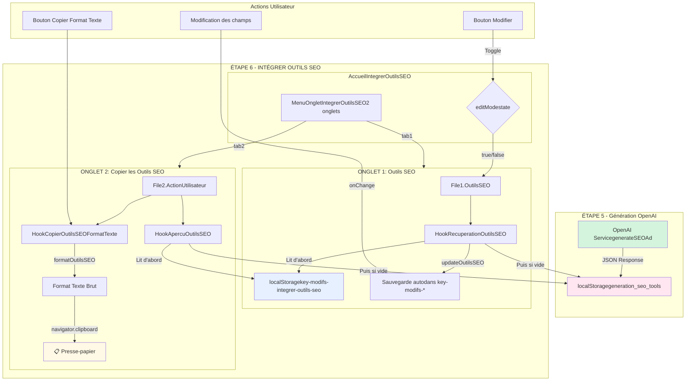

# **AUDIT TECHNIQUE EXHAUSTIF : INTÉGRER OUTILS SEO**

## **01. MISSION DU DOCUMENT**

Ce document présente l'audit technique exhaustif du canal **"Intégrer Outils SEO"** de l'application LeadGenAI. Ce canal permet aux utilisateurs de **récupérer, modifier et copier** les outils SEO générés par OpenAI (Balise Titre, Balise Meta Description, URL Longue Traîne) pour les intégrer directement sur leur site internet.

**Objectifs de l'audit:**
- Cartographier l'architecture complète du canal
- Identifier tous les fichiers, hooks, et composants utilisés
- Documenter le flux de données de bout en bout (OpenAI → localStorage → Interface)
- Détailler les options de copie et le système d'édition
- Fournir une base technique pour la migration ou l'évolution du système

---

## **02. SOMMAIRE CLIQUABLE**

1. [MISSION DU DOCUMENT](#01-mission-du-document)
2. [SOMMAIRE CLIQUABLE](#02-sommaire-cliquable)
3. [ARCHITECTURE GLOBALE - CANAL "INTÉGRER OUTILS SEO"](#03-architecture-globale---canal-intégrer-outils-seo)
   - 3.1. [Vue d'ensemble du canal](#31-vue-densemble-du-canal)
   - 3.2. [Position dans Étape 6 Communication](#32-position-dans-étape-6-communication)
   - 3.3. [Schéma Mermaid complet](#33-schéma-mermaid-complet-flux-de-données)
4. [LISTE EXHAUSTIVE DES FICHIERS UTILISÉS](#04-liste-exhaustive-des-fichiers-utilisés)
5. [SYSTÈME D'ONGLETS (2 ONGLETS)](#05-système-donglets-2-onglets)
6. [PROCESSUS DE RÉCUPÉRATION DES DONNÉES OPENAI](#06-processus-de-récupération-des-données-openai)
7. [STRUCTURE DES DONNÉES localStorage](#07-structure-des-données-localstorage)
8. [PROCESSUS COMPLET ÉTAPE PAR ÉTAPE](#08-processus-complet-étape-par-étape)
9. [SYSTÈME D'ÉDITION - BOUTON "MODIFIER"](#09-système-dédition---bouton-modifier)
10. [OPTIONS DE COPIE (1 FONCTION)](#10-options-de-copie-1-fonction)
11. [SYSTÈME D'APERÇU (1 HOOK)](#11-système-daperçu-1-hook)
12. [CONTRAINTES ET VALIDATION](#12-contraintes-et-validation)
13. [COMPOSANTS GRAPHIQUES RÉUTILISABLES](#13-composants-graphiques-réutilisables)
14. [TABLEAUX RÉCAPITULATIFS](#14-tableaux-récapitulatifs)
15. [DONNÉES À PRENDRE EN CONSIDÉRATION](#15-données-à-prendre-en-considération)

---

## **03. ARCHITECTURE GLOBALE - CANAL "INTÉGRER OUTILS SEO"**

### **3.1. Vue d'ensemble du canal**

Le canal "Intégrer Outils SEO" permet de :
- **Récupérer** les 3 outils SEO générés par OpenAI (Balise Titre, Meta Description, URL Longue Traîne)
- **Visualiser** les outils en mode lecture seule
- **Modifier** les outils via un mode édition
- **Copier** les outils au format texte brut
- **Sauvegarder** automatiquement les modifications

**Caractéristiques:**
- 2 onglets (Outils SEO + Copier les Outils SEO)
- 3 champs éditables (baliseTitre, baliseMetaDescription, urlLongueTraine)
- 1 option de copie (Format Texte uniquement)
- Sauvegarde automatique en localStorage lors de modifications

### **3.2. Position dans Étape 6 Communication**

Le canal "Intégrer Outils SEO" est accessible depuis :
- **Navigation principale**: Étape 6 Communication → "Intégrer Outils SEO"
- **Route**: `/etape6communication` (composant conditionnel)
- **Composant racine**: `AccueilIntegrerOutilsSEO.tsx`

**Position par rapport aux autres canaux:**
- Canal #2 sur 8 dans l'Étape 6 Communication
- Suit le canal "Copier Annonce Site Internet"
- Précède le canal "Rédiger Newsletter"

### **3.3. Schéma Mermaid complet (flux de données)**



---

## **04. LISTE EXHAUSTIVE DES FICHIERS UTILISÉS**

### **4.1. Fichiers de composition (4 fichiers)**

| # | Fichier | Rôle | Lignes |
|---|---------|------|--------|
| 1 | `AccueilIntegrerOutilsSEO.tsx` | **Composant racine** du canal - Orchestre les 2 onglets | 60 |
| 2 | `MenuOngletIntegrerOutilsSEO.tsx` | **Système d'onglets** - Gère navigation + bouton Modifier | 135 |
| 3 | `File1.OutilsSEO.tsx` | **Onglet 1** - Affichage et édition des 3 outils SEO | 95 |
| 4 | `File2.ActionUtilisateur.tsx` | **Onglet 2** - Options de copie + aperçus | 81 |

### **4.2. Hooks de récupération (1 fichier)**

| # | Fichier | Rôle | Lignes |
|---|---------|------|--------|
| 5 | `HookRecuperationOutilsSEO.ts` | **Récupération + sauvegarde** des données OpenAI avec logique de priorité | 76 |

### **4.3. Hooks d'aperçu (1 fichier)**

| # | Fichier | Rôle | Lignes |
|---|---------|------|--------|
| 6 | `HookApercusOutilsSEO.tsx` | **Aperçu** des outils SEO avant copie | 59 |

### **4.4. Hooks de copie (1 fichier)**

| # | Fichier | Rôle | Lignes |
|---|---------|------|--------|
| 7 | `HookCopierOutilsSEOFormatTexte.tsx` | **Copie Format Texte** des 3 outils SEO | 63 |

### **4.5. Composants graphiques (1 fichier)**

| # | Fichier | Rôle | Lignes |
|---|---------|------|--------|
| 8 | `GraphismeInterieurIntegrerOutilsSEO.tsx` | **Composants UI réutilisables** (LabelField, ReadOnlyField, EditableField, CopyOption, etc.) | 189 |

### **4.6. Arborescence complète avec descriptions**

```
src/components/1-Sources-Restitution-Utilisateur/2.EtapeIntegrerOutilsSEO/
│
├── AccueilIntegrerOutilsSEO.tsx
│   └── Composant racine
│       - Gère les états editMode et données
│       - Orchestre MenuOnglet + 2 onglets
│       - Props: aucune (composant autonome)
│
├── MenuOngletIntegrerOutilsSEO.tsx
│   └── Système d'onglets
│       - 2 onglets: "Outils SEO" + "Copier les Outils SEO"
│       - Bouton Modifier/Sauvegarder (Onglet 1 uniquement)
│       - Propagation de editMode via onEditModeChange
│
├── File1.OutilsSEO.tsx
│   └── Onglet 1: Affichage des 3 outils SEO
│       - Utilise HookRecuperationOutilsSEO
│       - Affichage conditionnel (ReadOnly/Editable)
│       - 3 champs: baliseTitre, baliseMetaDescription, urlLongueTraine
│
├── File2.ActionUtilisateur.tsx
│   └── Onglet 2: Options de copie
│       - 1 option: "Copier Format Texte"
│       - Aperçus des 3 outils SEO
│       - Utilise HookApercuOutilsSEO + HookCopierOutilsSEOFormatTexte
│
├── HookRecuperationOutilsSEO.ts
│   └── Hook de récupération
│       - Lit key-modifs-integrer-outils-seo (priorité 1)
│       - Puis generation_seo_tools (priorité 2)
│       - Fonction updateOutilsSEO pour sauvegarder
│
├── HookApercusOutilsSEO.tsx
│   └── Hook d'aperçu
│       - Même logique de priorité que HookRecuperationOutilsSEO
│       - Retourne outilsSEOApercu, isLoading, error
│
├── HookCopierOutilsSEOFormatTexte.tsx
│   └── Hook de copie
│       - formatOutilsSEO(): Formate en texte brut
│       - copierOutilsSEOFormatTexte(): Copie dans le presse-papier
│
└── GraphismeInterieurIntegrerOutilsSEO.tsx
    └── Composants graphiques
        - LabelField: Libellé de champ
        - ReadOnlyField: Champ lecture seule
        - EditableField: Textarea éditable
        - CopyOption: Carte d'option de copie
        - CopyOptionsContainer: Conteneur grid
        - OutilSEOPreview: Cadre d'aperçu
        - OutilSEOField: Champ outil SEO unifié
```

---

## **05. SYSTÈME D'ONGLETS (2 ONGLETS)**

### **5.1. MenuOngletIntegrerOutilsSEO (orchestrateur)**

**Fichier:** `MenuOngletIntegrerOutilsSEO.tsx` (135 lignes)

**Rôle:**
- Système d'onglets principal (2 onglets)
- Gestion du bouton "Modifier/Sauvegarder"
- Propagation de l'état `editMode`

**Props:**
```typescript
interface MenuOngletIntegrerOutilsSEOProps {
  tabTitles?: string[];                  // Titres des onglets
  tabContent1?: ReactNode;                // Contenu Onglet 1
  tabContent2?: ReactNode;                // Contenu Onglet 2
  enableEditMode?: boolean;               // Active le bouton Modifier
  onTabChange?: (tabValue: string) => void;
  onEditModeChange?: (isEditMode: boolean) => void;
  className?: string;
}
```

**États internes:**
```typescript
const [activeTab, setActiveTab] = useState("tab1");
const [editMode, setEditMode] = useState(false);
```

**Logique clé:**
- **Changement d'onglet** (ligne 45-54): Si `editMode = true`, désactive automatiquement le mode édition
- **Toggle mode édition** (ligne 57-72): Affiche un toast "Modifications sauvegardées" lors de la désactivation
- **Bouton Modifier** (ligne 96-116): Affiché uniquement dans Onglet 1, icône change selon l'état (Edit ↔ Save)

**Titres par défaut:**
```typescript
tabTitles = ["Outils SEO", "Copier les Outils SEO"]
```

### **5.2. Onglet 1 : Outils SEO (File1)**

**Fichier:** `File1.OutilsSEO.tsx` (95 lignes)

**Rôle:**
- Affiche les 3 outils SEO (Balise Titre, Meta Description, URL Longue Traîne)
- Mode lecture seule OU mode édition selon `editMode`
- Sauvegarde automatique lors de modifications

**Props:**
```typescript
interface OutilsSEOProps {
  editMode?: boolean;
  onDataChange?: (data: any) => void;
}
```

**Hook utilisé:**
```typescript
const { outilsSEO, updateOutilsSEO, isLoading, error } = useRecuperationOutilsSEO();
```

**Fonction de mise à jour (ligne 18-29):**
```typescript
const handleChange = (name: string, value: string) => {
  const updatedData = { [name]: value };
  updateOutilsSEO(updatedData);  // Sauvegarde automatique dans localStorage

  if (onDataChange) {
    onDataChange({ ...outilsSEO, ...updatedData });
  }
};
```

**Structure d'affichage (3 champs):**
1. **Balise Titre** (ligne 44-57)
2. **Balise Meta Description** (ligne 60-73)
3. **URL Longue Traîne** (ligne 76-89)

**Affichage conditionnel:**
```typescript
{editMode ? (
   handleChange("baliseTitre", value)}
    rows={2}
  />
) : (

)}
```

### **5.3. Onglet 2 : Copier les Outils SEO (File2)**

**Fichier:** `File2.ActionUtilisateur.tsx` (81 lignes)

**Rôle:**
- Affiche 1 option de copie (Format Texte)
- Affiche 3 aperçus des outils SEO
- Gère les états de chargement et erreurs

**Hooks utilisés:**
```typescript
const { outilsSEOApercu, isLoading, error } = useApercuOutilsSEO();
const { copierOutilsSEOFormatTexte, isCopying } = useCopierOutilsSEOFormatTexte();
```

**Structure d'affichage:**

**1. Section "Options de copie" (ligne 20-35):**
```typescript

  }
  />

```

**2. Section "Aperçu" (ligne 38-76):**
- **Aperçu Balise Titre** (ligne 41-47)
- **Aperçu Balise Meta Description** (ligne 50-56)
- **Aperçu URL Longue Traîne** (ligne 59-65)

**Gestion des états:**
- **Loading** (ligne 68-70): Affiche "Chargement des aperçus..."
- **Error** (ligne 72-74): Affiche message d'erreur en rouge

### **5.4. Onglet 3 : (N'existe pas)**

Le canal "Intégrer Outils SEO" ne possède que **2 onglets** (contrairement à d'autres canaux qui en ont 3).

### **5.5. Logique de navigation et état**

**Flux de navigation:**
```
Chargement initial → Onglet 1 (tab1) activé par défaut
                    → editMode = false
                    → Affichage en ReadOnlyField

Clic "Modifier"    → editMode = true
                    → Passage en EditableField
                    → Modifications sauvegardées automatiquement

Clic "Sauvegarder" → editMode = false
                    → Toast "Modifications sauvegardées"
                    → Retour en ReadOnlyField

Changement onglet  → Si editMode = true, désactivation automatique
                    → Navigation vers tab2
```

**États propagés:**
```
AccueilIntegrerOutilsSEO
  └── editMode (state local)
      └── onEditModeChange
          └── MenuOngletIntegrerOutilsSEO
              └── editMode (state local)
                  └── editMode (prop)
                      └── File1.OutilsSEO
```

---

## **06. PROCESSUS DE RÉCUPÉRATION DES DONNÉES OPENAI**

### **6.1. Sources de données (1 clé localStorage)**

| Clé localStorage | Type | Source | Contenu |
|------------------|------|--------|---------|
| `generation_seo_tools` | **Lecture** | OpenAI Service (Étape 5) | JSON avec 3 champs SEO générés |

**Clé de lecture:**
```typescript
// Clé PRINCIPALE (données générées par OpenAI)
'generation_seo_tools'
```

**Structure JSON originale OpenAI:**
```json
{
  "baliseTitre": "Bureau 120m² Paris 8ème • Haussmannien rénové",
  "baliseMetaDescription": "À louer bureau 120m² Paris 8ème quartier Haussmann. Immeuble de standing, rénové, proche Champs-Élysées. Loyer 8000€/mois. Contactez-nous.",
  "urlLongueTraine": "bureau-120m2-paris-8eme-haussmannien-renove-louer"
}
```

### **6.2. Logique de priorité (modifs > originales)**

Le système utilise une **double clé** de localStorage avec priorité :

**Priorité 1 (HAUTE):** `key-modifs-integrer-outils-seo` (données modifiées par l'utilisateur)
**Priorité 2 (BASSE):** `generation_seo_tools` (données originales OpenAI)

**Logique dans `HookRecuperationOutilsSEO.ts` (ligne 16-50):**
```typescript
useEffect(() => {
  try {
    setIsLoading(true);

    // 1️⃣ PRIORITÉ 1: Vérifier si données modifiées existent
    const modifiedDataJson = localStorage.getItem('key-modifs-integrer-outils-seo');

    if (modifiedDataJson) {
      // ✅ Utiliser les données modifiées
      const modifiedData = JSON.parse(modifiedDataJson);
      setOutilsSEO({
        baliseTitre: modifiedData.baliseTitre || '',
        baliseMetaDescription: modifiedData.baliseMetaDescription || '',
        urlLongueTraine: modifiedData.urlLongueTraine || ''
      });
    } else {
      // 2️⃣ PRIORITÉ 2: Sinon, récupérer les données originales
      const outilsSEOData = localStorage.getItem('generation_seo_tools');

      if (outilsSEOData) {
        const parsedData = JSON.parse(outilsSEOData);
        setOutilsSEO({
          baliseTitre: parsedData.baliseTitre || '',
          baliseMetaDescription: parsedData.baliseMetaDescription || '',
          urlLongueTraine: parsedData.urlLongueTraine || ''
        });
      } else {
        console.log('Aucune donnée d\'outils SEO trouvée');
      }
    }

    setIsLoading(false);
  } catch (err) {
    console.error('Erreur lors de la récupération des données:', err);
    setError('Erreur lors de la récupération des données');
    setIsLoading(false);
  }
}, []);
```

### **6.3. Hooks de récupération détaillés**

**Hook principal:** `HookRecuperationOutilsSEO.ts`

**Interface TypeScript (ligne 3-7):**
```typescript
interface OutilsSEOData {
  baliseTitre: string;
  baliseMetaDescription: string;
  urlLongueTraine: string;
}
```

**États gérés (ligne 9-14):**
```typescript
const [outilsSEO, setOutilsSEO] = useState({
  baliseTitre: '',
  baliseMetaDescription: '',
  urlLongueTraine: ''
});
const [isLoading, setIsLoading] = useState(true);
const [error, setError] = useState(null);
```

**Fonction de mise à jour (ligne 52-65):**
```typescript
const updateOutilsSEO = (newData: Partial) => {
  const updatedData = { ...outilsSEO, ...newData };
  setOutilsSEO(updatedData);

  try {
    // ✅ Sauvegarde automatique dans la clé de modifications
    localStorage.setItem('key-modifs-integrer-outils-seo', JSON.stringify(updatedData));
  } catch (err) {
    console.error('Erreur lors de la sauvegarde des données:', err);
    setError('Erreur lors de la sauvegarde des données');
  }
};
```

**Retour du hook (ligne 67-76):**
```typescript
return { 
  outilsSEO,        // Données actuelles
  updateOutilsSEO,  // Fonction de mise à jour
  isLoading,        // État de chargement
  error             // Message d'erreur
};
```

### **6.4. Mapping des champs OpenAI → Interface**

| Champ OpenAI | Interface TypeScript | Affichage UI |
|--------------|----------------------|--------------|
| `baliseTitre` | `baliseTitre: string` | "Balise Titre" |
| `baliseMetaDescription` | `baliseMetaDescription: string` | "Balise Meta Description" |
| `urlLongueTraine` | `urlLongueTraine: string` | "URL Longue Traîne" |

**✅ Mapping 1:1 cohérent** (pas de transformation nécessaire contrairement au canal "Copier Annonce Site Internet" qui a un mapping `cta` → `appelAction`)

---

## **07. STRUCTURE DES DONNÉES localStorage**

### **7.1. Clés LUES (1 clé generation_*)**

| Clé | Type | Source | Contenu |
|-----|------|--------|---------|
| `generation_seo_tools` | **JSON** | OpenAI Service (Étape 5) | 3 champs SEO générés |

**Structure complète:**
```json
{
  "baliseTitre": "string",
  "baliseMetaDescription": "string",
  "urlLongueTraine": "string"
}
```

**Exemple réel:**
```json
{
  "baliseTitre": "Bureau 120m² Paris 8ème • Haussmannien rénové",
  "baliseMetaDescription": "À louer bureau 120m² Paris 8ème quartier Haussmann. Immeuble de standing, rénové, proche Champs-Élysées. Loyer 8000€/mois. Contactez-nous.",
  "urlLongueTraine": "bureau-120m2-paris-8eme-haussmannien-renove-louer"
}
```

### **7.2. Clés ÉCRITES (1 clé key-modifs-*)**

| Clé | Type | Trigger | Contenu |
|-----|------|---------|---------|
| `key-modifs-integrer-outils-seo` | **JSON** | Modification utilisateur via `updateOutilsSEO()` | 3 champs SEO modifiés |

**Structure identique à `generation_seo_tools`:**
```json
{
  "baliseTitre": "string",
  "baliseMetaDescription": "string",
  "urlLongueTraine": "string"
}
```

**Trigger de sauvegarde:**
```typescript
// Dans File1.OutilsSEO.tsx (ligne 18-29)
const handleChange = (name: string, value: string) => {
  const updatedData = { [name]: value };
  updateOutilsSEO(updatedData);  // ✅ Sauvegarde immédiate
};
```

### **7.3. Interfaces TypeScript complètes**

**Interface principale (HookRecuperationOutilsSEO.ts, ligne 3-7):**
```typescript
interface OutilsSEOData {
  baliseTitre: string;
  baliseMetaDescription: string;
  urlLongueTraine: string;
}
```

**Utilisation dans les hooks:**
```typescript
// HookRecuperationOutilsSEO.ts
const [outilsSEO, setOutilsSEO] = useState({...});

// HookApercusOutilsSEO.tsx (ligne 3-7)
interface OutilsSEOData {
  baliseTitre: string;
  baliseMetaDescription: string;
  urlLongueTraine: string;
}
```

### **7.4. Tableaux récapitulatifs**

**Tableau 1: Clés localStorage et leur utilisation**

| Clé | Type | Lecture | Écriture | Hooks concernés |
|-----|------|---------|----------|-----------------|
| `generation_seo_tools` | JSON (3 champs) | ✅ | ❌ | `HookRecuperationOutilsSEO`, `HookApercuOutilsSEO` |
| `key-modifs-integrer-outils-seo` | JSON (3 champs) | ✅ | ✅ | `HookRecuperationOutilsSEO`, `HookApercuOutilsSEO` |

**Tableau 2: Champs et leurs caractéristiques**

| Champ | Type | Éditable | Longueur estimée | Contraintes |
|-------|------|----------|------------------|-------------|
| `baliseTitre` | string | ✅ | ~60 caractères | Balise SEO Title (idéalement 50-60 car.) |
| `baliseMetaDescription` | string | ✅ | ~155 caractères | Meta Description (idéalement 150-160 car.) |
| `urlLongueTraine` | string | ✅ | ~50 caractères | URL slug (kebab-case, sans espaces) |

---

## **08. PROCESSUS COMPLET ÉTAPE PAR ÉTAPE**

### **8.1. Chargement initial (useEffect)**

**1️⃣ Montage du composant `AccueilIntegrerOutilsSEO`**
```typescript
// AccueilIntegrerOutilsSEO.tsx (ligne 45-56)
 setEditMode(isEditMode)}
/>
```

**2️⃣ Montage de `File1.OutilsSEO` (Onglet 1)**
```typescript
// File1.OutilsSEO.tsx (ligne 18)
const { outilsSEO, updateOutilsSEO, isLoading, error } = useRecuperationOutilsSEO();
```

**3️⃣ Exécution du `useEffect` dans `HookRecuperationOutilsSEO`**
```typescript
// HookRecuperationOutilsSEO.ts (ligne 16-50)
useEffect(() => {
  setIsLoading(true);

  // ✅ Priorité 1: Données modifiées
  const modifiedDataJson = localStorage.getItem('key-modifs-integrer-outils-seo');
  if (modifiedDataJson) {
    const modifiedData = JSON.parse(modifiedDataJson);
    setOutilsSEO({ ...modifiedData });
  } else {
    // ✅ Priorité 2: Données originales OpenAI
    const outilsSEOData = localStorage.getItem('generation_seo_tools');
    if (outilsSEOData) {
      const parsedData = JSON.parse(outilsSEOData);
      setOutilsSEO({ ...parsedData });
    }
  }

  setIsLoading(false);
}, []);
```

### **8.2. Affichage en mode lecture seule**

**État initial:** `editMode = false`

**Rendu dans `File1.OutilsSEO` (ligne 44-89):**
```typescript
{!editMode && (

)}
```

**Composant `ReadOnlyField` (GraphismeInterieurIntegrerOutilsSEO.tsx, ligne 32-45):**
```typescript
export const ReadOnlyField: React.FC = ({ 
  id, 
  content,
  className
}) => {
  return (

      {content}

  );
};
```

### **8.3. Activation du mode édition**

**Clic sur le bouton "Modifier" (MenuOngletIntegrerOutilsSEO.tsx, ligne 99-115):**
```typescript

  {editMode ? (
    <>Sauvegarder
  ) : (
    <>Modifier
  )}

```

**Fonction `toggleEditMode` (ligne 57-72):**
```typescript
const toggleEditMode = () => {
  const newEditMode = !editMode;
  setEditMode(newEditMode);

  if (!newEditMode) {
    // ✅ Toast de confirmation
    toast({
      title: "Modifications sauvegardées",
      description: "Les changements ont été enregistrés avec succès."
    });
  }

  if (onEditModeChange) {
    onEditModeChange(newEditMode);  // ✅ Propagation vers File1
  }
};
```

**Propagation vers `File1.OutilsSEO`:**
```
MenuOngletIntegrerOutilsSEO
  └── onEditModeChange(true)
      └── AccueilIntegrerOutilsSEO
          └── setEditMode(true)
              └── File1.OutilsSEO (editMode prop = true)
```

### **8.4. Modification des champs**

**Rendu en mode édition (File1.OutilsSEO.tsx, ligne 48-55):**
```typescript
{editMode && (
   handleChange("baliseTitre", value)}
    rows={2}
  />
)}
```

**Composant `EditableField` (GraphismeInterieurIntegrerOutilsSEO.tsx, ligne 56-72):**
```typescript
export const EditableField: React.FC = ({ 
  id, 
  value, 
  onChange, 
  rows = 3
}) => {
  return (
     onChange(e.target.value)} 
      className="w-full rounded-md border border-gray-200 p-3"
      rows={rows}
    />
  );
};
```

**Événement `onChange` déclenché:**
```typescript
onChange(e.target.value) 
  → handleChange("baliseTitre", nouvelleValeur)
```

### **8.5. Sauvegarde automatique**

**Fonction `handleChange` (File1.OutilsSEO.tsx, ligne 18-29):**
```typescript
const handleChange = (name: string, value: string) => {
  const updatedData = { [name]: value };
  updateOutilsSEO(updatedData);  // ✅ Sauvegarde immédiate

  // Notification au composant parent (optionnel)
  if (onDataChange) {
    onDataChange({ ...outilsSEO, ...updatedData });
  }
};
```

**Fonction `updateOutilsSEO` (HookRecuperationOutilsSEO.ts, ligne 52-65):**
```typescript
const updateOutilsSEO = (newData: Partial<OutilsSEOData>) => {
  const updatedData = { ...outilsSEO, ...newData };
  setOutilsSEO(updatedData);  // ✅ Mise à jour du state React

  try {
    // ✅ Sauvegarde dans localStorage
    localStorage.setItem('key-modifs-integrer-outils-seo', JSON.stringify(updatedData));
  } catch (err) {
    console.error('Erreur lors de la sauvegarde:', err);
    setError('Erreur lors de la sauvegarde des données');
  }
};
```

**Résultat:**
- ✅ State React mis à jour (affichage immédiat)
- ✅ localStorage `key-modifs-integrer-outils-seo` mis à jour
- ✅ Pas de toast (sauvegarde silencieuse)

### **8.6. Copie au format Texte**

**Navigation vers Onglet 2:**
```typescript
// MenuOngletIntegrerOutilsSEO.tsx (ligne 45-54)
const handleTabChange = (value: string) => {
  setActiveTab(value);
  if (editMode) {
    toggleEditMode();  // ✅ Désactivation automatique du mode édition
  }
};
```

**Clic sur "Copier les Outils SEO" (File2.ActionUtilisateur.tsx, ligne 25-31):**
```typescript
<CopyOption
  title="Format Texte"
  description="Copie les 3 outils SEO au format texte brut"
  buttonText="Copier les Outils SEO"
  onClick={copierOutilsSEOFormatTexte}
/>
```

**Fonction `copierOutilsSEOFormatTexte` (HookCopierOutilsSEOFormatTexte.tsx, ligne 26-53):**
```typescript
const copierOutilsSEOFormatTexte = async () => {
  try {
    setIsCopying(true);
    const texteToCopy = formatOutilsSEO();  // ✅ Formatage

    await navigator.clipboard.writeText(texteToCopy);  // ✅ Copie

    toast({
      title: "Copie réussie",
      description: "Les outils SEO ont été copiés avec succès."
    });

    setIsCopying(false);
  } catch (err) {
    toast({
      title: "Erreur de copie",
      description: "Impossible de copier les outils SEO.",
      variant: "destructive"
    });
    setIsCopying(false);
  }
};
```

**Fonction `formatOutilsSEO` (ligne 11-24):**
```typescript
const formatOutilsSEO = (): string => {
  let formattedText = '';

  formattedText += 'Balise Titre\n';
  formattedText += outilsSEOApercu.baliseTitre + '\n\n';

  formattedText += 'Balise Meta description\n';
  formattedText += outilsSEOApercu.baliseMetaDescription + '\n\n';

  formattedText += 'URL longue traîne\n';
  formattedText += outilsSEOApercu.urlLongueTraine;

  return formattedText;
};
```

**Résultat copié dans le presse-papier:**
```
Balise Titre
Bureau 120m² Paris 8ème • Haussmannien rénové

Balise Meta description
À louer bureau 120m² Paris 8ème quartier Haussmann. Immeuble de standing, rénové, proche Champs-Élysées. Loyer 8000€/mois. Contactez-nous.

URL longue traîne
bureau-120m2-paris-8eme-haussmannien-renove-louer
```

---

## **09. SYSTÈME D'ÉDITION - BOUTON "MODIFIER"**

### **9.1. Localisation (MenuOngletIntegrerOutilsSEO)**

**Fichier:** `MenuOngletIntegrerOutilsSEO.tsx` (ligne 96-116)

**Position:** Dans le header de l'Onglet 1 uniquement

**Code:**
```typescript
{enableEditMode && (
  <div className="flex justify-between mb-4">
    <h3 className="text-lg font-semibold text-realestate-purple-dark"></h3>
    <Button 
      onClick={toggleEditMode} 
      variant="outline" 
      className="border-realestate-purple text-realestate-purple hover:bg-realestate-purple hover:text-white"
    >
      {editMode ? (
        <>
          <Save className="mr-2 h-4 w-4" />
          Sauvegarder
        </>
      ) : (
        <>
          <Edit className="mr-2 h-4 w-4" />
          Modifier
        </>
      )}
    </Button>
  </div>
)}
```

**Condition d'affichage:**
- ✅ Affiché uniquement si `enableEditMode = true` (prop)
- ✅ Affiché uniquement dans Onglet 1 (`TabsContent value="tab1"`)
- ❌ Pas affiché dans Onglet 2

### **9.2. Comportement toggle (Modifier ↔ Sauvegarder)**

**Fonction `toggleEditMode` (ligne 57-72):**
```typescript
const toggleEditMode = () => {
  const newEditMode = !editMode;
  setEditMode(newEditMode);

  if (!newEditMode) {
    // ✅ Toast affiché uniquement lors de la DÉSACTIVATION
    toast({
      title: "Modifications sauvegardées",
      description: "Les changements ont été enregistrés avec succès."
    });
  }

  if (onEditModeChange) {
    onEditModeChange(newEditMode);
  }
};
```

**États du bouton:**
| État `editMode` | Texte bouton | Icône | Action au clic |
|-----------------|--------------|-------|----------------|
| `false` | "Modifier" | `<Edit />` | Passe à `true` + Propagation |
| `true` | "Sauvegarder" | `<Save />` | Passe à `false` + Toast + Propagation |

### **9.3. Propagation de l'état editMode**

**Flux de propagation:**
```
MenuOngletIntegrerOutilsSEO (state local: editMode)
  └── onEditModeChange(newEditMode)
      └── AccueilIntegrerOutilsSEO (state local: editMode)
          └── setEditMode(newEditMode)
              └── File1.OutilsSEO (prop: editMode)
```

**Code dans AccueilIntegrerOutilsSEO.tsx (ligne 47-54):**
```typescript
<MenuOngletIntegrerOutilsSEO
  enableEditMode={true}
  tabContent1={contentTab1}
  tabContent2={contentTab2}
  onEditModeChange={(isEditMode) => {
    setEditMode(isEditMode);  // ✅ Mise à jour du state local
  }}
/>
```

**Code dans contentTab1 (ligne 29-36):**
```typescript
const contentTab1 = (
  <div className="space-y-6">
    <OutilsSEO 
      editMode={editMode}  // ✅ Prop propagée
      onDataChange={handleOutilsSEODataChange}
    />
  </div>
);
```

### **9.4. Affichage conditionnel (ReadOnlyField vs EditableField)**

**Dans File1.OutilsSEO.tsx (ligne 44-89):**

**Exemple pour Balise Titre (ligne 44-57):**
```typescript
<div>
  <LabelField htmlFor="baliseTitre">Balise Titre</LabelField>
  {editMode ? (
    <EditableField
      id="baliseTitre"
      value={outilsSEO.baliseTitre}
      onChange={(value) => handleChange("baliseTitre", value)}
      rows={2}
    />
  ) : (
    <ReadOnlyField
      id="baliseTitre"
      content={outilsSEO.baliseTitre}
    />
  )}
</div>
```

**Tableau de comparaison:**

| Composant | Type | Balise HTML | Éditable | Événement |
|-----------|------|-------------|----------|-----------|
| `ReadOnlyField` | Affichage | `<div>` | ❌ | Aucun |
| `EditableField` | Édition | `<textarea>` | ✅ | `onChange` |

### **9.5. Nettoyage HTML automatique**

**❌ Pas de nettoyage HTML dans ce canal** (contrairement au canal "Copier Annonce Site Internet")

**Raison:** Les outils SEO sont du texte brut (pas de balises HTML)

**Champs concernés:**
- `baliseTitre`: Texte brut
- `baliseMetaDescription`: Texte brut
- `urlLongueTraine`: Texte brut (slug URL)

### **9.6. Éditeur WYSIWYG (EditeurWYSIWYG.tsx)**

**❌ Pas d'éditeur WYSIWYG dans ce canal**

**Type de champ utilisé:** `<textarea>` simple (composant `EditableField`)

**Raison:** Les outils SEO ne nécessitent pas de formatage HTML

---

## **10. OPTIONS DE COPIE (1 FONCTION)**

### **10.1. FORMAT TEXTE (1 fonction)**

#### **A. Copier les Outils SEO**

**Hook:** `HookCopierOutilsSEOFormatTexte.tsx`
**Fonction:** `copierOutilsSEOFormatTexte()`
**Fichier d'utilisation:** `File2.ActionUtilisateur.tsx` (ligne 25-31)

**Bouton:**
```typescript
<CopyOption
  title="Format Texte"
  description="Copie les 3 outils SEO au format texte brut"
  buttonText="Copier les Outils SEO"
  onClick={copierOutilsSEOFormatTexte}
  icon={<FileText className="h-5 w-5" />}
/>
```

**Fonction de formatage `formatOutilsSEO()` (ligne 11-24):**
```typescript
const formatOutilsSEO = (): string => {
  let formattedText = '';

  // ✅ Section 1: Balise Titre
  formattedText += 'Balise Titre\n';
  formattedText += outilsSEOApercu.baliseTitre + '\n\n';

  // ✅ Section 2: Balise Meta Description
  formattedText += 'Balise Meta description\n';
  formattedText += outilsSEOApercu.baliseMetaDescription + '\n\n';

  // ✅ Section 3: URL Longue Traîne
  formattedText += 'URL longue traîne\n';
  formattedText += outilsSEOApercu.urlLongueTraine;

  return formattedText;
};
```

**Fonction de copie `copierOutilsSEOFormatTexte()` (ligne 26-53):**
```typescript
const copierOutilsSEOFormatTexte = async () => {
  try {
    setIsCopying(true);
    const texteToCopy = formatOutilsSEO();

    // ✅ Copie dans le presse-papier
    await navigator.clipboard.writeText(texteToCopy);

    // ✅ Toast de succès
    toast({
      title: "Copie réussie",
      description: "Les outils SEO ont été copiés avec succès au format texte."
    });

    setIsCopying(false);
  } catch (err) {
    console.error('Erreur lors de la copie des outils SEO:', err);

    // ❌ Toast d'erreur
    toast({
      title: "Erreur de copie",
      description: "Impossible de copier les outils SEO. Veuillez réessayer.",
      variant: "destructive"
    });

    setIsCopying(false);
  }
};
```

**Résultat copié:**
```
Balise Titre
Bureau 120m² Paris 8ème • Haussmannien rénové

Balise Meta description
À louer bureau 120m² Paris 8ème quartier Haussmann. Immeuble de standing, rénové, proche Champs-Élysées. Loyer 8000€/mois. Contactez-nous.

URL longue traîne
bureau-120m2-paris-8eme-haussmannien-renove-louer
```

**États gérés:**
- `isCopying`: Indicateur de copie en cours
- `isLoading`: État de chargement des données
- `error`: Message d'erreur

### **10.2. FORMAT HTML**

**❌ Pas d'option de copie HTML dans ce canal**

**Raison:** Les outils SEO sont du texte brut destiné à être intégré dans le code source HTML d'un site (pas besoin de formatage HTML pour la copie)

### **10.3. Logique de formatage détaillée**

**Structure du texte copié:**

```
[Titre Section 1]\n
[Contenu Section 1]\n\n

[Titre Section 2]\n
[Contenu Section 2]\n\n

[Titre Section 3]\n
[Contenu Section 3]
```

**Détails:**
- ✅ Chaque section a un titre + contenu
- ✅ Séparation par double saut de ligne (`\n\n`)
- ✅ Pas de saut de ligne après la dernière section
- ✅ Format simple et lisible pour copier-coller

---

## **11. SYSTÈME D'APERÇU (1 HOOK)**

### **11.1. Hook Aperçu Outils SEO**

**Fichier:** `HookApercusOutilsSEO.tsx` (59 lignes)

**Interface (ligne 3-7):**
```typescript
interface OutilsSEOData {
  baliseTitre: string;
  baliseMetaDescription: string;
  urlLongueTraine: string;
}
```

**États (ligne 9-14):**
```typescript
const [outilsSEOApercu, setOutilsSEOApercu] = useState<OutilsSEOData>({
  baliseTitre: '',
  baliseMetaDescription: '',
  urlLongueTraine: ''
});
const [isLoading, setIsLoading] = useState<boolean>(true);
const [error, setError] = useState<string | null>(null);
```

**Logique de récupération (ligne 16-51):**
```typescript
useEffect(() => {
  try {
    setIsLoading(true);

    // ✅ PRIORITÉ 1: Données modifiées
    const modifiedDataJson = localStorage.getItem('key-modifs-integrer-outils-seo');

    if (modifiedDataJson) {
      const modifiedData = JSON.parse(modifiedDataJson);
      setOutilsSEOApercu({
        baliseTitre: modifiedData.baliseTitre || '',
        baliseMetaDescription: modifiedData.baliseMetaDescription || '',
        urlLongueTraine: modifiedData.urlLongueTraine || ''
      });
    } else {
      // ✅ PRIORITÉ 2: Données originales OpenAI
      const outilsSEOData = localStorage.getItem('generation_seo_tools');

      if (outilsSEOData) {
        const parsedData = JSON.parse(outilsSEOData);
        setOutilsSEOApercu({
          baliseTitre: parsedData.baliseTitre || '',
          baliseMetaDescription: parsedData.baliseMetaDescription || '',
          urlLongueTraine: parsedData.urlLongueTraine || ''
        });
      } else {
        console.log('Aucune donnée d\'outils SEO trouvée');
      }
    }

    setIsLoading(false);
  } catch (err) {
    console.error('Erreur lors de la récupération:', err);
    setError('Erreur lors de la récupération des données');
    setIsLoading(false);
  }
}, []);
```

**Retour du hook (ligne 53-59):**
```typescript
return {
  outilsSEOApercu,
  isLoading,
  error
};
```

**Utilisation dans File2.ActionUtilisateur.tsx (ligne 14):**
```typescript
const { outilsSEOApercu, isLoading, error } = useApercuOutilsSEO();
```

### **11.2. Affichage des aperçus**

**Dans File2.ActionUtilisateur.tsx (ligne 38-76):**

**Aperçu Balise Titre (ligne 41-47):**
```typescript
<OutilSEOPreview title="Aperçu Balise Titre">
  <ReadOnlyField 
    id="apercu-baliseTitre" 
    content={outilsSEOApercu.baliseTitre}
  />
</OutilSEOPreview>
```

**Aperçu Balise Meta Description (ligne 50-56):**
```typescript
<OutilSEOPreview title="Aperçu Balise Meta description">
  <ReadOnlyField 
    id="apercu-baliseMetaDescription" 
    content={outilsSEOApercu.baliseMetaDescription}
  />
</OutilSEOPreview>
```

**Aperçu URL Longue Traîne (ligne 59-65):**
```typescript
<OutilSEOPreview title="Aperçu URL longue traîne">
  <ReadOnlyField 
    id="apercu-urlLongueTraine" 
    content={outilsSEOApercu.urlLongueTraine}
  />
</OutilSEOPreview>
```

### **11.3. Gestion des états (loading, error)**

**État Loading (ligne 68-70):**
```typescript
{isLoading && (
  <div className="text-center py-4">Chargement des aperçus...</div>
)}
```

**État Error (ligne 72-74):**
```typescript
{error && (
  <div className="text-center py-4 text-red-500">{error}</div>
)}
```

---

## **12. CONTRAINTES ET VALIDATION**

### **12.1. Validation des champs (nettoyage HTML)**

**❌ Pas de validation ou nettoyage HTML dans ce canal**

**Raison:** Les outils SEO sont du texte brut

**Différence avec d'autres canaux:**
- Canal "Copier Annonce Site Internet": Utilise `stripHtmlTags()` pour nettoyer le HTML
- Canal "Intégrer Outils SEO": Pas de nettoyage (texte brut uniquement)

### **12.2. Gestion des erreurs (loading, error)**

**États gérés dans les hooks:**
```typescript
const [isLoading, setIsLoading] = useState<boolean>(true);
const [error, setError] = useState<string | null>(null);
```

**Affichage dans File1.OutilsSEO.tsx (ligne 35-41):**
```typescript
if (isLoading) {
  return <div className="text-center py-4">Chargement des données...</div>;
}

if (error) {
  return <div className="text-center py-4 text-red-500">{error}</div>;
}
```

**Affichage dans File2.ActionUtilisateur.tsx (ligne 68-74):**
```typescript
{isLoading && (
  <div className="text-center py-4">Chargement des aperçus...</div>
)}

{error && (
  <div className="text-center py-4 text-red-500">{error}</div>
)}
```

### **12.3. Toasts de notification**

**Toast de succès (sauvegarde):**
```typescript
// MenuOngletIntegrerOutilsSEO.tsx (ligne 63-66)
toast({
  title: "Modifications sauvegardées",
  description: "Les changements ont été enregistrés avec succès."
});
```

**Toast de succès (copie):**
```typescript
// HookCopierOutilsSEOFormatTexte.tsx (ligne 34-37)
toast({
  title: "Copie réussie",
  description: "Les outils SEO ont été copiés avec succès au format texte."
});
```

**Toast d'erreur (copie):**
```typescript
// HookCopierOutilsSEOFormatTexte.tsx (ligne 43-47)
toast({
  title: "Erreur de copie",
  description: "Impossible de copier les outils SEO. Veuillez réessayer.",
  variant: "destructive"
});
```

### **12.4. Sécurité**

**❌ Pas d'utilisation de `dangerouslySetInnerHTML`** (contrairement au canal "Copier Annonce Site Internet")

**Raison:** Affichage de texte brut uniquement (pas de HTML)

**Méthode d'affichage:**
```typescript
<div className="whitespace-pre-line">{content}</div>
```

**Sécurité:**
- ✅ Pas d'injection XSS possible (texte brut)
- ✅ React échappe automatiquement le contenu

---

## **13. COMPOSANTS GRAPHIQUES RÉUTILISABLES**

**Fichier:** `GraphismeInterieurIntegrerOutilsSEO.tsx` (189 lignes)

### **13.1. LabelField**

**Lignes:** 14-23

**Usage:** Libellé de champ

**Props:**
```typescript
interface LabelFieldProps {
  htmlFor: string;
  children: ReactNode;
  className?: string;
}
```

**Exemple:**
```typescript
<LabelField htmlFor="baliseTitre">Balise Titre</LabelField>
```

### **13.2. ReadOnlyField**

**Lignes:** 32-45

**Usage:** Champ en lecture seule

**Props:**
```typescript
interface ReadOnlyFieldProps {
  id: string;
  content: string;
  className?: string;
}
```

**Exemple:**
```typescript
<ReadOnlyField 
  id="baliseTitre" 
  content={outilsSEO.baliseTitre}
/>
```

### **13.3. EditableField**

**Lignes:** 56-72

**Usage:** Textarea éditable

**Props:**
```typescript
interface EditableFieldProps {
  id: string;
  value: string;
  onChange: (value: string) => void;
  rows?: number;
  className?: string;
}
```

**Exemple:**
```typescript
<EditableField
  id="baliseTitre"
  value={outilsSEO.baliseTitre}
  onChange={(value) => handleChange("baliseTitre", value)}
  rows={2}
/>
```

### **13.4. CopyOption**

**Lignes:** 85-114

**Usage:** Carte d'option de copie

**Props:**
```typescript
interface CopyOptionProps {
  title: string;
  description: string;
  buttonText: string;
  onClick: () => void;
  className?: string;
  icon?: React.ReactNode;
  buttonIcon?: React.ReactNode;
}
```

**Exemple:**
```typescript
<CopyOption
  title="Format Texte"
  description="Copie les 3 outils SEO au format texte brut"
  buttonText="Copier les Outils SEO"
  onClick={copierOutilsSEOFormatTexte}
  icon={<FileText className="h-5 w-5" />}
/>
```

### **13.5. CopyOptionsContainer**

**Lignes:** 122-128

**Usage:** Conteneur grid pour options de copie

**Props:**
```typescript
interface CopyOptionsContainerProps {
  children: ReactNode;
  className?: string;
}
```

**Exemple:**
```typescript
<CopyOptionsContainer>
  <CopyOption {...} />
</CopyOptionsContainer>
```

### **13.6. OutilSEOPreview**

**Lignes:** 137-150

**Usage:** Cadre d'aperçu pour les outils SEO

**Props:**
```typescript
interface OutilSEOPreviewProps {
  title: string;
  className?: string;
  children?: ReactNode;
}
```

**Exemple:**
```typescript
<OutilSEOPreview title="Aperçu Balise Titre">
  <ReadOnlyField id="apercu-baliseTitre" content={...} />
</OutilSEOPreview>
```

### **13.7. OutilSEOField**

**Lignes:** 162-189

**Usage:** Champ outil SEO unifié (lecture seule OU éditable)

**Props:**
```typescript
interface OutilSEOFieldProps {
  id: string;
  label: string;
  value: string;
  onChange?: (value: string) => void;
  editMode?: boolean;
  className?: string;
}
```

**Exemple:**
```typescript
<OutilSEOField
  id="baliseTitre"
  label="Balise Titre"
  value={outilsSEO.baliseTitre}
  onChange={(value) => handleChange("baliseTitre", value)}
  editMode={editMode}
/>
```

**⚠️ Note:** Ce composant n'est actuellement **pas utilisé** dans les fichiers du canal (préférence pour l'utilisation directe de `LabelField` + `ReadOnlyField/EditableField`)

---

## **14. TABLEAUX RÉCAPITULATIFS**

### **14.1. Tableau des champs (Outils SEO - 3 champs)**

| Champ | Nom Affiché | Type | Éditable | Source OpenAI | Longueur estimée |
|-------|-------------|------|----------|---------------|------------------|
| `baliseTitre` | "Balise Titre" | string | ✅ | `baliseTitre` | ~60 caractères |
| `baliseMetaDescription` | "Balise Meta Description" | string | ✅ | `baliseMetaDescription` | ~155 caractères |
| `urlLongueTraine` | "URL Longue Traîne" | string | ✅ | `urlLongueTraine` | ~50 caractères |

### **14.2. Tableau des hooks (3 hooks au total)**

| Hook | Fichier | Rôle | Retour |
|------|---------|------|--------|
| `useRecuperationOutilsSEO` | HookRecuperationOutilsSEO.ts | Récupération + sauvegarde | `{outilsSEO, updateOutilsSEO, isLoading, error}` |
| `useApercuOutilsSEO` | HookApercusOutilsSEO.tsx | Aperçu avant copie | `{outilsSEOApercu, isLoading, error}` |
| `useCopierOutilsSEOFormatTexte` | HookCopierOutilsSEOFormatTexte.tsx | Copie Format Texte | `{copierOutilsSEOFormatTexte, isCopying, isLoading, error}` |

### **14.3. Tableau des fonctions de copie (1 fonction)**

| Fonction | Hook | Format | Sections copiées |
|----------|------|--------|------------------|
| `copierOutilsSEOFormatTexte` | `HookCopierOutilsSEOFormatTexte` | Texte brut | 3 sections (Titre, Description, URL) |

### **14.4. Matrice Onglets × Actions × Fichiers**

| Onglet | Action | Fichier(s) concerné(s) | Hook(s) utilisé(s) |
|--------|--------|------------------------|-------------------|
| **Onglet 1: Outils SEO** | Affichage lecture seule | File1.OutilsSEO | HookRecuperationOutilsSEO |
| **Onglet 1: Outils SEO** | Édition des champs | File1.OutilsSEO | HookRecuperationOutilsSEO |
| **Onglet 1: Outils SEO** | Sauvegarde automatique | File1.OutilsSEO | HookRecuperationOutilsSEO (`updateOutilsSEO`) |
| **Onglet 2: Copier les Outils SEO** | Copier Format Texte | File2.ActionUtilisateur | HookCopierOutilsSEOFormatTexte |
| **Onglet 2: Copier les Outils SEO** | Aperçus | File2.ActionUtilisateur | HookApercuOutilsSEO |

---

## **15. DONNÉES À PRENDRE EN CONSIDÉRATION**

### **15.1. Choix Stratégiques LeadGenAI**

#### **1. Mapping cohérent OpenAI → Interface**
**Stratégie:** Utilisation directe des noms de champs OpenAI sans transformation
**Avantage:**
- Simplicité du code (pas de mapping manuel)
- Cohérence entre génération et affichage
- Facilite la maintenance
- **Différence avec d'autres canaux:**
   - Canal "Copier Annonce Site Internet": Mapping `cta` → `appelAction` (ligne 46)
   - Canal "Intégrer Outils SEO": Mapping 1:1 direct

#### **2. Pas de nettoyage HTML (texte brut uniquement)**
**Stratégie:** Les outils SEO sont du texte brut, aucun nettoyage HTML nécessaire
**Avantage:**
- Simplicité du code
- Pas de risque de perte de données
- Pas de fonction `stripHtmlTags()` dupliquée
- **Raison:**
   - Les outils SEO ne contiennent pas de balises HTML (contrairement aux annonces)

#### **3. Pas d'éditeur WYSIWYG (textarea simple)**
**Stratégie:** Utilisation de `<textarea>` simple sans barre d'outils
**Avantage:**
- Interface épurée et simple
- Pas de dépendance react-quill superflue
- Adaptation au type de contenu (texte brut)
- **Raison:**
   - Les outils SEO ne nécessitent pas de formatage HTML

#### **4. Une seule option de copie (Format Texte uniquement)**
**Stratégie:** Pas de copie HTML car les outils SEO sont du texte brut
**Avantage:**
- Interface simplifiée (1 bouton au lieu de 6)
- Adapté au cas d'usage (intégration dans le code source HTML)
- **Raison:**
   - Les outils SEO sont destinés à être copiés dans le code source HTML d'un site (pas besoin de formatage HTML pour la copie)

#### **5. Format de copie structuré et lisible**
**Stratégie:** Formatage avec titres de sections + double saut de ligne
**Exemple:**
```
Balise Titre
Bureau 120m² Paris 8ème • Haussmannien rénové

Balise Meta description
À louer bureau 120m² Paris 8ème quartier Haussmann...

URL longue traîne
bureau-120m2-paris-8eme-haussmannien-renove-louer
```

**Avantage:**
- Facilite la lecture et l'identification des sections
- Facilite l'intégration manuelle dans le code source HTML
- Format cohérent et prévisible

### **15.2. Dépendances critiques**

#### **Dépendances NPM:**
```json
{
  "@radix-ui/react-tabs": "^1.1.0",      // Système d'onglets
  "react": "^18.3.1",
  "lucide-react": "^0.462.0"              // Icônes (Edit, Save, FileText)
}
```

#### **Hooks externes:**
```typescript
import { useToast } from "@/hooks/use-toast";      // Notifications
import { useIsMobile } from "@/hooks/use-mobile";  // Responsive
```

#### **Composants UI Shadcn:**
```typescript
import { Tabs, TabsList, TabsTrigger, TabsContent } from "@/components/ui/tabs";
import { Button } from "@/components/ui/button";
```

### **15.3. Fonctions clés à préserver**

#### **1. Logique de priorité localStorage**
**Fichier:** `HookRecuperationOutilsSEO.ts` (ligne 16-50)
**Fonctionnement:**
1. Vérifier `key-modifs-integrer-outils-seo` (priorité 1)
2. Si vide, vérifier `generation_seo_tools` (priorité 2)
3. Si vide, retourner objet vide
- **⚠️ Analyse :
   - **Cette logique garantit que les modifications utilisateur ne sont pas écrasées

#### **2. Fonction de sauvegarde automatique**
**Fichier:** `HookRecuperationOutilsSEO.ts` (ligne 52-65)
**Fonction:** `updateOutilsSEO()`
**Fonctionnement:**
1. Merge des données (`{ ...outilsSEO, ...newData }`)
2. Mise à jour du state React
3. Sauvegarde dans `key-modifs-integrer-outils-seo`
- **⚠️ Analyse:**
   - Sauvegarde immédiate lors de chaque modification

#### **3. Fonction de formatage pour copie**
**Fichier:** `HookCopierOutilsSEOFormatTexte.tsx` (ligne 11-24)
**Fonction:** `formatOutilsSEO()`
**Fonctionnement:**
- Concatène les 3 sections avec titres
- Séparation par double saut de ligne (`\n\n`)
- **⚠️ Analyse :
   - ** Format structuré et lisible pour l'utilisateur final

### **15.4. Mapping OpenAI → Interface**

---
