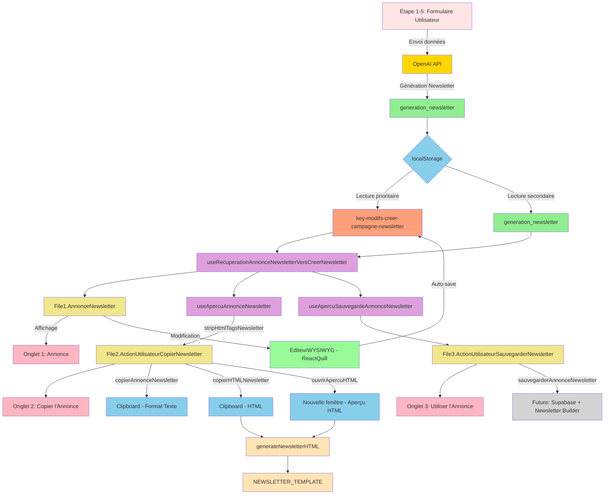

# 📧 **AUDIT TECHNIQUE EXHAUSTIF - CANAL "CRÉER UN EMAILING ANNONCE OU UNE CAMPAGNE NEWSLETTER"**

---

## **I. MISSION DU DOCUMENT**

Ce document constitue l'**audit technique exhaustif** du canal **"Créer un Emailing Annonce ou une Campagne Newsletter"** au sein de l'application LeadGenAI.

**Objectifs du document :**
- **Cartographier** tous les fichiers, composants, hooks et fonctions impliqués dans ce canal
- **Analyser** le flux complet de données depuis OpenAI jusqu'à l'interface utilisateur
- **Documenter** l'ensemble des processus : récupération, affichage, édition, copie et sauvegarde
- **Préparer** la migration future du système localStorage vers une architecture Supabase multi-tenant

**Périmètre :**
- **Localisation** : `/etape6communication` → option `"creer-campagne-newsletter"`
- **Type d'annonce** : Annonce Newsletter générée par OpenAI pour l'emailing immobilier commercial
- **Fonctionnalités** : Affichage, édition (WYSIWYG), copie (texte + HTML), sauvegarde, aperçu HTML

---

## **II. SOMMAIRE CLIQUABLE**

1. [MISSION DU DOCUMENT](#i-mission-du-document)
2. [SOMMAIRE CLIQUABLE](#ii-sommaire-cliquable)
3. [ARCHITECTURE GLOBALE - CANAL](#iii-architecture-globale---canal)
4. [LISTE EXHAUSTIVE DES FICHIERS UTILISÉS](#iv-liste-exhaustive-des-fichiers-utilisés)
5. [SYSTÈME D'ONGLETS](#v-système-donglets)
6. [PROCESSUS DE RÉCUPÉRATION DES DONNÉES OPENAI](#vi-processus-de-récupération-des-données-openai)
7. [STRUCTURE DES DONNÉES localStorage](#vii-structure-des-données-localstorage)
8. [PROCESSUS COMPLET ÉTAPE PAR ÉTAPE](#viii-processus-complet-étape-par-étape)
9. [SYSTÈME D'ÉDITION - BOUTON "MODIFIER"](#ix-système-dédition---bouton-modifier)
10. [OPTIONS DE COPIE](#x-options-de-copie)
11. [SYSTÈME D'APERÇU](#xi-système-daperçu)
12. [CONTRAINTES ET VALIDATION](#xii-contraintes-et-validation)
13. [COMPOSANTS GRAPHIQUES RÉUTILISABLES](#xiii-composants-graphiques-réutilisables)
14. [TABLEAUX RÉCAPITULATIFS](#xiv-tableaux-récapitulatifs)
15. [DONNÉES À PRENDRE EN CONSIDÉRATION](#xv-données-à-prendre-en-considération)

---

## **III. ARCHITECTURE GLOBALE - CANAL**

### **3.1. Vue d'ensemble du canal**

Le canal **"Créer un Emailing Annonce ou une Campagne Newsletter"** permet à l'utilisateur de :
1. **Visualiser** une annonce newsletter générée par OpenAI (5 champs)
2. **Modifier** cette annonce avec un éditeur WYSIWYG (ReactQuill sans toolbar)
3. **Copier** l'annonce en **format texte** pour utilisation externe
4. **Copier** l'annonce en **format HTML** pour intégration dans un logiciel d'emailing
5. **Visualiser** un aperçu HTML de l'emailing dans le navigateur
6. **Sauvegarder** l'annonce (fonctionnalité future vers Supabase et `/newsletter-builder`)

### **3.2. Position dans Étape 6 Communication**

- **Route** : `/etape6communication`
- **Activation** : `setSelectedOption("creer-campagne-newsletter")`
- **Composant racine** : ``
- **Fichier** : `src/components/1-Sources-Restitution-Utilisateur/4.EtapeCreerCampagneNewsletter/AccueilCreerCampagneNewsletter.tsx`

### **3.3. Schéma Mermaid complet (flux de données)**



---

## **IV. LISTE EXHAUSTIVE DES FICHIERS UTILISÉS**

### **4.1. Fichiers de composition**

| **Fichier** | **Rôle** | **Localisation** |
|-------------|----------|------------------|
| `AccueilCreerCampagneNewsletter.tsx` | Composant racine du canal Newsletter | `src/components/1-Sources-Restitution-Utilisateur/4.EtapeCreerCampagneNewsletter/` |
| `MenuOngletPortailsImmobiliers.tsx` | Système d'onglets avec bouton "Modifier" | `src/components/1-Sources-Restitution-Utilisateur/4.EtapeCreerCampagneNewsletter/` |
| `File1.AnnonceNewsletter.tsx` | Onglet 1 - Affichage et édition de l'annonce | `src/components/1-Sources-Restitution-Utilisateur/4.EtapeCreerCampagneNewsletter/` |
| `File2.ActionUtilisateurCopierNewsletter.tsx` | Onglet 2 - Options de copie (texte + HTML) | `src/components/1-Sources-Restitution-Utilisateur/4.EtapeCreerCampagneNewsletter/` |
| `File3.ActionUtilisateurSauvegarderNewsletter.tsx` | Onglet 3 - Sauvegarde et visualisation | `src/components/1-Sources-Restitution-Utilisateur/4.EtapeCreerCampagneNewsletter/` |

### **4.2. Hooks de récupération**

| **Fichier** | **Hook** | **Rôle** |
|-------------|----------|----------|
| `HookRecuperationAnnonceNewsletterVersCreerNewsletter.ts` | `useRecuperationAnnonceNewsletterVersCreerNewsletter` | Récupération avec priorité (modifs > original) + fonction `updateAnnonceNewsletter` |

### **4.3. Hooks d'aperçu**

| **Fichier** | **Hook** | **Rôle** |
|-------------|----------|----------|
| `HookCopierApercuAnnonceNewsletter.tsx` | `useApercuAnnonceNewsletter` | Aperçu texte avec nettoyage HTML (`stripHtmlTagsNewsletter`) pour copie texte |
| `HookApercuSauvegardeAnnonceNewsletter.tsx` | `useApercuSauvegardeAnnonceNewsletter` | Aperçu complet (5 champs séparés) pour visualisation sauvegarde |
| | `ApercuSauvegardeAnnonceNewsletter5champs` | Composant React pour affichage des 5 champs en lecture seule |

### **4.4. Hooks de copie**

| **Fichier** | **Hook/Fonction** | **Rôle** |
|-------------|-------------------|----------|
| `HookCopierTexteCampagneNewsletter.tsx` | `useCopierTexteCampagneNewsletter` | Copie texte (stripped HTML) via `navigator.clipboard` |
| `HookCopierHTMLCampagneNewsletter.tsx` | `useCopierHTMLCampagneNewsletter` | Copie HTML complet + aperçu navigateur via `generateNewsletterHTML` |

### **4.5. Hooks de sauvegarde**

| **Fichier** | **Hook** | **Rôle** |
|-------------|----------|----------|
| `HookSauvegarderCampagneNewsletter.tsx` | `useSauvegarderCampagneNewsletter` | Sauvegarde (actuellement inactivée - "en développement") |

### **4.6. Templates et utilitaires**

| **Fichier** | **Type** | **Rôle** |
|-------------|----------|----------|
| `TemplateNewsletterHTML.ts` | Template + Fonctions | Template HTML complet + fonctions de formatage (`formatPointsFortsForEmail`, `formatPrixEtReferenceForEmail`, `generateNewsletterHTML`) |
| `EditeurWYSIWYG.tsx` | Composant | Éditeur ReactQuill sans toolbar pour édition HTML |
| `GraphismeInterieurNewsletter.tsx` | Composants UI | Composants réutilisables (LabelField, ReadOnlyField, EditableField, CopyNewsletter3, etc.) |

### **4.7. Prompt OpenAI**

| **Fichier** | **Type** | **Rôle** |
|-------------|----------|----------|
| `src/services/openai/1.GenerateurAnnoncesOutilsSeo/7.PromptsOpenAi/3.PromptAnnonceNewsletter.ts` | Prompt | Instructions complètes pour la génération OpenAI (structure, formatage HTML, JSON) |

### **4.8. Arborescence complète**

```
src/components/1-Sources-Restitution-Utilisateur/4.EtapeCreerCampagneNewsletter/
├── AccueilCreerCampagneNewsletter.tsx         // Composant racine
├── MenuOngletPortailsImmobiliers.tsx           // Système d'onglets
├── File1.AnnonceNewsletter.tsx                 // Onglet 1
├── File2.ActionUtilisateurCopierNewsletter.tsx // Onglet 2
├── File3.ActionUtilisateurSauvegarderNewsletter.tsx // Onglet 3
├── HookRecuperationAnnonceNewsletterVersCreerNewsletter.ts
├── HookCopierApercuAnnonceNewsletter.tsx
├── HookCopierTexteCampagneNewsletter.tsx
├── HookCopierHTMLCampagneNewsletter.tsx
├── HookSauvegarderCampagneNewsletter.tsx
├── HookApercuSauvegardeAnnonceNewsletter.tsx
├── TemplateNewsletterHTML.ts
├── EditeurWYSIWYG.tsx
└── GraphismeInterieurNewsletter.tsx
```

---

## **V. SYSTÈME D'ONGLETS**

### **5.1. MenuOnglet (MenuOngletPortailsImmobiliers.tsx)**

**Fonctionnalités :**
- Affichage de **3 onglets** : "Annonce", "Copier l'Annonce", "Utiliser l'Annonce"
- Bouton **"Modifier"** / **"Sauvegarder"** (toggle) dans l'onglet 1
- Gestion de l'état `newsletterEditMode` (propagé vers `File1.AnnonceNewsletter`)
- Toast de confirmation lors de la sauvegarde
- Désactivation du mode édition lors du changement d'onglet

**États gérés :**
```typescript
const [activeNewsletterTab, setActiveNewsletterTab] = useState("newsletter-tab1");
const [newsletterEditMode, setNewsletterEditMode] = useState(false);
```

**Valeurs des onglets :**
- `"newsletter-tab1"` → Annonce
- `"newsletter-tab2"` → Copier l'Annonce
- `"newsletter-tab3"` → Utiliser l'Annonce

### **5.2. Onglet 1 : Annonce (File1.AnnonceNewsletter.tsx)**

**Objectif** : Affichage et édition des **5 champs** de l'annonce newsletter

**Champs affichés :**
1. **Titre** (label: "Titre")
2. **Accroche** (label: "Accroche")
3. **Points Forts** (label: "Points Forts")
4. **Call To Action** (label: "Appel à l'action")
5. **Prix et Référence** (label: "Prix ou Loyer & Référence")

**Mode lecture seule :**
- Composant : ``
- Propriété : `isDescriptif={true}` → utilise `dangerouslySetInnerHTML` pour afficher le HTML

**Mode édition :**
- Composant : ``
- Propriété : `useWysiwyg={true}` → utilise `` (ReactQuill sans toolbar)
- Nombre de lignes : `rows={2|3|8}` selon le champ

**Fonction de mise à jour :**
```typescript
const handleChange = (name: string, value: string) => {
  const updatedData = { [name]: value };
  updateAnnonceNewsletter(updatedData); // Sauvegarde auto localStorage
  if (onDataChange) {
    onDataChange({ ...annonceNewsletter, ...updatedData });
  }
};
```

### **5.3. Onglet 2 : Copier l'Annonce (File2.ActionUtilisateurCopierNewsletter.tsx)**

**Objectif** : Copier l'annonce en **format texte** ou **format HTML**

**Structure :**
```
┌─────────────────────────────────────────────────────────────┐
│ Options de copie de l'annonce newsletter                   │
├─────────────────────────────┬───────────────────────────────┤
│ Format Texte                │ Format HTML Emailing          │
│ [Copier le texte de         │ [Copier le code de l'Emailing]│
│  l'Annonce Newsletter]      │ [Voir l'Aperçu de cet Emailing]│
└─────────────────────────────┴───────────────────────────────┘
┌─────────────────────────────────────────────────────────────┐
│ Aperçu de l'Annonce Newsletter                              │
│ [Affichage texte complet: titre + accroche + pointsForts   │
│  + callToAction + prixEtReference]                          │
└─────────────────────────────────────────────────────────────┘
```

**Format Texte :**
- Hook : `useCopierTexteCampagneNewsletter()`
- Fonction : `copierAnnonceNewsletter()`
- Nettoyage : `stripHtmlTagsNewsletter()` avec gestion spéciale des transitions `p→ul`
- Résultat : Texte brut avec puces `•` et double saut de ligne avant les listes

**Format HTML Emailing :**
- Hook : `useCopierHTMLCampagneNewsletter()`
- Fonction : `copierHTMLNewsletter()` → copie HTML complet dans clipboard
- Fonction : `ouvrirApercuHTML()` → ouvre `window.open()` avec le HTML généré
- Template : `NEWSLETTER_TEMPLATE` (606 lignes de HTML inline CSS)

### **5.4. Onglet 3 : Utiliser l'Annonce (File3.ActionUtilisateurSauvegarderNewsletter.tsx)**

**Objectif** : Sauvegarder l'annonce (fonctionnalité future)

**Structure :**
```
┌─────────────────────────────────────────────────────────────┐
│ Option de sauvegarde Newsletter                             │
├─────────────────────────────┬───────────────────────────────┤
│ Sauvegarder cette annonce   │ (vide)                        │
│ [Sauvegarder l'Annonce]     │                               │
└─────────────────────────────┴───────────────────────────────┘
┌─────────────────────────────────────────────────────────────┐
│ Visualisation de l'Annonce Newsletter sauvegardée          │
│ [Affichage 5 champs séparés avec labels]                   │
│ - Titre                                                     │
│ - Accroche                                                  │
│ - Points Forts                                              │
│ - Appel à l'action                                          │
│ - Prix ou Loyer & Référence                                 │
└─────────────────────────────────────────────────────────────┘
```

**Statut actuel :**
- Bouton "Sauvegarder l'Annonce" → toast "Fonctionnalité en développement"
- Future intégration : Supabase + `/newsletter-builder`

### **5.5. Logique de navigation et état**

**Changement d'onglet :**
```typescript
const handleNewsletterTabChange = (value: string) => {
  setActiveNewsletterTab(value);
  if (newsletterEditMode) {
    toggleNewsletterEditMode(); // Désactive le mode édition
  }
  if (onTabChange) onTabChange(value);
};
```

**Toggle mode édition :**
```typescript
const toggleNewsletterEditMode = () => {
  const newEditMode = !newsletterEditMode;
  setNewsletterEditMode(newEditMode);

  if (!newEditMode) {
    toast({
      title: "Modifications newsletter sauvegardées",
      description: "Les changements de la campagne newsletter ont été enregistrés avec succès."
    });
  }

  if (onEditModeChange) onEditModeChange(newEditMode);
};
```

---

## **VI. PROCESSUS DE RÉCUPÉRATION DES DONNÉES OPENAI**

### **6.1. Sources de données (clés localStorage)**

| **Clé localStorage** | **Type** | **Origine** | **Priorité** |
|----------------------|----------|-------------|--------------|
| `generation_newsletter` | JSON | OpenAI | 2 (secondaire) |
| `key-modifs-creer-campagne-newsletter` | JSON | Utilisateur | 1 (prioritaire) |

### **6.2. Logique de priorité (modifs > originales)**

**Ordre de lecture :**
1. Vérifier si `key-modifs-creer-campagne-newsletter` existe
2. Si oui → charger ces données (modifications utilisateur)
3. Si non → charger `generation_newsletter` (données OpenAI originales)

**Implémentation dans `useRecuperationAnnonceNewsletterVersCreerNewsletter` :**
```typescript
const modifiedDataJson = localStorage.getItem('key-modifs-creer-campagne-newsletter');

if (modifiedDataJson) {
  const modifiedData = JSON.parse(modifiedDataJson);
  setAnnonceNewsletter({
    titre: modifiedData.titre || '',
    accroche: modifiedData.accroche || '',
    pointsForts: modifiedData.pointsForts || '',
    callToAction: modifiedData.callToAction || '',
    prixEtReference: modifiedData.prixEtReference || ''
  });
} else {
  const annonceNewsletterData = localStorage.getItem('generation_newsletter');
  if (annonceNewsletterData) {
    const parsedData = JSON.parse(annonceNewsletterData);
    setAnnonceNewsletter({ /* ... */ });
  }
}
```

### **6.3. Hooks de récupération détaillés**

#### **A. Hook principal : `useRecuperationAnnonceNewsletterVersCreerNewsletter`**

**Fichier :** `HookRecuperationAnnonceNewsletterVersCreerNewsletter.ts`

**Retour :**
```typescript
{
  annonceNewsletter: AnnonceNewsletterData,
  updateAnnonceNewsletter: (newData: Partial) => void,
  isLoading: boolean,
  error: string | null
}
```

**Fonction de mise à jour :**
```typescript
const updateAnnonceNewsletter = (newData: Partial) => {
  const updatedData = { ...annonceNewsletter, ...newData };
  setAnnonceNewsletter(updatedData);

  try {
    localStorage.setItem('key-modifs-creer-campagne-newsletter', JSON.stringify(updatedData));
  } catch (err) {
    console.error('Erreur lors de la sauvegarde des données:', err);
    setError('Erreur lors de la sauvegarde des données');
  }
};
```

#### **B. Hook d'aperçu : `useApercuAnnonceNewsletter`**

**Fichier :** `HookCopierApercuAnnonceNewsletter.tsx`

**Particularité :** Applique `stripHtmlTagsNewsletter()` sur tous les champs pour générer un aperçu texte propre

**Fonction de nettoyage HTML :**
```typescript
const stripHtmlTagsNewsletter = (html: string): string => {
  let modifiedHtml = html
    .replace(/<\/h2>\s*/gi, '###SAUT_LIGNE###')
    .replace(/<\/p>\s*/gi, '###SAUT_LIGNE###')
    .replace(/<\/p>\s*/gi, '###DOUBLE_SAUT_LIGNE###'); // ⚠️ Double saut pour p→ul

  modifiedHtml = modifiedHtml
    .replace(/]*>/gi, '')
    .replace(/<\/ul>/gi, '\n')
    .replace(/]*>/gi, '• ')
    .replace(/<\/li>/gi, '\n');

  let textSansTags = modifiedHtml.replace(/<\/?[^>]+(>|$)/g, '');

  textSansTags = textSansTags
    .replace(/###DOUBLE_SAUT_LIGNE###/g, '\n\n')
    .replace(/###SAUT_LIGNE###/g, '\n');

  textSansTags = textSansTags.replace(/\n{4,}/g, '\n\n');

  return textSansTags;
};
```

#### **C. Hook de sauvegarde : `useApercuSauvegardeAnnonceNewsletter`**

**Fichier :** `HookApercuSauvegardeAnnonceNewsletter.tsx`

**Particularité :** Fournit les données brutes (avec HTML) pour affichage des 5 champs séparés via le composant `ApercuSauvegardeAnnonceNewsletter5champs`

### **6.4. Mapping des champs OpenAI → Interface**

| **Champ OpenAI (clé JSON)** | **Champ Interface** | **Label UI** | **Format OpenAI** | **Traitement** |
|-----------------------------|---------------------|--------------|-------------------|----------------|
| `titre` | `titre` | "Titre" | `TITRE EN MAJUSCULES` | HTML → WYSIWYG |
| `accroche` | `accroche` | "Accroche" | `Phrase 1.Phrase 2.` | HTML → WYSIWYG |
| `pointsForts` | `pointsForts` | "Points Forts" | `Points Forts :...` | HTML → WYSIWYG |
| `callToAction` | `callToAction` | "Appel à l'action" | `PHRASE 1.PHRASE 2.` | HTML → WYSIWYG |
| `prixEtReference` | `prixEtReference` | "Prix ou Loyer & Référence" | `Prix FAI: 456€Référence: REF-123` | HTML → WYSIWYG |

**⚠️ PARTICULARITÉ :** Tous les champs sont stockés et édités en **HTML** (contrairement au canal Outils SEO qui est en texte brut).

---

## **VII. STRUCTURE DES DONNÉES localStorage**

### **7.1. Clés LUES**

| **Clé** | **Origine** | **Structure** | **Utilisation** |
|---------|-------------|---------------|-----------------|
| `generation_newsletter` | OpenAI | JSON (5 champs) | Données originales (priorité 2) |
| `key-modifs-creer-campagne-newsletter` | Utilisateur | JSON (5 champs) | Modifications utilisateur (priorité 1) |

**Exemple de structure `generation_newsletter` :**
```json
{
  "titre": "CARCASSONNE | RESTAURANT À VENDRE | EMPLACEMENT PREMIUM EN ANGLE | ...",
  "accroche": "CARCASSONNE AGENCE IMMOBILIERE vous invite à découvrir...Cette affaire rare...",
  "pointsForts": "Points Forts :Emplacement: ......",
  "callToAction": "EMPLACEMENT PREMIUM, AFFAIRE RARE.CLIQUEZ POUR EN SAVOIR PLUS.",
  "prixEtReference": "Prix FAI: 456 895€Référence: REF-789"
}
```

### **7.2. Clés ÉCRITES**

| **Clé** | **Déclencheur** | **Contenu** | **Fréquence** |
|---------|-----------------|-------------|---------------|
| `key-modifs-creer-campagne-newsletter` | Modification dans `EditableField` (WYSIWYG) | JSON (5 champs modifiés) | **Automatique** à chaque modification |

**Exemple après modification :**
```json
{
  "titre": "CARCASSONNE | RESTAURANT À VENDRE MODIFIÉ | ...",
  "accroche": "Texte d'accroche modifié...",
  "pointsForts": "Points Forts :Nouveau point fort",
  "callToAction": "NOUVEAU CTA",
  "prixEtReference": "Prix FAI: 500 000€"
}
```

### **7.3. Interfaces TypeScript complètes**

```typescript
interface AnnonceNewsletterData {
  titre: string;          // HTML: ...
  accroche: string;       // HTML: ......
  pointsForts: string;    // HTML: ......
  callToAction: string;   // HTML: ......
  prixEtReference: string; // HTML: ...
}

interface AnnonceNewsletterWithAgency extends AnnonceNewsletterData {
  agencyName: string;     // Récupéré depuis localStorage (propertyData | etape1Data)
  imageUrl: string;       // URL fixe: https://www.presenca.fr/wp-content/uploads/image-newsletter.jpg
}
```

### **7.4. Tableaux récapitulatifs**

#### **Tableau 1 : Clés localStorage et sources**

| **Clé** | **Type** | **Origine** | **Priorité** | **Hooks lecteurs** |
|---------|----------|-------------|--------------|-------------------|
| `generation_newsletter` | READ | OpenAI | 2 | `useRecuperationAnnonceNewsletterVersCreerNewsletter`, `useApercuAnnonceNewsletter`, `useApercuSauvegardeAnnonceNewsletter` |
| `key-modifs-creer-campagne-newsletter` | READ/WRITE | Utilisateur | 1 | Tous les hooks de récupération |
| `propertyData` | READ | Étape 1 | - | `getAgencyName()` (dans `TemplateNewsletterHTML.ts`) |
| `etape1Data` | READ | Étape 1 | - | `getAgencyName()` (fallback) |

#### **Tableau 2 : Flux de données**

| **Action** | **Hook/Fonction** | **Source** | **Destination** | **Traitement** |
|------------|-------------------|------------|-----------------|----------------|
| Chargement initial | `useRecuperationAnnonceNewsletterVersCreerNewsletter` | `key-modifs` > `generation_newsletter` | State `annonceNewsletter` | Parsing JSON |
| Modification champ | `handleChange` → `updateAnnonceNewsletter` | State `annonceNewsletter` | `key-modifs-creer-campagne-newsletter` | Merge + stringify |
| Aperçu texte | `useApercuAnnonceNewsletter` | `key-modifs` > `generation_newsletter` | State `ApercuAnnonceNewsletter` | `stripHtmlTagsNewsletter()` |
| Copie texte | `copierAnnonceNewsletter` | `ApercuAnnonceNewsletter` | Clipboard | Concaténation avec `\n\n` |
| Copie HTML | `copierHTMLNewsletter` | `annonceNewsletter` | Clipboard | `generateNewsletterHTML()` |
| Aperçu HTML | `ouvrirApercuHTML` | `annonceNewsletter` | `window.open()` | `generateNewsletterHTML()` |
| Sauvegarde | `sauvegarderAnnonceNewsletter` | - | - | **Inactif** (toast "en développement") |

---

## **VIII. PROCESSUS COMPLET ÉTAPE PAR ÉTAPE**

### **8.1. Chargement initial**

1. **Utilisateur accède** à `/etape6communication`
2. **Sélectionne** l'option `"creer-campagne-newsletter"`
3. **Rendu** de ``
4. **Rendu** de `` avec onglet actif `"newsletter-tab1"`
5. **Rendu** de `` avec `editMode={false}`
6. **Hook** `useRecuperationAnnonceNewsletterVersCreerNewsletter()` s'exécute :
   - Lecture `localStorage.getItem('key-modifs-creer-campagne-newsletter')`
   - Si existe → charger ces données
   - Sinon → Lecture `localStorage.getItem('generation_newsletter')` → charger
7. **État** `annonceNewsletter` mis à jour
8. **Affichage** des 5 champs en mode lecture seule (``)

### **8.2. Affichage en mode lecture seule**

**Composant :** ``

**Structure :**
```typescript

  {isDescriptif ? (

  ) : (
    {content}
  )}

```

**Propriété `isDescriptif={true}` :**
- Tous les champs de Newsletter utilisent `isDescriptif={true}`
- Permet l'affichage du HTML via `dangerouslySetInnerHTML`

### **8.3. Activation du mode édition**

1. **Utilisateur clique** sur le bouton "Modifier" (dans `MenuOngletNewsletter`)
2. **Toggle** `newsletterEditMode` de `false` à `true`
3. **Callback** `onEditModeChange(true)` vers `AccueilCreerCampagneNewsletter`
4. **État** `editMode` devient `true`
5. **Prop** `editMode={true}` propagée vers ``
6. **Rendu conditionnel** : `` remplace ``
7. **Affichage** de l'éditeur WYSIWYG (``)

### **8.4. Modification des champs**

**Flux de modification :**
1. **Utilisateur modifie** le contenu dans l'éditeur WYSIWYG (ReactQuill)
2. **Event** `onChange` de ReactQuill déclenché
3. **Callback** `handleChange(content)` dans `EditeurWYSIWYG.tsx`
4. **Mise à jour** `setEditorValue(content)` (état local)
5. **Callback** `onChange(content)` vers le parent `EditableField`
6. **Callback** `onChange={(value) => handleChange("titre", value)}` vers `File1.AnnonceNewsletter`
7. **Fonction** `handleChange(name, value)` :
   - Crée `updatedData = { [name]: value }`
   - Appelle `updateAnnonceNewsletter(updatedData)`
8. **Hook** `useRecuperationAnnonceNewsletterVersCreerNewsletter` :
   - Merge `{ ...annonceNewsletter, ...newData }`
   - **Sauvegarde immédiate** dans `localStorage.setItem('key-modifs-creer-campagne-newsletter', JSON.stringify(updatedData))`

**⚠️ SAUVEGARDE AUTOMATIQUE ET IMMÉDIATE** : Chaque modification est instantanément persistée dans localStorage.

### **8.5. Sauvegarde automatique**

**Déclencheur :** Chaque modification dans un `EditableField`

**Process :**
```typescript
const updateAnnonceNewsletter = (newData: Partial) => {
  const updatedData = { ...annonceNewsletter, ...newData };
  setAnnonceNewsletter(updatedData);

  try {
    localStorage.setItem('key-modifs-creer-campagne-newsletter', JSON.stringify(updatedData));
  } catch (err) {
    console.error('Erreur lors de la sauvegarde des données:', err);
    setError('Erreur lors de la sauvegarde des données');
  }
};
```

**Bouton "Sauvegarder" (dans MenuOnglet) :**
- **NE fait PAS** de sauvegarde supplémentaire (déjà auto-sauvegardé)
- **Désactive** le mode édition (`newsletterEditMode = false`)
- **Affiche** un toast de confirmation :
  ```typescript
  toast({
    title: "Modifications newsletter sauvegardées",
    description: "Les changements de la campagne newsletter ont été enregistrés avec succès."
  });
  ```

### **8.6. Copie au format Texte/HTML**

#### **A. Copie format TEXTE**

**Onglet :** `"newsletter-tab2"` → `File2.ActionUtilisateurCopierNewsletter`

**Bouton :** "Copier le texte de l'Annonce Newsletter"

**Process :**
1. **Hook** `useApercuAnnonceNewsletter()` charge les données avec `stripHtmlTagsNewsletter()`
2. **Fonction** `copierAnnonceNewsletter()` s'exécute :
   ```typescript
   let texteToCopy = "";
   texteToCopy += annonceNewsletter.titre + "\n\n";
   texteToCopy += annonceNewsletter.accroche + "\n\n";
   texteToCopy += annonceNewsletter.pointsForts + "\n\n";
   texteToCopy += annonceNewsletter.callToAction + "\n\n";
   texteToCopy += annonceNewsletter.prixEtReference;

   await navigator.clipboard.writeText(texteToCopy);
   ```
3. **Toast** de succès affiché

**Résultat texte copié (exemple) :**
```
CARCASSONNE | RESTAURANT À VENDRE | EMPLACEMENT PREMIUM | ...

CARCASSONNE AGENCE IMMOBILIERE vous invite à découvrir ce restaurant d'exception...
Cette affaire rare se distingue par...

Points Forts :

• Emplacement stratégique : Très bel emplacement, quartier dynamique.
• Cadre de l'établissement : Surface de 205m2, belle décoration.
...

EMPLACEMENT PREMIUM, AFFAIRE RARE À LA VENTE.
CLIQUEZ POUR EN SAVOIR PLUS.

• Prix FAI : 456 895€
• Référence : REF-789
```

#### **B. Copie format HTML**

**Bouton :** "Copier le code de l'Emailing"

**Process :**
1. **Hook** `useRecuperationAnnonceNewsletterVersCreerNewsletter()` (données avec HTML)
2. **Fonction** `copierHTMLNewsletter()` s'exécute :
   - Appelle `generateNewsletterHTML(annonceNewsletter)`
   - Récupère le nom de l'agence via `getAgencyName()`
   - Remplace les placeholders dans `NEWSLETTER_TEMPLATE`
   - Formate `pointsForts` via `formatPointsFortsForEmail()`
   - Formate `prixEtReference` via `formatPrixEtReferenceForEmail()`
3. **HTML complet** généré (95 lignes)
4. **Copie** via `navigator.clipboard.writeText(htmlContent)`
5. **Toast** de succès

**Bouton :** "Voir l'Aperçu de cet Emailing"

**Process :**
1. Même génération HTML que "Copier le code"
2. **Ouverture** nouvelle fenêtre : `window.open('', '_blank')`
3. **Écriture** HTML : `newWindow.document.write(htmlContent)`
4. **Toast** de succès

---

## **IX. SYSTÈME D'ÉDITION - BOUTON "MODIFIER"**

### **9.1. Localisation**

**Fichier :** `MenuOngletPortailsImmobiliers.tsx`

**Position :** Onglet 1 uniquement ("Annonce"), en haut à droite

**Condition d'affichage :**
```typescript
{enableEditMode && (

      {newsletterEditMode ? (
        <>Sauvegarder
      ) : (
        <>Modifier
      )}

)}
```

### **9.2. Comportement toggle (Modifier ↔ Sauvegarder)**

**État initial :** "Modifier" (icône `Edit`)

**Clic sur "Modifier" :**
1. `toggleNewsletterEditMode()` exécuté
2. `newsletterEditMode` passe de `false` à `true`
3. Bouton affiche "Sauvegarder" (icône `Save`)
4. Callback `onEditModeChange(true)` vers parent
5. `editMode` propagé vers `File1.AnnonceNewsletter`
6. Affichage des `` (WYSIWYG)

**Clic sur "Sauvegarder" :**
1. `toggleNewsletterEditMode()` exécuté
2. `newsletterEditMode` passe de `true` à `false`
3. **Toast affiché** :
   ```typescript
   toast({
     title: "Modifications newsletter sauvegardées",
     description: "Les changements de la campagne newsletter ont été enregistrés avec succès."
   });
   ```
4. Bouton affiche "Modifier" (icône `Edit`)
5. Callback `onEditModeChange(false)` vers parent
6. Affichage des ``

### **9.3. Propagation de l'état**

**Flux de propagation :**
```
MenuOngletNewsletter (newsletterEditMode)
    ↓ onEditModeChange(isEditMode)
AccueilCreerCampagneNewsletter (editMode)
    ↓ editMode={editMode}
File1.AnnonceNewsletter
    ↓ editMode ?  : 
```

### **9.4. Affichage conditionnel**

**Dans `File1.AnnonceNewsletter.tsx` :**
```typescript
{editMode ? (
   handleChange("titre", value)}
    rows={2}
    useWysiwyg={true}
  />
) : (

)}
```

### **9.5. Nettoyage HTML**

**⚠️ AUCUN NETTOYAGE HTML APPLIQUÉ**

Contrairement aux autres canaux, le canal Newsletter **NE nettoie PAS** les balises HTML car :
- Les données OpenAI sont déjà en **HTML structuré** (``, ``, ``, ``, ``)
- Le format HTML est **requis** pour l'emailing
- L'édition WYSIWYG **produit du HTML** (ReactQuill)

**Affichage lecture seule :**
```typescript

```

**Affichage édition :**
```typescript

```

### **9.6. Éditeur WYSIWYG (EditeurWYSIWYG.tsx)**

**Technologie :** ReactQuill

**Configuration :**
```typescript
const defaultModules = {
  toolbar: false  // ⚠️ Barre d'outils DÉSACTIVÉE
};

const formats = [
  'header',
  'bold', 'italic', 'underline', 'strike',
  'list', 'bullet'
];
```

**Style :**
```css
.quill-custom-font .ql-editor {
  font-size: 18px;
  font-family: 'Nunito', sans-serif;
  line-height: 1.6;
}

.quill-custom-font .ql-toolbar {
  display: none;  /* Toolbar cachée */
}
```

**Hauteur dynamique :**
```typescript
const editorHeight = `${Math.max(150, rows * 40)}px`;
```

**Propriété `simpleMode` :**
- `simpleMode = true` si `rows <= 3` (champs courts : titre, accroche, CTA)
- `simpleMode = false` si `rows > 3` (champs longs : pointsForts)
- **Non utilisée actuellement** (toolbar toujours désactivée)

---

## **X. OPTIONS DE COPIE**

### **10.1. FORMAT TEXTE**

#### **A. Bouton "Copier le texte de l'Annonce Newsletter"**

**Composant :** `CopyNewsletter3` (dans `File2.ActionUtilisateurCopierNewsletter`)

**Hook :** `useCopierTexteCampagneNewsletter()`

**Fonction :** `copierAnnonceNewsletter()`

**Process détaillé :**
1. **Vérification** de l'état de chargement (`isLoading`)
2. **Vérification** des erreurs (`error`)
3. **Construction** du texte :
   ```typescript
   let texteToCopy = "";
   texteToCopy += annonceNewsletter.titre + "\n\n";
   texteToCopy += annonceNewsletter.accroche + "\n\n";
   texteToCopy += annonceNewsletter.pointsForts + "\n\n";
   texteToCopy += annonceNewsletter.callToAction + "\n\n";
   texteToCopy += annonceNewsletter.prixEtReference;
   ```
4. **Copie** dans clipboard : `await navigator.clipboard.writeText(texteToCopy)`
5. **Toast** de succès :
   ```typescript
   toast({
     title: "Succès",
     description: "L'annonce newsletter a été copiée dans le presse-papier",
     duration: 3000,
   });
   ```

**Données source :** `useApercuAnnonceNewsletter()` → données avec `stripHtmlTagsNewsletter()`

**Résultat copié (exemple) :**
```
CARCASSONNE | RESTAURANT À VENDRE | ...

CARCASSONNE AGENCE présente ce restaurant...
Cette affaire se distingue par...

Points Forts :

• Emplacement : Quartier dynamique.
• Cadre : 205m2, décoration raffinée.

EMPLACEMENT PREMIUM, AFFAIRE RARE.
CLIQUEZ POUR EN SAVOIR PLUS.

• Prix FAI : 456 895€
• Référence : REF-789
```

### **10.2. FORMAT HTML**

#### **A. Bouton "Copier le code de l'Emailing"**

**Hook :** `useCopierHTMLCampagneNewsletter()`

**Fonction :** `copierHTMLNewsletter()`

**Process détaillé :**
1. **Vérification** de l'état de chargement et erreurs
2. **Génération** du HTML : `const htmlContent = generateNewsletterHTML(annonceNewsletter)`
3. **Copie** dans clipboard : `await navigator.clipboard.writeText(htmlContent)`
4. **Toast** de succès

**Données source :** `useRecuperationAnnonceNewsletterVersCreerNewsletter()` → données **avec HTML**

#### **B. Bouton "Voir l'Aperçu de cet Emailing"**

**Fonction :** `ouvrirApercuHTML()`

**Process détaillé :**
1. **Génération** du HTML : `const htmlContent = generateNewsletterHTML(annonceNewsletter)`
2. **Ouverture** nouvelle fenêtre : `const newWindow = window.open('', '_blank')`
3. **Écriture** du HTML : `newWindow.document.write(htmlContent)`
4. **Fermeture** du flux : `newWindow.document.close()`
5. **Toast** de succès

### **10.3. Logique de formatage détaillée**

#### **A. Fonction `generateNewsletterHTML(annonceData)`**

**Fichier :** `TemplateNewsletterHTML.ts`

**Process :**
1. **Récupération** du nom de l'agence :
   ```typescript
   const getAgencyName = (): string => {
     const propertyData = localStorage.getItem('propertyData');
     if (propertyData) {
       const parsedData = JSON.parse(propertyData);
       return parsedData.agencyName || parsedData.agency || 'VOTRE AGENCE';
     }

     const etape1Data = localStorage.getItem('etape1Data');
     if (etape1Data) {
       const parsedEtape1 = JSON.parse(etape1Data);
       return parsedEtape1.agencyName || parsedEtape1.agency || 'VOTRE AGENCE';
     }

     return 'VOTRE AGENCE';
   };
   ```

2. **Construction** de l'objet `AnnonceNewsletterWithAgency` :
   ```typescript
   const dataWithAgency: AnnonceNewsletterWithAgency = {
     ...annonceData,
     agencyName: getAgencyName(),
     imageUrl: 'https://www.presenca.fr/wp-content/uploads/image-newsletter.jpg',
     pointsForts: formatPointsFortsForEmail(annonceData.pointsForts),
     prixEtReference: formatPrixEtReferenceForEmail(annonceData.prixEtReference)
   };
   ```

3. **Remplacement** des placeholders dans `NEWSLETTER_TEMPLATE` :
   ```typescript
   let html = NEWSLETTER_TEMPLATE;

   Object.entries(dataWithAgency).forEach(([key, value]) => {
     const placeholder = `{{${key}}}`;
     html = html.replace(new RegExp(placeholder, 'g'), value || '');
   });

   return html;
   ```

#### **B. Fonction `formatPointsFortsForEmail(pointsFortsHTML)`**

**Objectif :** Convertir le HTML brut des Points Forts en HTML optimisé pour emailing

**Process :**
1. **Vérification** si déjà formaté (contient ``) → retour tel quel
2. **Parsing** du HTML avec `DOMParser` :
   ```typescript
   const parser = new DOMParser();
   const doc = parser.parseFromString(pointsFortsHTML, 'text/html');
   const listItems = doc.querySelectorAll('li');
   ```
3. **Itération** sur chaque `` :
   - Extraction du titre (texte en ``)
   - Extraction de la description (après `:`)
   - Construction de la ligne formatée :
     ```typescript
     formattedPoints += `${titre} : ${description}`;
     ```
4. **Retour** du HTML formaté

**Exemple transformation :**

**Entrée :**
```html

  Emplacement stratégique: Très bel emplacement en angle...
  Cadre de l'établissement: Surface de 205m2...

```

**Sortie :**
```html
Emplacement stratégique : Très bel emplacement en angle...
Cadre de l'établissement : Surface de 205m2...
```

#### **C. Fonction `formatPrixEtReferenceForEmail(prixEtReferenceHTML)`**

**Objectif :** Convertir le Prix et Référence en liste HTML avec style inline

**⚠️ CORRECTION APPLIQUÉE** pour gérer le format collé "Prix FAI : FAI: 456 890€Référence: ERT+90"

**Process :**
1. **Vérification** si déjà formaté (contient ``) → retour tel quel
2. **Nettoyage** HTML : `const cleanText = stripHtmlTags(prixEtReferenceHTML)`
3. **Split** sur `€` pour séparer prix et référence :
   ```typescript
   const parts = cleanText.split('€');

   if (parts.length >= 2) {
     const prixPart = parts[0].trim() + '€';
     const prixClean = prixPart.replace(/prix\s*:?\s*/gi, '').replace(/fai\s*:?\s*/gi, '').trim();

     const refPart = parts[1].trim();
     const refClean = refPart.replace(/référence\s*:?\s*/gi, '').replace(/ref\s*:?\s*/gi, '').trim();

     let formattedPrixRef = '';
     formattedPrixRef += `Prix FAI : ${prixClean}`;
     formattedPrixRef += `Référence : ${refClean}`;
     formattedPrixRef += '';

     return formattedPrixRef;
   }
   ```
4. **Fallback** si pas de `€` : traitement ligne par ligne

**Exemple transformation :**

**Entrée (format OpenAI) :**
```html

  Prix FAI: 456 895€
  Référence: REF-789

```

**Sortie (avec styles inline) :**
```html

  Prix FAI : 456 895€
  Référence : REF-789

```

#### **D. Template `NEWSLETTER_TEMPLATE`**

**Structure complète (95 lignes) :**

```html

  Newsletter

          {{agencyName}}

          {{titre}}

        {{accroche}}

          {{pointsForts}}

          {{callToAction}}

          {{prixEtReference}}

          Découvrir cette Opportunité

        Mentions Légales

```

**Placeholders utilisés :**
- `{{agencyName}}` → Nom de l'agence
- `{{imageUrl}}` → URL de l'image
- `{{titre}}` → Titre de l'annonce
- `{{accroche}}` → Accroche
- `{{pointsForts}}` → Points forts (HTML formaté)
- `{{callToAction}}` → CTA
- `{{prixEtReference}}` → Prix et référence (HTML formaté)

---

## **XI. SYSTÈME D'APERÇU**

### **11.1. Hook Aperçu : `useApercuAnnonceNewsletter`**

**Fichier :** `HookCopierApercuAnnonceNewsletter.tsx`

**Objectif :** Fournir une version **texte brut** de l'annonce pour l'aperçu et la copie texte

**Process :**
1. **Lecture** localStorage (priorité : `key-modifs` > `generation_newsletter`)
2. **Application** de `stripHtmlTagsNewsletter()` sur **tous les champs**
3. **Stockage** dans `ApercuAnnonceNewsletter`

**Retour :**
```typescript
{
  annonceNewsletter: {
    titre: string,         // Texte brut (HTML supprimé)
    accroche: string,      // Texte brut
    pointsForts: string,   // Texte brut avec puces •
    callToAction: string,  // Texte brut
    prixEtReference: string // Texte brut avec puces •
  },
  isLoading: boolean,
  error: string | null
}
```

**Fonction `stripHtmlTagsNewsletter()` :**

**Particularité :** Gestion optimisée des transitions `p→ul` avec **double saut de ligne**

**Process :**
1. **Marquage** des transitions :
   - `` → `###SAUT_LIGNE###`
   - `` → `###SAUT_LIGNE###`
   - `` → `###DOUBLE_SAUT_LIGNE###` ⚠️
2. **Conversion** des listes HTML :
   - `` → supprimé
   - `` → `\n`
   - `` → `• `
   - `` → `\n`
3. **Suppression** de toutes les balises HTML
4. **Remplacement** des marqueurs :
   - `###DOUBLE_SAUT_LIGNE###` → `\n\n`
   - `###SAUT_LIGNE###` → `\n`
5. **Nettoyage** des sauts multiples : `\n{4,}` → `\n\n`

**Exemple transformation :**

**Entrée HTML :**
```html
Points Forts :

  Emplacement : Quartier dynamique.
  Cadre : 205m2.

```

**Sortie Texte :**
```
Points Forts :

• Emplacement : Quartier dynamique.
• Cadre : 205m2.
```

### **11.2. Hook Aperçu : `useApercuSauvegardeAnnonceNewsletter`**

**Fichier :** `HookApercuSauvegardeAnnonceNewsletter.tsx`

**Objectif :** Fournir les données **avec HTML** pour l'aperçu de sauvegarde (5 champs séparés)

**Différence avec `useApercuAnnonceNewsletter` :**
- **Pas de nettoyage HTML**
- Données brutes conservées pour affichage via `dangerouslySetInnerHTML`

**Utilisation :**
- Composant `ApercuSauvegardeAnnonceNewsletter5champs` (dans le même fichier)
- Affichage des 5 champs avec `` + ``

**Structure du composant `ApercuSauvegardeAnnonceNewsletter5champs` :**
```typescript

    Titre

    Accroche

```

### **11.3. Fonctions détaillées**

#### **Affichage de l'aperçu dans Onglet 2 (Copier l'Annonce)**

**Composant :** `` (dans `File2.ActionUtilisateurCopierNewsletter`)

**Structure :**
```typescript

```

**Rendu :**
```
┌─────────────────────────────────────────────────┐
│ Aperçu de l'Annonce Newsletter                  │
├─────────────────────────────────────────────────┤
│ CARCASSONNE | RESTAURANT À VENDRE | ...         │
│                                                  │
│ CARCASSONNE AGENCE présente...                  │
│ Cette affaire se distingue...                   │
│                                                  │
│ Points Forts :                                   │
│                                                  │
│ • Emplacement : Quartier dynamique.             │
│ • Cadre : 205m2.                                 │
│                                                  │
│ EMPLACEMENT PREMIUM, AFFAIRE RARE.              │
│ CLIQUEZ POUR EN SAVOIR PLUS.                    │
│                                                  │
│ • Prix FAI : 456 895€                            │
│ • Référence : REF-789                            │
└─────────────────────────────────────────────────┘
```

#### **Affichage de la visualisation dans Onglet 3 (Utiliser l'Annonce)**

**Composant :** `` (dans `File3.ActionUtilisateurSauvegarderNewsletter`)

**Rendu :**
```
┌─────────────────────────────────────────────────┐
│ Visualisation de l'Annonce Newsletter sauvegardée│
├─────────────────────────────────────────────────┤
│ Titre                                            │
│ ┌─────────────────────────────────────────────┐ │
│ │ CARCASSONNE | RESTAURANT À VENDRE | ...     │ │
│ └─────────────────────────────────────────────┘ │
│                                                  │
│ Accroche                                         │
│ ┌─────────────────────────────────────────────┐ │
│ │ CARCASSONNE AGENCE présente...              │ │
│ │ Cette affaire se distingue...               │ │
│ └─────────────────────────────────────────────┘ │
│                                                  │
│ Points Forts                                     │
│ ┌─────────────────────────────────────────────┐ │
│ │ Points Forts :                               │ │
│ │ • Emplacement : ...                          │ │
│ │ • Cadre : ...                                │ │
│ └─────────────────────────────────────────────┘ │
│                                                  │
│ Appel à l'action                                 │
│ ┌─────────────────────────────────────────────┐ │
│ │ EMPLACEMENT PREMIUM, AFFAIRE RARE.          │ │
│ │ CLIQUEZ POUR EN SAVOIR PLUS.                │ │
│ └─────────────────────────────────────────────┘ │
│                                                  │
│ Prix ou Loyer & Référence                        │
│ ┌─────────────────────────────────────────────┐ │
│ │ • Prix FAI : 456 895€                        │ │
│ │ • Référence : REF-789                        │ │
│ └─────────────────────────────────────────────┘ │
└─────────────────────────────────────────────────┘
```

---

## **XII. CONTRAINTES ET VALIDATION**

### **12.1. Validation des champs (nettoyage HTML)**

**⚠️ PARTICULARITÉ DU CANAL NEWSLETTER :**

**AUCUN nettoyage HTML appliqué** car :
1. **OpenAI génère du HTML structuré** (``, ``, ``, ``, ``)
2. **Le format HTML est requis** pour l'emailing
3. **L'édition WYSIWYG produit du HTML** (ReactQuill)
4. **Le template d'emailing attend du HTML**

**Différence avec les autres canaux :**
- **Site Internet Annonces** : Nettoyage partiel (titre, accroche, CTA) + conservation HTML (descriptif)
- **Outils SEO** : Nettoyage total (texte brut uniquement)
- **Newsletter** : **Aucun nettoyage** (HTML intégral conservé)

**Fonction de nettoyage HTML utilisée uniquement pour l'aperçu texte :**
```typescript
// Dans HookCopierApercuAnnonceNewsletter.tsx
const stripHtmlTagsNewsletter = (html: string): string => {
  // Utilisé UNIQUEMENT pour l'aperçu texte et la copie texte
  // PAS pour l'affichage ou l'édition
}
```

### **12.2. Gestion des erreurs (loading, error)**

**États gérés dans tous les hooks de récupération :**
```typescript
const [isLoading, setIsLoading] = useState(true);
const [error, setError] = useState(null);
```

**Affichage conditionnel dans `File1.AnnonceNewsletter` :**
```typescript
if (isLoading) {
  return Chargement des données...;
}

if (error) {
  return {error};
}
```

**Gestion des erreurs de copie :**
```typescript
try {
  await navigator.clipboard.writeText(texteToCopy);
  toast({ title: "Succès", ... });
} catch (error) {
  console.error('Erreur lors de la copie:', error);
  toast({
    title: "Erreur",
    description: "Une erreur s'est produite lors de la copie",
    variant: "destructive",
    duration: 3000,
  });
}
```

**Gestion des erreurs de sauvegarde localStorage :**
```typescript
try {
  localStorage.setItem('key-modifs-creer-campagne-newsletter', JSON.stringify(updatedData));
} catch (err) {
  console.error('Erreur lors de la sauvegarde des données:', err);
  setError('Erreur lors de la sauvegarde des données');
}
```

### **12.3. Toasts de notification**

**Types de toasts utilisés :**

| **Action** | **Titre** | **Description** | **Variant** | **Durée** |
|------------|-----------|-----------------|-------------|-----------|
| Sauvegarde modifications (bouton "Sauvegarder") | "Modifications newsletter sauvegardées" | "Les changements de la campagne newsletter ont été enregistrés avec succès." | default | - |
| Copie texte - succès | "Succès" | "L'annonce newsletter a été copiée dans le presse-papier" | default | 3000ms |
| Copie HTML - succès | "Succès" | "Le code HTML de l'emailing a été copié dans le presse-papier" | default | 3000ms |
| Aperçu HTML - succès | "Succès" | "L'aperçu de l'emailing a été ouvert dans votre explorateur" | default | 3000ms |
| Sauvegarde annonce | "Fonctionnalité en développement" | "La sauvegarde automatique sera disponible prochainement." | default | - |
| Copie - données en chargement | "Information" | "Les données sont en cours de chargement..." | default | 3000ms |
| Copie - erreur récupération | "Erreur" | "Impossible de récupérer les données de l'annonce newsletter" | destructive | 3000ms |
| Copie - erreur générale | "Erreur" | "Une erreur s'est produite lors de la copie..." | destructive | 3000ms |
| Aperçu HTML - erreur | "Erreur" | "Une erreur s'est produite lors de l'ouverture de l'aperçu" | destructive | 3000ms |

### **12.4. Sécurité**

**Utilisation de `dangerouslySetInnerHTML` :**
```typescript
// Dans ReadOnlyField
{isDescriptif ? (

) : (
  {content}
)}
```

**⚠️ RISQUE DE SÉCURITÉ :**
- Pas de sanitization du HTML (pas de `DOMPurify`)
- Injection possible si les données OpenAI sont compromises
- **Recommandation future** : Intégrer `DOMPurify` pour nettoyer le HTML avant affichage

**Mitigation actuelle :**
- Source de données contrôlée (OpenAI + localStorage)
- Pas d'input utilisateur direct dans le HTML (passage par ReactQuill)
- ReactQuill effectue une certaine sanitization

---

## **XIII. COMPOSANTS GRAPHIQUES RÉUTILISABLES**

### **13.1. LabelField**

**Fichier :** `GraphismeInterieurNewsletter.tsx`

**Interface :**
```typescript
interface LabelFieldProps {
  htmlFor: string;
  children: ReactNode;
  className?: string;
}
```

**Rendu :**
```typescript

  {children}

```

**Utilisation :**
```typescript
Titre
```

### **13.2. ReadOnlyField**

**Interface :**
```typescript
interface ReadOnlyFieldProps {
  id: string;
  content: string;
  isDescriptif?: boolean;
  className?: string;
}
```

**Rendu :**
```typescript

  {isDescriptif ? (

  ) : (
    {content}
  )}

```

**Utilisation :**
```typescript

```

### **13.3. EditableField**

**Interface :**
```typescript
interface EditableFieldProps {
  id: string;
  value: string;
  onChange: (value: string) => void;
  rows?: number;
  className?: string;
  useWysiwyg?: boolean;
}
```

**Rendu conditionnel :**
```typescript
if (useWysiwyg) {
  const simpleMode = rows <= 3;
  return (

  );
}

return (
   onChange(e.target.value)} 
    className={cn("w-full rounded-md border border-gray-200 p-3", className)}
    rows={rows}
  />
);
```

**Utilisation :**
```typescript
<EditableField
  id="titre"
  value={annonceNewsletter.titre}
  onChange={(value) => handleChange("titre", value)}
  rows={2}
  useWysiwyg={true}  // ⚠️ Tous les champs Newsletter utilisent useWysiwyg={true}
/>
```

### **13.4. CopyNewsletter3**

**Interface :**
```typescript
interface CopyNewsletter3Props {
  title: string;
  description: string;
  icon: React.ReactNode;
  buttons: Array<{
    text: string;
    onClick: () => void;
  }>;
  className?: string;
}
```

**Rendu :**
```typescript
<div className={cn("border-l-4 border-l-realestate-mauve bg-white p-4 rounded-r-lg shadow-sm hover:shadow-md transition-all", className)}>
  <div className="flex items-start mb-3">
    <div className="p-2 rounded-lg bg-realestate-purple-light text-realestate-purple-dark mr-3">
      {icon}
    </div>
    <div>
      <h4 className="font-semibold">{title}</h4>
      <p className="text-sm text-gray-600">{description}</p>
    </div>
  </div>
  <div className="space-y-3">
    {buttons.map((button, index) => (
      <Button key={index} onClick={button.onClick} className="w-full bg-realestate-mauve hover:bg-realestate-mauve-dark text-white justify-start">
        <ClipboardCopy className="mr-2 h-4 w-4" />
        {button.text}
      </Button>
    ))}
  </div>
</div>
```

**Utilisation :**
```typescript
<CopyNewsletter3
  title="Format Texte"
  description="Format pour copier le texte de votre annonce newsletter"
  icon={<FileText className="h-5 w-5" />}
  buttons={[
    { text: "Copier le texte de l'Annonce Newsletter", onClick: copierAnnonceNewsletter }
  ]}
/>
```

### **13.5. CopyNewsletterOptionsContainer**

**Interface :**
```typescript
interface CopyNewsletterOptionsContainerProps {
  children: ReactNode;
  className?: string;
}
```

**Rendu :**
```typescript
<div className={cn("grid md:grid-cols-2 gap-6", className)}>
  {children}
</div>
```

**Utilisation :**
```typescript
<CopyNewsletterOptionsContainer>
  <CopyNewsletter3 title="Format Texte" ... />
  <CopyNewsletter3 title="Format HTML Emailing" ... />
</CopyNewsletterOptionsContainer>
```

### **13.6. NewsletterPreview**

**Interface :**
```typescript
interface NewsletterPreviewProps {
  title: string;
  className?: string;
  children?: ReactNode;
}
```

**Rendu :**
```typescript
<div className={cn("mt-6 p-4 bg-realestate-purple-light/10 border border-realestate-purple-light rounded-lg", className)}>
  <h4 className="font-semibold mb-2">{title}</h4>
  <div className="bg-white p-4 rounded border border-gray-200 max-h-64 overflow-y-auto">
    {children}
  </div>
</div>
```

**Utilisation :**
```typescript
<NewsletterPreview title="Aperçu de l'Annonce Newsletter">
  <ReadOnlyField id="apercu-newsletter" content={...} />
</NewsletterPreview>
```

### **13.7. EditeurWYSIWYG**

**Interface :**
```typescript
interface EditeurWYSIWYGProps {
  value: string;
  onChange: (content: string) => void;
  rows?: number;
  className?: string;
  simpleMode?: boolean;
}
```

**Configuration :**
```typescript
const defaultModules = {
  toolbar: false  // ⚠️ Toolbar désactivée
};

const formats = [
  'header',
  'bold', 'italic', 'underline', 'strike',
  'list', 'bullet'
];
```

**Rendu :**
```typescript
<div className="quill-custom-font">
  <ReactQuill
    theme="snow"
    value={editorValue}
    onChange={handleChange}
    modules={defaultModules}
    formats={formats}
    style={{ height: editorHeight, fontSize: '18px', fontFamily: 'Nunito, sans-serif' }}
    className={className}
    placeholder=""
  />
  <style>{`
    .quill-custom-font .ql-editor {
      font-size: 18px;
      font-family: 'Nunito', sans-serif;
      line-height: 1.6;
    }
    .quill-custom-font .ql-toolbar {
      display: none;  /* Toolbar cachée */
    }
    .quill-custom-font .ql-container {
      border-top: 1px solid #ccc;
    }
  `}</style>
</div>
```

**Particularités :**
- Police : `Nunito, sans-serif` à `18px`
- Hauteur dynamique : `Math.max(150, rows * 40)px`
- Toolbar désactivée (affichage et fonctionnalité)
- Formats permis : header, bold, italic, underline, strike, list, bullet

---

## **XIV. TABLEAUX RÉCAPITULATIFS**

### **14.1. Tableau des champs de l'annonce newsletter**

| **Champ** | **Label UI** | **Format OpenAI** | **Stockage** | **Édition** | **Rows** |
|-----------|--------------|-------------------|--------------|-------------|----------|
| `titre` | "Titre" | `<p>TEXTE EN MAJUSCULES</p>` | HTML | WYSIWYG | 2 |
| `accroche` | "Accroche" | `<p>Phrase 1.<br>Phrase 2.</p>` | HTML | WYSIWYG | 3 |
| `pointsForts` | "Points Forts" | `<p><strong>Points Forts :</strong></p><ul><li>...</li></ul>` | HTML | WYSIWYG | 8 |
| `callToAction` | "Appel à l'action" | `<p>PHRASE 1.<br>PHRASE 2.</p>` | HTML | WYSIWYG | 3 |
| `prixEtReference` | "Prix ou Loyer & Référence" | `<ul><li><strong>Prix FAI</strong>: 456€</li><li><strong>Référence</strong>: REF-123</li></ul>` | HTML | WYSIWYG | 3 |

### **14.2. Tableau des hooks**

| **Hook** | **Fichier** | **Rôle** | **Traitement HTML** | **Retour** |
|----------|-------------|----------|---------------------|------------|
| `useRecuperationAnnonceNewsletterVersCreerNewsletter` | `HookRecuperationAnnonceNewsletterVersCreerNewsletter.ts` | Récupération + Update | Aucun (HTML conservé) | `{ annonceNewsletter, updateAnnonceNewsletter, isLoading, error }` |
| `useApercuAnnonceNewsletter` | `HookCopierApercuAnnonceNewsletter.tsx` | Aperçu texte | `stripHtmlTagsNewsletter()` | `{ annonceNewsletter, isLoading, error }` |
| `useApercuSauvegardeAnnonceNewsletter` | `HookApercuSauvegardeAnnonceNewsletter.tsx` | Aperçu sauvegarde | Aucun (HTML conservé) | `{ annonceNewsletter, isLoading, error }` |
| `useCopierTexteCampagneNewsletter` | `HookCopierTexteCampagneNewsletter.tsx` | Copie texte | Utilise `useApercuAnnonceNewsletter` (stripped) | `{ copierAnnonceNewsletter }` |
| `useCopierHTMLCampagneNewsletter` | `HookCopierHTMLCampagneNewsletter.tsx` | Copie HTML + Aperçu | Utilise `useRecuperationAnnonceNewsletterVersCreerNewsletter` (HTML) | `{ copierHTMLNewsletter, ouvrirApercuHTML }` |
| `useSauvegarderCampagneNewsletter` | `HookSauvegarderCampagneNewsletter.tsx` | Sauvegarde (inactif) | - | `{ sauvegarderAnnonceNewsletter, isSaving }` |

### **14.3. Tableau des fonctions de copie**

| **Fonction** | **Hook** | **Source de données** | **Traitement** | **Destination** | **Toast** |
|--------------|----------|----------------------|----------------|-----------------|-----------|
| `copierAnnonceNewsletter()` | `useCopierTexteCampagneNewsletter` | `useApercuAnnonceNewsletter` (texte stripped) | Concaténation avec `\n\n` | `navigator.clipboard` | "L'annonce newsletter a été copiée" |
| `copierHTMLNewsletter()` | `useCopierHTMLCampagneNewsletter` | `useRecuperationAnnonceNewsletterVersCreerNewsletter` (HTML) | `generateNewsletterHTML()` | `navigator.clipboard` | "Le code HTML de l'emailing a été copié" |
| `ouvrirApercuHTML()` | `useCopierHTMLCampagneNewsletter` | `useRecuperationAnnonceNewsletterVersCreerNewsletter` (HTML) | `generateNewsletterHTML()` | `window.open()` | "L'aperçu de l'emailing a été ouvert" |
| `sauvegarderAnnonceNewsletter()` | `useSauvegarderCampagneNewsletter` | - | - | - | "Fonctionnalité en développement" |

### **14.4. Tableau des fonctions de formatage HTML**

| **Fonction** | **Fichier** | **Input** | **Output** | **Utilisation** |
|--------------|-------------|-----------|------------|-----------------|
| `stripHtmlTags()` | `TemplateNewsletterHTML.ts` | HTML | Texte brut | Helper pour `formatPointsFortsForEmail` et `formatPrixEtReferenceForEmail` |
| `formatPointsFortsForEmail()` | `TemplateNewsletterHTML.ts` | `<ul><li><strong>Titre</strong>: Description</li></ul>` | HTML avec styles inline | Template HTML emailing |
| `formatPrixEtReferenceForEmail()` | `TemplateNewsletterHTML.ts` | `<ul><li><strong>Prix FAI</strong>: 456€</li><li><strong>Référence</strong>: REF-123</li></ul>` | HTML avec styles inline | Template HTML emailing |
| `getAgencyName()` | `TemplateNewsletterHTML.ts` | `localStorage` (`propertyData` ou `etape1Data`) | String (nom agence) | Template HTML emailing |
| `generateNewsletterHTML()` | `TemplateNewsletterHTML.ts` | `AnnonceNewsletterData` | HTML complet (95 lignes) | Copie HTML + Aperçu HTML |
| `stripHtmlTagsNewsletter()` | `HookCopierApercuAnnonceNewsletter.tsx` | HTML | Texte brut (avec puces `•` et double saut `p→ul`) | Aperçu texte + Copie texte |

### **14.5. Matrice Onglets × Actions × Fichiers**

| **Onglet** | **Action** | **Bouton** | **Hook/Fonction** | **Fichier** | **Destination** |
|------------|------------|-----------|-------------------|-------------|-----------------|
| **1. Annonce** | Afficher | - | `useRecuperationAnnonceNewsletterVersCreerNewsletter` | `File1.AnnonceNewsletter.tsx` | UI (ReadOnlyField) |
| | Modifier | "Modifier" | `toggleNewsletterEditMode` | `MenuOngletPortailsImmobiliers.tsx` | `editMode = true` |
| | Éditer | - | `handleChange` → `updateAnnonceNewsletter` | `File1.AnnonceNewsletter.tsx` | `key-modifs-creer-campagne-newsletter` |
| | Sauvegarder | "Sauvegarder" | `toggleNewsletterEditMode` | `MenuOngletPortailsImmobiliers.tsx` | Toast + `editMode = false` |
| **2. Copier l'Annonce** | Copier texte | "Copier le texte de l'Annonce Newsletter" | `copierAnnonceNewsletter` | `File2.ActionUtilisateurCopierNewsletter.tsx` | Clipboard |
| | Copier HTML | "Copier le code de l'Emailing" | `copierHTMLNewsletter` | `File2.ActionUtilisateurCopierNewsletter.tsx` | Clipboard |
| | Aperçu HTML | "Voir l'Aperçu de cet Emailing" | `ouvrirApercuHTML` | `File2.ActionUtilisateurCopierNewsletter.tsx` | `window.open()` |
| | Afficher aperçu | - | `useApercuAnnonceNewsletter` | `File2.ActionUtilisateurCopierNewsletter.tsx` | UI (NewsletterPreview) |
| **3. Utiliser l'Annonce** | Sauvegarder | "Sauvegarder l'Annonce" | `sauvegarderAnnonceNewsletter` | `File3.ActionUtilisateurSauvegarderNewsletter.tsx` | Toast (inactif) |
| | Visualiser | - | `ApercuSauvegardeAnnonceNewsletter5champs` | `File3.ActionUtilisateurSauvegarderNewsletter.tsx` | UI (NewsletterPreview) |

---

## **XV. DONNÉES À PRENDRE EN CONSIDÉRATION**

### **15.1. Points d'attention techniques**

1. **Conservation du HTML intégral**
   - Tous les champs sont en HTML (contrairement au canal Outils SEO)
   - Pas de nettoyage HTML (sauf pour aperçu/copie texte)
   - `dangerouslySetInnerHTML` utilisé partout (risque sécurité)

2. **Nettoyage HTML spécial pour texte**
   - `stripHtmlTagsNewsletter()` avec gestion `p→ul` (double saut de ligne)
   - Conversion `<li>` → `• ` (puce unicode)
   - Préservation de la structure visuelle en texte brut

3. **Éditeur WYSIWYG sans toolbar**
   - ReactQuill configuré sans barre d'outils
   - Formats permis : header, bold, italic, underline, strike, list, bullet
   - Police `Nunito 18px` (cohérence graphique)

4. **Sauvegarde automatique**
   - Chaque modification → sauvegarde immédiate dans localStorage
   - Bouton "Sauvegarder" → désactive mode édition + toast (pas de sauvegarde supplémentaire)

5. **Template HTML emailing complexe**
   - 95 lignes de HTML inline CSS
   - Styles inline pour compatibilité clients email
   - Image fixe : `https://www.presenca.fr/wp-content/uploads/image-newsletter.jpg`
   - Récupération nom agence depuis `propertyData` ou `etape1Data`

6. **Formatage HTML pour emailing**
   - `formatPointsFortsForEmail()` : Ajout styles inline (`margin-bottom:7px`)
   - `formatPrixEtReferenceForEmail()` : Gestion format collé "Prix FAI : FAI: 456€Référence: ERT+90"
   - Parsing `<li>` avec `DOMParser` pour extraction titre/description

7. **Aperçu HTML dans navigateur**
   - `window.open('', '_blank')` → nouvelle fenêtre
   - `newWindow.document.write(htmlContent)` → écriture HTML
   - `newWindow.document.close()` → fermeture flux
   - Toast de confirmation

8. **Fonction de sauvegarde inactive**
   - `sauvegarderAnnonceNewsletter()` → toast "Fonctionnalité en développement"
   - Future intégration : Supabase + `/newsletter-builder`

### **15.2. Dépendances critiques**

| **Dépendance** | **Utilisation** | **Remplacement potentiel** |
|----------------|-----------------|----------------------------|
| `react-quill` | Éditeur WYSIWYG | `@tiptap/react`, `draft-js`, `slate` |
| `navigator.clipboard` | Copie dans presse-papier | Fallback avec `document.execCommand('copy')` (deprecated) |
| `DOMParser` | Parsing HTML pour formatage | `cheerio` (Node.js), `jsdom` |
| `localStorage` | Stockage données | **Supabase** (migration prévue) |
| `@/hooks/use-toast` | Notifications utilisateur | - |
| `lucide-react` | Icônes UI | `react-icons`, `heroicons` |

### **15.3. Fonctions clés à préserver**

**Lors de la migration vers Supabase :**

1. **Logique de priorité (modifs > original)**
   ```sql
   SELECT 
     COALESCE(modifications.titre, original.titre) as titre,
     COALESCE(modifications.accroche, original.accroche) as accroche,
     ...
   FROM annonces_newsletter_original original
   LEFT JOIN annonces_newsletter_modifications modifications 
     ON original.id = modifications.original_id
   ```

2. **Fonction `stripHtmlTagsNewsletter()` (double saut p→ul)**
   - À préserver pour la copie texte
   - Peut être migré en fonction Supabase ou conserver en frontend

3. **Fonction `formatPointsFortsForEmail()` et `formatPrixEtReferenceForEmail()`**
   - À préserver pour la génération HTML
   - Possibilité de créer un Edge Function Supabase

4. **Template `NEWSLETTER_TEMPLATE`**
   - À stocker en base de données (table `email_templates`)
   - Versioning possible (historique des templates)

5. **Fonction `getAgencyName()`**
   - À remplacer par requête Supabase :
     ```sql
     SELECT organisation_nom 
     FROM organisations 
     WHERE organisation_id = get_user_organisation_id(auth.uid())
     ```

### **15.4. Mapping OpenAI → Interface**

**⚠️ PARTICULARITÉ :** Contrairement aux autres canaux, **AUCUN mapping de noms de champs** n'est nécessaire.

**Raison :** OpenAI génère déjà les clés JSON avec les noms exacts utilisés dans l'interface :
- `titre` → `titre`
- `accroche` → `accroche`
- `pointsForts` → `pointsForts`
- `callToAction` → `callToAction`
- `prixEtReference` → `prixEtReference`

**Différence avec les autres canaux :**
- **Site Internet** : `cta` (OpenAI) → `appelAction` (interface)
- **Newsletter** : **Aucune transformation** (noms identiques)

**Prompt OpenAI (rappel) :**
```typescript
// src/services/openai/1.GenerateurAnnoncesOutilsSeo/7.PromptsOpenAi/3.PromptAnnonceNewsletter.ts

export const promptAnnonceNewsletter = `
...
RESTITUTION
Réponds uniquement avec un objet JSON au format suivant (sans backticks, ni code fence):
{
  "titre": "<p>TITRE EN MAJUSCULES</p>",
  "accroche": "<p>Phrase 1.<br>Phrase 2.</p>",
  "pointsForts": "<p><strong>Points Forts :</strong></p><ul><li>...</li></ul>",
  "callToAction": "<p>PHRASE 1.<br>PHRASE 2.</p>",
  "prixEtReference": "<ul><li><strong>Prix FAI</strong>: 456€</li><li><strong>Référence</strong>: REF-123</li></ul>"
}
...
`;
```

---

**Points clés à retenir :**
- **HTML intégral conservé** (contrairement à Outils SEO qui est en texte brut)
- **WYSIWYG sans toolbar** (ReactQuill)
- **Sauvegarde automatique** à chaque modification
- **Template HTML 95 lignes** avec styles inline pour emailing
- **Fonction de nettoyage spéciale** `stripHtmlTagsNewsletter()` avec double saut `p→ul`
- **Fonction de sauvegarde inactive** (future intégration Supabase + Newsletter Builder)

