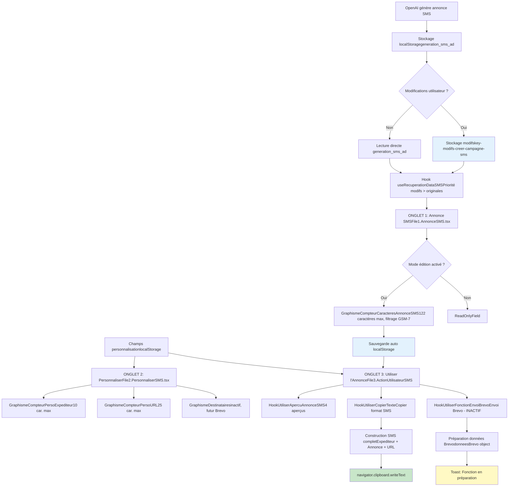

# 📄 **AUDIT TECHNIQUE EXHAUSTIF - CANAL "COPIER / ENVOYER UNE CAMPAGNE SMS"**

## **I. MISSION DU DOCUMENT**

Ce document constitue l'audit technique **complet et exhaustif** du canal **"Copier / Envoyer une Campagne SMS"** dans l'application LeadGenAI. Il documente l'intégralité des fichiers, hooks, fonctions, structures de données, processus et contraintes techniques actuellement implémentés en **localStorage**, en vue d'une future **migration vers Supabase** avec architecture **multi-tenant**.

**Objectifs du document** :
- ✅ **Cartographier** tous les fichiers, composants, hooks et utilitaires utilisés
- ✅ **Tracer** le flux de données complet depuis OpenAI jusqu'à la copie/envoi
- ✅ **Identifier** toutes les clés localStorage (lecture/écriture)
- ✅ **Documenter** les contraintes de validation (compteur de caractères GSM-7, limites)
- ✅ **Analyser** les fonctions de copie texte et d'envoi vers Brevo
- ✅ **Fournir** les bases techniques pour la migration Supabase

---

## **II. SOMMAIRE CLIQUABLE**

1. [Mission du Document](#i-mission-du-document)
2. [Sommaire Cliquable](#ii-sommaire-cliquable)
3. [Architecture Globale - Canal](#iii-architecture-globale---canal)
4. [Liste Exhaustive des Fichiers Utilisés](#iv-liste-exhaustive-des-fichiers-utilisés)
5. [Système d'Onglets](#v-système-donglets)
6. [Processus de Récupération des Données OpenAI](#vi-processus-de-récupération-des-données-openai)
7. [Structure des Données localStorage](#vii-structure-des-données-localstorage)
8. [Processus Complet Étape par Étape](#viii-processus-complet-étape-par-étape)
9. [Système d'Édition - Bouton "Modifier"](#ix-système-dédition---bouton-modifier)
10. [Options de Copie et Envoi](#x-options-de-copie-et-envoi)
11. [Système d'Aperçu](#xi-système-daperçu)
12. [Contraintes et Validation](#xii-contraintes-et-validation)
13. [Composants Graphiques Réutilisables](#xiii-composants-graphiques-réutilisables)
14. [Tableaux Récapitulatifs](#xiv-tableaux-récapitulatifs)
15. [Données à Prendre en Considération](#xv-données-à-prendre-en-considération)

---

## **III. ARCHITECTURE GLOBALE - CANAL**

### **3.1. Vue d'ensemble du canal**

Le canal **"Copier / Envoyer une Campagne SMS"** permet aux utilisateurs de :
1. **Visualiser et éditer** une annonce SMS générée par OpenAI (122 caractères maximum)
2. **Personnaliser** l'annonce avec 3 champs complémentaires (Expéditeur 10 car., URL 25 car., Destinataires)
3. **Copier** l'annonce SMS complète au format texte
4. **Envoyer** (fonctionnalité inactive) la campagne SMS vers la plateforme Brevo

**Localisation dans l'application** :  
📍 Accessible via `/etape6communication` lorsque `setSelectedOption("creer-campagne-sms")` est actif, ce qui affiche le composant ``.

---

### **3.2. Position dans Étape 6 Communication**

```
ÉTAPE 6 COMMUNICATION
├── Site Internet Annonces
├── Site Internet Outils SEO
├── Copier / Publier sur Portails Immobiliers
├── Créer un Emailing / Newsletter
└── 📍 **Copier / Envoyer une Campagne SMS** ◀ ACTUEL
```

---

### **3.3. Schéma Mermaid complet (flux de données)**



---

## **IV. LISTE EXHAUSTIVE DES FICHIERS UTILISÉS**

### **4.1. Fichiers de composition**

| **Fichier** | **Chemin** | **Rôle** |
|-------------|------------|----------|
| `AccueilCreerCampagneSMS.tsx` | `src/components/1-Sources-Restitution-Utilisateur/5.EtapeCreerSMSCampagne/` | **Composant racine** du canal SMS. Gère le state `editMode` et orchestre les 3 onglets via `MenuOngletCampagneSMS`. |
| `MenuOngletCampagneSMS.tsx` | `src/components/1-Sources-Restitution-Utilisateur/5.EtapeCreerSMSCampagne/` | **Système d'onglets** avec 3 tabs : "Annonce SMS", "Personnaliser l'Annonce", "Utiliser l'Annonce". Gère le bouton **Modifier/Sauvegarder** pour onglets 1 et 2. |
| `File1.AnnonceSMS.tsx` | `src/components/1-Sources-Restitution-Utilisateur/5.EtapeCreerSMSCampagne/` | **Onglet 1** : Affiche et édite l'annonce SMS (122 caractères max). |
| `File2.PersonnaliserSMS.tsx` | `src/components/1-Sources-Restitution-Utilisateur/5.EtapeCreerSMSCampagne/` | **Onglet 2** : Affiche et édite les 3 champs de personnalisation (Expéditeur, URL, Destinataires). |
| `File3.ActionUtilisateurSMS.tsx` | `src/components/1-Sources-Restitution-Utilisateur/5.EtapeCreerSMSCampagne/` | **Onglet 3** : Affiche les options de copie/envoi et les 4 aperçus. |

---

### **4.2. Hooks de récupération**

| **Hook** | **Chemin** | **Fonction** |
|----------|------------|--------------|
| `useRecuperationDataSMS` | `src/components/1-Sources-Restitution-Utilisateur/5.EtapeCreerSMSCampagne/Hook-1-RecuperationDataSMS.ts` | Récupère l'annonce SMS depuis **localStorage** avec **logique de priorité** : `key-modifs-creer-campagne-sms` > `generation_sms_ad`. Expose `annonceSMS`, `updateAnnonceSMS`, `isLoading`, `error`. |
| `usePersonnaliserChampsSMS` | `src/components/1-Sources-Restitution-Utilisateur/5.EtapeCreerSMSCampagne/Hook-2-PersonnaliserChamps.tsx` | Gère les 3 champs de personnalisation (Expéditeur, URL, Destinataires) avec **sauvegarde auto** dans localStorage (`key-modifs-sms-expediteur`, `key-modifs-sms-url`, `key-modifs-sms-destinataires`). |

---

### **4.3. Hooks d'aperçu**

| **Hook** | **Chemin** | **Fonction** |
|----------|------------|--------------|
| `HookUtiliserApercuAnnonceSMS` | `src/components/1-Sources-Restitution-Utilisateur/5.EtapeCreerSMSCampagne/Hook-3-UtiliserApercuAnnonceSMS.tsx` | Affiche **4 aperçus** : Annonce SMS, Expéditeur, URL, Destinataires. Récupère les données depuis localStorage avec **mise à jour en temps réel** (event listener + interval 1s). |

---

### **4.4. Hooks de copie et envoi**

| **Hook** | **Chemin** | **Fonction** |
|----------|------------|--------------|
| `HookUtiliserCopierTexte` | `src/components/1-Sources-Restitution-Utilisateur/5.EtapeCreerSMSCampagne/Hook-3-UtiliserCopierTexte.tsx` | **Copie au format texte** : Construit le SMS complet (`Expediteur + Annonce + URL`) et copie vers clipboard via `navigator.clipboard.writeText`. |
| `HookUtiliserFonctionEnvoiBrevo` | `src/components/1-Sources-Restitution-Utilisateur/5.EtapeCreerSMSCampagne/Hook-3-UtiliserFonctionEnvoiBrevo.tsx` | **Envoi vers Brevo** : Affiche un toast "Fonction en préparation". Futur appel API Brevo. |
| `HookUtiliserBrevo` | `src/components/1-Sources-Restitution-Utilisateur/5.EtapeCreerSMSCampagne/Hook-3-UtiliserBrevo.tsx` | Version détaillée de l'envoi Brevo avec **préparation des données** au format Brevo (`sender`, `recipient`, `content`, `type`, `tag`). Fonction `preparerDonneesBrevo()` + `envoyerVersBrevo()`. **Non utilisé actuellement**. |

---

### **4.5. Composants graphiques**

| **Composant** | **Chemin** | **Fonction** |
|---------------|------------|--------------|
| `GraphismeInterieurCampagneSMS.tsx` | `src/components/1-Sources-Restitution-Utilisateur/5.EtapeCreerSMSCampagne/` | Contient **tous les composants UI réutilisables** : `LabelField`, `ReadOnlyField`, `EditableField`, `EditButton`, `CopyOption`, `CopyOption3`, `CopyOptionsContainer`, `AnnoncePreview`. |
| `GraphismeCompteurCaracteresAnnonceSMS.tsx` | `src/components/1-Sources-Restitution-Utilisateur/5.EtapeCreerSMSCampagne/` | **Compteur SMS 122 caractères** avec filtrage GSM-7, comptage spécial pour `€` (2 car.), blocage dépassement, `CircularProgress` coloré. |
| `GraphismeCompteurCaracteresPersoSMSExpediteur.tsx` | `src/components/1-Sources-Restitution-Utilisateur/5.EtapeCreerSMSCampagne/` | **Compteur Expéditeur 10 caractères** avec filtrage GSM-7, sauvegarde auto localStorage. |
| `GraphismeCompteurCaracteresPersoSMSURL.tsx` | `src/components/1-Sources-Restitution-Utilisateur/5.EtapeCreerSMSCampagne/` | **Compteur URL 25 caractères** avec filtrage GSM-7, sauvegarde auto localStorage. |
| `GraphismeOngletPersonnaliserDestinataires.tsx` | `src/components/1-Sources-Restitution-Utilisateur/5.EtapeCreerSMSCampagne/` | **Champ Destinataires** (disabled, readOnly). Futur menu dropdown pour sélectionner des listes Brevo. |
| `EditeurWYSIWYG.tsx` | `src/components/1-Sources-Restitution-Utilisateur/5.EtapeCreerSMSCampagne/` | **Éditeur WYSIWYG** utilisant ReactQuill. **Non utilisé dans ce canal** (SMS = texte brut uniquement). |

---

### **4.6. Arborescence complète avec descriptions**

```
src/components/1-Sources-Restitution-Utilisateur/5.EtapeCreerSMSCampagne/
│
├── AccueilCreerCampagneSMS.tsx          # Racine du canal, gère editMode
├── MenuOngletCampagneSMS.tsx            # Système d'onglets (3 tabs)
│
├── File1.AnnonceSMS.tsx                 # Onglet 1: Annonce SMS (122 car.)
├── File2.PersonnaliserSMS.tsx           # Onglet 2: 3 champs personnalisation
├── File3.ActionUtilisateurSMS.tsx       # Onglet 3: Copie/Envoi + Aperçus
│
├── Hook-1-RecuperationDataSMS.ts        # Récupération annonce SMS (priorité modifs)
├── Hook-2-PersonnaliserChamps.tsx       # Gestion 3 champs perso (localStorage)
├── Hook-3-UtiliserApercuAnnonceSMS.tsx  # 4 aperçus (temps réel)
├── Hook-3-UtiliserCopierTexte.tsx       # Copie format texte (clipboard)
├── Hook-3-UtiliserFonctionEnvoiBrevo.tsx # Envoi Brevo (toast inactif)
├── Hook-3-UtiliserBrevo.tsx             # Version détaillée envoi Brevo (non utilisé)
│
├── GraphismeInterieurCampagneSMS.tsx    # Composants UI réutilisables
├── GraphismeCompteurCaracteresAnnonceSMS.tsx      # Compteur 122 car. GSM-7
├── GraphismeCompteurCaracteresPersoSMSExpediteur.tsx # Compteur 10 car.
├── GraphismeCompteurCaracteresPersoSMSURL.tsx     # Compteur 25 car.
├── GraphismeOngletPersonnaliserDestinataires.tsx  # Champ Destinataires (futur Brevo)
└── EditeurWYSIWYG.tsx                   # Éditeur WYSIWYG (non utilisé SMS)
```

**Fichier OpenAI utilisé** :  
📄 `src/services/openai/1.GenerateurAnnoncesOutilsSeo/7.PromptsOpenAi/5.PromptSMSAnnonce.ts` → Contient le **prompt OpenAI** pour générer l'annonce SMS (122 car. max, structure imposée, règles GSM-7).

---

## **V. SYSTÈME D'ONGLETS**

### **5.1. MenuOnglet**

**Fichier** : `MenuOngletCampagneSMS.tsx`

**Props** :
```typescript
interface MenuOngletCampagneSMSProps {
  tabTitles?: string[];                    // Titres des 3 onglets
  tabContent1?: ReactNode;                 // Contenu Onglet 1
  tabContent2?: ReactNode;                 // Contenu Onglet 2
  tabContent3?: ReactNode;                 // Contenu Onglet 3
  enableEditMode?: boolean;                // Activer bouton Modifier
  onTabChange?: (tabValue: string) => void; // Callback changement onglet
  onEditModeChange?: (isEditMode: boolean) => void; // Callback mode édition
  className?: string;
}
```

**Valeurs par défaut** :
```typescript
tabTitles = ["Annonce SMS", "Personnaliser l'Annonce", "Utiliser l'Annonce"]
```

**Bouton Modifier/Sauvegarder** :
- ✅ Présent sur **Onglet 1** (Annonce SMS)
- ✅ Présent sur **Onglet 2** (Personnaliser l'Annonce)
- ❌ **Absent** sur **Onglet 3** (Utiliser l'Annonce) → Lecture seule uniquement

**Comportement toggle** :
```typescript
const toggleEditMode = () => {
  const newEditMode = !editMode;
  setEditMode(newEditMode);

  if (!newEditMode) {
    toast({
      title: "Modifications sauvegardées",
      description: "Les changements ont été enregistrés avec succès."
    });
  }

  if (onEditModeChange) {
    onEditModeChange(newEditMode);
  }
};
```

**Règle importante** : Si l'utilisateur change d'onglet en mode édition, le mode édition est **automatiquement désactivé** :
```typescript
const handleTabChange = (value: string) => {
  setActiveTab(value);
  if (editMode) {
    toggleEditMode();
  }
  if (onTabChange) {
    onTabChange(value);
  }
};
```

---

### **5.2. Onglet 1 : Annonce SMS**

**Fichier** : `File1.AnnonceSMS.tsx`

**Contenu** :
- **1 champ unique** : `restitution-annonce-sms` (Annonce SMS 122 caractères max)

**Affichage conditionnel** :
- **Mode lecture** (`editMode = false`) : `` affiche l'annonce en texte brut
- **Mode édition** (`editMode = true`) : `` avec compteur, filtrage GSM-7, blocage à 122 car.

**Logique de mise à jour** :
```typescript
const handleChange = (name: string, value: string) => {
  let cleanedValue = value;
  if (name === "restitution-annonce-sms") {
    cleanedValue = value.replace(/<\/?[^>]+(>|$)/g, ""); // Suppression balises HTML
  }

  const updatedData = { [name]: cleanedValue };
  updateAnnonceSMS(updatedData); // Sauvegarde localStorage

  if (onDataChange) {
    onDataChange({ ...annonceSMS, ...updatedData });
  }
};
```

**Nettoyage HTML** : Suppression de toutes les balises HTML via regex `/< \/?[^>]+(>|$)/g`.

---

### **5.3. Onglet 2 : Personnaliser l'Annonce**

**Fichier** : `File2.PersonnaliserSMS.tsx`

**Contenu** : **3 champs de personnalisation**

| **Champ** | **Composant édition** | **Limite** | **Composant lecture** | **localStorage** |
|-----------|----------------------|------------|----------------------|------------------|
| **Expéditeur** | `GraphismeCompteurCaracteresPersoSMSExpediteur` | 10 car. | `ReadOnlyField` | `key-modifs-sms-expediteur` |
| **URL de l'Annonce** | `GraphismeCompteurCaracteresPersoSMSURL` | 25 car. | `ReadOnlyField` | `key-modifs-sms-url` |
| **Liste des Destinataires** | `GraphismeOngletPersonnaliserDestinataires` | N/A | **Toujours disabled** | `key-modifs-sms-destinataires` |

**Particularité Destinataires** :
- Champ **toujours non modifiable** (`disabled={true}`, `readOnly={true}`)
- Placeholder : `"Fonction associée avec la plateforme Brevo"`
- **Futur** : Menu dropdown pour sélectionner des listes Brevo via API

**Hook utilisé** : `usePersonnaliserChampsSMS`
- Charge les données depuis localStorage au montage
- Sauvegarde automatique à chaque modification
- Expose `personnaliserData`, `updateExpediteur()`, `updateUrlAnnonce()`, `updateDestinataires()`

---

### **5.4. Onglet 3 : Utiliser l'Annonce**

**Fichier** : `File3.ActionUtilisateurSMS.tsx`

**Contenu** :
1. **Titre "Options"**
2. **Deux cadres côte à côte** (grid 2 colonnes) :
   - `` → Copier au Format Texte
   - `` → Envoyer la Campagne SMS
3. **4 aperçus** :
   - `` → Affiche les 4 aperçus

**Aucun bouton Modifier** : Cet onglet est **en lecture seule uniquement**.

---

### **5.5. Logique de navigation et état**

**State global** (dans `AccueilCreerCampagneSMS.tsx`) :
```typescript
const [editMode, setEditMode] = useState(false);
const [annonceSMSData, setAnnonceSMSData] = useState({});
const [personnaliserSMSData, setPersonnaliserSMSData] = useState({});
```

**Propagation du mode édition** :
- `MenuOngletCampagneSMS` gère l'état `editMode` local et le propage via `onEditModeChange`
- `AccueilCreerCampagneSMS` reçoit le changement et met à jour son propre `editMode`
- Les composants `File1.AnnonceSMS` et `File2.PersonnaliserSMS` reçoivent `editMode` en props

**Callbacks de données** :
- `File1.AnnonceSMS` → `onDataChange(data)` → `handleAnnonceSMSDataChange(data)` → `setAnnonceSMSData(data)`
- `File2.PersonnaliserSMS` → `onDataChange(data)` → `handlePersonnaliserSMSDataChange(data)` → `setPersonnaliserSMSData(data)`

---

## **VI. PROCESSUS DE RÉCUPÉRATION DES DONNÉES OPENAI**

### **6.1. Sources de données (clés localStorage)**

**Données originales OpenAI** :
```typescript
localStorage.getItem('generation_sms_ad')
```
**Structure JSON** :
```json
{
  "restitution-annonce-sms": "AV Bar Restaurant. Paris Nord. Licence 4. Emplacement en angle. Fort Potentiel. 331.527€ FAI. Infos-> "
}
```

**Données modifiées utilisateur** :
```typescript
localStorage.getItem('key-modifs-creer-campagne-sms')
```
**Structure JSON identique** :
```json
{
  "restitution-annonce-sms": "AV Brasserie. Toulouse. Licence 4. Emplacement N1. 420.000€ FAI. Infos-> "
}
```

---

### **6.2. Logique de priorité (modifs > originales)**

**Hook** : `useRecuperationDataSMS` (`Hook-1-RecuperationDataSMS.ts`)

**Logique de récupération** :
```typescript
useEffect(() => {
  try {
    setIsLoading(true);

    // PRIORITÉ 1 : Données modifiées
    const modifiedDataJson = localStorage.getItem('key-modifs-creer-campagne-sms');

    if (modifiedDataJson) {
      const modifiedData = JSON.parse(modifiedDataJson);
      setAnnonceSMS({
        "restitution-annonce-sms": modifiedData["restitution-annonce-sms"] || ''
      });
    } else {
      // PRIORITÉ 2 : Données originales OpenAI
      const annonceSMSData = localStorage.getItem('generation_sms_ad');

      if (annonceSMSData) {
        const parsedData = JSON.parse(annonceSMSData);
        setAnnonceSMS({
          "restitution-annonce-sms": parsedData["restitution-annonce-sms"] || ''
        });
      } else {
        console.log('Aucune donnée d\'annonce SMS trouvée');
      }
    }

    setIsLoading(false);
  } catch (err) {
    console.error('Erreur récupération:', err);
    setError('Erreur lors de la récupération des données');
    setIsLoading(false);
  }
}, []);
```

---

### **6.3. Hooks de récupération détaillés**

#### **A. useRecuperationDataSMS**

**Fichier** : `Hook-1-RecuperationDataSMS.ts`

**Interface** :
```typescript
interface AnnonceSMSData {
  "restitution-annonce-sms": string;
}
```

**État exposé** :
```typescript
const [annonceSMS, setAnnonceSMS] = useState({
  "restitution-annonce-sms": ''
});
const [isLoading, setIsLoading] = useState(true);
const [error, setError] = useState(null);
```

**Fonction de mise à jour** :
```typescript
const updateAnnonceSMS = (newData: Partial) => {
  const updatedData = { ...annonceSMS, ...newData };
  setAnnonceSMS(updatedData);

  try {
    localStorage.setItem('key-modifs-creer-campagne-sms', JSON.stringify(updatedData));
  } catch (err) {
    console.error('Erreur sauvegarde:', err);
    setError('Erreur lors de la sauvegarde');
  }
};
```

**Return** :
```typescript
return { annonceSMS, updateAnnonceSMS, isLoading, error };
```

---

#### **B. usePersonnaliserChampsSMS**

**Fichier** : `Hook-2-PersonnaliserChamps.tsx`

**Interface** :
```typescript
interface PersonnaliserSMSData {
  expediteur: string;
  urlAnnonce: string;
  destinataires: string;
}
```

**Chargement initial** :
```typescript
useEffect(() => {
  const expediteurSaved = localStorage.getItem('key-modifs-sms-expediteur') || '';
  const urlSaved = localStorage.getItem('key-modifs-sms-url') || '';
  const destinatairesSaved = localStorage.getItem('key-modifs-sms-destinataires') || '';

  setPersonnaliserData({
    expediteur: expediteurSaved,
    urlAnnonce: urlSaved,
    destinataires: destinatairesSaved
  });
}, []);
```

**Fonctions de mise à jour** :
```typescript
const updateExpediteur = (value: string) => {
  setPersonnaliserData(prev => ({ ...prev, expediteur: value }));
  localStorage.setItem('key-modifs-sms-expediteur', value);
};

const updateUrlAnnonce = (value: string) => {
  setPersonnaliserData(prev => ({ ...prev, urlAnnonce: value }));
  localStorage.setItem('key-modifs-sms-url', value);
};

const updateDestinataires = (value: string) => {
  setPersonnaliserData(prev => ({ ...prev, destinataires: value }));
  localStorage.setItem('key-modifs-sms-destinataires', value);
};
```

---

### **6.4. Mapping des champs OpenAI → Interface**

| **Champ OpenAI (prompt)** | **Clé JSON OpenAI** | **Clé localStorage Originale** | **Clé localStorage Modifs** | **Champ Interface** | **Limite** |
|---------------------------|---------------------|--------------------------------|-----------------------------|---------------------|------------|
| Annonce SMS complète | `restitution-annonce-sms` | `generation_sms_ad` | `key-modifs-creer-campagne-sms` | `restitution-annonce-sms` | 122 car. |
| Expéditeur (non OpenAI) | N/A | N/A | `key-modifs-sms-expediteur` | `expediteur` | 10 car. |
| URL (non OpenAI) | N/A | N/A | `key-modifs-sms-url` | `urlAnnonce` | 25 car. |
| Destinataires (non OpenAI) | N/A | N/A | `key-modifs-sms-destinataires` | `destinataires` | N/A |

**Note importante** : Les champs **Expéditeur**, **URL** et **Destinataires** ne sont **pas générés par OpenAI**. Ils sont ajoutés manuellement par l'utilisateur dans l'Onglet 2.

---

## **VII. STRUCTURE DES DONNÉES localStorage**

### **7.1. Clés LUES**

| **Clé localStorage** | **Type** | **Contenu** | **Utilisé par** | **Format** |
|----------------------|----------|-------------|-----------------|------------|
| `generation_sms_ad` | JSON | Annonce SMS originale OpenAI | `useRecuperationDataSMS` | `{ "restitution-annonce-sms": "..." }` |
| `key-modifs-creer-campagne-sms` | JSON | Annonce SMS modifiée utilisateur | `useRecuperationDataSMS` | `{ "restitution-annonce-sms": "..." }` |
| `key-modifs-sms-expediteur` | String | Expéditeur (10 car. max) | `usePersonnaliserChampsSMS`, hooks aperçu/copie | `"LeadGenAI"` |
| `key-modifs-sms-url` | String | URL annonce (25 car. max) | `usePersonnaliserChampsSMS`, hooks aperçu/copie | `"https://bit.ly/xyz123"` |
| `key-modifs-sms-destinataires` | String | Liste destinataires (futur Brevo) | `usePersonnaliserChampsSMS`, hooks aperçu/copie | `"Liste Brevo: Clients Premium"` |

---

### **7.2. Clés ÉCRITES**

| **Clé localStorage** | **Type** | **Écrite par** | **Timing sauvegarde** |
|----------------------|----------|----------------|----------------------|
| `key-modifs-creer-campagne-sms` | JSON | `useRecuperationDataSMS.updateAnnonceSMS()` | **Automatique immédiate** à chaque modification du champ annonce SMS |
| `key-modifs-sms-expediteur` | String | `usePersonnaliserChampsSMS.updateExpediteur()` + `GraphismeCompteurCaracteresPersoSMSExpediteur` (useEffect) | **Automatique immédiate** à chaque modification |
| `key-modifs-sms-url` | String | `usePersonnaliserChampsSMS.updateUrlAnnonce()` + `GraphismeCompteurCaracteresPersoSMSURL` (useEffect) | **Automatique immédiate** à chaque modification |
| `key-modifs-sms-destinataires` | String | `usePersonnaliserChampsSMS.updateDestinataires()` + `GraphismeOngletPersonnaliserDestinataires` (useEffect) | **Automatique immédiate** à chaque modification |

---

### **7.3. Interfaces TypeScript complètes**

#### **A. Interface Annonce SMS**
```typescript
interface AnnonceSMSData {
  "restitution-annonce-sms": string; // 122 caractères max
}
```

#### **B. Interface Personnalisation**
```typescript
interface PersonnaliserSMSData {
  expediteur: string;       // 10 caractères max
  urlAnnonce: string;       // 25 caractères max
  destinataires: string;    // Texte libre (futur liste Brevo)
}
```

---

### **7.4. Tableaux récapitulatifs**

#### **Tableau 1 : Clés localStorage (lecture/écriture)**

| **Clé** | **Type** | **Lecture** | **Écriture** | **Priorité** |
|---------|----------|-------------|--------------|--------------|
| `generation_sms_ad` | JSON | ✅ | ❌ | 2 (originale) |
| `key-modifs-creer-campagne-sms` | JSON | ✅ | ✅ | 1 (modifiée) |
| `key-modifs-sms-expediteur` | String | ✅ | ✅ | N/A |
| `key-modifs-sms-url` | String | ✅ | ✅ | N/A |
| `key-modifs-sms-destinataires` | String | ✅ | ✅ | N/A |

---

## **VIII. PROCESSUS COMPLET ÉTAPE PAR ÉTAPE**

### **8.1. Chargement initial**

1. **Utilisateur accède à `/etape6communication`** → Sélectionne "Créer une Campagne SMS"
2. **Rendu ``** avec `editMode = false`
3. **Hook `useRecuperationDataSMS`** s'exécute :
   - Vérifie `key-modifs-creer-campagne-sms`
   - Sinon, lit `generation_sms_ad`
   - Charge l'annonce SMS dans `annonceSMS.restitution-annonce-sms`
4. **Hook `usePersonnaliserChampsSMS`** s'exécute :
   - Lit `key-modifs-sms-expediteur`
   - Lit `key-modifs-sms-url`
   - Lit `key-modifs-sms-destinataires`
   - Charge les 3 champs dans `personnaliserData`
5. **Hook `HookUtiliserApercuAnnonceSMS`** s'exécute :
   - Récupère toutes les données depuis localStorage
   - Affiche les 4 aperçus en temps réel

---

### **8.2. Affichage en mode lecture seule**

**Onglet 1** : Annonce SMS affichée via `` (texte brut, non éditable)  
**Onglet 2** : 3 champs affichés via `` (Expéditeur, URL) + `` (Destinataires)  
**Onglet 3** : Aperçus affichés en lecture seule + boutons Copier/Envoyer

---

### **8.3. Activation du mode édition**

1. **Utilisateur clique sur bouton "Modifier"** (Onglet 1 ou 2)
2. **`MenuOngletCampagneSMS.toggleEditMode()`** s'exécute :
   - `setEditMode(true)`
   - Appelle `onEditModeChange(true)`
3. **`AccueilCreerCampagneSMS`** reçoit le callback :
   - `setEditMode(true)`
4. **Propagation vers composants enfants** :
   - `File1.AnnonceSMS` reçoit `editMode = true` → Affiche `GraphismeCompteurCaracteresAnnonceSMS`
   - `File2.PersonnaliserSMS` reçoit `editMode = true` → Affiche les compteurs de caractères

---

### **8.4. Modification des champs**

#### **Annonce SMS (Onglet 1)** :
1. Utilisateur tape dans ``
2. `handleChange(newValue)` s'exécute :
   - Filtrage GSM-7 via `filterValidCharacters()`
   - Comptage caractères via `countSMSCharacters()` (€ = 2 car.)
   - Si ≤ 122 car. → `onChange(filteredValue)`
   - Sinon → Blocage (pas de mise à jour)
3. `File1.AnnonceSMS.handleChange()` s'exécute :
   - Suppression balises HTML via `value.replace(/<\/?[^>]+(>|$)/g, "")`
   - Appel `updateAnnonceSMS({ "restitution-annonce-sms": cleanedValue })`
   - Sauvegarde immédiate dans `key-modifs-creer-campagne-sms`

#### **Expéditeur (Onglet 2)** :
1. Utilisateur tape dans ``
2. Logique identique avec limite **10 caractères**
3. `updateExpediteur(value)` s'exécute → Sauvegarde `key-modifs-sms-expediteur`
4. **Double sauvegarde** :
   - Hook `usePersonnaliserChampsSMS.updateExpediteur()`
   - useEffect dans `GraphismeCompteurCaracteresPersoSMSExpediteur`

#### **URL (Onglet 2)** :
1. Utilisateur tape dans ``
2. Logique identique avec limite **25 caractères**
3. `updateUrlAnnonce(value)` s'exécute → Sauvegarde `key-modifs-sms-url`

---

### **8.5. Sauvegarde automatique**

**Principe fondamental** : **Sauvegarde automatique et immédiate** à chaque modification de champ.

**Aucun bouton "Enregistrer" nécessaire** :
- Les données sont sauvegardées dans localStorage dès la modification
- Le bouton "Sauvegarder" dans le menu ne fait que :
  1. Désactiver le mode édition (`setEditMode(false)`)
  2. Afficher un toast de confirmation

**Code du bouton "Sauvegarder"** :
```typescript
const toggleEditMode = () => {
  const newEditMode = !editMode;
  setEditMode(newEditMode);

  if (!newEditMode) { // Si on désactive le mode édition
    toast({
      title: "Modifications sauvegardées",
      description: "Les changements ont été enregistrés avec succès."
    });
  }
};
```

---

### **8.6. Copie au format Texte**

**Fichier** : `Hook-3-UtiliserCopierTexte.tsx`

**Processus complet** :

1. **Fonction `recupererAnnonceSMS()`** :
   ```typescript
   const donneesModifiees = localStorage.getItem('key-modifs-creer-campagne-sms');
   if (donneesModifiees) {
     return JSON.parse(donneesModifiees)["restitution-annonce-sms"];
   }
   const donneesOriginales = localStorage.getItem('generation_sms_ad');
   if (donneesOriginales) {
     return JSON.parse(donneesOriginales)["restitution-annonce-sms"];
   }
   return '';
   ```

2. **Fonction `recupererExpediteur()`** :
   ```typescript
   return localStorage.getItem('key-modifs-sms-expediteur') || '';
   ```

3. **Fonction `recupererUrlAnnonce()`** :
   ```typescript
   return localStorage.getItem('key-modifs-sms-url') || '';
   ```

4. **Fonction `construireTexteSMS()`** :
   ```typescript
   const expediteur = recupererExpediteur().trim();
   const annonceSMS = recupererAnnonceSMS().trim();
   const urlAnnonce = recupererUrlAnnonce().trim();

   let texteFinal = '';
   if (expediteur) texteFinal += expediteur;
   if (annonceSMS) {
     if (texteFinal) texteFinal += ' ';
     texteFinal += annonceSMS;
   }
   if (urlAnnonce) {
     if (texteFinal) texteFinal += ' ';
     texteFinal += urlAnnonce;
   }
   return texteFinal;
   ```

5. **Fonction `copierTexteSMS()`** :
   ```typescript
   const texteSMS = construireTexteSMS();

   if (texteSMS) {
     navigator.clipboard.writeText(texteSMS).then(() => {
       console.log('SMS copié:', texteSMS);
       toast({
         title: "Succès",
         description: "Votre Annonce SMS a été copiée dans le presse-papier",
       });
     }).catch((error) => {
       console.error('Erreur copie:', error);
       toast({
         title: "Erreur",
         description: "Impossible de copier l'annonce SMS",
         variant: "destructive",
       });
     });
   } else {
     toast({
       title: "Attention",
       description: "Aucun contenu SMS disponible",
       variant: "destructive",
     });
   }
   ```

**Exemple de SMS copié** :
```
LeadGenAI AV Bar Restaurant. Paris Nord. Licence 4. Emplacement en angle. Fort Potentiel. 331.527€ FAI. Infos->  https://bit.ly/xyz123
```

---

## **IX. SYSTÈME D'ÉDITION - BOUTON "MODIFIER"**

### **9.1. Localisation**

**Bouton présent** :
- ✅ **Onglet 1** : Annonce SMS (`MenuOngletCampagneSMS` → `TabsContent value="tab1"`)
- ✅ **Onglet 2** : Personnaliser l'Annonce (`MenuOngletCampagneSMS` → `TabsContent value="tab2"`)

**Bouton absent** :
- ❌ **Onglet 3** : Utiliser l'Annonce (lecture seule uniquement)

---

### **9.2. Comportement toggle (Modifier ↔ Sauvegarder)**

**Code du bouton** :
```tsx

  {editMode ? (
    <>

      Sauvegarder

  ) : (
    <>

      Modifier

  )}

```

**Affichage visuel** :
- `editMode = false` → Icône `` + Texte "Modifier"
- `editMode = true` → Icône `` + Texte "Sauvegarder"

---

### **9.3. Propagation de l'état**

**Schéma de propagation** :
```
MenuOngletCampagneSMS (editMode local)
  ↓ onEditModeChange(newEditMode)
AccueilCreerCampagneSMS (editMode state)
  ↓ editMode prop
File1.AnnonceSMS (editMode prop)
  ↓ Affichage conditionnel
GraphismeCompteurCaracteresAnnonceSMS OU ReadOnlyField
```

---

### **9.4. Affichage conditionnel**

#### **Onglet 1 : Annonce SMS**
```tsx
{editMode ? (
   handleChange("restitution-annonce-sms", value)}
  />
) : (

)}
```

#### **Onglet 2 : Expéditeur**
```tsx
{editMode ? (

) : (

)}
```

---

### **9.5. Nettoyage HTML**

**Annonce SMS (Onglet 1)** :
```typescript
const handleChange = (name: string, value: string) => {
  let cleanedValue = value;
  if (name === "restitution-annonce-sms") {
    cleanedValue = value.replace(/<\/?[^>]+(>|$)/g, ""); // Suppression balises HTML
  }
  updateAnnonceSMS({ [name]: cleanedValue });
};
```

**Champs personnalisation (Onglet 2)** :
- **Pas de nettoyage HTML** : Les champs Expéditeur et URL utilisent des `` qui ne génèrent pas de HTML
- Filtrage uniquement via **caractères GSM-7** dans les composants de compteur

---

### **9.6. Éditeur WYSIWYG (EditeurWYSIWYG.tsx)**

**Statut** : **Non utilisé dans le canal SMS**

**Raison** : Les SMS sont **uniquement en texte brut**. L'éditeur WYSIWYG (ReactQuill) n'est pas nécessaire pour ce canal.

---

## **X. OPTIONS DE COPIE ET ENVOI**

### **10.1. FORMAT TEXTE**

#### **A. Composant `HookUtiliserCopierTexte`**

**Fichier** : `Hook-3-UtiliserCopierTexte.tsx`

**Affichage** :
```tsx
}
  buttonText="Copier l'Annonce SMS"
  buttonIcon={}
  onClick={copierTexteSMS}
/>
```

#### **B. Fonction `copierTexteSMS()`**

**Processus** :
1. Récupère **Expéditeur** (`key-modifs-sms-expediteur`)
2. Récupère **Annonce SMS** (`key-modifs-creer-campagne-sms` prioritaire, sinon `generation_sms_ad`)
3. Récupère **URL** (`key-modifs-sms-url`)
4. Construit le **SMS final** : `Expediteur Annonce URL`
5. Copie vers clipboard via `navigator.clipboard.writeText()`
6. Affiche toast de confirmation

**Code complet** :
```typescript
const copierTexteSMS = () => {
  const texteSMS = construireTexteSMS();

  if (texteSMS) {
    navigator.clipboard.writeText(texteSMS).then(() => {
      console.log('SMS copié:', texteSMS);
      toast({
        title: "Succès",
        description: "Votre Annonce SMS a été copiée dans le presse-papier",
      });
    }).catch((error) => {
      console.error('Erreur copie:', error);
      toast({
        title: "Erreur",
        description: "Impossible de copier l'annonce SMS",
        variant: "destructive",
      });
    });
  } else {
    toast({
      title: "Attention",
      description: "Aucun contenu SMS disponible",
      variant: "destructive",
    });
  }
};
```

#### **C. Exemple de SMS copié**

**Données source** :
- Expéditeur : `"LeadGenAI"`
- Annonce : `"AV Bar Restaurant. Paris Nord. Licence 4. Emplacement en angle. Fort Potentiel. 331.527€ FAI. Infos-> "`
- URL : `"https://bit.ly/xyz123"`

**SMS final copié** :
```
LeadGenAI AV Bar Restaurant. Paris Nord. Licence 4. Emplacement en angle. Fort Potentiel. 331.527€ FAI. Infos->  https://bit.ly/xyz123
```

---

### **10.2. ENVOI VERS BREVO**

#### **A. Composant `HookUtiliserFonctionEnvoiBrevo`**

**Fichier** : `Hook-3-UtiliserFonctionEnvoiBrevo.tsx`

**Affichage** :
```tsx
}
  buttonText="Envoyer la campagne"
  buttonIcon={}
  onClick={envoyerCampagneBrevo}
/>
```

#### **B. Fonction `envoyerCampagneBrevo()`**

**Statut actuel** : **INACTIF**

**Code** :
```typescript
const envoyerCampagneBrevo = () => {
  // TODO: Intégrer la fonction du fichier Hook-3-UtiliserBrevo.tsx
  toast({
    title: "Fonction en préparation",
    description: "L'envoi vers Brevo sera intégré prochainement",
    variant: "default",
  });
};
```

---

#### **C. Version détaillée : `HookUtiliserBrevo`**

**Fichier** : `Hook-3-UtiliserBrevo.tsx` (**Non utilisé actuellement**)

**Contenu** : Prépare les données au format Brevo

**Fonction `preparerDonneesBrevo()`** :
```typescript
const preparerDonneesBrevo = () => {
  const expediteur = recupererExpediteur().trim();
  const annonceSMS = recupererAnnonceSMS().trim();
  const urlAnnonce = recupererUrlAnnonce().trim();
  const destinataires = recupererDestinataires().trim();

  // Construction du contenu SMS final
  let contenuSMS = '';
  if (expediteur) contenuSMS += expediteur + ' ';
  if (annonceSMS) contenuSMS += annonceSMS + ' ';
  if (urlAnnonce) contenuSMS += urlAnnonce;

  // Format Brevo SMS
  const donneesBrevo = {
    sender: expediteur || 'LeadGenAI',
    recipient: destinataires,
    content: contenuSMS.trim(),
    type: 'transactional', // ou 'marketing'
    tag: 'campagne-sms-leadgenai'
  };

  return donneesBrevo;
};
```

**Fonction `envoyerVersBrevo()`** :
```typescript
const envoyerVersBrevo = () => {
  const donneesBrevo = preparerDonneesBrevo();

  // Validation
  if (!donneesBrevo.content || !donneesBrevo.recipient) {
    toast({
      title: "Données incomplètes",
      description: "Veuillez vérifier que le contenu SMS et les destinataires sont renseignés",
      variant: "destructive",
    });
    return;
  }

  console.log('Données préparées pour Brevo:', donneesBrevo);

  // TODO: Intégration API Brevo
  toast({
    title: "En préparation",
    description: "L'envoi via Brevo sera bientôt disponible. Données préparées et enregistrées.",
  });
};
```

**Exemple de données Brevo** :
```json
{
  "sender": "LeadGenAI",
  "recipient": "Liste Brevo: Clients Premium",
  "content": "LeadGenAI AV Bar Restaurant. Paris Nord. Licence 4. Emplacement en angle. Fort Potentiel. 331.527€ FAI. Infos->  https://bit.ly/xyz123",
  "type": "transactional",
  "tag": "campagne-sms-leadgenai"
}
```

---

### **10.3. Logique de formatage détaillée**

**Construction du SMS final** :
```typescript
const construireTexteSMS = (): string => {
  const expediteur = recupererExpediteur().trim();
  const annonceSMS = recupererAnnonceSMS().trim();
  const urlAnnonce = recupererUrlAnnonce().trim();

  let texteFinal = '';

  // Ajouter l'expéditeur s'il existe
  if (expediteur) {
    texteFinal += expediteur;
  }

  // Ajouter l'annonce SMS s'elle existe
  if (annonceSMS) {
    if (texteFinal) {
      texteFinal += ' '; // Ajouter un espace si on a déjà du texte
    }
    texteFinal += annonceSMS;
  }

  // Ajouter l'URL s'elle existe
  if (urlAnnonce) {
    if (texteFinal) {
      texteFinal += ' '; // Ajouter un espace si on a déjà du texte
    }
    texteFinal += urlAnnonce;
  }

  return texteFinal;
};
```

**Règles de formatage** :
1. Chaque élément est **trim()** pour supprimer les espaces inutiles
2. Les éléments sont **séparés par un espace unique**
3. Si un élément est vide, il est **ignoré** (pas d'espace ajouté)
4. L'ordre est **toujours** : `Expediteur → Annonce → URL`

---

## **XI. SYSTÈME D'APERÇU**

### **11.1. Hook Aperçu `HookUtiliserApercuAnnonceSMS`**

**Fichier** : `Hook-3-UtiliserApercuAnnonceSMS.tsx`

**Rôle** : Affiche **4 aperçus en temps réel** des données SMS :
1. **Aperçu de l'Annonce SMS**
2. **Rappel de l'Expéditeur**
3. **Rappel de l'URL de l'Annonce**
4. **Rappel des Destinataires**

---

### **11.2. Fonctions de récupération**

**Fonction `recupererAnnonceSMS()`** :
```typescript
const recupererAnnonceSMS = () => {
  // Priorité 1 : Données modifiées
  const donneesModifiees = localStorage.getItem('key-modifs-creer-campagne-sms');
  if (donneesModifiees) {
    try {
      const parsedData = JSON.parse(donneesModifiees);
      return parsedData["restitution-annonce-sms"] || '';
    } catch (error) {
      console.error('Erreur parsing key-modifs-creer-campagne-sms:', error);
    }
  }

  // Priorité 2 : Données originales
  const donneesOriginales = localStorage.getItem('generation_sms_ad');
  if (donneesOriginales) {
    try {
      const parsedData = JSON.parse(donneesOriginales);
      return parsedData["restitution-annonce-sms"] || '';
    } catch (error) {
      console.error('Erreur parsing generation_sms_ad:', error);
    }
  }

  return '';
};
```

**Fonctions complémentaires** :
```typescript
const recupererExpediteur = () => {
  return localStorage.getItem('key-modifs-sms-expediteur') || '';
};

const recupererUrlAnnonce = () => {
  return localStorage.getItem('key-modifs-sms-url') || '';
};

const recupererDestinataires = () => {
  return localStorage.getItem('key-modifs-sms-destinataires') || '';
};
```

---

### **11.3. Mise à jour en temps réel**

**Chargement initial** :
```typescript
useEffect(() => {
  setAnnonceSMS(recupererAnnonceSMS());
  setExpediteur(recupererExpediteur());
  setUrlAnnonce(recupererUrlAnnonce());
  setDestinataires(recupererDestinataires());
}, []);
```

**Écoute des changements** :
```typescript
useEffect(() => {
  const handleStorageChange = () => {
    setAnnonceSMS(recupererAnnonceSMS());
    setExpediteur(recupererExpediteur());
    setUrlAnnonce(recupererUrlAnnonce());
    setDestinataires(recupererDestinataires());
  };

  // Écouter les changements de localStorage (multi-onglets)
  window.addEventListener('storage', handleStorageChange);

  // Vérifier périodiquement les changements (même page)
  const interval = setInterval(handleStorageChange, 1000);

  return () => {
    window.removeEventListener('storage', handleStorageChange);
    clearInterval(interval);
  };
}, []);
```

**Mécanisme double** :
1. **Event listener `storage`** : Détecte les changements dans **d'autres onglets** du navigateur
2. **Interval 1000ms** : Vérifie les changements dans **le même onglet** (car l'event `storage` ne se déclenche pas sur la page qui fait le changement)

---

### **11.4. Affichage des aperçus**

**Code de rendu** :
```tsx
return (

    {/* Aperçu de l'Annonce SMS */}

      {annonceSMS ? (

          {annonceSMS}

      ) : (

          Aucune annonce SMS disponible

      )}

    {/* Rappel de l'Expéditeur */}

      {expediteur ? (

           {expediteur}

      ) : (

          Aucun expéditeur défini

      )}

    {/* Rappel de l'URL */}

      {urlAnnonce ? (

           {urlAnnonce}

      ) : (

          Aucune URL définie

      )}

    {/* Rappel des Destinataires */}

      {destinataires ? (

          Destinataires : {destinataires}

      ) : (

          {/* Vide */}

      )}

);
```

---

## **XII. CONTRAINTES ET VALIDATION**

### **12.1. Validation des champs**

#### **A. Annonce SMS (122 caractères max)**

**Composant** : `GraphismeCompteurCaracteresAnnonceSMS.tsx`

**Contraintes** :
- ✅ **Maximum 122 caractères** (comptage spécial GSM-7)
- ✅ **Caractères GSM-7 uniquement** (filtrage automatique)
- ✅ **Symbole € = 2 caractères**
- ✅ **Blocage au dépassement** (pas d'ajout au-delà de 122)
- ❌ **Emojis interdits**
- ❌ **Caractères spéciaux interdits** : `\ [ ] { } ~ ^ |`

**Regex GSM-7** :
```typescript
const GSM7_CHARS = /^[A-Za-z0-9\s\.,@èéùÇÉ!"%&'()*+\-\/:;<=>?¡ÄÖÜäöüà€]*$/;
```

**Fonction de comptage** :
```typescript
const countSMSCharacters = (text: string): number => {
  let count = 0;
  for (const char of text) {
    if (char === '€') {
      count += 2; // Euro = 2 caractères
    } else {
      count += 1;
    }
  }
  return count;
};
```

**Fonction de filtrage** :
```typescript
const filterValidCharacters = (text: string): string => {
  return text.split('').filter(char => {
    return GSM7_CHARS.test(char);
  }).join('');
};
```

**Gestion du changement** :
```typescript
const handleChange = (newValue: string) => {
  const filteredValue = filterValidCharacters(newValue);
  const characterCount = countSMSCharacters(filteredValue);

  if (characterCount <= MAX_CHARACTERS) {
    onChange(filteredValue);
  }
  // Si > 122, blocage (pas de mise à jour)
};
```

**Indicateur visuel** : `CircularProgress` avec couleurs :
- ≤ 100 car. → Violet (`#6358DE`)
- 101-115 car. → Orange (`#f59e0b`)
- 116-122 car. → Rouge (`#ef4444`)

---

#### **B. Expéditeur (10 caractères max)**

**Composant** : `GraphismeCompteurCaracteresPersoSMSExpediteur.tsx`

**Contraintes** :
- ✅ **Maximum 10 caractères**
- ✅ **Caractères GSM-7 uniquement**
- ✅ **Symbole € = 2 caractères**
- ✅ **Blocage au dépassement**

**Indicateur visuel** :
- ≤ 8 car. → Violet
- 9 car. → Orange
- 10 car. → Rouge

---

#### **C. URL (25 caractères max)**

**Composant** : `GraphismeCompteurCaracteresPersoSMSURL.tsx`

**Contraintes** :
- ✅ **Maximum 25 caractères**
- ✅ **Caractères GSM-7 uniquement**
- ✅ **Symbole € = 2 caractères**
- ✅ **Blocage au dépassement**

**Placeholder** : `"25 caractères maximum. Utiliser un réducteur d'url si le nombre de caractères est supérieur"`

**Indicateur visuel** :
- ≤ 20 car. → Violet
- 21-23 car. → Orange
- 24-25 car. → Rouge

---

### **12.2. Gestion des erreurs (loading, error)**

**Hook `useRecuperationDataSMS`** :
```typescript
const [isLoading, setIsLoading] = useState(true);
const [error, setError] = useState(null);
```

**Affichage conditionnel** (dans `File1.AnnonceSMS.tsx`) :
```tsx
if (isLoading) {
  return Chargement des données...;
}

if (error) {
  return {error};
}
```

---

### **12.3. Toasts de notification**

**Succès (copie SMS)** :
```typescript
toast({
  title: "Succès",
  description: "Votre Annonce SMS a été copiée dans le presse-papier",
});
```

**Erreur (copie échouée)** :
```typescript
toast({
  title: "Erreur",
  description: "Impossible de copier l'annonce SMS",
  variant: "destructive",
});
```

**Attention (aucun contenu)** :
```typescript
toast({
  title: "Attention",
  description: "Aucun contenu SMS disponible à copier",
  variant: "destructive",
});
```

**Fonction inactive** :
```typescript
toast({
  title: "Fonction en préparation",
  description: "L'envoi vers Brevo sera intégré prochainement",
  variant: "default",
});
```

**Sauvegarde confirmée** :
```typescript
toast({
  title: "Modifications sauvegardées",
  description: "Les changements ont été enregistrés avec succès."
});
```

---

### **12.4. Sécurité**

**Risques identifiés** :

1. **Injection HTML** : 
   - ✅ **Mitigé** par le nettoyage via `value.replace(/<\/?[^>]+(>|$)/g, "")`
   - ⚠️ Le SMS ne supporte pas le HTML, donc risque limité

2. **Caractères spéciaux** :
   - ✅ **Protégé** par le filtrage GSM-7 strict
   - ✅ Les caractères non autorisés sont **automatiquement supprimés**

3. **localStorage** :
   - ⚠️ Accessible en lecture/écriture par tout script de la page
   - ⚠️ Données non chiffrées
   - 📌 **Migration Supabase recommandée** pour sécuriser les données

---

## **XIII. COMPOSANTS GRAPHIQUES RÉUTILISABLES**

### **13.1. LabelField**

**Fichier** : `GraphismeInterieurCampagneSMS.tsx`

**Utilisation** :
```tsx
Annonce SMS
```

**Props** :
```typescript
interface LabelFieldProps {
  htmlFor: string;
  children: ReactNode;
  className?: string;
}
```

**Rendu** :
```tsx

  {children}

```

---

### **13.2. ReadOnlyField**

**Utilisation** :
```tsx

```

**Props** :
```typescript
interface ReadOnlyFieldProps {
  id: string;
  content: string;
  isDescriptif?: boolean;
  className?: string;
}
```

**Rendu** :
```tsx

  {isDescriptif ? (

  ) : (
    {content}
  )}

```

**Gestion HTML** :
- `isDescriptif = false` (par défaut) → Texte brut avec `whitespace-pre-line`
- `isDescriptif = true` → HTML rendu via `dangerouslySetInnerHTML`

---

### **13.3. EditableField**

**Utilisation** :
```tsx
 handleChange("restitution-annonce-sms", value)}
  rows={3}
/>
```

**Props** :
```typescript
interface EditableFieldProps {
  id: string;
  value: string;
  onChange: (value: string) => void;
  rows?: number;
  className?: string;
  useWysiwyg?: boolean;
}
```

**Rendu** :
```tsx
{useWysiwyg ? (

) : (
   onChange(e.target.value)} 
    className={cn("w-full rounded-md border border-gray-200 p-3", className)}
    rows={rows}
  />
)}
```

**Note** : Dans le canal SMS, `useWysiwyg` n'est **jamais utilisé** (texte brut uniquement).

---

### **13.4. CopyOption**

**Utilisation** :
```tsx
<CopyOption
  title="Copier au Format Texte"
  description="Format pour être copié dans votre logiciel d'envoi de sms"
  icon={<FileText className="h-5 w-5" />}
  buttonText="Copier l'Annonce SMS"
  buttonIcon={<FileText className="mr-2 h-4 w-4" />}
  onClick={copierTexteSMS}
/>
```

**Props** :
```typescript
interface CopyOptionProps {
  title: string;
  description: string;
  icon: React.ReactNode;
  buttonText: string;
  buttonIcon: React.ReactNode;
  onClick: () => void;
  className?: string;
}
```

**Rendu** :
```tsx
<div className={cn("border-l-4 border-l-realestate-mauve bg-white p-4 rounded-r-lg shadow-sm hover:shadow-md transition-all", className)}>
  <div className="flex items-start mb-3">
    <div className="p-2 rounded-lg bg-realestate-purple-light text-realestate-purple-dark mr-3">
      {icon}
    </div>
    <div>
      <h4 className="font-semibold">{title}</h4>
      <p className="text-sm text-gray-600">{description}</p>
    </div>
  </div>
  <Button onClick={onClick} className="w-full bg-realestate-mauve hover:bg-realestate-mauve-dark text-white">
    {buttonIcon}
    {buttonText}
  </Button>
</div>
```

---

### **13.5. AnnoncePreview**

**Utilisation** :
```tsx
<AnnoncePreview title="Aperçu de l'Annonce SMS" className="max-h-40">
  {annonceSMS ? (
    <div className="text-sm whitespace-pre-line">{annonceSMS}</div>
  ) : (
    <div className="text-gray-500 text-sm italic">
      Aucune annonce SMS disponible
    </div>
  )}
</AnnoncePreview>
```

**Props** :
```typescript
interface AnnoncePreviewProps {
  title: string;
  className?: string;
  children?: ReactNode;
}
```

**Rendu** :
```tsx
<div className={cn("mt-6 p-4 bg-realestate-purple-light/10 border border-realestate-purple-light rounded-lg", className)}>
  <h4 className="font-semibold mb-2">{title}</h4>
  <div className="bg-white p-4 rounded border border-gray-200 overflow-y-auto">
    {children}
  </div>
</div>
```

**Caractéristique** : **Hauteur automatique** (`overflow-y-auto`), contrairement à d'autres composants qui ont des hauteurs fixes.

---

## **XIV. TABLEAUX RÉCAPITULATIFS**

### **14.1. Tableau des champs - Annonce SMS**

| **Champ** | **Clé JSON** | **Type** | **Limite** | **Source OpenAI** | **localStorage Originale** | **localStorage Modifs** | **Nettoyage HTML** | **Filtrage GSM-7** |
|-----------|--------------|----------|------------|-------------------|----------------------------|-------------------------|--------------------|-------------------|
| Annonce SMS | `restitution-annonce-sms` | String | 122 car. | ✅ | `generation_sms_ad` | `key-modifs-creer-campagne-sms` | ✅ | ✅ |

---

### **14.2. Tableau des champs - Personnalisation**

| **Champ** | **Type** | **Limite** | **Source OpenAI** | **localStorage** | **Composant édition** | **Filtrage GSM-7** | **Sauvegarde auto** |
|-----------|----------|------------|-------------------|--------------------|----------------------|-------------------|---------------------|
| Expéditeur | String | 10 car. | ❌ | `key-modifs-sms-expediteur` | `GraphismeCompteurCaracteresPersoSMSExpediteur` | ✅ | ✅ |
| URL de l'Annonce | String | 25 car. | ❌ | `key-modifs-sms-url` | `GraphismeCompteurCaracteresPersoSMSURL` | ✅ | ✅ |
| Liste des Destinataires | String | N/A | ❌ | `key-modifs-sms-destinataires` | `GraphismeOngletPersonnaliserDestinataires` (disabled) | ❌ | ✅ |

---

### **14.3. Tableau des hooks**

| **Hook** | **Fichier** | **Rôle principal** | **Données retournées** | **Lecture localStorage** | **Écriture localStorage** |
|----------|-------------|-------------------|------------------------|-------------------------|--------------------------|
| `useRecuperationDataSMS` | `Hook-1-RecuperationDataSMS.ts` | Récupère annonce SMS (priorité modifs > originales) | `annonceSMS`, `updateAnnonceSMS`, `isLoading`, `error` | ✅ `generation_sms_ad`, `key-modifs-creer-campagne-sms` | ✅ `key-modifs-creer-campagne-sms` |
| `usePersonnaliserChampsSMS` | `Hook-2-PersonnaliserChamps.tsx` | Gère les 3 champs de personnalisation | `personnaliserData`, `updateExpediteur`, `updateUrlAnnonce`, `updateDestinataires`, `getAllData` | ✅ `key-modifs-sms-expediteur`, `key-modifs-sms-url`, `key-modifs-sms-destinataires` | ✅ (idem) |

---

### **14.4. Tableau des fonctions de copie/envoi**

| **Fonction** | **Fichier** | **Type** | **Données récupérées** | **Action finale** | **Statut** |
|--------------|-------------|----------|------------------------|-------------------|-----------|
| `copierTexteSMS()` | `Hook-3-UtiliserCopierTexte.tsx` | Copie texte | Expéditeur + Annonce + URL | `navigator.clipboard.writeText()` | ✅ Actif |
| `envoyerCampagneBrevo()` | `Hook-3-UtiliserFonctionEnvoiBrevo.tsx` | Envoi Brevo | N/A | Toast "Fonction en préparation" | ❌ Inactif |
| `envoyerVersBrevo()` | `Hook-3-UtiliserBrevo.tsx` | Envoi Brevo détaillé | Expéditeur + Annonce + URL + Destinataires | `preparerDonneesBrevo()` + Toast | ❌ Inactif (non utilisé) |

---

### **14.5. Matrice Onglets × Actions × Fichiers**

| **Onglet** | **Action disponible** | **Fichier principal** | **Composant édition** | **Bouton Modifier** | **Sauvegarde auto** |
|------------|----------------------|----------------------|----------------------|--------------------|--------------------|
| **1. Annonce SMS** | Éditer annonce SMS (122 car.) | `File1.AnnonceSMS.tsx` | `GraphismeCompteurCaracteresAnnonceSMS` | ✅ | ✅ |
| **2. Personnaliser l'Annonce** | Éditer Expéditeur (10 car.) | `File2.PersonnaliserSMS.tsx` | `GraphismeCompteurCaracteresPersoSMSExpediteur` | ✅ | ✅ |
| | Éditer URL (25 car.) | `File2.PersonnaliserSMS.tsx` | `GraphismeCompteurCaracteresPersoSMSURL` | ✅ | ✅ |
| | Visualiser Destinataires | `File2.PersonnaliserSMS.tsx` | `GraphismeOngletPersonnaliserDestinataires` (disabled) | ✅ | ✅ |
| **3. Utiliser l'Annonce** | Voir 4 aperçus | `File3.ActionUtilisateurSMS.tsx` | `HookUtiliserApercuAnnonceSMS` | ❌ | N/A |
| | Copier SMS texte | `File3.ActionUtilisateurSMS.tsx` | `HookUtiliserCopierTexte` | ❌ | N/A |
| | Envoyer vers Brevo | `File3.ActionUtilisateurSMS.tsx` | `HookUtiliserFonctionEnvoiBrevo` | ❌ | N/A |

---

## **XV. DONNÉES À PRENDRE EN CONSIDÉRATION**

### **15.1. Points d'attention techniques**

#### **A. Comptage spécial GSM-7**
- **Symbole €** compte pour **2 caractères**
- **Espace** compte pour **1 caractère**
- **Tous les autres caractères GSM-7** comptent pour **1 caractère**

**Exemple pratique** :
```
"AV Bar. Lyon. 125.000€ FAI"
= 27 caractères (dont € = 2 car.)
```

#### **B. Double sauvegarde localStorage**

Les champs de personnalisation (Expéditeur, URL, Destinataires) sont sauvegardés **deux fois** :
1. Via le hook `usePersonnaliserChampsSMS` (dans les fonctions `updateXXX()`)
2. Via les `useEffect` dans les composants `GraphismeCompteurCaracteresPersoSMSXXX`

**Raison** : Garantir la persistance même si le hook n'est pas monté.

#### **C. Mise à jour en temps réel des aperçus**

Le composant `HookUtiliserApercuAnnonceSMS` utilise **deux mécanismes** pour détecter les changements :
1. **Event listener `storage`** : Pour les changements dans d'autres onglets
2. **Interval 1000ms** : Pour les changements dans le même onglet

**Problème potentiel** : L'interval peut causer une légère latence de 1 seconde maximum.

---

### **15.2. Dépendances critiques**

#### **A. localStorage**

**Totale dépendance** à localStorage pour :
- Stockage des données OpenAI (`generation_sms_ad`)
- Stockage des modifications (`key-modifs-creer-campagne-sms`)
- Stockage des champs de personnalisation (3 clés)

**Risques** :
- ⚠️ Données perdues si localStorage est vidé
- ⚠️ Limite de 5-10 MB par domaine
- ⚠️ Pas de synchronisation multi-utilisateur
- ⚠️ Pas de sécurité/chiffrement

#### **B. Prompt OpenAI**

**Fichier** : `src/services/openai/1.GenerateurAnnoncesOutilsSeo/7.PromptsOpenAi/5.PromptSMSAnnonce.ts`

**Contraintes imposées par le prompt** :
- Structure SMS obligatoire : `(TYPE TRANSACTION) (TYPE BIEN). (EMPLACEMENT). (ATOUTS) (MONTANT €) Infos-> `
- Limite stricte de **122 caractères**
- Utilisation du jeu de caractères GSM-7
- Formatage spécifique des montants (FAI pour vente, /ms pour location)
- CTA obligatoire : `Infos-> ` (8 caractères)

**Importance** : Le prompt doit être **strictement respecté** pour garantir la compatibilité avec le système de validation GSM-7.

---

### **15.3. Fonctions clés à préserver**

#### **A. Logique de priorité (modifs > originales)**

**Code à conserver absolument** :
```typescript
// PRIORITÉ 1 : Données modifiées
const modifiedDataJson = localStorage.getItem('key-modifs-creer-campagne-sms');

if (modifiedDataJson) {
  const modifiedData = JSON.parse(modifiedDataJson);
  setAnnonceSMS({ "restitution-annonce-sms": modifiedData["restitution-annonce-sms"] || '' });
} else {
  // PRIORITÉ 2 : Données originales
  const annonceSMSData = localStorage.getItem('generation_sms_ad');
  // ...
}
```

**Migration Supabase** : Cette logique doit être recréée avec `COALESCE()` en SQL.

#### **B. Fonction `countSMSCharacters()`**

**Code essentiel** :
```typescript
const countSMSCharacters = (text: string): number => {
  let count = 0;
  for (const char of text) {
    if (char === '€') {
      count += 2; // Euro = 2 caractères
    } else {
      count += 1;
    }
  }
  return count;
};
```

**Importance** : Cette fonction garantit le **comptage conforme aux règles SMS GSM-7**.

#### **C. Fonction `filterValidCharacters()`**

**Code essentiel** :
```typescript
const GSM7_CHARS = /^[A-Za-z0-9\s\.,@èéùÇÉ!"%&'()*+\-\/:;<=>?¡ÄÖÜäöüà€]*$/;

const filterValidCharacters = (text: string): string => {
  return text.split('').filter(char => {
    return GSM7_CHARS.test(char);
  }).join('');
};
```

**Importance** : Garantit que **seuls les caractères GSM-7 autorisés** sont acceptés.

#### **D. Fonction `construireTexteSMS()`**

**Code essentiel** :
```typescript
const construireTexteSMS = (): string => {
  const expediteur = recupererExpediteur().trim();
  const annonceSMS = recupererAnnonceSMS().trim();
  const urlAnnonce = recupererUrlAnnonce().trim();

  let texteFinal = '';
  if (expediteur) texteFinal += expediteur;
  if (annonceSMS) {
    if (texteFinal) texteFinal += ' ';
    texteFinal += annonceSMS;
  }
  if (urlAnnonce) {
    if (texteFinal) texteFinal += ' ';
    texteFinal += urlAnnonce;
  }
  return texteFinal;
};
```

**Importance** : Construit le SMS final dans le **bon ordre** avec **gestion correcte des espaces**.

---

### 15.4. Mapping OpenAI → Interface
**⚠️ PARTICULARITÉ :** Le canal SMS n'a **qu'un seul champ** pour l'annonce.
**Raison :** Contrainte de format SMS (122 caractères maximum)

**Mapping (simplifié) :**

| Champ OpenAI (`generation_sms_ad`) | Champ Interface (`AnnonceSMSData`) | Fichier | Ligne |
|-------------------------------------|-------------------------------------|---------|-------|
| `annonceSMS` | `annonceSMS` | `Hook-1-RecuperationDataSMS.ts` | 41 |

**Champs de personnalisation (non générés par OpenAI) :**

| Champ localStorage | Champ Interface | Fichier | Ligne |
|--------------------|-----------------|---------|-------|
| `key-modifs-sms-expediteur` | `expediteur` | `Hook-2-PersonnaliserChampsSMS.ts` | 38 |
| `key-modifs-sms-url` | `url` | `Hook-2-PersonnaliserChampsSMS.ts` | 39 |
| `key-modifs-sms-destinataires` | `destinataires` | `Hook-2-PersonnaliserChampsSMS.ts` | 40 |

**Différence avec les autres canaux :**
- **Site Internet / Portails** : 4-5 champs avec mapping `cta` → `appelAction`
- **Newsletter** : 5 champs sans mapping
- **SMS** : **1 seul champ généré** + 3 champs de personnalisation

**Prompt OpenAI (référence) :**
```typescript
// src/services/openai/1.GenerateurAnnoncesOutilsSeo/7.PromptsOpenAi/5.PromptSMSAnnonce.ts

export const promptSMSAnnonce = `
...
RESTITUTION
Réponds uniquement avec un objet JSON au format suivant (sans backticks, ni code fence):
{
  "annonceSMS": "Texte de l'annonce SMS (max 122 caractères GSM-7)"
}
...
`;
```

**⚠️ Points d'attention critiques :**
- Le champ `annonceSMS` respecte la contrainte de **122 caractères** (encodage GSM-7)
- Les champs de personnalisation (`expediteur`, `url`, `destinataires`) sont **indépendants** d'OpenAI
- Le champ `destinataires` est actuellement **désactivé** (en attente de l'intégration Brevo)
---


**Points clés du canal SMS** :
1. **Annonce SMS** : 122 caractères max, filtrage GSM-7 strict, comptage spécial (€ = 2 car.)
2. **3 champs personnalisation** : Expéditeur (10 car.), URL (25 car.), Destinataires (futur Brevo)
3. **Sauvegarde automatique** : Immédiate à chaque modification (pas de bouton "Enregistrer" nécessaire)
4. **Copie format texte** : Construction `Expediteur + Annonce + URL` → `navigator.clipboard`
5. **Envoi Brevo** : Fonction préparée mais **inactive** (toast "En préparation")

