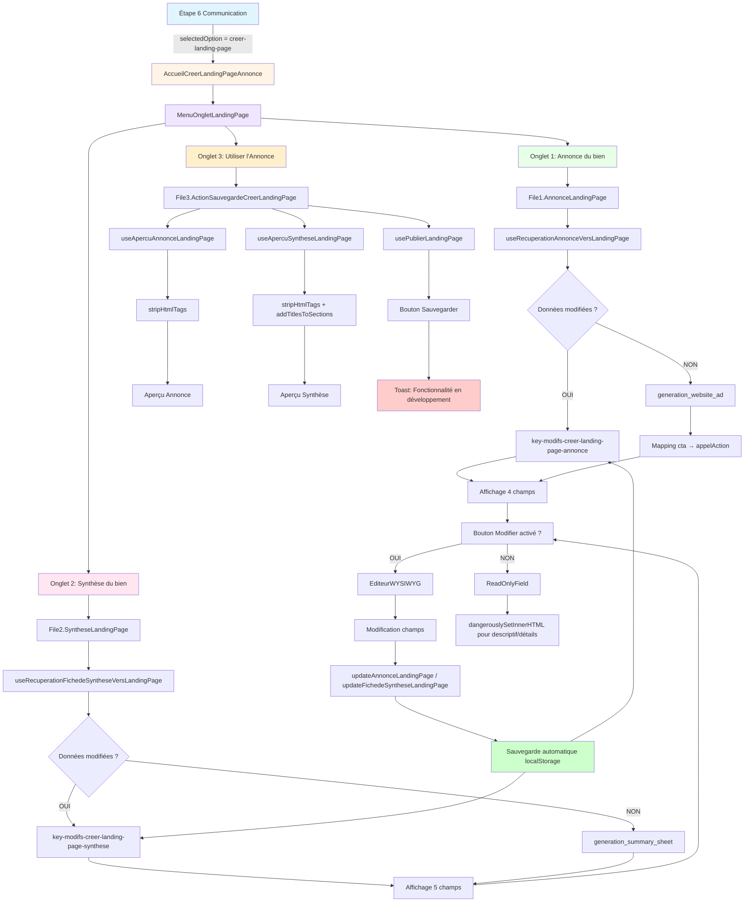
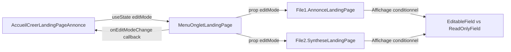
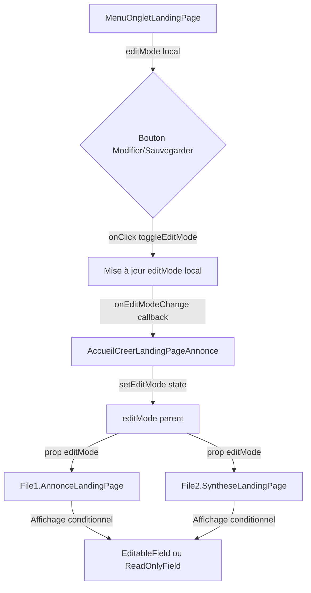

# 📋 DOCUMENTATION TECHNIQUE EXHAUSTIVE
## CANAL : Créer une Landing Page Annonce Dédiée

---

## I. MISSION DU DOCUMENT

Ce document détaille **l'architecture technique complète** du canal **"Créer une Landing Page Annonce Dédiée"** dans l'écosystème **LeadGenAI FormPresenca**.

**Objectif du canal :**
- Permettre à l'utilisateur de **visualiser**, **éditer** et **sauvegarder** deux types d'annonces générées par OpenAI :
  1. **Annonce Landing Page** (4 champs : titre, accroche, descriptif, appel à l'action)
  2. **Synthèse Landing Page** (5 champs : titre, référence & prix, détails clés, données financières, informations complémentaires)
- Préparer les données pour une **future génération de Landing Page via Brevo**

**Fonctionnalités principales :**
- ✅ **Affichage en lecture seule** des annonces générées par OpenAI
- ✅ **Mode édition** avec éditeur WYSIWYG (ReactQuill, toolbar désactivée)
- ✅ **Sauvegarde automatique** dans `localStorage` lors des modifications
- ✅ **Aperçus textuels** nettoyés (HTML strippé) pour prévisualisation
- ⚠️ **Fonction de sauvegarde inactive** (bouton "Sauvegarder l'Annonce" affiche un toast "En développement")

**Future intégration (pas encore implémentée) :**
- Enregistrement dans Supabase (tables `annonces_landing_page`, `syntheses_landing_page`)
- Génération de Landing Page via Brevo (route `/newsletter-builder`)

---

## II. SOMMAIRE CLIQUABLE

1. [Mission du Document](#i-mission-du-document)
2. [Sommaire Cliquable](#ii-sommaire-cliquable)
3. [Architecture Globale - Canal](#iii-architecture-globale---canal)
   - [3.1. Vue d'ensemble du canal](#31-vue-densemble-du-canal)
   - [3.2. Position dans Étape 6 Communication](#32-position-dans-étape-6-communication)
   - [3.3. Schéma Mermaid complet (flux de données)](#33-schéma-mermaid-complet-flux-de-données)
4. [Liste Exhaustive des Fichiers Utilisés](#iv-liste-exhaustive-des-fichiers-utilisés)
   - [4.1. Fichiers de composition](#41-fichiers-de-composition)
   - [4.2. Hooks de récupération](#42-hooks-de-récupération)
   - [4.3. Hooks d'aperçu](#43-hooks-daperçu)
   - [4.4. Hooks de sauvegarde](#44-hooks-de-sauvegarde)
   - [4.5. Composants graphiques](#45-composants-graphiques)
   - [4.6. Arborescence complète avec descriptions](#46-arborescence-complète-avec-descriptions)
5. [Système d'Onglets](#v-système-donglets)
   - [5.1. MenuOngletLandingPage](#51-menuongletlandingpage)
   - [5.2. Onglet 1 : Annonce du bien](#52-onglet-1--annonce-du-bien)
   - [5.3. Onglet 2 : Synthèse du bien](#53-onglet-2--synthèse-du-bien)
   - [5.4. Onglet 3 : Utiliser l'Annonce](#54-onglet-3--utiliser-lannonce)
   - [5.5. Logique de navigation et état](#55-logique-de-navigation-et-état)
6. [Processus de Récupération des Données OpenAI](#vi-processus-de-récupération-des-données-openai)
   - [6.1. Sources de données (clés localStorage)](#61-sources-de-données-clés-localstorage)
   - [6.2. Logique de priorité (modifs > originales)](#62-logique-de-priorité-modifs--originales)
   - [6.3. Hooks de récupération détaillés](#63-hooks-de-récupération-détaillés)
   - [6.4. Mapping des champs OpenAI → Interface](#64-mapping-des-champs-openai--interface)
7. [Structure des Données localStorage](#vii-structure-des-données-localstorage)
   - [7.1. Clés LUES](#71-clés-lues)
   - [7.2. Clés ÉCRITES](#72-clés-écrites)
   - [7.3. Interfaces TypeScript complètes](#73-interfaces-typescript-complètes)
   - [7.4. Tableaux récapitulatifs](#74-tableaux-récapitulatifs)
8. [Processus Complet Étape par Étape](#viii-processus-complet-étape-par-étape)
   - [8.1. Chargement initial](#81-chargement-initial)
   - [8.2. Affichage en mode lecture seule](#82-affichage-en-mode-lecture-seule)
   - [8.3. Activation du mode édition](#83-activation-du-mode-édition)
   - [8.4. Modification des champs](#84-modification-des-champs)
   - [8.5. Sauvegarde automatique](#85-sauvegarde-automatique)
   - [8.6. Sauvegarde finale (inactive)](#86-sauvegarde-finale-inactive)
9. [Système d'Édition - Bouton "Modifier"](#ix-système-dédition---bouton-modifier)
   - [9.1. Localisation](#91-localisation)
   - [9.2. Comportement toggle (Modifier ↔ Sauvegarder)](#92-comportement-toggle-modifier--sauvegarder)
   - [9.3. Propagation de l'état](#93-propagation-de-létat)
   - [9.4. Affichage conditionnel](#94-affichage-conditionnel)
   - [9.5. Nettoyage HTML](#95-nettoyage-html)
   - [9.6. Éditeur WYSIWYG (EditeurWYSIWYG.tsx)](#96-éditeur-wysiwyg-editeurwysiwg)
10. [Système d'Aperçu](#x-système-daperçu)
    - [10.1. Hook Aperçu Annonce Landing Page](#101-hook-aperçu-annonce-landing-page)
    - [10.2. Hook Aperçu Synthèse Landing Page](#102-hook-aperçu-synthèse-landing-page)
    - [10.3. Fonctions détaillées](#103-fonctions-détaillées)
11. [Fonction de Sauvegarde (Inactive)](#xi-fonction-de-sauvegarde-inactive)
    - [11.1. Hook `usePublierLandingPage`](#111-hook-usepublierlandingpage)
    - [11.2. Bouton "Sauvegarder l'Annonce"](#112-bouton-sauvegarder-lannonce)
    - [11.3. Simulation actuelle](#113-simulation-actuelle)
12. [Contraintes et Validation](#xii-contraintes-et-validation)
    - [12.1. Validation des champs (nettoyage HTML)](#121-validation-des-champs-nettoyage-html)
    - [12.2. Gestion des erreurs (loading, error)](#122-gestion-des-erreurs-loading-error)
    - [12.3. Toasts de notification](#123-toasts-de-notification)
    - [12.4. Sécurité](#124-sécurité)
13. [Composants Graphiques Réutilisables](#xiii-composants-graphiques-réutilisables)
    - [13.1. LabelField](#131-labelfield)
    - [13.2. ReadOnlyField](#132-readonlyfield)
    - [13.3. EditableField](#133-editablefield)
    - [13.4. CopyOption3](#134-copyoption3)
    - [13.5. AnnoncePreview](#135-annoncepreview)
14. [Tableaux Récapitulatifs](#xiv-tableaux-récapitulatifs)
    - [14.1. Tableau des champs Annonce Landing Page](#141-tableau-des-champs-annonce-landing-page)
    - [14.2. Tableau des champs Synthèse Landing Page](#142-tableau-des-champs-synthèse-landing-page)
    - [14.3. Tableau des hooks](#143-tableau-des-hooks)
    - [14.4. Tableau des fonctions de sauvegarde](#144-tableau-des-fonctions-de-sauvegarde)
    - [14.5. Matrice Onglets × Actions × Fichiers](#145-matrice-onglets--actions--fichiers)
15. [Données à Prendre en Considération](#xv-données-à-prendre-en-considération)
    - [15.1. Points d'attention techniques](#151-points-dattention-techniques)
    - [15.2. Dépendances critiques](#152-dépendances-critiques)
    - [15.3. Fonctions clés à préserver](#153-fonctions-clés-à-préserver)
    - [15.4. Mapping OpenAI → Interface (cta vs appelAction)](#154-mapping-openai--interface-cta-vs-appelaction)

---

## III. ARCHITECTURE GLOBALE - CANAL

### 3.1. Vue d'ensemble du canal

**Nom du canal :** Créer une Landing Page Annonce Dédiée  
**Route :** `/etape6communication`  
**Condition d'affichage :** `selectedOption === "creer-landing-page"`  
**Composant racine :** ``

**Fonctionnement global :**
1. L'utilisateur accède au canal via le menu de l'Étape 6 Communication
2. Le composant `AccueilCreerLandingPageAnnonce` charge 3 onglets via `MenuOngletLandingPage`
3. Les onglets 1 et 2 affichent les annonces en **mode lecture seule** par défaut
4. L'utilisateur peut activer le **mode édition** via le bouton "Modifier"
5. Les modifications sont **sauvegardées automatiquement** dans `localStorage`
6. L'onglet 3 affiche les **aperçus** et propose un bouton de sauvegarde (actuellement inactif)

### 3.2. Position dans Étape 6 Communication

**Fichier :** `src/1.etapes-restitution-utilisateur/0.Etape6Communication/Etape6Communication.tsx`

**Ligne 18 :**
```typescript
import AccueilCreerLandingPageAnnonce from "@/components/1-Sources-Restitution-Utilisateur/8.EtapeCreerLandingPageAnnonce/AccueilCreerLandingPageAnnonce";
```

**Lignes 69-74 (menu) :**
```typescript
{
  id: "creer-landing-page",
  title: "Créer une Landing Page Annonce Dédiée",
  description: "",
  icon: ,
  route: "/landing-page"
}
```

**Lignes 133-135 (rendu conditionnel) :**
```typescript
if (selectedOption === "creer-landing-page") {
  return ;
}
```

### 3.3. Schéma Mermaid complet (flux de données)



---

## IV. LISTE EXHAUSTIVE DES FICHIERS UTILISÉS

### 4.1. Fichiers de composition

| Fichier | Rôle | Lignes | Localisation |
|---------|------|--------|--------------|
| `AccueilCreerLandingPageAnnonce.tsx` | Composant racine du canal, gère l'état `editMode` et orchestre les 3 onglets | 76 | `src/components/1-Sources-Restitution-Utilisateur/8.EtapeCreerLandingPageAnnonce/` |
| `MenuOngletLandingPage.tsx` | Système d'onglets avec bouton Modifier/Sauvegarder intégré | 175 | `src/components/1-Sources-Restitution-Utilisateur/8.EtapeCreerLandingPageAnnonce/` |
| `File1.AnnonceLandingPage.tsx` | Affiche et édite les 4 champs de l'annonce Landing Page | ~135 | `src/components/1-Sources-Restitution-Utilisateur/8.EtapeCreerLandingPageAnnonce/` |
| `File2.SyntheseLandingPage.tsx` | Affiche et édite les 5 champs de la synthèse Landing Page | ~152 | `src/components/1-Sources-Restitution-Utilisateur/8.EtapeCreerLandingPageAnnonce/` |
| `File3.ActionSauvegardeCreerLandingPage.tsx` | Affiche les aperçus et le bouton de sauvegarde (inactif) | ~61 | `src/components/1-Sources-Restitution-Utilisateur/8.EtapeCreerLandingPageAnnonce/` |

### 4.2. Hooks de récupération

| Hook | Rôle | Lignes | Localisation |
|------|------|--------|--------------|
| `useRecuperationAnnonceVersLandingPage` | Récupère et met à jour les données de l'annonce Landing Page depuis `localStorage` | ~81 | `src/components/1-Sources-Restitution-Utilisateur/8.EtapeCreerLandingPageAnnonce/HookRecuperationAnnonceVersLandingPage.ts` |
| `useRecuperationFichedeSyntheseVersLandingPage` | Récupère et met à jour les données de la synthèse Landing Page depuis `localStorage` | ~81 | `src/components/1-Sources-Restitution-Utilisateur/8.EtapeCreerLandingPageAnnonce/HookRecuperationFichedeSyntheseVersLandingPage.ts` |

### 4.3. Hooks d'aperçu

| Hook | Rôle | Lignes | Localisation |
|------|------|--------|--------------|
| `useApercuAnnonceLandingPage` | Génère l'aperçu textuel de l'annonce Landing Page (HTML strippé) | ~82 | `src/components/1-Sources-Restitution-Utilisateur/8.EtapeCreerLandingPageAnnonce/HookCopierApercuAnnonceLandingPage.tsx` |
| `useApercuSyntheseLandingPage` | Génère l'aperçu textuel de la synthèse Landing Page (HTML strippé + titres de sections ajoutés) | ~101 | `src/components/1-Sources-Restitution-Utilisateur/8.EtapeCreerLandingPageAnnonce/HookCopierApercuSyntheseLandingPage.tsx` |

### 4.4. Hooks de sauvegarde

| Hook | Rôle | Lignes | Localisation |
|------|------|--------|--------------|
| `usePublierLandingPage` | Gère la sauvegarde de l'annonce Landing Page (actuellement inactive, simule un délai et affiche un toast) | ~47 | `src/components/1-Sources-Restitution-Utilisateur/8.EtapeCreerLandingPageAnnonce/HookPublierLandingPage.tsx` |

### 4.5. Composants graphiques

| Composant | Rôle | Lignes | Localisation |
|-----------|------|--------|--------------|
| `GraphismeInterieurLandingPage.tsx` | Bibliothèque de composants UI réutilisables (LabelField, ReadOnlyField, EditableField, CopyOption3, AnnoncePreview) | 249 | `src/components/1-Sources-Restitution-Utilisateur/8.EtapeCreerLandingPageAnnonce/GraphismeInterieurLandingPage.tsx` |
| `EditeurWYSIWYG.tsx` | Éditeur WYSIWYG basé sur ReactQuill avec toolbar désactivée | 90 | `src/components/1-Sources-Restitution-Utilisateur/8.EtapeCreerLandingPageAnnonce/EditeurWYSIWYG.tsx` |

### 4.6. Arborescence complète avec descriptions

```
src/components/1-Sources-Restitution-Utilisateur/8.EtapeCreerLandingPageAnnonce/
│
├── AccueilCreerLandingPageAnnonce.tsx
│   └── Composant racine, gère l'état editMode et les callbacks onDataChange
│
├── MenuOngletLandingPage.tsx
│   └── Système d'onglets avec bouton Modifier/Sauvegarder, gère l'état editMode local
│
├── File1.AnnonceLandingPage.tsx
│   └── Affiche 4 champs (titre, accroche, descriptif, appelAction)
│   └── Utilise useRecuperationAnnonceVersLandingPage
│   └── Nettoie HTML pour titre, accroche, appelAction
│   └── Préserve HTML pour descriptif (dangerouslySetInnerHTML)
│
├── File2.SyntheseLandingPage.tsx
│   └── Affiche 5 champs (titre, referenceEtPrix, detailsCles, donneesFinancieres, informationsComplementaires)
│   └── Utilise useRecuperationFichedeSyntheseVersLandingPage
│   └── Nettoie HTML pour titre uniquement
│   └── Préserve HTML pour les 4 autres champs (dangerouslySetInnerHTML)
│
├── File3.ActionSauvegardeCreerLandingPage.tsx
│   └── Affiche 2 aperçus (Annonce + Synthèse)
│   └── Bouton "Sauvegarder l'Annonce" (inactif)
│   └── Utilise useApercuAnnonceLandingPage, useApercuSyntheseLandingPage, usePublierLandingPage
│
├── HookRecuperationAnnonceVersLandingPage.ts
│   └── Logique de priorité : key-modifs-creer-landing-page-annonce > generation_website_ad
│   └── Mapping cta → appelAction (ligne ~59)
│   └── Fonction updateAnnonceLandingPage (sauvegarde automatique)
│
├── HookRecuperationFichedeSyntheseVersLandingPage.ts
│   └── Logique de priorité : key-modifs-creer-landing-page-synthese > generation_summary_sheet
│   └── Pas de mapping nécessaire (champs identiques)
│   └── Fonction updateFichedeSyntheseLandingPage (sauvegarde automatique)
│
├── HookCopierApercuAnnonceLandingPage.tsx
│   └── Fonction stripHtmlTags (lignes 11-27) : préserve les transitions  → \n\n
│   └── Génère l'aperçu textuel de l'annonce
│
├── HookCopierApercuSyntheseLandingPage.tsx
│   └── Fonction stripHtmlTags (lignes 13-23) : préserve les transitions  → \n\n
│   └── Fonction addTitlesToSections (lignes 26-43) : ajoute les titres de sections
│   └── Génère l'aperçu textuel de la synthèse
│
├── HookPublierLandingPage.tsx
│   └── Fonction publierAnnonceLandingPage (lignes 16-38) : simulation de sauvegarde
│   └── Retourne isPublishing, annonceLandingPage, syntheseLandingPage
│
├── GraphismeInterieurLandingPage.tsx
│   └── LabelField (lignes 14-23)
│   └── ReadOnlyField (lignes 33-51)
│   └── EditableField (lignes 63-95) : intègre EditeurWYSIWYG ou textarea
│   └── CopyOption3 (lignes 181-213) : bouton de sauvegarde
│   └── AnnoncePreview (lignes 236-249) : conteneur d'aperçu
│
└── EditeurWYSIWYG.tsx
    └── ReactQuill avec toolbar: false (ligne 16)
    └── Formats permis mais non accessibles visuellement
    └── Hauteur calculée selon le nombre de lignes (ligne 48)
```

---

## V. SYSTÈME D'ONGLETS

### 5.1. MenuOngletLandingPage

**Fichier :** `MenuOngletLandingPage.tsx`

**Props :**
```typescript
interface MenuOngletLandingPageProps {
  tabTitles?: string[];
  tabContent1?: ReactNode;
  tabContent2?: ReactNode;
  tabContent3?: ReactNode;
  enableEditMode?: boolean;
  onTabChange?: (tabValue: string) => void;
  onEditModeChange?: (isEditMode: boolean) => void;
  className?: string;
}
```

**Valeurs par défaut :**
```typescript
// Ligne 32
tabTitles = ["Annonce du bien", "Synthèse du bien", "Utiliser l'Annonce"]
```

**État local :**
```typescript
// Lignes 41-42
const [activeTab, setActiveTab] = useState("tab1");
const [editMode, setEditMode] = useState(false);
```

**Bouton Modifier/Sauvegarder :**
- **Localisation :** Lignes 94-129
- **Condition d'affichage :** `enableEditMode === true` ET `activeTab === "tab1"` ou `"tab2"`
- **Icônes :** `` (mode lecture) ou `` (mode édition)
- **Callback :** `toggleEditMode()` (ligne 63)

**Logique du toggle :**
```typescript
// Lignes 63-85
const toggleEditMode = () => {
  if (editMode) {
    // Sortie du mode édition
    toast({
      title: "Modifications sauvegardées",
      description: "Vos modifications ont été enregistrées avec succès.",
    });
  }
  setEditMode(!editMode);

  // Notifier le parent
  if (onEditModeChange) {
    onEditModeChange(!editMode);
  }
};
```

### 5.2. Onglet 1 : Annonce du bien

**Composant :** `File1.AnnonceLandingPage.tsx`

**Hook utilisé :** `useRecuperationAnnonceVersLandingPage`

**Champs affichés :**
1. **Titre** (ligne 56-71)
2. **Accroche** (ligne 73-88)
3. **Descriptif** (ligne 90-106)
4. **Appel à l'action** (ligne 108-123)

**Logique de nettoyage HTML :**
```typescript
// Lignes 22-40
const handleChange = (name: string, value: string) => {
  let cleanedValue = value;
  if (name === "titre") {
    // Supprime les balises HTML pour le titre
    cleanedValue = value.replace(/<\/?[^>]+(>|$)/g, "");
  }
  if (name === "accroche") {
    // Supprime les balises HTML pour l'accroche
    cleanedValue = value.replace(/<\/?[^>]+(>|$)/g, "");
  }
  if (name === "appelAction") {
    // Supprime les balises HTML pour l'appel à l'action
    cleanedValue = value.replace(/<\/?[^>]+(>|$)/g, "");
  }

  updateAnnonceLandingPage({ [name]: cleanedValue });

  if (onDataChange) {
    onDataChange({ ...annonceLandingPage, [name]: cleanedValue });
  }
};
```

**Affichage conditionnel :**
```typescript
// Exemple pour le champ "Titre" (lignes 62-70)
{editMode ? (
   handleChange("titre", value)}
    rows={1}
  />
) : (

)}
```

**Particularité :** Le champ "Descriptif" utilise `dangerouslySetInnerHTML` en mode lecture seule (ligne 102)

### 5.3. Onglet 2 : Synthèse du bien

**Composant :** `File2.SyntheseLandingPage.tsx`

**Hook utilisé :** `useRecuperationFichedeSyntheseVersLandingPage`

**Champs affichés :**
1. **Titre** (ligne 57-72)
2. **Référence & Prix** (ligne 74-90)
3. **Détails clés** (ligne 92-109)
4. **Données Financières** (ligne 111-128)
5. **Informations Complémentaires** (ligne 130-147)

**Logique de nettoyage HTML :**
```typescript
// Lignes 22-36
const handleChange = (name: string, value: string) => {
  let cleanedValue = value;
  if (name === "titre") {
    // Supprime les balises HTML uniquement pour le titre
    cleanedValue = value.replace(/<\/?[^>]+(>|$)/g, "");
  }

  updateFichedeSyntheseLandingPage({ [name]: cleanedValue });

  if (onDataChange) {
    onDataChange({ ...fichedeSyntheseLandingPage, [name]: cleanedValue });
  }
};
```

**Particularité :** Les champs Référence & Prix, Détails clés, Données Financières, Informations Complémentaires utilisent `dangerouslySetInnerHTML` en mode lecture seule (préservent le HTML)

### 5.4. Onglet 3 : Utiliser l'Annonce

**Composant :** `File3.ActionSauvegardeCreerLandingPage.tsx`

**Hooks utilisés :**
- `useApercuAnnonceLandingPage()` : Génère l'aperçu textuel de l'annonce
- `useApercuSyntheseLandingPage()` : Génère l'aperçu textuel de la synthèse
- `usePublierLandingPage()` : Gère la sauvegarde (inactive)

**Structure :**
1. **Section : Options de sauvegarde Landing Page** (lignes 23-35)
   - Bouton "Sauvegarder l'Annonce" (inactif)
2. **Aperçu de l'Annonce** (lignes 37-45)
   - Affiche : `${titre}\n\n${accroche}\n\n${descriptif}\n\n${appelAction}`
3. **Aperçu de la Synthèse** (lignes 47-55)
   - Affiche : `${titre}\n\n${referenceEtPrix}\n\n${detailsCles}\n\n${donneesFinancieres}\n\n${informationsComplementaires}`

**Gestion du loading et des erreurs :**
```typescript
// Lignes 40-42
content={isLoadingAnnonce ? "Chargement en cours..." : 
        errorAnnonce ? `Erreur: ${errorAnnonce}` :
        `${annonceLandingPage.titre}\n\n${annonceLandingPage.accroche}...`}
```

### 5.5. Logique de navigation et état

**Gestion de l'état `editMode` :**



**Callback flow :**
```typescript
// AccueilCreerLandingPageAnnonce.tsx, lignes 67-69
onEditModeChange={(isEditMode) => {
  setEditMode(isEditMode);
}}
```

---

## VI. PROCESSUS DE RÉCUPÉRATION DES DONNÉES OPENAI

### 6.1. Sources de données (clés localStorage)

**Clés LUES :**
| Clé localStorage | Type de données | Description |
|------------------|----------------|-------------|
| `generation_website_ad` | JSON | Données originales de l'annonce Landing Page générées par OpenAI |
| `generation_summary_sheet` | JSON | Données originales de la synthèse Landing Page générées par OpenAI |
| `key-modifs-creer-landing-page-annonce` | JSON | Modifications utilisateur de l'annonce Landing Page |
| `key-modifs-creer-landing-page-synthese` | JSON | Modifications utilisateur de la synthèse Landing Page |

**Priorité de lecture :**
1. **1ère priorité :** Données modifiées (`key-modifs-*`)
2. **2ème priorité :** Données originales OpenAI (`generation_*`)

### 6.2. Logique de priorité (modifs > originales)

**Annonce Landing Page :**
```typescript
// HookRecuperationAnnonceVersLandingPage.ts, lignes 18-57
useEffect(() => {
  try {
    setIsLoading(true);

    // Vérifier d'abord s'il existe des données modifiées
    const modifiedDataJson = localStorage.getItem('key-modifs-creer-landing-page-annonce');

    if (modifiedDataJson) {
      // Utiliser les données modifiées si elles existent
      const modifiedData = JSON.parse(modifiedDataJson);
      setAnnonceLandingPage({
        titre: modifiedData.titre || '',
        accroche: modifiedData.accroche || '',
        descriptif: modifiedData.descriptif || '',
        appelAction: modifiedData.appelAction || ''
      });
    } else {
      // Sinon, récupération des données originales depuis le localStorage
      const annonceLandingPageData = localStorage.getItem('generation_website_ad');

      if (annonceLandingPageData) {
        const parsedData = JSON.parse(annonceLandingPageData);
        setAnnonceLandingPage({
          titre: parsedData.titre || '',
          accroche: parsedData.accroche || '',
          descriptif: parsedData.descriptif || '',
          appelAction: parsedData.cta || '' // ⚠️ Mapping cta → appelAction
        });
      }
    }

    setIsLoading(false);
  } catch (err) {
    setError('Erreur lors de la récupération des données');
    setIsLoading(false);
  }
}, []);
```

**Synthèse Landing Page :**
```typescript
// HookRecuperationFichedeSyntheseVersLandingPage.ts, lignes 18-57
useEffect(() => {
  try {
    setIsLoading(true);

    const modifiedDataJson = localStorage.getItem('key-modifs-creer-landing-page-synthese');

    if (modifiedDataJson) {
      const modifiedData = JSON.parse(modifiedDataJson);
      setFichedeSyntheseLandingPage({
        titre: modifiedData.titre || '',
        referenceEtPrix: modifiedData.referenceEtPrix || '',
        detailsCles: modifiedData.detailsCles || '',
        donneesFinancieres: modifiedData.donneesFinancieres || '',
        informationsComplementaires: modifiedData.informationsComplementaires || ''
      });
    } else {
      const syntheseLandingPageData = localStorage.getItem('generation_summary_sheet');

      if (syntheseLandingPageData) {
        const parsedData = JSON.parse(syntheseLandingPageData);
        setFichedeSyntheseLandingPage({
          titre: parsedData.titre || '',
          referenceEtPrix: parsedData.referenceEtPrix || '',
          detailsCles: parsedData.detailsCles || '',
          donneesFinancieres: parsedData.donneesFinancieres || '',
          informationsComplementaires: parsedData.informationsComplementaires || ''
        });
      }
    }

    setIsLoading(false);
  } catch (err) {
    setError('Erreur lors de la récupération des données');
    setIsLoading(false);
  }
}, []);
```

### 6.3. Hooks de récupération détaillés

**Hook `useRecuperationAnnonceVersLandingPage` :**
- **Fichier :** `HookRecuperationAnnonceVersLandingPage.ts`
- **État géré :** `annonceLandingPage`, `isLoading`, `error`
- **Fonction d'update :** `updateAnnonceLandingPage(newData: Partial)`
- **Sauvegarde :** Ligne 63 → `localStorage.setItem('key-modifs-creer-landing-page-annonce', JSON.stringify(updatedData))`

**Hook `useRecuperationFichedeSyntheseVersLandingPage` :**
- **Fichier :** `HookRecuperationFichedeSyntheseVersLandingPage.ts`
- **État géré :** `fichedeSyntheseLandingPage`, `isLoading`, `error`
- **Fonction d'update :** `updateFichedeSyntheseLandingPage(newData: Partial)`
- **Sauvegarde :** Ligne 63 → `localStorage.setItem('key-modifs-creer-landing-page-synthese', JSON.stringify(updatedData))`

### 6.4. Mapping des champs OpenAI → Interface

**Annonce Landing Page :**

| Champ OpenAI (`generation_website_ad`) | Champ Interface (`AnnonceLandingPageData`) | Fichier | Ligne |
|-----------------------------------------|---------------------------------------------|---------|-------|
| `titre` | `titre` | `HookRecuperationAnnonceVersLandingPage.ts` | 43 |
| `accroche` | `accroche` | `HookRecuperationAnnonceVersLandingPage.ts` | 44 |
| `descriptif` | `descriptif` | `HookRecuperationAnnonceVersLandingPage.ts` | 45 |
| **`cta`** | **`appelAction`** | `HookRecuperationAnnonceVersLandingPage.ts` | **46** ⚠️ |

**Synthèse Landing Page (pas de mapping nécessaire) :**

| Champ OpenAI (`generation_summary_sheet`) | Champ Interface (`FichedeSyntheseLandingPageData`) | Cohérence |
|--------------------------------------------|------------------------------------------------|-----------|
| `titre` | `titre` | ✅ Identique |
| `referenceEtPrix` | `referenceEtPrix` | ✅ Identique |
| `detailsCles` | `detailsCles` | ✅ Identique |
| `donneesFinancieres` | `donneesFinancieres` | ✅ Identique |
| `informationsComplementaires` | `informationsComplementaires` | ✅ Identique |

---

## VII. STRUCTURE DES DONNÉES localStorage

### 7.1. Clés LUES

| Clé | Type | Utilisation | Hook lecteur |
|-----|------|------------|--------------|
| `generation_website_ad` | JSON | Données originales annonce OpenAI | `useRecuperationAnnonceVersLandingPage` |
| `generation_summary_sheet` | JSON | Données originales synthèse OpenAI | `useRecuperationFichedeSyntheseVersLandingPage` |
| `key-modifs-creer-landing-page-annonce` | JSON | Modifications utilisateur annonce | `useRecuperationAnnonceVersLandingPage`, `useApercuAnnonceLandingPage` |
| `key-modifs-creer-landing-page-synthese` | JSON | Modifications utilisateur synthèse | `useRecuperationFichedeSyntheseVersLandingPage`, `useApercuSyntheseLandingPage` |

### 7.2. Clés ÉCRITES

| Clé | Fonction d'écriture | Hook écrivain | Déclenchement |
|-----|---------------------|---------------|---------------|
| `key-modifs-creer-landing-page-annonce` | `localStorage.setItem()` | `useRecuperationAnnonceVersLandingPage` | `updateAnnonceLandingPage()` appelé à chaque modification de champ |
| `key-modifs-creer-landing-page-synthese` | `localStorage.setItem()` | `useRecuperationFichedeSyntheseVersLandingPage` | `updateFichedeSyntheseLandingPage()` appelé à chaque modification de champ |

### 7.3. Interfaces TypeScript complètes

**Interface `AnnonceLandingPageData` :**
```typescript
// HookRecuperationAnnonceVersLandingPage.ts, lignes 3-8
interface AnnonceLandingPageData {
  titre: string;
  accroche: string;
  descriptif: string;
  appelAction: string;
}
```

**Interface `FichedeSyntheseLandingPageData` :**
```typescript
// HookRecuperationFichedeSyntheseVersLandingPage.ts, lignes 4-10
interface FichedeSyntheseLandingPageData {
  titre: string;
  referenceEtPrix: string;
  detailsCles: string;
  donneesFinancieres: string;
  informationsComplementaires: string;
}
```

**Interface `SyntheseLandingPageData` (pour aperçus) :**
```typescript
// HookCopierApercuSyntheseLandingPage.tsx, lignes 4-10
interface SyntheseLandingPageData {
  titre: string;
  referenceEtPrix: string;
  detailsCles: string;
  donneesFinancieres: string;
  informationsComplementaires: string;
}
```

### 7.4. Tableaux récapitulatifs

**Tableau de correspondance localStorage → Hooks :**

| Données | Clé localStorage originale | Clé localStorage modifiée | Hook de lecture | Hook d'aperçu |
|---------|---------------------------|---------------------------|-----------------|---------------|
| Annonce Landing Page | `generation_website_ad` | `key-modifs-creer-landing-page-annonce` | `useRecuperationAnnonceVersLandingPage` | `useApercuAnnonceLandingPage` |
| Synthèse Landing Page | `generation_summary_sheet` | `key-modifs-creer-landing-page-synthese` | `useRecuperationFichedeSyntheseVersLandingPage` | `useApercuSyntheseLandingPage` |

---

## VIII. PROCESSUS COMPLET ÉTAPE PAR ÉTAPE

### 8.1. Chargement initial

**Étape 1 : L'utilisateur clique sur "Créer une Landing Page Annonce Dédiée"**
```typescript
// Etape6Communication.tsx, ligne 134
if (selectedOption === "creer-landing-page") {
  return ;
}
```

**Étape 2 : `AccueilCreerLandingPageAnnonce` monte et initialise l'état**
```typescript
// AccueilCreerLandingPageAnnonce.tsx, lignes 17-19
const [editMode, setEditMode] = useState(false);
const [annonceLandingPageData, setAnnonceLandingPageData] = useState({});
const [syntheseLandingPageData, setSyntheseLandingPageData] = useState({});
```

**Étape 3 : `MenuOngletLandingPage` affiche l'onglet 1 par défaut**
```typescript
// MenuOngletLandingPage.tsx, ligne 41
const [activeTab, setActiveTab] = useState("tab1");
```

**Étape 4 : `File1.AnnonceLandingPage` déclenche `useRecuperationAnnonceVersLandingPage`**
```typescript
// File1.AnnonceLandingPage.tsx, ligne 19
const { annonceLandingPage, updateAnnonceLandingPage, isLoading, error } = useRecuperationAnnonceVersLandingPage();
```

**Étape 5 : Le hook vérifie `localStorage` et charge les données**
```typescript
// HookRecuperationAnnonceVersLandingPage.ts, lignes 23-46
const modifiedDataJson = localStorage.getItem('key-modifs-creer-landing-page-annonce');

if (modifiedDataJson) {
  // Charger les données modifiées
  const modifiedData = JSON.parse(modifiedDataJson);
  setAnnonceLandingPage({ ...modifiedData });
} else {
  // Charger les données originales OpenAI
  const annonceLandingPageData = localStorage.getItem('generation_website_ad');
  const parsedData = JSON.parse(annonceLandingPageData);
  setAnnonceLandingPage({
    titre: parsedData.titre || '',
    accroche: parsedData.accroche || '',
    descriptif: parsedData.descriptif || '',
    appelAction: parsedData.cta || '' // Mapping cta → appelAction
  });
}
```

### 8.2. Affichage en mode lecture seule

**Par défaut, `editMode = false`**

**Rendu des champs :**
```typescript
// File1.AnnonceLandingPage.tsx, lignes 62-70
{editMode ? (

) : (

)}
```

**Composant `ReadOnlyField` :**
```typescript
// GraphismeInterieurLandingPage.tsx, lignes 33-51
export const ReadOnlyField: React.FC = ({ 
  id, content, isDescriptif = false, className
}) => {
  return (

      {isDescriptif ? (

      ) : (
        {content}
      )}

  );
};
```

**Champs utilisant `dangerouslySetInnerHTML` :**
- `Descriptif` (Annonce Landing Page)
- `Référence & Prix`, `Détails clés`, `Données Financières`, `Informations Complémentaires` (Synthèse Landing Page)

### 8.3. Activation du mode édition

**L'utilisateur clique sur le bouton "Modifier"**
```typescript
// MenuOngletLandingPage.tsx, lignes 94-129

  {editMode ? (
    <>Sauvegarder
  ) : (
    <>Modifier
  )}

```

**Fonction `toggleEditMode` :**
```typescript
// MenuOngletLandingPage.tsx, lignes 63-85
const toggleEditMode = () => {
  if (editMode) {
    toast({
      title: "Modifications sauvegardées",
      description: "Vos modifications ont été enregistrées avec succès.",
    });
  }
  setEditMode(!editMode);

  if (onEditModeChange) {
    onEditModeChange(!editMode);
  }
};
```

**Propagation de l'état :**
```typescript
// AccueilCreerLandingPageAnnonce.tsx, lignes 67-69
onEditModeChange={(isEditMode) => {
  setEditMode(isEditMode);
}}
```

### 8.4. Modification des champs

**Rendu du champ éditable :**
```typescript
// File1.AnnonceLandingPage.tsx, lignes 62-70
{editMode ? (
   handleChange("titre", value)}
    rows={1}
  />
) : (

)}
```

**Composant `EditableField` (avec WYSIWYG) :**
```typescript
// GraphismeInterieurLandingPage.tsx, lignes 63-95
export const EditableField: React.FC = ({ 
  id, value, onChange, rows = 3, className, useWysiwyg = false
}) => {
  if (useWysiwyg) {
    const simpleMode = rows <= 3;

    return (

    );
  }

  return (
     onChange(e.target.value)} 
      className={cn("w-full rounded-md border border-gray-200 p-3", className)}
      rows={rows}
    />
  );
};
```

**Utilisation de l'éditeur WYSIWYG :**
```typescript
// File1.AnnonceLandingPage.tsx, ligne 98
<EditableField
  id="descriptif-landing-page"
  value={annonceLandingPage.descriptif}
  onChange={(value) => handleChange("descriptif", value)}
  rows={10}
  useWysiwyg={true} // ⚠️ Active EditeurWYSIWYG
/>
```

### 8.5. Sauvegarde automatique

**À chaque modification, `handleChange` est appelé :**
```typescript
// File1.AnnonceLandingPage.tsx, lignes 22-40
const handleChange = (name: string, value: string) => {
  // Nettoyage HTML pour certains champs
  let cleanedValue = value;
  if (name === "titre") {
    cleanedValue = value.replace(/<\/?[^>]+(>|$)/g, "");
  }
  if (name === "accroche") {
    cleanedValue = value.replace(/<\/?[^>]+(>|$)/g, "");
  }
  if (name === "appelAction") {
    cleanedValue = value.replace(/<\/?[^>]+(>|$)/g, "");
  }

  // Sauvegarde automatique dans localStorage
  updateAnnonceLandingPage({ [name]: cleanedValue });

  // Notification du parent (optionnel)
  if (onDataChange) {
    onDataChange({ ...annonceLandingPage, [name]: cleanedValue });
  }
};
```

**Fonction `updateAnnonceLandingPage` :**
```typescript
// HookRecuperationAnnonceVersLandingPage.ts, lignes 59-70
const updateAnnonceLandingPage = (newData: Partial<AnnonceLandingPageData>) => {
  const updatedData = { ...annonceLandingPage, ...newData };
  setAnnonceLandingPage(updatedData);

  try {
    // Sauvegarde des modifications dans localStorage
    localStorage.setItem('key-modifs-creer-landing-page-annonce', JSON.stringify(updatedData));
  } catch (err) {
    setError('Erreur lors de la sauvegarde des données');
  }
};
```

**⚠️ Point important :** La sauvegarde est **automatique et immédiate** à chaque modification de champ. Le bouton "Sauvegarder" sert uniquement à sortir du mode édition.

### 8.6. Sauvegarde finale (inactive)

**L'utilisateur clique sur "Sauvegarder" (bouton du menu) :**
```typescript
// MenuOngletLandingPage.tsx, lignes 63-85
const toggleEditMode = () => {
  if (editMode) {
    // Affichage du toast de confirmation
    toast({
      title: "Modifications sauvegardées",
      description: "Vos modifications ont été enregistrées avec succès.",
    });
  }
  setEditMode(!editMode);

  if (onEditModeChange) {
    onEditModeChange(!editMode);
  }
};
```

**Dans l'onglet 3, bouton "Sauvegarder l'Annonce" (inactive) :**
```typescript
// File3.ActionSauvegardeCreerLandingPage.tsx, lignes 23-35
<CopyOption3
  title="Sauvegarder cette annonce"
  description="Fonction pour utiliser cette annonce pour créer votre Landing Page"
  icon={<Send className="h-5 w-5" />}
  buttons={[
    {
      text: "Sauvegarder l'Annonce",
      onClick: publierAnnonceLandingPage // ⚠️ Fonction inactive
    }
  ]}
/>
```

**Fonction `publierAnnonceLandingPage` (simulation) :**
```typescript
// HookPublierLandingPage.tsx, lignes 16-38
const publierAnnonceLandingPage = async () => {
  setIsPublishing(true);

  try {
    // Simulation d'un délai de sauvegarde
    await new Promise(resolve => setTimeout(resolve, 1500));

    toast({
      title: "Annonce sauvegardée",
      description: "Votre annonce Landing Page a été sauvegardée avec succès.",
    });
  } catch (error) {
    toast({
      title: "Erreur lors de la sauvegarde",
      description: "Une erreur est survenue lors de la sauvegarde.",
      variant: "destructive",
    });
  } finally {
    setIsPublishing(false);
  }
};
```

---

## IX. SYSTÈME D'ÉDITION - BOUTON "MODIFIER"

### 9.1. Localisation

**Fichier :** `MenuOngletLandingPage.tsx`

**Lignes :** 94-129

**Condition d'affichage :**
```typescript
// Ligne 93
{enableEditMode && (activeTab === "tab1" || activeTab === "tab2") && (
  <Button onClick={toggleEditMode} variant="outline">
    ...
  </Button>
)}
```

**Résultat :** Le bouton Modifier/Sauvegarder est affiché **uniquement dans les onglets 1 et 2** (Annonce du bien et Synthèse du bien), et **uniquement si `enableEditMode = true`**.

### 9.2. Comportement toggle (Modifier ↔ Sauvegarder)

**État initial :** `editMode = false` → Affichage "Modifier"

**1er clic (Modifier) :**
```typescript
// Lignes 63-85
const toggleEditMode = () => {
  if (editMode) {
    // Sortie du mode édition
    toast({
      title: "Modifications sauvegardées",
      description: "Vos modifications ont été enregistrées avec succès.",
    });
  }
  setEditMode(!editMode); // false → true

  if (onEditModeChange) {
    onEditModeChange(!editMode); // Notifie le parent
  }
};
```

**Résultat :** `editMode = true` → Affichage "Sauvegarder" + Les champs passent en mode édition

**2ème clic (Sauvegarder) :**
```typescript
if (editMode) { // true
  toast({
    title: "Modifications sauvegardées",
    description: "Vos modifications ont été enregistrées avec succès.",
  });
}
setEditMode(!editMode); // true → false
```

**Résultat :** `editMode = false` → Affichage "Modifier" + Les champs repassent en mode lecture seule + Toast de confirmation

### 9.3. Propagation de l'état

**Flux de propagation :**



**Code du callback :**
```typescript
// AccueilCreerLandingPageAnnonce.tsx, lignes 61-70
<MenuOngletLandingPage
  enableEditMode={true}
  tabContent1={contentTab1}
  tabContent2={contentTab2}
  tabContent3={contentTab3}
  className="mt-0"
  onEditModeChange={(isEditMode) => {
    setEditMode(isEditMode);
  }}
/>
```

### 9.4. Affichage conditionnel

**Dans `File1.AnnonceLandingPage.tsx` :**

**Exemple pour le champ "Titre" (lignes 56-71) :**
```typescript
<LabelField htmlFor="titre-landing-page">
  Titre de l'annonce
</LabelField>
{editMode ? (
  <EditableField
    id="titre-landing-page"
    value={annonceLandingPage.titre}
    onChange={(value) => handleChange("titre", value)}
    rows={1}
  />
) : (
  <ReadOnlyField 
    id="titre-landing-page" 
    content={annonceLandingPage.titre} 
  />
)}
```

**Exemple pour le champ "Descriptif" (lignes 90-106) :**
```typescript
<LabelField htmlFor="descriptif-landing-page">
  Descriptif complet
</LabelField>
{editMode ? (
  <EditableField
    id="descriptif-landing-page"
    value={annonceLandingPage.descriptif}
    onChange={(value) => handleChange("descriptif", value)}
    rows={10}
    useWysiwyg={true} // ⚠️ Éditeur WYSIWYG pour le descriptif
  />
) : (
  <ReadOnlyField 
    id="descriptif-landing-page" 
    content={annonceLandingPage.descriptif} 
    isDescriptif={true} // ⚠️ dangerouslySetInnerHTML activé
  />
)}
```

### 9.5. Nettoyage HTML

**Annonce Landing Page (3 champs nettoyés) :**
```typescript
// File1.AnnonceLandingPage.tsx, lignes 22-40
const handleChange = (name: string, value: string) => {
  let cleanedValue = value;
  if (name === "titre") {
    cleanedValue = value.replace(/<\/?[^>]+(>|$)/g, ""); // Supprime les balises HTML
  }
  if (name === "accroche") {
    cleanedValue = value.replace(/<\/?[^>]+(>|$)/g, "");
  }
  if (name === "appelAction") {
    cleanedValue = value.replace(/<\/?[^>]+(>|$)/g, "");
  }
  // Le champ "descriptif" n'est PAS nettoyé (HTML préservé)

  updateAnnonceLandingPage({ [name]: cleanedValue });

  if (onDataChange) {
    onDataChange({ ...annonceLandingPage, [name]: cleanedValue });
  }
};
```

**Synthèse Landing Page (1 seul champ nettoyé) :**
```typescript
// File2.SyntheseLandingPage.tsx, lignes 22-36
const handleChange = (name: string, value: string) => {
  let cleanedValue = value;
  if (name === "titre") {
    cleanedValue = value.replace(/<\/?[^>]+(>|$)/g, ""); // Seul le titre est nettoyé
  }
  // Les 4 autres champs (referenceEtPrix, detailsCles, donneesFinancieres, informationsComplementaires) 
  // ne sont PAS nettoyés (HTML préservé)

  updateFichedeSyntheseLandingPage({ [name]: cleanedValue });

  if (onDataChange) {
    onDataChange({ ...fichedeSyntheseLandingPage, [name]: cleanedValue });
  }
};
```

**Tableau récapitulatif du nettoyage HTML :**

| Champ | Annonce Landing Page | Synthèse Landing Page |
|-------|----------------------|----------------------|
| Titre | ✅ HTML nettoyé | ✅ HTML nettoyé |
| Accroche | ✅ HTML nettoyé | N/A |
| Descriptif | ❌ HTML préservé | N/A |
| Appel à l'action | ✅ HTML nettoyé | N/A |
| Référence & Prix | N/A | ❌ HTML préservé |
| Détails clés | N/A | ❌ HTML préservé |
| Données Financières | N/A | ❌ HTML préservé |
| Informations Complémentaires | N/A | ❌ HTML préservé |

### 9.6. Éditeur WYSIWYG (EditeurWYSIWYG.tsx)

**Fichier :** `EditeurWYSIWYG.tsx`

**Bibliothèque utilisée :** `react-quill` (ligne 3)

**Configuration critique :**
```typescript
// Lignes 14-24
const defaultModules = {
  toolbar: false // ⚠️ CHOIX STRATÉGIQUE LEADGENAI : Barre d'outils désactivée
};

const formats = [
  'header',
  'bold', 'italic', 'underline', 'strike',
  'list', 'bullet'
];
```

**Pourquoi `toolbar: false` ?**
- Simplifier l'interface utilisateur (éviter la surcharge visuelle)
- Éviter les erreurs de formatage de l'utilisateur
- L'utilisateur peut éditer le texte, mais **pas le formater visuellement**
- Les formats sont **permis** mais **non accessibles visuellement**

**Style personnalisé :**
```typescript
// Lignes 51-55
const editorStyle = {
  height: editorHeight,
  fontSize: '18px', // Augmenté à 18px
  fontFamily: 'Nunito, sans-serif'
};
```

**CSS inline pour cacher la toolbar :**
```typescript
// Lignes 69-85
<style>{`
  .quill-custom-font .ql-editor {
    font-size: 18px;
    font-family: 'Nunito', sans-serif;
    line-height: 1.6;
  }

  /* Cacher la barre d'outils */
  .quill-custom-font .ql-toolbar {
    display: none;
  }

  /* Ajuster la hauteur sans la barre d'outils */
  .quill-custom-font .ql-container {
    border-top: 1px solid #ccc;
  }
`}</style>
```

**Utilisation dans `EditableField` :**
```typescript
// GraphismeInterieurLandingPage.tsx, lignes 71-84
if (useWysiwyg) {
  const simpleMode = rows <= 3;

  return (
    <EditeurWYSIWYG
      value={value}
      onChange={onChange}
      rows={rows}
      className={cn("w-full", className)}
      simpleMode={simpleMode}
    />
  );
}
```

---

## X. SYSTÈME D'APERÇU

### 10.1. Hook Aperçu Annonce Landing Page

**Hook :** `useApercuAnnonceLandingPage`

**Fichier :** `HookCopierApercuAnnonceLandingPage.tsx`

**Fonction `stripHtmlTags` :**
```typescript
// Lignes 11-27
const stripHtmlTags = (html: string): string => {
  if (!html) return '';

  // Remplacer les balises </p><p> par des doubles sauts de ligne
  let text = html.replace(/<\/p>\s*<p>/gi, '\n\n');

  // Supprimer toutes les autres balises HTML
  text = text.replace(/<\/?[^>]+(>|$)/g, '');

  // Nettoyer les espaces multiples et les sauts de ligne en trop
  text = text.replace(/\n{3,}/g, '\n\n');
  text = text.trim();

  return text;
};
```

**Logique de priorité :**
```typescript
// Lignes 39-73
useEffect(() => {
  try {
    setIsLoading(true);

    // Vérifier d'abord s'il existe des données modifiées
    const modifiedDataJson = localStorage.getItem('key-modifs-creer-landing-page-annonce');

    if (modifiedDataJson) {
      // Utiliser les données modifiées si elles existent
      const modifiedData = JSON.parse(modifiedDataJson);
      setApercuAnnonceLandingPage({
        titre: stripHtmlTags(modifiedData.titre || ''),
        accroche: stripHtmlTags(modifiedData.accroche || ''),
        descriptif: stripHtmlTags(modifiedData.descriptif || ''),
        appelAction: stripHtmlTags(modifiedData.appelAction || '')
      });
    } else {
      // Sinon, récupération des données originales
      const annonceLandingPageData = localStorage.getItem('generation_website_ad');

      if (annonceLandingPageData) {
        const parsedData = JSON.parse(annonceLandingPageData);
        setApercuAnnonceLandingPage({
          titre: stripHtmlTags(parsedData.titre || ''),
          accroche: stripHtmlTags(parsedData.accroche || ''),
          descriptif: stripHtmlTags(parsedData.descriptif || ''),
          appelAction: stripHtmlTags(parsedData.cta || '') // Mapping cta → appelAction
        });
      }
    }

    setIsLoading(false);
  } catch (err) {
    setError('Erreur lors de la récupération des données');
    setIsLoading(false);
  }
}, []);
```

**Retour du hook :**
```typescript
// Lignes 75-80
return { 
  annonceLandingPage: ApercuAnnonceLandingPage, 
  isLoading, 
  error 
};
```

### 10.2. Hook Aperçu Synthèse Landing Page

**Hook :** `useApercuSyntheseLandingPage`

**Fichier :** `HookCopierApercuSyntheseLandingPage.tsx`

**Fonction `stripHtmlTags` :**
```typescript
// Lignes 13-23
const stripHtmlTags = (html: string): string => {
  if (!html) return '';

  let text = html.replace(/<\/p>\s*<p>/gi, '\n\n');
  text = text.replace(/<\/?[^>]+(>|$)/g, '');
  text = text.replace(/\n{3,}/g, '\n\n');
  text = text.trim();

  return text;
};
```

**Fonction `addTitlesToSections` (lignes 26-43) :**
```typescript
const addTitlesToSections = (data: SyntheseLandingPageData): SyntheseLandingPageData => {
  return {
    titre: data.titre,
    referenceEtPrix: data.referenceEtPrix ? `${data.referenceEtPrix}` : '',
    detailsCles: data.detailsCles ? `Présentation | Détails clés\n${data.detailsCles}` : '',
    donneesFinancieres: data.donneesFinancieres ? `Présentation | Données Financières\n${data.donneesFinancieres}` : '',
    informationsComplementaires: data.informationsComplementaires ? `Présentation | Informations Complémentaires\n${data.informationsComplementaires}` : '',
  };
};
```

**⚠️ Différence avec l'annonce :** La synthèse ajoute automatiquement les **titres de sections** aux champs `detailsCles`, `donneesFinancieres`, `informationsComplementaires`.

**Logique de priorité :**
```typescript
// Lignes 56-91
useEffect(() => {
  try {
    setIsLoading(true);

    const modifiedDataJson = localStorage.getItem('key-modifs-creer-landing-page-synthese');

    if (modifiedDataJson) {
      const modifiedData = JSON.parse(modifiedDataJson);
      setApercuSyntheseLandingPage(addTitlesToSections({
        titre: stripHtmlTags(modifiedData.titre || ''),
        referenceEtPrix: stripHtmlTags(modifiedData.referenceEtPrix || ''),
        detailsCles: stripHtmlTags(modifiedData.detailsCles || ''),
        donneesFinancieres: stripHtmlTags(modifiedData.donneesFinancieres || ''),
        informationsComplementaires: stripHtmlTags(modifiedData.informationsComplementaires || '')
      }));
    } else {
      const syntheseLandingPageData = localStorage.getItem('generation_summary_sheet');

      if (syntheseLandingPageData) {
        const parsedData = JSON.parse(syntheseLandingPageData);
        setApercuSyntheseLandingPage(addTitlesToSections({
          titre: stripHtmlTags(parsedData.titre || ''),
          referenceEtPrix: stripHtmlTags(parsedData.referenceEtPrix || ''),
          detailsCles: stripHtmlTags(parsedData.detailsCles || ''),
          donneesFinancieres: stripHtmlTags(parsedData.donneesFinancieres || ''),
          informationsComplementaires: stripHtmlTags(parsedData.informationsComplementaires || '')
        }));
      }
    }

    setIsLoading(false);
  } catch (err) {
    setError('Erreur lors de la récupération des données');
    setIsLoading(false);
  }
}, []);
```

### 10.3. Fonctions détaillées

**Affichage des aperçus dans `File3.ActionSauvegardeCreerLandingPage.tsx` :**

**Aperçu Annonce (lignes 37-45) :**
```typescript
<AnnoncePreview title="Aperçu de l'Annonce">
  <ReadOnlyField
    id="apercu-landing-page-publier"
    content={isLoadingAnnonce ? "Chargement en cours..." : 
            errorAnnonce ? `Erreur: ${errorAnnonce}` :
            `${annonceLandingPage.titre}\n\n${annonceLandingPage.accroche}\n\n${annonceLandingPage.descriptif}\n\n${annonceLandingPage.appelAction}`}
  />
</AnnoncePreview>
```

**Aperçu Synthèse (lignes 47-55) :**
```typescript
<AnnoncePreview title="Aperçu de la Synthèse">
  <ReadOnlyField
    id="apercu-synthese-landing-page-publier"
    content={isLoadingSynthese ? "Chargement en cours..." : 
            errorSynthese ? `Erreur: ${errorSynthese}` :
            `${syntheseLandingPage.titre}\n\n${syntheseLandingPage.referenceEtPrix}\n\n${syntheseLandingPage.detailsCles}\n\n${syntheseLandingPage.donneesFinancieres}\n\n${syntheseLandingPage.informationsComplementaires}`}
  />
</AnnoncePreview>
```

**Structure de l'aperçu Synthèse (exemple) :**
```
[Titre de la synthèse]

Référence : REF123
Prix : 150 000€

Présentation | Détails clés
Surface : 80m²
Nombre de pièces : 3

Présentation | Données Financières
Chiffre d'affaires : 200 000€
EBE : 50 000€

Présentation | Informations Complémentaires
Emplacement : Centre-ville
État : Bon état général
```

---

## XI. FONCTION DE SAUVEGARDE (INACTIVE)

### 11.1. Hook `usePublierLandingPage`

**Fichier :** `HookPublierLandingPage.tsx`

**État géré :**
```typescript
// Lignes 7-9
const { toast } = useToast();
const [isPublishing, setIsPublishing] = useState(false);
```

**Récupération des données :**
```typescript
// Lignes 11-12
const { annonceLandingPage } = useApercuAnnonceLandingPage();
const { syntheseLandingPage } = useApercuSyntheseLandingPage();
```

**Fonction de sauvegarde (simulation) :**
```typescript
// Lignes 16-38
const publierAnnonceLandingPage = async () => {
  setIsPublishing(true);

  try {
    // Simulation d'un délai de sauvegarde
    await new Promise(resolve => setTimeout(resolve, 1500));

    toast({
      title: "Annonce sauvegardée",
      description: "Votre annonce Landing Page a été sauvegardée avec succès.",
    });
  } catch (error) {
    toast({
      title: "Erreur lors de la sauvegarde",
      description: "Une erreur est survenue lors de la sauvegarde.",
      variant: "destructive",
    });
    console.error("Erreur de sauvegarde:", error);
  } finally {
    setIsPublishing(false);
  }
};
```

**Retour du hook :**
```typescript
// Lignes 40-46
return {
  publierAnnonceLandingPage,
  isPublishing,
  // Renvoyer les données des annonces pour un accès facile dans le composant
  annonceLandingPage,
  syntheseLandingPage
};
```

### 11.2. Bouton "Sauvegarder l'Annonce"

**Fichier :** `File3.ActionSauvegardeCreerLandingPage.tsx`

**Utilisation du hook :**
```typescript
// Lignes 17-20
const { 
  publierAnnonceLandingPage, 
  isPublishing
} = usePublierLandingPage();
```

**Bouton de sauvegarde :**
```typescript
// Lignes 23-35
<CopyOptionsContainer>
  <CopyOption3
    title="Sauvegarder cette annonce"
    description="Fonction pour utiliser cette annonce pour créer votre Landing Page"
    icon={<Send className="h-5 w-5" />}
    buttons={[
      {
        text: "Sauvegarder l'Annonce",
        onClick: publierAnnonceLandingPage
      }
    ]}
  />
</CopyOptionsContainer>
```

### 11.3. Simulation actuelle

**Fonctionnement actuel :**
1. L'utilisateur clique sur "Sauvegarder l'Annonce"
2. `setIsPublishing(true)` → Le bouton pourrait afficher un loader (non implémenté)
3. Attente de 1,5 secondes (`await new Promise(resolve => setTimeout(resolve, 1500))`)
4. Affichage d'un toast de succès : "Annonce sauvegardée"
5. `setIsPublishing(false)`

**Aucune action réelle :**
- ❌ Pas d'enregistrement dans Supabase
- ❌ Pas d'appel à une API externe (Brevo)
- ❌ Pas de génération de Landing Page

**Future implémentation (à prévoir) :**
- ✅ Enregistrer dans Supabase (`tables: annonces_landing_page`, `syntheses_landing_page`)
- ✅ Appel à `/newsletter-builder` (Brevo) pour générer la Landing Page
- ✅ Récupération de l'URL de la Landing Page générée
- ✅ Affichage d'un lien vers la Landing Page dans le toast

---

## XII. CONTRAINTES ET VALIDATION

### 12.1. Validation des champs (nettoyage HTML)

**Annonce Landing Page :**

| Champ | Nettoyage HTML | Règle | Fichier | Ligne |
|-------|---------------|-------|---------|-------|
| Titre | ✅ OUI | `value.replace(/<\/?[^>]+(>|$)/g, "")` | `File1.AnnonceLandingPage.tsx` | 25 |
| Accroche | ✅ OUI | `value.replace(/<\/?[^>]+(>|$)/g, "")` | `File1.AnnonceLandingPage.tsx` | 28 |
| Descriptif | ❌ NON | HTML préservé | `File1.AnnonceLandingPage.tsx` | - |
| Appel à l'action | ✅ OUI | `value.replace(/<\/?[^>]+(>|$)/g, "")` | `File1.AnnonceLandingPage.tsx` | 31 |

**Synthèse Landing Page :**

| Champ | Nettoyage HTML | Règle | Fichier | Ligne |
|-------|---------------|-------|---------|-------|
| Titre | ✅ OUI | `value.replace(/<\/?[^>]+(>|$)/g, "")` | `File2.SyntheseLandingPage.tsx` | 26 |
| Référence & Prix | ❌ NON | HTML préservé | `File2.SyntheseLandingPage.tsx` | - |
| Détails clés | ❌ NON | HTML préservé | `File2.SyntheseLandingPage.tsx` | - |
| Données Financières | ❌ NON | HTML préservé | `File2.SyntheseLandingPage.tsx` | - |
| Informations Complémentaires | ❌ NON | HTML préservé | `File2.SyntheseLandingPage.tsx` | - |

**Raison stratégique :**
- **Titres** : Doivent être en texte pur (pas de formatage HTML)
- **Accroches/Appels à l'action** : Doivent être en texte pur
- **Descriptifs/Détails** : Peuvent contenir du HTML (gras, italique, listes, etc.) pour la richesse du contenu

### 12.2. Gestion des erreurs (loading, error)

**États de chargement :**

**Hook `useRecuperationAnnonceVersLandingPage` :**
```typescript
// Lignes 14-16
const [isLoading, setIsLoading] = useState<boolean>(true);
const [error, setError] = useState<string | null>(null);
```

**Affichage conditionnel dans `File1.AnnonceLandingPage.tsx` :**
```typescript
// Lignes 42-52
if (isLoading) {
  return (
    <div className="p-4 text-center">
      <p>Chargement en cours...</p>
    </div>
  );
}

if (error) {
  return <div className="p-4 text-red-500">Erreur : {error}</div>;
}
```

**Même logique pour `File2.SyntheseLandingPage.tsx`**

**Hook d'aperçu :**
```typescript
// HookCopierApercuAnnonceLandingPage.tsx, lignes 36-38
const [isLoading, setIsLoading] = useState<boolean>(true);
const [error, setError] = useState<string | null>(null);
```

**Affichage dans `File3.ActionSauvegardeCreerLandingPage.tsx` :**
```typescript
// Lignes 40-42
content={isLoadingAnnonce ? "Chargement en cours..." : 
        errorAnnonce ? `Erreur: ${errorAnnonce}` :
        `${annonceLandingPage.titre}\n\n...`}
```

### 12.3. Toasts de notification

**Toast de sauvegarde (sortie du mode édition) :**
```typescript
// MenuOngletLandingPage.tsx, lignes 68-72
toast({
  title: "Modifications sauvegardées",
  description: "Vos modifications ont été enregistrées avec succès.",
});
```

**Toast de sauvegarde Landing Page (simulation) :**
```typescript
// HookPublierLandingPage.tsx, lignes 24-27
toast({
  title: "Annonce sauvegardée",
  description: "Votre annonce Landing Page a été sauvegardée avec succès.",
});
```

**Toast d'erreur (sauvegarde Landing Page) :**
```typescript
// HookPublierLandingPage.tsx, lignes 29-33
toast({
  title: "Erreur lors de la sauvegarde",
  description: "Une erreur est survenue lors de la sauvegarde.",
  variant: "destructive",
});
```

### 12.4. Sécurité

**⚠️ Risque de sécurité : `dangerouslySetInnerHTML`**

**Fichier :** `GraphismeInterieurLandingPage.tsx`, ligne 45

```typescript
{isDescriptif ? (
  <div className="whitespace-pre-line" dangerouslySetInnerHTML={{ __html: content }} />
) : (
  <div className="whitespace-pre-line">{content}</div>
)}
```

**Champs concernés :**
- `Descriptif` (Annonce Landing Page)
- `Référence & Prix`, `Détails clés`, `Données Financières`, `Informations Complémentaires` (Synthèse Landing Page)

**Risque :**
- Si les données OpenAI ou les modifications utilisateur contiennent du **JavaScript malveillant**, celui-ci sera **exécuté**
- Exemple : ``

**Solution recommandée :**
- Utiliser **DOMPurify** pour nettoyer le HTML avant l'affichage :
  ```typescript
  import DOMPurify from 'dompurify';

  {isDescriptif ? (
    <div className="whitespace-pre-line" dangerouslySetInnerHTML={{ __html: DOMPurify.sanitize(content) }} />
  ) : (
    <div className="whitespace-pre-line">{content}</div>
  )}
  ```

**⚠️ Risque de sécurité : `localStorage` non chiffré**

**Données sensibles stockées :**
- `key-modifs-creer-landing-page-annonce`
- `key-modifs-creer-landing-page-synthese`

**Risque :**
- Accessibles via les DevTools du navigateur
- Accessibles via JavaScript (`localStorage.getItem(...)`)
- Pas de protection si l'utilisateur partage son ordinateur

**Solution recommandée :**
- Migrer vers Supabase (données chiffrées en base)
- Implémenter RLS (Row Level Security) pour limiter l'accès aux données

---

## XIII. COMPOSANTS GRAPHIQUES RÉUTILISABLES

### 13.1. LabelField

**Fichier :** `GraphismeInterieurLandingPage.tsx`

**Lignes :** 14-23

**Interface :**
```typescript
interface LabelFieldProps {
  htmlFor: string;
  children: ReactNode;
  className?: string;
}
```

**Composant :**
```typescript
export const LabelField: React.FC<LabelFieldProps> = ({ htmlFor, children, className }) => {
  return (
    <label 
      htmlFor={htmlFor} 
      className={cn("text-sm font-medium block mb-1", className)}
    >
      {children}
    </label>
  );
};
```

**Utilisation :**
```typescript
<LabelField htmlFor="titre-landing-page">
  Titre de l'annonce
</LabelField>
```

### 13.2. ReadOnlyField

**Fichier :** `GraphismeInterieurLandingPage.tsx`

**Lignes :** 33-51

**Interface :**
```typescript
interface ReadOnlyFieldProps {
  id: string;
  content: string;
  isDescriptif?: boolean;
  className?: string;
}
```

**Composant :**
```typescript
export const ReadOnlyField: React.FC<ReadOnlyFieldProps> = ({ 
  id, content, isDescriptif = false, className
}) => {
  return (
    <div 
      id={id} 
      className={cn("bg-white rounded-md border border-gray-200 p-3", className)}
    >
      {isDescriptif ? (
        <div className="whitespace-pre-line" dangerouslySetInnerHTML={{ __html: content }} />
      ) : (
        <div className="whitespace-pre-line">{content}</div>
      )}
    </div>
  );
};
```

**Utilisation :**
```typescript
<ReadOnlyField 
  id="titre-landing-page" 
  content={annonceLandingPage.titre} 
/>

<ReadOnlyField 
  id="descriptif-landing-page" 
  content={annonceLandingPage.descriptif} 
  isDescriptif={true} // ⚠️ Active dangerouslySetInnerHTML
/>
```

### 13.3. EditableField

**Fichier :** `GraphismeInterieurLandingPage.tsx`

**Lignes :** 63-95

**Interface :**
```typescript
interface EditableFieldProps {
  id: string;
  value: string;
  onChange: (value: string) => void;
  rows?: number;
  className?: string;
  useWysiwyg?: boolean;
}
```

**Composant :**
```typescript
export const EditableField: React.FC<EditableFieldProps> = ({ 
  id, value, onChange, rows = 3, className, useWysiwyg = false
}) => {
  if (useWysiwyg) {
    const simpleMode = rows <= 3;

    return (
      <EditeurWYSIWYG
        value={value}
        onChange={onChange}
        rows={rows}
        className={cn("w-full", className)}
        simpleMode={simpleMode}
      />
    );
  }

  return (
    <textarea 
      id={id} 
      value={value} 
      onChange={(e) => onChange(e.target.value)} 
      className={cn("w-full rounded-md border border-gray-200 p-3", className)}
      rows={rows}
    />
  );
};
```

**Utilisation :**
```typescript
<EditableField
  id="titre-landing-page"
  value={annonceLandingPage.titre}
  onChange={(value) => handleChange("titre", value)}
  rows={1}
/>

<EditableField
  id="descriptif-landing-page"
  value={annonceLandingPage.descriptif}
  onChange={(value) => handleChange("descriptif", value)}
  rows={10}
  useWysiwyg={true} // ⚠️ Active EditeurWYSIWYG
/>
```

### 13.4. CopyOption3

**Fichier :** `GraphismeInterieurLandingPage.tsx`

**Lignes :** 181-213

**Interface :**
```typescript
interface CopyOption3Props {
  title: string;
  description: string;
  icon: React.ReactNode;
  buttons: Array<{
    text: string;
    onClick: () => void;
  }>;
  className?: string;
}
```

**Composant :**
```typescript
export const CopyOption3: React.FC<CopyOption3Props> = ({
  title, description, icon, buttons, className
}) => {
  return (
    <div className={cn("border-l-4 border-l-realestate-mauve bg-white p-4 rounded-r-lg shadow-sm hover:shadow-md transition-all", className)}>
      <div className="flex items-start mb-3">
        <div className="p-2 rounded-lg bg-realestate-purple-light text-realestate-purple-dark mr-3">
          {icon}
        </div>
        <div>
          <h4 className="font-semibold">{title}</h4>
          <p className="text-sm text-gray-600">{description}</p>
        </div>
      </div>
      <div className="space-y-3">
        {buttons.map((button, index) => (
          <Button 
            key={index} 
            onClick={button.onClick} 
            className="w-full bg-realestate-mauve hover:bg-realestate-mauve-dark text-white justify-start"
          >
            <ClipboardCopy className="mr-2 h-4 w-4" />
            {button.text}
          </Button>
        ))}
      </div>
    </div>
  );
};
```

**Utilisation :**
```typescript
<CopyOption3
  title="Sauvegarder cette annonce"
  description="Fonction pour utiliser cette annonce pour créer votre Landing Page"
  icon={<Send className="h-5 w-5" />}
  buttons={[
    {
      text: "Sauvegarder l'Annonce",
      onClick: publierAnnonceLandingPage
    }
  ]}
/>
```

### 13.5. AnnoncePreview

**Fichier :** `GraphismeInterieurLandingPage.tsx`

**Lignes :** 236-249

**Interface :**
```typescript
interface AnnoncePreviewProps {
  title: string;
  className?: string;
  children?: ReactNode;
}
```

**Composant :**
```typescript
export const AnnoncePreview: React.FC<AnnoncePreviewProps> = ({ 
  title, className, children
}) => {
  return (
    <div className={cn("mt-6 p-4 bg-realestate-purple-light/10 border border-realestate-purple-light rounded-lg", className)}>
      <h4 className="font-semibold mb-2">{title}</h4>
      <div className="bg-white p-4 rounded border border-gray-200 max-h-64 overflow-y-auto">
        {children}
      </div>
    </div>
  );
};
```

**Utilisation :**
```typescript
<AnnoncePreview title="Aperçu de l'Annonce">
  <ReadOnlyField
    id="apercu-landing-page-publier"
    content={`${annonceLandingPage.titre}\n\n${annonceLandingPage.accroche}\n\n...`}
  />
</AnnoncePreview>
```

---

## XIV. TABLEAUX RÉCAPITULATIFS

### 14.1. Tableau des champs Annonce Landing Page

| Champ | ID HTML | Éditable | Nettoyage HTML | WYSIWYG | Lignes (File1) |
|-------|---------|----------|---------------|---------|----------------|
| Titre | `titre-landing-page` | ✅ OUI | ✅ OUI | ❌ NON | 56-71 |
| Accroche | `accroche-landing-page` | ✅ OUI | ✅ OUI | ❌ NON | 73-88 |
| Descriptif | `descriptif-landing-page` | ✅ OUI | ❌ NON | ✅ OUI | 90-106 |
| Appel à l'action | `appel-action-landing-page` | ✅ OUI | ✅ OUI | ❌ NON | 108-123 |

### 14.2. Tableau des champs Synthèse Landing Page

| Champ | ID HTML | Éditable | Nettoyage HTML | WYSIWYG | Lignes (File2) |
|-------|---------|----------|---------------|---------|----------------|
| Titre | `titre-synthese-landing-page` | ✅ OUI | ✅ OUI | ❌ NON | 57-72 |
| Référence & Prix | `reference-prix-synthese-landing-page` | ✅ OUI | ❌ NON | ✅ OUI | 74-90 |
| Détails clés | `details-cles-synthese-landing-page` | ✅ OUI | ❌ NON | ✅ OUI | 92-109 |
| Données Financières | `donnees-financieres-synthese-landing-page` | ✅ OUI | ❌ NON | ✅ OUI | 111-128 |
| Informations Complémentaires | `infos-complementaires-synthese-landing-page` | ✅ OUI | ❌ NON | ✅ OUI | 130-147 |

### 14.3. Tableau des hooks

| Hook | Rôle | État retourné | Fonction retournée | Fichier |
|------|------|--------------|-------------------|---------|
| `useRecuperationAnnonceVersLandingPage` | Récupère et met à jour l'annonce Landing Page | `annonceLandingPage`, `isLoading`, `error` | `updateAnnonceLandingPage` | `HookRecuperationAnnonceVersLandingPage.ts` |
| `useRecuperationFichedeSyntheseVersLandingPage` | Récupère et met à jour la synthèse Landing Page | `fichedeSyntheseLandingPage`, `isLoading`, `error` | `updateFichedeSyntheseLandingPage` | `HookRecuperationFichedeSyntheseVersLandingPage.ts` |
| `useApercuAnnonceLandingPage` | Génère l'aperçu textuel de l'annonce | `annonceLandingPage`, `isLoading`, `error` | N/A | `HookCopierApercuAnnonceLandingPage.tsx` |
| `useApercuSyntheseLandingPage` | Génère l'aperçu textuel de la synthèse | `syntheseLandingPage`, `isLoading`, `error` | N/A | `HookCopierApercuSyntheseLandingPage.tsx` |
| `usePublierLandingPage` | Gère la sauvegarde Landing Page (inactive) | `isPublishing`, `annonceLandingPage`, `syntheseLandingPage` | `publierAnnonceLandingPage` | `HookPublierLandingPage.tsx` |

### 14.4. Tableau des fonctions de sauvegarde

| Fonction | Type | Action | Fichier | Ligne |
|----------|------|--------|---------|-------|
| `updateAnnonceLandingPage(newData)` | Automatique | Sauvegarde dans `localStorage` (`key-modifs-creer-landing-page-annonce`) | `HookRecuperationAnnonceVersLandingPage.ts` | 59-70 |
| `updateFichedeSyntheseLandingPage(newData)` | Automatique | Sauvegarde dans `localStorage` (`key-modifs-creer-landing-page-synthese`) | `HookRecuperationFichedeSyntheseVersLandingPage.ts` | 59-70 |
| `publierAnnonceLandingPage()` | Manuelle (inactive) | Simulation de sauvegarde (1,5s delay + toast) | `HookPublierLandingPage.tsx` | 16-38 |

### 14.5. Matrice Onglets × Actions × Fichiers

| Onglet | Affichage | Actions | Fichiers utilisés | Hooks utilisés |
|--------|-----------|---------|-------------------|----------------|
| **Onglet 1**<br/>Annonce du bien | 4 champs :<br/>- Titre<br/>- Accroche<br/>- Descriptif<br/>- Appel à l'action | - Lecture seule<br/>- Édition (si mode actif)<br/>- Sauvegarde automatique | `File1.AnnonceLandingPage.tsx`<br/>`GraphismeInterieurLandingPage.tsx`<br/>`EditeurWYSIWYG.tsx` | `useRecuperationAnnonceVersLandingPage` |
| **Onglet 2**<br/>Synthèse du bien | 5 champs :<br/>- Titre<br/>- Référence & Prix<br/>- Détails clés<br/>- Données Financières<br/>- Informations Complémentaires | - Lecture seule<br/>- Édition (si mode actif)<br/>- Sauvegarde automatique | `File2.SyntheseLandingPage.tsx`<br/>`GraphismeInterieurLandingPage.tsx`<br/>`EditeurWYSIWYG.tsx` | `useRecuperationFichedeSyntheseVersLandingPage` |
| **Onglet 3**<br/>Utiliser l'Annonce | - 1 bouton de sauvegarde (inactif)<br/>- 2 aperçus | - Sauvegarde Landing Page (simulation) | `File3.ActionSauvegardeCreerLandingPage.tsx`<br/>`GraphismeInterieurLandingPage.tsx` | `useApercuAnnonceLandingPage`<br/>`useApercuSyntheseLandingPage`<br/>`usePublierLandingPage` |

---

## XV. DONNÉES À PRENDRE EN CONSIDÉRATION

### 15.1. Points d'attention techniques

**1. Mapping incohérent `cta` → `appelAction`**

**Contexte :**
- OpenAI retourne un champ nommé `cta`
- L'interface React utilise `appelAction`

**Localisation :**
```typescript
// Fichier: HookRecuperationAnnonceVersLandingPage.ts, ligne 46
appelAction: parsedData.cta || '' // Mapping manuel cta → appelAction
```

**Raison stratégique :**
- Nomenclature métier française ("Appel à l'action") vs. nomenclature technique anglaise ("CTA")
- Cohérence avec les autres canaux (qui utilisent tous `appelAction`)

**Impact :**
- ✅ Permet de standardiser la nomenclature côté interface React
- ⚠️ Nécessite un mapping manuel à chaque récupération de données OpenAI

---

**2. Nettoyage HTML complexe avec `stripHtmlTags()`**

**Contexte :**
- `stripHtmlTags()` existe dans 2 fichiers avec des logiques quasi-identiques
- Version 1 (Annonce) : Préserve les transitions `</p><p>` avec `\n\n`
- Version 2 (Synthèse) : Préserve également les transitions `</p><p>` avec `\n\n`

**Localisation :**
- `HookCopierApercuAnnonceLandingPage.tsx` (lignes 11-27)
- `HookCopierApercuSyntheseLandingPage.tsx` (lignes 13-23)

**Raison stratégique :**
- Améliorer la lisibilité du texte brut en préservant les sauts de ligne entre paragraphes
- Adapter le nettoyage au format de données (mais ici les deux fonctions sont quasi-identiques)

**Impact :**
- ✅ Texte brut copié est bien structuré (sauts de ligne logiques)
- ⚠️ Code dupliqué (2 fonctions similaires)

---

**3. Éditeur WYSIWYG sans barre d'outils (`toolbar: false`)**

**Contexte :**
- `EditeurWYSIWYG.tsx` utilise `react-quill` avec `toolbar: false`
- Les formats sont permis (`header`, `bold`, `italic`, etc.) mais **non accessibles visuellement**

**Localisation :**
```typescript
// Fichier: EditeurWYSIWYG.tsx, lignes 15-16
const defaultModules = {
  toolbar: false // ⚠️ CHOIX STRATÉGIQUE LEADGENAI
};
```

**Raison stratégique :**
- Simplifier l'interface utilisateur (éviter la surcharge visuelle)
- Éviter les erreurs de formatage de l'utilisateur
- L'utilisateur peut éditer le texte, mais **pas le formater visuellement**

**Impact :**
- ✅ Interface épurée, focus sur le contenu
- ⚠️ Utilisateur ne peut pas ajouter de formatage (gras, italique, etc.)

---

**4. Fonction `addTitlesToSections` (Synthèse uniquement)**

**Contexte :**
- La synthèse ajoute automatiquement des **titres de sections** aux champs `detailsCles`, `donneesFinancieres`, `informationsComplementaires`
- Exemple : "Présentation | Détails clés"

**Localisation :**
```typescript
// Fichier: HookCopierApercuSyntheseLandingPage.tsx, lignes 26-43
const addTitlesToSections = (data: SyntheseLandingPageData): SyntheseLandingPageData => {
  return {
    titre: data.titre,
    referenceEtPrix: data.referenceEtPrix ? `${data.referenceEtPrix}` : '',
    detailsCles: data.detailsCles ? `Présentation | Détails clés\n${data.detailsCles}` : '',
    donneesFinancieres: data.donneesFinancieres ? `Présentation | Données Financières\n${data.donneesFinancieres}` : '',
    informationsComplementaires: data.informationsComplementaires ? `Présentation | Informations Complémentaires\n${data.informationsComplementaires}` : '',
  };
};
```

**Raison stratégique :**
- Préserver la structure hiérarchique de la Fiche de Synthèse (Titre de section → Liste de détails)
- Automatiser l'ajout de contexte pour l'aperçu

**Impact :**
- ✅ Aperçu bien structuré avec titres de sections
- ⚠️ Logique hard-codée (titres de sections fixes)

---

**5. Sauvegarde automatique immédiate (pas de confirmation)**

**Contexte :**
- À chaque modification de champ, `updateAnnonceLandingPage` ou `updateFichedeSyntheseLandingPage` est appelé
- La sauvegarde dans `localStorage` est **immédiate**
- Le bouton "Sauvegarder" du menu sert uniquement à **sortir du mode édition**

**Localisation :**
```typescript
// File1.AnnonceLandingPage.tsx, ligne 36
updateAnnonceLandingPage({ [name]: cleanedValue });
```

**Raison stratégique :**
- Éviter la perte de données en cas de fermeture accidentelle du navigateur
- Simplifier l'UX (pas besoin de cliquer sur "Sauvegarder" après chaque modification)

**Impact :**
- ✅ Protection contre la perte de données
- ⚠️ Impossibilité d'annuler les modifications (pas de fonction "Annuler")

---

### 15.2. Dépendances critiques

**Bibliothèque :** `react-quill` (version installée à vérifier dans `package.json`)

**Utilisation :**
- `EditeurWYSIWYG.tsx` utilise `react-quill` pour l'éditeur WYSIWYG
- Dépendance obligatoire pour le mode édition

**Configuration critique :**
```typescript
// Fichier: EditeurWYSIWYG.tsx, lignes 14-24
const defaultModules = {
  toolbar: false // ⚠️ Ne pas modifier
};

const formats = [
  'header',
  'bold', 'italic', 'underline', 'strike',
  'list', 'bullet'
];
```

**Import CSS obligatoire :**
```typescript
// Fichier: EditeurWYSIWYG.tsx, ligne 4
import "react-quill/dist/quill.snow.css";
```

**Risques lors de la migration :**
- ⚠️ Si `react-quill` est retiré, le mode édition ne fonctionnera plus
- ⚠️ La configuration `toolbar: false` doit être préservée (choix stratégique LeadGenAI)

---

### 15.3. Fonctions clés à préserver

**Fonctions critiques à NE PAS modifier sans validation :**

1. **`stripHtmlTags()`** (2 versions)
   - `HookCopierApercuAnnonceLandingPage.tsx` (lignes 11-27)
   - `HookCopierApercuSyntheseLandingPage.tsx` (lignes 13-23)
   - Logique de nettoyage HTML préservant les transitions `</p><p>` → `\n\n`

2. **`addTitlesToSections()`**
   - `HookCopierApercuSyntheseLandingPage.tsx` (lignes 26-43)
   - Ajout automatique des titres de sections

3. **Nettoyage HTML automatique dans `handleChange`**
   - `File1.AnnonceLandingPage.tsx` (lignes 22-40)
   - `File2.SyntheseLandingPage.tsx` (lignes 22-36)
   - Suppression des balises HTML pour certains champs

4. **Fonction `publierAnnonceLandingPage`**
   - `HookPublierLandingPage.tsx` (lignes 16-38)
   - Actuellement inactive (simulation), mais structure à préserver pour future implémentation

---

### 15.4. Mapping OpenAI → Interface (cta vs appelAction)

**Tableau de mapping complet :**

**Annonce Landing Page :**

| Champ OpenAI (`generation_website_ad`) | Champ Interface (`AnnonceLandingPageData`) | Fichier | Ligne |
|-----------------------------------------|---------------------------------------------|---------|-------|
| `titre` | `titre` | `HookRecuperationAnnonceVersLandingPage.ts` | 43 |
| `accroche` | `accroche` | `HookRecuperationAnnonceVersLandingPage.ts` | 44 |
| `descriptif` | `descriptif` | `HookRecuperationAnnonceVersLandingPage.ts` | 45 |
| **`cta`** | **`appelAction`** | `HookRecuperationAnnonceVersLandingPage.ts` | **46** ⚠️ |

**Synthèse Landing Page (pas de mapping nécessaire) :**

| Champ OpenAI (`generation_summary_sheet`) | Champ Interface (`FichedeSyntheseLandingPageData`) | Cohérence |
|--------------------------------------------|------------------------------------------------|-----------|
| `titre` | `titre` | ✅ Identique |
| `referenceEtPrix` | `referenceEtPrix` | ✅ Identique |
| `detailsCles` | `detailsCles` | ✅ Identique |
| `donneesFinancieres` | `donneesFinancieres` | ✅ Identique |
| `informationsComplementaires` | `informationsComplementaires` | ✅ Identique |

**Points critiques pour la migration Supabase :**

1. **Préserver le mapping `cta` → `appelAction`** lors de la récupération des données OpenAI
2. **Utiliser `appelAction` dans les tables Supabase** (pas `cta`)
3. **Vérifier la cohérence** des noms de colonnes entre `generation_website_ad` et `generation_summary_sheet`

**Recommandation :**
- Créer une **fonction utilitaire** `mapOpenAIToInterface()` pour centraliser le mapping
- Exemple :
  ```typescript
  const mapOpenAIToInterface = (openAIData: any): AnnonceLandingPageData => {
    return {
      titre: openAIData.titre || '',
      accroche: openAIData.accroche || '',
      descriptif: openAIData.descriptif || '',
      appelAction: openAIData.cta || '' // Mapping centralisé
    };
  };
  ```

---

