# 📋 AUDIT TECHNIQUE EXHAUSTIF
## Canal : Copier / Diffuser sur ma Fiche Google Business Profile

---

## I. MISSION DU DOCUMENT

Ce document constitue l'**audit technique complet** du canal **"Copier / Diffuser sur ma Fiche Google Business Profile"** de l'Étape 6 Communication. Il documente **exhaustivement** :
- L'architecture technique et le flux de données
- Les fichiers, hooks, composants et interactions
- Le système de génération OpenAI, de récupération, de modification et de copie
- Les contraintes de rédaction Google Business Profile
- Les recommandations de migration vers Supabase

**Public cible** : Développeurs, architectes techniques, équipe produit.  
**Objectif** : Fournir une compréhension complète du canal pour maintenance, évolution et migration.

---

## II. SOMMAIRE CLIQUABLE

1. [MISSION DU DOCUMENT](#i-mission-du-document)
2. [SOMMAIRE CLIQUABLE](#ii-sommaire-cliquable)
3. [ARCHITECTURE GLOBALE - CANAL](#iii-architecture-globale---canal)
   - [3.1. Vue d'ensemble du canal](#31-vue-densemble-du-canal)
   - [3.2. Position dans Étape 6 Communication](#32-position-dans-étape-6-communication)
   - [3.3. Schéma Mermaid complet](#33-schéma-mermaid-complet-flux-de-données)
4. [LISTE EXHAUSTIVE DES FICHIERS UTILISÉS](#iv-liste-exhaustive-des-fichiers-utilisés)
5. [SYSTÈME D'ONGLETS](#v-système-donglets)
6. [PROCESSUS DE RÉCUPÉRATION DES DONNÉES OPENAI](#vi-processus-de-récupération-des-données-openai)
7. [STRUCTURE DES DONNÉES localStorage](#vii-structure-des-données-localstorage)
8. [PROCESSUS COMPLET ÉTAPE PAR ÉTAPE](#viii-processus-complet-étape-par-étape)
9. [SYSTÈME D'ÉDITION - BOUTON "MODIFIER"](#ix-système-dédition---bouton-modifier)
10. [OPTIONS DE COPIE](#x-options-de-copie)
11. [SYSTÈME D'APERÇU](#xi-système-daperçu)
12. [CONTRAINTES ET VALIDATION](#xii-contraintes-et-validation)
13. [COMPOSANTS GRAPHIQUES RÉUTILISABLES](#xiii-composants-graphiques-réutilisables)
14. [TABLEAUX RÉCAPITULATIFS](#xiv-tableaux-récapitulatifs)
15. [DONNÉES À PRENDRE EN CONSIDÉRATION](#xv-données-à-prendre-en-considération)

---

## III. ARCHITECTURE GLOBALE - CANAL

### 3.1. Vue d'ensemble du canal

**Nom** : Copier / Diffuser sur ma Fiche Google Business Profile  
**Objectif** : Permettre à l'utilisateur de visualiser, éditer et copier une **Annonce Google Business Profile** générée par OpenAI, personnaliser l'URL et la photo de couverture, puis (inactivement) envoyer le post vers Zoho Social.

**Fonctionnalités principales** :
1. **Onglet 1** : Affichage et édition de l'annonce Google (4 champs : titre, accroche, points forts, appel à l'action)
2. **Onglet 2** : Personnalisation de l'URL et upload de la photo de couverture (redimensionnée 720x540)
3. **Onglet 3** : Copie au format texte + Envoi via Zoho Social (inactif)

### 3.2. Position dans Étape 6 Communication

**Chemin de navigation** :  
`/etape6communication` → Sélection de `"diffuser-google-business"` → Rendu de ``

**Fichier parent** : `src/1.etapes-restitution-utilisateur/0.Etape6Communication/Etape6Communication.tsx` (lignes 16, 112-116)

```typescript
// Ligne 16
import AccueilDiffuserGoogleAnnonce from "@/components/1-Sources-Restitution-Utilisateur/6.EtapeDiffuserGoogleAnnonce/AccueilDiffuserGoogleAnnonce";

// Lignes 112-116
{selectedOption === "diffuser-google-business" && (

)}
```

### 3.3. Schéma Mermaid complet (flux de données)

```mermaid
graph TD
    A[Étape 6 Communication] -->|selectedOption = diffuser-google-business| B[AccueilDiffuserGoogleAnnonce]

    B --> C[MenuOngletDiffuserGoogle]
    C --> D[Onglet 1: AnnonceGoogle]
    C --> E[Onglet 2: PersonnaliserGoogle]
    C --> F[Onglet 3: ActionUtilisateurGoogle]

    %% Onglet 1
    D --> G[Hook-1-RecuperationDataGoogle]
    G --> H{localStorage}
    H -->|1. Priorité| I[key-modifs-diffuser-google-annonce]
    H -->|2. Fallback| J[generation_googleprofile_ad]
    G --> K[cleanOpenAIContent: \\n\\n → sauts ligne]

    %% Onglet 2
    E --> L[Hook-2-PersonnaliserUrl]
    E --> M[Hook-2-PersonnaliserPhoto]
    L --> N[key-modifs-url-annonce-google]
    M --> O[Canvas resize 720x540]
    O --> P[key-modifs-photo-annonce-google]
    M --> Q[GraphismeUploadPhoto]

    %% Onglet 3
    F --> R[Hook-3-UtiliserCopierTexte]
    F --> S[Hook-3-UtiliserZohoFonctionEnvoi INACTIF]
    F --> T[Hook-3-UtiliserApercuGoogle]

    R --> U[Copier Annonce + URL format Texte]
    T --> V[Aperçu temps réel: Annonce, URL, Photo]
    V --> W[window.addEventListener storage + setInterval]

    %% OpenAI
    X[OpenAI API] --> Y[2.API-AnnonceGoogleBusinessProfile.ts]
    Y --> Z[6.PromptGoogleBusinessProfileAnnonce.ts]
    Z --> AA[Directives: Titre, Accroche, Points Forts, CTA]
    AA --> AB{Réponse JSON}
    AB --> AC[TitreAnnonceGoogle]
    AB --> AD[AccrocheDescriptiveAnnonceGoogle]
    AB --> AE[PointsFortsAnnonceGoogle]
    AB --> AF[CtaAnnonceGoogle]
    AC --> J
    AD --> J
    AE --> J
    AF --> J

    %% Édition
    D --> AG[EditeurWYSIWYG toolbar=false]
    AG --> AH[Sauvegarde automatique → localStorage]
    AH --> I

    %% Composants graphiques
    D --> AI[GraphismeInterieurDiffuserGoogle]
    AI --> AJ[LabelGoogleAnnonce]
    AI --> AK[ReadOnlyGoogleAnnonce]
    AI --> AL[EditableGoogleAnnonce]
    AI --> AM[CopyGoogleOption]
    AI --> AN[GoogleAnnoncePreview]

    style J fill:#e1f5ff
    style I fill:#ffe1e1
    style X fill:#fff4e1
    style S fill:#f0f0f0,stroke-dasharray: 5 5
```



---

## IV. LISTE EXHAUSTIVE DES FICHIERS UTILISÉS

### 4.1. Fichiers de composition

| Fichier | Rôle | Lignes clés |
|---------|------|-------------|
| `AccueilDiffuserGoogleAnnonce.tsx` | **Conteneur principal** du canal, gère l'état global `editMode` et transmet les onglets au `MenuOnglet` | 1-68 |
| `MenuOngletDiffuserGoogle.tsx` | **Système d'onglets** avec bouton Modifier/Sauvegarder sur onglets 1 et 2 | 31-178 |
| `File1.AnnonceGoogle.tsx` | **Onglet 1** : Affichage et édition de l'annonce Google (4 champs) | Résumé fourni |
| `File2.PersonnaliserGoogle.tsx` | **Onglet 2** : Personnalisation URL + Upload photo de couverture (720x540) | 1-176 |
| `File3.ActionUtilisateurGoogle.tsx` | **Onglet 3** : Options de copie et envoi (Zoho inactif) | 1-30 |

### 4.2. Hooks de récupération

| Hook | Fonction | Fichier | Lignes clés |
|------|----------|---------|-------------|
| `useRecuperationDataGoogle` | Récupère annonce Google depuis localStorage (`key-modifs` > `generation_googleprofile_ad`), nettoie `\\n\\n` → `\n\n` | `Hook-1-RecuperationDataGoogle.ts` | 18-73 |
| `usePersonnaliserUrl` | Gère l'URL de l'annonce (`key-modifs-url-annonce-google`) | `Hook-2-PersonnaliserUrl.tsx` | 8-44 |
| `usePersonnaliserPhoto` | Traite et stocke la photo (resize 720x540, base64, `key-modifs-photo-annonce-google`) | `Hook-2-PersonnaliserPhoto.tsx` (résumé) | - |

### 4.3. Hooks d'aperçu

| Hook | Fonction | Fichier | Lignes clés |
|------|----------|---------|-------------|
| `HookUtiliserApercuGoogle` | Affiche aperçus temps réel (Annonce, URL, Photo) avec `window.addEventListener('storage')` + `setInterval` | `Hook-3-UtiliserApercuGoogle.tsx` (résumé) | - |

### 4.4. Hooks de copie et envoi

| Hook | Fonction | Fichier | Lignes clés |
|------|----------|---------|-------------|
| `HookUtiliserCopierTexte` | **Copie format texte** : Annonce + URL (double saut de ligne entre les deux) | `Hook-3-UtiliserCopierTexte.tsx` | 12-90 |
| `HookUtiliserZohoFonctionEnvoi` | **Envoi Zoho Social** (INACTIF, toast "Fonction en préparation") | `Hook-3-UtiliserZohoFonctionEnvoi.tsx` | 6-27 |
| `HookUtiliserZoho` | **Alias Zoho** (INACTIF, toast "En préparation") | `Hook-3-UtiliserZoho.tsx` | 6-27 |

### 4.5. Composants graphiques

| Composant | Fonction | Fichier | Lignes |
|-----------|----------|---------|--------|
| `GraphismeInterieurDiffuserGoogle.tsx` | **Bibliothèque UI** : Labels, champs R/O et éditables, aperçus, options de copie | `GraphismeInterieurDiffuserGoogle.tsx` | 1-337 |
| `EditeurWYSIWYG.tsx` | **Éditeur de texte** avec emojis, **toolbar désactivé** | `EditeurWYSIWYG.tsx` | 1-194 |
| `GraphismeUploadPhoto.tsx` | **Upload photo** avec drag & drop et info format Google (720x540) | `GraphismeUploadPhoto.tsx` | 1-97 |

### 4.6. Arborescence complète avec descriptions

```
src/components/1-Sources-Restitution-Utilisateur/6.EtapeDiffuserGoogleAnnonce/
├── AccueilDiffuserGoogleAnnonce.tsx         # Conteneur principal, gestion editMode global
├── MenuOngletDiffuserGoogle.tsx              # Système d'onglets + bouton Modifier/Sauvegarder
├── File1.AnnonceGoogle.tsx                   # Onglet 1 : Annonce Google (4 champs)
├── File2.PersonnaliserGoogle.tsx             # Onglet 2 : URL + Photo de couverture
├── File3.ActionUtilisateurGoogle.tsx         # Onglet 3 : Copie Texte + Envoi Zoho (inactif)
├── Hook-1-RecuperationDataGoogle.ts          # Récupération annonce depuis localStorage
├── Hook-2-PersonnaliserUrl.tsx               # Gestion URL annonce
├── Hook-2-PersonnaliserPhoto.tsx             # Traitement photo (resize 720x540)
├── Hook-3-UtiliserCopierTexte.tsx            # Copie format texte (Annonce + URL)
├── Hook-3-UtiliserZoho.tsx                   # Envoi Zoho (inactif)
├── Hook-3-UtiliserZohoFonctionEnvoi.tsx      # Envoi Zoho (inactif, doublon)
├── Hook-3-UtiliserApercuGoogle.tsx           # Aperçus temps réel (Annonce, URL, Photo)
├── GraphismeInterieurDiffuserGoogle.tsx      # Composants UI réutilisables
├── EditeurWYSIWYG.tsx                        # Éditeur texte + emojis (toolbar off)
└── GraphismeUploadPhoto.tsx                  # Upload photo drag & drop
```

**Services OpenAI** :
```
src/services/openai/1.GenerateurAnnoncesOutilsSeo/
├── 0.APIAutresFonctionsLeadGenAI/
│   └── 2.API-AnnonceGoogleBusinessProfile.ts   # Service OpenAI Google Business Profile
└── 7.PromptsOpenAi/
    └── 6.PromptGoogleBusinessProfileAnnonce.ts  # Prompt Google (533 lignes, directives strictes)
```

---

## V. SYSTÈME D'ONGLETS

### 5.1. MenuOnglet

**Fichier** : `MenuOngletDiffuserGoogle.tsx`

**Titres des onglets** (ligne 32) :
```typescript
["Annonce Google Profile", "Personnaliser l'Annonce", "Utiliser l'Annonce"]
```

**Logique bouton Modifier** (lignes 77-79) :
```typescript
const shouldShowEditButton = (tabValue: string) => {
  return tabValue === "tab1" || tabValue === "tab2";
};
```
➜ Le bouton **Modifier/Sauvegarder** apparaît **uniquement** sur les onglets 1 et 2.

**Comportement changement d'onglet** (lignes 47-56) :
```typescript
const handleTabChange = (value: string) => {
  setActiveTab(value);
  if (editMode) {
    toggleEditMode(); // Désactive automatiquement le mode édition
  }
  if (onTabChange) onTabChange(value);
};
```

**Toast de sauvegarde** (lignes 59-74) :
```typescript
const toggleEditMode = () => {
  const newEditMode = !editMode;
  setEditMode(newEditMode);

  if (!newEditMode) {
    toast({
      title: "Modifications sauvegardées",
      description: "Les changements ont été enregistrés avec succès."
    });
  }

  if (onEditModeChange) {
    onEditModeChange(newEditMode);
  }
};
```

### 5.2. Onglet 1 : Annonce Google Profile

**Fichier** : `File1.AnnonceGoogle.tsx`

**Champs affichés** :
1. **Titre de l'Annonce Google** (`titre`) — 1 ligne
2. **Accroche Descriptive de l'Annonce Google** (`accroche`) — 3 lignes, **WYSIWYG**
3. **Rappel des Points Forts de l'Annonce Google** (`pointsForts`) — 7 lignes, **WYSIWYG**
4. **Call to Action de l'Annonce Google** (`appelAction`) — 2 lignes

**Hook utilisé** : `useRecuperationDataGoogle()`

**Édition** :
- Mode lecture seule : `ReadOnlyGoogleAnnonce`
- Mode édition : `EditableGoogleAnnonce` (sauf `accroche` et `pointsForts` qui utilisent `EditeurWYSIWYG`)
- Sauvegarde : **Automatique et immédiate** dans `localStorage` via `updateAnnonceGoogle()`

### 5.3. Onglet 2 : Personnaliser l'Annonce

**Fichier** : `File2.PersonnaliserGoogle.tsx`

**Champs affichés** :
1. **URL de l'annonce** (`urlAnnonce`)  
   - Hook : `usePersonnaliserUrl()`  
   - Stockage : `key-modifs-url-annonce-google`  
   - Format : Texte brut (1 ligne)

2. **Photo de couverture du post** (`photoUrl`)  
   - Hook : `usePersonnaliserPhoto()`  
   - Stockage : `key-modifs-photo-annonce-google` (base64)  
   - Format : **Redimensionnée automatiquement à 720x540 pixels** (Canvas)  
   - Upload : `GraphismeUploadPhoto` (drag & drop ou parcourir)  
   - Actions : Changer d'image / Supprimer

**Particularités photo** (lignes 86-99, 95-99, 156-161) :
- **Message UX sauvegarde** : "⚠️ N'oubliez pas de cliquer sur le bouton 'Sauvegarder' pour enregistrer votre image"
- **Info format** : "Image optimisée au format recommandé par Google (720x540)"
- **Aspect ratio** : `4:3`, `objectFit: cover`

### 5.4. Onglet 3 : Utiliser l'Annonce

**Fichier** : `File3.ActionUtilisateurGoogle.tsx`

**Structure** (lignes 8-30) :
```typescript

  {/* Titre principal */}
  Options

  {/* Deux cadres côte à côte */}

  {/* Les aperçus et rappels */}

```

**Options disponibles** :
1. **Copier au Format Texte** (`HookUtiliserCopierTexte`)  
   - Copie l'annonce Google + URL au format texte  
   - Icône : `FileText`  
   - Toast : "Votre Annonce Google Business Profile a été copiée dans le presse-papier"

2. **Envoyer via Zoho Social** (`HookUtiliserZohoFonctionEnvoi`)  
   - **INACTIF** (toast "Fonction en préparation")  
   - Icône : `Send`

3. **Aperçus** (`HookUtiliserApercuGoogle`)  
   - Aperçu de l'Annonce Google  
   - Aperçu de l'URL  
   - Aperçu de la Photo de Couverture

### 5.5. Logique de navigation et état

**État global** (`AccueilDiffuserGoogleAnnonce.tsx`, lignes 15-17) :
```typescript
const [editMode, setEditMode] = useState(false);
const [annonceGoogleData, setAnnonceGoogleData] = useState({});
const [personnaliserGoogleData, setPersonnaliserGoogleData] = useState({});
```

**Propagation de l'état** :
1. `AccueilDiffuserGoogleAnnonce` → `MenuOngletDiffuserGoogle` via prop `onEditModeChange`
2. `MenuOngletDiffuserGoogle` → `File1.AnnonceGoogle` et `File2.PersonnaliserGoogle` via prop `editMode`

**Callbacks de changement de données** (lignes 20-30) :
```typescript
const handleAnnonceGoogleDataChange = (data: any) => {
  setAnnonceGoogleData(data);
};

const handlePersonnaliserGoogleDataChange = (data: any) => {
  setPersonnaliserGoogleData(data);
};
```

---

## VI. PROCESSUS DE RÉCUPÉRATION DES DONNÉES OPENAI

### 6.1. Sources de données (clés localStorage)

#### Données LUES

| Clé localStorage | Contenu | Généré par | Champs |
|------------------|---------|------------|--------|
| `generation_googleprofile_ad` | **Annonce Google originale OpenAI** | Service OpenAI (`2.API-AnnonceGoogleBusinessProfile.ts`) | `TitreAnnonceGoogle`, `AccrocheDescriptiveAnnonceGoogle`, `PointsFortsAnnonceGoogle`, `CtaAnnonceGoogle` |
| `key-modifs-diffuser-google-annonce` | **Modifications utilisateur de l'annonce** | Hook `updateAnnonceGoogle()` | `titre`, `accroche`, `pointsForts`, `appelAction` |
| `key-modifs-url-annonce-google` | **URL personnalisée** | Hook `updateUrlAnnonce()` | Texte brut (URL) |
| `key-modifs-photo-annonce-google` | **Photo de couverture** (base64) | Hook `processAndStorePhoto()` | Base64 de l'image redimensionnée (720x540) |

### 6.2. Logique de priorité (modifs > originales)

**Fichier** : `Hook-1-RecuperationDataGoogle.ts` (lignes 18-73)

```typescript
useEffect(() => {
  try {
    setIsLoading(true);

    // 1. Vérifier d'abord s'il y a des données modifiées par l'utilisateur
    const donneesModifiees = localStorage.getItem('key-modifs-diffuser-google-annonce');

    if (donneesModifiees) {
      // Utiliser les données modifiées si elles existent (déjà nettoyées, ne pas re-transformer)
      const dataModifiees = JSON.parse(donneesModifiees);
      setAnnonceGoogle({
        titre: dataModifiees.titre || '',
        accroche: dataModifiees.accroche || '',
        pointsForts: dataModifiees.pointsForts || '',
        appelAction: dataModifiees.appelAction || ''
      });
    } else {
      // 2. Récupérer et nettoyer les données originales d'OpenAI (seulement à la première lecture)
      const donneesOriginales = localStorage.getItem('generation_googleprofile_ad');

      if (donneesOriginales) {
        const dataOriginales = JSON.parse(donneesOriginales);
        setAnnonceGoogle({
          titre: cleanOpenAIContent(dataOriginales.TitreAnnonceGoogle || ''),
          accroche: cleanOpenAIContent(dataOriginales.AccrocheDescriptiveAnnonceGoogle || ''),
          pointsForts: cleanOpenAIContent(dataOriginales.PointsFortsAnnonceGoogle || ''),
          appelAction: cleanOpenAIContent(dataOriginales.CtaAnnonceGoogle || '')
        });
      }
    }

    setIsLoading(false);
    setError(null);

  } catch (err) {
    console.error('Erreur lors de la récupération des données Google:', err);
    setError('Erreur lors de la récupération des données');
    setIsLoading(false);
  }
}, []);
```

**Ordre de priorité** :
1. **Priorité absolue** : `key-modifs-diffuser-google-annonce` (données utilisateur propres)
2. **Fallback** : `generation_googleprofile_ad` (données OpenAI nettoyées avec `cleanOpenAIContent`)
3. **Défaut** : Chaînes vides

### 6.3. Hooks de récupération détaillés

#### Hook `useRecuperationDataGoogle`

**Fonction `cleanOpenAIContent`** (lignes 6-12) :
```typescript
const cleanOpenAIContent = (text: string): string => {
  if (!text) return '';

  return text
    .replace(/\\n\\n/g, '\n\n')  // Convertir \\n\\n en doubles retours à la ligne (saut de ligne)
    .replace(/\\n/g, '\n')       // Convertir \\n en simples retours à la ligne
    .replace(/\\\\/g, '\\');     // Nettoyer les antislashs doublés
};
```

**Fonction `updateAnnonceGoogle`** (lignes 75-90) :
```typescript
const updateAnnonceGoogle = (nouvellesDonnees: Partial) => {
  try {
    const donneesActuelles = { ...annonceGoogle, ...nouvellesDonnees };

    // Sauvegarder dans le localStorage avec la clé de modifications
    // Les données sont sauvegardées telles quelles (déjà propres)
    localStorage.setItem('key-modifs-diffuser-google-annonce', JSON.stringify(donneesActuelles));

    // Mettre à jour l'état local
    setAnnonceGoogle(donneesActuelles);

  } catch (err) {
    console.error('Erreur lors de la sauvegarde des modifications:', err);
    setError('Erreur lors de la sauvegarde');
  }
};
```

#### Hook `usePersonnaliserUrl`

**Fichier** : `Hook-2-PersonnaliserUrl.tsx`

**Fonctions** :
- `updateUrlAnnonce(value: string)` — Sauvegarde immédiate dans `key-modifs-url-annonce-google`
- `getUrlAnnonce(): string` — Récupère l'URL depuis localStorage
- `getAllData(): PersonnaliserGoogleData` — Récupère toutes les données

#### Hook `usePersonnaliserPhoto`

**Résumé** (d'après `Hook-2-PersonnaliserPhoto.tsx`) :

**Fonctions** :
- `resizeImageWithCanvas(file: File): Promise` — Redimensionne l'image à **720x540 pixels** (Canvas) et retourne une string base64
- `processAndStorePhoto(file: File)` — Traite l'image et la sauvegarde dans `key-modifs-photo-annonce-google`
- `removePhoto()` — Supprime la photo du localStorage
- `getPhotoUrl(): string` — Récupère l'URL de la photo
- `getAllData(): PersonnaliserPhotoData` — Récupère toutes les données photo

**Format de stockage** : Base64 (pas de requête serveur)

### 6.4. Mapping des champs OpenAI → Interface

| Champ OpenAI (localStorage) | Champ Interface (TypeScript) | Transformation | Fichier |
|-----------------------------|------------------------------|----------------|---------|
| `TitreAnnonceGoogle` | `titre` | `cleanOpenAIContent()` | `Hook-1-RecuperationDataGoogle.ts:44` |
| `AccrocheDescriptiveAnnonceGoogle` | `accroche` | `cleanOpenAIContent()` | `Hook-1-RecuperationDataGoogle.ts:45` |
| `PointsFortsAnnonceGoogle` | `pointsForts` | `cleanOpenAIContent()` | `Hook-1-RecuperationDataGoogle.ts:46` |
| `CtaAnnonceGoogle` | `appelAction` | `cleanOpenAIContent()` | `Hook-1-RecuperationDataGoogle.ts:47` |

**Point d'attention** :  
Le champ `CtaAnnonceGoogle` est mappé vers `appelAction` dans l'interface, cohérent avec les autres canaux (ex: Portails Immobiliers). Cependant, **ici, il n'y a pas de mapping manuel** contrairement aux autres canaux : le mapping se fait directement par lecture et renommage dans le hook.

---

## VII. STRUCTURE DES DONNÉES localStorage

### 7.1. Clés LUES

| Clé | Origine | Format | Contenu |
|-----|---------|--------|---------|
| `generation_googleprofile_ad` | OpenAI (`2.API-AnnonceGoogleBusinessProfile.ts`) | JSON | `{ TitreAnnonceGoogle, AccrocheDescriptiveAnnonceGoogle, PointsFortsAnnonceGoogle, CtaAnnonceGoogle }` |
| `key-modifs-diffuser-google-annonce` | Modifications utilisateur | JSON | `{ titre, accroche, pointsForts, appelAction }` |
| `key-modifs-url-annonce-google` | Personnalisation URL | String | URL de l'annonce (texte brut) |
| `key-modifs-photo-annonce-google` | Upload photo | String | Base64 de l'image redimensionnée (720x540) |

### 7.2. Clés ÉCRITES

| Clé | Fonction d'écriture | Trigger | Contenu écrit |
|-----|---------------------|---------|---------------|
| `key-modifs-diffuser-google-annonce` | `updateAnnonceGoogle()` | Modification d'un champ dans `File1.AnnonceGoogle` | `{ titre, accroche, pointsForts, appelAction }` (JSON) |
| `key-modifs-url-annonce-google` | `updateUrlAnnonce()` | Modification URL dans `File2.PersonnaliserGoogle` | URL (string) |
| `key-modifs-photo-annonce-google` | `processAndStorePhoto()` | Upload/changement de photo dans `File2.PersonnaliserGoogle` | Base64 de l'image (string) |

### 7.3. Interfaces TypeScript complètes

#### Interface `AnnonceGoogleData` (`Hook-1-RecuperationDataGoogle.ts`)

```typescript
interface AnnonceGoogleData {
  titre: string;
  accroche: string;
  pointsForts: string;
  appelAction: string;
}
```

#### Interface `PersonnaliserGoogleData` (`Hook-2-PersonnaliserUrl.tsx`)

```typescript
interface PersonnaliserGoogleData {
  urlAnnonce: string;
}
```

#### Interface `PersonnaliserPhotoData` (d'après résumé `Hook-2-PersonnaliserPhoto.tsx`)

```typescript
interface PersonnaliserPhotoData { 
  photoUrl: string; 
  isProcessing: boolean; 
}
```

### 7.4. Tableaux récapitulatifs

#### Tableau des champs de l'Annonce Google

| Nom du champ | Label affiché | Lignes (rows) | Éditeur | Nettoyage HTML | Clé localStorage (modifs) | Clé OpenAI (original) |
|--------------|---------------|---------------|---------|----------------|---------------------------|----------------------|
| `titre` | Titre de l'Annonce Google | 1 | Textarea | Non | `key-modifs-diffuser-google-annonce.titre` | `TitreAnnonceGoogle` |
| `accroche` | Accroche Descriptive de l'Annonce Google | 3 | **WYSIWYG** | Non | `key-modifs-diffuser-google-annonce.accroche` | `AccrocheDescriptiveAnnonceGoogle` |
| `pointsForts` | Rappel des Points Forts de l'Annonce Google | 7 | **WYSIWYG** | Non | `key-modifs-diffuser-google-annonce.pointsForts` | `PointsFortsAnnonceGoogle` |
| `appelAction` | Call to Action de l'Annonce Google | 2 | Textarea | Non | `key-modifs-diffuser-google-annonce.appelAction` | `CtaAnnonceGoogle` |

#### Tableau des champs de Personnalisation

| Nom du champ | Label affiché | Type | Contraintes | Clé localStorage |
|--------------|---------------|------|-------------|------------------|
| `urlAnnonce` | URL de l'annonce | Texte | Aucune | `key-modifs-url-annonce-google` |
| `photoUrl` | Photo de couverture du post | Image (Base64) | **720x540 pixels** (4:3), redimensionnée automatiquement | `key-modifs-photo-annonce-google` |

---

## VIII. PROCESSUS COMPLET ÉTAPE PAR ÉTAPE

### 8.1. Chargement initial

1. **Route activée** : `/etape6communication` + `selectedOption = "diffuser-google-business"`
2. **Rendu** : ``
3. **État initial** : `editMode = false`
4. **Hook `useRecuperationDataGoogle`** s'exécute :
   - Vérifie `key-modifs-diffuser-google-annonce` (données utilisateur)
   - Si absent, récupère `generation_googleprofile_ad` (OpenAI) et applique `cleanOpenAIContent()`
   - Définit `annonceGoogle` dans l'état local
5. **Hook `usePersonnaliserUrl`** s'exécute :
   - Récupère `key-modifs-url-annonce-google`
6. **Hook `usePersonnaliserPhoto`** s'exécute :
   - Récupère `key-modifs-photo-annonce-google`
7. **Affichage** : Onglet 1 en mode lecture seule

### 8.2. Affichage en mode lecture seule

- **Onglet 1** : Affiche `ReadOnlyGoogleAnnonce` pour les 4 champs
- **Onglet 2** : Affiche `ReadOnlyGoogleAnnonce` pour l'URL, image de la photo (si présente)
- **Onglet 3** : Affiche les options de copie et aperçus (toujours en lecture seule)

### 8.3. Activation du mode édition

1. **Utilisateur clique** sur le bouton **"Modifier"** (onglet 1 ou 2)
2. **`MenuOngletDiffuserGoogle`** appelle `toggleEditMode()`
3. **État** : `editMode = true`
4. **Propagation** : Callback `onEditModeChange(true)` → `AccueilDiffuserGoogleAnnonce` → `File1.AnnonceGoogle` et `File2.PersonnaliserGoogle`
5. **Affichage** : Bouton devient **"Sauvegarder"**, champs deviennent éditables

### 8.4. Modification des champs

#### Onglet 1 : Annonce Google

1. **Utilisateur modifie** un champ (ex: `titre`)
2. **`handleChange`** dans `File1.AnnonceGoogle` est appelé
3. **`updateAnnonceGoogle`** sauvegarde **immédiatement** dans `key-modifs-diffuser-google-annonce`
4. **État local** est mis à jour
5. **Callback** `onDataChange` notifie le parent (optionnel)

#### Onglet 2 : Personnalisation

1. **URL** :
   - Modification → `updateUrlAnnonce()` → Sauvegarde immédiate dans `key-modifs-url-annonce-google`

2. **Photo** :
   - Upload → `handleFileSelect()` → `processAndStorePhoto()`
   - Image redimensionnée (Canvas 720x540)
   - Sauvegarde immédiate en base64 dans `key-modifs-photo-annonce-google`

### 8.5. Sauvegarde automatique

**Toutes les modifications sont sauvegardées automatiquement et immédiatement dans `localStorage`.**

Le bouton **"Sauvegarder"** :
- **NE déclenche PAS de sauvegarde** (déjà faite automatiquement)
- **Désactive le mode édition** (`editMode = false`)
- **Affiche un toast** : "Modifications sauvegardées - Les changements ont été enregistrés avec succès."

### 8.6. Copie au format Texte

1. **Utilisateur** sur onglet 3 clique sur **"Copier l'Annonce Google Business Profile"**
2. **`HookUtiliserCopierTexte`** :
   - Récupère l'annonce complète via `recupererAnnonceGoogle()` (depuis `useRecuperationDataGoogle`)
   - Récupère l'URL via `getUrlAnnonce()` (depuis `usePersonnaliserUrl`)
   - Construit le texte final : `Annonce + \n\n + URL`
   - Copie dans le presse-papier (`navigator.clipboard.writeText`)
   - Affiche un toast : "Votre Annonce Google Business Profile a été copiée dans le presse-papier"

---

## IX. SYSTÈME D'ÉDITION - BOUTON "MODIFIER"

### 9.1. Localisation

**Fichier** : `MenuOngletDiffuserGoogle.tsx`

**Position** : Affiché dans les onglets 1 et 2 (lignes 109-130, 139-160)

### 9.2. Comportement toggle (Modifier ↔ Sauvegarder)

**Fonction** : `toggleEditMode()` (lignes 59-74)

```typescript
const toggleEditMode = () => {
  const newEditMode = !editMode;
  setEditMode(newEditMode);

  if (!newEditMode) {
    // Si on désactive le mode édition, on affiche un toast
    toast({
      title: "Modifications sauvegardées",
      description: "Les changements ont été enregistrés avec succès."
    });
  }

  if (onEditModeChange) {
    onEditModeChange(newEditMode);
  }
};
```

**États** :
- `editMode = false` → Bouton affiche **"Modifier"** (icône `Edit`)
- `editMode = true` → Bouton affiche **"Sauvegarder"** (icône `Save`)

### 9.3. Propagation de l'état

1. `MenuOngletDiffuserGoogle` → `onEditModeChange(newEditMode)`
2. `AccueilDiffuserGoogleAnnonce` → `setEditMode(newEditMode)`
3. `AccueilDiffuserGoogleAnnonce` → Prop `editMode` vers `File1.AnnonceGoogle` et `File2.PersonnaliserGoogle`

### 9.4. Affichage conditionnel

**Onglet 1** (`File1.AnnonceGoogle.tsx`) :
```typescript
{editMode ? (
   handleChange('titre', value)}
    rows={1}
  />
) : (

)}
```

**Onglet 2** (`File2.PersonnaliserGoogle.tsx`, lignes 49-62) :
```typescript
{editMode ? (

) : (

)}
```

### 9.5. Nettoyage HTML

**Aucun nettoyage HTML appliqué** dans ce canal. Les données sont stockées **telles quelles** dans `localStorage`.

**Raison** : Les champs `accroche` et `pointsForts` utilisent `EditeurWYSIWYG`, mais le contenu HTML n'est **pas nettoyé** (contrairement aux canaux Newsletter ou Portails Immobiliers).

### 9.6. Éditeur WYSIWYG (EditeurWYSIWYG.tsx)

**Utilisé pour** : `accroche` (3 lignes) et `pointsForts` (7 lignes)

**Particularité** : **Toolbar désactivé** (`toolbar: false` implicitement car le composant n'affiche pas de toolbar)

**Fichier** : `EditeurWYSIWYG.tsx` (lignes 1-194)

**Fonctionnalités** :
- Textarea enrichie avec emojis (6 catégories)
- Insertion d'emoji à la position du curseur
- Pas de formatage HTML (texte brut + emojis)

**Appel** (dans `File1.AnnonceGoogle.tsx`) :
```typescript
 handleChange('accroche', value)}
  rows={3}
  useWysiwyg={true}
/>
```

---

## X. OPTIONS DE COPIE

### 10.1. FORMAT TEXTE

#### A. Fichier et fonction

**Fichier** : `Hook-3-UtiliserCopierTexte.tsx`

**Fonction principale** : `copierTexteGoogle()` (lignes 66-90)

#### B. Construction du texte

**Étape 1** : Récupérer l'annonce Google complète (lignes 19-29)
```typescript
const recupererAnnonceGoogle = (): string => {
  if (dataGoogle.titre || dataGoogle.accroche || dataGoogle.pointsForts || dataGoogle.appelAction) {
    const contenuComplet = [
      dataGoogle.titre,
      dataGoogle.accroche,
      dataGoogle.pointsForts,
      dataGoogle.appelAction
    ].filter(Boolean).join('\n\n');

    return contenuComplet;
  }
  return '';
};
```

**Étape 2** : Récupérer l'URL (lignes 32-34)
```typescript
const recupererUrlAnnonce = (): string => {
  return getUrlAnnonce();
};
```

**Étape 3** : Construire le texte final (lignes 37-56)
```typescript
const construireTexteGoogle = (): string => {
  const annonceGoogle = recupererAnnonceGoogle().trim();
  const urlAnnonce = recupererUrlAnnonce().trim();

  let texteFinal = '';

  // Ajouter l'annonce Google Business Profile avec ses sauts de ligne
  if (annonceGoogle) {
    texteFinal += annonceGoogle;
  }

  // Ajouter double saut de ligne puis l'URL
  if (urlAnnonce) {
    if (texteFinal) {
      texteFinal += '\n\n'; // Double saut de ligne
    }
    texteFinal += urlAnnonce;
  }

  return texteFinal;
};
```

**Format final** :
```
[Titre]

[Accroche]

[Points Forts]

[Appel à l'Action]

[URL]
```

#### C. Copie dans le presse-papier

```typescript
const copierTexteGoogle = () => {
  const texteGoogle = construireTexteGoogle();

  if (texteGoogle) {
    navigator.clipboard.writeText(texteGoogle).then(() => {
      console.log('Annonce Google copiée avec succès:', texteGoogle);
      toast({
        title: "Succès",
        description: "Votre Annonce Google Business Profile a été copiée dans le presse-papier",
      });
    }).catch((error) => {
      console.error('Erreur lors de la copie:', error);
      toast({
        title: "Erreur",
        description: "Impossible de copier l'annonce Google Business Profile",
        variant: "destructive",
      });
    });
  } else {
    console.warn('Aucun contenu Google à copier');
    toast({
      title: "Attention",
      description: "Aucun contenu Google Business Profile disponible à copier",
      variant: "destructive",
    });
  }
};
```

### 10.2. ENVOI ZOHO SOCIAL (INACTIF)

#### A. Fichier et fonction

**Fichier 1** : `Hook-3-UtiliserZohoFonctionEnvoi.tsx` (lignes 6-27)  
**Fichier 2** : `Hook-3-UtiliserZoho.tsx` (lignes 6-27) — **Doublon**

#### B. Fonction

```typescript
const envoyerCampagneZoho = () => {
  // TODO: Intégrer la logique d'envoi Zoho Social complète

  toast({
    title: "Fonction en préparation",
    description: "L'envoi via Zoho Social sera bientôt disponible",
    variant: "default",
  });
};
```

#### C. Recommandation

À l'avenir, cette fonction devra :
1. Récupérer l'annonce complète + URL + Photo
2. Formater les données selon l'API Zoho Social
3. Envoyer la requête POST vers Zoho Social
4. Gérer les erreurs et afficher un toast de confirmation

---

## XI. SYSTÈME D'APERÇU

### 11.1. Hook Aperçu Annonce Google

**Fichier** : `Hook-3-UtiliserApercuGoogle.tsx` (résumé fourni)

**Objectif** : Afficher des aperçus en temps réel de l'annonce Google, de l'URL et de la photo de couverture.

### 11.2. Fonctions détaillées

#### Logique d'écoute (d'après résumé)

**Mécanisme 1** : `window.addEventListener('storage')` pour détecter les changements dans `localStorage`

**Mécanisme 2** : `setInterval()` pour rafraîchir l'aperçu toutes les X secondes (polling)

#### Aperçus affichés

1. **Aperçu de l'Annonce Google** :
   - Affiche `titre + \n\n + accroche + \n\n + pointsForts + \n\n + appelAction`
   - Composant : `GoogleAnnoncePreview`

2. **Aperçu de l'URL** :
   - Affiche l'URL récupérée depuis `key-modifs-url-annonce-google`
   - Composant : `GoogleAnnoncePreview`

3. **Aperçu de la Photo de Couverture** :
   - Affiche l'image base64 récupérée depuis `key-modifs-photo-annonce-google`
   - Composant : `GoogleAnnoncePreview` avec `` en `4:3`, `objectFit: cover`

### 11.3. Placeholder

Si les données sont absentes, affiche un message d'invite :
- "Cliquez sur 'Modifier' pour personnaliser ce champ"

---

## XII. CONTRAINTES ET VALIDATION

### 12.1. Validation des champs (nettoyage HTML)

**Aucun nettoyage HTML appliqué** dans ce canal.

**Raison** : Les données sont destinées à être utilisées **telles quelles** dans Google Business Profile et Zoho Social, qui acceptent le HTML.

### 12.2. Gestion des erreurs (loading, error)

**Fichier** : `Hook-1-RecuperationDataGoogle.ts` (lignes 18-91)

**États** :
- `isLoading`: Indique si les données sont en cours de chargement
- `error`: Contient le message d'erreur si le chargement échoue

**Affichage** (dans `File1.AnnonceGoogle.tsx`) :
```typescript
if (isLoading) {
  return Chargement...;
}

if (error) {
  return {error};
}
```

### 12.3. Toasts de notification

**Fichier** : Utilise `useToast()` de `@/hooks/use-toast`

**Cas d'usage** :
1. **Sauvegarde** : "Modifications sauvegardées - Les changements ont été enregistrés avec succès." (vert)
2. **Copie réussie** : "Succès - Votre Annonce Google Business Profile a été copiée dans le presse-papier" (vert)
3. **Copie échouée** : "Erreur - Impossible de copier l'annonce Google Business Profile" (rouge)
4. **Aucun contenu** : "Attention - Aucun contenu Google Business Profile disponible à copier" (rouge)
5. **Envoi Zoho** : "Fonction en préparation - L'envoi via Zoho Social sera bientôt disponible" (bleu)

### 12.4. Sécurité

**Risques identifiés** :

1. **localStorage non chiffré** :
   - Données sensibles (annonces) stockées en clair
   - Accessibles via `document.cookie` ou `localStorage` en JavaScript
   - **Recommandation** : Migrer vers Supabase avec RLS

2. **Pas de validation des entrées** :
   - Aucune limite de caractères
   - Aucune validation du format URL
   - **Recommandation** : Ajouter des validations (ex: max 1500 caractères pour l'annonce, format URL pour l'URL)

3. **Upload photo sans validation** :
   - Accepte tous les formats d'image (`accept="image/*"`)
   - Pas de limite de taille de fichier
   - **Recommandation** : Limiter la taille (ex: 5MB max) et valider le format (JPEG, PNG, WEBP)

4. **Pas de sanitisation HTML** :
   - Bien que `EditeurWYSIWYG` soit utilisé, aucune sanitisation n'est appliquée
   - **Recommandation** : Utiliser `DOMPurify` si les données HTML sont affichées dans d'autres contextes

---

## XIII. COMPOSANTS GRAPHIQUES RÉUTILISABLES

### 13.1. LabelGoogleAnnonce

**Fichier** : `GraphismeInterieurDiffuserGoogle.tsx` (lignes 107-116)

**Usage** : Libellé des champs (ex: "Titre de l'Annonce Google")

### 13.2. ReadOnlyGoogleAnnonce

**Fichier** : `GraphismeInterieurDiffuserGoogle.tsx` (lignes 125-138)

**Usage** : Affichage en lecture seule, conserve les sauts de ligne (`whitespace-pre-line`)

**Particularité** : **Aucune transformation HTML** (contrairement à d'autres canaux)

### 13.3. EditableGoogleAnnonce

**Fichier** : `GraphismeInterieurDiffuserGoogle.tsx` (lignes 150-181)

**Usage** : Champs éditables (textarea ou WYSIWYG selon `useWysiwyg`)

**Props** :
- `useWysiwyg={true}` → Affiche `EditeurWYSIWYG`
- `useWysiwyg={false}` ou omis → Affiche ``

### 13.4. CopyGoogleOption

**Fichier** : `GraphismeInterieurDiffuserGoogle.tsx` (lignes 229-255)

**Usage** : Cadre d'option de copie (ex: "Copier au Format Texte")

**Props** :
- `title` : Titre de l'option
- `description` : Description de l'option
- `icon` : Icône (ex: `<FileText>`)
- `buttonText` : Texte du bouton
- `buttonIcon` : Icône du bouton
- `onClick` : Fonction appelée au clic

### 13.5. GoogleAnnoncePreview

**Fichier** : `GraphismeInterieurDiffuserGoogle.tsx` (lignes 324-337)

**Usage** : Aperçu des annonces Google (onglet 3)

**Particularité** : **Hauteur automatique** (pas de `max-height` fixe)

---

## XIV. TABLEAUX RÉCAPITULATIFS

### 14.1. Tableau des champs de l'Annonce Google

| Champ | Label | Lignes | Éditeur | Nettoyage HTML | localStorage (modifs) | OpenAI (original) |
|-------|-------|--------|---------|----------------|-----------------------|-------------------|
| `titre` | Titre de l'Annonce Google | 1 | Textarea | Non | `titre` | `TitreAnnonceGoogle` |
| `accroche` | Accroche Descriptive | 3 | **WYSIWYG** | Non | `accroche` | `AccrocheDescriptiveAnnonceGoogle` |
| `pointsForts` | Rappel des Points Forts | 7 | **WYSIWYG** | Non | `pointsForts` | `PointsFortsAnnonceGoogle` |
| `appelAction` | Call to Action | 2 | Textarea | Non | `appelAction` | `CtaAnnonceGoogle` |

### 14.2. Tableau des champs de Personnalisation

| Champ | Label | Type | Contraintes | localStorage |
|-------|-------|------|-------------|--------------|
| `urlAnnonce` | URL de l'annonce | Texte | Aucune | `key-modifs-url-annonce-google` |
| `photoUrl` | Photo de couverture | Image (Base64) | **720x540 px** (4:3) | `key-modifs-photo-annonce-google` |

### 14.3. Tableau des hooks

| Hook | Fonction | Retour | Fichier |
|------|----------|--------|---------|
| `useRecuperationDataGoogle` | Récupération annonce Google | `{ annonceGoogle, updateAnnonceGoogle, isLoading, error }` | `Hook-1-RecuperationDataGoogle.ts` |
| `usePersonnaliserUrl` | Gestion URL | `{ personnaliserData, updateUrlAnnonce, getUrlAnnonce, getAllData }` | `Hook-2-PersonnaliserUrl.tsx` |
| `usePersonnaliserPhoto` | Gestion photo (resize 720x540) | `{ photoData, processAndStorePhoto, removePhoto, getPhotoUrl, getAllData }` | `Hook-2-PersonnaliserPhoto.tsx` |

### 14.4. Tableau des fonctions de copie

| Fonction | Description | Fichier | Lignes |
|----------|-------------|---------|--------|
| `copierTexteGoogle()` | Copie Annonce + URL au format texte | `Hook-3-UtiliserCopierTexte.tsx` | 66-90 |
| `envoyerCampagneZoho()` | Envoi vers Zoho Social (INACTIF) | `Hook-3-UtiliserZohoFonctionEnvoi.tsx` | 10-18 |

### 14.5. Matrice Onglets × Actions × Fichiers

| Onglet | Action | Fichier(s) concerné(s) | Hook(s) utilisé(s) |
|--------|--------|------------------------|-------------------|
| **1. Annonce Google Profile** | Affichage en lecture seule | `File1.AnnonceGoogle.tsx` | `useRecuperationDataGoogle` |
| **1. Annonce Google Profile** | Édition des 4 champs | `File1.AnnonceGoogle.tsx`, `EditeurWYSIWYG.tsx` | `useRecuperationDataGoogle`, `updateAnnonceGoogle` |
| **2. Personnaliser l'Annonce** | Édition URL | `File2.PersonnaliserGoogle.tsx` | `usePersonnaliserUrl`, `updateUrlAnnonce` |
| **2. Personnaliser l'Annonce** | Upload photo (720x540) | `File2.PersonnaliserGoogle.tsx`, `GraphismeUploadPhoto.tsx` | `usePersonnaliserPhoto`, `processAndStorePhoto` |
| **3. Utiliser l'Annonce** | Copie format texte | `Hook-3-UtiliserCopierTexte.tsx` | `useRecuperationDataGoogle`, `usePersonnaliserUrl` |
| **3. Utiliser l'Annonce** | Envoi Zoho (inactif) | `Hook-3-UtiliserZohoFonctionEnvoi.tsx` | - |
| **3. Utiliser l'Annonce** | Aperçus temps réel | `Hook-3-UtiliserApercuGoogle.tsx` | `useRecuperationDataGoogle`, `usePersonnaliserUrl`, `usePersonnaliserPhoto` |

---

## XV. DONNÉES À PRENDRE EN CONSIDÉRATION

### 15.1. Points d'attention techniques

1. **Redimensionnement photo 720x540** :
   - Utilise Canvas pour redimensionner l'image
   - Format 4:3, `objectFit: cover`
   - Stockage en base64 (attention à la taille dans `localStorage`)

2. **Double sauts de ligne** :
   - `cleanOpenAIContent()` transforme `\\n\\n` → `\n\n`
   - Importante pour la lisibilité de l'annonce Google

3. **Pas de nettoyage HTML** :
   - Contrairement aux autres canaux, aucun `stripHtmlTags()` appliqué
   - Les données WYSIWYG sont conservées telles quelles

4. **Aperçus temps réel** :
   - Utilise `window.addEventListener('storage')` + `setInterval()`
   - Permet de visualiser les changements sans recharger la page

5. **Envoi Zoho inactif** :
   - Fonctionnalité prévue pour l'avenir
   - Nécessitera l'intégration de l'API Zoho Social

### 15.2. Dépendances critiques

1. **localStorage** :
   - Toutes les données sont stockées en `localStorage`
   - **Risque** : Perte de données si l'utilisateur vide le cache
   - **Recommandation** : Migrer vers Supabase

2. **OpenAI API** :
   - Génération de l'annonce Google via `2.API-AnnonceGoogleBusinessProfile.ts`
   - Prompt de 533 lignes avec directives strictes (`6.PromptGoogleBusinessProfileAnnonce.ts`)

3. **Canvas API** :
   - Redimensionnement de la photo
   - **Limitation** : Peut ne pas fonctionner sur certains navigateurs anciens

4. **Clipboard API** :
   - `navigator.clipboard.writeText()`
   - **Limitation** : Nécessite HTTPS ou localhost

### 15.3. Fonctions clés à préserver

1. **`cleanOpenAIContent()`** (lignes 6-12, `Hook-1-RecuperationDataGoogle.ts`) :
   - Transformation `\\n\\n` → `\n\n` pour les sauts de ligne
   - **Critique** : Sans cette fonction, l'annonce Google serait illisible

2. **`processAndStorePhoto()`** (`Hook-2-PersonnaliserPhoto.tsx`) :
   - Redimensionnement 720x540 pixels
   - Stockage en base64
   - **Critique** : Format recommandé par Google Business Profile

3. **`construireTexteGoogle()`** (lignes 37-56, `Hook-3-UtiliserCopierTexte.tsx`) :
   - Assemblage de l'annonce complète + URL
   - Double saut de ligne entre les sections
   - **Critique** : Format attendu par Google Business Profile

### 15.4. Mapping OpenAI → Interface

#### Tableau de mapping

| Champ OpenAI | Champ Interface | Transformation | Fichier | Ligne |
|--------------|-----------------|----------------|---------|-------|
| `TitreAnnonceGoogle` | `titre` | `cleanOpenAIContent()` | `Hook-1-RecuperationDataGoogle.ts` | 44 |
| `AccrocheDescriptiveAnnonceGoogle` | `accroche` | `cleanOpenAIContent()` | `Hook-1-RecuperationDataGoogle.ts` | 45 |
| `PointsFortsAnnonceGoogle` | `pointsForts` | `cleanOpenAIContent()` | `Hook-1-RecuperationDataGoogle.ts` | 46 |
| `CtaAnnonceGoogle` | `appelAction` | `cleanOpenAIContent()` | `Hook-1-RecuperationDataGoogle.ts` | 47 |

#### Point d'attention critique

**Le champ `CtaAnnonceGoogle` est mappé vers `appelAction`** dans l'interface utilisateur. Ce mapping est cohérent avec les autres canaux (ex: Portails Immobiliers), mais il diffère du nom original OpenAI.

**Contrairement aux autres canaux**, ici **le mapping se fait directement dans le hook** `useRecuperationDataGoogle` lors de la lecture du `localStorage`, et non dans une fonction de transformation dédiée.

**Code concerné** (lignes 42-47) :
```typescript
const dataOriginales = JSON.parse(donneesOriginales);
setAnnonceGoogle({
  titre: cleanOpenAIContent(dataOriginales.TitreAnnonceGoogle || ''),
  accroche: cleanOpenAIContent(dataOriginales.AccrocheDescriptiveAnnonceGoogle || ''),
  pointsForts: cleanOpenAIContent(dataOriginales.PointsFortsAnnonceGoogle || ''),
  appelAction: cleanOpenAIContent(dataOriginales.CtaAnnonceGoogle || '')
});
```


