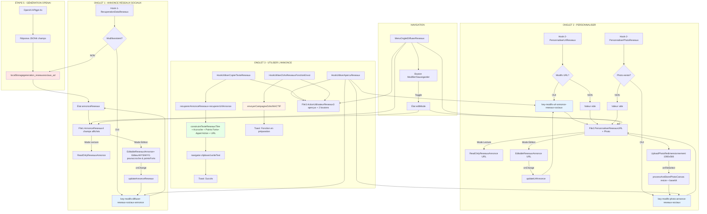
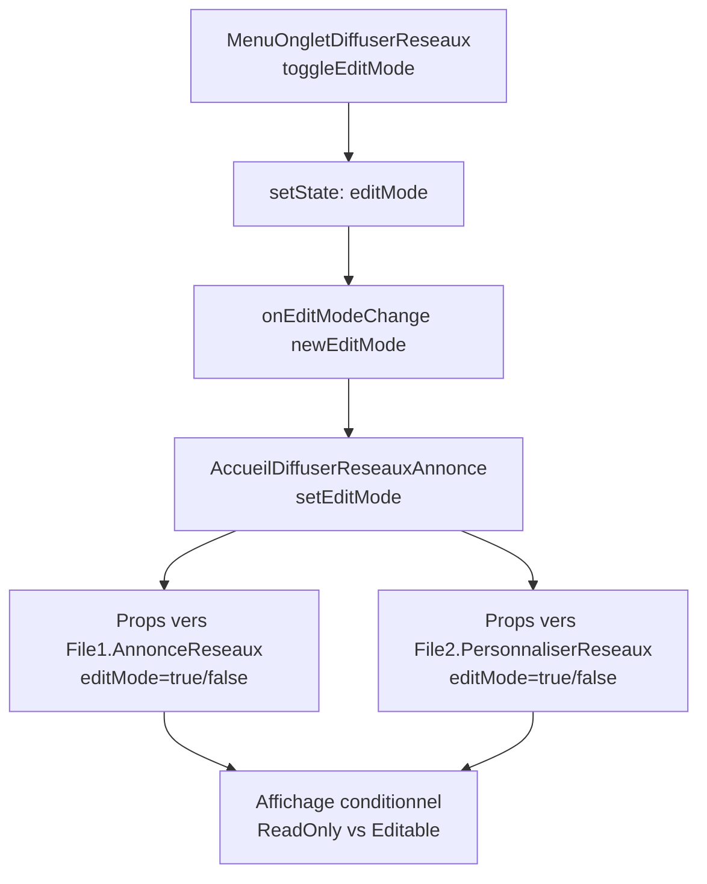

# 📄 DOCUMENT D'AUDIT TECHNIQUE CANAL - COPIER / DIFFUSER SUR MES RÉSEAUX SOCIAUX

---

## I. MISSION DU DOCUMENT

Ce document présente l'audit technique exhaustif du canal **"Copier / Diffuser sur mes Réseaux Sociaux"** de l'application LeadGenAI AdBuilder.

**Objectifs de l'audit :**
- Identifier tous les fichiers, composants, hooks et fonctions utilisés
- Tracer le flux complet des données (OpenAI → localStorage → Interface)
- Documenter le système d'édition et de sauvegarde
- Cartographier les options de copie et d'envoi
- Analyser les contraintes et validation
- Préparer la migration future vers Supabase

**Périmètre :**
- Fichiers de composition (Accueil, Onglets, Files)
- Hooks de récupération, personnalisation et utilisation
- Composants graphiques réutilisables
- Système de gestion localStorage
- Options de copie (Format Texte) et envoi (Zoho Social - inactif)

---

## II. SOMMAIRE CLIQUABLE

1. [MISSION DU DOCUMENT](#i-mission-du-document)
2. [SOMMAIRE CLIQUABLE](#ii-sommaire-cliquable)
3. [ARCHITECTURE GLOBALE - CANAL](#iii-architecture-globale---canal)
4. [LISTE EXHAUSTIVE DES FICHIERS UTILISÉS](#iv-liste-exhaustive-des-fichiers-utilisés)
5. [SYSTÈME D'ONGLETS](#v-système-donglets)
6. [PROCESSUS DE RÉCUPÉRATION DES DONNÉES OPENAI](#vi-processus-de-récupération-des-données-openai)
7. [STRUCTURE DES DONNÉES LOCALSTORAGE](#vii-structure-des-données-localstorage)
8. [PROCESSUS COMPLET ÉTAPE PAR ÉTAPE](#viii-processus-complet-étape-par-étape)
9. [SYSTÈME D'ÉDITION - BOUTON "MODIFIER"](#ix-système-dédition---bouton-modifier)
10. [OPTIONS DE COPIE](#x-options-de-copie)
11. [SYSTÈME D'APERÇU](#xi-système-daperçu)
12. [CONTRAINTES ET VALIDATION](#xii-contraintes-et-validation)
13. [COMPOSANTS GRAPHIQUES RÉUTILISABLES](#xiii-composants-graphiques-réutilisables)
14. [TABLEAUX RÉCAPITULATIFS](#xiv-tableaux-récapitulatifs)
15. [DONNÉES À PRENDRE EN CONSIDÉRATION](#xv-données-à-prendre-en-considération)

---

## III. ARCHITECTURE GLOBALE - CANAL

### 3.1. Vue d'ensemble du canal

**Fonction principale :**
Visualiser, modifier et copier une annonce Réseaux Sociaux générée par OpenAI, avec personnalisation de l'URL et de la photo de couverture. Préparation pour envoi futur via Zoho Social.

**Localisation dans l'application :**
- Route : `/etape6communication`
- Composant racine : `AccueilDiffuserReseauxAnnonce.tsx`
- Activation : `setSelectedOption("diffuser-reseaux-sociaux")` dans `Etape6Communication.tsx`

**Données traitées :**
- **Annonce Réseaux Sociaux** (4 champs) : `titre`, `accroche`, `pointsForts`, `appelAction`
- **URL de l'annonce** : lien vers l'annonce immobilière
- **Photo de couverture** : image redimensionnée automatiquement en 1080x566 pixels

### 3.2. Position dans Étape 6 Communication

Le canal **"Copier / Diffuser sur mes Réseaux Sociaux"** fait partie des 8 canaux de diffusion disponibles dans l'Étape 6 Communication :
1. Site Internet (Annonces)
2. Site Internet (Outils SEO)
3. Portails Immobiliers
4. Newsletter
5. Campagne SMS
6. Google Business Profile
7. **Réseaux Sociaux** ← *Canal actuel*
8. Landing Page

### 3.3. Schéma Mermaid complet (flux de données)



**Légende :**
- 🔴 `localStorage` OpenAI original (lecture seule)
- 🔵 `localStorage` modifications utilisateur (lecture/écriture)
- 🟢 Fonction de copie active
- 🟠 Fonction d'envoi inactive

---

## IV. LISTE EXHAUSTIVE DES FICHIERS UTILISÉS

### 4.1. Fichiers de composition

| Fichier | Rôle | Lignes clés |
|---------|------|-------------|
| `AccueilDiffuserReseauxAnnonce.tsx` | Point d'entrée du canal, gère l'état global `editMode` et la communication entre onglets | 14-64 |
| `MenuOngletDiffuserReseaux.tsx` | Système d'onglets avec bouton Modifier/Sauvegarder intégré | 31-176 |
| `File1.AnnonceReseaux.tsx` | Onglet 1 - Affichage et édition des 4 champs de l'annonce | 14-121 |
| `File2.PersonnaliserReseaux.tsx` | Onglet 2 - Personnalisation URL + Photo de couverture | 16-175 |
| `File3.ActionUtilisateurReseaux.tsx` | Onglet 3 - Options de copie et envoi + Aperçus | 6-38 |

### 4.2. Hooks de récupération

| Hook | Fonction | Données sources |
|------|----------|-----------------|
| `Hook-1-RecuperationDataReseaux.ts` | Récupération prioritaire des données d'annonce (modifs > originales) | `key-modifs-diffuser-reseaux-sociaux-annonce` ➜ `generation_reseauxsociaux_ad` |

**Détail du processus de récupération :**
```typescript
// Hook-1-RecuperationDataReseaux.ts (lignes 28-59)
// 1. Tentative de lecture des modifications utilisateur
const donneesModifiees = localStorage.getItem('key-modifs-diffuser-reseaux-sociaux-annonce');

// 2. Si modifications existent → utilisation directe
if (donneesModifiees) {
  setAnnonceReseaux(JSON.parse(donneesModifiees));
}
// 3. Sinon → lecture des données OpenAI originales
else {
  const donneesOriginales = localStorage.getItem('generation_reseauxsociaux_ad');
  // Mapping des champs OpenAI → Interface (lignes 52-56)
  setAnnonceReseaux({
    titre: cleanOpenAIContent(dataOriginales.TitreAnnonceReseaux),
    accroche: cleanOpenAIContent(dataOriginales.AccrocheImpactanteAnnonceReseaux),
    pointsForts: cleanOpenAIContent(dataOriginales.AtoutsAnnonceReseaux),
    appelAction: cleanOpenAIContent(dataOriginales.CtaAnnonceReseaux)
  });
}
```

### 4.3. Hooks de personnalisation

| Hook | Fonction | Données sources |
|------|----------|-----------------|
| `Hook-2-PersonnaliserUrlReseaux.tsx` | Gestion de l'URL de l'annonce | `key-modifs-url-annonce-reseaux-sociaux` |
| `Hook-2-PersonnaliserPhotoReseaux.tsx` | Upload, redimensionnement Canvas (1080x566) et stockage base64 de la photo | `key-modifs-photo-annonce-reseaux-sociaux` |

**Détail du redimensionnement photo :**
```typescript
// Hook-2-PersonnaliserPhotoReseaux.tsx (lignes 24-86)
const resizeImageWithCanvas = async (file: File): Promise => {
  const img = new Image();
  const canvas = document.createElement('canvas');
  const ctx = canvas.getContext('2d')!;

  canvas.width = 1080;  // Format Réseaux Sociaux
  canvas.height = 566;  // Ratio 1.91:1

  // Calcul pour centrer l'image (cover)
  // Dessin sur Canvas + conversion base64
  return canvas.toDataURL('image/jpeg', 0.9);
};
```

### 4.4. Hooks d'utilisation (Onglet 3)

| Hook | Fonction | Données sources |
|------|----------|-----------------|
| `Hook-3-UtiliserApercuReseaux.tsx` | Aperçu temps réel de l'annonce, URL et photo | Écoute `storage` event + `setInterval(1000ms)` |
| `Hook-3-UtiliserCopierTexteReseaux.tsx` | Copie formatée de l'annonce complète (Texte) | Récupération depuis tous les hooks |
| `Hook-3-UtiliserZohoReseauxFonctionEnvoi.tsx` | Envoi via Zoho Social (**INACTIF**) | Toast "Fonction en préparation" |

### 4.5. Composants graphiques

| Composant | Fichier source | Utilisation |
|-----------|----------------|-------------|
| `LabelReseauxAnnonce` | `GraphismeInterieurDiffuserReseaux.tsx` (lignes 107-116) | Labels des champs |
| `ReadOnlyReseauxAnnonce` | `GraphismeInterieurDiffuserReseaux.tsx` (lignes 125-138) | Affichage lecture seule (pas de transformation HTML) |
| `EditableReseauxAnnonce` | `GraphismeInterieurDiffuserReseaux.tsx` (lignes 150-181) | Champs éditables avec ou sans WYSIWYG |
| `EditButton` | `GraphismeInterieurDiffuserReseaux.tsx` (lignes 192-216) | Bouton Modifier/Sauvegarder |
| `CopyReseauxOption` | `GraphismeInterieurDiffuserReseaux.tsx` (lignes 229-255) | Cadre d'option de copie/envoi |
| `ReseauxAnnoncePreview` | `GraphismeInterieurDiffuserReseaux.tsx` (lignes 324-337) | Cadre d'aperçu |
| `EditeurWYSIWYG` | `EditeurWYSIWYG.tsx` | Textarea + sélecteur d'emojis (barre d'outils désactivée) |
| `UploadPhoto` | `GraphismeUploadPhoto.tsx` | Zone de drag & drop pour upload photo |

### 4.6. Arborescence complète avec descriptions

```
src/components/1-Sources-Restitution-Utilisateur/7.EtapeDiffuserReseauxAnnonce/
├── AccueilDiffuserReseauxAnnonce.tsx          [Point d'entrée, gestion editMode global]
├── MenuOngletDiffuserReseaux.tsx              [Navigation entre onglets + bouton Modifier]
│
├── File1.AnnonceReseaux.tsx                   [Onglet 1 - Annonce Réseaux Sociaux]
├── File2.PersonnaliserReseaux.tsx             [Onglet 2 - Personnaliser URL + Photo]
├── File3.ActionUtilisateurReseaux.tsx         [Onglet 3 - Utiliser l'annonce]
│
├── Hook-1-RecuperationDataReseaux.ts          [Récupération données annonce avec priorité]
├── Hook-2-PersonnaliserUrlReseaux.tsx         [Gestion URL]
├── Hook-2-PersonnaliserPhotoReseaux.tsx       [Upload + Resize + Stockage photo]
│
├── Hook-3-UtiliserApercuReseaux.tsx           [Aperçus temps réel]
├── Hook-3-UtiliserCopierTexteReseaux.tsx      [Copie format texte]
├── Hook-3-UtiliserZohoReseauxFonctionEnvoi.tsx [Envoi Zoho - INACTIF]
│
├── GraphismeInterieurDiffuserReseaux.tsx      [Composants UI réutilisables]
├── EditeurWYSIWYG.tsx                         [Textarea + emojis]
└── GraphismeUploadPhoto.tsx                   [Upload photo avec drag & drop]

src/services/openai/1.GenerateurAnnoncesOutilsSeo/
├── 0.APIAutresFonctionsLeadGenAI/
│   └── 3.API-AnnonceReseauxSociaux.ts         [Service OpenAI pour génération]
└── 7.PromptsOpenAi/
    └── 7.PromptReseauxSociauxAnnonce.ts       [Prompt complet 502 lignes]
```

---

## V. SYSTÈME D'ONGLETS

### 5.1. MenuOnglet - `MenuOngletDiffuserReseaux.tsx`

**Composant de navigation :**
```typescript
// MenuOngletDiffuserReseaux.tsx (lignes 31-40)
interface MenuOngletDiffuserReseauxProps {
  tabTitles?: string[];
  tabContent1?: ReactNode;
  tabContent2?: ReactNode;
  tabContent3?: ReactNode;
  enableEditMode?: boolean;
  onTabChange?: (tabIndex: number) => void;
  onEditModeChange?: (isEditMode: boolean) => void;
  className?: string;
}
```

**Titres par défaut :**
```typescript
// Lignes 45-49
const defaultTabTitles = [
  "Annonce Réseaux Sociaux",
  "Personnaliser l'annonce",
  "Utiliser l'annonce"
];
```

**Bouton Modifier/Sauvegarder :**
- Affiché uniquement sur les onglets 1 et 2 si `enableEditMode={true}`
- Logique toggle : `Modifier` ↔ `Sauvegarder` (lignes 62-75)
- Toast de succès à la sauvegarde (ligne 69)

### 5.2. Onglet 1 : Annonce Réseaux Sociaux

**Fichier :** `File1.AnnonceReseaux.tsx`

**Champs affichés :**
| Champ | Label | Composant Lecture | Composant Édition | Rows | WYSIWYG |
|-------|-------|-------------------|-------------------|------|---------|
| `titre` | Titre de l'Annonce | `ReadOnlyReseauxAnnonce` | `EditableReseauxAnnonce` | 2 | ❌ |
| `accroche` | Accroche | `ReadOnlyReseauxAnnonce` | `EditableReseauxAnnonce` | 5 | ✅ |
| `pointsForts` | Points Forts | `ReadOnlyReseauxAnnonce` | `EditableReseauxAnnonce` | 8 | ✅ |
| `appelAction` | Appel à l'action | `ReadOnlyReseauxAnnonce` | `EditableReseauxAnnonce` | 5 | ❌ |

**Logique d'édition :**
```typescript
// File1.AnnonceReseaux.tsx (lignes 24-38)
const handleChange = (field: keyof AnnonceReseauxData, value: string) => {
  const updatedData = { ...annonceReseaux, [field]: value };
  updateAnnonceReseaux({ [field]: value });

  // Notification au composant parent
  if (onDataChange) {
    onDataChange(updatedData);
  }
};
```

**Sauvegarde :**
- **Automatique et immédiate** via `updateAnnonceReseaux()` (ligne 27)
- Stockage dans `key-modifs-diffuser-reseaux-sociaux-annonce`
- Aucune validation de champ

### 5.3. Onglet 2 : Personnaliser l'annonce

**Fichier :** `File2.PersonnaliserReseaux.tsx`

**Section 1 - URL de l'annonce :**
```typescript
// File2.PersonnaliserReseaux.tsx (lignes 50-75)

  URL de l'annonce

{editMode ? (
   updateUrlAnnonce(value)}
    rows={1}
  />
) : (

)}
```

**Section 2 - Photo de couverture :**

**Processus complet :**
1. **Upload fichier** via `UploadPhoto` (drag & drop ou clic)
2. **Traitement** via `processAndStorePhoto()` :
   ```typescript
   // Hook-2-PersonnaliserPhotoReseaux.tsx (lignes 88-110)
   const processAndStorePhoto = async (file: File) => {
     setPhotoData(prev => ({ ...prev, isProcessing: true }));

     try {
       const base64Image = await resizeImageWithCanvas(file);
       localStorage.setItem('key-modifs-photo-annonce-reseaux-sociaux', base64Image);
       setPhotoData({ photoUrl: base64Image, isProcessing: false });
     } catch (error) {
       console.error('Erreur traitement photo:', error);
       setPhotoData(prev => ({ ...prev, isProcessing: false }));
     }
   };
   ```
3. **Redimensionnement Canvas** en 1080x566 pixels :
   ```typescript
   // Hook-2-PersonnaliserPhotoReseaux.tsx (lignes 24-86)
   const resizeImageWithCanvas = async (file: File): Promise => {
     const targetWidth = 1080;
     const targetHeight = 566;
     const targetRatio = targetWidth / targetHeight; // 1.91:1

     // Calcul dimensions pour remplir le canvas (cover)
     // Centrage de l'image
     // Retour base64
   };
   ```
4. **Stockage** en `key-modifs-photo-annonce-reseaux-sociaux` (base64)
5. **Affichage** de l'aperçu dans l'onglet 3

**Suppression photo :**
```typescript
// Hook-2-PersonnaliserPhotoReseaux.tsx (lignes 112-119)
const removePhoto = () => {
  localStorage.removeItem('key-modifs-photo-annonce-reseaux-sociaux');
  setPhotoData({ photoUrl: '', isProcessing: false });
};
```

### 5.4. Onglet 3 : Utiliser l'annonce

**Fichier :** `File3.ActionUtilisateurReseaux.tsx`

**Structure :**
```typescript
// File3.ActionUtilisateurReseaux.tsx (lignes 8-36)

  {/* Titre Options */}
  Options

  {/* Deux cadres côte à côte */}

           {/* Copie Format Texte */}
     {/* Envoi Zoho - INACTIF */}

  {/* Aperçus temps réel */}

```

**Cadre 1 - Copier au Format Texte :**
- Hook : `HookUtiliserCopierTexteReseaux`
- Bouton : "Copier l'Annonce"
- Action : Copie texte brut dans le presse-papier

**Cadre 2 - Envoyer via Zoho Social :**
- Hook : `HookUtiliserZohoReseauxFonctionEnvoi`
- Bouton : "Envoyer la Campagne Réseaux Sociaux"
- Statut : **INACTIF** (toast "Fonction en préparation")

**Aperçus :**
- Hook : `HookUtiliserApercuReseaux`
- 3 aperçus temps réel :
  1. Annonce Réseaux Sociaux (titre + accroche + points forts + appel action)
  2. URL de l'annonce
  3. Photo de couverture

### 5.5. Logique de navigation et état

**Gestion de l'état `editMode` :**
```typescript
// AccueilDiffuserReseauxAnnonce.tsx (lignes 15-17)
const [editMode, setEditMode] = useState(false);

// Callback pour MenuOngletDiffuserReseaux
onEditModeChange={(isEditMode) => {
  setEditMode(isEditMode);
}}
```

**Propagation aux onglets :**
```typescript
// AccueilDiffuserReseauxAnnonce.tsx (lignes 31-52)
const contentTab1 = (

);

const contentTab2 = (

);
```

**Réinitialisation à chaque changement d'onglet :**
```typescript
// MenuOngletDiffuserReseaux.tsx (lignes 56-61)
const handleTabChange = (value: string) => {
  setActiveTab(value);

  if (enableEditMode) {
    setEditMode(false);  // ← Retour en mode lecture
  }

  onTabChange?.(tabTitles.indexOf(value));
};
```

---

## VI. PROCESSUS DE RÉCUPÉRATION DES DONNÉES OPENAI

### 6.1. Sources de données (clés localStorage)

**Clés LUES :**

| Clé localStorage | Type | Contenu | Génération |
|------------------|------|---------|------------|
| `generation_reseauxsociaux_ad` | JSON | Annonce OpenAI originale (4 champs) | Étape 5 (ligne 121 `Etape5.tsx`) |
| `key-modifs-diffuser-reseaux-sociaux-annonce` | JSON | Modifications utilisateur de l'annonce | Onglet 1 (édition) |
| `key-modifs-url-annonce-reseaux-sociaux` | String | URL personnalisée | Onglet 2 (édition) |
| `key-modifs-photo-annonce-reseaux-sociaux` | Base64 | Photo redimensionnée 1080x566 | Onglet 2 (upload) |

### 6.2. Logique de priorité (modifs > originales)

**Algorithme de récupération :**

```typescript
// Hook-1-RecuperationDataReseaux.ts (lignes 28-59)
useEffect(() => {
  try {
    // 1️⃣ PRIORITÉ HAUTE : Modifications utilisateur
    const donneesModifiees = localStorage.getItem('key-modifs-diffuser-reseaux-sociaux-annonce');

    if (donneesModifiees) {
      const dataModifiees = JSON.parse(donneesModifiees);
      setAnnonceReseaux({
        titre: dataModifiees.titre || '',
        accroche: dataModifiees.accroche || '',
        pointsForts: dataModifiees.pointsForts || '',
        appelAction: dataModifiees.appelAction || ''
      });
    } else {
      // 2️⃣ PRIORITÉ BASSE : Données OpenAI originales
      const donneesOriginales = localStorage.getItem('generation_reseauxsociaux_ad');

      if (donneesOriginales) {
        const dataOriginales = JSON.parse(donneesOriginales);
        setAnnonceReseaux({
          titre: cleanOpenAIContent(dataOriginales.TitreAnnonceReseaux || ''),
          accroche: cleanOpenAIContent(dataOriginales.AccrocheImpactanteAnnonceReseaux || ''),
          pointsForts: cleanOpenAIContent(dataOriginales.AtoutsAnnonceReseaux || ''),
          appelAction: cleanOpenAIContent(dataOriginales.CtaAnnonceReseaux || '')
        });
      }
    }

    setIsLoading(false);
  } catch (error) {
    console.error('Erreur chargement données:', error);
    setError('Impossible de charger les données');
    setIsLoading(false);
  }
}, []);
```

### 6.3. Hooks de récupération détaillés

**Hook `useRecuperationDataReseaux` :**

```typescript
// Hook-1-RecuperationDataReseaux.ts (lignes 3-104)
interface AnnonceReseauxData {
  titre: string;
  accroche: string;
  pointsForts: string;
  appelAction: string;
}

// Fonction de nettoyage du contenu OpenAI
function cleanOpenAIContent(text: string): string {
  if (!text) return '';
  return text
    .replace(/\\n/g, '\n')      // Correction des sauts de ligne échappés
    .replace(/\\\\/g, '\\');    // Correction des backslashes doubles
}

export const useRecuperationDataReseaux = () => {
  const [annonceReseaux, setAnnonceReseaux] = useState({
    titre: '',
    accroche: '',
    pointsForts: '',
    appelAction: ''
  });
  const [isLoading, setIsLoading] = useState(true);
  const [error, setError] = useState(null);

  // Chargement initial (voir code ci-dessus)

  // Fonction de mise à jour
  const updateAnnonceReseaux = (nouvellesDonnees: Partial) => {
    setAnnonceReseaux(prev => {
      const updated = { ...prev, ...nouvellesDonnees };
      localStorage.setItem('key-modifs-diffuser-reseaux-sociaux-annonce', JSON.stringify(updated));
      return updated;
    });
  };

  return {
    annonceReseaux,
    setAnnonceReseaux,
    updateAnnonceReseaux,
    isLoading,
    error
  };
};
```

**Hook `usePersonnaliserUrlReseaux` :**

```typescript
// Hook-2-PersonnaliserUrlReseaux.tsx (lignes 8-43)
export const usePersonnaliserUrlReseaux = () => {
  const [personnaliserData, setPersonnaliserData] = useState({
    urlAnnonce: ''
  });

  // Chargement au démarrage
  useEffect(() => {
    const urlSaved = localStorage.getItem('key-modifs-url-annonce-reseaux-sociaux') || '';
    setPersonnaliserData({ urlAnnonce: urlSaved });
  }, []);

  // Mise à jour URL
  const updateUrlAnnonce = (value: string) => {
    setPersonnaliserData(prev => ({ ...prev, urlAnnonce: value }));
    localStorage.setItem('key-modifs-url-annonce-reseaux-sociaux', value);
  };

  // Récupération URL (pour onglet 3)
  const getUrlAnnonce = (): string => {
    return localStorage.getItem('key-modifs-url-annonce-reseaux-sociaux') || '';
  };

  return {
    personnaliserData,
    updateUrlAnnonce,
    getUrlAnnonce,
    getAllData: () => ({
      urlAnnonce: localStorage.getItem('key-modifs-url-annonce-reseaux-sociaux') || ''
    })
  };
};
```

### 6.4. Mapping des champs OpenAI → Interface

**Tableau de correspondance :**

| Champ OpenAI (JSON) | Champ Interface (TypeScript) | Transformation | Fichier |
|---------------------|------------------------------|----------------|---------|
| `TitreAnnonceReseaux` | `titre` | `cleanOpenAIContent()` | `Hook-1-RecuperationDataReseaux.ts:53` |
| `AccrocheImpactanteAnnonceReseaux` | `accroche` | `cleanOpenAIContent()` | `Hook-1-RecuperationDataReseaux.ts:54` |
| `AtoutsAnnonceReseaux` | `pointsForts` | `cleanOpenAIContent()` | `Hook-1-RecuperationDataReseaux.ts:55` |
| `CtaAnnonceReseaux` | `appelAction` | `cleanOpenAIContent()` | `Hook-1-RecuperationDataReseaux.ts:56` |

**Point d'attention :**
- **Pas de mapping `cta` vs `appelAction`** comme dans d'autres canaux (Site Internet, Portails)
- Le champ OpenAI `CtaAnnonceReseaux` est directement mappé vers `appelAction`
- Le nettoyage `cleanOpenAIContent()` corrige uniquement les échappements (`\\n` → `\n`, `\\\\` → `\\`)

**Exemple de réponse OpenAI :**
```json
{
  "TitreAnnonceReseaux": "🌟 RESTAURANT À VENDRE – PARIS 11e",
  "AccrocheImpactanteAnnonceReseaux": "Emplacement premium en angle, rare à la vente.\\n\\nAffaire en angle...",
  "AtoutsAnnonceReseaux": "Les Atouts du bien\\n\\n☑️ Emplacement Premium en angle...",
  "CtaAnnonceReseaux": "Intéressé(e) ?\\n📞 Contactez-nous..."
}
```

**Après `cleanOpenAIContent()` :**
```typescript
{
  titre: "🌟 RESTAURANT À VENDRE – PARIS 11e",
  accroche: "Emplacement premium en angle, rare à la vente.\n\nAffaire en angle...",
  pointsForts: "Les Atouts du bien\n\n☑️ Emplacement Premium en angle...",
  appelAction: "Intéressé(e) ?\n📞 Contactez-nous..."
}
```

---

## VII. STRUCTURE DES DONNÉES LOCALSTORAGE

### 7.1. Clés LUES

| Clé | Type | Structure | Exemple |
|-----|------|-----------|---------|
| `generation_reseauxsociaux_ad` | JSON | `{ TitreAnnonceReseaux, AccrocheImpactanteAnnonceReseaux, AtoutsAnnonceReseaux, CtaAnnonceReseaux }` | Voir prompt ligne 496-501 |
| `key-modifs-diffuser-reseaux-sociaux-annonce` | JSON | `{ titre, accroche, pointsForts, appelAction }` | `{ "titre": "🌟 BAR...", "accroche": "..." }` |
| `key-modifs-url-annonce-reseaux-sociaux` | String | URL brute | `"https://example.com/annonce/123"` |
| `key-modifs-photo-annonce-reseaux-sociaux` | Base64 | `data:image/jpeg;base64,...` | Image 1080x566 pixels |

### 7.2. Clés ÉCRITES

| Clé | Écrite par | Déclencheur | Fréquence |
|-----|------------|-------------|-----------|
| `key-modifs-diffuser-reseaux-sociaux-annonce` | `updateAnnonceReseaux()` | Modification d'un champ de l'annonce | À chaque `onChange` |
| `key-modifs-url-annonce-reseaux-sociaux` | `updateUrlAnnonce()` | Modification du champ URL | À chaque `onChange` |
| `key-modifs-photo-annonce-reseaux-sociaux` | `processAndStorePhoto()` | Upload photo terminé | À chaque upload |

### 7.3. Interfaces TypeScript complètes

```typescript
// Hook-1-RecuperationDataReseaux.ts (lignes 3-8)
interface AnnonceReseauxData {
  titre: string;
  accroche: string;
  pointsForts: string;
  appelAction: string;
}

// Hook-2-PersonnaliserUrlReseaux.tsx (lignes 3-5)
interface PersonnaliserReseauxData {
  urlAnnonce: string;
}

// Hook-2-PersonnaliserPhotoReseaux.tsx (lignes 3-6)
interface PersonnaliserPhotoReseauxData {
  photoUrl: string;
  isProcessing: boolean;
}

// 3.API-AnnonceReseauxSociaux.ts (lignes 140-145)
interface OpenAIReseauxSociauxResponse {
  TitreAnnonceReseaux: string;
  AccrocheImpactanteAnnonceReseaux: string;
  AtoutsAnnonceReseaux: string;
  CtaAnnonceReseaux: string;
}
```

### 7.4. Tableaux récapitulatifs

**Tableau des clés localStorage - Lecture :**

| Clé | Origine | Format | Taille estimée | Utilisée par |
|-----|---------|--------|----------------|--------------|
| `generation_reseauxsociaux_ad` | Étape 5 (OpenAI) | JSON | ~2-4 KB | `useRecuperationDataReseaux` |
| `key-modifs-diffuser-reseaux-sociaux-annonce` | Onglet 1 (édition) | JSON | ~2-4 KB | `useRecuperationDataReseaux` |
| `key-modifs-url-annonce-reseaux-sociaux` | Onglet 2 (édition) | String | ~50-200 B | `usePersonnaliserUrlReseaux` |
| `key-modifs-photo-annonce-reseaux-sociaux` | Onglet 2 (upload) | Base64 | ~100-300 KB | `usePersonnaliserPhotoReseaux` |

**Tableau des clés localStorage - Écriture :**

| Clé | Fonction d'écriture | Fichier | Ligne | Déclencheur |
|-----|---------------------|---------|-------|-------------|
| `key-modifs-diffuser-reseaux-sociaux-annonce` | `updateAnnonceReseaux()` | `Hook-1-RecuperationDataReseaux.ts` | 71 | `onChange` champs |
| `key-modifs-url-annonce-reseaux-sociaux` | `updateUrlAnnonce()` | `Hook-2-PersonnaliserUrlReseaux.tsx` | 21 | `onChange` URL |
| `key-modifs-photo-annonce-reseaux-sociaux` | `processAndStorePhoto()` | `Hook-2-PersonnaliserPhotoReseaux.tsx` | 93 | Upload photo |

---

## VIII. PROCESSUS COMPLET ÉTAPE PAR ÉTAPE

### 8.1. Chargement initial

**Séquence de démarrage :**

1. **Navigation vers `/etape6communication`**
2. **Activation du canal** via `setSelectedOption("diffuser-reseaux-sociaux")`
3. **Montage de `AccueilDiffuserReseauxAnnonce`**
   - État `editMode` initialisé à `false`
   - Rendu de `MenuOngletDiffuserReseaux` avec `enableEditMode={true}`
4. **Affichage de l'Onglet 1 par défaut**
   - Montage de `File1.AnnonceReseaux` avec `editMode={false}`
   - Appel du hook `useRecuperationDataReseaux()`
5. **Lecture localStorage** (priorité modifs > originales)
   - Tentative `key-modifs-diffuser-reseaux-sociaux-annonce`
   - Si absent → lecture `generation_reseauxsociaux_ad` + `cleanOpenAIContent()`
6. **Affichage en mode lecture seule**
   - Composants `ReadOnlyReseauxAnnonce` pour les 4 champs

### 8.2. Affichage en mode lecture seule

**Composants utilisés :**
```typescript
// File1.AnnonceReseaux.tsx (lignes 45-118)
{!editMode ? (
  <>

      Titre de l'Annonce

) : (
  // ... version éditable
)}
```

**Comportement de `ReadOnlyReseauxAnnonce` :**
```typescript
// GraphismeInterieurDiffuserReseaux.tsx (lignes 125-138)
export const ReadOnlyReseauxAnnonce: React.FC = ({ 
  id, 
  content, 
  className
}) => {
  return (

      {/* Affichage brut, whitespace-pre-line, PAS de dangerouslySetInnerHTML */}
      {content}

  );
};
```

**Point clé :** Contrairement au canal Google Business Profile, **aucune transformation HTML** n'est appliquée ici. Le contenu est affiché tel quel.

### 8.3. Activation du mode édition

**Déclencheur :** Clic sur le bouton "Modifier" dans `MenuOngletDiffuserReseaux`

```typescript
// MenuOngletDiffuserReseaux.tsx (lignes 62-75)
const toggleEditMode = () => {
  if (editMode) {
    // Passage en mode lecture
    toast({
      title: "Modifications sauvegardées",
      description: "Vos modifications ont été enregistrées avec succès",
    });
  }

  const newEditMode = !editMode;
  setEditMode(newEditMode);

  if (onEditModeChange) {
    onEditModeChange(newEditMode);  // ← Propagation vers AccueilDiffuserReseauxAnnonce
  }
};
```

**Propagation de l'état :**
```
MenuOngletDiffuserReseaux.toggleEditMode()
  ↓
onEditModeChange(true)
  ↓
AccueilDiffuserReseauxAnnonce.setEditMode(true)
  ↓
File1.AnnonceReseaux (editMode={true})
  ↓
Affichage des composants EditableReseauxAnnonce
```

### 8.4. Modification des champs

**Champs avec `EditableReseauxAnnonce` standard (textarea) :**
- `titre` (2 lignes)
- `appelAction` (5 lignes)

**Champs avec `EditableReseauxAnnonce` + WYSIWYG :**
- `accroche` (5 lignes, `useWysiwyg={true}`)
- `pointsForts` (8 lignes, `useWysiwyg={true}`)

**Composant `EditableReseauxAnnonce` :**
```typescript
// GraphismeInterieurDiffuserReseaux.tsx (lignes 150-181)
export const EditableReseauxAnnonce: React.FC = ({ 
  id, 
  value, 
  onChange, 
  rows = 3,
  className,
  useWysiwyg = false
}) => {
  if (useWysiwyg) {
    const simpleMode = rows <= 3;

    return (

    );
  }

  return (
     onChange(e.target.value)} 
      className={cn("w-full rounded-md border border-gray-200 p-3", className)}
      rows={rows}
    />
  );
};
```

**Composant `EditeurWYSIWYG` :**
```typescript
// EditeurWYSIWYG.tsx (lignes 70-194)
const EditeurWYSIWYG: React.FC<EditeurWYSIWYGProps> = ({ 
  value, 
  onChange, 
  rows = 3, 
  className,
  simpleMode = false
}) => {
  const [editorValue, setEditorValue] = useState(value);
  const [isEmojiOpen, setIsEmojiOpen] = useState(false);
  const textareaRef = useRef<HTMLTextAreaElement>(null);

  // Gestion du changement
  const handleChange = (e: React.ChangeEvent<HTMLTextAreaElement>) => {
    const content = e.target.value;
    setEditorValue(content);
    onChange(content);
  };

  // Insertion emoji à la position du curseur
  const insertEmoji = (emoji: string) => {
    // ... logique d'insertion
  };

  return (
    <div className="relative">
      {/* Bouton emoji en bas à droite */}
      <Popover open={isEmojiOpen} onOpenChange={setIsEmojiOpen}>
        {/* Sélecteur emojis par catégorie */}
      </Popover>

      {/* Textarea standard */}
      <textarea
        ref={textareaRef}
        value={editorValue}
        onChange={handleChange}
        rows={rows}
        className="w-full rounded-md border border-gray-200 p-3"
        style={{ fontSize: '18px', fontFamily: 'Nunito' }}
      />
    </div>
  );
};
```

**Point clé :** Contrairement au canal Site Internet, **la barre d'outils WYSIWYG est désactivée**. Seul le sélecteur d'emojis est disponible.

### 8.5. Sauvegarde automatique

**Déclencheur :** `onChange` de chaque champ

```typescript
// File1.AnnonceReseaux.tsx (lignes 24-38)
const handleChange = (field: keyof AnnonceReseauxData, value: string) => {
  const updatedData = { ...annonceReseaux, [field]: value };

  // ✅ Sauvegarde immédiate dans localStorage
  updateAnnonceReseaux({ [field]: value });

  // Notification au parent (optionnelle)
  if (onDataChange) {
    onDataChange(updatedData);
  }
};
```

**Fonction `updateAnnonceReseaux` :**
```typescript
// Hook-1-RecuperationDataReseaux.ts (lignes 66-73)
const updateAnnonceReseaux = (nouvellesDonnees: Partial<AnnonceReseauxData>) => {
  setAnnonceReseaux(prev => {
    const updated = { ...prev, ...nouvellesDonnees };

    // ✅ Écriture immédiate dans localStorage
    localStorage.setItem(
      'key-modifs-diffuser-reseaux-sociaux-annonce', 
      JSON.stringify(updated)
    );

    return updated;
  });
};
```

**Comportement du bouton "Sauvegarder" :**
- **Ne déclenche PAS de sauvegarde** (déjà faite automatiquement)
- **Désactive le mode édition** (`editMode` → `false`)
- **Affiche un toast de succès**

```typescript
// MenuOngletDiffuserReseaux.tsx (lignes 62-75)
const toggleEditMode = () => {
  if (editMode) {
    toast({
      title: "Modifications sauvegardées",
      description: "Vos modifications ont été enregistrées avec succès",
    });
  }

  setEditMode(!editMode);
  onEditModeChange?.(!editMode);
};
```

### 8.6. Copie au format Texte

**Processus complet :**

1. **Clic sur "Copier l'Annonce"** dans l'onglet 3
2. **Appel de `copierTexteReseaux()`** :
   ```typescript
   // Hook-3-UtiliserCopierTexteReseaux.tsx (lignes 60-90)
   const copierTexteReseaux = () => {
     const texteReseaux = construireTexteReseaux();

     if (texteReseaux) {
       navigator.clipboard.writeText(texteReseaux).then(() => {
         console.log('Annonce Réseaux copiée avec succès:', texteReseaux);
         toast({
           title: "Succès",
           description: "Votre Annonce Réseaux Sociaux a été copiée"
         });
       }).catch((error) => {
         console.error('Erreur copie:', error);
         toast({
           title: "Erreur",
           description: "Impossible de copier l'annonce",
           variant: "destructive"
         });
       });
     } else {
       console.warn('Aucun contenu à copier');
       toast({
         title: "Attention",
         description: "Aucun contenu disponible à copier",
         variant: "destructive"
       });
     }
   };
   ```

3. **Construction du texte via `construireTexteReseaux()` :**
   ```typescript
   // Hook-3-UtiliserCopierTexteReseaux.tsx (lignes 43-58)
   const construireTexteReseaux = (): string => {
     const annonceReseaux = recupererAnnonceReseaux().trim();
     const urlAnnonce = recupererUrlAnnonce().trim();

     let texteFinal = '';

     // Ajouter l'annonce Réseaux Sociaux avec ses sauts de ligne
     if (annonceReseaux) {
       texteFinal += annonceReseaux;
     }

     // Ajouter double saut de ligne puis l'URL
     if (urlAnnonce) {
       if (texteFinal) {
         texteFinal += '\n\n'; // Double saut de ligne
       }
       texteFinal += urlAnnonce;
     }

     return texteFinal;
   };
   ```

4. **Récupération de l'annonce via `recupererAnnonceReseaux()` :**
   ```typescript
   // Hook-3-UtiliserCopierTexteReseaux.tsx (lignes 17-30)
   const recupererAnnonceReseaux = (): string => {
     if (dataReseaux.titre || dataReseaux.accroche || 
         dataReseaux.pointsForts || dataReseaux.appelAction) {

       // Assembler toutes les parties en format texte sans titres
       const contenuComplet = [
         dataReseaux.titre,
         dataReseaux.accroche,
         dataReseaux.pointsForts,
         dataReseaux.appelAction
       ].filter(Boolean).join('\n\n');

       return contenuComplet;
     }
     return '';
   };
   ```

5. **Récupération de l'URL via `recupererUrlAnnonce()` :**
   ```typescript
   // Hook-3-UtiliserCopierTexteReseaux.tsx (lignes 33-36)
   const recupererUrlAnnonce = (): string => {
     return getUrlAnnonce();
   };
   ```

6. **Copie dans le presse-papier** via `navigator.clipboard.writeText()`
7. **Affichage du toast de succès**

**Format final du texte copié :**
```
🌟 RESTAURANT À VENDRE – PARIS 11e

Emplacement premium en angle, rare à la vente.

Affaire en angle idéalement située dans un quartier commerçant...

Les Atouts du bien

☑️ Emplacement Premium en angle, Paris 11ème...
☑️ Surface de 205 m², deux étages...
☑️ Capacité d'accueil de 60 places assises...

Intéressé(e) ? 
📞 Contactez-nous pour organiser une visite...
Prix FAI : 456.000€
Référence : B78-8956

https://example.com/annonce/123
```

---

## IX. SYSTÈME D'ÉDITION - BOUTON "MODIFIER"

### 9.1. Localisation

**Fichier :** `MenuOngletDiffuserReseaux.tsx`

**Position :**
- Affiché uniquement dans les **onglets 1 et 2** (pas dans l'onglet 3)
- Condition : `enableEditMode={true}` (activé par défaut)

**Code d'affichage conditionnel :**
```typescript
// MenuOngletDiffuserReseaux.tsx (lignes 93-149)
<TabsContent value={tabTitles[0]}>  {/* Onglet 1 */}
  <div className="flex justify-end items-center mb-4">
    {enableEditMode && (
      <EditButton 
        editMode={editMode} 
        onClick={toggleEditMode} 
      />
    )}
  </div>
  {tabContent1}
</TabsContent>

<TabsContent value={tabTitles[1]}>  {/* Onglet 2 */}
  <div className="flex justify-end items-center mb-4">
    {enableEditMode && (
      <EditButton 
        editMode={editMode} 
        onClick={toggleEditMode} 
      />
    )}
  </div>
  {tabContent2}
</TabsContent>

<TabsContent value={tabTitles[2]}>  {/* Onglet 3 - PAS de bouton */}
  {tabContent3}
</TabsContent>
```

### 9.2. Comportement toggle (Modifier ↔ Sauvegarder)

**Composant `EditButton` :**
```typescript
// GraphismeInterieurDiffuserReseaux.tsx (lignes 192-216)
export const EditButton: React.FC<EditButtonProps> = ({ 
  editMode, 
  onClick, 
  className 
}) => {
  return (
    <Button 
      onClick={onClick} 
      variant="outline" 
      className={cn("border-realestate-purple text-realestate-purple hover:bg-realestate-purple hover:text-white", className)}
    >
      {editMode ? (
        <>
          <Save className="mr-2 h-4 w-4" />
          Sauvegarder
        </>
      ) : (
        <>
          <Edit className="mr-2 h-4 w-4" />
          Modifier
        </>
      )}
    </Button>
  );
};
```

**Fonction `toggleEditMode` :**
```typescript
// MenuOngletDiffuserReseaux.tsx (lignes 62-75)
const toggleEditMode = () => {
  if (editMode) {
    // Mode Édition → Lecture : affichage du toast
    toast({
      title: "Modifications sauvegardées",
      description: "Vos modifications ont été enregistrées avec succès",
    });
  }

  // Toggle de l'état local
  const newEditMode = !editMode;
  setEditMode(newEditMode);

  // Propagation au composant parent
  if (onEditModeChange) {
    onEditModeChange(newEditMode);
  }
};
```

**États du bouton :**

| État `editMode` | Icône | Texte | Action au clic |
|-----------------|-------|-------|----------------|
| `false` | `<Edit />` | "Modifier" | Passe en mode édition |
| `true` | `<Save />` | "Sauvegarder" | Passe en mode lecture + toast |

### 9.3. Propagation de l'état

**Flux de propagation :**



**Code de propagation :**
```typescript
// AccueilDiffuserReseauxAnnonce.tsx (lignes 60-64)
<MenuOngletDiffuserReseaux
  enableEditMode={true}
  tabContent1={contentTab1}
  tabContent2={contentTab2}
  tabContent3={contentTab3}
  className="mt-0"
  onEditModeChange={(isEditMode) => {
    setEditMode(isEditMode);  // ← Mise à jour de l'état global
  }}
/>
```

### 9.4. Affichage conditionnel

**Dans `File1.AnnonceReseaux` :**
```typescript
// File1.AnnonceReseaux.tsx (lignes 45-75)
{!editMode ? (
  // Mode Lecture
  <>
    <LabelReseauxAnnonce htmlFor="titre-annonce-reseaux">
      Titre de l'Annonce
    </LabelReseauxAnnonce>
    <ReadOnlyReseauxAnnonce
      id="titre-annonce-reseaux"
      content={annonceReseaux.titre}
    />
  </>
) : (
  // Mode Édition
  <>
    <LabelReseauxAnnonce htmlFor="titre-annonce-reseaux">
      Titre de l'Annonce
    </LabelReseauxAnnonce>
    <EditableReseauxAnnonce
      id="titre-annonce-reseaux"
      value={annonceReseaux.titre}
      onChange={(value) => handleChange('titre', value)}
      rows={2}
    />
  </>
)}
```

### 9.5. Nettoyage HTML

**Absence de nettoyage HTML dans ce canal :**

Contrairement aux canaux Site Internet et Portails Immobiliers, **aucune fonction de suppression des balises HTML** n'est appliquée dans le canal Réseaux Sociaux.

**Raisons :**
1. Les champs `accroche` et `pointsForts` utilisent `EditeurWYSIWYG` sans barre d'outils
2. L'utilisateur ne peut pas insérer de balises HTML manuellement
3. Le contenu OpenAI original ne contient pas de HTML (que du texte brut avec emojis et sauts de ligne)
4. Les composants `ReadOnlyReseauxAnnonce` et `EditableReseauxAnnonce` n'utilisent **pas** `dangerouslySetInnerHTML`

**Affichage du contenu :**
```typescript
// GraphismeInterieurDiffuserReseaux.tsx (lignes 125-138)
export const ReadOnlyReseauxAnnonce: React.FC<ReadOnlyReseauxAnnonceProps> = ({ 
  id, content, className
}) => {
  return (
    <div id={id} className={cn("bg-white rounded-md border border-gray-200 p-3", className)}>
      {/* Affichage texte brut avec préservation des sauts de ligne */}
      <div className="whitespace-pre-line">{content}</div>
    </div>
  );
};
```

### 9.6. Éditeur WYSIWYG (EditeurWYSIWYG.tsx)

**Caractéristiques :**

| Propriété | Valeur | Détail |
|-----------|--------|--------|
| **Barre d'outils** | ❌ Désactivée | Pas de formatage HTML possible |
| **Emojis** | ✅ Activés | Sélecteur par catégorie en bas à droite |
| **Format de sortie** | Texte brut | Pas de balises HTML générées |
| **Police** | Nunito 18px | Cohérence avec le reste de l'app |
| **Lignes configurables** | `rows` prop | Hauteur adaptative |

**Catégories d'emojis disponibles :**
```typescript
// EditeurWYSIWYG.tsx (lignes 16-59)
const emojiData = {
  "personnes": ["😀", "😃", "😄", ...],      // 50 emojis
  "alimentation": ["🍎", "🍏", "🍐", ...],    // 50 emojis
  "activites": ["⚽", "🏀", "🏈", ...],       // 50 emojis
  "voyages": ["🚗", "🚕", "🚙", ...],        // 50 emojis
  "objets": ["💻", "🖥", "🖨", ...],        // 50 emojis
  "symboles": ["❤", "🧡", "💛", ...],       // 50 emojis
};
```

**Fonction d'insertion emoji :**
```typescript
// EditeurWYSIWYG.tsx (lignes 97-118)
const insertEmoji = (emoji: string) => {
  if (textareaRef.current) {
    const textarea = textareaRef.current;
    const start = textarea.selectionStart;
    const end = textarea.selectionEnd;

    // Créer le nouveau contenu avec l'emoji inséré
    const newContent = editorValue.substring(0, start) + emoji + editorValue.substring(end);

    // Mettre à jour le contenu
    setEditorValue(newContent);
    onChange(newContent);

    // Repositionner le curseur après l'emoji
    setTimeout(() => {
      textarea.focus();
      textarea.setSelectionRange(start + emoji.length, start + emoji.length);
    }, 0);
  }

  setIsEmojiOpen(false);
};
```

**Différence avec le canal Site Internet :**
- **Site Internet** : Utilise ReactQuill avec barre d'outils complète (gras, italic, listes, etc.)
- **Réseaux Sociaux** : Utilise une `<textarea>` standard + sélecteur d'emojis uniquement

**Pourquoi cette différence ?**
- Les réseaux sociaux acceptent principalement du texte brut avec emojis
- Pas besoin de formatage HTML complexe (gras, listes, liens)
- Simplicité d'utilisation pour l'utilisateur final

---

## X. OPTIONS DE COPIE

### 10.1. FORMAT TEXTE

#### A. Fichier source

**Hook :** `Hook-3-UtiliserCopierTexteReseaux.tsx`

**Composant utilisé :**
```typescript
// Hook-3-UtiliserCopierTexteReseaux.tsx (lignes 93-100)
return (
  <CopyReseauxOption
    title="Copier au Format Texte"
    description="Format pour être copié sur votre réseau social ou dans votre logiciel"
    icon={<FileText className="h-5 w-5" />}
    buttonText="Copier l'Annonce"
    buttonIcon={<FileText className="mr-2 h-4 w-4" />}
    onClick={copierTexteReseaux}
  />
);
```

#### B. Logique de récupération

**Fonction `recupererAnnonceReseaux()` :**
```typescript
// Hook-3-UtiliserCopierTexteReseaux.tsx (lignes 17-30)
const recupererAnnonceReseaux = (): string => {
  if (dataReseaux.titre || dataReseaux.accroche || 
      dataReseaux.pointsForts || dataReseaux.appelAction) {

    // Assembler toutes les parties en format texte sans titres
    const contenuComplet = [
      dataReseaux.titre,
      dataReseaux.accroche,
      dataReseaux.pointsForts,
      dataReseaux.appelAction
    ].filter(Boolean).join('\n\n');  // ← Double saut de ligne entre sections

    return contenuComplet;
  }
  return '';
};
```

**Fonction `recupererUrlAnnonce()` :**
```typescript
// Hook-3-UtiliserCopierTexteReseaux.tsx (lignes 33-36)
const recupererUrlAnnonce = (): string => {
  return getUrlAnnonce();
};
```

**Fonction `construireTexteReseaux()` :**
```typescript
// Hook-3-UtiliserCopierTexteReseaux.tsx (lignes 43-58)
const construireTexteReseaux = (): string => {
  const annonceReseaux = recupererAnnonceReseaux().trim();
  const urlAnnonce = recupererUrlAnnonce().trim();

  let texteFinal = '';

  // Ajouter l'annonce Réseaux Sociaux avec ses sauts de ligne
  if (annonceReseaux) {
    texteFinal += annonceReseaux;
  }

  // Ajouter double saut de ligne puis l'URL
  if (urlAnnonce) {
    if (texteFinal) {
      texteFinal += '\n\n'; // Double saut de ligne
    }
    texteFinal += urlAnnonce;
  }

  return texteFinal;
};
```

#### C. Fonction de copie

**Fonction `copierTexteReseaux()` :**
```typescript
// Hook-3-UtiliserCopierTexteReseaux.tsx (lignes 60-90)
const copierTexteReseaux = () => {
  const texteReseaux = construireTexteReseaux();

  if (texteReseaux) {
    navigator.clipboard.writeText(texteReseaux).then(() => {
      console.log('Annonce Réseaux copiée avec succès:', texteReseaux);
      toast({
        title: "Succès",
        description: "Votre Annonce Réseaux Sociaux a été copiée dans le presse-papier",
      });
    }).catch((error) => {
      console.error('Erreur lors de la copie:', error);
      toast({
        title: "Erreur",
        description: "Impossible de copier l'annonce Réseaux Sociaux",
        variant: "destructive",
      });
    });
  } else {
    console.warn('Aucun contenu Réseaux à copier');
    toast({
      title: "Attention",
      description: "Aucun contenu Réseaux Sociaux disponible à copier",
      variant: "destructive",
    });
  }
};
```

**Gestion des erreurs :**
- Contenu vide → Toast "Attention" + log warning
- Erreur clipboard → Toast "Erreur" + log error
- Succès → Toast "Succès" + log confirmation

### 10.2. FORMAT HTML

**Statut :** ❌ **NON DISPONIBLE** dans ce canal

**Raisons :**
- Les réseaux sociaux n'acceptent généralement pas de HTML
- Le contenu est prévu pour être copié en texte brut
- Pas de composant `HookUtiliserCopierHTMLReseaux`

**Comparaison avec les autres canaux :**

| Canal | Format Texte | Format HTML |
|-------|--------------|-------------|
| Site Internet | ✅ | ✅ |
| Portails Immobiliers | ✅ | ❌ |
| Newsletter | ✅ | ✅ |
| SMS | ✅ | ❌ |
| Google Business Profile | ✅ | ❌ |
| **Réseaux Sociaux** | ✅ | ❌ |
| Landing Page | ❌ | ❌ (bouton Sauvegarder) |

### 10.3. Logique de formatage détaillée

**Structure du texte copié :**

```
[Titre]
↓ \n\n (double saut de ligne)
[Accroche]
↓ \n\n
[Points Forts]
↓ \n\n
[Appel à l'action]
↓ \n\n
[URL de l'annonce]
```

**Exemple concret :**

**Données source :**
```typescript
{
  titre: "🌟 RESTAURANT À VENDRE – PARIS 11e",
  accroche: "Emplacement premium en angle, rare à la vente.\n\nAffaire en angle idéalement située...",
  pointsForts: "Les Atouts du bien\n\n☑️ Emplacement Premium...\n☑️ Surface de 205 m²...",
  appelAction: "Intéressé(e) ?\n📞 Contactez-nous...\nPrix FAI : 456.000€\nRéférence : B78-8956",
  urlAnnonce: "https://example.com/annonce/123"
}
```

**Texte copié :**
```
🌟 RESTAURANT À VENDRE – PARIS 11e

Emplacement premium en angle, rare à la vente.

Affaire en angle idéalement située dans un quartier commerçant et hyper attractif.
Conditions locatives attractives avec un loyer faible et renouvelé récemment. Gros CA et excellente rentabilité.

Les Atouts du bien

☑️ Emplacement Premium en angle, Paris 11ème, forte visibilité, à proximité immédiate du métro.
☑️ Surface de 205 m², deux étages.
☑️ Décoration raffinée, établissement en excellent état, ambiance cozy et raffinée, refait à neuf en 2023.
☑️ Capacité d'accueil de 60 places assises, 40 en salle, 20 en terrasse permanente.
☑️ Cuisine de plain-pied avec extraction 400.
☑️ Appartement à l'étage.
☑️ Conditions locatives attractives, loyer de 850€/mois, bail renouvelé à l'ouverture.
☑️ CA 2023 : 895.000€, Perf : 89.000€.
☑️ Beau potentiel de développement.

Intéressé(e) ? 
📞 Contactez-nous pour organiser une visite ou en savoir plus.
Prix FAI : 456.000€
Référence : B78-8956

https://example.com/annonce/123
```

**Points clés du formatage :**
1. ✅ Conservation des emojis (🌟, 📞, ☑️)
2. ✅ Conservation des sauts de ligne internes à chaque section
3. ✅ Double saut de ligne entre sections
4. ✅ URL ajoutée à la fin après double saut de ligne
5. ❌ Aucune transformation HTML
6. ❌ Aucun ajout de titres de sections (déjà présents dans le contenu)

---

## XI. SYSTÈME D'APERÇU

### 11.1. Hook Aperçu - `HookUtiliserApercuReseaux.tsx`

**Fonctions principales :**
1. Charger les données initiales depuis `localStorage`
2. Écouter les modifications en temps réel
3. Afficher 3 aperçus distincts

**Code complet :**
```typescript
// Hook-3-UtiliserApercuReseaux.tsx (lignes 7-125)
const HookUtiliserApercuReseaux: React.FC = () => {
  const [annonceReseaux, setAnnonceReseaux] = useState<string>('');
  const [urlAnnonce, setUrlAnnonce] = useState<string>('');
  const [photoUrl, setPhotoUrl] = useState<string>('');

  const { annonceReseaux: dataReseaux } = useRecuperationDataReseaux();
  const { getUrlAnnonce } = usePersonnaliserUrlReseaux();
  const { getPhotoUrl } = usePersonnaliserPhotoReseaux();

  // Chargement initial
  useEffect(() => {
    const loadData = () => {
      // Récupération de l'annonce
      const annonceComplete = [
        dataReseaux.titre,
        dataReseaux.accroche,
        dataReseaux.pointsForts,
        dataReseaux.appelAction
      ].filter(Boolean).join('\n\n');

      setAnnonceReseaux(annonceComplete);

      // Récupération URL et photo
      setUrlAnnonce(getUrlAnnonce());
      setPhotoUrl(getPhotoUrl());
    };

    loadData();
  }, [dataReseaux, getUrlAnnonce, getPhotoUrl]);

  // Écoute des modifications localStorage en temps réel
  useEffect(() => {
    const handleStorageChange = () => {
      const annonceComplete = [
        dataReseaux.titre,
        dataReseaux.accroche,
        dataReseaux.pointsForts,
        dataReseaux.appelAction
      ].filter(Boolean).join('\n\n');

      setAnnonceReseaux(annonceComplete);
      setUrlAnnonce(getUrlAnnonce());
      setPhotoUrl(getPhotoUrl());
    };

    // Écoute événement 'storage' (changements dans localStorage)
    window.addEventListener('storage', handleStorageChange);

    // Polling toutes les 1 seconde pour détecter les changements
    const interval = setInterval(handleStorageChange, 1000);

    return () => {
      window.removeEventListener('storage', handleStorageChange);
      clearInterval(interval);
    };
  }, [dataReseaux, getUrlAnnonce, getPhotoUrl]);

  return (
    <div className="space-y-4">
      {/* Aperçu 1 - Annonce Réseaux Sociaux */}
      <ReseauxAnnoncePreview title="Aperçu de votre Annonce Réseaux Sociaux">
        {annonceReseaux ? (
          <div className="whitespace-pre-line">{annonceReseaux}</div>
        ) : (
          <p className="text-gray-500 italic">Aucune annonce disponible</p>
        )}
      </ReseauxAnnoncePreview>

      {/* Aperçu 2 - URL de l'annonce */}
      <ReseauxAnnoncePreview title="Aperçu de l'URL de votre annonce">
        {urlAnnonce ? (
          <div className="whitespace-pre-line">{urlAnnonce}</div>
        ) : (
          <p className="text-gray-500 italic">Aucune URL renseignée</p>
        )}
      </ReseauxAnnoncePreview>

      {/* Aperçu 3 - Photo de couverture */}
      <ReseauxAnnoncePreview title="Aperçu de la photo de couverture">
        {photoUrl ? (
          
        ) : (
          <p className="text-gray-500 italic">Aucune photo téléchargée</p>
        )}
      </ReseauxAnnoncePreview>
    </div>
  );
};
```

### 11.2. Mécanisme de mise à jour temps réel

**Deux méthodes complémentaires :**

1. **Événement `storage` :** Détecte les changements dans `localStorage` depuis d'autres onglets/fenêtres
   ```typescript
   window.addEventListener('storage', handleStorageChange);
   ```

2. **Polling `setInterval` :** Détecte les changements dans le même onglet toutes les 1 seconde
   ```typescript
   const interval = setInterval(handleStorageChange, 1000);
   ```

**Pourquoi les deux ?**
- `storage` event ne se déclenche **pas** dans le même onglet qui modifie `localStorage`
- Le polling compense cette limitation pour détecter les changements locaux
- Combinaison des deux = mise à jour temps réel universelle

### 11.3. Fonctions détaillées

**Fonction `handleStorageChange` :**
```typescript
// Hook-3-UtiliserApercuReseaux.tsx (lignes 35-45)
const handleStorageChange = () => {
  // Reconstruction de l'annonce complète
  const annonceComplete = [
    dataReseaux.titre,
    dataReseaux.accroche,
    dataReseaux.pointsForts,
    dataReseaux.appelAction
  ].filter(Boolean).join('\n\n');

  // Mise à jour des états
  setAnnonceReseaux(annonceComplete);
  setUrlAnnonce(getUrlAnnonce());
  setPhotoUrl(getPhotoUrl());
};
```

**Composant `ReseauxAnnoncePreview` :**
```typescript
// GraphismeInterieurDiffuserReseaux.tsx (lignes 324-337)
export const ReseauxAnnoncePreview: React.FC<ReseauxAnnoncePreviewProps> = ({ 
  title, 
  className,
  children
}) => {
  return (
    <div className={cn("mt-6 p-4 bg-realestate-purple-light/10 border border-realestate-purple-light rounded-lg", className)}>
      <h4 className="font-semibold mb-2">{title}</h4>
      <div className="bg-white p-4 rounded border border-gray-200 overflow-y-auto">
        {children}
      </div>
    </div>
  );
};
```

**Différences avec les autres canaux :**

| Canal | Nombre d'aperçus | Contenu | Transformation |
|-------|------------------|---------|----------------|
| Site Internet | 1 | Annonce HTML | `stripHtmlTags()` |
| Portails | 3 | Titre, Description, Données financières | `stripHtmlTags()` |
| Newsletter | 1 | Newsletter HTML | `stripHtmlTags()` |
| SMS | 4 | SMS, Expéditeur, URL, Destinataires | Aucune |
| Google Business | 3 | Annonce, URL, Photo | Aucune |
| **Réseaux Sociaux** | **3** | **Annonce, URL, Photo** | **Aucune** |
| Landing Page | 2 | Annonce, Synthèse | `stripHtmlTags()` + `addTitlesToSections()` |

---

## XII. CONTRAINTES ET VALIDATION

### 12.1. Validation des champs (nettoyage HTML)

**Statut :** ❌ **AUCUNE VALIDATION** implémentée dans ce canal

**Absence de :**
- Fonction `stripHtmlTags()` (contrairement aux canaux Site Internet, Portails, Newsletter, Landing Page)
- Validation de longueur maximale (contrairement au canal SMS)
- Validation de format (contrairement au canal SMS pour le champ Expéditeur)
- Nettoyage des caractères spéciaux

**Raisons :**
1. L'`EditeurWYSIWYG` ne génère **pas** de HTML (barre d'outils désactivée)
2. Le contenu OpenAI est déjà au format texte brut avec emojis
3. Les champs `titre` et `appelAction` utilisent des `<textarea>` standards
4. Pas de risque d'injection HTML malveillante

**Comparaison avec d'autres canaux :**

| Canal | Nettoyage HTML | Validation longueur | Validation format |
|-------|----------------|---------------------|-------------------|
| Site Internet | ✅ `stripHtmlTags()` | ❌ | ❌ |
| Portails | ✅ `stripHtmlTags()` | ❌ | ❌ |
| Newsletter | ✅ `stripHtmlTags()` | ❌ | ❌ |
| SMS | ✅ `stripHtmlTags()` | ✅ 122 chars | ✅ GSM-7 |
| Google Business | ❌ | ❌ | ❌ |
| **Réseaux Sociaux** | ❌ | ❌ | ❌ |
| Landing Page | ✅ `stripHtmlTags()` | ❌ | ❌ |

### 12.2. Gestion des erreurs (loading, error)

**Hook `useRecuperationDataReseaux` :**
```typescript
// Hook-1-RecuperationDataReseaux.ts (lignes 22-25)
const [isLoading, setIsLoading] = useState(true);
const [error, setError] = useState<string | null>(null);
```

**Gestion dans `File1.AnnonceReseaux` :**
```typescript
// File1.AnnonceReseaux.tsx (lignes 18-37)
const { annonceReseaux, updateAnnonceReseaux, isLoading, error } = useRecuperationDataReseaux();

if (isLoading) {
  return (
    <div className="flex justify-center items-center h-64">
      <p className="text-gray-500">Chargement des données...</p>
    </div>
  );
}

if (error) {
  return (
    <div className="flex justify-center items-center h-64">
      <p className="text-red-500">{error}</p>
    </div>
  );
}
```

**États possibles :**

| État | Affichage | Durée |
|------|-----------|-------|
| `isLoading=true` | "Chargement des données..." | < 1 seconde (lecture localStorage) |
| `error!=null` | Message d'erreur en rouge | Permanent jusqu'au rechargement |
| `isLoading=false && error=null` | Contenu normal | Permanent |

**Erreurs capturées :**
```typescript
// Hook-1-RecuperationDataReseaux.ts (lignes 60-65)
try {
  // ... chargement données
  setIsLoading(false);
} catch (error) {
  console.error('Erreur chargement données:', error);
  setError('Impossible de charger les données');
  setIsLoading(false);
}
```

### 12.3. Toasts de notification

**Liste complète des toasts dans le canal :**

| Action | Type | Titre | Description | Fichier |
|--------|------|-------|-------------|---------|
| Sauvegarde (clic bouton) | `default` | "Modifications sauvegardées" | "Vos modifications ont été enregistrées avec succès" | `MenuOngletDiffuserReseaux.tsx:69` |
| Copie texte réussie | `default` | "Succès" | "Votre Annonce Réseaux Sociaux a été copiée dans le presse-papier" | `Hook-3-UtiliserCopierTexteReseaux.tsx:72-75` |
| Copie texte échouée | `destructive` | "Erreur" | "Impossible de copier l'annonce Réseaux Sociaux" | `Hook-3-UtiliserCopierTexteReseaux.tsx:78-82` |
| Copie texte vide | `destructive` | "Attention" | "Aucun contenu Réseaux Sociaux disponible à copier" | `Hook-3-UtiliserCopierTexteReseaux.tsx:85-89` |
| Envoi Zoho | `default` | "Fonction en préparation" | "L'envoi via Zoho Social sera bientôt disponible" | `Hook-3-UtiliserZohoReseauxFonctionEnvoi.tsx:13-17` |

**Configuration des toasts :**
```typescript
// Exemple de toast de succès
toast({
  title: "Succès",
  description: "Votre Annonce Réseaux Sociaux a été copiée dans le presse-papier",
});

// Exemple de toast d'erreur
toast({
  title: "Erreur",
  description: "Impossible de copier l'annonce Réseaux Sociaux",
  variant: "destructive",
});
```

### 12.4. Sécurité

**Risques identifiés :**

1. **Stockage localStorage non chiffré**
   - Données sensibles (annonces immobilières) accessibles en clair
   - Risque de vol de données via extensions malveillantes ou accès physique
   - Solution future : Migration vers Supabase avec encryption

2. **Photos en base64 dans localStorage**
   - Stockage de fichiers binaires volumineux (100-300 KB)
   - Risque de dépassement de la limite `localStorage` (5-10 MB selon navigateurs)
   - Pas de compression optimale
   - Solution future : Stockage dans Supabase Storage avec URLs signées

3. **Absence de validation des données**
   - Pas de sanitization des entrées utilisateur
   - Pas de limitation de longueur des champs
   - Risque théorique d'injection si le contenu est affiché dans un contexte non sécurisé
   - Mitigé par : affichage via `textContent` (pas `innerHTML`) et absence de barre d'outils WYSIWYG

4. **Événement `storage` + Polling**
   - Écoute continue toutes les 1 seconde
   - Consommation CPU/mémoire faible mais permanente
   - Risque de dérive mémoire si la page reste ouverte longtemps
   - Solution : Optimiser avec `debounce` ou passer à un système réactif (Supabase realtime)

5. **Absence de vérification de l'intégrité des données**
   - Pas de checksum ou signature
   - Risque de corruption des données si `localStorage` est modifié manuellement
   - Pas de mécanisme de récupération automatique

**Recommandations de sécurité pour la migration Supabase :**

| Risque | Solution Supabase |
|--------|-------------------|
| Données non chiffrées | Encryption at rest + SSL/TLS |
| Photos volumineuses | Supabase Storage avec URLs signées temporaires |
| Absence de validation | RLS policies + Triggers de validation |
| Polling inefficace | Supabase Realtime avec Postgres LISTEN/NOTIFY |
| Intégrité des données | Constraints SQL + Audit logs |

---

## XIII. COMPOSANTS GRAPHIQUES RÉUTILISABLES

### 13.1. `LabelReseauxAnnonce`

**Fichier :** `GraphismeInterieurDiffuserReseaux.tsx` (lignes 107-116)

**Interface :**
```typescript
interface LabelReseauxAnnonceProps {
  htmlFor: string;
  children: ReactNode;
  className?: string;
}
```

**Code :**
```typescript
export const LabelReseauxAnnonce: React.FC<LabelReseauxAnnonceProps> = ({ 
  htmlFor, 
  children, 
  className 
}) => {
  return (
    <label 
      htmlFor={htmlFor} 
      className={cn("text-sm font-medium block mb-1", className)}
    >
      {children}
    </label>
  );
};
```

**Utilisation :**
```typescript
<LabelReseauxAnnonce htmlFor="titre-annonce-reseaux">
  Titre de l'Annonce
</LabelReseauxAnnonce>
```

**Styles appliqués :**
- `text-sm` : Taille de texte petite
- `font-medium` : Poids moyen
- `block` : Affichage en bloc
- `mb-1` : Marge inférieure 4px

### 13.2. `ReadOnlyReseauxAnnonce`

**Fichier :** `GraphismeInterieurDiffuserReseaux.tsx` (lignes 125-138)

**Interface :**
```typescript
interface ReadOnlyReseauxAnnonceProps {
  id: string;
  content: string;
  className?: string;
}
```

**Code :**
```typescript
export const ReadOnlyReseauxAnnonce: React.FC<ReadOnlyReseauxAnnonceProps> = ({ 
  id, 
  content, 
  className
}) => {
  return (
    <div 
      id={id} 
      className={cn("bg-white rounded-md border border-gray-200 p-3", className)}
    >
      {/* Affichage texte brut avec préservation sauts de ligne */}
      <div className="whitespace-pre-line">{content}</div>
    </div>
  );
};
```

**Utilisation :**
```typescript
<ReadOnlyReseauxAnnonce
  id="titre-annonce-reseaux"
  content={annonceReseaux.titre}
/>
```

**Différence avec `ReadOnlyField` (utilisé dans Site Internet) :**

| Propriété | `ReadOnlyField` | `ReadOnlyReseauxAnnonce` |
|-----------|-----------------|--------------------------|
| Affichage HTML | `dangerouslySetInnerHTML` si `isDescriptif=true` | ❌ Jamais |
| Transformation | Possible via `stripHtmlTags()` | ❌ Aucune |
| Préservation sauts de ligne | `whitespace-pre-line` | `whitespace-pre-line` |

### 13.3. `EditableReseauxAnnonce`

**Fichier :** `GraphismeInterieurDiffuserReseaux.tsx` (lignes 150-181)

**Interface :**
```typescript
interface EditableReseauxAnnonceProps {
  id: string;
  value: string;
  onChange: (value: string) => void;
  rows?: number;
  className?: string;
  useWysiwyg?: boolean;
}
```

**Code :**
```typescript
export const EditableReseauxAnnonce: React.FC<EditableReseauxAnnonceProps> = ({ 
  id, 
  value, 
  onChange, 
  rows = 3,
  className,
  useWysiwyg = false
}) => {
  if (useWysiwyg) {
    const simpleMode = rows <= 3;

    return (
      <EditeurWYSIWYG
        value={value}
        onChange={onChange}
        rows={rows}
        className={cn("w-full", className)}
        simpleMode={simpleMode}
      />
    );
  }

  return (
    <textarea 
      id={id} 
      value={value} 
      onChange={(e) => onChange(e.target.value)} 
      className={cn("w-full rounded-md border border-gray-200 p-3", className)}
      rows={rows}
    />
  );
};
```

**Utilisation :**
```typescript
// Sans WYSIWYG
<EditableReseauxAnnonce
  id="titre-annonce-reseaux"
  value={annonceReseaux.titre}
  onChange={(value) => handleChange('titre', value)}
  rows={2}
/>

// Avec WYSIWYG
<EditableReseauxAnnonce
  id="accroche-annonce-reseaux"
  value={annonceReseaux.accroche}
  onChange={(value) => handleChange('accroche', value)}
  rows={5}
  useWysiwyg={true}
/>
```

### 13.4. `EditButton`

**Fichier :** `GraphismeInterieurDiffuserReseaux.tsx` (lignes 192-216)

**Interface :**
```typescript
interface EditButtonProps {
  editMode: boolean;
  onClick: () => void;
  className?: string;
}
```

**Code :**
```typescript
export const EditButton: React.FC<EditButtonProps> = ({ 
  editMode, 
  onClick, 
  className 
}) => {
  return (
    <Button 
      onClick={onClick} 
      variant="outline" 
      className={cn("border-realestate-purple text-realestate-purple hover:bg-realestate-purple hover:text-white", className)}
    >
      {editMode ? (
        <>
          <Save className="mr-2 h-4 w-4" />
          Sauvegarder
        </>
      ) : (
        <>
          <Edit className="mr-2 h-4 w-4" />
          Modifier
        </>
      )}
    </Button>
  );
};
```

**Utilisation :**
```typescript
<EditButton 
  editMode={editMode} 
  onClick={toggleEditMode} 
/>
```

**Styles appliqués :**
- `variant="outline"` : Bouton avec bordure
- `border-realestate-purple` : Bordure violette personnalisée
- `hover:bg-realestate-purple` : Fond violet au survol
- `hover:text-white` : Texte blanc au survol

### 13.5. `CopyReseauxOption`

**Fichier :** `GraphismeInterieurDiffuserReseaux.tsx` (lignes 229-255)

**Interface :**
```typescript
interface CopyReseauxOptionProps {
  title: string;
  description: string;
  icon: React.ReactNode;
  buttonText: string;
  buttonIcon: React.ReactNode;
  onClick: () => void;
  className?: string;
}
```

**Code :**
```typescript
export const CopyReseauxOption: React.FC<CopyReseauxOptionProps> = ({
  title,
  description,
  icon,
  buttonText,
  buttonIcon,
  onClick,
  className
}) => {
  return (
    <div className={cn("border-l-4 border-l-realestate-mauve bg-white p-4 rounded-r-lg shadow-sm hover:shadow-md transition-all", className)}>
      <div className="flex items-start mb-3">
        <div className="p-2 rounded-lg bg-realestate-purple-light text-realestate-purple-dark mr-3">
          {icon}
        </div>
        <div>
          <h4 className="font-semibold">{title}</h4>
          <p className="text-sm text-gray-600">{description}</p>
        </div>
      </div>
      <Button onClick={onClick} className="w-full bg-realestate-mauve hover:bg-realestate-mauve-dark text-white">
        {buttonIcon}
        {buttonText}
      </Button>
    </div>
  );
};
```

**Utilisation :**
```typescript
<CopyReseauxOption
  title="Copier au Format Texte"
  description="Format pour être copié sur votre réseau social ou dans votre logiciel"
  icon={<FileText className="h-5 w-5" />}
  buttonText="Copier l'Annonce"
  buttonIcon={<FileText className="mr-2 h-4 w-4" />}
  onClick={copierTexteReseaux}
/>
```

**Styles appliqués :**
- `border-l-4` : Bordure gauche de 4px
- `border-l-realestate-mauve` : Couleur mauve personnalisée
- `shadow-sm` : Ombre légère
- `hover:shadow-md` : Ombre plus prononcée au survol
- `transition-all` : Animation douce

### 13.6. `ReseauxAnnoncePreview`

**Fichier :** `GraphismeInterieurDiffuserReseaux.tsx` (lignes 324-337)

**Interface :**
```typescript
interface ReseauxAnnoncePreviewProps {
  title: string;
  className?: string;
  children?: ReactNode;
}
```

**Code :**
```typescript
export const ReseauxAnnoncePreview: React.FC<ReseauxAnnoncePreviewProps> = ({ 
  title, 
  className,
  children
}) => {
  return (
    <div className={cn("mt-6 p-4 bg-realestate-purple-light/10 border border-realestate-purple-light rounded-lg", className)}>
      <h4 className="font-semibold mb-2">{title}</h4>
      <div className="bg-white p-4 rounded border border-gray-200 overflow-y-auto">
        {children}
      </div>
    </div>
  );
};
```

**Utilisation :**
```typescript
<ReseauxAnnoncePreview title="Aperçu de votre Annonce Réseaux Sociaux">
  {annonceReseaux ? (
    <div className="whitespace-pre-line">{annonceReseaux}</div>
  ) : (
    <p className="text-gray-500 italic">Aucune annonce disponible</p>
  )}
</ReseauxAnnoncePreview>
```

**Styles appliqués :**
- `mt-6` : Marge supérieure 24px
- `p-4` : Padding 16px
- `bg-realestate-purple-light/10` : Fond violet très clair avec opacité 10%
- `overflow-y-auto` : Scroll vertical si contenu trop long

---

## XIV. TABLEAUX RÉCAPITULATIFS

### 14.1. Tableau des champs - Annonce Réseaux Sociaux

| Champ Interface | Champ OpenAI | Label affiché | Type | Rows | WYSIWYG | Nettoyage HTML | localStorage (modifs) |
|-----------------|--------------|---------------|------|------|---------|----------------|-----------------------|
| `titre` | `TitreAnnonceReseaux` | Titre de l'Annonce | `string` | 2 | ❌ | ❌ | `key-modifs-diffuser-reseaux-sociaux-annonce` |
| `accroche` | `AccrocheImpactanteAnnonceReseaux` | Accroche | `string` | 5 | ✅ | ❌ | `key-modifs-diffuser-reseaux-sociaux-annonce` |
| `pointsForts` | `AtoutsAnnonceReseaux` | Points Forts | `string` | 8 | ✅ | ❌ | `key-modifs-diffuser-reseaux-sociaux-annonce` |
| `appelAction` | `CtaAnnonceReseaux` | Appel à l'action | `string` | 5 | ❌ | ❌ | `key-modifs-diffuser-reseaux-sociaux-annonce` |

### 14.2. Tableau des champs - Personnalisation

| Champ Interface | Label affiché | Type | Composant Édition | Traitement spécial | localStorage |
|-----------------|---------------|------|-------------------|--------------------|--------------|
| `urlAnnonce` | URL de l'annonce | `string` | `EditableReseauxAnnonce` | ❌ | `key-modifs-url-annonce-reseaux-sociaux` |
| `photoUrl` | Photo de couverture du post | `base64` | `UploadPhoto` | ✅ Resize 1080x566 | `key-modifs-photo-annonce-reseaux-sociaux` |

### 14.3. Tableau des hooks

| Hook | Fonction principale | Données sources | Retour |
|------|---------------------|-----------------|--------|
| `useRecuperationDataReseaux` | Récupération annonce avec priorité modifs > originales | `key-modifs-diffuser-reseaux-sociaux-annonce` ➜ `generation_reseauxsociaux_ad` | `{ annonceReseaux, updateAnnonceReseaux, isLoading, error }` |
| `usePersonnaliserUrlReseaux` | Gestion URL de l'annonce | `key-modifs-url-annonce-reseaux-sociaux` | `{ personnaliserData, updateUrlAnnonce, getUrlAnnonce, getAllData }` |
| `usePersonnaliserPhotoReseaux` | Upload, resize (1080x566) et stockage photo en base64 | `key-modifs-photo-annonce-reseaux-sociaux` | `{ photoData, processAndStorePhoto, removePhoto, getPhotoUrl, getAllData }` |
| `useApercuReseaux` | Aperçus temps réel via `storage` event + polling | Tous les hooks ci-dessus | Rendu 3 aperçus |
| `useCopierTexteReseaux` | Copie formatée texte brut | `annonceReseaux` + `urlAnnonce` | Fonction `copierTexteReseaux()` |
| `useZohoReseauxFonctionEnvoi` | Envoi Zoho Social (**INACTIF**) | Aucune | Toast "Fonction en préparation" |

### 14.4. Tableau des fonctions de copie

| Fonction | Hook source | Données utilisées | Format de sortie | Séparateur |
|----------|-------------|-------------------|------------------|------------|
| `recupererAnnonceReseaux()` | `useRecuperationDataReseaux` | `titre`, `accroche`, `pointsForts`, `appelAction` | Texte brut | `\n\n` (double saut de ligne) |
| `recupererUrlAnnonce()` | `usePersonnaliserUrlReseaux` | `urlAnnonce` | Texte brut | N/A |
| `construireTexteReseaux()` | Combinaison des 2 ci-dessus | Annonce complète + URL | Texte brut | `\n\n` entre annonce et URL |
| `copierTexteReseaux()` | `construireTexteReseaux()` | Texte final | Presse-papier | N/A |

### 14.5. Matrice Onglets × Actions × Fichiers

| Onglet | Affichage | Édition | Aperçu | Copie | Fichiers concernés |
|--------|-----------|---------|--------|-------|-------------------|
| **1 - Annonce Réseaux Sociaux** | ✅ 4 champs | ✅ Bouton Modifier | ❌ | ❌ | `File1.AnnonceReseaux.tsx`, `Hook-1-RecuperationDataReseaux.ts` |
| **2 - Personnaliser** | ✅ URL + Photo | ✅ Bouton Modifier | ❌ | ❌ | `File2.PersonnaliserReseaux.tsx`, `Hook-2-PersonnaliserUrlReseaux.tsx`, `Hook-2-PersonnaliserPhotoReseaux.tsx` |
| **3 - Utiliser l'annonce** | ❌ | ❌ | ✅ 3 aperçus | ✅ Texte + ⏸️ Zoho | `File3.ActionUtilisateurReseaux.tsx`, `Hook-3-UtiliserApercuReseaux.tsx`, `Hook-3-UtiliserCopierTexteReseaux.tsx`, `Hook-3-UtiliserZohoReseauxFonctionEnvoi.tsx` |

---

## XV. DONNÉES À PRENDRE EN CONSIDÉRATION

### 15.1. Points d'attention techniques

#### 1. Gestion des photos volumineuses

**Problématique :**
- Photos stockées en base64 dans `localStorage`
- Taille moyenne : 100-300 KB par photo
- Limite `localStorage` : 5-10 MB selon navigateurs
- Risque de dépassement si l'utilisateur stocke beaucoup de données

**Solution actuelle :**
```typescript
// Hook-2-PersonnaliserPhotoReseaux.tsx (lignes 24-86)
const resizeImageWithCanvas = async (file: File): Promise<string> => {
  const canvas = document.createElement('canvas');
  canvas.width = 1080;
  canvas.height = 566;

  // Dessin et compression JPEG à 90%
  return canvas.toDataURL('image/jpeg', 0.9);
};
```

**Recommandations pour Supabase :**
- Utiliser **Supabase Storage** avec buckets dédiés
- Générer des **URLs signées** temporaires (24h)
- Implémenter une compression côté serveur (WebP)
- Ajouter un cache CDN pour les performances

#### 2. Absence de limitation de longueur des champs

**Problématique :**
- Aucune validation `maxLength` sur les champs
- Risque de textes excessivement longs
- Problèmes d'affichage sur certains réseaux sociaux (Twitter : 280 chars, LinkedIn : 3000 chars)

**Comparaison avec le canal SMS :**
| Canal | Validation longueur | Compteur | Contraintes |
|-------|---------------------|----------|-------------|
| SMS | ✅ 122 chars max | ✅ Temps réel | GSM-7 uniquement |
| **Réseaux Sociaux** | ❌ | ❌ | Aucune |

**Recommandations :**
- Ajouter un compteur de caractères optionnel
- Afficher des avertissements si > 280 chars (Twitter)
- Proposer une version "courte" et "longue" de l'annonce

#### 3. Système de polling toutes les 1 seconde

**Problématique :**
- `setInterval(handleStorageChange, 1000)` tourne en permanence
- Consommation CPU/mémoire continue
- Risque de dérive mémoire si la page reste ouverte longtemps

**Code actuel :**
```typescript
// Hook-3-UtiliserApercuReseaux.tsx (lignes 48-50)
const interval = setInterval(handleStorageChange, 1000);
return () => {
  clearInterval(interval);
};
```

**Recommandations pour Supabase :**
- Utiliser **Supabase Realtime** avec LISTEN/NOTIFY
- Écouter les changements directs de la base de données
- Supprimer le polling inefficace

#### 4. Éditeur WYSIWYG sans barre d'outils

**Situation actuelle :**
- `EditeurWYSIWYG.tsx` utilisé avec `toolbar: false`
- Uniquement sélecteur d'emojis disponible
- Pas de formatage HTML possible

**Avantages :**
- ✅ Simplicité d'utilisation
- ✅ Pas de risque d'injection HTML
- ✅ Adapté aux réseaux sociaux (texte brut)

**Inconvénients :**
- ❌ Impossible de mettre en gras, italique, listes
- ❌ Certains réseaux sociaux supportent le Markdown (Reddit, Discord)

**Recommandation :**
- Conserver l'approche actuelle pour la v1
- Proposer une option "Markdown" dans une future version

### 15.2. Dépendances critiques

#### 1. Dépendance stricte à `localStorage`

**Fichiers concernés :**
- `Hook-1-RecuperationDataReseaux.ts` (lecture/écriture annonce)
- `Hook-2-PersonnaliserUrlReseaux.tsx` (lecture/écriture URL)
- `Hook-2-PersonnaliserPhotoReseaux.tsx` (lecture/écriture photo base64)
- `Hook-3-UtiliserApercuReseaux.tsx` (écoute `storage` event)

**Risques :**
- ❌ Données perdues si `localStorage` est vidé (navigation privée, nettoyage navigateur)
- ❌ Pas de synchronisation multi-appareils
- ❌ Pas de versioning ou rollback possible
- ❌ Pas d'audit trail des modifications

**Migration Supabase recommandée :**
```sql
-- Table pour les annonces Réseaux Sociaux originales (OpenAI)
CREATE TABLE annonces_reseaux_original (
  id UUID PRIMARY KEY DEFAULT uuid_generate_v4(),
  user_id UUID REFERENCES auth.users(id) ON DELETE CASCADE,
  titre TEXT NOT NULL,
  accroche TEXT NOT NULL,
  points_forts TEXT NOT NULL,
  appel_action TEXT NOT NULL,
  created_at TIMESTAMPTZ DEFAULT NOW(),
  updated_at TIMESTAMPTZ DEFAULT NOW()
);

-- Table pour les modifications utilisateur
CREATE TABLE annonces_reseaux_modifications (
  id UUID PRIMARY KEY DEFAULT uuid_generate_v4(),
  user_id UUID REFERENCES auth.users(id) ON DELETE CASCADE,
  annonce_original_id UUID REFERENCES annonces_reseaux_original(id) ON DELETE CASCADE,
  titre TEXT,
  accroche TEXT,
  points_forts TEXT,
  appel_action TEXT,
  url_annonce TEXT,
  photo_url TEXT, -- URL Supabase Storage
  created_at TIMESTAMPTZ DEFAULT NOW(),
  updated_at TIMESTAMPTZ DEFAULT NOW()
);

-- Table pour les publications Réseaux Sociaux
CREATE TABLE publications_reseaux (
  id UUID PRIMARY KEY DEFAULT uuid_generate_v4(),
  user_id UUID REFERENCES auth.users(id) ON DELETE CASCADE,
  annonce_id UUID REFERENCES annonces_reseaux_modifications(id) ON DELETE CASCADE,
  plateforme TEXT, -- 'Facebook', 'LinkedIn', 'Twitter', etc.
  statut TEXT DEFAULT 'brouillon', -- 'brouillon', 'programmé', 'publié'
  date_publication TIMESTAMPTZ,
  zoho_campaign_id TEXT, -- ID campagne Zoho Social
  created_at TIMESTAMPTZ DEFAULT NOW()
);
```

#### 2. Dépendance à l'intégrité des clés OpenAI

**Mapping critique :**
```typescript
// Hook-1-RecuperationDataReseaux.ts (lignes 52-56)
setAnnonceReseaux({
  titre: cleanOpenAIContent(dataOriginales.TitreAnnonceReseaux),
  accroche: cleanOpenAIContent(dataOriginales.AccrocheImpactanteAnnonceReseaux),
  pointsForts: cleanOpenAIContent(dataOriginales.AtoutsAnnonceReseaux),
  appelAction: cleanOpenAIContent(dataOriginales.CtaAnnonceReseaux)
});
```

**Risques :**
- Si OpenAI change les clés JSON → rupture de l'application
- Si le format de réponse change → parsing échoué
- Si le prompt est modifié → contenu non conforme attendu

**Recommandations :**
- Ajouter des tests de validation du format de réponse OpenAI
- Implémenter un fallback avec des valeurs par défaut
- Logger les erreurs de parsing pour détecter les changements

#### 3. Dépendance à la fonction `cleanOpenAIContent()`

**Code critique :**
```typescript
// Hook-1-RecuperationDataReseaux.ts (lignes 10-18)
function cleanOpenAIContent(text: string): string {
  if (!text) return '';
  return text
    .replace(/\\n/g, '\n')      // Correction sauts de ligne
    .replace(/\\\\/g, '\\');    // Correction backslashes
}
```

**Point d'attention :**
- Cette fonction suppose que OpenAI retourne des `\\n` échappés
- Si OpenAI change son format de sortie, cette fonction devient obsolète ou incorrecte
- Aucun test unitaire pour vérifier la robustesse

**Recommandations :**
- Ajouter des tests unitaires pour `cleanOpenAIContent()`
- Vérifier si OpenAI retourne réellement des `\\n` ou si c'est un artefact de `JSON.parse()`
- Envisager une fonction plus robuste avec détection automatique du format

### 15.3. Fonctions clés à préserver

#### 1. `updateAnnonceReseaux()` - Sauvegarde automatique

**Fichier :** `Hook-1-RecuperationDataReseaux.ts` (lignes 66-73)

**Fonction critique :**
```typescript
const updateAnnonceReseaux = (nouvellesDonnees: Partial<AnnonceReseauxData>) => {
  setAnnonceReseaux(prev => {
    const updated = { ...prev, ...nouvellesDonnees };
    localStorage.setItem('key-modifs-diffuser-reseaux-sociaux-annonce', JSON.stringify(updated));
    return updated;
  });
};
```

**Importance :**
- ✅ Sauvegarde immédiate à chaque modification
- ✅ Fusion des données partielles avec l'état existant
- ✅ Synchronisation état React + localStorage

**Migration Supabase :**
```typescript
const updateAnnonceReseaux = async (nouvellesDonnees: Partial<AnnonceReseauxData>) => {
  setAnnonceReseaux(prev => ({ ...prev, ...nouvellesDonnees }));

  // Écriture en base de données
  const { error } = await supabase
    .from('annonces_reseaux_modifications')
    .upsert({
      user_id: user.id,
      ...nouvellesDonnees,
      updated_at: new Date().toISOString()
    });

  if (error) {
    console.error('Erreur sauvegarde:', error);
    toast({ title: "Erreur", description: "Impossible de sauvegarder", variant: "destructive" });
  }
};
```

#### 2. `processAndStorePhoto()` - Redimensionnement photo

**Fichier :** `Hook-2-PersonnaliserPhotoReseaux.tsx` (lignes 88-110)

**Fonction critique :**
```typescript
const processAndStorePhoto = async (file: File) => {
  setPhotoData(prev => ({ ...prev, isProcessing: true }));

  try {
    const base64Image = await resizeImageWithCanvas(file);
    localStorage.setItem('key-modifs-photo-annonce-reseaux-sociaux', base64Image);
    setPhotoData({ photoUrl: base64Image, isProcessing: false });
  } catch (error) {
    console.error('Erreur traitement photo:', error);
    setPhotoData(prev => ({ ...prev, isProcessing: false }));
  }
};
```

**Importance :**
- ✅ Redimensionnement automatique en 1080x566 (format Réseaux Sociaux)
- ✅ Compression JPEG à 90% pour optimiser la taille
- ✅ Gestion de l'état `isProcessing` pour l'UX

**Migration Supabase :**
```typescript
const processAndStorePhoto = async (file: File) => {
  setPhotoData(prev => ({ ...prev, isProcessing: true }));

  try {
    // 1. Redimensionner l'image
    const resizedBlob = await resizeImageToBlob(file, 1080, 566);

    // 2. Upload vers Supabase Storage
    const fileName = `${user.id}/${Date.now()}.jpg`;
    const { data: uploadData, error: uploadError } = await supabase.storage
      .from('annonces-photos')
      .upload(fileName, resizedBlob);

    if (uploadError) throw uploadError;

    // 3. Récupérer l'URL publique
    const { data: urlData } = supabase.storage
      .from('annonces-photos')
      .getPublicUrl(fileName);

    // 4. Sauvegarder l'URL en base de données
    await supabase
      .from('annonces_reseaux_modifications')
      .update({ photo_url: urlData.publicUrl })
      .eq('user_id', user.id);

    setPhotoData({ photoUrl: urlData.publicUrl, isProcessing: false });
  } catch (error) {
    console.error('Erreur upload photo:', error);
    setPhotoData(prev => ({ ...prev, isProcessing: false }));
    toast({ title: "Erreur", description: "Impossible d'uploader la photo", variant: "destructive" });
  }
};
```

#### 3. `construireTexteReseaux()` - Formatage copie

**Fichier :** `Hook-3-UtiliserCopierTexteReseaux.tsx` (lignes 43-58)

**Fonction critique :**
```typescript
const construireTexteReseaux = (): string => {
  const annonceReseaux = recupererAnnonceReseaux().trim();
  const urlAnnonce = recupererUrlAnnonce().trim();

  let texteFinal = '';

  // Ajouter l'annonce Réseaux Sociaux avec ses sauts de ligne
  if (annonceReseaux) {
    texteFinal += annonceReseaux;
  }

  // Ajouter double saut de ligne puis l'URL
  if (urlAnnonce) {
    if (texteFinal) {
      texteFinal += '\n\n'; // Double saut de ligne
    }
    texteFinal += urlAnnonce;
  }

  return texteFinal;
};
```

**Importance :**
- ✅ Assemblage correct de toutes les sections avec double saut de ligne
- ✅ Gestion des cas où certaines sections sont vides
- ✅ Format optimisé pour les réseaux sociaux

**À préserver lors de la migration :**
- Structure exacte de formatage (`\n\n` entre sections)
- Ordre de présentation (Titre → Accroche → Points Forts → Appel Action → URL)
- Gestion des valeurs vides (`filter(Boolean)`)

### 15.4. Mapping OpenAI → Interface

**Tableau de correspondance :**

| Champ OpenAI (JSON) | Champ Interface (TypeScript) | Transformation | Fichier | Ligne |
|---------------------|------------------------------|----------------|---------|-------|
| `TitreAnnonceReseaux` | `titre` | `cleanOpenAIContent()` | `Hook-1-RecuperationDataReseaux.ts` | 53 |
| `AccrocheImpactanteAnnonceReseaux` | `accroche` | `cleanOpenAIContent()` | `Hook-1-RecuperationDataReseaux.ts` | 54 |
| `AtoutsAnnonceReseaux` | `pointsForts` | `cleanOpenAIContent()` | `Hook-1-RecuperationDataReseaux.ts` | 55 |
| `CtaAnnonceReseaux` | `appelAction` | `cleanOpenAIContent()` | `Hook-1-RecuperationDataReseaux.ts` | 56 |

**Point clé :** Contrairement au canal Site Internet qui mappe `cta` → `appelAction` via une fonction dédiée, le canal Réseaux Sociaux effectue un mapping direct sans transformation de nom de champ.

**Fonction `cleanOpenAIContent()` :**
```typescript
// Hook-1-RecuperationDataReseaux.ts (lignes 10-18)
function cleanOpenAIContent(text: string): string {
  if (!text) return '';
  return text
    .replace(/\\n/g, '\n')      // Correction des sauts de ligne échappés
    .replace(/\\\\/g, '\\');    // Correction des backslashes doubles
}
```

**Exemple de transformation :**

**Données OpenAI (JSON brut) :**
```json
{
  "TitreAnnonceReseaux": "🌟 RESTAURANT À VENDRE – PARIS 11e",
  "AccrocheImpactanteAnnonceReseaux": "Emplacement premium en angle, rare à la vente.\\n\\nAffaire en angle idéalement située...",
  "AtoutsAnnonceReseaux": "Les Atouts du bien\\n\\n☑️ Emplacement Premium...",
  "CtaAnnonceReseaux": "Intéressé(e) ?\\n📞 Contactez-nous..."
}
```

**Après `cleanOpenAIContent()` :**
```typescript
{
  titre: "🌟 RESTAURANT À VENDRE – PARIS 11e",
  accroche: "Emplacement premium en angle, rare à la vente.\n\nAffaire en angle idéalement située...",
  pointsForts: "Les Atouts du bien\n\n☑️ Emplacement Premium...",
  appelAction: "Intéressé(e) ?\n📞 Contactez-nous..."
}
```

**Point d'attention pour la migration Supabase :**
- ✅ Conserver la fonction `cleanOpenAIContent()` pour nettoyer les données OpenAI
- ✅ Appliquer cette transformation **avant** de stocker en base de données
- ✅ Éviter de stocker des `\\n` échappés dans Postgres (stocker directement des sauts de ligne réels)


---

```
