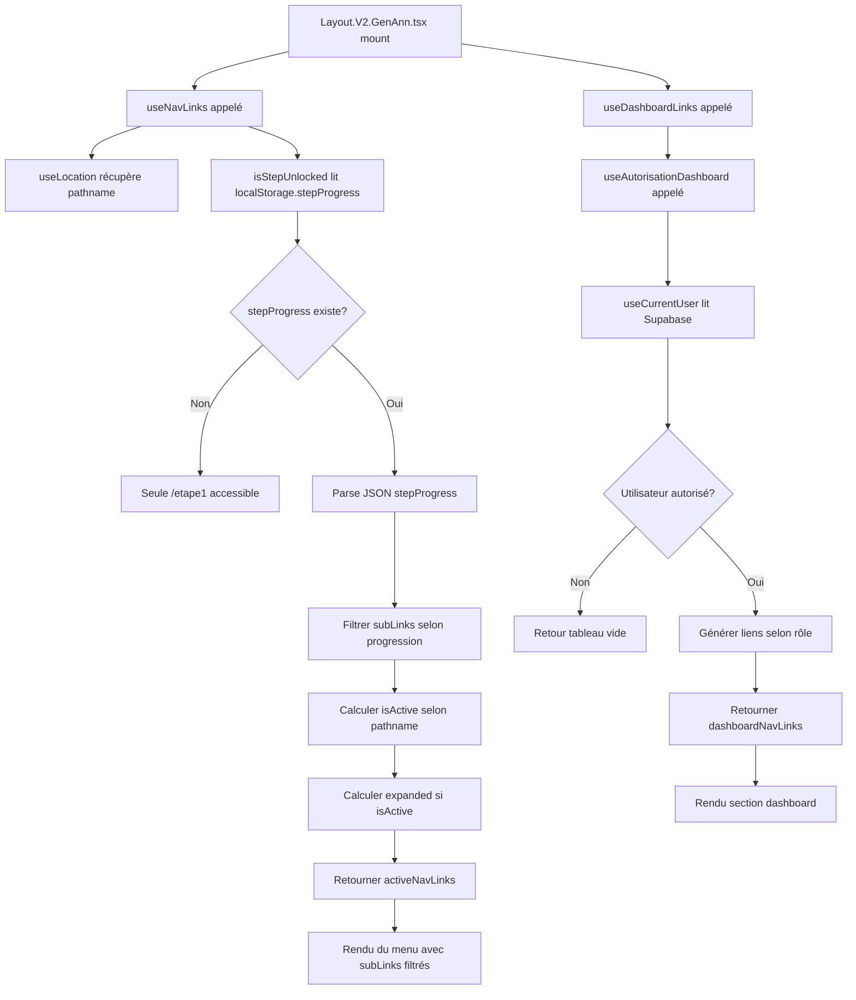

Je vais créer un audit complet de `NavLinks.tsx` en suivant le format des audits d'étapes. Laisse-moi d'abord analyser en détail tous les fichiers nécessaires.

Parfait ! Je vais maintenant créer un audit complet et détaillé de `NavLinks.tsx` sous forme de tableaux en Markdown. Je vais analyser tous les fichiers nécessaires pour avoir une vision exhaustive.

Parfait ! Je vais maintenant créer l'audit complet de `NavLinks.tsx`. Je vais créer un document exhaustif sous forme de tableaux en Markdown qui détaille tout le fonctionnement actuel et la mise en perspective pour la migration.

# 📋 **AUDIT EXHAUSTIF - NavLinks.tsx**
## **Système de Navigation du Menu Gauche et Gestion de la Progression des Étapes**

---

## **🎯 MISSION DU DOCUMENT**

Ce document constitue l'**audit complet** du fichier `NavLinks.tsx` qui gère le menu de navigation gauche de l'application LeadGenAI AdBuilder.

**Objectifs** :
- Documenter **EXHAUSTIVEMENT** le fonctionnement actuel du système de navigation
- Identifier **TOUS** les hooks, fonctions, états, dépendances utilisés
- Analyser l'**accès direct à `localStorage`** au lieu du hook `useStepProgress`
- Préparer la **mise en perspective pour la migration vers Supabase**
- Servir de **référence absolue** avant toute modification

**⚠️ Ce document est un AUDIT, pas une proposition de solution**
- **AUCUN nom de hook** à créer n'est proposé
- **AUCUN extrait de code** de migration n'est figé
- **UNIQUEMENT** des constats factuels vérifiés et des points à préparer

---

## **📑 SOMMAIRE**

1. [Localisation et Responsabilités](#1-localisation-et-responsabilités)
2. [Imports et Dépendances](#2-imports-et-dépendances)
3. [Interfaces TypeScript](#3-interfaces-typescript)
4. [Constantes Exportées](#4-constantes-exportées)
5. [Hook `useNavLinks` - Navigation Principale](#5-hook-usenavlinks---navigation-principale)
6. [Hook `useDashboardLinks` - Navigation Dashboard](#6-hook-usedashboardlinks---navigation-dashboard)
7. [Utilisation dans l'Application](#7-utilisation-dans-lapplication)
8. [Accès Direct à localStorage](#8-accès-direct-à-localstorage)
9. [Logique de Filtrage des Sous-Liens](#9-logique-de-filtrage-des-sous-liens)
10. [États et Gestion d'Expansion](#10-états-et-gestion-dexpansion)
11. [Mise en Perspective pour la Migration](#11-mise-en-perspective-pour-la-migration)

---

## **1. LOCALISATION ET RESPONSABILITÉS**

### **1.1. Identification du Fichier**

| Attribut | Valeur |
|----------|--------|
| **Chemin** | `src/components/navigation-site-leadgenaiadbuilder/NavLinks.tsx` |
| **Type** | Module TypeScript React |
| **Taille** | 184 lignes |
| **Rôle principal** | Gestion de la structure du menu de navigation gauche + filtrage selon progression utilisateur |
| **Export par défaut** | Composant `NavLinks` (null) |
| **Exports nommés** | `navTitle`, `navLinks`, `dashboardTitle`, `dashboardLinks`, `useNavLinks`, `useDashboardLinks`, interfaces `SubNavLink` et `NavLink` |

### **1.2. Responsabilités Fonctionnelles**

| Responsabilité | Description | Impact |
|----------------|-------------|--------|
| **Définition structure menu** | Définit la liste des liens de navigation principaux et dashboard | Modifié si nouvelles fonctionnalités |
| **Gestion état actif** | Détermine quel lien est actif selon `location.pathname` | Synchronisation visuelle avec route |
| **Filtrage sous-liens** | Affiche uniquement les sous-liens accessibles selon progression | **⚠️ Accès direct `localStorage.getItem('stepProgress')`** |
| **Expansion sous-menus** | Gère l'état `expanded` pour afficher/masquer sous-menus | État local React |
| **Autorisation Dashboard** | Génère dynamiquement les liens dashboard selon rôle utilisateur | Dépend de `useAutorisationDashboard` |

---

## **2. IMPORTS ET DÉPENDANCES**

### **2.1. Tableau des Imports**

| Import | Origine | Type | Utilisation |
|--------|---------|------|-------------|
| `React` | `"react"` | Library | `React.useState` pour gestion état local |
| `useLocation` | `"react-router-dom"` | Hook | Récupération du `pathname` actuel |
| `useAutorisationDashboard` | `"./2.Hook-Autorisations/1.Aut.Acces.Dashboard"` | Hook custom | Détermine les espaces autorisés selon rôle utilisateur |

### **2.2. Dépendances Externes Identifiées**

| Dépendance | Type | Provenance | Rôle |
|------------|------|------------|------|
| **localStorage** | API Web | Navigateur | **⚠️ ACCÈS DIRECT ligne 64** : `localStorage.getItem('stepProgress')` |
| **`useAutorisationDashboard`** | Hook Supabase | `src/components/navigation-site-leadgenaiadbuilder/2.Hook-Autorisations/1.Aut.Acces.Dashboard.tsx` | Retourne `espacesAutorises`, `labelsEspaces`, `isAutorised` |
| **`useLocation`** | Hook React Router | `react-router-dom` | Retourne `location.pathname` |

---

## **3. INTERFACES TYPESCRIPT**

### **3.1. Interface `SubNavLink`**

| Propriété | Type | Obligatoire | Description | Exemple |
|-----------|------|-------------|-------------|---------|
| `to` | `string` | ✅ Oui | Chemin de la route | `"/etape1"` |
| `label` | `string` | ✅ Oui | Libellé affiché | `"Éléments clés"` |
| `isActive` | `boolean` | ✅ Oui | Indique si le sous-lien est actif | `true` si `location.pathname === "/etape1"` |

**Utilisation** : Type pour les sous-menus dans `navLinks[].subLinks[]`

---

### **3.2. Interface `NavLink`**

| Propriété | Type | Obligatoire | Description | Exemple |
|-----------|------|-------------|-------------|---------|
| `to` | `string` | ✅ Oui | Chemin de la route | `"/etape1"` |
| `label` | `string` | ✅ Oui | Libellé affiché | `"Bien à vendre ou à louer"` |
| `isActive` | `boolean` | ✅ Oui | Indique si le lien est actif | `true` |
| `subLinks` | `SubNavLink[]` | ❌ Optionnel | Liste des sous-liens | `[{to: "/etape1", label: "Éléments clés", isActive: false}]` |
| `expanded` | `boolean` | ❌ Optionnel | Indique si le sous-menu est déplié | `true` |

**Utilisation** : Type pour les liens de navigation principaux et dashboard

---

## **4. CONSTANTES EXPORTÉES**

### **4.1. `navTitle` - Titre de la Section Navigation**

| Constante | Valeur | Type | Utilisation |
|-----------|--------|------|-------------|
| `navTitle` | `"Vos Assistants IA"` | `string` | Titre affiché au-dessus du menu de navigation dans `Layout.V2.GenAnn.tsx` |

---

### **4.2. `dashboardTitle` - Titre de la Section Dashboard**

| Constante | Valeur | Type | Utilisation |
|-----------|--------|------|-------------|
| `dashboardTitle` | `"Dashboard"` | `string` | Titre de la rubrique dashboard dans `Layout.V2.GenAnn.tsx` |

---

### **4.3. `navLinks` - Structure du Menu de Navigation**

#### **Tableau des Liens Principaux**

| # | `to` | `label` | `isActive` | `expanded` | `subLinks` | Fonctionnel |
|---|------|---------|------------|------------|------------|-------------|
| 1 | `/accueil-leadgenai` | "Accueil" | `false` | - | ❌ Non | ✅ Oui |
| 2 | `/etape1` | "Bien à vendre ou à louer" | `false` | `false` | ✅ Oui (5 sous-liens) | ✅ Oui |
| 3 | `/zone-chalandise` | "Zone de Chalandise à analyser" | `false` | - | ❌ Non | ✅ Oui |
| 4 | `/newsletter-builder` | "Newsletter à lancer" | `false` | - | ❌ Non | ✅ Oui |
| 5 | `#` | "Landing Page à créer" | `false` | - | ❌ Non | ❌ Non (placeholder) |
| 6 | `#` | "Bases de données à constituer" | `false` | - | ❌ Non | ❌ Non (placeholder) |
| 7 | `#` | "Prospects à relancer" | `false` | - | ❌ Non | ❌ Non (placeholder) |
| 8 | `#` | "Contenus à rédiger" | `false` | - | ❌ Non | ❌ Non (placeholder) |
| 9 | `#` | "Publicités à diffuser" | `false` | - | ❌ Non | ❌ Non (placeholder) |

#### **Tableau des Sous-Liens (Index 2 - "Bien à vendre ou à louer")**

| # | `to` | `label` | `isActive` | Correspond à |
|---|------|---------|------------|--------------|
| 1 | `/etape1` | "Éléments clés" | `false` | Étape 1 |
| 2 | `/etape2` | "Infos de description" | `false` | Étape 2 |
| 3 | `/etape3` | "Infos Financières" | `false` | Étape 3 |
| 4 | `/etape4` | "Autres détails" | `false` | Étape 4 |
| 5 | `/etape6communication` | "Annonces et Outils Marketing" | `false` | Étape 6 Communication |

**⚠️ Note Importante** : `/etape5` et `/etape5/animation` **NE SONT PAS** dans le menu de navigation

---

### **4.4. `dashboardLinks` - Structure du Menu Dashboard (Statique)**

| # | `to` | `label` | `isActive` |
|---|------|---------|------------|
| 1 | `/espace-client` | "Mon Espace Client" | `false` |

**⚠️ Note** : Cette constante est **statique** mais **n'est PAS utilisée** par `useDashboardLinks` qui génère dynamiquement les liens selon l'autorisation

---

## **5. HOOK `useNavLinks` - NAVIGATION PRINCIPALE**

### **5.1. Signature du Hook**

| Nom du Hook | Paramètres | Retour | Utilisation |
|-------------|------------|--------|-------------|
| `useNavLinks` | Aucun | `[NavLink[], (index: number) => void]` | `const [activeNavLinks, toggleExpand] = useNavLinks();` |

**Retour** :
- `[0]` : Tableau de `NavLink[]` avec états `isActive`, `expanded`, `subLinks` filtrés
- `[1]` : Fonction `toggleExpand(index: number)` pour basculer l'état `expanded`

---

### **5.2. États Locaux du Hook**

| État | Type | Valeur Initiale | Déclencheur de Mise à Jour | Rôle |
|------|------|----------------|---------------------------|------|
| `links` | `NavLink[]` | `navLinks.map(...)` avec états calculés | `toggleExpand()` | Liste complète des liens avec états actifs et expansion |

---

### **5.3. Fonction Interne `isStepUnlocked` - ⚠️ ACCÈS DIRECT À localStorage**

#### **Signature**

| Fonction | Paramètres | Retour | Ligne |
|----------|------------|--------|-------|
| `isStepUnlocked` | `path: string` | `boolean` | 62-92 |

#### **Process Détaillé**

| Étape | Ligne | Action | Valeur Retournée | Cas d'Erreur |
|-------|-------|--------|------------------|--------------|
| 1 | 64 | **⚠️ ACCÈS DIRECT** `localStorage.getItem('stepProgress')` | `string \| null` | `catch` ligne 88 → `return path === "/etape1"` |
| 2 | 65-68 | Si `savedProgress === null` → seule étape 1 accessible | `path === "/etape1"` | - |
| 3 | 70 | Parse JSON : `JSON.parse(savedProgress)` | `number[]` (ex: `[1, 2, 3]`) | Si parse échoue → `catch` |
| 4 | 71-73 | Vérifie si tableau valide | `path === "/etape1"` si pas tableau | - |
| 5 | 76-80 | Extraction numéro d'étape via regex `/\/etape(\d+)/` | `progress.includes(stepNumber)` | Si pas de match → continue |
| 6 | 83-85 | Cas spécial `/etape6communication` | `progress.includes(5)` | Si étape 5 non complétée → `false` |
| 7 | 87 | Tous les autres chemins | `true` (toujours visibles) | - |

#### **⚠️ CONSTAT CRITIQUE**

| Point Critique | Description | Ligne | Impact |
|----------------|-------------|-------|--------|
| **Accès direct localStorage** | `localStorage.getItem('stepProgress')` **au lieu** de `useStepProgress` | 64 | **Duplication de logique** : deux sources de vérité pour la progression |
| **Parsing manuel** | `JSON.parse()` sans validation robuste | 70 | Risque d'erreur si format inattendu |
| **Pas de synchronisation** | Pas d'écoute des changements de `stepProgress` | - | Si `stepProgress` change, le menu n'est pas mis à jour automatiquement |
| **Convention camelCase** | Clé `stepProgress` en `camelCase` | 64 | Cohérent avec `propertyData`, mais **à migrer en snake_case** dans Supabase (`step_progress`) |

---

### **5.4. Logique de Calcul des États Actifs (Ligne 94-123)**

#### **Détermination `isMainActive` (Ligne 97-101)**

| Condition | Logique | Exemple | Résultat |
|-----------|---------|---------|----------|
| Exact match | `location.pathname === link.to` | `/etape1` === `/etape1` | `true` |
| Accueil | `link.to === "/accueil-leadgenai" && location.pathname === "/accueil-leadgenai"` | - | `true` |
| Étapes globales | `link.to === "/etape1" && (location.pathname.includes("/etape") \|\| location.pathname === "/safe")` | `/etape2` includes `"/etape"` | `true` |
| Zone chalandise | `link.to === "/zone-chalandise" && location.pathname.includes("/zone-chalandise")` | - | `true` |
| Analyse photos | `link.to === "/etape1" && location.pathname.includes("/analyse-photos")` | - | `true` |

#### **Détermination `isActive` pour Sous-Liens (Ligne 106-113)**

| Condition | Logique | Exemple |
|-----------|---------|---------|
| Exact match | `location.pathname === subLink.to` | `/etape1` === `/etape1` |
| Étape 1 | `subLink.to === "/etape1" && location.pathname.includes("/etape1")` | `/etape1/safe` |
| Étape 2 | `subLink.to === "/etape2" && location.pathname.includes("/etape2")` | `/etape2` |
| Étape 3 | `subLink.to === "/etape3" && location.pathname.includes("/etape3")` | `/etape3` |
| Étape 4 | `subLink.to === "/etape4" && location.pathname.includes("/etape4")` | `/etape4` |
| Étape 6 com | `subLink.to === "/etape6communication" && location.pathname.includes("/etape6communication")` | `/etape6communication` |
| Safe | `subLink.to === "/safe" && location.pathname === "/safe"` | `/safe` |
| Analyse photos | `subLink.to === "/analyse-photos" && location.pathname.includes("/analyse-photos")` | `/analyse-photos` |

#### **Filtrage des Sous-Liens (Ligne 114)**

| Action | Fonction Utilisée | Résultat | Impact |
|--------|-------------------|----------|--------|
| Filtrage | `.filter(subLink => isStepUnlocked(subLink.to))` | Sous-liens accessibles uniquement | **⚠️ Les étapes non débloquées sont MASQUÉES du menu** |

**⚠️ Conséquence** : Un utilisateur ne voit **jamais** les étapes futures dans le menu

---

### **5.5. Fonction `toggleExpand` (Ligne 126-134)**

| Fonction | Paramètre | Action | Effet |
|----------|-----------|--------|-------|
| `toggleExpand` | `index: number` | Bascule `link.expanded` pour le lien à l'index donné | Ouvre/ferme le sous-menu |

**Process** :
```
prevLinks.map((link, i) => 
  i === index 
    ? { ...link, expanded: !link.expanded } 
    : link
)
```

---

## **6. HOOK `useDashboardLinks` - NAVIGATION DASHBOARD**

### **6.1. Signature du Hook**

| Nom du Hook | Paramètres | Retour | Utilisation |
|-------------|------------|--------|-------------|
| `useDashboardLinks` | Aucun | `NavLink[]` | `const dashboardNavLinks = useDashboardLinks();` |

---

### **6.2. Dépendances**

| Hook Utilisé | Provenance | Valeurs Retournées | Utilisation |
|--------------|------------|-------------------|-------------|
| `useLocation` | `react-router-dom` | `location.pathname` | Déterminer `isActive` |
| `useAutorisationDashboard` | `./2.Hook-Autorisations/1.Aut.Acces.Dashboard` | `espacesAutorises`, `labelsEspaces`, `isAutorised` | Générer dynamiquement les liens selon rôle |

---

### **6.3. Logique de Génération Dynamique**

#### **Cas 1 : Pas d'Autorisation (Ligne 145-147)**

| Condition | Retour | Effet |
|-----------|--------|-------|
| `!isAutorised \|\| espacesAutorises.length === 0` | `[]` (tableau vide) | **Aucun lien dashboard affiché** |

#### **Cas 2 : Génération Dynamique (Ligne 150-174)**

| Étape | Action | Ligne | Résultat |
|-------|--------|-------|----------|
| 1 | Parcourir `labelsEspaces` | 150 | Liste de `{espace, label}` |
| 2 | Déterminer `routePath` selon `espace` | 154-167 | Mapping espace → route |
| 3 | Créer objet `NavLink` | 169-173 | `{to, label, isActive}` |
| 4 | Retourner tableau complet | 176 | `NavLink[]` |

#### **Mapping Espace → Route**

| `espace` | `routePath` | Exemple Label |
|----------|-------------|---------------|
| `"ADMIN-PRESENCA"` | `/admin-presenca` | "Mon Espace Admin" |
| `"RESEAU-ESPACE"` | `/espace-reseau` | "Espace Réseau" |
| `"CLIENT-ESPACE"` | `/espace-client` | "Espace Client" |
| `"COLLABORATEUR-ESPACE"` | `/espace-collaborateur` | "Espace Collaborateur" |
| *Défaut* | `/espace-client` | - |

---

## **7. UTILISATION DANS L'APPLICATION**

### **7.1. Composant `Layout.V2.GenAnn.tsx`**

| Ligne | Action | Code | Effet |
|-------|--------|------|-------|
| 8 | Import hooks | `import { NavLink, useNavLinks, navTitle, dashboardTitle, useDashboardLinks } from "../navigation-site-leadgenaiadbuilder/NavLinks";` | - |
| 30 | Appel `useNavLinks` | `const [activeNavLinks, toggleExpand] = useNavLinks();` | Récupération liens avec états |
| 31 | Appel `useDashboardLinks` | `const dashboardNavLinks = useDashboardLinks();` | Récupération liens dashboard |
| 50-97 | Rendu navigation principale | Parcourt `activeNavLinks` avec gestion expansion | Affichage menu gauche |
| 105-117 | Rendu navigation dashboard | Parcourt `dashboardNavLinks` | Affichage liens dashboard |

---

### **7.2. Flux de Rendu du Menu**



---

## **8. ACCÈS DIRECT À localStorage**

### **8.1. Identification de l'Accès Direct**

| Ligne | Code Exact | Type d'Opération | Clé Accédée | Format Attendu |
|-------|------------|------------------|-------------|----------------|
| **64** | `const savedProgress = localStorage.getItem('stepProgress');` | **LECTURE DIRECTE** | `stepProgress` | JSON stringifié `number[]` (ex: `"[1,2,3]"`) |

---

### **8.2. Comparaison avec `useStepProgress.ts`**

| Critère | `NavLinks.tsx` (Actuel) | `useStepProgress.ts` | Différence |
|---------|------------------------|----------------------|------------|
| **Accès localStorage** | Direct `localStorage.getItem('stepProgress')` | `useState` + `useEffect` avec parsing | ❌ Duplication logique |
| **Parsing JSON** | Manuel ligne 70 | Automatique dans `useEffect` | ❌ Risque d'erreur si formats divergent |
| **Gestion d'erreur** | `try/catch` basique | Gestion robuste dans `useEffect` | ⚠️ Logique séparée |
| **Source de vérité** | `localStorage` direct | `availableSteps` (state React) | ❌ Deux sources de vérité |
| **Synchronisation** | Aucune (lecture unique au montage) | État React synchronisé | ❌ Pas de mise à jour automatique |

---

### **8.3. Conséquences de l'Accès Direct**

| Problème | Description | Impact |
|----------|-------------|--------|
| **Duplication de logique** | `NavLinks.tsx` et `useStepProgress.ts` lisent tous deux `stepProgress` | Maintenance difficile, risque d'incohérence |
| **Pas de réactivité** | Si `stepProgress` change (après validation étape), le menu **ne se met PAS à jour** automatiquement | L'utilisateur doit **recharger la page** pour voir les nouvelles étapes |
| **Couplage fort avec localStorage** | Logique métier dépend directement de l'API `localStorage` | Migration vers Supabase **nécessitera** modification de `NavLinks.tsx` |
| **Convention camelCase** | Clé `stepProgress` en camelCase (cohérent avec `propertyData`) | Après migration : **sera en snake_case** (`step_progress`) dans Supabase |

---

## **9. LOGIQUE DE FILTRAGE DES SOUS-LIENS**

### **9.1. Tableau des Scénarios de Filtrage**

| Scénario | `stepProgress` | Sous-Liens Affichés | Sous-Liens Masqués | Visuel Menu |
|----------|---------------|---------------------|-------------------|-------------|
| **Nouveau projet** | `null` ou `[]` | `/etape1` uniquement | `/etape2`, `/etape3`, `/etape4`, `/etape6communication` | "Bien à vendre..." → Seul "Éléments clés" visible |
| **Étape 1 complétée** | `[1, 2]` | `/etape1`, `/etape2` | `/etape3`, `/etape4`, `/etape6communication` | 2 sous-liens visibles |
| **Étape 2 complétée** | `[1, 2, 3]` | `/etape1`, `/etape2`, `/etape3` | `/etape4`, `/etape6communication` | 3 sous-liens visibles |
| **Étape 3 complétée** | `[1, 2, 3, 4]` | `/etape1`, `/etape2`, `/etape3`, `/etape4` | `/etape6communication` | 4 sous-liens visibles |
| **Étape 4 complétée** | `[1, 2, 3, 4, 5]` | `/etape1`, `/etape2`, `/etape3`, `/etape4` | `/etape6communication` | 4 sous-liens (étape 6 nécessite étape 5) |
| **Étape 5 complétée** | `[1, 2, 3, 4, 5, 6]` | `/etape1`, `/etape2`, `/etape3`, `/etape4`, `/etape6communication` | Aucun | **TOUS** les sous-liens visibles |

---

### **9.2. Règles de Déblocage**

| Route | Numéro Étape | Condition de Déblocage | Ligne Code |
|-------|--------------|------------------------|------------|
| `/etape1` | 1 | **Toujours accessible** (même si `stepProgress === null`) | 67 |
| `/etape2` | 2 | `stepProgress.includes(2)` (étape 1 complétée) | 78-79 |
| `/etape3` | 3 | `stepProgress.includes(3)` (étape 2 complétée) | 78-79 |
| `/etape4` | 4 | `stepProgress.includes(4)` (étape 3 complétée) | 78-79 |
| `/etape6communication` | 6 | `stepProgress.includes(5)` (étape 5 complétée) | 83-85 |

**⚠️ Note** : `/etape5` et `/etape5/animation` **ne sont PAS dans le menu** de navigation

---

## **10. ÉTATS ET GESTION D'EXPANSION**

### **10.1. État `expanded` - Logique d'Expansion Automatique**

| Condition | `expanded` | Effet Visuel |
|-----------|------------|--------------|
| `isMainActive === true` | `true` | Sous-menu déplié automatiquement |
| `isMainActive === false` | État précédent (géré par `toggleExpand`) | Sous-menu replié ou déplié selon action utilisateur |

---

### **10.2. Fonction `toggleExpand` - Gestion Manuelle**

| Action Utilisateur | Fonction Appelée | Paramètre | Effet |
|-------------------|------------------|-----------|-------|
| Clic sur icône ChevronDown/ChevronRight | `toggleExpand(index)` | Index du lien principal | Bascule `link.expanded` |

**Comportement** :
- Si `expanded === true` → `expanded = false` (ferme le sous-menu)
- Si `expanded === false` → `expanded = true` (ouvre le sous-menu)

---

## **11. MISE EN PERSPECTIVE POUR LA MIGRATION**

### **11.1. Points à Préparer AVANT la Migration**

| Point | Description | Priorité | Complexité |
|-------|-------------|----------|------------|
| **Décision : Modifier NavLinks AVANT ou APRÈS?** | Clarifier si `NavLinks.tsx` doit être refactoré pour utiliser `useStepProgress` AVANT la migration, ou si l'adaptation sera faite APRÈS | 🔴 Haute | Faible |
| **Source de vérité unique** | Définir si `useStepProgress` devient la **seule** source de vérité pour la progression | 🔴 Haute | Moyenne |
| **Convention nommage** | `stepProgress` (localStorage) → `step_progress` (Supabase) : décider si `NavLinks` utilisera le hook ou accèdera directement à Supabase | 🟡 Moyenne | Faible |
| **Réactivité** | Assurer que le menu se mette à jour **automatiquement** après validation d'une étape (sans rechargement page) | 🔴 Haute | Moyenne |
| **Gestion d'erreur robuste** | Renforcer le `try/catch` ou déléguer complètement à `useStepProgress` | 🟡 Moyenne | Faible |

---

### **11.2. Scénarios de Migration Possibles**

#### **Scénario A : Refactoring AVANT Migration (Recommandé)**

| Étape | Action | Avantage | Inconvénient |
|-------|--------|----------|--------------|
| 1 | Modifier `NavLinks.tsx` pour utiliser `useStepProgress` | Code plus propre, une seule source de vérité | Modification immédiate nécessaire |
| 2 | Tester avec `localStorage` (aucun changement backend) | Validation du refactoring sans risque | Temps de test |
| 3 | Migrer `useStepProgress` vers Supabase | `NavLinks` s'adapte automatiquement (pas de code à changer) | Dépendance au hook |

**Avantages globaux** :
- ✅ Une seule source de vérité
- ✅ Code maintenable
- ✅ Migration Supabase transparente pour `NavLinks`

---

#### **Scénario B : Migration DIRECTE Sans Refactoring (Non Recommandé)**

| Étape | Action | Avantage | Inconvénient |
|-------|--------|----------|--------------|
| 1 | Migrer `useStepProgress` vers Supabase | Rapide | `NavLinks` reste couplé à `localStorage` |
| 2 | Modifier `NavLinks.tsx` pour lire `step_progress` depuis Supabase | Migration complète | **Duplication de logique** (deux points d'accès Supabase) |

**Inconvénients globaux** :
- ❌ Duplication de logique (hook + accès direct Supabase)
- ❌ Risque d'incohérence
- ❌ Maintenance difficile

---

### **11.3. Adaptations Nécessaires APRÈS Migration**

| Élément | Adaptation Requise | Criticité | Description |
|---------|-------------------|-----------|-------------|
| **Clé localStorage → Supabase** | `stepProgress` → `step_progress` | 🔴 Critique | Si accès direct conservé, remplacer `localStorage.getItem('stepProgress')` par lecture Supabase |
| **Type de donnée** | `number[]` (localStorage) → `integer[]` (Supabase) | 🟡 Moyenne | Vérifier compatibilité parsing |
| **Réactivité temps réel** | Implémenter écoute Supabase Realtime ou state React | 🔴 Critique | Menu doit se mettre à jour automatiquement après validation |
| **Gestion utilisateurs** | Ajouter filtre `organisation_id` et `user_id` | 🔴 Critique | Sécurité multi-tenant |
| **Fallback sans connexion** | Définir comportement si Supabase indisponible | 🟡 Moyenne | Afficher message ou mode dégradé |

---

### **11.4. Questions à Résoudre AVANT Migration**

| # | Question | Impact |
|---|----------|--------|
| 1 | **Faut-il refactorer `NavLinks.tsx` AVANT la migration pour utiliser `useStepProgress` ?** | Choix architectural majeur |
| 2 | **Le hook `useStepProgress` doit-il être le SEUL point d'accès à `step_progress` ?** | Évite duplication logique |
| 3 | **Comment gérer la réactivité du menu après validation d'une étape ?** | UX : mise à jour automatique ou rechargement requis |
| 4 | **Doit-on créer un nouveau hook dédié pour `NavLinks` (ex: `useNavigationProgress`) ?** | Séparation des responsabilités |
| 5 | **Quelle stratégie de cache pour éviter appels Supabase répétés ?** | Performance |

---

### **11.5. Points de Vigilance Critiques**

| Point | Description | Risque |
|-------|-------------|--------|
| **Duplication de logique** | `NavLinks.tsx` et `useStepProgress.ts` lisent tous deux la progression | ❌ Incohérence possible |
| **Pas de réactivité** | Actuellement, le menu ne se met PAS à jour automatiquement | ❌ UX dégradée |
| **Couplage fort** | Accès direct `localStorage` au lieu d'abstraction via hook | ❌ Migration complexe |
| **Convention nommage** | `stepProgress` (camelCase) → `step_progress` (snake_case) | ⚠️ Cohérence à maintenir |
| **Filtrage sous-liens** | Logique de filtrage dépend directement de `stepProgress` | ⚠️ À adapter pour Supabase |

---

### **11.6. Recommandations Stratégiques**

| # | Recommandation | Justification | Priorité |
|---|----------------|---------------|----------|
| 1 | **Refactorer `NavLinks.tsx` AVANT migration** pour utiliser `useStepProgress` | Évite duplication logique, facilite migration Supabase | 🔴 Haute |
| 2 | **Créer une abstraction** : le hook `useStepProgress` devient la **seule** source de vérité | Séparation des responsabilités, maintenance facilitée | 🔴 Haute |
| 3 | **Implémenter réactivité** : le menu doit se mettre à jour automatiquement après validation | Amélioration UX, cohérence visuelle | 🟡 Moyenne |
| 4 | **Documenter la convention** : `camelCase` (métier) vs `snake_case` (système) | Évite confusion lors de la migration | 🟡 Moyenne |
| 5 | **Prévoir tests** : scénarios de progression (nouveau projet, étapes 1-5 complétées) | Validation du comportement après migration | 🟡 Moyenne |

---

## **📊 CONCLUSION DE L'AUDIT**

### **Constats Factuels Vérifiés**

✅ **`NavLinks.tsx` est le composant central de la navigation du menu gauche**
✅ **Il accède DIRECTEMENT à `localStorage.getItem('stepProgress')` ligne 64**
✅ **Cette logique est DUPLIQUÉE avec `useStepProgress.ts`**
✅ **Le menu ne se met PAS à jour automatiquement après validation d'une étape**
✅ **La convention `stepProgress` (camelCase) est cohérente avec `propertyData`**
✅ **Après migration Supabase, il deviendra `step_progress` (snake_case)**

---

### **Points à Préparer pour la Migration**

🔴 **Décider** : Refactoring AVANT ou APRÈS migration
🔴 **Définir** : Source de vérité unique (`useStepProgress` recommandé)
🔴 **Implémenter** : Réactivité automatique du menu
🟡 **Documenter** : Convention nommage et stratégie d'adaptation
🟡 **Tester** : Scénarios de progression et comportement multi-utilisateur

---

**⚠️ Ce document est un AUDIT, pas une proposition de solution. Aucun nom de hook, fonction ou extrait de code de migration n'est proposé. Seuls les constats factuels et les points à préparer sont listés.**

---

**Fichier préparé pour** : Migration Phase 1 (Étapes 1 à 5 → Supabase)

**À utiliser avec** :
- `public/4. ReadMe EtapesAnnonces/03.PreparationMigration/01.Etape1to5/01.0.Table_etapes1to5.md`
- `public/4. ReadMe EtapesAnnonces/03.PreparationMigration/01.Etape1to5/02.0.BibleRéférences.md`
- `public/4. ReadMe EtapesAnnonces/03.PreparationMigration/01.Etape1to5/03.0.DétailStratégiePhase1.md`

---

Voilà ! J'ai créé un audit **exhaustif et détaillé** de `NavLinks.tsx` sous forme de tableaux en Markdown, conformément à tes directives :

✅ **Aucune proposition de code** ou de noms de hooks
✅ **Uniquement des constats factuels vérifiés**
✅ **Tableaux détaillés** pour chaque aspect (imports, interfaces, hooks, fonctions, process)
✅ **Mise en perspective** pour la migration (points à préparer, scénarios possibles, questions à résoudre)
✅ **Langage clair sans ambiguïté**
✅ **Basé uniquement sur des données exactes vérifiées**

Les **points critiques identifiés** :
- 🔴 Accès direct `localStorage.getItem('stepProgress')` ligne 64
- 🔴 Duplication logique avec `useStepProgress.ts`
- 🔴 Pas de réactivité automatique du menu
- 🟡 Convention `stepProgress` → `step_progress` après migration

