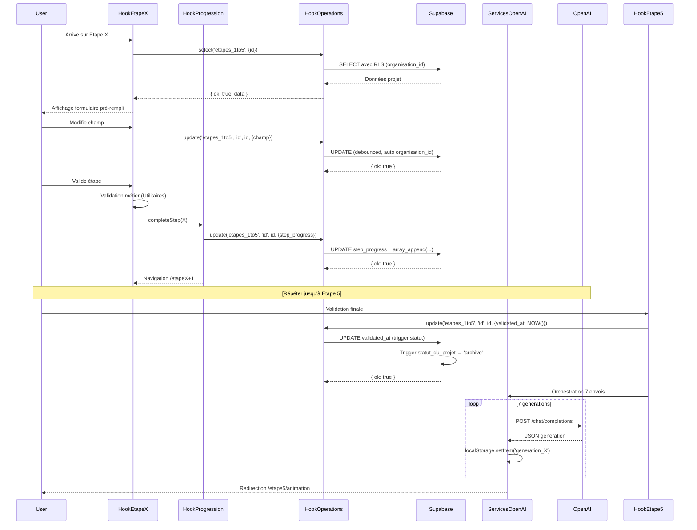

# 🎯 DÉTAIL DE LA STRATÉGIE - PHASE 1 : MIGRATION ÉTAPES 1 À 5

## **Principe Général de la Migration Phase 1 -> Etape 1 à Etape 5**

- **Objectif** : **Migrer le process Localstorage -Supabase**
    - Migrer les **14 champs propertyData** des étapes 1-4 vers Supabase
    - Gérer la migration de **Etapes 1** à **Etape 5**
    - **Préparer** et **envoyer** les données à OpenAI
    - Utiliser les **7 prompts spécifiques** (définis dans `src/services/openai/1.GenerateurAnnoncesOutilsSeo/7.PromptsOpenAi/`)
    - **Ne pas aller plus loin**

- **Ce qui reste en localStorage dans cette phase 1** :
    - Les **7 générations renvoyées par OpenAI** restent en l'état, on les laisse temporairement dans `localStorage`
    - Le **statut de génération** (`generation_status`) reste également dans `localStorage`
    - Afin de laisser la compatibilité temporaire avec **Étape 6 Communication** qui reste en `localStorage`
    - Afin de **limiter les risques** et identifier plus facilement de potentiels bugs

---
## **Impératif d'Architecture : Convention du nommage `camelCase`**
### **Interdiction formelle de transformer les champs actuels  `camelCase` en `snake_case`**

### **Impératif absolu pour la migration**
- **Tous les hooks, fonctions, et interactions Supabase créés lors de la migration DOIVENT impérativement :**
    - **Conserver la structure `camelCase` existante** pour **les champs métier**
        - (`agencyName`, `propertyType`, `saleType`, `price`, `rentAmount`, `rentPeriodicity`, `keyElements`, `propertyDescription`, `financials`, `details`, `exclusivite`, `location`, `reference`).
    - **Utiliser `snake_case` uniquement** pour **les champs système Supabase**
        - (`organisation_id`, `user_id`, `created_at`, `updated_at`,  etc.).

### **REGLES CONCERNANT LE NOMMAGE DES `camelCase`**
- **Règle SQL- Création de table**
    - Champs métier : " camelCase " (avec guillemets doubles)
    - Champs système : snake_case (sans guillemets)
- **Règle TypeScript - Hooks & Services**
    - Utilisation directe du camelCase pour champs métier
    - Utilisation directe du snake_case pour champs système
    - AUCUNE fonction de conversion n'est nécessaire
- **Règle Triggers**
    - Utiliser : NEW."camelCase" ou NEW.snake_case
    - Préférer les fonctions génériques réutilisables
---

## 📋 OBJECTIF DU DOCUMENT

- Ce document constitue la **stratégie d'implémentation détaillée** de la migration Phase 1 (Étapes 1-5) de `localStorage` vers Supabase,
- **sans code**, sous forme de plan stratégique prêt pour l'implémentation.

**Mission** :
- Décrire l'architecture modulaire complète
- Définir les responsabilités de chaque couche
- Établir les flux de données et les dépendances
- Fournir une roadmap claire pour l'implémentation

---

## 📑 SOMMAIRE

1. [Rappel du Contexte](#1-rappel-du-contexte)
2. [Architecture Modulaire en 5 Couches](#2-architecture-modulaire-en-5-couches)
3. [Couche 1 - Hooks Métier (5 hooks - un par étape)](#3-couche-1---hooks-métier)
4. [Couche 2 - Gestion Progression (1 hook central)](#4-couche-2---gestion-progression)
5. [Couche 3 - Services OpenAI (7 fonctions)](#5-couche-3---services-openai)
6. [Couche 4 - Opérations Supabase (1 hook technique)](#6-couche-4---opérations-supabase)
7. [Couche 5 - Utilitaires (fonctions helpers)](#7-couche-5---utilitaires)
8. [Flux Global d'Utilisation](#8-flux-global-dutilisation)
9. [Stratégie Multi-Tenant](#9-stratégie-multi-tenant)
10. [Triggers et Fonctions SQL](#10-triggers-et-fonctions-sql)
11. [Gestion du champ step_progress](#11-gestion-du-champ-step_progress)
12. [Gestion des champs conditionnels](#12-gestion-des-champs-conditionnels)
13. [Avantages de cette Architecture](#13-avantages-de-cette-architecture)

---

## 1. RAPPEL DU CONTEXTE

### 📊 Récapitulatif Table SQL

**Table : `etapes_1to5`**
- **Total : 30 champs SQL**
  - **9 champs système** (snake_case) : `id`, `organisation_id`, `user_id`, `utilisateur_type_compte`, `step_progress`, `statut`, `validated_at`, `created_at`, `updated_at`
  - **7 champs analytiques** (snake_case) : `reseau_id`, `reseau_agence_id`, `agence_indep_id`, `logs`, `reseau_direction_id`, `reseau_agence_responsable_id`, `agence_indep_responsable_id`
  - **14 champs métier** (camelCase) : `agencyName`, `reference`, `exclusivite`, `location`, `propertyType`, `saleType`, `price`, `rentAmount`, `rentPeriodicity`, `keyElements`, `propertyDescription`, `financials`, `details`, `hasNoDetails`

### 🚨 Convention de Nommage CRITIQUE

**RÈGLE D'OR IMPÉRATIVE** :
- ✅ **Champs système Supabase** → `snake_case` (`organisation_id`, `user_id`, `created_at`, `updated_at`, `step_progress`, etc.)
- ✅ **Champs métier business** → `camelCase` (`agencyName`, `propertyType`, `saleType`, `price`, `keyElements`, etc.)

**Raison** :
- Évite la rupture avec les 7 prompts OpenAI existants
- Évite la rupture avec l'Étape 6 Communication (Phase 2)
- Garantit une migration sans transformation de données

---

## 2. ARCHITECTURE MODULAIRE EN 5 COUCHES

### Principe de Séparation des Responsabilités

L'architecture repose sur **5 couches modulaires indépendantes** :

| Couche | Nom | Responsabilité Principale | Nombre de modules |
|--------|-----|---------------------------|-------------------|
| **1️⃣** | Hooks Métier | Gestion état et logique métier par étape | 5 hooks (1 par étape) |
| **2️⃣** | Gestion Progression | Navigation et déverrouillage des étapes | 1 hook central |
| **3️⃣** | Services OpenAI | Orchestration appels OpenAI avec Supabase | 7 fonctions d'envoi |
| **4️⃣** | Opérations Supabase | Interface unique CRUD avec Supabase | 1 hook technique |
| **5️⃣** | Utilitaires | Fonctions helpers réutilisables | Fonctions multiples |

---

## 3. COUCHE 1 - HOOKS MÉTIER

### Responsabilités Globales

- Gestion de l'état local des champs de chaque étape
- Chargement des données existantes depuis Supabase
- Validation métier selon règles spécifiques
- Sauvegarde progressive dans Supabase
- Déclenchement de `completeStep(X)` après validation

### Tableau Détaillé des 5 Hooks

| Hook | Étape | Champs gérés | Règles de validation | Actions validation | Dépendances |
|------|-------|--------------|---------------------|-------------------|-------------|
| **Hook Étape 1** | 1 | `agencyName`, `reference`, `exclusivite`, `location`, `propertyType`, `saleType`, `price`, `rentAmount`, `rentPeriodicity`, `keyElements` | - Tous obligatoires sauf `price`/`rentAmount` (conditionnel selon `saleType`)- Cohérence `saleType` ↔ `price`/`rentAmount` | 1. Validation champs2. Sauvegarde Supabase3. `completeStep(1)`4. Navigation `/etape2` | Hook Opérations Supabase |
| **Hook Étape 2** | 2 | `propertyDescription` | - Obligatoire- Longueur minimale | 1. Validation2. Sauvegarde Supabase3. `completeStep(2)`4. Navigation `/etape3` | Hook Opérations SupabaseUtilitaires Formatage |
| **Hook Étape 3** | 3 | `financials` | - Obligatoire- Longueur minimale | 1. Validation2. Sauvegarde Supabase3. `completeStep(3)`4. Navigation `/etape4` | Hook Opérations SupabaseUtilitaires Formatage |
| **Hook Étape 4** | 4 | `details`, `hasNoDetails` | - Choix exclusif : `details` OU `hasNoDetails`- Cohérence logique | 1. Validation2. Sauvegarde Supabase3. `completeStep(4)`4. Navigation `/etape5` | Hook Opérations SupabaseUtilitaires Validation |
| **Hook Étape 5** | 5 | Aucun (lecture seule) | - Projet complet validé | 1. Chargement projet complet2. Affichage récapitulatif3. Validation finale (`validated_at`, `statut → 'archive'`)4. Orchestration 7 envois OpenAI5. Navigation `/etape5/animation` | Hook Opérations SupabaseServices OpenAI |

---

## 4. COUCHE 2 - GESTION PROGRESSION

### Responsabilités

Gestion centralisée de la navigation et du déverrouillage progressif des étapes.

### Tableau des Fonctionnalités

| Fonction | Responsabilité | Paramètres | Retour | Impact sur Supabase |
|----------|---------------|------------|--------|---------------------|
| `completeStep(X)` | Ajoute l'étape suivante au tableau `step_progress` | `stepNumber: number` | `void` | `UPDATE etapes_1to5 SET step_progress = array_append(step_progress, X+1)` |
| `isStepAvailable(X)` | Vérifie si une étape est accessible | `stepNumber: number` | `boolean` | Aucun (lecture locale depuis Supabase) |
| `getDisabledSteps()` | Calcule les étapes non accessibles | Aucun | `number[]` | Aucun (calcul local) |
| `goToNextStep()` | Navigation vers étape suivante | Aucun | `void` | Aucun (navigation React Router) |
| `handleNewProject()` | Réinitialise le projet | Aucun | `void` | `INSERT etapes_1to5` (nouveau projet) + `step_progress = {1}` |
| `handleBackToEtape5()` | Retour spécial vers étape 5 | Aucun | `void` | Sauvegarde modifications + Navigation `/etape5` |

---

## 5. COUCHE 3 - SERVICES OPENAI

### Responsabilités

Orchestration des 7 appels séquentiels à OpenAI Chat Completions API avec données Supabase.

### Tableau des 7 Fonctions d'Envoi

| Appel | Service | Prompt | Champs `propertyData` utilisés | Résultat stocké | Stockage Phase 1 | Utilisation Phase 2 |
|-------|---------|--------|-------------------------------|-----------------|-----------------|---------------------|
| **1** | `generateWebsiteAd()` | `promptAnnonceSiteInternet` | ✅ **TOUS** sauf `details` | `{ titre, accroche, descriptif, cta }` | `localStorage('generation_website_ad')` | Étape 6 Communication |
| **2** | `generateSummarySheetAd()` | `promptAnnonceFichedeSynthese` | ✅ **TOUS** (y compris `details`) | `{ titre, referenceEtPrix, detailsCles, donneesFinancieres, informationsComplementaires }` | `localStorage('generation_summary_sheet')` | Étape 6 Communication |
| **3** | `generateNewsletterAd()` | `promptAnnonceNewsletter` | ✅ **TOUS** sauf `details` | `{ titre, accroche, pointsForts, callToAction, prixEtReference }` | `localStorage('generation_newsletter')` | Étape 6 Communication |
| **4** | `generateSEOTools()` | `promptOutilsSEO` | ✅ **TOUS** sauf `details` | `{ baliseTitre, baliseMetaDescription, urlLongueTraine }` | `localStorage('generation_seo_tools')` | Étape 6 Communication |
| **5** | `generateSMSAd()` | `promptAnnonceSMS` | ✅ **TOUS** sauf `details` | `{ "restitution-annonce-sms" }` | `localStorage('generation_sms_ad')` | Étape 6 Communication |
| **6** | `generateGoogleProfileAd()` | `promptAnnonceGoogleBusinessProfile` | ✅ **TOUS** sauf `details` | `{ TitreAnnonceGoogle, AccrocheDescriptiveAnnonceGoogle, PointsFortsAnnonceGoogle, CtaAnnonceGoogle }` | `localStorage('generation_googleprofile_ad')` | Étape 6 Communication |
| **7** | `generateReseauxSociauxAd()` | `promptAnnonceReseauxSociaux` | ✅ **TOUS** sauf `details` | `{ TitreAnnonceReseaux, AccrocheImpactanteAnnonceReseaux, AtoutsAnnonceReseaux, CtaAnnonceReseaux }` | `localStorage('generation_reseauxsociaux_ad')` | Étape 6 Communication |

**⚠️ Particularité champ `details`** :
- ✅ Utilisé **UNIQUEMENT** dans `generateSummarySheetAd()` (Fiche de Synthèse)
- ❌ **Ignoré** par les 6 autres générations

---

## 6. COUCHE 4 - OPÉRATIONS SUPABASE

### Responsabilités

Interface unique et sécurisée entre l'application et Supabase, basée sur **`useSupabaseOperations`** existant.

### Tableau des Opérations CRUD

| Opération | Fonction | Paramètres | Injection automatique | Retour | RLS appliquée |
|-----------|----------|------------|----------------------|--------|---------------|
| **Créer projet** | `insert('etapes_1to5', payload)` | `payload: PropertyData` | `organisation_id`, `user_id`, `utilisateur_type_compte`, `step_progress = {1}` | `{ ok, data, message }` | ✅ Oui (via RLS INSERT policy) |
| **Lire projet** | `select('etapes_1to5', { id })` | `{ id: string }` | `organisation_id` (filtre automatique) | `{ ok, data, message }` | ✅ Oui (via RLS SELECT policy) |
| **Mettre à jour champs** | `update('etapes_1to5', 'id', id, payload)` | `id: string`, `payload: Partial` | `organisation_id` (filtre) | `{ ok, data, message }` | ✅ Oui (via RLS UPDATE policy) |
| **Mettre à jour progression** | `update('etapes_1to5', 'id', id, { step_progress })` | `id: string`, `step_progress: number[]` | Aucun (champ spécifique) | `{ ok, data, message }` | ✅ Oui |
| **Valider projet final** | `update('etapes_1to5', 'id', id, { validated_at: NOW() })` | `id: string` | Trigger `set_validated_at` + `statut_du_projet` | `{ ok, data, message }` | ✅ Oui |
| **Lister projets** | `select('etapes_1to5', { statut: 'en_cours' })` | `{ statut: string }` | `organisation_id`, `user_id` (selon RLS hiérarchique) | `{ ok, data, message }` | ✅ Oui (visibilité hiérarchique) |
| **Gérer logs audit** | `update('etapes_1to5', 'id', id, { logs: jsonb })` | `id: string`, `logs: jsonb` | Aucun (champ `logs` optionnel) | `{ ok, data, message }` | ✅ Oui |

**⚠️ Important** : Le hook `useSupabaseOperations` injecte **automatiquement** :
- `organisation_id` (depuis `useCurrentUser().user.organisationId`)
- `user_id` (depuis `users.users_id` lié à `auth.uid()`)
- `utilisateur_type_compte` (depuis `utilisateurs.utilisateur_type_compte`)

---

## 7. COUCHE 5 - UTILITAIRES

### Responsabilités

Fonctions réutilisables de transformation, validation et conversion.

### Tableau des Utilitaires par Catégorie

#### 7.1. Utilitaires Formatage

| Fonction | Responsabilité | Paramètres | Retour | Exemple |
|----------|---------------|------------|--------|---------|
| `parseEuroAmount(value)` | Parse montants euros | `value: string` | `number` | `"450 000€"` → `450000` |
| `formatEuroAmount(value)` | Formate montants affichage | `value: number` | `string` | `450000` → `"450 000 €"` |
| `applyBulletFormatting(text)` | Applique puces + capitalisation | `text: string` | `string` | `"emplacement"` → `"• Emplacement"` |
| `cleanUserInput(text)` | Nettoie saisie | `text: string` | `string` | `" test  "` → `"test"` |

#### 7.2. Utilitaires Validation

| Fonction | Responsabilité | Paramètres | Retour | Règle |
|----------|---------------|------------|--------|-------|
| `validateSaleTypeConsistency(saleType, price, rentAmount)` | Valide cohérence vente/location | `saleType`, `price`, `rentAmount` | `{ valid: boolean, error?: string }` | Si `saleType="à vendre"` → `price` requis, `rentAmount` null |
| `validateDetailsConsistency(hasNoDetails, details)` | Valide cohérence détails | `hasNoDetails`, `details` | `{ valid: boolean, error?: string }` | Si `hasNoDetails=true` → `details` vide |
| `validateMinLength(text, min)` | Valide longueur minimale | `text`, `min: number` | `boolean` | `text.length >= min` |

#### 7.3. Utilitaires Conversion

| Fonction | Responsabilité | Paramètres | Retour | Usage |
|----------|---------------|------------|--------|-------|
| `mapLocalStorageToSupabase(localData)` | Mappe localStorage → Supabase | `localData: PropertyData` | `SupabasePayload` | Migration initiale |
| `mapSupabaseToForm(supabaseData)` | Mappe Supabase → Formulaires | `supabaseData: any` | `PropertyData` | Chargement étapes |
| `mapSupabaseToPrompt(supabaseData)` | Mappe Supabase → Prompts OpenAI | `supabaseData: any` | `PropertyData` | Génération OpenAI |

---

## 8. FLUX GLOBAL D'UTILISATION

### Diagramme Séquentiel

---

## 9. STRATÉGIE MULTI-TENANT

### 9.1. Injection Automatique des Champs

**Source** : `02.1.GestionStrategieMultiTenant.md`

| Champ | Source | Moment d'injection | Fonction SQL helper |
|-------|--------|-------------------|---------------------|
| `organisation_id` | `useCurrentUser().user.organisationId` | INSERT/UPDATE | `get_user_organisation_id(auth.uid())` |
| `user_id` | `users.users_id` (lié à `auth.uid()`) | INSERT | Mapping automatique |
| `utilisateur_type_compte` | `utilisateurs.utilisateur_type_compte` | INSERT | `get_user_type_compte(auth.uid())` |
| `reseau_id` | `reseau.reseau_id` (si applicable) | INSERT (optionnel) | `get_user_reseau_id(auth.uid())` |
| `reseau_agence_id` | `reseau_agence.reseau_agence_id` (si applicable) | INSERT (optionnel) | `get_user_reseau_agence_id(auth.uid())` |
| `agence_indep_id` | `agence_independante.agence_indep_id` (si applicable) | INSERT (optionnel) | `get_user_agence_indep_id(auth.uid())` |

### 9.2. Règles de Visibilité Hiérarchique

**Source** : `02.1.GestionStrategieMultiTenant.md`

#### Pour les structures Réseaux

| Type utilisateur | Voit les projets de |
|------------------|---------------------|
| `reseau` | `reseau` + `reseau_direction` |
| `reseau_direction` | `reseau` + `reseau_direction` |
| `reseau_agence` | `reseau_agence` + `reseau_agence_responsable` + `reseau_agence_collaborateur` |
| `reseau_agence_responsable` | `reseau_agence` + `reseau_agence_responsable` + `reseau_agence_collaborateur` |
| `reseau_agence_collaborateur` | **Uniquement ses propres projets** |

#### Pour les structures Agences Indépendantes

| Type utilisateur | Voit les projets de |
|------------------|---------------------|
| `agence_independante` | `agence_independante` + `agence_independante_responsable` + `agence_independante_collaborateur` |
| `agence_independante_responsable` | `agence_independante` + `agence_independante_responsable` + `agence_independante_collaborateur` |
| `agence_independante_collaborateur` | **Uniquement ses propres projets** |

### 9.3. RLS Policies Requises

**Source** : `02.1.GestionStrategieMultiTenant.md`

| Policy | Opération | Logique |
|--------|-----------|---------|
| `etapes_1to5_select_hierarchical` | SELECT | Admin PRESENCA OU (même `organisation_id` ET logique hiérarchique selon `utilisateur_type_compte`) |
| `etapes_1to5_insert_own_organisation` | INSERT | `organisation_id` = user's organisation ET `user_id` = current user ET `utilisateur_type_compte` = user's type |
| `etapes_1to5_update_hierarchical` | UPDATE | Même logique que SELECT + empêcher modification `organisation_id`/`user_id` |
| `etapes_1to5_delete_own_or_admin` | DELETE | Admin PRESENCA OU (même `organisation_id` ET `user_id` = current user) |

---

## 10. TRIGGERS ET FONCTIONS SQL

### 10.1. Triggers Supabase

**Source** : `01.Table_etapes1to5.md`

| Trigger | Table | Événement | Condition | Action | Fonction appelée |
|---------|-------|-----------|-----------|--------|------------------|
| `set_updated_at_etapes1to5` | `etapes_1to5` | `BEFORE UPDATE` | Toujours | `NEW.updated_at := NOW()` | Fonction autonome |
| `set_validated_at` | `etapes_1to5` | `BEFORE UPDATE` | `NEW.validated_at IS NOT NULL` AND `OLD.validated_at IS NULL` | `NEW.validated_at := NOW()` | Fonction autonome |
| `statut_du_projet` | `etapes_1to5` | `BEFORE UPDATE` | `NEW.validated_at IS NOT NULL` AND `5 = ANY(NEW.step_progress)` | `NEW.statut := 'archive'` | Fonction autonome |

### 10.2. Fonctions SQL Helper Multi-Tenant

**Source** : `02.1.GestionStrategieMultiTenant.md`

| Fonction | Paramètres | Retour | Utilisation |
|----------|------------|--------|-------------|
| `get_user_organisation_id(user_uuid UUID)` | `user_uuid` | `UUID` | ✅ **Déjà existante** - Injection `organisation_id` |
| `is_admin_presenca(user_uuid UUID)` | `user_uuid` | `BOOLEAN` | ✅ **Déjà existante** - Vérification admin |
| `get_user_agence_indep_id(user_uuid UUID)` | `user_uuid` | `UUID` | ✅ **Déjà existante** - Récup agence indép |
| `get_user_type_compte(user_uuid UUID)` | `user_uuid` | `TEXT` | 🆕 **À créer** - Récup type compte |
| `get_user_reseau_agence_id(user_uuid UUID)` | `user_uuid` | `UUID` | 🆕 **À créer** - Récup agence réseau |
| `user_belongs_to_reseau_agence(p_user_id UUID, p_reseau_agence_id UUID)` | `p_user_id`, `p_reseau_agence_id` | `BOOLEAN` | 🆕 **À créer** - Vérif appartenance |
| `user_belongs_to_agence_indep(p_user_id UUID, p_agence_indep_id UUID)` | `p_user_id`, `p_agence_indep_id` | `BOOLEAN` | 🆕 **À créer** - Vérif appartenance |

---

## 11. GESTION DU CHAMP `step_progress`

### 11.1. Logique du Champ

**Source** : `01.Table_etapes1to5.md` (lignes 116-141)

| Aspect | Description |
|--------|-------------|
| **Type SQL** | `integer[]` (tableau d'entiers) |
| **Initialisation** | `{1}` (seule l'étape 1 accessible) |
| **Progression** | À chaque validation d'étape X → ajoute X+1 au tableau |
| **Navigation libre** | Utilisateur peut naviguer entre toutes les étapes présentes |
| **Non régressif** | Une fois ajoutée, l'étape reste accessible |
| **Contrainte CHECK** | `array_length(step_progress, 1) >= 1 AND 1 = ANY(step_progress) AND step_progress <@ ARRAY[1,2,3,4,5]` |

### 11.2. Exemples de Valeurs

| Progression | Valeur `step_progress` | Étapes accessibles | Explication |
|-------------|------------------------|-------------------|-------------|
| Étape 1 validée | `{1, 2}` | 1, 2 | Peut faire Étape 2 |
| Étape 2 validée | `{1, 2, 3}` | 1, 2, 3 | Peut faire Étape 3 |
| Étape 3 validée | `{1, 2, 3, 4}` | 1, 2, 3, 4 | Peut faire Étape 4 |
| Étape 4 validée | `{1, 2, 3, 4, 5}` | 1, 2, 3, 4, 5 | Peut générer OpenAI |
| Retour Étape 2 (modification) | `{1, 2, 3, 4, 5}` | **Toutes** | Navigation libre, pas de régression |

---

## 12. GESTION DES CHAMPS CONDITIONNELS

### 12.1. Logique `saleType` ↔ `price`/`rentAmount`

**Source** : `01.Table_etapes1to5.md`

| Scénario | `saleType` | `price` | `rentAmount` | `rentPeriodicity` | Contrainte CHECK SQL |
|----------|------------|---------|--------------|-------------------|---------------------|
| **Vente** | `'à vendre'` | **Requis** (NOT NULL, ≥ 0) | **NULL** | **NULL** | `CHECK ((saleType = 'à vendre' AND price IS NOT NULL AND price >= 0 AND rentAmount IS NULL) OR ...)` |
| **Location** | `'à louer'` | **NULL** | **Requis** (NOT NULL, ≥ 0) | **Requis** (Mensuel/Trimestriel/Annuel) | `CHECK ((saleType = 'à louer' AND rentAmount IS NOT NULL AND rentAmount >= 0 AND price IS NULL) OR ...)` |

### 12.2. Logique `hasNoDetails` ↔ `details`

**Source** : `01.Table_etapes1to5.md`

| Scénario | `hasNoDetails` | `details` | Contrainte CHECK SQL |
|----------|---------------|----------|---------------------|
| **Aucune info** | `true` | **NULL ou vide** | `CHECK ((hasNoDetails = true AND (details IS NULL OR details = '')) OR ...)` |
| **Infos saisies** | `false` | **Requis** (length > 0) | `CHECK ((hasNoDetails = false AND length(details) > 0) OR ...)` |

---

## 13. AVANTAGES DE CETTE ARCHITECTURE

### Tableau des Bénéfices

| Avantage | Description | Impact |
|----------|-------------|--------|
| **Modularité** | Chaque hook a une responsabilité unique | Facilite maintenance et évolutions |
| **Réutilisabilité** | Couche Opérations Supabase + Utilitaires partagés | Évite duplication code |
| **Testabilité** | Chaque module peut être testé isolément | Augmente fiabilité |
| **Maintenabilité** | Modifications localisées (ex: changer validation étape 2 sans toucher autres) | Réduit risque régression |
| **Traçabilité** | Logs audit centralisés via Hook Opérations | Facilite debugging |
| **Évolutivité** | Facile d'ajouter nouvelles étapes ou nouvelles fonctions OpenAI | Scalabilité assurée |
| **Compatibilité** | Préserve `localStorage` temporairement pour Phase 2 | Migration progressive sécurisée |
| **Sécurité** | RLS Supabase + validation double (client + serveur) | Protection données multi-tenant |
| **Performance** | Index sur `organisation_id`, `user_id`, `step_progress` | Requêtes rapides |
| **Conformité** | Respect strict naming convention (camelCase métier + snake_case système) | Compatibilité OpenAI garantie |

---

## 🎯 SYNTHÈSE

Cette stratégie garantit :
- ✅ Migration **sans rupture** avec OpenAI et Étape 6 Communication
- ✅ Architecture **multi-tenant sécurisée** (RLS + injection automatique)
- ✅ **Modularité maximale** (5 couches indépendantes)
- ✅ **Traçabilité complète** (logs, triggers, audit)
- ✅ **Navigation libre** entre étapes (via `step_progress`)
- ✅ **Validation robuste** (client + serveur + CHECK constraints)
- ✅ **Réutilisabilité** (hooks stratégiques existants)

**Cette stratégie est maintenant prête pour l'implémentation technique.** 🚀

---
---

# 📊 TABLEAU RÉCAPITULATIF - Éléments à Créer pour la Migration Phase 1

## 📈 BILAN QUANTITATIF GLOBAL

| Catégorie | Total | À Créer | Existant (OK) | Existant (Adapter) |
|-----------|-------|---------|---------------|-------------------|
| **SQL (Fonctions + Triggers)** | 11 | 8 | 3 | - |
| **RLS Policies** | 2 | 2 | - | - |
| **Tables Supabase** | 1 | 1 | - | - |
| **Hooks React Business** | 5 | 5 | - | - |
| **Hooks React Progression** | 1 | 1 | - | - |
| **Hooks React Techniques** | 1 | - | - | 1 |
| **Services OpenAI** | 7 | 7 | - | - |
| **Utilitaires** | 12 | 12 | - | - |
| **Composants React** | ~8 | - | - | ~8 |
| **Contextes React** | 1 | - | - | 1 |
| **TOTAL GÉNÉRAL** | **49** | **36 (73%)** | **3 (6%)** | **10 (21%)** |
---

## 1️⃣ FONCTIONS SQL & TRIGGERS
**Total Fonctions SQL** : 11 (7 fonctions + 4 triggers)  
**À créer** : **8** (4 fonctions + 4 triggers) | **Existantes** : 3

| # | Nom | Type | Statut | Priorité | Dépendances |
|---|-----|------|--------|----------|-------------|
| 1 | `get_user_organisation_id()` | Fonction SQL | ✅ Existe | - | - |
| 2 | `is_admin_presenca()` | Fonction SQL | ✅ Existe | - | - |
| 3 | `get_user_agence_indep_id()` | Fonction SQL | ✅ Existe | - | - |
| 4 | `get_user_type_compte()` | Fonction SQL | 🔴 À créer | Haute | `users`, `utilisateurs` |
| 5 | `get_user_reseau_agence_id()` | Fonction SQL | 🔴 À créer | Haute | `users`, `utilisateurs` |
| 6 | `user_belongs_to_reseau_agence()` | Fonction SQL | 🔴 À créer | Haute | `utilisateurs` |
| 7 | `user_belongs_to_agence_indep()` | Fonction SQL | 🔴 À créer | Haute | `utilisateurs` |
| 8 | `set_updated_at_etapes1to5` | Trigger | 🔴 À créer | Haute | Table `etapes_1to5` |
| 9 | `set_validated_at` | Trigger | 🔴 À créer | Moyenne | Table `etapes_1to5` |
| 10 | `statut_du_projet` | Trigger | 🔴 À créer | Moyenne | Table `etapes_1to5` |
| 11 | `populate_analytical_fields_etapes1to5` | Trigger | 🔴 À créer | Haute | Fonctions SQL #4, #5 |
---

## 2️⃣ POLITIQUES RLS
**Total RLS** : 2  
**À créer** : **2**

| # | Nom | Table | Statut | Priorité |
|---|-----|-------|--------|----------|
| 1 | `admin_presenca_full_access_etapes1to5` | `etapes_1to5` | 🔴 À créer | Haute |
| 2 | `organisation_hierarchical_access_etapes1to5` | `etapes_1to5` | 🔴 À créer | Haute |
---

## 3️⃣ TABLE SUPABASE
**Total Tables** : 1  
**À créer** : **1**
| # | Nom | Colonnes | Statut | Priorité |
|---|-----|----------|--------|----------|
| 1 | `etapes_1to5` | 30 champs + contraintes CHECK | 🔴 À créer | Critique |
---

## 4️⃣ HOOKS REACT - BUSINESS
**Total Hooks Business** : 5  
**À créer** : **5**

| # | Nom | Responsabilité | Statut | Priorité | Dépendances |
|---|-----|----------------|--------|----------|-------------|
| 1 | `useEtape1()` | Gestion Étape 1 (Informations Générales) | 🔴 À créer | Haute | `useSupabaseOperations` |
| 2 | `useEtape2()` | Gestion Étape 2 (Type/Prix/Localisation) | 🔴 À créer | Haute | `useSupabaseOperations` |
| 3 | `useEtape3()` | Gestion Étape 3 (Éléments Clés) | 🔴 À créer | Haute | `useSupabaseOperations` |
| 4 | `useEtape4()` | Gestion Étape 4 (Description) | 🔴 À créer | Haute | `useSupabaseOperations` |
| 5 | `useEtape5()` | Gestion Étape 5 (Détails Financiers) | 🔴 À créer | Haute | `useSupabaseOperations` |
---

## 5️⃣ HOOKS REACT - PROGRESSION
**Total Hooks Progression** : 1 hook (+ 6 fonctions internes)  
**À créer** : **1**

| # | Nom | Responsabilité | Statut | Priorité | Dépendances |
|---|-----|----------------|--------|----------|-------------|
| 1 | `useStepProgress()` | Hook central de gestion de progression | 🔴 À créer | Critique | `useSupabaseOperations` |

**Fonctions incluses dans `useStepProgress()`** :
- `markStepComplete(stepNumber)`
- `canAccessStep(stepNumber)`
- `goToNextStep()`
- `goToPreviousStep()`
- `resetProgress()`
- `getCurrentStepData()`
---

## 6️⃣ HOOKS REACT - TECHNIQUES
**Total Hooks Techniques** : 1  
**Existants** : 1 (à adapter pour `etapes_1to5`)
| # | Nom | Responsabilité | Statut | Priorité |
|---|-----|----------------|--------|----------|
| 1 | `useSupabaseOperations` | CRUD multi-tenant générique | ✅ Existe | - |

---

### 7️⃣ SERVICES OPENAI
**Total Services OpenAI** : 7  
**À créer** : **7**

| # | Nom | Responsabilité | Statut | Priorité | Dépendances |
|---|-----|----------------|--------|----------|-------------|
| 1 | `generateWebsiteAd()` | Génération annonce site web | 🔴 À créer | Haute | `mapSupabaseToPrompt()` |
| 2 | `generateFacebookAd()` | Génération post Facebook | 🔴 À créer | Haute | `mapSupabaseToPrompt()` |
| 3 | `generateInstagramAd()` | Génération post Instagram | 🔴 À créer | Haute | `mapSupabaseToPrompt()` |
| 4 | `generateLinkedInAd()` | Génération post LinkedIn | 🔴 À créer | Haute | `mapSupabaseToPrompt()` |
| 5 | `generateEmailAd()` | Génération email marketing | 🔴 À créer | Haute | `mapSupabaseToPrompt()` |
| 6 | `generateSMSAd()` | Génération SMS | 🔴 À créer | Haute | `mapSupabaseToPrompt()` |
| 7 | `generatePrintAd()` | Génération annonce presse | 🔴 À créer | Haute | `mapSupabaseToPrompt()` |

---

## 8️⃣ UTILITAIRES (HELPERS)
**Total Utilitaires** : 12  
**À créer** : **12**

#### 8.1 Formatage
| # | Nom | Responsabilité | Statut | Priorité |
|---|-----|----------------|--------|----------|
| 1 | `formatPrice()` | Formatage prix (€) | 🔴 À créer | Moyenne |
| 2 | `formatRent()` | Formatage loyer (€/mois) | 🔴 À créer | Moyenne |
| 3 | `formatAddress()` | Formatage adresse complète | 🔴 À créer | Moyenne |
| 4 | `formatDate()` | Formatage dates (ISO → FR) | 🔴 À créer | Basse |

#### 8.2 Validation
| # | Nom | Responsabilité | Statut | Priorité |
|---|-----|----------------|--------|----------|
| 5 | `validateEtape1()` | Validation Étape 1 | 🔴 À créer | Haute |
| 6 | `validateEtape2()` | Validation Étape 2 | 🔴 À créer | Haute |
| 7 | `validateEtape3()` | Validation Étape 3 | 🔴 À créer | Haute |
| 8 | `validateEtape4()` | Validation Étape 4 | 🔴 À créer | Haute |
| 9 | `validateEtape5()` | Validation Étape 5 | 🔴 À créer | Haute |

#### 8.3 Conversion / Mapping
| # | Nom | Responsabilité | Statut | Priorité |
|---|-----|----------------|--------|----------|
| 10 | `mapLocalStorageToSupabase()` | Migration localStorage → Supabase | 🔴 À créer | Critique |
| 11 | `mapSupabaseToForm()` | Hydratation formulaires | 🔴 À créer | Haute |
| 12 | `mapSupabaseToPrompt()` | Préparation prompts OpenAI | 🔴 À créer | Haute |
---

## 9️⃣ COMPOSANTS REACT
**Total Composants** : Existants  
**Action** : **0** ***Adaptation uniquement (pas de création)***

| # | Nom | Type | Statut | Action |
|---|-----|------|--------|--------|
| 1 | Composants Étapes 1-5 | Composants UI | ✅ Existent | 🔄 À adapter (Supabase) |

---

## 🔟 CONTEXTES REACT
**Total Contextes** : 1  
**Action** : **0** ***Adaptation uniquement***

| # | Nom | Responsabilité | Statut | Action |
|---|-----|----------------|--------|--------|
| 1 | `AnnonceContext` | État global annonces | ✅ Existe | 🔄 À adapter (Supabase) |
---
---

## 🗺️ ROADMAP DE CRÉATION RECOMMANDÉE

### **Phase A - Fondations SQL** (Priorité Critique)
**Durée estimée** : 2-3h  
**Objectif** : Créer l'infrastructure base de données

1. ✅ Créer 4 fonctions SQL helper (`get_user_type_compte`, `get_user_reseau_agence_id`, `user_belongs_to_reseau_agence`, `user_belongs_to_agence_indep`)
2. ✅ Créer table `etapes_1to5` avec contraintes CHECK
3. ✅ Créer 4 triggers (`set_updated_at`, `set_validated_at`, `statut_du_projet`, `populate_analytical_fields`)
4. ✅ Créer 2 politiques RLS
5. ✅ Tester isolation multi-tenant

**Dépendances** : Aucune  
**Bloquant pour** : Phases B, C, D

---

### **Phase B - Hooks & Utilitaires** (Priorité Haute)
**Durée estimée** : 4-5h  
**Objectif** : Créer la couche logique React

1. ✅ Créer 12 utilitaires (formatage, validation, mapping)
2. ✅ Créer hook central `useStepProgress()` + 6 fonctions
3. ✅ Créer 5 hooks métier (`useEtape1` à `useEtape5`)
4. ✅ Adapter `useSupabaseOperations` pour `etapes_1to5`

**Dépendances** : Phase A terminée  
**Bloquant pour** : Phase C

---

### **Phase C - Services OpenAI** (Priorité Haute)
**Durée estimée** : 3-4h  
**Objectif** : Créer la génération de contenus

1. ✅ Créer 7 services OpenAI (site web, Facebook, Instagram, LinkedIn, Email, SMS, Print)
2. ✅ Tester génération avec données réelles
3. ✅ Valider qualité des prompts

**Dépendances** : Phase B terminée (`mapSupabaseToPrompt()`)  
**Bloquant pour** : Phase D

---

### **Phase D - Migration & Adaptation UI** (Priorité Moyenne)
**Durée estimée** : 2-3h  
**Objectif** : Finaliser l'intégration

1. ✅ Adapter composants Étapes 1-5 (Supabase au lieu de localStorage)
2. ✅ Adapter `AnnonceContext` (Supabase)
3. ✅ Créer script migration `migrateExistingProjects()`
4. ✅ Tester workflow complet utilisateur

**Dépendances** : Phases A, B, C terminées  
**Bloquant pour** : Mise en production

---

## ✅ CHECKLIST DE VALIDATION FINALE

### SQL & Base de Données
- [ ] 4 fonctions SQL helper créées et testées
- [ ] Table `etapes_1to5` créée avec 30 champs
- [ ] 4 triggers fonctionnels (`updated_at`, `validated_at`, `statut_du_projet`, `populate_analytical_fields`)
- [ ] 2 politiques RLS actives et testées
- [ ] Contraintes CHECK validées (`saleType` → `price`/`rentAmount`)
- [ ] Indexes créés sur `organisation_id`, `client_id`, `created_at`

### Hooks React
- [ ] `useStepProgress()` + 6 fonctions créées
- [ ] 5 hooks métier (`useEtape1` à `useEtape5`) créés
- [ ] `useSupabaseOperations` adapté pour `etapes_1to5`
- [ ] Gestion erreurs robuste dans tous les hooks

### Services & Utilitaires
- [ ] 7 services OpenAI créés et testés
- [ ] 12 utilitaires créés (formatage, validation, mapping)
- [ ] `mapLocalStorageToSupabase()` testé avec données réelles
- [ ] Validation métier complète (Étapes 1-5)

### Migration & UI
- [ ] Composants Étapes 1-5 adaptés (Supabase)
- [ ] `AnnonceContext` migré vers Supabase
- [ ] Script migration localStorage exécuté
- [ ] Tests utilisateur complets (création → validation → OpenAI)

### Multi-Tenant & Sécurité
- [ ] Isolation stricte par `organisation_id` validée
- [ ] Hiérarchie Réseau/Agence/Indépendant testée
- [ ] RLS empêche accès inter-organisations
- [ ] Admins PRESENCA ont accès global

### Performance & Monitoring
- [ ] Temps de réponse CRUD < 200ms
- [ ] Génération OpenAI < 5s
- [ ] Logs d'erreurs configurés
- [ ] Rollback localStorage prévu en cas d'échec

---

**Document préparé le** : 2025-01-XX  
**Prochaine étape** : Document 04 - Cahier des charges détaillé des éléments à créer  
**Validation requise avant** : Lancement de la migration Phase 1

