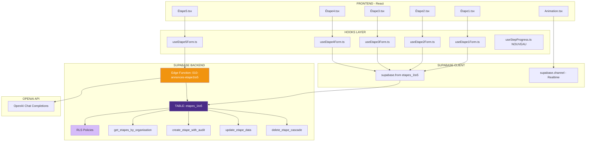

# 📖 BIBLE DE MIGRATION COMPLÈTE - PHASE 1 : ÉTAPES 1 TO 5
## Document préparatoire pour migration localStorage → Supabase

---

## 📑 SOMMAIRE CLIQUABLE

1. [INTRODUCTION - Objectif de la migration Phase 1](#1-introduction---objectif-de-la-migration-phase-1)
2. [DIAGRAMME D'ARCHITECTURE GLOBALE](#2-diagramme-darchitecture-globale)
3. [MAPPING COMPLET localStorage → Supabase](#3-mapping-complet-localstorage--supabase)
4. [LISTE EXHAUSTIVE DES FICHIERS À CRÉER](#4-liste-exhaustive-des-fichiers-à-créer)
   - [4.1 Types TypeScript](#41-types-typescript)
   - [4.2 Hooks Supabase](#42-hooks-supabase)
   - [4.3 Helpers et Utilitaires](#43-helpers-et-utilitaires)
   - [4.4 Edge Functions](#44-edge-functions)
   - [4.5 Fonctions SQL](#45-fonctions-sql)
5. [CONTRAINTES ET RÈGLES DE MIGRATION](#5-contraintes-et-règles-de-migration)
6. [CHECKLIST DE VALIDATION](#6-checklist-de-validation)

---

## 1. INTRODUCTION - Objectif de la migration Phase 1

### Mission

Cette migration Phase 1 transforme le système actuel basé sur `localStorage` pour les **Étapes 1 à 5** vers une architecture **Supabase**. L'objectif est de :

- ✅ **Éliminer** complètement l'usage de `localStorage` pour les données métier
- ✅ **Centraliser** toutes les données dans Supabase (table `etapes_1to5`)
- ✅ **Sécuriser** l'accès multi-tenant via RLS
- ✅ **Préparer** la Phase 2 (Étape 6 Communication)

### Périmètre Phase 1

| Étape | Route | Données concernées | Actions |
|-------|-------|-------------------|---------|
| **Étape 1** | `/etape1` | 10 champs (agencyName, reference, location, propertyType, saleType, price, rentAmount, rentPeriodicity, exclusivite, keyElements) | Lecture/Écriture Supabase |
| **Étape 2** | `/etape2` | 1 champ (propertyDescription) | Lecture/Écriture Supabase |
| **Étape 3** | `/etape3` | 1 champ (financials) | Lecture/Écriture Supabase |
| **Étape 4** | `/etape4` | 2 champs (details, hasNoDetails) | Lecture/Écriture Supabase |
| **Étape 5** | `/etape5` | 0 nouveau champ (orchestration OpenAI) | Lecture Supabase + Écriture résultats |
| **Animation** | `/etape5/animation` | Aucun | Lecture statut temps réel |

### Points critiques

- 🔒 **Multi-tenant obligatoire** : `organisation_id` sur TOUTES les opérations
- 🔒 **RLS activé** : Politique `organisation_id = get_user_organisation_id(auth.uid())`
- 🔒 **Validation** : Côté client (React Hook Form) ET côté serveur (Edge Functions)
- 🔒 **Pas de localStorage** pour les données métier (uniquement UI state si besoin)

---

## 2. DIAGRAMME D'ARCHITECTURE GLOBALE



---

## 3. MAPPING COMPLET localStorage → Supabase

### 3.1 Table `etapes_1to5` - Colonnes Supabase

| N° | Nom Colonne Supabase | Type SQL | Nullable | Default | Source localStorage | Description |
|----|---------------------|----------|----------|---------|-------------------|-------------|
| 1 | `etape_id` | uuid | NO | `gen_random_uuid()` | — | PK auto-générée |
| 2 | `organisation_id` | uuid | NO | — | — | FK vers `organisations` |
| 3 | `user_id` | uuid | NO | — | — | FK vers `users` (créateur) |
| 4 | `agency_name` | text | NO | — | `propertyData.agencyName` | Nom agence |
| 5 | `reference` | text | NO | — | `propertyData.reference` | Référence bien |
| 6 | `location` | text | NO | — | `propertyData.location` | Emplacement |
| 7 | `property_type` | text | NO | — | `propertyData.propertyType` | Type de bien |
| 8 | `sale_type` | text | NO | `'à vendre'` | `propertyData.saleType` | Type transaction |
| 9 | `price` | text | YES | — | `propertyData.price` | Prix FAI (si vente) |
| 10 | `rent_amount` | text | YES | — | `propertyData.rentAmount` | Loyer (si location) |
| 11 | `rent_periodicity` | text | YES | `'Mensuel'` | `propertyData.rentPeriodicity` | Périodicité loyer |
| 12 | `exclusivite` | text | NO | `'Non'` | `propertyData.exclusivite` | Exclusivité |
| 13 | `key_elements` | text | NO | — | `propertyData.keyElements` | Arguments commerciaux |
| 14 | `property_description` | text | NO | — | `propertyData.propertyDescription` | Description (Étape 2) |
| 15 | `financials` | text | NO | — | `propertyData.financials` | Infos financières (Étape 3) |
| 16 | `details` | text | YES | — | `propertyData.details` | Infos complémentaires (Étape 4) |
| 17 | `has_no_details` | boolean | NO | `false` | `propertyData.hasNoDetails` | Checkbox Étape 4 |
| 18 | `step_progress` | integer[] | NO | `ARRAY[1]` | `stepProgress` | Étapes complétées |
| 19 | `current_step` | integer | NO | `1` | — | Étape actuelle |
| 20 | `status` | text | NO | `'draft'` | — | `draft`, `generating`, `completed` |
| 21 | `openai_results` | jsonb | YES | — | `generation_*` (7 clés) | Résultats OpenAI |
| 22 | `generation_status` | jsonb | YES | — | `generation_status` | Statut génération temps réel |
| 23 | `created_at` | timestamptz | NO | `now()` | — | Date création |
| 24 | `updated_at` | timestamptz | NO | `now()` | — | Date MAJ |
| 25 | `created_by` | uuid | YES | `auth.uid()` | — | Utilisateur créateur |
| 26 | `updated_by` | uuid | YES | `auth.uid()` | — | Utilisateur MAJ |

### 3.2 Mapping détaillé localStorage → Supabase

#### Étape 1 - Éléments Clés

| localStorage key | Type | → | Supabase colonne | Type SQL | Validation |
|-----------------|------|---|------------------|----------|------------|
| `propertyData.agencyName` | string | → | `agency_name` | text | NOT NULL |
| `propertyData.reference` | string | → | `reference` | text | NOT NULL |
| `propertyData.location` | string | → | `location` | text | NOT NULL |
| `propertyData.propertyType` | string | → | `property_type` | text | NOT NULL |
| `propertyData.saleType` | `'à vendre'` \| `'à louer'` | → | `sale_type` | text | DEFAULT 'à vendre' |
| `propertyData.price` | string | → | `price` | text | NULL si location |
| `propertyData.rentAmount` | string | → | `rent_amount` | text | NULL si vente |
| `propertyData.rentPeriodicity` | string | → | `rent_periodicity` | text | DEFAULT 'Mensuel' |
| `propertyData.exclusivite` | `'Oui'` \| `'Non'` | → | `exclusivite` | text | DEFAULT 'Non' |
| `propertyData.keyElements` | string | → | `key_elements` | text | NOT NULL |

#### Étape 2 - Description

| localStorage key | Type | → | Supabase colonne | Type SQL | Validation |
|-----------------|------|---|------------------|----------|------------|
| `propertyData.propertyDescription` | string | → | `property_description` | text | NOT NULL |

#### Étape 3 - Financials

| localStorage key | Type | → | Supabase colonne | Type SQL | Validation |
|-----------------|------|---|------------------|----------|------------|
| `propertyData.financials` | string | → | `financials` | text | NOT NULL |

#### Étape 4 - Détails

| localStorage key | Type | → | Supabase colonne | Type SQL | Validation |
|-----------------|------|---|------------------|----------|------------|
| `propertyData.details` | string | → | `details` | text | NULL autorisé |
| `propertyData.hasNoDetails` | boolean | → | `has_no_details` | boolean | DEFAULT false |

#### Progression

| localStorage key | Type | → | Supabase colonne | Type SQL | Validation |
|-----------------|------|---|------------------|----------|------------|
| `stepProgress` | number[] | → | `step_progress` | integer[] | DEFAULT ARRAY[1] |

#### Résultats OpenAI (Étape 5)

| localStorage key | Type | → | Supabase colonne | Type SQL | Description |
|-----------------|------|---|------------------|----------|-------------|
| `generation_website_ad` | JSON | → | `openai_results->>'websiteAd'` | jsonb | Annonce Site |
| `generation_summary_sheet` | JSON | → | `openai_results->>'summarySheet'` | jsonb | Fiche Synthèse |
| `generation_newsletter` | JSON | → | `openai_results->>'newsletter'` | jsonb | Newsletter |
| `generation_seo_tools` | JSON | → | `openai_results->>'seoTools'` | jsonb | Outils SEO |
| `generation_sms_ad` | JSON | → | `openai_results->>'smsAd'` | jsonb | Annonce SMS |
| `generation_googleprofile_ad` | JSON | → | `openai_results->>'googleProfile'` | jsonb | Google Business |
| `generation_reseauxsociaux_ad` | JSON | → | `openai_results->>'socialMedia'` | jsonb | Réseaux Sociaux |

#### Statut génération (Animation)

| localStorage key | Type | → | Supabase colonne | Type SQL | Description |
|-----------------|------|---|------------------|----------|-------------|
| `generation_status` | JSON | → | `generation_status` | jsonb | Statut temps réel |

---

## 4. LISTE EXHAUSTIVE DES FICHIERS À CRÉER

### 4.1 Types TypeScript

#### 📄 `src/components/HOOKS-ANNONCES/01.HOOKS-ETAPE1TO5/01.Hooks/types.ts`

**🎯 Objectif** : Définir toutes les interfaces TypeScript pour les données Étapes 1-5

**🔧 À quoi il sert** :
- Interface `Etape1Data` : Données Étape 1 (10 champs)
- Interface `Etape2Data` : Données Étape 2 (1 champ)
- Interface `Etape3Data` : Données Étape 3 (1 champ)
- Interface `Etape4Data` : Données Étape 4 (2 champs)
- Interface `Etapes1to5Complete` : Données complètes (agrégation)
- Interface `GenerationStatus` : Statut génération OpenAI temps réel
- Interface `OpenAIResults` : Résultats 7 générations OpenAI

**♻️ Que remplace-t-il** :
- Les interfaces définies dans `src/services/openai.ts` (`PropertyData`)
- Types éparpillés dans les composants actuels

**✅ Contraintes à respecter** :
- **Nomenclature** : Respecter EXACTEMENT les noms de colonnes Supabase (`snake_case`)
- **Types strictement définis** : `sale_type: 'à vendre' | 'à louer'`, `exclusivite: 'Oui' | 'Non'`
- **Nullabilité** : Respecter `| null` pour champs optionnels (`price`, `rent_amount`, `details`)
- **JSONB** : Types complexes pour `openai_results` et `generation_status`

**📊 Tableau de référence - Interfaces attendues** :

| Interface | Champs | Utilisation |
|-----------|--------|-------------|
| `Etape1Data` | `agency_name`, `reference`, `location`, `property_type`, `sale_type`, `price`, `rent_amount`, `rent_periodicity`, `exclusivite`, `key_elements` | Hook `useEtape1Form.ts` |
| `Etape2Data` | `property_description` | Hook `useEtape2Form.ts` |
| `Etape3Data` | `financials` | Hook `useEtape3Form.ts` |
| `Etape4Data` | `details`, `has_no_details` | Hook `useEtape4Form.ts` |
| `Etapes1to5Complete` | Tous les champs ci-dessus + `etape_id`, `organisation_id`, `user_id`, `step_progress`, `current_step`, `status`, `created_at`, `updated_at` | Lecture complète depuis Supabase |
| `GenerationStatus` | `startTime`, `websiteAd`, `summarySheet`, `newsletter`, `seoTools`, `smsAd`, `googleBusinessProfile`, `reseauxSociaux`, `completed`, `progress` | `generation_status` jsonb |
| `OpenAIResults` | `websiteAd`, `summarySheet`, `newsletter`, `seoTools`, `smsAd`, `googleProfile`, `socialMedia` | `openai_results` jsonb |

**📝 Mapping localStorage → Types** :

```typescript
// AVANT (localStorage)
interface PropertyData {
  agencyName?: string;
  reference?: string;
  // ... (camelCase)
}

// APRÈS (Supabase - types.ts)
interface Etape1Data {
  agency_name: string;
  reference: string;
  location: string;
  property_type: string;
  sale_type: 'à vendre' | 'à louer';
  price: string | null;
  rent_amount: string | null;
  rent_periodicity: 'Mensuel' | 'Trimestriel' | 'Annuel';
  exclusivite: 'Oui' | 'Non';
  key_elements: string;
}
```

---

### 4.2 Hooks Supabase

#### 📄 `src/components/HOOKS-ANNONCES/01.HOOKS-ETAPE1TO5/01.Hooks/useEtape1Form.ts`

**🎯 Objectif** : Gérer la saisie et la sauvegarde des données de l'Étape 1 dans Supabase

**🔧 À quoi il sert** :
- **Lecture** : Récupère les données existantes depuis `etapes_1to5` (si `etape_id` fourni)
- **Écriture** : Sauvegarde les 10 champs de l'Étape 1 via `upsert` Supabase
- **Validation** : Vérifie les champs obligatoires AVANT envoi Supabase
- **État** : Gère les states React Hook Form + loading/error

**♻️ Que remplace-t-il** :
- Logique dans `EnsembleFormulairesEtape1Form.tsx` (states locaux, `updatePropertyData()`, `getPropertyDataFromStorage()`)
- Appels directs à `localStorage.setItem('propertyData', ...)`

**✅ Contraintes à respecter** :
- **Multi-tenant** : TOUJOURS inclure `organisation_id` dans les requêtes
- **Validation conditionnelle** : Si `sale_type === 'à vendre'` → `price` requis, sinon `rent_amount` requis
- **React Hook Form** : Intégration `useForm()` avec validation Zod
- **Pas de localStorage** : Aucune écriture dans localStorage (uniquement Supabase)

**📊 Tableau de référence - Données actuelles (localStorage)** :

| Champ actuel (camelCase) | Type | → | Champ Supabase | Validation actuelle |
|--------------------------|------|---|----------------|---------------------|
| `agencyName` | string | → | `agency_name` | `!agencyName.trim()` → Error |
| `reference` | string | → | `reference` | `!reference.trim()` → Error |
| `location` | string | → | `location` | `!location.trim()` → Error |
| `propertyType` | string | → | `property_type` | `!propertyType.trim()` → Error |
| `saleType` | string | → | `sale_type` | Par défaut `'à vendre'` |
| `price` | string | → | `price` | Si `saleType === 'à vendre'` ET `!price.trim()` → Error |
| `rentAmount` | string | → | `rent_amount` | Si `saleType === 'à louer'` ET `!rentAmount.trim()` → Error |
| `rentPeriodicity` | string | → | `rent_periodicity` | Par défaut `'Mensuel'` |
| `exclusivite` | string | → | `exclusivite` | Par défaut `'Non'` |
| `keyElements` | string | → | `key_elements` | `!keyElements.trim()` → Error |

**🏗️ Structure attendue - Fonctions exposées** :

```typescript
interface UseEtape1FormReturn {
  // React Hook Form
  register: UseFormRegister;
  handleSubmit: UseFormHandleSubmit;
  formState: FormState;

  // État
  loading: boolean;
  saving: boolean;
  error: string | null;

  // Fonctions
  saveEtape1: (data: Etape1Data) => Promise;
  loadEtape1: (etapeId: string) => Promise;
}
```

---

#### 📄 `src/components/HOOKS-ANNONCES/01.HOOKS-ETAPE1TO5/01.Hooks/useEtape2Form.ts`

**🎯 Objectif** : Gérer la saisie et la sauvegarde des données de l'Étape 2 dans Supabase

**🔧 À quoi il sert** :
- **Lecture** : Récupère `property_description` depuis `etapes_1to5`
- **Écriture** : Sauvegarde via `update` Supabase (étape 1 déjà créée)
- **Validation** : Vérifie que `property_description` n'est pas vide
- **Formatage** : Préserve le formatage automatique (puces `• `)

**♻️ Que remplace-t-il** :
- Logique dans `SaisieDescriptionForm.tsx` (state `propertyDescription`, `updatePropertyData()`)
- Appels directs à `localStorage.setItem('propertyData', ...)`

**✅ Contraintes à respecter** :
- **Update uniquement** : L'étape 1 doit exister (sinon redirection `/etape1`)
- **Multi-tenant** : Vérifier `organisation_id` dans la requête `update`
- **Formatage conservé** : Le texte est déjà formaté côté client (puces ajoutées par `FormulaireSaisie.tsx`)

**📊 Tableau de référence - Données actuelles** :

| Champ actuel | Type | → | Champ Supabase | Validation actuelle |
|--------------|------|---|----------------|---------------------|
| `propertyDescription` | string | → | `property_description` | `!propertyDescription.trim()` → Error |

**🏗️ Structure attendue - Fonctions exposées** :

```typescript
interface UseEtape2FormReturn {
  propertyDescription: string;
  setPropertyDescription: (value: string) => void;
  loading: boolean;
  saving: boolean;
  error: string | null;
  saveEtape2: () => Promise;
  loadEtape2: (etapeId: string) => Promise;
}
```

---

#### 📄 `src/components/HOOKS-ANNONCES/01.HOOKS-ETAPE1TO5/01.Hooks/useEtape3Form.ts`

**🎯 Objectif** : Gérer la saisie et la sauvegarde des données de l'Étape 3 dans Supabase

**🔧 À quoi il sert** :
- **Lecture** : Récupère `financials` depuis `etapes_1to5`
- **Écriture** : Sauvegarde via `update` Supabase
- **Validation** : Vérifie que `financials` n'est pas vide

**♻️ Que remplace-t-il** :
- Logique dans `SaisieFinancialForm.tsx` (state `financials`, `updatePropertyData()`)

**✅ Contraintes à respecter** :
- **Update uniquement** : Étapes 1 et 2 doivent exister
- **Multi-tenant** : `organisation_id` obligatoire

**📊 Tableau de référence - Données actuelles** :

| Champ actuel | Type | → | Champ Supabase | Validation actuelle |
|--------------|------|---|----------------|---------------------|
| `financials` | string | → | `financials` | `!financials.trim()` → Error |

**🏗️ Structure attendue - Fonctions exposées** :

```typescript
interface UseEtape3FormReturn {
  financials: string;
  setFinancials: (value: string) => void;
  loading: boolean;
  saving: boolean;
  error: string | null;
  saveEtape3: () => Promise;
  loadEtape3: (etapeId: string) => Promise;
}
```

---

#### 📄 `src/components/HOOKS-ANNONCES/01.HOOKS-ETAPE1TO5/01.Hooks/useEtape4Form.ts`

**🎯 Objectif** : Gérer la saisie et la sauvegarde des données de l'Étape 4 dans Supabase

**🔧 À quoi il sert** :
- **Lecture** : Récupère `details` et `has_no_details` depuis `etapes_1to5`
- **Écriture** : Sauvegarde via `update` Supabase
- **Validation** : Vérifie que `has_no_details === true` OU `details` non vide (choix obligatoire)

**♻️ Que remplace-t-il** :
- Logique dans `SaisieDetailsForm.tsx` (states `details` + `hasNoDetails`, `updatePropertyData()`)

**✅ Contraintes à respecter** :
- **Validation exclusive** : Si `has_no_details === false`, alors `details` est requis
- **Update uniquement** : Étapes 1-3 doivent exister

**📊 Tableau de référence - Données actuelles** :

| Champ actuel | Type | → | Champ Supabase | Validation actuelle |
|--------------|------|---|----------------|---------------------|
| `details` | string | → | `details` | Si `!hasNoDetails` ET `details.trim() === ''` → Error |
| `hasNoDetails` | boolean | → | `has_no_details` | Par défaut `false` |

**🏗️ Structure attendue - Fonctions exposées** :

```typescript
interface UseEtape4FormReturn {
  details: string;
  setDetails: (value: string) => void;
  hasNoDetails: boolean;
  setHasNoDetails: (value: boolean) => void;
  loading: boolean;
  saving: boolean;
  error: string | null;
  saveEtape4: () => Promise;
  loadEtape4: (etapeId: string) => Promise;
}
```

---

#### 📄 `src/components/HOOKS-ANNONCES/01.HOOKS-ETAPE1TO5/01.Hooks/useEtape5Form.ts`

**🎯 Objectif** : Orchestrer la génération OpenAI et la sauvegarde des résultats dans Supabase

**🔧 À quoi il sert** :
- **Lecture** : Récupère TOUTES les données Étapes 1-4 depuis `etapes_1to5`
- **Lancement génération** : Appelle l'Edge Function `010-annonces-etape1to5` qui gère les 7 appels OpenAI séquentiels
- **Mise à jour statut** : Écoute Supabase Realtime pour `generation_status` (progression)
- **Sauvegarde résultats** : Écrit `openai_results` (jsonb) dans `etapes_1to5` après génération complète

**♻️ Que remplace-t-il** :
- Logique dans `Etape5.tsx` (`handleValidateAndFinish()`, 7 appels OpenAI directs)
- Tous les `localStorage.setItem('generation_*', ...)` (7 clés)

**✅ Contraintes à respecter** :
- **Edge Function obligatoire** : Pas d'appels OpenAI directs depuis le client (sécurité clé API)
- **Realtime** : Abonnement Supabase channel pour `generation_status` (temps réel)
- **Statut** : Mise à jour `status` de la table (`draft` → `generating` → `completed`)

**📊 Tableau de référence - Données actuelles (localStorage)** :

| localStorage key | → | Supabase jsonb path | Description |
|-----------------|---|---------------------|-------------|
| `generation_website_ad` | → | `openai_results->>'websiteAd'` | Annonce Site Internet |
| `generation_summary_sheet` | → | `openai_results->>'summarySheet'` | Fiche de Synthèse |
| `generation_newsletter` | → | `openai_results->>'newsletter'` | Newsletter |
| `generation_seo_tools` | → | `openai_results->>'seoTools'` | Outils SEO |
| `generation_sms_ad` | → | `openai_results->>'smsAd'` | Annonce SMS |
| `generation_googleprofile_ad` | → | `openai_results->>'googleProfile'` | Google Business Profile |
| `generation_reseauxsociaux_ad` | → | `openai_results->>'socialMedia'` | Réseaux Sociaux |
| `generation_status` | → | `generation_status` | Statut temps réel (jsonb séparé) |

**🏗️ Structure attendue - Fonctions exposées** :

```typescript
interface UseEtape5FormReturn {
  loading: boolean;
  generating: boolean;
  error: string | null;
  generationStatus: GenerationStatus | null;
  openAIResults: OpenAIResults | null;

  launchGeneration: () => Promise;
  loadEtape5: (etapeId: string) => Promise;
  subscribeToGenerationStatus: (etapeId: string) => () => void; // Retourne fonction unsubscribe
}
```

---

#### 📄 `src/components/HOOKS-ANNONCES/01.HOOKS-ETAPE1TO5/01.Hooks/useStepProgress.ts` (NOUVEAU)

**🎯 Objectif** : Gérer la progression des étapes dans Supabase (remplace `localStorage.stepProgress`)

**🔧 À quoi il sert** :
- **Lecture** : Récupère `step_progress` et `current_step` depuis `etapes_1to5`
- **Écriture** : Met à jour `step_progress` après validation de chaque étape
- **Vérification accès** : Fonction `isStepAvailable(step: number)` pour contrôler navigation
- **Déblocage** : Fonction `completeStep(step: number)` pour ajouter une étape au tableau

**♻️ Que remplace-t-il** :
- `src/components/1-Sources-Generation-Annonces/utils/useStepProgress.ts` (version actuelle)
- `localStorage.setItem('stepProgress', JSON.stringify([1, 2, 3, ...]))`

**✅ Contraintes à respecter** :
- **Multi-tenant** : Récupération via `organisation_id`
- **Update array PostgreSQL** : Utiliser `array_append()` ou requête SQL personnalisée
- **Navigation** : Redirection automatique si étape non disponible

**📊 Tableau de référence - Données actuelles** :

| localStorage key | Type | → | Champ Supabase | Description |
|-----------------|------|---|----------------|-------------|
| `stepProgress` | number[] | → | `step_progress` | Étapes complétées (ex: `[1, 2, 3, 4]`) |
| (calculé) | number | → | `current_step` | Étape actuelle (max de `step_progress`) |

**🏗️ Structure attendue - Fonctions exposées** :

```typescript
interface UseStepProgressReturn {
  stepProgress: number[];
  currentStep: number;
  availableSteps: number[];
  disabledSteps: number[];
  loading: boolean;

  completeStep: (step: number) => Promise;
  isStepAvailable: (step: number) => boolean;
  goToEtape5: () => void;
  handleConfirmNewProject: () => Promise; // Reset complet
}
```

---

### 4.3 Helpers et Utilitaires

#### 📄 `src/components/HOOKS-ANNONCES/01.HOOKS-ETAPE1TO5/02.COMPONENTS/HelpersEtapes1to5.ts`

**🎯 Objectif** : Fonctions utilitaires réutilisables pour toutes les étapes

**🔧 À quoi il sert** :
- **Validation** : Fonctions de validation réutilisables (ex: `validateEtape1`, `validateEtape2`, etc.)
- **Formatage** : Conversion camelCase ↔ snake_case (si nécessaire)
- **Gestion erreurs** : Fonction `handleSupabaseError(error: PostgrestError)` pour afficher messages utilisateur
- **Helpers OpenAI** : Fonction `prepareDataForOpenAI(data: Etapes1to5Complete)` pour formater les données avant envoi Edge Function

**♻️ Que remplace-t-il** :
- Logique de validation éparpillée dans les composants
- Fonctions `updatePropertyData()`, `getPropertyDataFromStorage()`, `clearPropertyData()` (actuellement dans `src/services/openai.ts`)

**✅ Contraintes à respecter** :
- **Fonctions pures** : Pas de side-effects (pas d'appels Supabase directs)
- **TypeScript strict** : Typage fort de tous les paramètres et retours
- **Export nommé** : Toutes les fonctions exportées nommément (pas de default export)

**🏗️ Structure attendue - Fonctions exposées** :

```typescript
// Validation
export function validateEtape1(data: Partial): string[];
export function validateEtape2(data: Partial): string[];
export function validateEtape3(data: Partial): string[];
export function validateEtape4(data: Partial): string[];

// Gestion erreurs
export function handleSupabaseError(error: PostgrestError): string;
export function showErrorToast(message: string): void;

// Helpers OpenAI
export function prepareDataForOpenAI(data: Etapes1to5Complete): Record;
export function parseOpenAIResults(results: Record): OpenAIResults;
```

---

### 4.4 Edge Functions

#### 📄 `supabase/functions/010-annonces-etape1to5/index.ts`

**🎯 Objectif** : Edge Function sécurisée pour orchestrer les 7 appels OpenAI séquentiels et sauvegarder les résultats dans Supabase

**🔧 À quoi il sert** :
- **Sécurité** : Stocke la clé OpenAI côté serveur (pas d'exposition client)
- **Orchestration** : Lance les 7 appels OpenAI séquentiels :
  1. `generateWebsiteAd()`
  2. `generateSummarySheetAd()`
  3. `generateNewsletterAd()`
  4. `generateSEOTools()`
  5. `generateSMSAd()`
  6. `generateGoogleBusinessProfileAd()`
  7. `generateReseauxSociauxAd()`
- **Progression** : Met à jour `generation_status` (jsonb) après chaque appel (0% → 14% → 28% → ... → 100%)
- **Sauvegarde** : Écrit `openai_results` (jsonb) dans `etapes_1to5` après génération complète
- **Logging** : Log tous les appels OpenAI pour debug

**♻️ Que remplace-t-il** :
- Logique dans `Etape5.tsx` (`handleValidateAndFinish()`, appels OpenAI directs)
- Services `src/services/openai.ts`, `src/services/openai/1.GenerateurAnnoncesOutilsSeo/0.APIAutresFonctionsLeadGenAI/*.ts`

**✅ Contraintes à respecter** :
- **JWT vérifié** : `config.toml` avec `verify_jwt = true` (par défaut)
- **Multi-tenant** : Vérifier `organisation_id` dans le JWT et requêtes Supabase
- **Clé API OpenAI** : Récupérée depuis Supabase Secret `OPENAI_API_KEY`
- **CORS** : Headers CORS activés pour appels depuis le frontend
- **Gestion d'erreur** : Try/catch pour chaque appel OpenAI + rollback si échec
- **Timeout** : Timeout de 60 secondes max (limite Supabase Edge Functions)

**📊 Tableau de référence - Appels OpenAI** :

| N° | Appel OpenAI | Prompt | Résultat stocké dans | Progression |
|----|-------------|--------|---------------------|-------------|
| 1 | `generateWebsiteAd()` | `promptAnnonceSiteInternet` | `openai_results->>'websiteAd'` | 14% |
| 2 | `generateSummarySheetAd()` | `promptAnnonceFichedeSynthese` | `openai_results->>'summarySheet'` | 28% |
| 3 | `generateNewsletterAd()` | `promptAnnonceNewsletter` | `openai_results->>'newsletter'` | 42% |
| 4 | `generateSEOTools()` | `promptOutilsSEO` | `openai_results->>'seoTools'` | 57% |
| 5 | `generateSMSAd()` | `promptSMSAnnonce` | `openai_results->>'smsAd'` | 71% |
| 6 | `generateGoogleBusinessProfileAd()` | `promptGoogleBusinessProfileAnnonce` | `openai_results->>'googleProfile'` | 85% |
| 7 | `generateReseauxSociauxAd()` | `promptReseauxSociauxAnnonce` | `openai_results->>'socialMedia'` | 100% |

**🏗️ Structure attendue - Requête/Réponse** :

```typescript
// REQUEST
POST https://ksymahfrtvhnbeobsspt.supabase.co/functions/v1/010-annonces-etape1to5
Headers:
  Authorization: Bearer {JWT_TOKEN}
  Content-Type: application/json
Body:
{
  "etape_id": "uuid-de-letape",
  "organisation_id": "uuid-organisation"
}

// RESPONSE (Streaming ou JSON final)
{
  "success": true,
  "etape_id": "uuid-de-letape",
  "generation_status": {
    "startTime": 1678901234567,
    "websiteAd": true,
    "summarySheet": true,
    "newsletter": true,
    "seoTools": true,
    "smsAd": true,
    "googleBusinessProfile": true,
    "reseauxSociaux": true,
    "completed": true,
    "progress": 100
  },
  "openai_results": {
    "websiteAd": {...},
    "summarySheet": {...},
    "newsletter": {...},
    "seoTools": {...},
    "smsAd": {...},
    "googleProfile": {...},
    "socialMedia": {...}
  }
}
```

**📝 Pseudo-code Edge Function** :

```typescript
// 1. Vérifier JWT et extraire user_id, organisation_id
const user = await supabase.auth.getUser();
const { organisation_id, etape_id } = await request.json();

// 2. Récupérer données depuis etapes_1to5
const { data: etapeData } = await supabase
  .from('etapes_1to5')
  .select('*')
  .eq('etape_id', etape_id)
  .eq('organisation_id', organisation_id)
  .single();

// 3. Vérifier accès (organisation_id match)
if (!etapeData) throw new Error('Accès refusé ou étape introuvable');

// 4. Récupérer clé OpenAI depuis Supabase Secret
const OPENAI_API_KEY = Deno.env.get('OPENAI_API_KEY');

// 5. Initialiser generation_status
await supabase
  .from('etapes_1to5')
  .update({
    status: 'generating',
    generation_status: {
      startTime: Date.now(),
      websiteAd: false,
      summarySheet: false,
      newsletter: false,
      seoTools: false,
      smsAd: false,
      googleBusinessProfile: false,
      reseauxSociaux: false,
      completed: false,
      progress: 0
    }
  })
  .eq('etape_id', etape_id);

// 6. Lancer les 7 appels séquentiels OpenAI
const results = {};
try {
  // Appel 1
  results.websiteAd = await callOpenAI('generateWebsiteAd', etapeData);
  await updateGenerationStatus(etape_id, { websiteAd: true, progress: 14 });

  // Appel 2
  results.summarySheet = await callOpenAI('generateSummarySheetAd', etapeData);
  await updateGenerationStatus(etape_id, { summarySheet: true, progress: 28 });

  // ... (répéter pour les 5 autres)

  // Appel 7
  results.socialMedia = await callOpenAI('generateReseauxSociauxAd', etapeData);
  await updateGenerationStatus(etape_id, { reseauxSociaux: true, progress: 100, completed: true });

} catch (error) {
  // Rollback status
  await supabase
    .from('etapes_1to5')
    .update({ status: 'draft', generation_status: null })
    .eq('etape_id', etape_id);

  throw error;
}

// 7. Sauvegarder résultats finaux
await supabase
  .from('etapes_1to5')
  .update({
    status: 'completed',
    openai_results: results
  })
  .eq('etape_id', etape_id);

return new Response(JSON.stringify({ success: true, results }), {
  headers: { ...corsHeaders, 'Content-Type': 'application/json' }
});
```

---

### 4.5 Fonctions SQL

#### 📄 Migration SQL : Création de la table `etapes_1to5`

**🎯 Objectif** : Créer la table Supabase avec toutes les colonnes, contraintes, indexes et RLS

**🔧 À quoi elle sert** :
- Définit le schéma de la table `etapes_1to5`
- Crée les FK vers `organisations` et `users`
- Active RLS et crée les policies
- Crée les indexes pour performance

**✅ Contraintes à respecter** :
- **Nomenclature** : `snake_case` strict pour toutes les colonnes
- **PK** : `etape_id` uuid avec `gen_random_uuid()`
- **FK** : `organisation_id` → `organisations(organisation_id)`, `user_id` → `users(users_id)`
- **NOT NULL** : Tous les champs obligatoires (voir mapping ci-dessus)
- **Defaults** : `sale_type` = 'à vendre', `rent_periodicity` = 'Mensuel', `exclusivite` = 'Non', `has_no_details` = false, `step_progress` = ARRAY[1], `current_step` = 1, `status` = 'draft'

**📝 SQL complet** :

```sql
-- Migration: Création table etapes_1to5
CREATE TABLE IF NOT EXISTS public.etapes_1to5 (
  -- Identifiants
  etape_id uuid PRIMARY KEY DEFAULT gen_random_uuid(),
  organisation_id uuid NOT NULL REFERENCES public.organisations(organisation_id) ON DELETE CASCADE,
  user_id uuid NOT NULL REFERENCES public.users(users_id) ON DELETE CASCADE,

  -- Étape 1 - Éléments clés
  agency_name text NOT NULL,
  reference text NOT NULL,
  location text NOT NULL,
  property_type text NOT NULL,
  sale_type text NOT NULL DEFAULT 'à vendre',
  price text,
  rent_amount text,
  rent_periodicity text DEFAULT 'Mensuel',
  exclusivite text NOT NULL DEFAULT 'Non',
  key_elements text NOT NULL,

  -- Étape 2 - Description
  property_description text NOT NULL DEFAULT '',

  -- Étape 3 - Financials
  financials text NOT NULL DEFAULT '',

  -- Étape 4 - Détails
  details text,
  has_no_details boolean NOT NULL DEFAULT false,

  -- Progression
  step_progress integer[] NOT NULL DEFAULT ARRAY[1],
  current_step integer NOT NULL DEFAULT 1,

  -- Statut
  status text NOT NULL DEFAULT 'draft', -- 'draft', 'generating', 'completed'

  -- Résultats OpenAI
  openai_results jsonb,
  generation_status jsonb,

  -- Audit
  created_at timestamptz NOT NULL DEFAULT now(),
  updated_at timestamptz NOT NULL DEFAULT now(),
  created_by uuid,
  updated_by uuid,

  -- Contraintes
  CONSTRAINT sale_type_check CHECK (sale_type IN ('à vendre', 'à louer')),
  CONSTRAINT exclusivite_check CHECK (exclusivite IN ('Oui', 'Non')),
  CONSTRAINT rent_periodicity_check CHECK (rent_periodicity IN ('Mensuel', 'Trimestriel', 'Annuel')),
  CONSTRAINT status_check CHECK (status IN ('draft', 'generating', 'completed')),
  CONSTRAINT price_or_rent_check CHECK (
    (sale_type = 'à vendre' AND price IS NOT NULL) OR
    (sale_type = 'à louer' AND rent_amount IS NOT NULL)
  )
);

-- Indexes pour performance
CREATE INDEX idx_etapes1to5_organisation ON public.etapes_1to5(organisation_id);
CREATE INDEX idx_etapes1to5_user ON public.etapes_1to5(user_id);
CREATE INDEX idx_etapes1to5_status ON public.etapes_1to5(status);
CREATE INDEX idx_etapes1to5_created_at ON public.etapes_1to5(created_at DESC);

-- Trigger pour updated_at
CREATE OR REPLACE FUNCTION update_etapes1to5_updated_at()
RETURNS TRIGGER AS $$
BEGIN
  NEW.updated_at = now();
  NEW.updated_by = auth.uid();
  RETURN NEW;
END;
$$ LANGUAGE plpgsql SECURITY DEFINER;

CREATE TRIGGER update_etapes1to5_timestamp
BEFORE UPDATE ON public.etapes_1to5
FOR EACH ROW
EXECUTE FUNCTION update_etapes1to5_updated_at();

-- RLS Enable
ALTER TABLE public.etapes_1to5 ENABLE ROW LEVEL SECURITY;

-- RLS Policies
CREATE POLICY "Admin PRESENCA full access etapes_1to5"
ON public.etapes_1to5
FOR ALL
TO authenticated
USING (is_admin_presenca(auth.uid()))
WITH CHECK (is_admin_presenca(auth.uid()));

CREATE POLICY "Organisation only access etapes_1to5"
ON public.etapes_1to5
FOR ALL
TO authenticated
USING (organisation_id = get_user_organisation_id(auth.uid()))
WITH CHECK (organisation_id = get_user_organisation_id(auth.uid()));

-- Commentaires (documentation)
COMMENT ON TABLE public.etapes_1to5 IS 'Données des étapes 1 à 5 du processus de génération d''annonces immobilières';
COMMENT ON COLUMN public.etapes_1to5.openai_results IS 'Résultats JSON des 7 générations OpenAI (websiteAd, summarySheet, newsletter, seoTools, smsAd, googleProfile, socialMedia)';
COMMENT ON COLUMN public.etapes_1to5.generation_status IS 'Statut de génération temps réel (progress, completed, etc.)';
```

---

#### 📄 `get_etapes_by_organisation`

**🎯 Objectif** : Fonction SQL pour récupérer toutes les étapes d'une organisation

**🔧 À quoi elle sert** :
- Liste toutes les `etapes_1to5` d'une organisation
- Filtre automatiquement par `organisation_id` du user connecté
- Tri par `created_at DESC` (plus récent en premier)

**✅ Contraintes à respecter** :
- **SECURITY DEFINER** : Fonction exécutée avec privilèges élevés
- **RLS respectée** : Vérification `organisation_id = get_user_organisation_id(auth.uid())`

**📝 SQL** :

```sql
CREATE OR REPLACE FUNCTION public.get_etapes_by_organisation()
RETURNS SETOF public.etapes_1to5
LANGUAGE sql
STABLE SECURITY DEFINER
SET search_path TO 'public'
AS $$
  SELECT *
  FROM public.etapes_1to5
  WHERE organisation_id = get_user_organisation_id(auth.uid())
  ORDER BY created_at DESC;
$$;
```

---

#### 📄 `create_etape_with_audit`

**🎯 Objectif** : Fonction SQL pour créer une nouvelle étape avec audit automatique

**🔧 À quoi elle sert** :
- Crée un enregistrement dans `etapes_1to5`
- Enregistre automatiquement `organisation_id`, `user_id`, `created_by`, `created_at`
- Log dans `1_historique_supabase` (table d'audit)

**✅ Contraintes à respecter** :
- **SECURITY DEFINER** : Gère les champs système (`organisation_id`, `user_id`)
- **Validation** : Vérifie que les champs obligatoires de l'Étape 1 sont fournis

**📝 SQL** :

```sql
CREATE OR REPLACE FUNCTION public.create_etape_with_audit(
  p_agency_name text,
  p_reference text,
  p_location text,
  p_property_type text,
  p_sale_type text,
  p_price text,
  p_rent_amount text,
  p_rent_periodicity text,
  p_exclusivite text,
  p_key_elements text
)
RETURNS jsonb
LANGUAGE plpgsql
SECURITY DEFINER
SET search_path TO 'public'
AS $$
DECLARE
  v_org_id uuid;
  v_user_id uuid;
  v_etape_id uuid;
BEGIN
  -- Récupérer organisation_id et user_id
  v_org_id := get_user_organisation_id(auth.uid());

  SELECT users_id INTO v_user_id
  FROM public.users
  WHERE users_auth_id = auth.uid();

  -- Vérifier accès
  IF v_org_id IS NULL OR v_user_id IS NULL THEN
    RAISE EXCEPTION 'Accès non autorisé';
  END IF;

  -- Insérer dans etapes_1to5
  INSERT INTO public.etapes_1to5 (
    organisation_id,
    user_id,
    agency_name,
    reference,
    location,
    property_type,
    sale_type,
    price,
    rent_amount,
    rent_periodicity,
    exclusivite,
    key_elements,
    created_by
  ) VALUES (
    v_org_id,
    v_user_id,
    p_agency_name,
    p_reference,
    p_location,
    p_property_type,
    p_sale_type,
    p_price,
    p_rent_amount,
    p_rent_periodicity,
    p_exclusivite,
    p_key_elements,
    v_user_id
  )
  RETURNING etape_id INTO v_etape_id;

  -- Log audit
  PERFORM log_audit_event(
    'etapes_1to5',
    'INSERT',
    NULL,
    jsonb_build_object(
      'etape_id', v_etape_id,
      'agency_name', p_agency_name,
      'reference', p_reference
    ),
    jsonb_build_object('user_agent', current_setting('request.headers')::jsonb->>'user-agent'),
    'manual',
    'info',
    '{}'::jsonb
  );

  -- Retour
  RETURN jsonb_build_object(
    'success', true,
    'etape_id', v_etape_id,
    'organisation_id', v_org_id
  );
END;
$$;
```

---

#### 📄 `update_etape_openai_results`

**🎯 Objectif** : Fonction SQL pour mettre à jour `openai_results` et `generation_status` après génération OpenAI

**🔧 À quoi elle sert** :
- Met à jour `openai_results` (jsonb) avec les 7 résultats OpenAI
- Met à jour `generation_status` (jsonb) avec statut final
- Change `status` de `'generating'` à `'completed'`

**✅ Contraintes à respecter** :
- **SECURITY DEFINER** : Sécurisé pour appel depuis Edge Function
- **Vérification organisation** : S'assurer que l'`etape_id` appartient à l'organisation du user

**📝 SQL** :

```sql
CREATE OR REPLACE FUNCTION public.update_etape_openai_results(
  p_etape_id uuid,
  p_openai_results jsonb,
  p_generation_status jsonb
)
RETURNS jsonb
LANGUAGE plpgsql
SECURITY DEFINER
SET search_path TO 'public'
AS $$
DECLARE
  v_org_id uuid;
BEGIN
  -- Vérifier organisation_id
  v_org_id := get_user_organisation_id(auth.uid());

  -- Vérifier que l'étape appartient à l'organisation
  IF NOT EXISTS (
    SELECT 1
    FROM public.etapes_1to5
    WHERE etape_id = p_etape_id
    AND organisation_id = v_org_id
  ) THEN
    RAISE EXCEPTION 'Étape introuvable ou accès non autorisé';
  END IF;

  -- Update
  UPDATE public.etapes_1to5
  SET
    openai_results = p_openai_results,
    generation_status = p_generation_status,
    status = 'completed',
    updated_at = now(),
    updated_by = auth.uid()
  WHERE etape_id = p_etape_id;

  -- Log audit
  PERFORM log_audit_event(
    'etapes_1to5',
    'UPDATE',
    NULL,
    jsonb_build_object('etape_id', p_etape_id, 'status', 'completed'),
    '{}'::jsonb,
    'edge_function',
    'info',
    '{}'::jsonb
  );

  RETURN jsonb_build_object('success', true, 'etape_id', p_etape_id);
END;
$$;
```

---

#### 📄 `delete_etape_cascade`

**🎯 Objectif** : Fonction SQL pour supprimer une étape avec cascade

**🔧 À quoi elle sert** :
- Supprime un enregistrement `etapes_1to5`
- Gère cascade automatique (si nécessaire)
- Log dans `1_historique_supabase`

**✅ Contraintes à respecter** :
- **SECURITY DEFINER** : Vérification RLS stricte
- **Soft delete** : Possibilité d'ajouter un champ `deleted_at` au lieu de DELETE physique

**📝 SQL** :

```sql
CREATE OR REPLACE FUNCTION public.delete_etape_cascade(
  p_etape_id uuid
)
RETURNS jsonb
LANGUAGE plpgsql
SECURITY DEFINER
SET search_path TO 'public'
AS $$
DECLARE
  v_org_id uuid;
  v_old_data jsonb;
BEGIN
  -- Récupérer organisation_id
  v_org_id := get_user_organisation_id(auth.uid());

  -- Récupérer données avant suppression (pour audit)
  SELECT to_jsonb(e.*) INTO v_old_data
  FROM public.etapes_1to5 e
  WHERE etape_id = p_etape_id
  AND organisation_id = v_org_id;

  IF v_old_data IS NULL THEN
    RAISE EXCEPTION 'Étape introuvable ou accès non autorisé';
  END IF;

  -- Delete
  DELETE FROM public.etapes_1to5
  WHERE etape_id = p_etape_id
  AND organisation_id = v_org_id;

  -- Log audit
  PERFORM log_audit_event(
    'etapes_1to5',
    'DELETE',
    v_old_data,
    NULL,
    '{}'::jsonb,
    'manual',
    'warn',
    jsonb_build_object('etape_id', p_etape_id)
  );

  RETURN jsonb_build_object('success', true, 'etape_id', p_etape_id);
END;
$$;
```

---

## 5. CONTRAINTES ET RÈGLES DE MIGRATION

### 5.1 Sécurité

| Règle | Détail | Validation |
|-------|--------|------------|
| **RLS activé** | TOUTES les tables avec RLS | ✅ `ALTER TABLE ... ENABLE ROW LEVEL SECURITY` |
| **Multi-tenant strict** | Filtrage `organisation_id` sur TOUTES les requêtes | ✅ Policies RLS + Fonctions SQL avec `get_user_organisation_id()` |
| **JWT vérifié** | Edge Functions avec `verify_jwt = true` | ✅ `supabase/config.toml` |
| **Clé OpenAI sécurisée** | Stockée dans Supabase Secrets, JAMAIS côté client | ✅ `Deno.env.get('OPENAI_API_KEY')` |

### 5.2 Nomenclature

| Élément | Règle | Exemple |
|---------|-------|---------|
| **Colonnes SQL** | `snake_case` strict | `agency_name`, `property_type`, `rent_amount` |
| **Interfaces TypeScript** | `PascalCase` | `Etape1Data`, `GenerationStatus` |
| **Hooks** | `useNomHook` | `useEtape1Form`, `useStepProgress` |
| **Fonctions SQL** | `snake_case` | `get_etapes_by_organisation`, `create_etape_with_audit` |
| **Edge Functions** | Kebab-case + numérotation | `010-annonces-etape1to5` |

### 5.3 Performance

| Optimisation | Détail | Implémentation |
|--------------|--------|----------------|
| **Indexes** | Sur `organisation_id`, `user_id`, `status`, `created_at` | ✅ CREATE INDEX dans migration SQL |
| **JSONB** | Utiliser `->>`et `->`pour requêtes jsonb | ✅ Ex: `openai_results->>'websiteAd'` |
| **Pagination** | Limiter résultats SELECT (ex: LIMIT 50) | ✅ Dans hooks (ex: `useEtape1Form`) |
| **Debounce** | Sur saisie utilisateur (500ms) | ✅ `useDebouncedCallback` dans hooks |

### 5.4 Validation

| Niveau | Outil | Règles |
|--------|-------|--------|
| **Client (React)** | Zod + React Hook Form | Champs requis, formats, longueurs |
| **Serveur (SQL)** | Contraintes CHECK + Functions | `sale_type_check`, `price_or_rent_check` |
| **Edge Function** | Validation manuelle + try/catch | Validation payload avant appels OpenAI |

---

## 6. CHECKLIST DE VALIDATION

### Phase 0 : Préparation (AVANT CODE)

- [ ] Lire TOUS les documents de référence (`01.Etape1.md` à `08.ProcessEnvoiInfosOpenAI.md`)
- [ ] Valider le schéma de la table `etapes_1to5` avec le product owner
- [ ] Confirmer les noms de colonnes (snake_case)
- [ ] Vérifier que les fonctions SQL `get_user_organisation_id()`, `is_admin_presenca()`, `log_audit_event()` existent déjà

### Phase 1 : Types et Helpers

- [ ] Créer `src/components/HOOKS-ANNONCES/01.HOOKS-ETAPE1TO5/01.Hooks/types.ts`
  - [ ] Interface `Etape1Data` avec 10 champs
  - [ ] Interface `Etape2Data` avec 1 champ
  - [ ] Interface `Etape3Data` avec 1 champ
  - [ ] Interface `Etape4Data` avec 2 champs
  - [ ] Interface `Etapes1to5Complete` avec tous les champs + metadata
  - [ ] Interface `GenerationStatus` avec 9 champs
  - [ ] Interface `OpenAIResults` avec 7 résultats

- [ ] Créer `src/components/HOOKS-ANNONCES/01.HOOKS-ETAPE1TO5/02.COMPONENTS/HelpersEtapes1to5.ts`
  - [ ] Fonction `validateEtape1()`
  - [ ] Fonction `validateEtape2()`
  - [ ] Fonction `validateEtape3()`
  - [ ] Fonction `validateEtape4()`
  - [ ] Fonction `handleSupabaseError()`
  - [ ] Fonction `prepareDataForOpenAI()`

### Phase 2 : SQL & Backend

- [ ] Migration SQL : Créer table `etapes_1to5`
  - [ ] Colonnes (25 total)
  - [ ] Contraintes CHECK
  - [ ] FK vers `organisations` et `users`
  - [ ] Indexes (4 total)
  - [ ] Trigger `update_etapes1to5_updated_at`
  - [ ] RLS policies (2 total)

- [ ] Créer fonctions SQL :
  - [ ] `get_etapes_by_organisation()`
  - [ ] `create_etape_with_audit()`
  - [ ] `update_etape_openai_results()`
  - [ ] `delete_etape_cascade()`

- [ ] Ajouter Secret Supabase :
  - [ ] `OPENAI_API_KEY` (clé OpenAI)

- [ ] Créer Edge Function `supabase/functions/010-annonces-etape1to5/index.ts`
  - [ ] Vérification JWT
  - [ ] Récupération données `etapes_1to5`
  - [ ] 7 appels OpenAI séquentiels
  - [ ] Mise à jour `generation_status` après chaque appel
  - [ ] Sauvegarde `openai_results` final
  - [ ] Gestion d'erreur + rollback
  - [ ] CORS headers

- [ ] Configurer `supabase/config.toml` :
  - [ ] Ajouter `[functions.010-annonces-etape1to5]` avec `verify_jwt = true`

### Phase 3 : Hooks Frontend

- [ ] Créer `src/components/HOOKS-ANNONCES/01.HOOKS-ETAPE1TO5/01.Hooks/useEtape1Form.ts`
  - [ ] Fonction `saveEtape1()`
  - [ ] Fonction `loadEtape1()`
  - [ ] Intégration React Hook Form + Zod
  - [ ] Gestion loading/error

- [ ] Créer `src/components/HOOKS-ANNONCES/01.HOOKS-ETAPE1TO5/01.Hooks/useEtape2Form.ts`
  - [ ] Fonction `saveEtape2()`
  - [ ] Fonction `loadEtape2()`
  - [ ] State `propertyDescription`

- [ ] Créer `src/components/HOOKS-ANNONCES/01.HOOKS-ETAPE1TO5/01.Hooks/useEtape3Form.ts`
  - [ ] Fonction `saveEtape3()`
  - [ ] Fonction `loadEtape3()`
  - [ ] State `financials`

- [ ] Créer `src/components/HOOKS-ANNONCES/01.HOOKS-ETAPE1TO5/01.Hooks/useEtape4Form.ts`
  - [ ] Fonction `saveEtape4()`
  - [ ] Fonction `loadEtape4()`
  - [ ] States `details` + `hasNoDetails`

- [ ] Créer `src/components/HOOKS-ANNONCES/01.HOOKS-ETAPE1TO5/01.Hooks/useEtape5Form.ts`
  - [ ] Fonction `launchGeneration()` (appel Edge Function)
  - [ ] Fonction `loadEtape5()`
  - [ ] Fonction `subscribeToGenerationStatus()` (Supabase Realtime)

- [ ] Créer `src/components/HOOKS-ANNONCES/01.HOOKS-ETAPE1TO5/01.Hooks/useStepProgress.ts` (NOUVEAU)
  - [ ] Fonction `completeStep()`
  - [ ] Fonction `isStepAvailable()`
  - [ ] Fonction `handleConfirmNewProject()`
  - [ ] Lecture/écriture `step_progress` dans Supabase

### Phase 4 : Migration Composants

- [ ] Refactoriser `src/components/1-Sources-Generation-Annonces/form-etape1/EnsembleFormulairesEtape1Form.tsx`
  - [ ] Supprimer states locaux (agencyName, reference, etc.)
  - [ ] Remplacer par `useEtape1Form()`
  - [ ] Supprimer `getPropertyDataFromStorage()` et `updatePropertyData()`
  - [ ] Tester validation

- [ ] Refactoriser `src/components/1-Sources-Generation-Annonces/form-etape2/SaisieDescriptionForm.tsx`
  - [ ] Supprimer state local `propertyDescription`
  - [ ] Remplacer par `useEtape2Form()`
  - [ ] Tester validation

- [ ] Refactoriser `src/components/1-Sources-Generation-Annonces/form-etape3/SaisieFinancialForm.tsx`
  - [ ] Supprimer state local `financials`
  - [ ] Remplacer par `useEtape3Form()`
  - [ ] Tester validation

- [ ] Refactoriser `src/components/1-Sources-Generation-Annonces/form-etape4/SaisieDetailsForm.tsx`
  - [ ] Supprimer states locaux `details` + `hasNoDetails`
  - [ ] Remplacer par `useEtape4Form()`
  - [ ] Tester validation exclusive

- [ ] Refactoriser `src/1.etapes-generation-annonces/etape5/Etape5.tsx`
  - [ ] Supprimer `handleValidateAndFinish()` (appels OpenAI directs)
  - [ ] Remplacer par `useEtape5Form().launchGeneration()`
  - [ ] Supprimer toutes les références à `localStorage.setItem('generation_*', ...)`

- [ ] Refactoriser `src/1.etapes-generation-annonces/etape5/Animation.tsx`
  - [ ] Supprimer `localStorage.getItem('generation_status')`
  - [ ] Remplacer par `useEtape5Form().subscribeToGenerationStatus()`
  - [ ] Utiliser Supabase Realtime pour progression

### Phase 5 : Cleanup

- [ ] Supprimer ancien hook `src/components/1-Sources-Generation-Annonces/utils/useStepProgress.ts`
- [ ] Supprimer toutes les fonctions localStorage dans `src/services/openai.ts` :
  - [ ] `getPropertyDataFromStorage()`
  - [ ] `updatePropertyData()`
  - [ ] `clearPropertyData()`
- [ ] Supprimer tous les `localStorage.setItem/getItem` des composants Étapes 1-5
- [ ] Nettoyer imports inutilisés

### Phase 6 : Tests

- [ ] Test E2E parcours complet Étapes 1-5
  - [ ] Étape 1 : Saisie + Sauvegarde + Navigation Étape 2
  - [ ] Étape 2 : Saisie + Sauvegarde + Navigation Étape 3
  - [ ] Étape 3 : Saisie + Sauvegarde + Navigation Étape 4
  - [ ] Étape 4 : Saisie + Sauvegarde + Navigation Étape 5
  - [ ] Étape 5 : Lancement génération + Attente + Redirection Étape 6
  - [ ] Animation : Progression temps réel 0% → 100%

- [ ] Test modification retour arrière
  - [ ] Modifier Étape 1 depuis Étape 5
  - [ ] Vérifier sauvegarde Supabase
  - [ ] Relancer génération
  - [ ] Vérifier nouvelles données dans `openai_results`

- [ ] Test multi-tenant
  - [ ] Utilisateur A crée une étape
  - [ ] Utilisateur B (autre organisation) ne voit PAS l'étape de A
  - [ ] Admin PRESENCA voit TOUTES les étapes

- [ ] Test RLS
  - [ ] Tentative de lecture `etapes_1to5` sans auth → Erreur
  - [ ] Tentative de lecture d'une étape d'une autre organisation → Erreur
  - [ ] Tentative de modification d'une étape d'une autre organisation → Erreur

---

## ✅ FIN DU DOCUMENT PRÉPARATOIRE PHASE 1

Ce document constitue la **Bible complète de la migration Phase 1**. Tous les fichiers listés doivent être créés EXACTEMENT selon les spécifications ci-dessus. Aucune improvisation sur les noms de colonnes, les types, ou la structure.

**Prochaine étape** : Implémentation du code (Phase d'implémentation).

