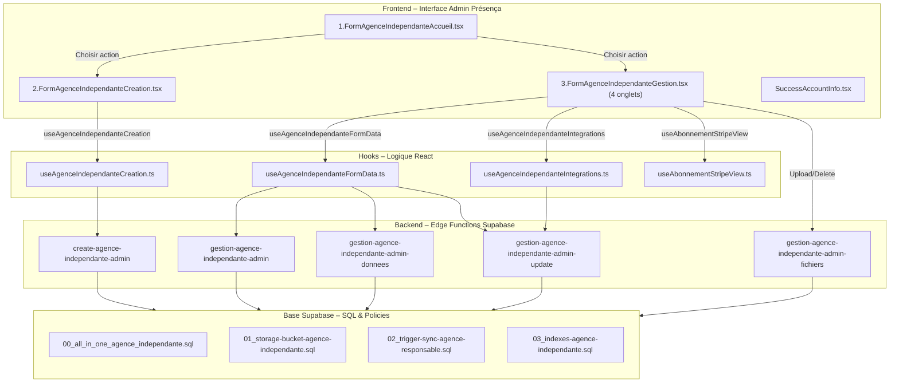
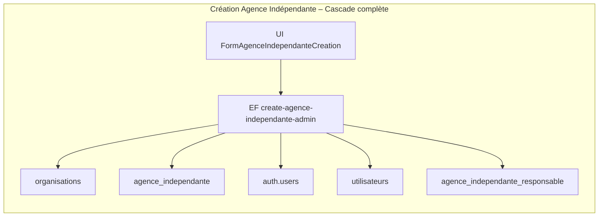
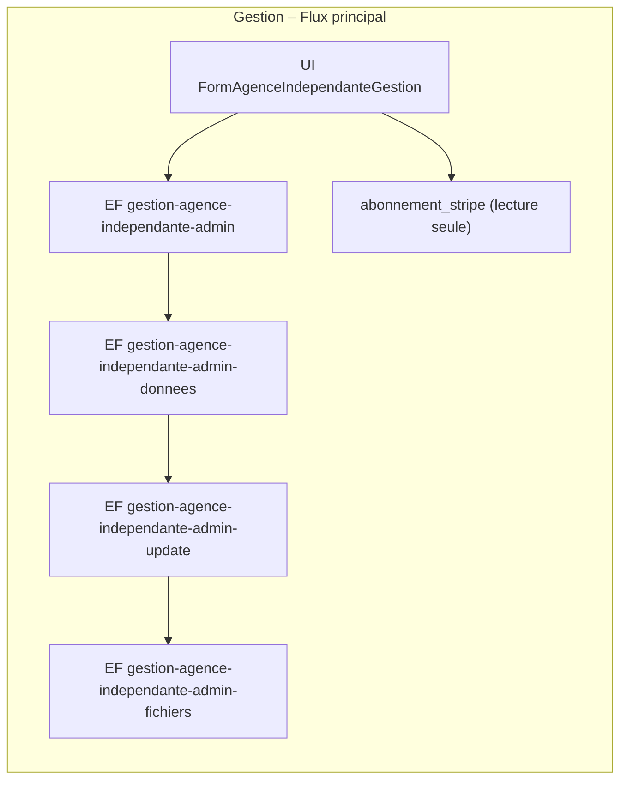
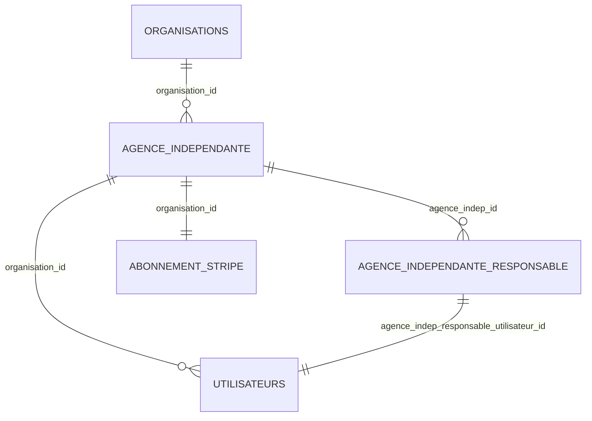

# 🧩 1. Architecture Graphique



## ⚙️ 2. Processus de création (cascade)

Toujours afficher les détails



## 🗂️ 3. Processus de gestion (4 onglets)

Toujours afficher les détails



## 🧱 4. Relations entre tables principales

Toujours afficher les détails



## 🧩 5. Conventions et Invariants

Toujours afficher les détails

```json
{"success": boolean, "data": any, "message"?: string, "error"?: string, "details"?: string, "requestId"?: string, "duration_ms"?: number}
```

- `verify_jwt = false` pour toutes les EF  
- CORS ouvert, Service Role Key uniquement côté EF  

### Stockage normé :

Toujours afficher les détails

```
bucket-table-agence-independante/agence-{uuid}/1-logos/
bucket-table-agence-independante/agence-{uuid}/2-documents-institutionnels/
```

Charte graphique conservée

## 📁 6. Arborescence des fichiers

Toujours afficher les détails

```
src/components/ADMIN-PRESENCA/9-CreationComptesUtilisateurs/1-Formulaires/6.AgenceIndependante/
├─ 1.FormAgenceIndependanteAccueil.tsx
├─ 2.FormAgenceIndependanteCreation.tsx
├─ 3.FormAgenceIndependanteGestion.tsx
└─ SuccessAccountInfo.tsx

src/components/HOOKS-STRATEGIQUE/
├─ 5.HOOKS-CreationCompteAdminPresenca/6.AgenceIndependante/
│  ├─ types.ts
│  └─ useAgenceIndependanteCreation.ts
└─ 6.HOOKS-GestionCompteAdminPresenca/6.AgenceIndependante/
   ├─ components/AgenceIndependanteSelector.tsx
   └─ hooks/
      ├─ types.ts
      ├─ useAgenceIndependanteFormData.ts
      ├─ useAgenceIndependanteIntegrations.ts
      └─ useAbonnementStripeView.ts
```

## 🧠 7. Contrats d’API (Edge Functions)

| EF | Fonction | Request | Response |
|----|----------|---------|----------|
| create-agence-independante-admin | Création cascade complète | agence + responsable | {{success,data:{{organisation,agence,user}}}} |
| gestion-agence-independante-admin | Liste agences | body {{}} | {{success,data:[{{agence_id,agence_nom}}]}} |
| gestion-agence-independante-admin-donnees | Détail + intégrations | {{agence_id}} | {{success,data:{{agence,integrations}}}} |
| gestion-agence-independante-admin-update | Patch général + intégrations | {{agence_id, generalData/integrationKind}} | {{success,data:{{agence/intégration}}}} |
| gestion-agence-independante-admin-fichiers | Upload/Delete fichiers | multipart/form-data ou JSON | {{success,data:{{path}}}} |

## 💾 8. Mapping UI ↔ DB (Onglet Général)

| Champ UI | Colonne DB | Notes |
|----------|------------|-------|
| Nom agence | agence_indep_nom | affiché dans la liste |
| Identité commerciale | agence_indep_identite_commerciale | optionnel |
| SIRET | agence_indep_siret | obligatoire création |
| Adresse | agence_indep_adresse |  |
| Code postal | agence_indep_code_postal |  |
| Ville | agence_indep_ville |  |
| Email agence | agence_indep_email | répliqué → responsable |
| Téléphone agence | agence_indep_telephone | répliqué → responsable |
| Logo | agence_indep_logo | chemin unique |
| Ressources | agence_indep_ressources | tableau chemins |

## 💳 9. Abonnement (lecture seule)

- Table : `abonnement_stripe`  
- Champs : `abonnement_stripe_plan`, `abonnement_stripe_debut`  
- Hook : `useAbonnementStripeView(organisationId)`

## 🔗 10. Intégrations (6 providers)

- FKs : `agence_indep_brevo_connexion_id`, `agence_indep_zoho_connexion_id`, `agence_indep_openai_connexion_id`, `agence_indep_linkedin_connexion_id`, `agence_indep_facebook_connexion_id`, `agence_indep_instagram_connexion_id`
- Tables : `brevo_connexion`, `zoho_connexion`, `openai_connexion`, `linkedin_connexion`, `facebook_connexion`, `instagram_connexion`

## 🧰 11. SQL & Policies

- `00_all_in_one_agence_independante.sql` : bucket + trigger + index  
- Trigger : `sync_agence_indep_to_responsable`  
- Index : `idx_agence_indep_org`, `idx_abonnement_stripe_org`  
- Lecture Storage : `policy SELECT authenticated`  
- Écriture : via EF SRK uniquement

## 🧩 12. Observabilité & Résilience

- `requestId`, `duration_ms` dans toutes les EF  
- Rollback complet si étape échoue  
- Logs structurés JSON  
- SRK jamais exposée côté front

## 🚀 13. Installation

- Exécuter les scripts SQL (`00_all_in_one_agence_independante.sql` ou séparés)  
- Déployer les 5 EF  
- Mettre à jour `supabase/config.toml` avec `verify_jwt=false`  
- Tester : création, patch, intégrations, fichiers, abonnement (lecture seule)

## ✅ 14. Points de vigilance

- Respect strict du naming (`agence_indep_*`)  
- Tables : `agence_independante`, `agence_independante_responsable`, `utilisateurs`, `organisations`, `abonnement_stripe`  
- FKs intégrations valides selon schéma  
- Triggers actifs pour synchronisation email/téléphone  
- SRK protégée
