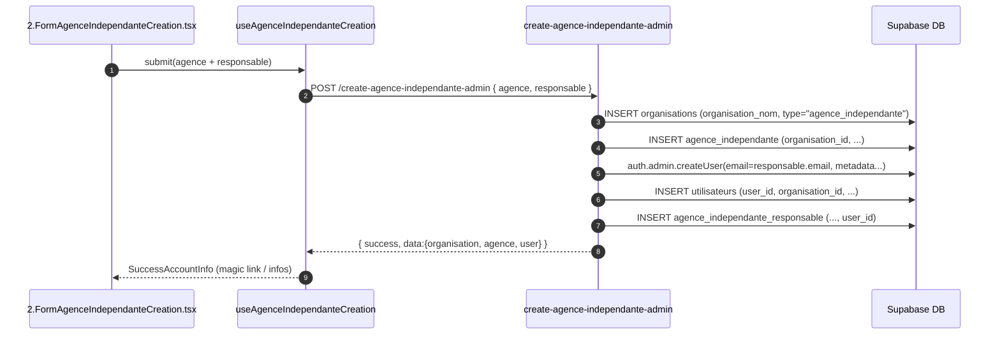

# Agence Indépendante — Architecture & Processus (Création & Gestion)
**Version**: 2025‑10‑09  
**Portée**: Formulaires *Accueil*, *Création*, *Gestion* (4 onglets) + Hooks, Edge Functions et SQL associés.  
**Objectif**: Document de référence prêt pour onboarding dev/IA (Lovable, ChatGPT) et maintenance.

---

## 0) Conventions & Invariants

- **Contrat d’API uniforme** (Edge Functions) :  
  `{"success": boolean, "data": any, "message"?: string, "error"?: string, "details"?: string, "requestId"?: string}`
- **Nom des paramètres** côté EF : **snake_case** (`agence_id`, `fileType`, etc.).
- **CORS** ouvert, **SRK** (Service Role Key) utilisé **uniquement** côté EF pour bypass RLS.
- **`verify_jwt = false`** dans `supabase/config.toml` pour toutes les EF Agence (comme Réseau).
- **Storage mapping** normé :  
  `bucket-table-agence-independante/agence-{uuid}/1-logos/...`  
  `bucket-table-agence-independante/agence-{uuid}/2-documents-institutionnels/...`
- **Charte graphique** : aucune modification de structure UI (titres, labels, placeholders, ordres).

> ℹ️ Les lectures Storage sont autorisées aux **utilisateurs authentifiés** (policy SELECT), les écritures **uniquement via EF** (SRK).

---

## 1) Arborescence & Rôles des fichiers

```text
src/
└─ components/
   └─ ADMIN-PRESENCA/9-CreationComptesUtilisateurs/1-Formulaires/6.AgenceIndependante/
      ├─ 1.FormAgenceIndependanteAccueil.tsx           # Page d’entrée (liens vers Création/Gestion)
      ├─ 2.FormAgenceIndependanteCreation.tsx          # Formulaire de création (cascade org → agence → user/utilisateur → responsable)
      ├─ 3.FormAgenceIndependanteGestion.tsx           # Formulaire de gestion (4 onglets)
      └─ SuccessAccountInfo.tsx                        # Affichage infos d’accès (magic link/mot de passe)

src/components/HOOKS-STRATEGIQUE/
├─ 5.HOOKS-CreationCompteAdminPresenca/6.AgenceIndependante/
│  ├─ types.ts                                         # Types autonomes (création)
│  └─ useAgenceIndependanteCreation.ts                 # Hook de création (invoke EF)
└─ 6.HOOKS-GestionCompteAdminPresenca/6.AgenceIndependante/
   ├─ components/
   │  └─ AgenceIndependanteSelector.tsx                # Sélecteur d’agence (liste minimaliste)
   └─ hooks/
      ├─ types.ts                                      # Types autonomes (gestion)
      ├─ useAgenceIndependanteFormData.ts              # Liste + détail + patch "Général"
      ├─ useAgenceIndependanteIntegrations.ts          # Insert/Update Intégrations (6 providers)
      └─ useAbonnementStripeView.ts                    # Lecture seule abonnement (plan + début)

supabase/
├─ functions/
│  ├─ create-agence-independante-admin/                # EF création (cascade)
│  ├─ gestion-agence-independante-admin/               # EF liste
│  ├─ gestion-agence-independante-admin-donnees/       # EF détail + intégrations
│  ├─ gestion-agence-independante-admin-update/        # EF patch général + intégrations (insert/update + lien FK)
│  └─ gestion-agence-independante-admin-fichiers/      # EF Upload/Delete Storage + MAJ DB
└─ sql/
   ├─ 00_all_in_one_agence_independante.sql            # Script unique idempotent
   ├─ 01_storage-bucket-agence-independante.sql        # Bucket + policy SELECT
   ├─ 02_trigger-sync-agence-responsable.sql           # Trigger réplication email/téléphone
   └─ 03_indexes-agence-independante.sql               # Index perfs

supabase/config.additions.toml                          # verify_jwt=false pour les 5 EF
```

---

## 2) Schémas (Mermaid)

### 2.1 Création (cascade)



### 2.2 Gestion — flux principaux

```mermaid
flowchart LR
  A[UI Gestion] -->|invoke body:{}| L[EF liste]
  L -->|{success,data:[agence_id, agence_nom]}| A
  A -->|select agence_id| D[EF détail]
  D -->|{success, data:{agence, integrations}}| A
  A -->|patch général| U[EF update]
  U -->|{success, data:{agence}}| A
  A -->|save integration(kind,data)| U2[EF update]
  U2 -->|{success, data:{integration}}| A
  A -->|upload/delete fichier| F[EF fichiers]
  F -->|{success, data:{path/deleted}}| A
  A -->|affiche abonnement (read only)| DB[(abonnement_stripe)]
```

---

## 3) Contrats d'API (EF)

### 3.1 `gestion-agence-independante-admin` — **Liste**
- **Request**: `POST`, body `{}`
- **Response**:
  ```json
  { "success": true, "data": [ { "agence_id": "uuid", "agence_nom": "..." } ] }
  ```

### 3.2 `gestion-agence-independante-admin-donnees` — **Détail + intégrations**
- **Request**: `POST`
  ```json
  { "agence_id": "uuid" }
  ```
- **Response**:
  ```json
  {
    "success": true,
    "data": {
      "agence": { /* colonnes agence_independante */ },
      "integrations": { "brevo": {...}|null, "zoho": {...}|null, "openai": {...}|null, "linkedin": {...}|null, "facebook": {...}|null, "instagram": {...}|null }
    }
  }
  ```

### 3.3 `gestion-agence-independante-admin-update` — **Général + Intégrations**
- **Request**: `POST`
  1) Patch général :
  ```json
  { "agence_id":"uuid", "generalData": { "agence_independante_nom":"...", "agence_independante_email":"..." } }
  ```
  2) Insert/Update intégration :
  ```json
  { "agence_id":"uuid", "integrationKind":"brevo|zoho|openai|linkedin|facebook|instagram", "integrationData": { /* champs table */ } }
  ```
- **Response** (selon l’action) :
  ```json
  { "success": true, "data": { "agence": { /* patch */ } } }
  { "success": true, "data": { "integration": { /* row */ } } }
  ```

### 3.4 `gestion-agence-independante-admin-fichiers` — **Upload / Delete**
- **Upload**: `multipart/form-data`
  - `fileType` = `"logo"` ou `"ressource"`
  - `agence_id` = UUID
  - `file` = `File`
- **Delete**: `application/json`
  ```json
  { "action":"delete", "agence_id":"uuid", "fileType":"logo|ressource", "path":"agence-uuid/1-logos/...png" }
  ```
- **Responses**
  ```json
  { "success": true, "data": { "path":"...", "fileType":"logo|ressource" } }
  { "success": true, "data": { "deleted":"...", "fileType":"logo|ressource" } }
  ```

### 3.5 `create-agence-independante-admin` — **Création cascade**
- **Request**
  ```json
  {
    "agence": {
      "agence_independante_nom": "...",
      "agence_independante_siret": "...",
      "agence_independante_adresse": "...",
      "agence_independante_code_postal": "...",
      "agence_independante_ville": "...",
      "agence_independante_email": "...",
      "agence_independante_telephone": "...",
      "agence_independante_identite_commerciale": "..." // optionnel
    },
    "responsable": {
      "prenom": "...", "nom": "...", "email": "...", "telephone": "..."
    }
  }
  ```
- **Response**
  ```json
  {
    "success": true,
    "data": {
      "organisation": { "organisation_id":"...", "organisation_nom":"..." },
      "agence": { "agence_independante_id":"...", "agence_independante_nom":"..." },
      "user": { "id":"...", "email":"..." }
    }
  }
  ```

---

## 4) Storage & Policies

### 4.1 Bucket & RLS
- Bucket : **`bucket-table-agence-independante`**
- Policy lecture : **Authenticated SELECT** (idempotent) — voir script SQL fourni.
- Pas de policy d’écriture côté client : **écriture via EF** avec **SERVICE_ROLE_KEY** (SRK).

### 4.2 Mapping des chemins
```
agence-{agence_id}/
  ├─ 1-logos/
  │  └─ <timestamp>_<filename>
  └─ 2-documents-institutionnels/
     └─ <timestamp>_<filename>
```
- Colonnes : `agence_independante_logo` (string, chemin unique) ; `agence_independante_ressources` (string[], liste de chemins).

> Recommandation sécurité (option avancée) : si tu veux **reserrer** la lecture, change la policy pour vérifier que l’utilisateur lit uniquement des objets de **son** organisation (exige de structurer les chemins avec `organisation-{uuid}/...` ou d’ajouter des métadonnées Storage).

---

## 5) Types (référence rapide)

- **Création** : `src/.../5.HOOKS-CreationCompteAdminPresenca/6.AgenceIndependante/types.ts`
  - `CreateAgenceIndependantePayload`, `CreateAgenceResponse`.
- **Gestion** : `src/.../6.HOOKS-GestionCompteAdminPresenca/6.AgenceIndependante/hooks/types.ts`
  - `AgenceIndependanteMinimal`, `AgenceIndependante`, `IntegrationsMap`, `AbonnementStripeView`,
    `ListAgencesResponse`, `AgenceDetailResponse`, `UpdateAgenceResponse`, `FileUploadResponse`, `FileDeleteResponse`.

---

## 6) Mapping UI ↔ DB (Général)

| UI (onglet Général) | Colonne DB (table `agence_independante`) | Notes |
|---|---|---|
| Nom agence | `agence_independante_nom` | affiché dans la liste |
| Identité commerciale | `agence_independante_identite_commerciale` | optionnel |
| SIRET | `agence_independante_siret` | valide à la création |
| Adresse | `agence_independante_adresse` |  |
| Code postal | `agence_independante_code_postal` |  |
| Ville | `agence_independante_ville` |  |
| Email | `agence_independante_email` | **point de vérité** (répliqué via trigger vers _responsable) |
| Téléphone | `agence_independante_telephone` | **point de vérité** (répliqué via trigger vers _responsable) |
| Logo | `agence_independante_logo` | chemin Storage unique |
| Ressources | `agence_independante_ressources` | tableau de chemins |

---

## 7) Abonnement (onglet en **lecture seule**)

- **Table** : `abonnement_stripe` (vue filtrée par `organisation_id`).
- **Champs affichés** : `abonnement_stripe_plan`, `abonnement_stripe_debut` (formaté `YYYY‑MM‑DD`).  
- **Hook** : `useAbonnementStripeView(organisationId)` → `AbonnementStripeView`.  
- **Évolution prévue** : activation future Stripe (sélection plan, synchro, statut, paiements).

---

## 8) Intégrations (6 providers)

- **FKs attendues** (si présentes dans le schéma) :  
  `agence_independante_brevo_connexion_id`, `agence_independante_zoho_connexion_id`,  
  `agence_independante_openai_connexion_id`, `agence_independante_linkedin_connexion_id`,  
  `agence_independante_facebook_connexion_id`, `agence_independante_instagram_connexion_id`.

- **Tables** (si présentes) :  
  `brevo_connexion` (`brevo_connexion_id`), `zoho_connexion` (`zoho_connexion_id`),  
  `openai_connexion` (`openai_connexion_id`), `linkedin_connexion` (`linkedin_connexion_id`),  
  `facebook_connexion` (`facebook_connexion_id`), `instagram_connexion` (`instagram_connexion_id`).

> L’EF ne requête ces tables **que si** un FK non nul est présent dans `agence_independante`. Pas de FK → pas de SELECT.

---

## 9) Observabilité & Résilience

- **Logs structurés** (`requestId`, `event`, `duration_ms`) dans toutes les EF.
- **Erreurs partielles intégrations** : journalisées, la réponse demeure `success:true` avec `integrations` partielles.
- **Atomicité intégrations** : sur insertion, si le **lien FK** échoue, la **row insérée est rollback** (delete).

---

## 10) Points de vigilance (check rapide avant déploiement)

1. **Colonnes** : `agence_independante_logo`, `agence_independante_ressources` existent dans `agence_independante` (sinon, ajuster EF fichiers).  
2. **FKs intégrations** : vérifier la présence/nom exact des colonnes listées §8 (sinon, retirer le provider non utilisé).  
3. **`organisations.organisation_type`** : la colonne doit exister si on la remplit à la création ; sinon, ne pas l’envoyer.  
4. **Trigger** : la table `agence_independante_responsable` possède bien `email` et `telephone` (noms exacts).  
5. **Security HTTP (option)** : EF actuellement ouvertes (SRK côté DB). Pour durcir, ajouter un header secret `X-Internal-Key` et le valider côté EF.

---

## 11) Procédure d’installation (résumé)

1. **SQL** : exécuter `00_all_in_one_agence_independante.sql` (ou `01_`, `02_`, `03_` séparés).  
2. **Edge Functions** : déposer les 5 dossiers puis déployer.  
3. **config.toml** : fusionner `config.additions.toml` (`verify_jwt=false` pour les 5 EF).  
4. **Smoke tests** : upload/delete fichiers, patch général, intégrations, abonnement (lecture).

---

## Annexes (références)

- Bucket + policy SELECT (authenticated) — script SQL.  
- Trigger réplication email/téléphone — script SQL.  
- Index perfs — script SQL.
