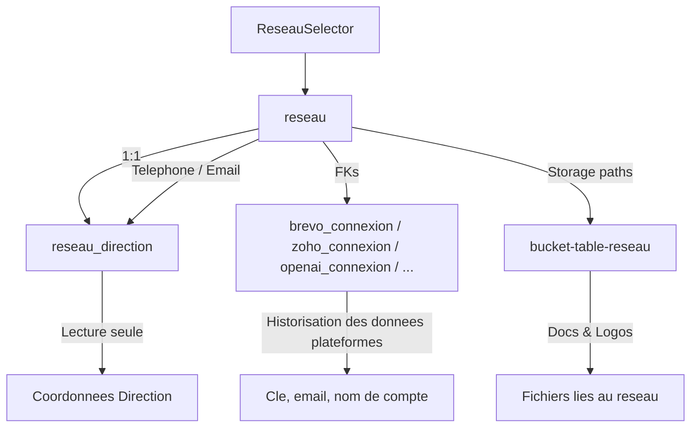

# 📌 Comprendre le Mécanisme de conception du Formulaire de Gestion Réseau

## 1. Sélection du Réseau
- Dropdown pour choisir un réseau (`reseau_id`, `reseau_nom`).
- Au changement → chargement automatique des données associées depuis Supabase :
  - Table `reseau` (infos générales, coordonnées téléphoniques, email + FK connexions).
  - Tables connexions (`brevo_connexion`, `zoho_connexion`, `openai_connexion`).
  - Storage (logos, documents).

---

## 2. Onglet Général
- **Champs éditables** :
  - Nom du Réseau
  - Identité Commerciale du Réseau
  - Adresse
  - Code Postal
  - Ville
  - Siret
  - Téléphone Direction
  - Email Direction
- **Workflow** :
  - Bouton *Modifier* → champs activés.
  - Sauvegarde via **edge function `update-reseau`**.

---

## 3. Onglet Intégrations
- Sert uniquement à **mémoriser les données informatives des plateformes Brevo, Zoho, OpenAI**
- **Champs éditables** :
  - Clé API
  - Email Compte
  - Nom Compte
- **Workflow** :
  - Injection des données existantes depuis tables connexions.
  - Si déjà une ligne → `update`.
  - Si aucune ligne → `insert` + mise à jour FK dans `reseau`.
- Aucun contrôle externe → usage purement administratif.

---

## 4. Onglet Fichiers
- **Architecture Storage** (bucket unique multi-tenant) :
  
```
bucket-table-reseau/
└── reseau-{uuid}/                    ← UUID = reseau_id exact
    ├── 1-logos/                      ← Dossier logos
    │   ├── logo-principal.png
    │   └── logo-alternatif.png
    ├── 2-documents-institutionnels/  ← Dossier documents
    │   ├── presentation.pdf
    │   ├── reglement.pdf
    │   └── statuts.pdf
    └── 3-charte-graphique/           ← Extensible futur
        └── charte-couleurs.pdf
```

- **Mapping des données** :

Table reseau : 
- reseau_logo → chemin unique vers le logo principal (dans 1-logos/).
- reseau_ressources → tableau des chemins des documents institutionnels (dans 2-documents-institutionnels/).

Bucket Supabase : bucket-table-reseau 
- Isolation stricte par dossier reseau-{uuid} (chaque réseau a son espace).
- Les sous-dossiers organisent les fichiers par type (1-logos, 2-documents-institutionnels, 3-charte-graphique).
--
- **Fonctionnalités utilisateur** :

Logo du Réseau
- Afficher le logo actuel (si existant).
- Upload d’un nouveau logo → sauvegarde dans 1-logos/.
- Supprimer le logo → suppression via Edge Function et mise à jour de reseau_logo.

Documents Institutionnels 
- Lister les documents existants (table reseau_ressources).
- Upload de nouveaux fichiers → ajout dans 2-documents-institutionnels/.
- Supprimer un document → suppression via Edge Function + retrait du tableau reseau_ressources.

Charte Graphique (extensible futur) 
- Prévu pour accueillir les fichiers de charte graphique dans 3-charte-graphique/.
- Même logique : upload, affichage, suppression sécurisée.

--
- **Sécurité & RLS** :

Isolation stricte : 
- Plus de policies RLS côté storage.objects.
- Toutes les opérations (upload, suppression, mise à jour DB) passent par des Edge Functions exécutées avec le SUPABASE_SERVICE_ROLE_KEY.

Les Edge Functions :
- Vérifient le reseauId transmis.
- Valident les droits (admin_presenca ou organisation liée).
- Centralisent la logique pour cohérence, logs et audit.
- Admin Presenca : accès global à tous les dossiers/fichiers via les fonctions.

---

## 5. Workflow Global
1. Admin PRESENCA choisit un réseau.
2. Données chargées automatiquement.
3. Lecture seule par défaut.
4. Bouton *Modifier* active l’édition.
5. Sauvegarde via **edge functions** :
   - `update-reseau` pour données générales & intégrations.
   - `upload-reseau-files` pour logo/documents.
6. Retour en lecture seule après succès.
---

## 🔄 Schéma d’Architecture




---

## Clarifications stratégiques

### 1. Gestion Organisation vs Réseau
Ce formulaire est **exclusivement dédié à la gestion des Réseaux existants**.  
- **Organisation** : déjà créée en amont, non gérée ici.  
- **Réseau** : on sélectionne un réseau existant, on affiche et on modifie ses données.  
👉 Donc **aucune logique de création d’organisation ou d’utilisateur** n’est concernée. Le formulaire agit uniquement en **UPDATE** sur le réseau choisi.  
---
### 2. Intégrations des données des plateformes Brevo, Zoho, OpenAI
Les champs Intégrations (clé, email, nom de compte) servent **uniquement à historiser et mémoriser les infos saisies par l’admin**.  
- Pas de test de validité.  
- Pas d’appel externe aux API.  
- Pas de logique de connexion automatique.  
👉 L’onglet **“Intégrations”** est un **espace mémoire facultatif**.  
Un réseau peut avoir zéro, une ou plusieurs infos d’Intégration, mais leur présence ou absence n’impacte pas le fonctionnement du reste du système.  
---
### 3. Distinction Réseau vs RéseauDirection 
- **Réseau** = stocke les informations générales (nom du réseau, identité commerciale du réseau, adresse, ville, siret, téléphone, email). Point de vérité unique pour l’email et le téléphone (coordonnées Direction).  
- **RéseauDirection** = utilisateur directeur du réseau (lié à Auth), qui hérite des coordonnées renseignées dans `reseau`.  
👉 Dans le formulaire Gestion Réseau :  
- Les champs Email / Téléphone sont **éditables** (dans `reseau`) et synchronisés automatiquement avec `reseau_direction`.  
- Dans un futur formulaire RéseauDirection → ces champs seront **lecture seule** pour éviter les incohérences. 
 
---
### 4. Architecture du Bucket de stockage
Le projet adopte un **bucket unique multi-tenant** : `bucket-table-reseau`.  
- Isolation stricte par dossier nommé `reseau-{uuid}`.
- - Chaque sous-dossier correspond à un type de ressource :  
---
### 5. Question des risques 
- On ne peut pas avoir plusieurs réseaux pour une organisation.
- Le réseau est la tête de pont.
- Comme il s agit d un formulaire de gestion mofidiaiotn pas de creation, si on sélectionne dans le sélecteur un réseau, il ne peut y en avoir plusieurs.
- Le formulaire de gestion doit pouvoir injecter les données actuelles présentes dans supabase et admin_presenca qui est le seul à utiliser ce formulaire de gestion doit pouvoir rajouter des informations ou les modifier si elles ne sont plus à jour.
---
### 6. Rappel : Ce qui se passe quand on crée un réseau avec Email Direction et Téléphone Direction (dans le formulaire creation)
Formulaire de création :
- L’admin admin_presenca saisit les informations dans le formulaire de création (nom réseau, adresse, siret, etc.) ainsi que :
- Téléphone Direction
- Email Direction

Tables concernées lors de l’insertion :
- Ces deux champs sont insérés dans la table reseau en tant que :
- reseau_telephone
- reseau_email

Ils sont ensuite synchronisés automatiquement dans la table reseau_direction pour que l’utilisateur directeur ait les mêmes coordonnées.
- reseau_direction_telephone
- reseau_direction_email

IDs impliqués dans l’opération : 
- reseau_id (clé primaire du réseau) → utilisé pour créer le réseau et comme pivot de toutes les relations.
- organisation_id (FK dans reseau) → rattache le réseau à l’organisation déjà existante.
- reseau_direction_id (FK lié à l’utilisateur directeur) → utilisé pour propager l’email et téléphone dans la table reseau_direction.

Donc :
- Point de vérité : reseau.reseau_telephone et reseau.reseau_email.
- Synchronisation automatique → reseau_direction.reseau_direction_telephone et reseau_direction.reseau_direction_email.
- IDs pivots utilisés : reseau_id (principal), organisation_id (lien organisation), reseau_direction_id (synchronisation).
---


# ✅ Résumé
- **Général** → infos juridiques du réseau.
- **Direction** → infos personnelles (lecture seule).
- **Intégrations** → mémorisation d’APIs (historisation simple).
- **Fichiers** → stockage structuré (logos + documents).
- **Workflow clair** → sélection, chargement, édition par onglet, sauvegarde via edge functions.

---

# ✅ Rappel des Emplacements 
- Hook Principal : src/components/HOOKS-STRATEGIQUE/6.HOOKS-GestionCompteAdminPresenca/1.Reseau/hooks/useReseauFormData.ts
- Hook Intégrations : src/components/HOOKS-STRATEGIQUE/6.HOOKS-GestionCompteAdminPresenca/1.Reseau/hooks/useReseauIntegrations.ts
- Types types.ts : src/components/HOOKS-STRATEGIQUE/6.HOOKS-GestionCompteAdminPresenca/1.Reseau/hooks/types.ts
- Page Principale : src/components/ADMIN-PRESENCA/9-CreationComptesUtilisateurs/1-Formulaires/1.Reseau/3.FormReseauGestion.tsx
- Composant Selector : src/components/HOOKS-STRATEGIQUE/6.HOOKS-GestionCompteAdminPresenca/1.Reseau/components/ReseauSelector.tsx


---
---
