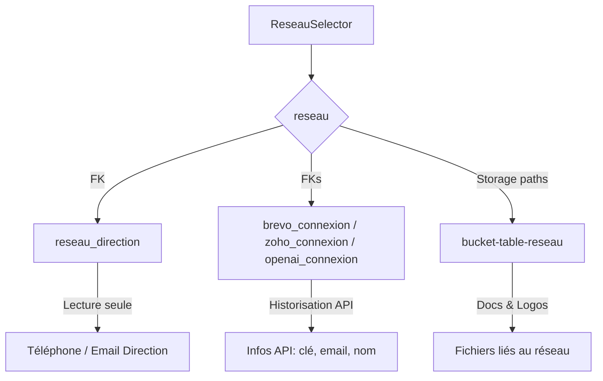

# 📌 Formulaire de Gestion Réseau – Référence

## 1. Sélection du Réseau
- Dropdown pour choisir un réseau (`reseau_id`, `reseau_nom`).
- Au changement → chargement automatique des données associées depuis Supabase :
  - Table `reseau` (infos générales + FK connexions).
  - Table `reseau_direction` (infos direction).
  - Tables connexions (`brevo_connexion`, `zoho_connexion`, `openai_connexion`).
  - Storage (logos, documents).

---

## 2. Onglet Général
- **Champs éditables** :
  - Nom du Réseau
  - Identité Commerciale du Réseau
  - Adresse
  - Code Postal
  - Ville
  - Siret
- **Champs en lecture seule** (issus de `reseau_direction`) :
  - Téléphone Direction
  - Email Direction
- **Workflow** :
  - Bouton *Modifier* → champs activés.
  - Sauvegarde via **edge function `update-reseau`**.

---

## 3. Onglet Intégrations
- Sert uniquement à **mémoriser les informations d’API des clients** (Brevo, Zoho, OpenAI).
- **Champs éditables** :
  - Clé API
  - Email Compte
  - Nom Compte
- **Workflow** :
  - Injection des données existantes depuis tables connexions.
  - Si déjà une ligne → `update`.
  - Si aucune ligne → `insert` + mise à jour FK dans `reseau`.
- Aucun contrôle externe → usage purement administratif.

---

## 4. Onglet Fichiers
- **Architecture Storage** (bucket unique multi-tenant) :
  ```
  bucket-table-reseau/
  └── reseau-{uuid}/
      ├── 1-logos/
      │   └── logo.png
      ├── 2-documents-institutionnels/
      │   ├── presentation.pdf
      │   └── reglement.pdf
      └── 3-charte-graphique/ (extensible futur)
  ```
- **Logo** :
  - Affiche le logo actuel (si existant).
  - Upload nouveau logo → sauvegarde.
  - Supprimer → suppression Supabase.
- **Documents** :
  - Liste les documents existants.
  - Upload nouveaux fichiers.
  - Supprimer un document.

---

## 5. Workflow Global
1. Admin PRESENCA choisit un réseau.
2. Données chargées automatiquement.
3. Lecture seule par défaut.
4. Bouton *Modifier* active l’édition.
5. Sauvegarde via **edge functions** :
   - `update-reseau` pour données générales & intégrations.
   - `upload-reseau-files` pour logo/documents.
6. Retour en lecture seule après succès.

---

## 🔄 Schéma d’Architecture



---

# ✅ Résumé
- **Général** → infos juridiques du réseau.
- **Direction** → infos personnelles (lecture seule).
- **Intégrations** → mémorisation d’APIs (historisation simple).
- **Fichiers** → stockage structuré (logos + documents).
- **Workflow clair** → sélection, chargement, édition par onglet, sauvegarde via edge functions.
