# 📊 ARCHITECTURE GÉNÉRALE - APPLICATION MULTI-TENANT SUPABASE

*Document généré le 04/09/2025*

---

## 📋 VUE D'ENSEMBLE SYSTÈME

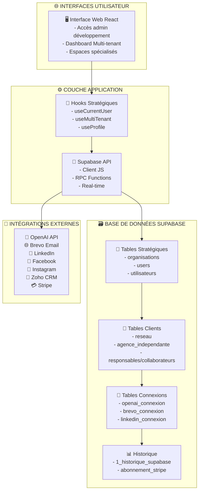

---

## 🏗️ ARCHITECTURE MULTI-TENANT

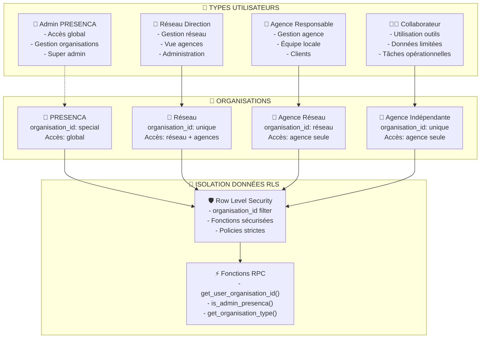

---

## 🗄️ ARCHITECTURE BASE DE DONNÉES

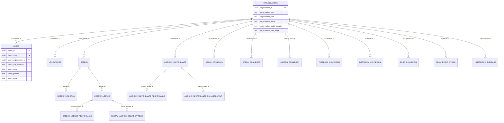

---

## 🔄 FLUX D'AUTHENTIFICATION ACTUEL

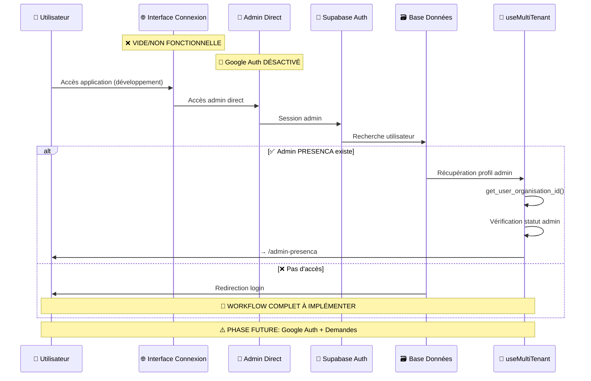

---

## 💻 INTERFACES UTILISATEUR - POINTS D'ENTRÉE

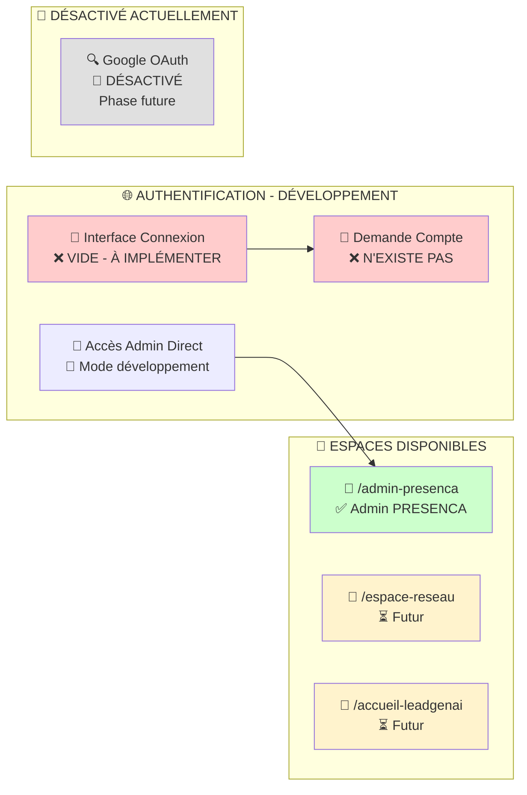

---

## 🏪 INTERFACE ESPACE CLIENT

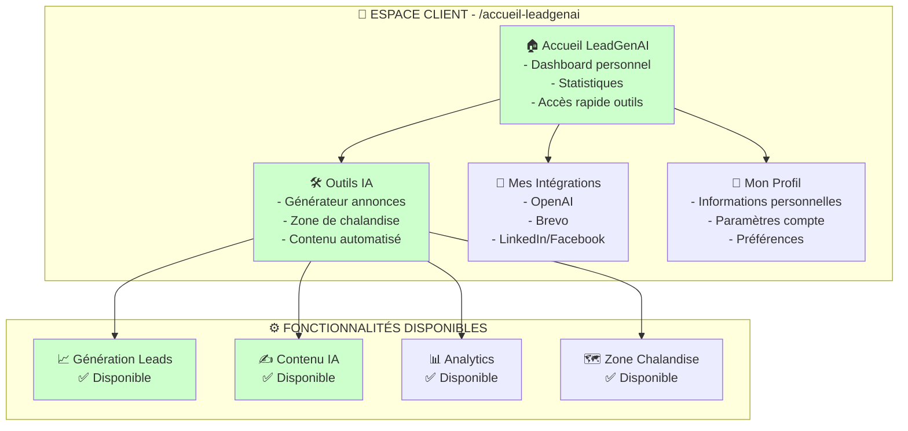

---

## 👑 INTERFACE ADMIN PRESENCA

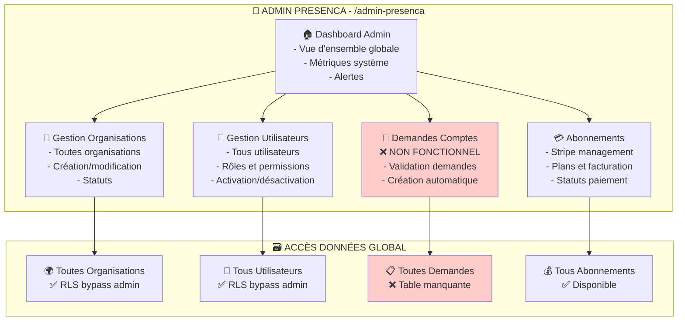

---

## 🔧 INTERFACE ADMIN PRESENCA - Création Comptes

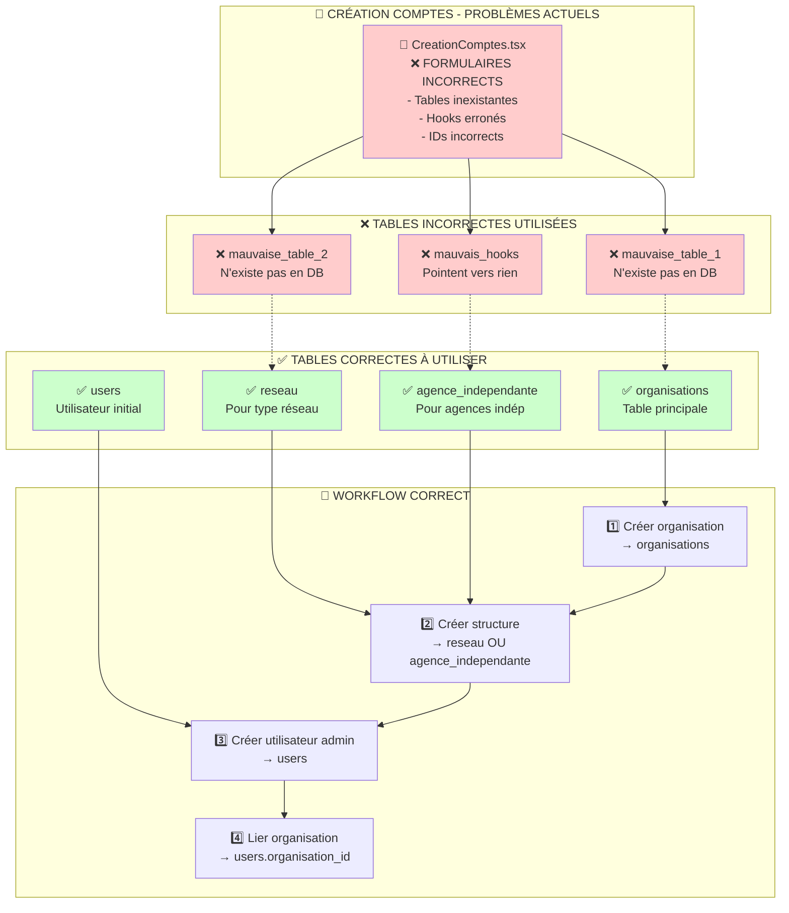

---

## 📝 INTERFACE ADMIN PRESENCA - Demandes Ouverture

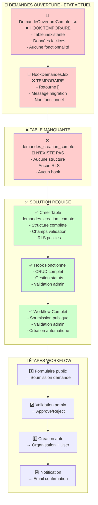

---

## 🚨 PROBLÈMES CRITIQUES IDENTIFIÉS

| 🔴 **CRITIQUE** | 📍 **LOCALISATION** | ❌ **PROBLÈME** | ✅ **SOLUTION** |
|----------------|-------------------|-----------------|-----------------|
| **Interface Connexion** | `/components/INTERFACE-CONNEXION` | Dossier vide/non fonctionnel | Implémenter formulaire complet |
| **Table Demandes** | `demandes_creation_compte` | Table n'existe pas | Créer table + RLS + hooks |
| **Formulaires Admin** | `CreationComptes.tsx` | Tables/hooks incorrects | Corriger noms tables/IDs |
| **Hook Demandes** | `HookDemandes.tsx` | Hook temporaire factice | Implémenter CRUD réel |

---

## 🎯 PLAN D'ACTION PRIORISÉ

### 🥇 **PHASE 1 - DEMANDES CRÉATION COMPTE** *(URGENT)*
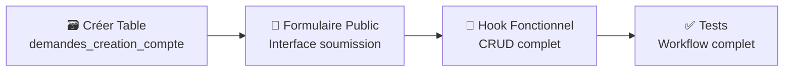

### 🥈 **PHASE 2 - CORRECTION FORMULAIRES ADMIN**
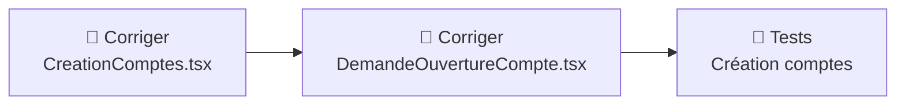

### 🥉 **PHASE 3 - VALIDATION MULTI-TENANT**
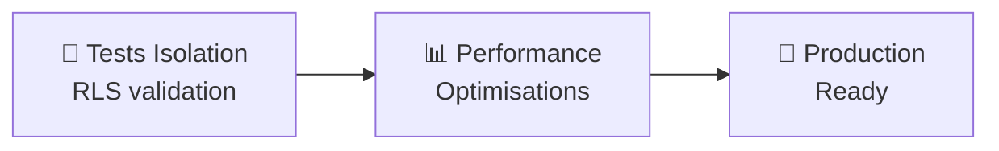

### 🔮 **PHASE FUTURE - AUTHENTIFICATION CLIENT**
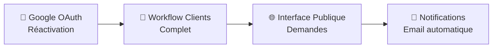

---

**🏁 PRÊT POUR PHASE 1 : Création table `demandes_creation_compte` et formulaire public**
**📝 MODE DÉVELOPPEMENT : Accès admin direct uniquement - Google Auth désactivé**
